# Barrier-less Rescaling in Charm++

How a running Charm++ job shrinks (or expands) **without stopping at an
iteration boundary** — the application keeps executing entry methods right up
to a millisecond-scale transport cut, and resumes from live in-memory state on
the other side. Status as of 2026-08-24. Companion documents:
`SHRINK_EXPAND_ARCHITECTURE.md` (the no-restart runtime mechanics this builds
on) and `RESCALE_KNOWN_ISSUES.md` (latent issues and their status).

---

## 1. The two modes, and when barrier-less applies

The runtime has two ways to land a rescale:

- **Boundary consensus (default, primary).** The application declares
  iteration boundaries (`checkRescale(iter)` + `AtSync`). A three-phase
  protocol (RescaleTentative / RescaleFinal / RescaleCommit) agrees on a
  future iteration; every chare arrives there, loads are measured at a clean
  point, and the balancer runs a **full strategy**. This is primary because
  post-shrink balance quality depends on accurate loads.
- **Barrier-less (`+rescalebarrierless`).** For applications with no usable
  boundaries. The rescale round starts immediately, mid-flight, and moves
  **only** the objects that must move.

The two mechanisms are exclusive by construction: with the flag set, the
boundary consensus never starts (no tentative broadcast, so no arming ever
happens and `checkRescale()` stays false); without it, the barrier-less round
never starts. Two paths never race for one pending request.

An application using barrier-less mode must tolerate message reordering
across the cut (in-flight messages are preserved, but their interleaving with
post-restore execution is not the pre-cut interleaving).

---

## 2. Timeline of a barrier-less shrink

At a glance (green = application running, red = stop window, blue = restore):

```mermaid
flowchart TD

subgraph A["PHASE A — APPLICATION RUNNING"]
  A1["CCS set_bitmap → PE 0 realloc()"] --> A2["doom announcement: avail bitmap → every PE"]
  A2 --> A3["ArmRescalePoint → StartLB: immediate LB round"]
  A3 --> A4["stats + load snapshots (applyLoadSnapshot)"]
  A4 --> A5["evacuate-only placement on PE 0 — survivors keep their objects"]
  A5 --> A6["ApplyDecision → migrate doomed-PE objects (anytime migration)"]
  A6 --> A7["MigrationDone barrier"]
  A7 --> A8["quiet probe: p2p to all PEs, direct reports to PE 0"]
  A8 --> Q{"sent == arrived for every doomed PE?"}
  Q -- "no · next tick" --> A8
  Q -- "ceiling passed · warn" --> B1
  Q -- "yes · one matched round" --> B1
end

subgraph B["PHASE B — THE CUT"]
  B1["CkArmRescaleCut: publish avail, arm rescale-pending, stash resume cb — nothing saved"]
  B1 --> B2["ConverseCleanup: doomed PEs flush held reduction state upward, enter pass-through"]
  B2 --> B3["survivors repoint handlers to buffering"]
  B3 --> B4["global flush: drain / barrier / allreduce until stable twice — doomed PEs pump"]
  B4 --> B5["coordinator COMMIT: epoch++, renumber"]
  B5 --> D{"departing?"}
  D -- "yes" --> X["exit(0)"]
  D -- "no" --> B6["reconfigure_peers (surgical) + longjmp"]
end

subgraph C["PHASE C — RESTORE (survivors)"]
  B6 --> C1["early init replay: identical handler registration"]
  C1 --> C2["group resets: reduction trees rebuilt + rebased, locations re-keyed + informed"]
  C2 --> C3["buffered-message drain: stale-balancer filter, generation translation"]
  C3 --> C4["re-drive completable reductions"]
  C4 --> C5["replay deferred rescale request, if any"]
end

C5 --> Z["application continues — it was never suspended"]

classDef run fill:#E7F2EA,stroke:#2E7D4F,color:#1B1E22
classDef cut fill:#F7E8E3,stroke:#B3402A,color:#1B1E22
classDef res fill:#E6EEF5,stroke:#2C5F8A,color:#1B1E22
classDef dec fill:#F6EDD8,stroke:#B07C10,color:#1B1E22
classDef term fill:#2E7D4F,stroke:#2E7D4F,color:#FFFFFF
classDef exit fill:#5C6066,stroke:#5C6066,color:#FFFFFF
class A1,A2,A3,A4,A5,A6,A7,A8 run
class B1,B2,B3,B4,B5,B6 cut
class C1,C2,C3,C4,C5 res
class Q,D dec
class Z term
class X exit
```

Everything through step 6 happens **while the application is running**.

### 2.1 Request

An external agent (the elastic scheduler, or `shrink.py` in testing) sends a
CCS `set_bitmap` request to PE 0. The handler (`manager.C: realloc()`):

1. Computes the new availability bitmap (a zero per doomed PE) and installs
   it locally (`set_avail_vector`), snapshotting it into `se_avail_snapshot`
   (PE-0 authoritative copy).
2. **Doom announcement**: broadcasts the bitmap to every PE
   (`LBManager::RescaleAnnounceDoom`), so all PEs' avail vectors and the
   drain protocol have a consistent doomed list while the app runs.
3. Sets `pending_realloc_state` (SHRINK/EXPAND `_MSG_RECEIVED`) and calls
   `ArmRescalePoint`.

If a load-balancing step is already in flight, the request is buffered
(`bufferRealloc`) and replayed when the step ends — one round owns
`pending_realloc_state` at a time.

### 2.2 Immediate LB round

With `+rescalebarrierless`, `ArmRescalePoint` skips the consensus entirely:
it raises `lb_in_progress`, marks `_rescaleBarrierlessRound`, and calls
`StartLB()` — a manual CentralLB round starts now. Chares are not paused;
stats are collected from the running application.

Concurrent LB rounds are excluded in both directions. A rescale request that
arrives while a regular step is running is buffered (`bufferRealloc`) and
replayed when the step's `ResumeClients` runs. A regular step (periodic
timer, or an AtSync barrier in a mixed app) that tries to start while a
rescale is pending or in flight is dropped at `CentralLB::CheckForLB` with
"Deferring a regular LB step" — the rescale round itself never passes
through `CheckForLB` (it starts via `StartLB → ProcessAtSync`), so the gate
can never block it. A dropped periodic step re-arms its timer after the
restore; chares held at a dropped round's barrier are released by the
held-aware resume (§6).

### 2.3 Load snapshots

`CentralLB::applyLoadSnapshot` runs before the strategy. A rescale round's
measurement window is arbitrarily short (chares are mid-iteration), so if the
live window is shorter than half the last well-measured window, per-object
loads are substituted from that snapshot. A normally-timed round becomes the
new snapshot. This gives the placer honest per-object weights regardless of
when the request lands.

### 2.4 Evacuate-only placement

Barrier-less rounds do **not** run the full strategy. Survivor chares stay
where they are; only doomed-PE objects move
(`GreedyRefineCentralLB::rescaleEvacuateOnly`): objects on doomed PEs, taken
largest-first, each go to the currently least-loaded survivor (background
load + resident object wallTimes, snapshot-substituted).

Rationale: a survivor-to-survivor move buys nothing a later regular LB step
cannot, extends the window the doomed PEs must stay alive, and enlarges the
correctness surface (location churn, reduction contributor churn) for zero
shrink benefit. The resulting imbalance is "greedy spread on top of an
already-balanced state" and is repaired by the next LB step, if any.

Mechanically: the placer runs only on PE 0 (guard:
`_rescaleBarrierlessRound && (pending_realloc_state & SHRINK_MSG_RECEIVED)`,
both PE-0 state, where the doom bitmap is authoritative). Other solver PEs
run the normal concurrent strategy and are ignored: `receiveSolutions`
force-picks PE 0's solution for rescale rounds. `ApplyDecision` keeps a
backstop that redirects anything a strategy left on an unavailable PE.

### 2.5 Evacuation, overlapped

`ApplyDecision` broadcasts the migrate message; doomed-PE elements are packed
and shipped by the ordinary anytime-migration machinery — each element
migrates between its entry-method executions, while every other chare keeps
computing. Messages that arrive for an already-departed element are forwarded
by the doomed PE's (still live) location layer. The `MigrationDone` barrier
fires when every ordered migration has landed.

### 2.6 The quiet drain (replaces the old flat grace)

After `MigrationDone`, `CheckForRealloc` on PE 0 starts the **quiet watch**
(`StartRescaleQuietWatch`) instead of sleeping a fixed 100 ms. The question
it answers: *has point-to-point traffic toward every doomed PE drained?* —
i.e. the forwards and location repairs its evacuated elements left behind
have all landed.

The measurement, in reconverse (`convcore.cpp`):

- Every AM send bumps a per-destination counter `se_sentToNode[dest]`, and
  every arrival bumps `se_p2pRecv` — **both excluding broadcast-relay
  messages** (`Cmi_bcastHandler` / `Cmi_nodeBcastHandler`). The exclusion is
  essential: an application that broadcasts every iteration keeps every PE —
  doomed ones included — in the relay tree until the cut, so broadcast
  traffic toward a doomed PE *never* stops. In-flight broadcasts are drained
  by the cut's global flush regardless; only p2p drain is the signal.
  API: `CmiRescaleAmSentTo(node)`, `CmiRescaleAmRecvP2p()`.

The protocol (`CentralLB::RescaleQuietProbe` / `RescaleQuietReport`):

- PE 0 sends a **point-to-point** probe to every PE (deliberately not a
  broadcast: a relayed copy is counted by the relaying PE *after* that PE has
  already sampled, a one-message skew that never settles).
- Each PE replies **directly** to PE 0 with its `sentTo[d]` for each doomed
  `d` (and, on a doomed PE, its own p2p arrival counter). Deliberately not a
  `contribute()`: a group reduction routes kid contributions *through*
  interior PEs — a doomed interior PE among them — generating exactly the
  traffic being measured, and each reduction's `ReductionStarting` chatter
  re-arms it every round.
- PE 0 sums the reports. When, for every doomed `d`,
  `sum(sentTo[d]) == arrived[d]`, everything sent toward the doomed PEs has
  arrived — **one matched round fires the cut**. Quiet is a trigger, not a
  safety condition; the cut's flush drains whatever is still in flight.
- An unmatched round re-probes after a Ccd tick (~10 ms real granularity).
  The old grace value (`+RescaleGraceMs`, default 100) survives only as a
  ceiling: past it, the cut fires anyway with a warning.

Measured over 50 cuts: min 0.20 ms, median 6.2 ms, max 41.6 ms, zero ceiling
hits — against the previous flat 100 ms (measured 108–113 ms).

### 2.7 The cut

Nothing is checkpointed. Survivor state — heap, groups, chares, queued
messages — stays live in memory across the cut; there is no save/restore
pair anywhere in this path. The **cut arming step** (`CkArmRescaleCut`,
formerly named `CkStartRescaleCheckpoint` in the kill-and-restart era)
publishes the availability vector to every PE's exit path, sets the
rescale-pending flags, hands reconverse the membership decision
(`CmiRescaleRequest`), and stashes the post-restore resume callback —
nothing is written anywhere (the log line: `Rescale cut armed (nothing
saved)`).

Arming → `WillIbekilled` (each PE learns its new number from the bitmap) →
`StartCleanup` → `CkCleanup` → reconverse `ConverseCleanup`:

1. **Doomed-exit flush hook** (`CmiRescaleDoomedFlushFn` →
   `CkRescaleFlushDoomedReductions`): each departing PE forwards every held
   reduction message to its tree parent — see §4.
2. **Handler repoint** (`_rescaleExitRepointHandlers`): survivors switch
   `_charmHandlerIdx` to a buffering handler (`_buffQ` survives the longjmp);
   departing PEs keep handlers live so they can still forward.
3. **Global flush**: rounds of drain / barrier /
   `allreduceSumLong({sent, arrived, pumped})` until the cluster-wide send
   and arrival counters agree twice with nothing pumped. Departing PEs pump
   their own queues each round (`CmiRescalePumpQueuesOnce`), so a queued
   stray triggers its forward while the transport still includes everyone.
   Counters then reset (`CmiRescaleResetAmCounters`) — a departing process
   takes its share of both sums with it, so zero is the one agreed value.
4. **Commit**: node 0 drives the coordinator COMMIT (epoch bump, kill list,
   admissions). Departing processes wait for DIE and exit. Survivors apply
   the membership delta, reconfigure the comm backend, and **longjmp** back
   into `charm_main` with heap, groups, and chares intact.

   The reconfigure is *surgical at the connection level*: LCI's
   `reconfigure_peers` carries surviving peers' address-vector entries
   across unchanged (a kept entry is a completed connection handshake) and
   closes only the departed ones — that is what lets a newcomer wire up
   before the commit and keep those connections after it. What is **not**
   surgical, and why the flush must empty every channel first —
   survivor-to-survivor included — is the identity change around the
   connections: every rank is renumbered in one atomic step
   (`set_rank_info`) and the collective sequence number is reset to bring
   newcomers into step, and both assume empty channels (LCI's own comment:
   "the membership change is the one moment when nothing is in flight"). A
   message straddling the cut would carry old-rank addressing into a
   renumbered world. Letting survivor traffic *flow through* the cut would
   require era-tolerant addressing in the receive path plus
   collective-sequence isolation, and would save only the microseconds the
   flush costs — the connection state it might seem to protect already
   survives.

### 2.8 Restore

Survivors re-run early init (handler registration must replay identically —
see the init-gating notes in `SHRINK_EXPAND_ARCHITECTURE.md`), then
`CkRestartMain` / `CkRecvGroupROData` drives, in order:

1. **Group resets**, per group:
   - `CkReductionMgr::resetReductionForRescale` — rebuild the spanning tree
     over the new PE set, rebase counters (`gcount = lcount`, clear
     `adjVec`), set `postRescaleRound` (§4).
   - `CkLocMgr::resetForRescale` — refresh map bins for the new `CkNumPes()`,
     wipe the location cache (epoch-generation floor prevents dead-world
     updates from re-poisoning it), re-key local element ids under the new
     home encoding (plus each array's `localElems` and the PE-level
     `array_objs` hash), clear the buffered *location-request* tables (their
     recorded requester PEs use dead-world numbering), re-publish every local
     element to its new home, and schedule one idempotent re-inform sweep.
   - LBManager / CkSyncBarrier / CentralLB migration-counter resets, avail
     reset, `lb_in_progress` clear, timer-epoch preservation.
2. **Buffered-message drain** (`_resumeBufferedCharmMessages`): everything
   the buffering handler collected since the longjmp landing is delivered —
   after the resets, so location informs repair caches first. A filter drops
   old-world load-balancer protocol fragments (gid = `_lbmgr` /
   `loadbalancer`); dead-world *location requests* are range-guarded at the
   reply site instead.
3. **`CkDriveReductionsAfterRescale`**: re-drives any reduction round left
   completable by the tree shrink (§4).
4. **Deferred request replay** (`CkArmDeferredRescalePoint`): a rescale
   request that arrived mid-rescale starts its round now.
5. Resume: for a barrier-less shrink nothing was ever suspended — the drain
   itself resumes execution. (`_rescaleResumeCb` = `ResumeClients` is
   effectively a no-op here; on expand it is `StartLB`, the populate round.)

First rescale in a job costs ~25 ms (one-time isomalloc re-sync); steady
state ~8 ms for the stop window itself.

---

## 3. Why messages survive the cut

Every message in flight at the cut falls into one of these classes:

| Class | What happens |
|---|---|
| survivor → survivor, arrived | Sits in the survivor's queue across the longjmp; delivered by the post-restore drain. |
| survivor → survivor, in flight | Counted; the exit flush does not converge until it arrives. |
| survivor → doomed (element already evacuated) | Arrives at the doomed PE, whose pump delivers it; the location layer forwards it to the element's new host — a counted send the flush also waits for. |
| doomed → survivor | Evacuation payloads, forwards, flushed reduction state; all counted, all drained. |
| broadcast relays via a doomed PE | Relay happens when the holding PE *processes* the message, so the pump triggers forwarding; forwarded copies are counted sends. |
| old-world stragglers after restore | Era rules: dead-generation location updates rejected by the epoch floor; dead-world element ids stripped to the by-index path; dead-world requester PEs range-guarded; reduction messages generation-translated or dropped (§4). |

Two identities change at the cut and get first-class treatment:

- **Element ids** encode a home PE. After the cut, an id minted in the old
  world may encode a home that was renumbered or removed.
  `CkArray::handleUnknown` restamps an era-mismatched id to the current
  world's id when it can compute it, and strips an id whose embedded home is
  out of range entirely (falling back to the by-index protocol, whose home is
  a pure function of the current world). `CkLocCache::requestLocation`
  refuses to send to an out-of-range decoded home as a backstop.
- **PE numbers** shift for every PE above an interior hole (removing PE 4 of
  8 renumbers 5,6,7 → 4,5,6). Anything that recorded a PE number before the
  cut and uses it after must translate or drop: buffered location-request
  requester lists are dropped (requesters re-request), replayed request
  messages are range-guarded, and reduction `fromPE` stamps are translated
  (§4). *Every tail-only shrink test masks this class of bug — the survivor
  mapping is the identity when only the last PEs leave. Test interior holes.*

---

## 4. Reductions across the cut

The hardest state to carry across a barrier-less cut is a reduction round in
flight — by design the application may be mid-`contribute` on every PE at the
moment of the cut. The machinery, in the order it fires:

1. **Doomed-exit flush** (`flushForDoomedExit`, at cut time on departing
   PEs). An interior tree node may hold child A's subtree message while
   waiting on child B; that partial is *state*, invisible to the transport
   flush, and would die with the PE. Instead the departing PE forwards every
   held message to its tree parent: kid subtree messages **as-is, preserving
   their `fromPE`** (that identity is what the parent's completion gate will
   match), local contributions merged into one partial stamped with the
   doomed PE, future-round messages forwarded to be future-queued. The
   manager then enters pass-through: stragglers arriving during the exit
   pump relay upward unmerged. Chains of doomed PEs compose hop by hop.
2. **Generation stamp** (`CkReductionMsg::worldGen`). Every reduction message
   is stamped with the membership generation it was built in. On receive, a
   previous-generation message has its `fromPE` translated through the
   old→new survivor mapping (`CmiRescaleOldPeToNew`, derived from the
   availability vector that drove the cut); a doomed sender maps to −1, which
   no gate consults; anything two or more generations old is dropped.
3. **Tree rebuild + counter rebase** (restore time, survivors).
   `rebuildTreeForRescale` re-derives the tree over the new PE set;
   `rebaseCountersForRescale` sets `gcount = lcount` and clears the
   adjustment vector — old-world subtree gcounts held in queued messages are
   inherently era-mixed with the rebased local counters, which is why the
   spanning round cannot use ordinary count arithmetic.
4. **Per-kid completion gate** (`postRescaleRound`, first round completed
   after the rebase). `nRemote` counts old-tree messages while `treeKids()`
   is the new tree, so the count comparison is meaningless across the cut.
   Instead the round completes only when every *current-tree* kid has
   actually delivered a message this round (`kidsSeen`, recorded from each
   message's — translated — `fromPE`) or has declared itself inactive. At the
   root, the era-mixed `totalElements` arithmetic is bypassed for this one
   round: with every kid present and all locals in, `nSources()` is the
   truth.
5. **Re-drive** (`CkDriveReductionsAfterRescale`, end of restore). A round
   whose gate became satisfiable when the tree lost a doomed child is never
   re-evaluated by anything else; the sweep calls `finishReduction` on every
   manager (a no-op unless a round is in progress) after the buffered drain,
   so the application's callback fires only once the world is whole.

Group (non-array) reductions instead flush fully (`flushStates`) — runtime
protocols restart from scratch; an application Group must not span the cut
with its own reduction (`RESCALE_KNOWN_ISSUES.md` R5). Nodegroup reductions
have none of this machinery yet (R4).

---

## 5. Expand, and mixed requests

A pure expand in barrier-less mode is simpler: no doomed PEs, so the pre-cut
round has nothing to evacuate (the quiet watch settles immediately — the
doomed list is empty), and the cut admits the newcomers the coordinator has
queued. The interesting work is post-restore: `_rescaleResumeCb` is
`LBManager::StartLB`, so a **populate round** runs after the newcomers are
integrated — a regular live LB round that migrates objects onto the empty
PEs, using snapshot loads (§2.3) since its measurement window is the seconds
the restore took. The application runs throughout; only the cut stops it.

A combined shrink+expand request takes the shrink machinery pre-cut and the
populate round post-restore.

Newcomer integration itself (group/RO broadcast from PE 0, handler-index
alignment, CUPTI/GPU warmup before admission) is covered in
`SHRINK_EXPAND_ARCHITECTURE.md`.

---

## 6. Boundary mode now shares the back half

Since the drain/cut machinery matured, boundary mode reuses it: after the
boundary decision and evacuation, **early release** resumes every chare
before the drain and cut (`RescaleEarlyResume` — a handshaked broadcast, so
no resume message can be in flight at the cut; the post-restore resume is
**held-aware**: `ResumeClientsIfHeld` releases clients only where a full
local barrier is actually pending — a blanket `resumeClients` would fire
spurious `ResumeFromSync` on running chares, and a silent no-op would strand
chares held at a racing LB round's barrier that the cut beheaded).
The boundary cut then goes through the same quiet watch. The old
hold-everything behavior is available with `+rescaleholdboundary`. Expand
keeps the hold (its populate round resumes clients at its own end).

The modes now differ only in their front half: *how the decision is reached
and measured* (consensus at a boundary + full strategy, vs. immediate +
evacuate-only).

---

## 7. Flags, knobs, diagnostics

| Flag | Meaning |
|---|---|
| `+rescalebarrierless` | Enable barrier-less rescaling (and disable boundary consensus). Default off. |
| `+rescaleholdboundary` | Boundary mode only: old behavior, hold all chares through migration and cut. |
| `+RescaleGraceMs <n>` | Ceiling for the quiet drain (default 100 ms). `0` disables the drain entirely (immediate cut). |
| `+RescaleLead <n>` | Boundary mode: iterations of lead in the tentative bid (default 3). |
| `+balancer GreedyRefineCentralLB` | The rescale-aware balancer (CentralLB path). Not GreedyRefineLB/TreeLB — its stats pup is rescale-unsafe. |

Diagnostics: `+LBDebug 1` prints the placer, drain, and cut decisions;
`+LBDebug 2` adds per-round probe deficits. `SIGUSR1` dumps converse-level
state (phase, AM counters, queue depths); `SIGUSR2` dumps Charm-level rescale
state (location manager, per-manager reduction protocol state, per-element
contributor `redNo`).

Requirements: launch with a coordinator (`+coordinator host:port` via
`charmrun_elastic`), a comm backend implementing the rescale hooks (LCI), and
never mark PE 0 for removal.

---

## 8. Where the time goes (4-PE local measurements)

| Segment | Cost | Notes |
|---|---|---|
| Decision + evacuation | overlapped | Application keeps running. |
| Quiet drain | 0.2–42 ms, median 6 | Was a flat 100 ms grace. Ceiling-capped. |
| Stop window (flush → reconfigure → longjmp → restore) | ~8 ms steady | ~25 ms on a job's first rescale (isomalloc re-sync). |
| Post-restore (expand) populate round | overlapped | Regular live LB round. |

---

## 9. Known limitations

See `RESCALE_KNOWN_ISSUES.md` for the live list. Highlights: only the first
post-rescale reduction round gets the per-kid gate (pipelined/streamable
reductions unhandled, R3); nodegroup reductions have no rescale machinery
(R4); an element that contributes and then migrates inside the evacuation
window can wedge the spanning round's local gate (R6, unobserved); newcomer
broadcast-epoch alignment is unaudited under broadcast-across-cut traffic
(B1). The doomed-exit reduction flush fires only when a departing PE actually
holds state at the cut — it has been observed firing and passing, but a
dedicated stress that forces a held partial does not exist yet.
