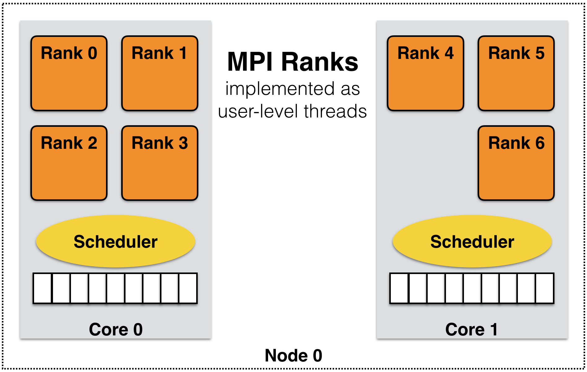
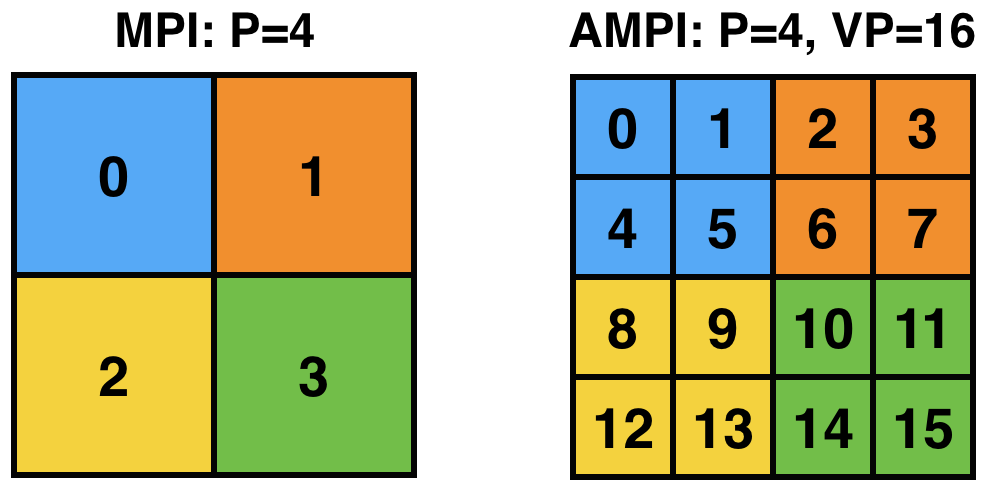
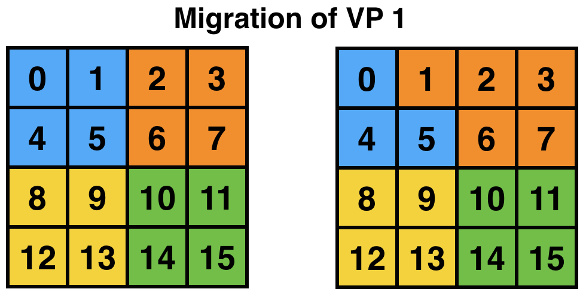

Introduction
============

This manual describes Adaptive MPI (AMPI), which is an implementation of
the MPI standard on top of Charm++. AMPI acts as a regular MPI
implementation (akin to MPICH, OpenMPI, MVAPICH, etc.) with several
built-in extensions that allow MPI developers to take advantage of
Charm++’s dynamic runtime system, which provides support for process
virtualization, overlap of communication and computation, load
balancing, and fault tolerance with zero to minimal changes to existing
MPI codes.

In this manual, we first describe the philosophy behind Adaptive MPI,
then give a brief introduction to Charm++ and rationale for AMPI. We
then describe AMPI in detail. Finally we summarize the changes required
for existing MPI codes to run with AMPI. Appendices contain the details
of installing AMPI, and building and running AMPI programs.

.. note:: Currently, AMPI supports the MPI-2.2 standard, and the MPI-3.1
   standard is under active development, though we already support
   non-blocking and neighborhood collectives among other MPI-3.1
   features.

Overview
--------

Developing parallel Computational Science and Engineering (CSE)
applications is a complex task. One has to implement the right physics,
develop or choose and code appropriate numerical methods, decide and
implement the proper input and output data formats, perform
visualizations, and be concerned with correctness and efficiency of the
programs. It becomes even more complex for multi-physics coupled
simulations, many of which are dynamic and adaptively refined so that
load imbalance becomes a major challenge. In addition to imbalance
caused by dynamic program behavior, hardware factors such as latencies,
variability, and failures must be tolerated by applications. Our
philosophy is to lessen the burden of application developers by
providing advanced programming paradigms and versatile runtime systems
that can handle many common programming and performance concerns
automatically and let application programmers focus on the actual
application content.

Many of these concerns can be addressed using the processor
virtualization and over-decomposition philosophy of Charm++. Thus, the
developer only sees virtual processors and lets the runtime system deal
with underlying physical processors. This is implemented in AMPI by
mapping MPI ranks to Charm++ user-level threads as illustrated in Figure
:numref:`fig_virt`. As an immediate and simple benefit, the
programmer can use as many virtual processors ("MPI ranks") as the
problem can be easily decomposed to. For example, suppose the problem
domain has :math:`n*2^n` parts that can be easily distributed but
programming for general number of MPI processes is burdensome, then the
developer can have :math:`n*2^n` virtual processors on any number of
physical ones using AMPI.

.. _fig_virt:

   MPI ranks are implemented as user-level threads in AMPI rather than
   Operating System processes.

AMPI’s execution model consists of multiple user-level threads per
Processing Element (PE). The Charm++ scheduler coordinates execution of
these user-level threads (also called Virtual Processors or VPs) and
controls execution. These VPs can also migrate between PEs for the
purpose of load balancing or other reasons. The number of VPs per PE
specifies the virtualization ratio (degree of over-decomposition). For
example, in Figure :numref:`fig_virt` the virtualization ratio
is :math:`3.5` (there are four VPs on PE 0 and three VPs on PE 1).
Figure :numref:`fig_prac` shows how the problem domain can be
over-decomposed in AMPI’s VPs as opposed to other MPI implementations.

.. _fig_prac:

   The problem domain is over-decomposed to more VPs than PEs.

Another benefit of virtualization is communication and computation
overlap, which is automatically realized in AMPI without programming
effort. Techniques such as software pipelining require significant
programming effort to achieve this goal and improve performance.
However, one can use AMPI to have more virtual processors than physical
processors to overlap communication and computation. Each time a VP is
blocked for communication, the Charm++ scheduler picks the next VP among
those that are ready to execute. In this manner, while some of the VPs
of a physical processor are waiting for a message to arrive, others can
continue their execution. Thus, performance improves without any changes
to the application source code.

Another potential benefit is that of better cache utilization. With
over-decomposition, a smaller subdomain is accessed by a VP repeatedly
in different function calls before getting blocked by communication and
switching to another VP. That smaller subdomain may fit into cache if
over-decomposition is enough. This concept is illustrated in Figure
:numref:`fig_virt` where each AMPI rank’s subdomain is smaller
than the corresponding MPI subdomain and so may fit into cache memory.
Thus, there is a potential performance improvement without changing the
source code.

One important concern is that of load imbalance. New generation parallel
applications are dynamically varying, meaning that processors’ load is
shifting during execution. In a dynamic simulation application such as
rocket simulation, burning solid fuel, sub-scaling for a certain part of
the mesh, crack propagation, particle flows all contribute to load
imbalance. A centralized load balancing strategy built into an
application is impractical since each individual module is developed
mostly independently by various developers. In addition, embedding a
load balancing strategy in the code complicates it greatly, and
programming effort increases significantly. The runtime system is
uniquely positioned to deal with load imbalance. Figure
:numref:`fig_migrate` shows the runtime system migrating a VP
after detecting load imbalance. This domain may correspond to a weather
forecast model where there is a storm cell in the top-left quadrant,
which requires more computation to simulate. AMPI will then migrate VP 1
to balance the division of work across processors and improve
performance. Note that incorporating this sort of load balancing inside
the application code may take a lot of effort and complicate the code.

.. _fig_migrate:

   AMPI can migrate VPs across processes for load balancing.

There are many different load balancing strategies built into Charm++
that can be selected by an AMPI application developer. Among those, some
may fit better for a particular application depending on its
characteristics. Moreover, one can write a new load balancer, best
suited for an application, by the simple API provided inside Charm++
infrastructure. Our approach is based on actual measurement of load
information at runtime, and on migrating computations from heavily
loaded to lightly loaded processors.

For this approach to be effective, we need the computation to be split
into pieces many more in number than available processors. This allows
us to flexibly map and re-map these computational pieces to available
processors. This approach is usually called "multi-domain
decomposition".

Charm++, which we use as a runtime system layer for the work described
here, simplifies our approach. It embeds an elaborate performance
tracing mechanism, a suite of plug-in load balancing strategies,
infrastructure for defining and migrating computational load, and is
interoperable with other programming paradigms.

Charm++
-------

Charm++ is an object-oriented parallel programming library for C. It
differs from traditional message passing programming libraries (such as
MPI) in that Charm++ is "message-driven". Message-driven parallel
programs do not block the processor waiting for a message to be
received. Instead, each message carries with itself a computation that
the processor performs on arrival of that message. The underlying
runtime system of Charm++ is called Converse, which implements a
"scheduler" that chooses which message to schedule next
(message-scheduling in Charm++ involves locating the object for which
the message is intended, and executing the computation specified in the
incoming message on that object). A parallel object in Charm++ is a C
object on which a certain computations can be asked to be performed from
remote processors.

Charm++ programs exhibit latency tolerance since the scheduler always
picks up the next available message rather than waiting for a particular
message to arrive. They also tend to be modular, because of their
object-based nature. Most importantly, Charm++ programs can be
*dynamically load balanced*, because the messages are directed at
objects and not at processors; thus allowing the runtime system to
migrate the objects from heavily loaded processors to lightly loaded
processors.

Since many CSE applications are originally written using MPI, one would
have to rewrite existing code if they were to be converted to Charm++ to
take advantage of dynamic load balancing and other Charm++ features.
This is indeed impractical. However, Converse - the runtime system of
Charm++ - supports interoperability between different parallel
programming paradigms such as parallel objects and threads. Using this
feature, we developed AMPI, which is described in more detail in the
next section.

AMPI
----

AMPI utilizes the dynamic load balancing and other capabilities of
Charm++ by associating a "user-level" thread with each Charm++
migratable object. User’s code runs inside this thread, so that it can
issue blocking receive calls similar to MPI, and still present the
underlying scheduler an opportunity to schedule other computations on
the same processor. The runtime system keeps track of the computational
loads of each thread as well as the communication graph between AMPI
threads, and can migrate these threads in order to balance the overall
load while simultaneously minimizing communication overhead.

MPI Standards Compliance
~~~~~~~~~~~~~~~~~~~~~~~~

Currently AMPI supports the MPI-2.2 standard, with preliminary support
for most MPI-3.1 features and a collection of extensions explained in
detail in this manual. One-sided communication calls in MPI-2 and
MPI-3 are implemented, but they do not yet take advantage of RMA
features.  Non-blocking collectives have been defined in AMPI since
before MPI-3.0’s adoption of them. ROMIO
(http://www-unix.mcs.anl.gov/romio/) has been integrated into AMPI to
support parallel I/O features.  However, ROMIO is not enabled by
default due to incompatibility with the strict requirements of GCC 14
(and above).  Add --with-romio to the build line and use a more
permissive compiler than GCC 14 to enable the ROMIO based I/O features.
