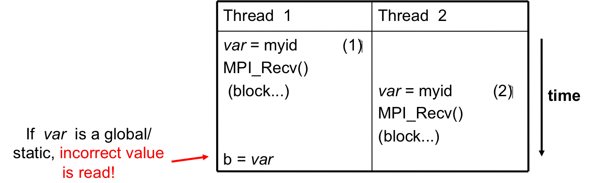

===================
Adaptive MPI (AMPI)
===================

.. contents::
   :depth: 3

Introduction
============

This manual describes Adaptive MPI (AMPI), which is an implementation of
the MPI standard [1]_ on top of Charm++. AMPI acts as a regular MPI
implementation (akin to MPICH, OpenMPI, MVAPICH, etc.) with several
built-in extensions that allow MPI developers to take advantage of
Charm++’s dynamic runtime system, which provides support for process
virtualization, overlap of communication and computation, load
balancing, and fault tolerance with zero to minimal changes to existing
MPI codes.

In this manual, we first describe the philosophy behind Adaptive MPI,
then give a brief introduction to Charm++ and rationale for AMPI. We
then describe AMPI in detail. Finally we summarize the changes required
for existing MPI codes to run with AMPI. Appendices contain the details
of installing AMPI, and building and running AMPI programs.

Overview
--------

Developing parallel Computational Science and Engineering (CSE)
applications is a complex task. One has to implement the right physics,
develop or choose and code appropriate numerical methods, decide and
implement the proper input and output data formats, perform
visualizations, and be concerned with correctness and efficiency of the
programs. It becomes even more complex for multi-physics coupled
simulations, many of which are dynamic and adaptively refined so that
load imbalance becomes a major challenge. In addition to imbalance
caused by dynamic program behavior, hardware factors such as latencies,
variability, and failures must be tolerated by applications. Our
philosophy is to lessen the burden of application developers by
providing advanced programming paradigms and versatile runtime systems
that can handle many common programming and performance concerns
automatically and let application programmers focus on the actual
application content.

Many of these concerns can be addressed using the processor
virtualization and over-decomposition philosophy of Charm++. Thus, the
developer only sees virtual processors and lets the runtime system deal
with underlying physical processors. This is implemented in AMPI by
mapping MPI ranks to Charm++ user-level threads as illustrated in Figure
:numref:`fig_virt`. As an immediate and simple benefit, the
programmer can use as many virtual processors ("MPI ranks") as the
problem can be easily decomposed to. For example, suppose the problem
domain has :math:`n*2^n` parts that can be easily distributed but
programming for general number of MPI processes is burdensome, then the
developer can have :math:`n*2^n` virtual processors on any number of
physical ones using AMPI.

.. _fig_virt:
.. figure:: figs/virtualization.png
   :width: 4.6in

   MPI ranks are implemented as user-level threads in AMPI rather than
   Operating System processes.

AMPI’s execution model consists of multiple user-level threads per
Processing Element (PE). The Charm++ scheduler coordinates execution of
these user-level threads (also called Virtual Processors or VPs) and
controls execution. These VPs can also migrate between PEs for the
purpose of load balancing or other reasons. The number of VPs per PE
specifies the virtualization ratio (degree of over-decomposition). For
example, in Figure :numref:`fig_virt` the virtualization ratio
is :math:`3.5` (there are four VPs on PE 0 and three VPs on PE 1).
Figure :numref:`fig_prac` shows how the problem domain can be
over-decomposed in AMPI’s VPs as opposed to other MPI implementations.

.. _fig_prac:
.. figure:: figs/prac.png
   :width: 4.6in

   The problem domain is over-decomposed to more VPs than PEs.

Another benefit of virtualization is communication and computation
overlap, which is automatically realized in AMPI without programming
effort. Techniques such as software pipelining require significant
programming effort to achieve this goal and improve performance.
However, one can use AMPI to have more virtual processors than physical
processors to overlap communication and computation. Each time a VP is
blocked for communication, the Charm++ scheduler picks the next VP among
those that are ready to execute. In this manner, while some of the VPs
of a physical processor are waiting for a message to arrive, others can
continue their execution. Thus, performance improves without any changes
to the application source code.

Another potential benefit is that of better cache utilization. With
over-decomposition, a smaller subdomain is accessed by a VP repeatedly
in different function calls before getting blocked by communication and
switching to another VP. That smaller subdomain may fit into cache if
over-decomposition is enough. This concept is illustrated in Figure
:numref:`fig_virt` where each AMPI rank’s subdomain is smaller
than the corresponding MPI subdomain and so may fit into cache memory.
Thus, there is a potential performance improvement without changing the
source code.

One important concern is that of load imbalance. New generation parallel
applications are dynamically varying, meaning that processors’ load is
shifting during execution. In a dynamic simulation application such as
rocket simulation, burning solid fuel, sub-scaling for a certain part of
the mesh, crack propagation, particle flows all contribute to load
imbalance. A centralized load balancing strategy built into an
application is impractical since each individual module is developed
mostly independently by various developers. In addition, embedding a
load balancing strategy in the code complicates it greatly, and
programming effort increases significantly. The runtime system is
uniquely positioned to deal with load imbalance. Figure
:numref:`fig_migrate` shows the runtime system migrating a VP
after detecting load imbalance. This domain may correspond to a weather
forecast model where there is a storm cell in the top-left quadrant,
which requires more computation to simulate. AMPI will then migrate VP 1
to balance the division of work across processors and improve
performance. Note that incorporating this sort of load balancing inside
the application code may take a lot of effort and complicate the code.

.. _fig_migrate:
.. figure:: figs/migrate.png
   :width: 4.6in

   AMPI can migrate VPs across processes for load balancing.

There are many different load balancing strategies built into Charm++
that can be selected by an AMPI application developer. Among those, some
may fit better for a particular application depending on its
characteristics. Moreover, one can write a new load balancer, best
suited for an application, by the simple API provided inside Charm++
infrastructure. Our approach is based on actual measurement of load
information at runtime, and on migrating computations from heavily
loaded to lightly loaded processors.

For this approach to be effective, we need the computation to be split
into pieces many more in number than available processors. This allows
us to flexibly map and re-map these computational pieces to available
processors. This approach is usually called "multi-domain
decomposition".

Charm++, which we use as a runtime system layer for the work described
here, simplifies our approach. It embeds an elaborate performance
tracing mechanism, a suite of plug-in load balancing strategies,
infrastructure for defining and migrating computational load, and is
interoperable with other programming paradigms.

Charm++
=======

Charm++ is an object-oriented parallel programming library for C. It
differs from traditional message passing programming libraries (such as
MPI) in that Charm++ is "message-driven". Message-driven parallel
programs do not block the processor waiting for a message to be
received. Instead, each message carries with itself a computation that
the processor performs on arrival of that message. The underlying
runtime system of Charm++ is called Converse, which implements a
"scheduler" that chooses which message to schedule next
(message-scheduling in Charm++ involves locating the object for which
the message is intended, and executing the computation specified in the
incoming message on that object). A parallel object in Charm++ is a C
object on which a certain computations can be asked to be performed from
remote processors.

Charm++ programs exhibit latency tolerance since the scheduler always
picks up the next available message rather than waiting for a particular
message to arrive. They also tend to be modular, because of their
object-based nature. Most importantly, Charm++ programs can be
*dynamically load balanced*, because the messages are directed at
objects and not at processors; thus allowing the runtime system to
migrate the objects from heavily loaded processors to lightly loaded
processors.

Since many CSE applications are originally written using MPI, one would
have to rewrite existing code if they were to be converted to Charm++ to
take advantage of dynamic load balancing and other Charm++ features.
This is indeed impractical. However, Converse - the runtime system of
Charm++ - supports interoperability between different parallel
programming paradigms such as parallel objects and threads. Using this
feature, we developed AMPI, which is described in more detail in the
next section.

AMPI
====

AMPI utilizes the dynamic load balancing and other capabilities of
Charm++ by associating a "user-level" thread with each Charm++
migratable object. User’s code runs inside this thread, so that it can
issue blocking receive calls similar to MPI, and still present the
underlying scheduler an opportunity to schedule other computations on
the same processor. The runtime system keeps track of the computational
loads of each thread as well as the communication graph between AMPI
threads, and can migrate these threads in order to balance the overall
load while simultaneously minimizing communication overhead.

AMPI Compliance to MPI Standards
--------------------------------

Currently AMPI supports the MPI-2.2 standard, with preliminary support
for most MPI-3.1 features and a collection of extensions explained in
detail in this manual. One-sided communication calls in MPI-2 and MPI-3
are implemented, but they do not yet take advantage of RMA features.
Non-blocking collectives have been defined in AMPI since before
MPI-3.0’s adoption of them. Also ROMIO [2]_ has been integrated into
AMPI to support parallel I/O features.

AMPI Extensions to MPI Standards
--------------------------------

The following are AMPI extensions to the MPI standard, which will be
explained in detail in this manual. All AMPI extensions to the MPI
standard are prefixed with ``AMPI_`` rather than ``MPI_``. All
extensions are available in C, C++, and Fortran, with the exception of
``AMPI_Command_argument_count`` and ``AMPI_Get_command_argument`` which
are only available in Fortran.

.. code-block:: none

   AMPI_Migrate          AMPI_Register_pup            AMPI_Get_pup_data
   AMPI_Migrate_to_pe    AMPI_Set_migratable          AMPI_Evacuate
   AMPI_Load_set_value   AMPI_Load_start_measure      AMPI_Load_stop_measure
   AMPI_Iget             AMPI_Iget_wait               AMPI_Iget_data
   AMPI_Iget_free        AMPI_Type_is_contiguous      AMPI_Register_main
   AMPI_Yield            AMPI_Suspend                 AMPI_Resume
   AMPI_Alltoall_medium  AMPI_Alltoall_long
   AMPI_Register_just_migrated         AMPI_Register_about_to_migrate
   AMPI_Command_argument_count         AMPI_Get_command_argument

AMPI provides a set of built-in attributes on all communicators and
windows to find the number of the worker thread, process, or host that a
rank is currently running on, as well as the total number of worker
threads, processes, and hosts in the job. We define a worker thread to
be a thread on which one of more AMPI ranks are scheduled. We define a
process here as an operating system process, which may contain one or
more worker threads. The built-in attributes are ``AMPI_MY_WTH``,
``AMPI_MY_PROCESS``, ``AMPI_NUM_WTHS``, and ``AMPI_NUM_PROCESSES``.
These attributes are accessible from any rank by calling
``MPI_Comm_get_attr``, such as:

.. code-block:: fortran

   ! Fortran:
   integer :: my_wth, flag, ierr
   call MPI_Comm_get_attr(MPI_COMM_WORLD, AMPI_MY_WTH, my_wth, flag, ierr)

.. code-block:: c++

   // C/C++:
   int my_wth, flag;
   MPI_Comm_get_attr(MPI_COMM_WORLD, AMPI_MY_WTH, &my_wth, &flag);

AMPI also provides extra communicator types that users can pass to
``MPI_Comm_split_type``: ``AMPI_COMM_TYPE_HOST`` for splitting a
communicator into disjoint sets of ranks that share the same physical
host, ``AMPI_COMM_TYPE_PROCESS`` for splitting a communicator into
disjoint sets of ranks that share the same operating system process, and
``AMPI_COMM_TYPE_WTH``, for splitting a communicator into disjoint sets
of ranks that share the same worker thread.

For parsing Fortran command line arguments, AMPI Fortran programs should
use our extension APIs, which are similar to Fortran 2003’s standard
APIs. For example:

.. code-block:: fortran

   integer :: i, argc, ierr
   integer, parameter :: arg_len = 128
   character(len=arg_len), dimension(:), allocatable :: raw_arguments

   call AMPI_Command_argument_count(argc)
   allocate(raw_arguments(argc))
   do i = 1, size(raw_arguments)
       call AMPI_Get_command_argument(i, raw_arguments(i), arg_len, ierr)
   end do

Name for Main Program
---------------------

To convert an existing program to use AMPI, the main function or program
may need to be renamed. The changes should be made as follows:

Fortran
~~~~~~~

You must declare the main program as a subroutine called "MPI_MAIN". Do
not declare the main subroutine as a *program* because it will never be
called by the AMPI runtime.

.. code-block:: fortran

   program pgm -> subroutine MPI_Main
       ...                       ...
   end program -> end subroutine

C or C++
~~~~~~~~

The main function can be left as is, if ``mpi.h`` is included before the
main function. This header file has a preprocessor macro that renames
main, and the renamed version is called by the AMPI runtime by each
thread.

Global Variable Privatization
-----------------------------

For the before-mentioned benefits to be effective, one needs to map
multiple user-level threads onto each processor. Traditional MPI
programs assume that the entire processor is allocated to themselves,
and that only one thread of control exists within the process’s address
space. So, they may safely use global and static variables in the
program. However, global and static variables are problematic for
multi-threaded environments such as AMPI or OpenMP. This is because
there is a single instance of those variables so they will be shared
among different threads in the single address space, so if programmers
are not careful a wrong result may be produced by the program. Figure
:numref:`fig_global` shows an example of a multi-threaded
application with two threads in a single process. :math:`var` is a
global or static variable in this example. Thread 1 assigns a value to
it, then it gets blocked for communication and another thread can
continue. Thereby, thread 2 is scheduled next and accesses :math:`var`
which is wrong. The semantics of this program needs separate instances
of :math:`var` for each of the threads. That is where the need arises to
make some transformations to the original MPI program in order to run
correctly with AMPI. Note, this is the only change necessary to run an
MPI program with AMPI, that the program be thread-safe and have no
global or static variables whose values differ across different MPI
ranks. Also note that global variables that are constant or are only
written to once to the same value across all ranks during initialization
are already thread-safe.

.. _fig_global:

   Mutable global or static variables are an issue for AMPI

The basic transformation needed to port the MPI program to AMPI is
privatization of global variables. With the MPI process model, each MPI
node can keep a copy of its own "permanent variables" - variables that
are accessible from more than one subroutines without passing them as
arguments. Module variables, "saved" subroutine local variables, and
common blocks in Fortran90 belong to this category. If such a program is
executed without privatization on AMPI, all the AMPI threads that reside
in the same process will access the same copy of such variables, which
is clearly not the desired semantics. To ensure correct execution of the
original source program, it is necessary to make such variables
"private" to individual threads. We provide three choices with varying
degrees of developer effort required and varying degrees of portability:
manual encapsulation of global state, a thread-local storage based
automated mechanism, and global offset table based automated mechanism.

Automatic Thread-Local Storage Swapping
~~~~~~~~~~~~~~~~~~~~~~~~~~~~~~~~~~~~~~~

Thread Local Store (TLS) was originally employed in kernel threads to
localize variables to threads and provide thread safety. It can be used
by annotating global/static variable declarations in C with
*thread_local*, in C with *__thread* or C11 with *thread_local* or
*_Thread_local*, and in Fortran with OpenMP’s *threadprivate*
attribute. OpenMP is required for using tlsglobals in Fortran code since
Fortran has no other method of using TLS. The *__thread* keyword is not
an official extension of the C language, though compiler writers are
encouraged to implement this feature.

It handles both global and static variables and has no context-switching
overhead. AMPI provides runtime support for privatizing thread-local
variables to user-level threads by changing the TLS segment register
when context switching between user-level threads. The runtime overhead
is that of changing a single pointer per user-level thread context
switch. Currently, Charm++ supports it for x86/x86_64 platforms when
using GNU compilers.

.. code-block:: c++

   // C/C++ example:
   int myrank;
   double xyz[100];

.. code-block:: fortran

   ! Fortran example:
   integer :: myrank
   real*8, dimension(100) :: xyz

For the example above, the following changes to the code handle the
global variables:

.. code-block:: c++

   // C++ example:
   thread_local int myrank;
   thread_local double xyz[100];

   // C example:
   __thread int myrank;
   __thread double xyz[100];

.. code-block:: fortran

   ! Fortran example:
   integer :: myrank
   real*8, dimension(100) :: xyz
   !$omp threadprivate(myrank)
   !$omp threadprivate(xyz)

The runtime system also should know that TLS-Globals is used at both
compile and link time:

.. code-block:: bash

   $ ampicxx -o example example.C -tlsglobals

Automatic Process-in-Process Runtime Linking Privatization
~~~~~~~~~~~~~~~~~~~~~~~~~~~~~~~~~~~~~~~~~~~~~~~~~~~~~~~~~~

Process-in-Process (PiP) [PiP2018]_ Globals allows fully automatic
privatization of global variables on GNU/Linux systems without
modification of user code. All languages (C, C++, Fortran, etc.) are
supported. This method currently lacks support for checkpointing and
migration, which are necessary for load balancing and fault tolerance.
Additionally, overdecomposition is limited to approximately 12 virtual
ranks per logical node, though this can be resolved by building a
patched version of glibc.

This method works by combining a specific method of building binaries
with a GNU extension to the dynamic linker. First, AMPI's toolchain
wrapper compiles your user program as a Position Independent Executable
(PIE) and links it against a special shim of function pointers instead
of the normal AMPI runtime. It then builds a small loader utility that
links directly against AMPI. For each rank, this loader calls the
glibc-specific function ``dlmopen`` on the PIE binary with a unique
namespace index. The loader uses ``dlsym`` to populate the PIE binary's
function pointers and then it calls the entry point. This ``dlmopen``
and ``dlsym`` process repeats for each rank. As soon as execution jumps
into the PIE binary, any global variables referenced within will appear
privatized. This is because PIE binaries locate the global data segment
immediately after the code segment so that PIE global variables are
accessed relative to the instruction pointer, and because ``dlmopen``
creates a separate copy of these segments in memory for each unique
namespace index.

Optionally, the first step in using PiP-Globals is to build PiP-glibc to
overcome the limitation on rank count per process. Use the instructions
at https://github.com/RIKEN-SysSoft/PiP/blob/pip-1/INSTALL to download
an installable PiP package or build PiP-glibc from source by following
the ``Patched GLIBC`` section. AMPI may be able to automatically detect
PiP's location if installed as a package, but otherwise set and export
the environment variable ``PIP_GLIBC_INSTALL_DIR`` to the value of
``<GLIBC_INSTALL_DIR>`` as used in the above instructions. For example:

.. code-block:: bash

   $ export PIP_GLIBC_INSTALL_DIR=~/pip

To use PiP-Globals in your AMPI program (with or without PiP-glibc),
compile and link with the ``-pipglobals`` parameter:

.. code-block:: bash

   $ ampicxx -o example.o -c example.cpp -pipglobals
   $ ampicxx -o example example.o -pipglobals

No further effort is needed. Global variables in ``example.cpp`` will be
automatically privatized when the program is run. Any libraries and
shared objects compiled as PIE will also be privatized. However, if
these objects call MPI functions, it will be necessary to build them
with the AMPI toolchain wrappers, ``-pipglobals``, and potentially also
the ``-standalone`` parameter in the case of shared objects. It is
recommended to do this in any case so that AMPI can ensure everything is
built as PIE.

Potential future support for checkpointing and migration will require
modification of the ``ld-linux.so`` runtime loader to intercept mmap
allocations of the previously mentioned segments and redirect them
through Isomalloc. The present lack of support for these features mean
PiP-Globals is best suited for testing AMPI during exploratory phases
of development, and for production jobs not requiring load balancing or
fault tolerance.

Automatic Filesystem-Based Runtime Linking Privatization
~~~~~~~~~~~~~~~~~~~~~~~~~~~~~~~~~~~~~~~~~~~~~~~~~~~~~~~~

Filesystem Globals (FS-Globals) was discovered during the development of
PiP-Globals and the two are highly similar. Like PiP-Globals, it
requires no modification of user code and works with any language.
It also currently lacks support for checkpointing and migration,
preventing use of load balancing and fault tolerance. Unlike PiP-Globals,
it is portable beyond GNU/Linux and has no limits to overdecomposition
beyond available disk space.

FS-Globals works in the same way as PiP-Globals except that instead of
specifying namespaces using ``dlmopen``, which is a GNU/Linux-specific
feature, this method creates copies of the user's PIE binary on the
filesystem for each rank and calls the POSIX-standard ``dlopen``.

To use FS-Globals, compile and link with the ``-fsglobals`` parameter:

.. code-block:: bash

   $ ampicxx -o example.o -c example.cpp -fsglobals
   $ ampicxx -o example example.o -fsglobals

No additional steps are required. Global variables in ``example.cpp``
will be automatically privatized when the program is run. Variables in
statically linked libraries will also be privatized if compiled as PIE.
It is recommended to achieve this by building with the AMPI toolchain
wrappers and ``-fsglobals``, and this is necessary if the libraries call
MPI functions. Shared objects are currently not supported by FS-Globals
due to the extra overhead of iterating through all dependencies and
copying each one per rank while avoiding system components, plus the
complexity of ensuring each rank's program binary sees the proper set of
objects.

This method's use of the filesystem is a drawback in that it is slow
during startup and can be considered wasteful. Additionally, support for
load balancing and fault tolerance would require further development in
the future, using the same infrastructure as what PiP-Globals would
require. For these reasons FS-Globals is best suited for the R&D phase
of AMPI program development and for small jobs, and it may be less
suitable for large production environments.

Automatic Global Offset Table Swapping
~~~~~~~~~~~~~~~~~~~~~~~~~~~~~~~~~~~~~~

Thanks to the ELF Object Format, we have successfully automated the
procedure of switching the set of user global variables when switching
thread contexts. Executable and Linkable Format (ELF) is a common
standard file format for Object Files in Unix-like operating systems.
ELF maintains a Global Offset Table (GOT) for globals so it is possible
to switch GOT contents at thread context-switch by the runtime system.

The only thing that the user needs to do is pass the flag
``-swapglobals`` at both compile and link time (e.g. "ampicc -o prog
prog.c -swapglobals"). This method does not require any changes to the
source code and works with any language (C, C++, Fortran, etc). However,
it does not handle static variables, has a context switching overhead
that grows with the number of global variables, and is incompatible with
SMP builds of AMPI, where multiple virtual ranks can execute
simultaneously on different scheduler threads within an OS process.
Currently, this feature only works on x86 and x86_64 platforms that
fully support ELF, and it requires ld version 2.23 or older, or else a
patched version of ld 2.24+ that we provide here:
https://charm.cs.illinois.edu/gerrit/gitweb?p=libbfd-patches.git;a=tree;f=swapglobals

Manual Change
~~~~~~~~~~~~~

We have employed a strategy of argument passing to do this privatization
transformation. That is, the global variables are bunched together in a
single user-defined type, which is allocated by each thread dynamically
or on the stack. Then a pointer to this type is passed from subroutine
to subroutine as an argument. Since the subroutine arguments are passed
on the stack, which is not shared across all threads, each subroutine
when executing within a thread operates on a private copy of the global
variables.

This scheme is demonstrated in the following examples. The original
Fortran90 code contains a module ``shareddata``. This module is used in
the ``MPI_MAIN`` subroutine and a subroutine ``subA``. Note that
``PROGRAM PGM`` was renamed to ``SUBROUTINE MPI_MAIN`` and ``END PROGRAM``
was renamed to ``END SUBROUTINE``.

.. code-block:: fortran

   !FORTRAN EXAMPLE
   MODULE shareddata
     INTEGER :: myrank
     DOUBLE PRECISION :: xyz(100)
   END MODULE

   SUBROUTINE MPI_MAIN                               ! Previously PROGRAM PGM
     USE shareddata
     include 'mpif.h'
     INTEGER :: i, ierr
     CALL MPI_Init(ierr)
     CALL MPI_Comm_rank(MPI_COMM_WORLD, myrank, ierr)
     DO i = 1, 100
       xyz(i) =  i + myrank
     END DO
     CALL subA
     CALL MPI_Finalize(ierr)
   END SUBROUTINE                                    ! Previously END PROGRAM

   SUBROUTINE subA
     USE shareddata
     INTEGER :: i
     DO i = 1, 100
       xyz(i) = xyz(i) + 1.0
     END DO
   END SUBROUTINE

.. code-block:: c++

   //C Example
   #include <mpi.h>

   int myrank;
   double xyz[100];

   void subA();
   int main(int argc, char** argv){
     int i;
     MPI_Init(&argc, &argv);
     MPI_Comm_rank(MPI_COMM_WORLD, &myrank);
     for(i=0;i<100;i++)
       xyz[i] = i + myrank;
     subA();
     MPI_Finalize();
   }

   void subA(){
     int i;
     for(i=0;i<100;i++)
       xyz[i] = xyz[i] + 1.0;
   }

AMPI executes the main subroutine inside a user-level thread as a
subroutine.

Now we transform this program using the argument passing strategy. We
first group the shared data into a user-defined type.

.. code-block:: fortran

   !FORTRAN EXAMPLE
   MODULE shareddata
     TYPE chunk ! modified
       INTEGER :: myrank
       DOUBLE PRECISION :: xyz(100)
     END TYPE ! modified
   END MODULE

.. code-block:: c++

   //C Example
   struct shareddata{
     int myrank;
     double xyz[100];
   };

Now we modify the main subroutine to dynamically allocate this data and
change the references to them. Subroutine ``subA`` is then modified to
take this data as argument.

.. code-block:: fortran

   !FORTRAN EXAMPLE
   SUBROUTINE MPI_Main
     USE shareddata
     USE AMPI
     INTEGER :: i, ierr
     TYPE(chunk), pointer :: c ! modified
     CALL MPI_Init(ierr)
     ALLOCATE(c) ! modified
     CALL MPI_Comm_rank(MPI_COMM_WORLD, c%myrank, ierr)
     DO i = 1, 100
       c%xyz(i) =  i + c%myrank ! modified
     END DO
     CALL subA(c)
     CALL MPI_Finalize(ierr)
   END SUBROUTINE

   SUBROUTINE subA(c)
     USE shareddata
     TYPE(chunk) :: c ! modified
     INTEGER :: i
     DO i = 1, 100
       c%xyz(i) = c%xyz(i) + 1.0 ! modified
     END DO
   END SUBROUTINE

.. code-block:: c++

   //C Example
   void MPI_Main{
     int i,ierr;
     struct shareddata *c;
     ierr = MPI_Init();
     c = (struct shareddata*)malloc(sizeof(struct shareddata));
     ierr = MPI_Comm_rank(MPI_COMM_WORLD, c.myrank);
     for(i=0;i<100;i++)
       c.xyz[i] = i + c.myrank;
     subA(c);
     ierr = MPI_Finalize();
   }

   void subA(struct shareddata *c){
     int i;
     for(i=0;i<100;i++)
       c.xyz[i] = c.xyz[i] + 1.0;
   }

With these changes, the above program can be made thread-safe. Note that
it is not really necessary to dynamically allocate ``chunk``. One could
have declared it as a local variable in subroutine ``MPI_Main``. (Or for
a small example such as this, one could have just removed the
``shareddata`` module, and instead declared both variables ``xyz`` and
``myrank`` as local variables). This is indeed a good idea if shared
data are small in size. For large shared data, it would be better to do
heap allocation because in AMPI, the stack sizes are fixed at the
beginning (and can be specified from the command line) and stacks do not
grow dynamically.

Source-to-source Transformation
~~~~~~~~~~~~~~~~~~~~~~~~~~~~~~~

Another approach is to do the changes described in the previous scheme
automatically. It means that we can use a tool to transform the source
code to move global or static variables in an object and pass them
around. This approach is portable across systems and compilers and may
also improve locality and hence cache utilization. It also does not have
the context-switch overhead of swapping globals. We have multiple tools
for automating these transformations for different languages. Currently,
there is a tool called *Photran*\  [3]_ for refactoring Fortran codes
that can do this transformation. It is Eclipse-based and works by
constructing Abstract Syntax Trees (ASTs) of the program. We also have a
tool built on top of the *ROSE compiler*\  [4]_ that works for C/C++ and
Fortran programs that is available upon request. It emits patches for
all files containing global variables which can then be applied to the
source code.

Table :numref:`tab:portability` shows portability of
different schemes.

.. _tab:portability:
.. table:: Portability of current implementations of three privatization schemes. "Yes" means we have implemented this technique. "Maybe" indicates there are no theoretical problems, but no implementation exists. "No" indicates the technique is impossible on this platform.

   ==================== === ====== ====== ==== ======= ===== =====
   Privatization Scheme x86 x86_64 Mac OS BG/Q Windows PPC   ARM7
   ==================== === ====== ====== ==== ======= ===== =====
   Transformation       Yes Yes    Yes    Yes  Yes     Yes   Yes
   GOT-Globals          Yes Yes    No     No   No      Yes   Yes
   TLS-Globals          Yes Yes    Yes    No   Maybe   Maybe Maybe
   PiP-Globals          Yes Yes    No     No   No      Yes   Yes
   FS-Globals           Yes Yes    Yes    No   Maybe   Yes   Yes
   ==================== === ====== ====== ==== ======= ===== =====

Extensions for Migrations
-------------------------

AMPI provides fully automated support for migrating MPI ranks between
nodes of a system without any application-specific code at all. We do so
using a memory allocator, Isomalloc, that allocates memory per
user-level thread to globally unique virtual memory addresses. This
means that every worker thread in the system reserves slices of virtual
memory for all user-level threads, allowing transparent migration of
stacks and pointers into memory (Isomalloc requires 64-bit virtual
memory addresses and support from the operating system for mapping
memory to arbitrary virtual addresses). Applications only need to link
with Isomalloc to enable automatic migratability, using *-memory
isomalloc*.

For systems that do not support Isomalloc and for users that wish to
have more fine-grain control over which application data structures will
be copied at migration time, we have added a few calls to AMPI. These
include the ability to register thread-specific data with the run-time
system, to pack and unpack all of the thread’s data, and to express
willingness to migrate.

Registering User Data
~~~~~~~~~~~~~~~~~~~~~

When the AMPI runtime system decides that load imbalance exists within
the application, it will invoke one of its internal load balancing
strategies, which determines the new mapping of AMPI ranks so as to
balance the load. Then the AMPI runtime packs up the rank’s state and
moves it to its new home processor. AMPI packs up any internal data in
use by the rank, including the thread’s stack in use. This means that
the local variables declared in subroutines in a rank, which are created
on stack, are automatically packed up by the AMPI runtime system.
However, it has no way of knowing what other data are in use by the
rank. Thus upon starting execution, a rank needs to notify the system
about the data that it is going to use (apart from local variables).
Even with the data registration, AMPI cannot determine what size the
data is, or whether the registered data contains pointers to other
places in memory. For this purpose, a packing subroutine also needs to
be provided to the AMPI runtime system along with registered data. (See
next section for writing packing subroutines.) The call provided by AMPI
for doing this is ``AMPI_Register_pup``. This function takes three
arguments: a data item to be transported along with the rank, the pack
subroutine, and a pointer to an integer which denotes the registration
identifier. In C/C++ programs, it may be necessary to use this integer
value after migration completes and control returns to the rank with the
function ``AMPI_Get_pup_data``.

Migration
~~~~~~~~~

The AMPI runtime system could detect load imbalance by itself and invoke
the load balancing strategy. However, since the application code is
going to pack/unpack the rank’s data, writing the pack subroutine will
be complicated if migrations occur at a stage unknown to the
application. For example, if the system decides to migrate a rank while
it is in initialization stage (say, reading input files), application
code will have to keep track of how much data it has read, what files
are open etc. Typically, since initialization occurs only once in the
beginning, load imbalance at that stage would not matter much.
Therefore, we want the demand to perform load balance check to be
initiated by the application.

AMPI provides a subroutine ``AMPI_Migrate(MPI_Info hints);`` for this
purpose. Each rank periodically calls ``AMPI_Migrate``. Typical CSE
applications are iterative and perform multiple time-steps. One should
call ``AMPI_Migrate`` in each rank at the end of some fixed number of
timesteps. The frequency of ``AMPI_Migrate`` should be determined by a
tradeoff between conflicting factors such as the load balancing
overhead, and performance degradation caused by load imbalance. In some
other applications, where application suspects that load imbalance may
have occurred, as in the case of adaptive mesh refinement; it would be
more effective if it performs a couple of timesteps before telling the
system to re-map ranks. This will give the AMPI runtime system some time
to collect the new load and communication statistics upon which it bases
its migration decisions. Note that ``AMPI_Migrate`` does NOT tell the
system to migrate the rank, but merely tells the system to check the
load balance after all the ranks call ``AMPI_Migrate``. To migrate the
rank or not is decided only by the system’s load balancing strategy.

Essentially, a call to ``AMPI_Migrate`` signifies to the runtime system
that the application has reached a point at which it is safe to
serialize the local state. Knowing this, the runtime system can act in
several ways.

The MPI_Info object taken as a parameter by ``AMPI_Migrate`` gives users
a way to influence the runtime system’s decision-making and behavior.
AMPI provides two built-in MPI_Info objects for this, called
``AMPI_INFO_LB_SYNC`` and ``AMPI_INFO_LB_ASYNC``. Synchronous load
balancing assumes that the application is already at a synchronization
point. Asynchronous load balancing does not assume this.

Calling ``AMPI_Migrate`` on a rank with pending send requests (i.e. from
MPI_Isend) is currently not supported, therefore users should always
wait on any outstanding send requests before calling ``AMPI_Migrate``.

.. code-block:: c++

   // Main time-stepping loop
   for (int iter=0; iter < max_iters; iter++) {

     // Time step work ...

     if (iter % lb_freq == 0)
       AMPI_Migrate(AMPI_INFO_LB_SYNC);
   }

Note that migrating ranks around the cores and nodes of a system can
change which ranks share physical resources, such as memory. A
consequence of this is that communicators created via
``MPI_Comm_split_type`` are invalidated by calls to ``AMPI_Migrate``
that result in migration which breaks the semantics of that communicator
type. The only valid routine to call on such communicators is
``MPI_Comm_free``.

We also provide callbacks that user code can register with the runtime
system to be invoked just before and right after migration:
``AMPI_Register_about_to_migrate`` and ``AMPI_Register_just_migrated``
respectively. Note that the callbacks are only invoked on those ranks
that are about to actually migrate or have just actually migrated.

AMPI provide routines for starting and stopping load measurements, and
for users to explicitly set the load value of a rank using the
following: ``AMPI_Load_start_measure``, ``AMPI_Load_stop_measure``,
``AMPI_Load_reset_measure``, and ``AMPI_Load_set_value``. And since AMPI
builds on top of Charm++, users can experiment with the suite of load
balancing strategies included with Charm++, as well as write their own
strategies based on user-level information and heuristics.

Packing/Unpacking Thread Data
~~~~~~~~~~~~~~~~~~~~~~~~~~~~~

Once the AMPI runtime system decides which ranks to send to which
processors, it calls the specified pack subroutine for that rank, with
the rank-specific data that was registered with the system using
``AMPI_Register_pup``. If an AMPI application uses Isomalloc, then the
system will define the Pack/Unpack routines for the user. This section
explains how a subroutine should be written for performing explicit
pack/unpack.

There are three steps for transporting the rank’s data to another
processor. First, the system calls a subroutine to get the size of the
buffer required to pack the rank’s data. This is called the "sizing"
step. In the next step, which is called immediately afterward on the
source processor, the system allocates the required buffer and calls the
subroutine to pack the rank’s data into that buffer. This is called the
"packing" step. This packed data is then sent as a message to the
destination processor, where first a rank is created (along with the
thread) and a subroutine is called to unpack the rank’s data from the
buffer. This is called the "unpacking" step.

Though the above description mentions three subroutines called by the
AMPI runtime system, it is possible to actually write a single
subroutine that will perform all the three tasks. This is achieved using
something we call a "pupper". A pupper is an external subroutine that is
passed to the rank’s pack-unpack-sizing subroutine, and this subroutine,
when called in different phases performs different tasks. An example
will make this clear:

Suppose the user data, chunk, is defined as a derived type in Fortran90:

.. code-block:: fortran

   !FORTRAN EXAMPLE
   MODULE chunkmod
     INTEGER, parameter :: nx=4, ny=4, tchunks=16
     TYPE, PUBLIC :: chunk
         REAL(KIND=8) t(22,22)
         INTEGER xidx, yidx
         REAL(KIND=8), dimension(400):: bxm, bxp, bym, byp
     END TYPE chunk
   END MODULE

.. code-block:: c++

   //C Example
   struct chunk{
     double t;
     int xidx, yidx;
     double bxm,bxp,bym,byp;
   };

Then the pack-unpack subroutine ``chunkpup`` for this chunk module is
written as:

.. code-block:: fortran

   !FORTRAN EXAMPLE
   SUBROUTINE chunkpup(p, c)
     USE pupmod
     USE chunkmod
     IMPLICIT NONE
     INTEGER :: p
     TYPE(chunk) :: c

     call pup(p, c%t)
     call pup(p, c%xidx)
     call pup(p, c%yidx)
     call pup(p, c%bxm)
     call pup(p, c%bxp)
     call pup(p, c%bym)
     call pup(p, c%byp)
   end subroutine

.. code-block:: c++

   //C Example
   void chunkpup(pup_er p, struct chunk c){
     pup_double(p,c.t);
     pup_int(p,c.xidx);
     pup_int(p,c.yidx);
     pup_double(p,c.bxm);
     pup_double(p,c.bxp);
     pup_double(p,c.bym);
     pup_double(p,c.byp);
   }

There are several things to note in this example. First, the same
subroutine ``pup`` (declared in module ``pupmod``) is called to
size/pack/unpack any type of data. This is possible because of procedure
overloading possible in Fortran90. Second is the integer argument ``p``.
It is this argument that specifies whether this invocation of subroutine
``chunkpup`` is sizing, packing or unpacking. Third, the integer
parameters declared in the type ``chunk`` need not be packed or unpacked
since they are guaranteed to be constants and thus available on any
processor.

A few other functions are provided in module ``pupmod``. These functions
provide more control over the packing/unpacking process. Suppose one
modifies the ``chunk`` type to include allocatable data or pointers that
are allocated dynamically at runtime. In this case, when chunk is
packed, these allocated data structures should be deallocated after
copying them to buffers, and when chunk is unpacked, these data
structures should be allocated before copying them from the buffers. For
this purpose, one needs to know whether the invocation of ``chunkpup``
is a packing one or unpacking one. For this purpose, the ``pupmod``
module provides functions ``fpup_isdeleting``\ (``fpup_isunpacking``).
These functions return logical value ``.TRUE.`` if the invocation is for
packing (unpacking), and ``.FALSE.`` otherwise. The following example
demonstrates this:

Suppose the type ``dchunk`` is declared as:

.. code-block:: fortran

   !FORTRAN EXAMPLE
   MODULE dchunkmod
     TYPE, PUBLIC :: dchunk
         INTEGER :: asize
         REAL(KIND=8), pointer :: xarr(:), yarr(:)
     END TYPE dchunk
   END MODULE

.. code-block:: c++

   //C Example
   struct dchunk{
     int asize;
     double* xarr, *yarr;
   };

Then the pack-unpack subroutine is written as:

.. code-block:: fortran

   !FORTRAN EXAMPLE
   SUBROUTINE dchunkpup(p, c)
     USE pupmod
     USE dchunkmod
     IMPLICIT NONE
     INTEGER :: p
     TYPE(dchunk) :: c

     pup(p, c%asize)

     IF (fpup_isunpacking(p)) THEN       !! if invocation is for unpacking
       allocate(c%xarr(c%asize))
       ALLOCATE(c%yarr(c%asize))
     ENDIF

     pup(p, c%xarr)
     pup(p, c%yarr)

     IF (fpup_isdeleting(p)) THEN        !! if invocation is for packing
       DEALLOCATE(c%xarr)
       DEALLOCATE(c%yarr)
     ENDIF

   END SUBROUTINE

.. code-block:: c++

   //C Example
   void dchunkpup(pup_er p, struct dchunk c){
     pup_int(p,c.asize);
     if(pup_isUnpacking(p)){
       c.xarr = (double *)malloc(sizeof(double)*c.asize);
       c.yarr = (double *)malloc(sizeof(double)*c.asize);
     }
     pup_doubles(p,c.xarr,c.asize);
     pup_doubles(p,c.yarr,c.asize);
     if(pup_isPacking(p)){
       free(c.xarr);
       free(c.yarr);
     }
   }

One more function ``fpup_issizing`` is also available in module
``pupmod`` that returns ``.TRUE.`` when the invocation is a sizing one.
In practice one almost never needs to use it.

Charm++ also provides higher-level PUP routines for C++ STL data
structures and Fortran90 data types. The STL PUP routines will deduce
the size of the structure automatically, so that the size of the data
does not have to be passed in to the PUP routine. This facilitates
writing PUP routines for large pre-existing codebases. To use it, simply
include pup_stl.h in the user code. For modern Fortran with pointers and
allocatable data types, AMPI provides a similarly automated PUP
interface called apup. User code can include pupmod and then call apup()
on any array (pointer or allocatable, multi-dimensional) of built-in
types (character, short, int, long, real, double, complex, double
complex, logical) and the runtime will deduce the size and shape of the
array, including unassociated and NULL pointers. Here is the dchunk
example from earlier, written to use the apup interface:

.. code-block:: fortran

   !FORTRAN EXAMPLE
   SUBROUTINE dchunkpup(p, c)
     USE pupmod
     USE dchunkmod
     IMPLICIT NONE
     INTEGER :: p
     TYPE(dchunk) :: c

     !! no need for asize
     !! no isunpacking allocation necessary

     apup(p, c%xarr)
     apup(p, c%yarr)

     !! no isdeleting deallocation necessary

   END SUBROUTINE

Calling ``MPI_`` routines or accessing global variables that have been
privatized by use of tlsglobals or swapglobals from inside a user PUP
routine is currently not allowed in AMPI. Users can store MPI-related
information like communicator rank and size in data structures to be be
packed and unpacked before they are needed inside a PUP routine.

Extensions for Checkpointing
----------------------------

The pack-unpack subroutines written for migrations make sure that the
current state of the program is correctly packed (serialized) so that it
can be restarted on a different processor. Using the *same* subroutines,
it is also possible to save the state of the program to disk, so that if
the program were to crash abruptly, or if the allocated time for the
program expires before completing execution, the program can be
restarted from the previously checkpointed state. Thus, the pack-unpack
subroutines act as the key facility for checkpointing in addition to
their usual role for migration. Just as in load balancing, no
application specific code is required when using Isomalloc: the AMPI
runtime takes care of all the details involved in migrating data.

To perform a checkpoint in an AMPI program, all you have to do is make a
call to ``int AMPI_Migrate(MPI_Info hints)`` with an ``MPI_Info`` object
that specifies how you would like to checkpoint. Checkpointing can be
thought of as migrating AMPI ranks to storage. Users set the
checkpointing policy on an ``MPI_Info`` object’s ``"ampi_checkpoint"``
key to one of the following values: ``"to_file=directory_name"`` or
``"false"``. To perform checkpointing in memory a built-in MPI_Info
object called ``AMPI_INFO_CHKPT_IN_MEMORY`` is provided.

Checkpointing to file tells the runtime system to save checkpoints in a
given directory. (Typically, in an iterative program, the iteration
number, converted to a character string, can serve as a checkpoint
directory name.) This directory is created, and the entire state of the
program is checkpointed to this directory. One can restart the program
from the checkpointed state (using the same, more, or fewer physical
processors than were checkpointed with) by specifying
``"+restart directory_name"`` on the command-line.

Checkpointing in memory allows applications to transparently tolerate
failures online. The checkpointing scheme used here is a double
in-memory checkpoint, in which virtual processors exchange checkpoints
pairwise across nodes in each other’s memory such that if one node
fails, that failed node’s AMPI ranks can be restarted by its buddy once
the failure is detected by the runtime system. As long as no two buddy
nodes fail in the same checkpointing interval, the system can restart
online without intervention from the user (provided the job scheduler
does not revoke its allocation). Any load imbalance resulting from the
restart can then be managed by the runtime system. Use of this scheme is
illustrated in the code snippet below.

.. code-block:: c++

   // Main time-stepping loop
   for (int iter=0; iter < max_iters; iter++) {

     // Time step work ...

     if (iter % chkpt_freq == 0)
       AMPI_Migrate(AMPI_INFO_CHKPT_IN_MEMORY);
   }

A value of ``"false"`` results in no checkpoint being done that step.
Note that ``AMPI_Migrate`` is a collective function, meaning every
virtual processor in the program needs to call this subroutine with the
same MPI_Info object. The checkpointing capabilities of AMPI are powered
by the Charm++ runtime system. For more information about
checkpoint/restart mechanisms please refer to the Charm++
manual: :numref:`sec:checkpoint`.

Extensions for Memory Efficiency
--------------------------------

MPI functions usually require the user to preallocate the data buffers
needed before the functions being called. For unblocking communication
primitives, sometimes the user would like to do lazy memory allocation
until the data actually arrives, which gives the opportunities to write
more memory efficient programs. We provide a set of AMPI functions as an
extension to the standard MPI-2 one-sided calls, where we provide a
split phase ``MPI_Get`` called ``AMPI_Iget``. ``AMPI_Iget`` preserves
the similar semantics as ``MPI_Get`` except that no user buffer is
provided to hold incoming data. ``AMPI_Iget_wait`` will block until the
requested data arrives and runtime system takes care to allocate space,
do appropriate unpacking based on data type, and return.
``AMPI_Iget_free`` lets the runtime system free the resources being used
for this get request including the data buffer. Finally,
``AMPI_Iget_data`` is the routine used to access the data.

.. code-block:: c++

   int AMPI_Iget(MPI_Aint orgdisp, int orgcnt, MPI_Datatype orgtype, int rank,
                 MPI_Aint targdisp, int targcnt, MPI_Datatype targtype, MPI_Win win,
                 MPI_Request *request);

   int AMPI_Iget_wait(MPI_Request *request, MPI_Status *status, MPI_Win win);

   int AMPI_Iget_free(MPI_Request *request, MPI_Status *status, MPI_Win win);

   int AMPI_Iget_data(void *data, MPI_Status status);

Extensions for Interoperability
-------------------------------

Interoperability between different modules is essential for coding
coupled simulations. In this extension to AMPI, each MPI application
module runs within its own group of user-level threads distributed over
the physical parallel machine. In order to let AMPI know which ranks are
to be created, and in what order, a top level registration routine needs
to be written. A real-world example will make this clear. We have an MPI
code for fluids and another MPI code for solids, both with their main
programs, then we first transform each individual code to run correctly
under AMPI as standalone codes. Aside from the global and static
variable privatization transformations needed, this also involves making
the main program into a subroutine and naming it ``MPI_Main``.

Thus now, we have two ``MPI_Main``\ s, one for the fluids code and one
for the solids code. We now make these codes co-exist within the same
executable, by first renaming these ``MPI_Main``\ s as ``Fluids_Main``
and ``Solids_Main``\  [5]_ writing a subroutine called ``MPI_Setup``.

.. code-block:: fortran

   !FORTRAN EXAMPLE
   SUBROUTINE MPI_Setup
     USE ampi
     CALL AMPI_Register_main(Solids_Main)
     CALL AMPI_Register_main(Fluids_Main)
   END SUBROUTINE

.. code-block:: c++

   //C Example
   void MPI_Setup(){
     AMPI_Register_main(Solids_Main);
     AMPI_Register_main(Fluids_Main);
   }

This subroutine is called from the internal initialization routines of
AMPI and tells AMPI how many numbers of distinct modules exist, and
which orchestrator subroutines they execute.

The number of ranks to create for each module is specified on the
command line when an AMPI program is run. Appendix B explains how AMPI
programs are run, and how to specify the number of ranks (``+vp``
option). In the above case, suppose one wants to create 128 ranks of
Solids and 64 ranks of Fluids on 32 physical processors, one would
specify those with multiple ``+vp`` options on the command line as:

.. code-block:: bash

   $ ./charmrun gen1.x +p 32 +vp 128 +vp 64

This will ensure that multiple modules representing different complete
applications can co-exist within the same executable. They can also
continue to communicate among their own ranks using the same AMPI
function calls to send and receive with communicator argument as
``MPI_COMM_WORLD``. But this would be completely useless if these
individual applications cannot communicate with each other, which is
essential for building efficient coupled codes. For this purpose, we
have extended the AMPI functionality to allow multiple
"``COMM_WORLD``\ s"; one for each application. These *world
communicators* form a "communicator universe" an array of communicators
aptly called *MPI_COMM_UNIVERSE*. This array of communicators is indexed
[1 . . . ``MPI_MAX_COMM``]. In the current implementation,
``MPI_MAX_COMM`` is 8, that is, maximum of 8 applications can co-exist
within the same executable.

The order of these ``COMM_WORLD``\ s within ``MPI_COMM_UNIVERSE`` is
determined by the order in which individual applications are registered
in ``MPI_Setup``.

Thus, in the above example, the communicator for the Solids module would
be ``MPI_COMM_UNIVERSE(1)`` and communicator for Fluids module would be
``MPI_COMM_UNIVERSE(2)``.

Now any rank within one application can communicate with any rank in the
other application using the familiar send or receive AMPI calls by
specifying the appropriate communicator and the rank number within that
communicator in the call. For example if a Solids rank number 36 wants
to send data to rank number 47 within the Fluids module, it calls:

.. code-block:: fortran

   !FORTRAN EXAMPLE
   INTEGER , PARAMETER :: Fluids_Comm = 2
   CALL MPI_Send(InitialTime, 1, MPI_Double_Precision, tag,
                 47, MPI_Comm_Universe(Fluids_Comm), ierr)

.. code-block:: c++

   //C Example
   int Fluids_Comm = 2;
   ierr = MPI_Send(InitialTime, 1, MPI_DOUBLE, tag,
                   47, MPI_Comm_Universe(Fluids_Comm));

The Fluids rank has to issue a corresponding receive call to receive
this data:

.. code-block:: fortran

   !FORTRAN EXAMPLE
   INTEGER , PARAMETER :: Solids_Comm = 1
   CALL MPI_Recv(InitialTime, 1, MPI_Double_Precision, tag,
                 36, MPI_Comm_Universe(Solids_Comm), stat, ierr)

.. code-block:: c++

   //C Example
   int Solids_Comm = 1;
   ierr = MPI_Recv(InitialTime, 1, MPI_DOUBLE, tag,
                   36, MPI_Comm_Universe(Solids_Comm), &stat);

Charm++ Interoperability
------------------------

There is preliminary support for interoperating AMPI programs with Charm++
programs. This allows users to launch an AMPI program with an arbitrary number
of virtual processes in the same executable as a Charm++ program that contains
arbitrary collections of chares, with both AMPI ranks and chares being co-scheduled
by the runtime system. We also provide an entry method ``void injectMsg(int n, char buf[n])``
for chares to communicate with AMPI ranks. An example program can be found in
``examples/charm++/AMPI-interop``.

Extensions for Sequential Re-run of a Parallel Node
---------------------------------------------------

In some scenarios, a sequential re-run of a parallel node is desired.
One example is instruction-level accurate architecture simulations, in
which case the user may wish to repeat the execution of a node in a
parallel run in the sequential simulator. AMPI provides support for such
needs by logging the change in the MPI environment on a certain
processors. To activate the feature, build AMPI module with variable
"AMPIMSGLOG" defined, like the following command in charm directory.
(Linking with zlib "-lz" might be required with this, for generating
compressed log file.)

.. code-block:: bash

   $ ./build AMPI netlrts-linux-x86_64 -DAMPIMSGLOG

The feature is used in two phases: writing (logging) the environment and
repeating the run. The first logging phase is invoked by a parallel run
of the AMPI program with some additional command line options.

.. code-block:: bash

   $ ./charmrun ./pgm +p4 +vp4 +msgLogWrite +msgLogRank 2 +msgLogFilename "msg2.log"

In the above example, a parallel run with 4 worker threads and 4 AMPI
ranks will be executed, and the changes in the MPI environment of worker
thread 2 (also rank 2, starting from 0) will get logged into diskfile
"msg2.log".

Unlike the first run, the re-run is a sequential program, so it is not
invoked by charmrun (and omitting charmrun options like +p4 and +vp4),
and additional command line options are required as well.

.. code-block:: bash

   $ ./pgm +msgLogRead +msgLogRank 2 +msgLogFilename "msg2.log"

User Defined Initial Mapping
----------------------------

You can define the initial mapping of virtual processors (vp) to
physical processors (p) as a runtime option. You can choose from
predefined initial mappings or define your own mappings. The following
predefined mappings are available:

Round Robin
   This mapping scheme maps virtual processor to physical processor in
   round-robin fashion, i.e. if there are 8 virtual processors and 2
   physical processors then virtual processors indexed 0,2,4,6 will be
   mapped to physical processor 0 and virtual processors indexed 1,3,5,7
   will be mapped to physical processor 1.

   .. code-block:: bash

      $ ./charmrun ./hello +p2 +vp8 +mapping RR_MAP

Block Mapping
   This mapping scheme maps virtual processors to physical processor in
   ranks, i.e. if there are 8 virtual processors and 2 physical
   processors then virtual processors indexed 0,1,2,3 will be mapped to
   physical processor 0 and virtual processors indexed 4,5,6,7 will be
   mapped to physical processor 1.

   .. code-block:: bash

      $ ./charmrun ./hello +p2 +vp8 +mapping BLOCK_MAP

Proportional Mapping
   This scheme takes the processing capability of physical processors
   into account for mapping virtual processors to physical processors,
   i.e. if there are 2 processors running at different frequencies, then
   the number of virtual processors mapped to processors will be in
   proportion to their processing power. To make the load balancing
   framework aware of the heterogeneity of the system, the flag
   *+LBTestPESpeed* should also be used.

   .. code-block:: bash

      $ ./charmrun ./hello +p2 +vp8 +mapping PROP_MAP
      $ ./charmrun ./hello +p2 +vp8 +mapping PROP_MAP +balancer GreedyLB +LBTestPESpeed

If you want to define your own mapping scheme, please contact us for
assistance.

Performance Visualization
-------------------------

AMPI users can take advantage of Charm++’s tracing framework and
associated performance visualization tool, Projections. Projections
provides a number of different views of performance data that help users
diagnose performance issues. Along with the traditional Timeline view,
Projections also offers visualizations of load imbalance and
communication-related data.

In order to generate tracing logs from an application to view in
Projections, link with ``ampicc -tracemode projections``.

AMPI defines the following extensions for tracing support:

.. code-block:: none

   AMPI_Trace_begin                      AMPI_Trace_end

When using the *Timeline* view in Projections, AMPI users can visualize
what each VP on each processor is doing (what MPI method it is running
or blocked in) by clicking the *View* tab and then selecting *Show
Nested Bracketed User Events* from the drop down menu. See the
Projections manual for information on performance analysis and
visualization.

AMPI users can also use any tracing libraries or tools that rely on
MPI’s PMPI profiling interface, though such tools may not be aware of
AMPI process virtualization.

Compiling AMPI Programs
-----------------------

AMPI provides a cross-platform compile-and-link script called *ampicc*
to compile C, C++, and Fortran AMPI programs. This script resides in the
``bin`` subdirectory in the Charm++ installation directory. The main
purpose of this script is to deal with the differences of various
compiler names and command-line options across various machines on which
AMPI runs. It is recommended that the AMPI compiler scripts be used to
compile and link AMPI programs. One major advantage of using these is
that one does not have to specify which libraries are to be linked for
ensuring that C++ and Fortran90 codes are linked together correctly.
Appropriate libraries required for linking such modules together are
known to *ampicc* for various machines.

In spite of the platform-neutral syntax of *ampicc*, one may have to
specify some platform-specific options for compiling and building AMPI
codes. Fortunately, if *ampicc* does not recognize any particular
options on its command line, it promptly passes it to all the individual
compilers and linkers it invokes to compile the program. See the
appendix for more details on building and running AMPI programs.

.. _adaptive-mpi-ampi-codes:

AMPI Example Applications
-------------------------

| This section contains a list of applications that have been written or
  adapted to work with AMPI. Most applications are available on git:
| ``git clone ssh://charm.cs.illinois.edu:9418/benchmarks/ampi-benchmarks``.

Most benchmarks can be compiled with the provided top-level Makefile:

.. code-block:: bash

       $ git clone ssh://charm.cs.illinois.edu:9418/benchmarks/ampi-benchmarks
       $ cd ampi-benchmarks
       $ make -f Makefile.ampi

Mantevo project v3.0
~~~~~~~~~~~~~~~~~~~~

Set of mini-apps from the Mantevo project. Download at
https://mantevo.org/download/.

MiniFE
^^^^^^

-  Mantevo mini-app for unstructured implicit Finite Element
   computations.

-  No changes necessary to source to run on AMPI. Modify file
   ``makefile.ampi`` and change variable ``AMPIDIR`` to point to your
   Charm++ directory, execute ``make -f makefile.ampi`` to build the
   program.

-  Refer to the ``README`` file on how to run the program. For example:
   ``./charmrun +p4 ./miniFE.x nx=30 ny=30 nz=30 +vp32``

MiniMD v2.0
^^^^^^^^^^^

-  Mantevo mini-app for particle interaction in a Lennard-Jones system,
   as in the LAMMPS MD code.

-  No changes necessary to source code. Modify file ``Makefile.ampi``
   and change variable ``AMPIDIR`` to point to your Charm++ directory,
   execute ``make ampi`` to build the program.

-  Refer to the ``README`` file on how to run the program. For example:
   ``./charmrun +p4 ./miniMD_ampi +vp32``

CoMD v1.1
^^^^^^^^^

-  Mantevo mini-app for molecular dynamics codes:
   https://github.com/exmatex/CoMD

-  To AMPI-ize it, we had to remove calls to not thread-safe
   ``getopt()``. Support for dynamic load balancing has been added in
   the main loop and the command line options. It will run on all
   platforms.

-  Just update the Makefile to point to AMPI compilers and run with the
   provided run scripts.

MiniXYCE v1.0
^^^^^^^^^^^^^

-  Mantevo mini-app for discrete analog circuit simulation, version 1.0,
   with serial, MPI, OpenMP, and MPI+OpenMP versions.

-  No changes besides Makefile necessary to run with virtualization. To
   build, do ``cp common/generate_info_header miniXyce_ref/.``, modify
   the CC path in ``miniXyce_ref/`` and run ``make``. Run scripts are in
   ``test/``.

-  Example run command:
   ``./charmrun +p3 ./miniXyce.x +vp3 -circuit ../tests/cir1.net -t_start 1e-6 -pf params.txt``

HPCCG v1.0
^^^^^^^^^^

-  Mantevo mini-app for sparse iterative solves using the Conjugate
   Gradient method for a problem similar to that of MiniFE.

-  No changes necessary except to set compilers in ``Makefile`` to the
   AMPI compilers.

-  Run with a command such as:
   ``./charmrun +p2 ./test_HPCCG 20 30 10 +vp16``

MiniAMR v1.0
^^^^^^^^^^^^

-  miniAMR applies a stencil calculation on a unit cube computational
   domain, which is refined over time.

-  No changes if using swap-globals. Explicitly extern global variables
   if using TLS.

Not yet AMPI-zed (reason):
^^^^^^^^^^^^^^^^^^^^^^^^^^

MiniAero v1.0 (build issues), MiniGhost v1.0.1 (globals), MiniSMAC2D
v2.0 (globals), TeaLeaf v1.0 (globals), CloverLeaf v1.1 (globals),
CloverLeaf3D v1.0 (globals).

LLNL ASC Proxy Apps
~~~~~~~~~~~~~~~~~~~

LULESH v2.0
^^^^^^^^^^^

-  LLNL Unstructured Lagrangian-Eulerian Shock Hydrodynamics proxy app:
   https://codesign.llnl.gov/lulesh.php

-  Charm++, MPI, MPI+OpenMP, Liszt, Loci, Chapel versions all exist for
   comparison.

-  Manually privatized version of LULESH 2.0, plus a version with PUP
   routines in subdirectory ``pup_lulesh202/``.

AMG 2013
^^^^^^^^

-  LLNL ASC proxy app: Algebraic Multi-Grid solver for linear systems
   arising from unstructured meshes:
   https://codesign.llnl.gov/amg2013.php

-  AMG is based on HYPRE, both from LLNL. The only change necessary to
   get AMG running on AMPI with virtualization is to remove calls to
   HYPRE’s timing interface, which is not thread-safe.

-  To build, point the CC variable in Makefile.include to your AMPI CC
   wrapper script and ``make``. Executable is ``test/amg2013``.

Lassen v1.0
^^^^^^^^^^^

-  LLNL ASC mini-app for wave-tracking applications with dynamic load
   imbalance. Reference versions are serial, MPI, Charm++, and
   MPI/Charm++ interop: https://codesign.llnl.gov/lassen.php

-  No changes necessary to enable AMPI virtualization. Requires some
   C++11 support. Set ``AMPIDIR`` in Makefile and ``make``. Run with:
   ``./charmrun +p4 ./lassen_mpi +vp8 default 2 2 2 50 50 50``

Kripke v1.1
^^^^^^^^^^^

-  LLNL ASC proxy app for ARDRA, a full Sn deterministic particle
   transport application: https://codesign.llnl.gov/kripke.php

-  Charm++, MPI, MPI+OpenMP, MPI+RAJA, MPI+CUDA, MPI+OCCA versions exist
   for comparison.

-  Kripke requires no changes between MPI and AMPI since it has no
   global/static variables. It uses cmake so edit the cmake toolchain
   files in ``cmake/toolchain/`` to point to the AMPI compilers, and
   build in a build directory:

   .. code-block:: bash

      $ mkdir build; cd build;
      $ cmake .. -DCMAKE_TOOLCHAIN_FILE=../cmake/Toolchain/linux-gcc-ampi.cmake
      -DENABLE_OPENMP=OFF
      $ make

   Run with:

   .. code-block:: bash

      $ ./charmrun +p8 ./src/tools/kripke +vp8 --zones 64,64,64 --procs 2,2,2 --nest ZDG

MCB v1.0.3 (2013)
^^^^^^^^^^^^^^^^^

-  LLNL ASC proxy app for Monte Carlo particle transport codes:
   https://codesign.llnl.gov/mcb.php

-  MPI+OpenMP reference version.

-  Run with:

   .. code-block:: bash

      $ OMP_NUM_THREADS=1 ./charmrun +p4 ./../src/MCBenchmark.exe --weakScaling
       --distributedSource --nCores=1 --numParticles=20000 --multiSigma --nThreadCore=1 +vp16

.. _not-yet-ampi-zed-reason-1:

Not yet AMPI-zed (reason)
^^^^^^^^^^^^^^^^^^^^^^^^^

: UMT 2013 (global variables).

Other Applications
~~~~~~~~~~~~~~~~~~

MILC 7.0
^^^^^^^^

-  MILC is a code to study quantum chromodynamics (QCD) physics.
   http://www.nersc.gov/users/computational-systems/cori/nersc-8-procurement/trinity-nersc-8-rfp/nersc-8-trinity-benchmarks/milc/

-  Moved ``MPI_Init_thread`` call to ``main()``, added ``__thread`` to
   all global/static variable declarations. Runs on AMPI with
   virtualization when using -tlsglobals.

-  Build: edit ``ks_imp_ds/Makefile`` to use AMPI compiler wrappers, run
   ``make su3_rmd`` in ``ks_imp_ds/``

-  Run with: ``./su3_rmd +vp8 ../benchmark_n8/single_node/n8_single.in``

SNAP v1.01 (C version)
^^^^^^^^^^^^^^^^^^^^^^

-  LANL proxy app for PARTISN, an Sn deterministic particle transport
   application: https://github.com/losalamos/SNAP

-  SNAP is an update to Sweep3D. It simulates the same thing as Kripke,
   but with a different decomposition and slight algorithmic
   differences. It uses a 1- or 2-dimensional decomposition and the KBA
   algorithm to perform parallel sweeps over the 3-dimensional problem
   space. It contains all of the memory, computation, and network
   performance characteristics of a real particle transport code.

-  Original SNAP code is Fortran90-MPI-OpenMP, but this is a
   C-MPI-OpenMP version of it provided along with the original version.
   The Fortran90 version will require global variable privatization,
   while the C version works out of the box on all platforms.

-  Edit the Makefile for AMPI compiler paths and run with:
   ``./charmrun +p4 ./snap +vp4 --fi center_src/fin01 --fo center_src/fout01``

Sweep3D
^^^^^^^

-  Sweep3D is a *particle transport* program that analyzes the flux of
   particles along a space. It solves a three-dimensional particle
   transport problem.

-  This mini-app has been deprecated, and replaced at LANL by SNAP
   (above).

-  Build/Run Instructions:

   -  Modify the ``makefile`` and change variable CHARMC to point to
      your Charm++ compiler command, execute ``make mpi`` to build the
      program.

   -  Modify file ``input`` to set the different parameters. Refer to
      file ``README`` on how to change those parameters. Run with:
      ``./charmrun ./sweep3d.mpi +p8 +vp16``

PENNANT v0.8
^^^^^^^^^^^^

-  Unstructured mesh Rad-Hydro mini-app for a full application at LANL
   called FLAG. https://github.com/losalamos/PENNANT

-  Written in C++, only global/static variables that need to be
   privatized are mype and numpe. Done manually.

-  Legion, Regent, MPI, MPI+OpenMP, MPI+CUDA versions of PENNANT exist
   for comparison.

-  For PENNANT-v0.8, point CC in Makefile to AMPICC and just ’make’. Run
   with the provided input files, such as:
   ``./charmrun +p2 ./build/pennant +vp8 test/noh/noh.pnt``

Benchmarks
~~~~~~~~~~

Jacobi-2D (Fortran)
^^^^^^^^^^^^^^^^^^^

-  Jacobi-2D with 1D decomposition. Problem size and number of
   iterations are defined in the source code. Manually privatized.

Jacobi-3D (C)
^^^^^^^^^^^^^

-  Jacobi-3D with 3D decomposition. Manually privatized. Includes
   multiple versions: Isomalloc, PUP, FT, LB, Isend/Irecv, Iput/Iget.

NAS Parallel Benchmarks (NPB 3.3)
^^^^^^^^^^^^^^^^^^^^^^^^^^^^^^^^^

-  A collection of kernels used in different scientific applications.
   They are mainly implementations of various linear algebra methods.
   http://www.nas.nasa.gov/Resources/Software/npb.html

-  Build/Run Instructions:

   -  Modify file ``config/make.def`` to make variable ``CHAMRDIR``
      point to the right Charm++ directory.

   -  Use ``make <benchmark> NPROCS=
 CLASS=<C>`` to build a
      particular benchmark. The values for ``<benchmark>`` are (bt, cg,
      dt, ep, ft, is, lu, mg, sp), ``
`` is the number of ranks and
      ``<C>`` is the class or the problem size (to be chosen from
      A,B,C,D or E). Some benchmarks may have restrictions on values of
      ``
`` and ``<C>``. For instance, to make CG benchmark with 256
      ranks and class C, we will use the following command:
      ``make cg NPROCS=256``

   -  The resulting executable file will be generated in the respective
      directory for the benchmark. In the previous example, a file
      *cg.256.C* will appear in the *CG* and ``bin/`` directories. To
      run the particular benchmark, you must follow the standard
      procedure of running AMPI programs:
      ``./charmrun ./cg.C.256 +p64 +vp256 ++nodelist nodelist +isomalloc_sync``

NAS PB Multi-Zone Version (NPB-MZ 3.3)
^^^^^^^^^^^^^^^^^^^^^^^^^^^^^^^^^^^^^^

-  A multi-zone version of BT, SP and LU NPB benchmarks. The multi-zone
   intentionally divides the space unevenly among ranks and causes load
   imbalance. The original goal of multi-zone versions was to offer an
   test case for hybrid MPI+OpenMP programming, where the load imbalance
   can be dealt with by increasing the number of threads in those ranks
   with more computation.
   http://www.nas.nasa.gov/Resources/Software/npb.html

-  The BT-MZ program shows the heaviest load imbalance.

-  Build/Run Instructions:

   -  Modify file ``config/make.def`` to make variable ``CHAMRDIR``
      point to the right Charm++ build.

   -  Use the format ``make <benchmark> NPROCS=
 CLASS=<C>`` to build
      a particular benchmark. The values for ``<benchmark>`` are (bt-mz,
      lu-mz, sp-mz), ``
`` is the number of ranks and ``<C>`` is the
      class or the problem size (to be chosen from A,B,C,D or E). Some
      benchmarks may have restrictions on values of ``
`` and ``<C>``.
      For instance, to make the BT-MZ benchmark with 256 ranks and class
      C, you can use the following command:
      ``make bt-mz NPROCS=256 CLASS=C``

   -  The resulting executable file will be generated in the *bin/*
      directory. In the previous example, a file *bt-mz.256.C* will be
      created in the ``bin`` directory. To run the particular benchmark,
      you must follow the standard procedure of running AMPI programs:
      ``./charmrun ./bt-mz.C.256 +p64 +vp256 ++nodelist nodelist +isomalloc_sync``

HPCG v3.0
^^^^^^^^^

-  High Performance Conjugate Gradient benchmark, version 3.0. Companion
   metric to Linpack, with many vendor-optimized implementations
   available: http://hpcg-benchmark.org/

-  No AMPI-ization needed. To build, modify ``setup/Make.AMPI`` for
   compiler paths, do
   ``mkdir build && cd build && configure ../setup/Make.AMPI && make``.
   To run, do ``./charmrun +p16 ./bin/xhpcg +vp64``

Intel Parallel Research Kernels (PRK) v2.16
^^^^^^^^^^^^^^^^^^^^^^^^^^^^^^^^^^^^^^^^^^^

-  A variety of kernels (Branch, DGEMM, Nstream, Random, Reduce, Sparse,
   Stencil, Synch_global, Synch_p2p, and Transpose) implemented for a
   variety of runtimes (SERIAL, OpenMP, MPI-1, MPI-RMA, MPI-SHM,
   MPI+OpenMP, SHMEM, FG_MPI, UPC, Grappa, Charm++, and AMPI).
   https://github.com/ParRes/Kernels

-  For AMPI tests, set ``CHARMTOP`` and run: ``make allampi``. There are
   run scripts included.

OSU Microbenchmarks
^^^^^^^^^^^^^^^^^^^

MPI collectives performance testing suite.
https://charm.cs.illinois.edu/gerrit/#/admin/projects/benchmarks/osu-collectives-benchmarking

-  Build with: ``./configure CC=~/charm/bin/ampicc && make``

Third Party Open Source Libraries
~~~~~~~~~~~~~~~~~~~~~~~~~~~~~~~~~

HYPRE-2.11.1
^^^^^^^^^^^^

-  High Performance Preconditioners and solvers library from LLNL.
   https://computation.llnl.gov/project/linear_solvers/software.php

-  Hypre-2.11.1 builds on top of AMPI using the configure command:

   .. code-block:: bash

      $ ./configure --with-MPI \
            CC=~/charm/bin/ampicc \
            CXX=~/charm/bin/ampicxx \
            F77=~/charm/bin/ampif77 \
            --with-MPI-include=~/charm/include \
            --with-MPI-lib-dirs=~/charm/lib \
            --with-MPI-libs=mpi --without-timing --without-print-errors
      $ make -j8

-  All HYPRE tests and examples pass tests with virtualization,
   migration, etc. except for those that use Hypre’s timing interface,
   which uses a global variable internally. So just remove those calls
   and do not define ``HYPRE_TIMING`` when compiling a code that uses
   Hypre. In the examples directory, you’ll have to set the compilers to
   your AMPI compilers explicitly too. In the test directory, you’ll
   have to edit the Makefile to 1) Remove ``-DHYPRE_TIMING`` from both
   ``CDEFS`` and ``CXXDEFS``, 2) Remove both ``${MPILIBS}`` and
   ``${MPIFLAGS}`` from ``MPILIBFLAGS``, and 3) Remove ``${LIBS}`` from
   ``LIBFLAGS``. Then run ``make``.

-  To run the ``new_ij`` test, run:
   ``./charmrun +p64 ./new_ij -n 128 128 128 -P 4 4 4 -intertype 6 -tol 1e-8 -CF 0 -solver 61 -agg_nl 1 27pt -Pmx 6 -ns 4 -mu 1 -hmis -rlx 13 +vp64``

MFEM-3.2
^^^^^^^^

-  MFEM is a scalable library for Finite Element Methods developed at
   LLNL. http://mfem.org/

-  MFEM-3.2 builds on top of AMPI (and METIS-4.0.3 and HYPRE-2.11.1).
   Download MFEM,
   `HYPRE <https://computation.llnl.gov/project/linear_solvers/software.php>`__,
   and `METIS <http://glaros.dtc.umn.edu/gkhome/fsroot/sw/metis/OLD>`__.
   Untar all 3 in the same top-level directory.

-  Build HYPRE-2.11.1 as described above.

-  Build METIS-4.0.3 by doing ``cd metis-4.0.3/ && make``

-  Build MFEM-3.2 serial first by doing ``make serial``

-  Build MFEM-3.2 parallel by doing:

   -  First, comment out ``#define HYPRE_TIMING`` in
      ``mfem/linalg/hypre.hpp``. Also, you must add a
      ``#define hypre_clearTiming()`` at the top of
      ``linalg/hypre.cpp``, because Hypre-2.11.1 has a bug where it
      doesn’t provide a definition of this function if you don’t define
      ``HYPRE_TIMING``.

   -  ``make parallel MFEM_USE_MPI=YES MPICXX=~/charm/bin/ampicxx HYPRE_DIR=~/hypre-2.11.1/src/hypre METIS_DIR=~/metis-4.0.3``

-  To run an example, do
   ``./charmrun +p4 ./ex15p -m ../data/amr-quad.mesh +vp16``. You may
   want to add the runtime options ``-no-vis`` and ``-no-visit`` to
   speed things up.

-  All example programs and miniapps pass with virtualization, and
   migration if added.

XBraid-1.1
^^^^^^^^^^

-  XBraid is a scalable library for parallel time integration using
   MultiGrid, developed at LLNL.
   https://computation.llnl.gov/project/parallel-time-integration/software.php

-  XBraid-1.1 builds on top of AMPI (and its examples/drivers build on
   top of MFEM-3.2, HYPRE-2.11.1, and METIS-4.0.3 or METIS-5.1.0).

-  To build XBraid, modify the variables CC, MPICC, and MPICXX in
   makefile.inc to point to your AMPI compilers, then do ``make``.

-  To build XBraid’s examples/ and drivers/ modify the paths to MFEM and
   HYPRE in their Makefiles and ``make``.

-  To run an example, do
   ``./charmrun +p2 ./ex-02 -pgrid 1 1 8 -ml 15 -nt 128 -nx 33 33 -mi 100 +vp8 ++local``.

-  To run a driver, do
   ``./charmrun +p4 ./drive-03 -pgrid 2 2 2 2 -nl 32 32 32 -nt 16 -ml 15 +vp16 ++local``

Other AMPI codes
~~~~~~~~~~~~~~~~

-  FLASH

-  BRAMS (Weather prediction model)

-  CGPOP

-  Fractography3D (Crack Propagation)

-  JetAlloc

-  PlasComCM (XPACC)

-  PlasCom2 (XPACC)

-  Harm3D

Installing AMPI
===============

AMPI is included in the source distribution of Charm++. To get the
latest sources from PPL, visit: http://charm.cs.illinois.edu/software

and follow the download links. Then build Charm++ and AMPI from source.

The build script for Charm++ is called ``build``. The syntax for this
script is:

.. code-block:: bash

   $ build <target> <version> <opts>

For building AMPI (which also includes building Charm++ and other
libraries needed by AMPI), specify ``<target>`` to be ``AMPI``. And
``<opts>`` are command line options passed to the ``charmc`` compile
script. Common compile time options such as
``-g, -O, -Ipath, -Lpath, -llib`` are accepted.

To build a debugging version of AMPI, use the option: ``-g``. To build a
production version of AMPI, use the option: ``-with-production``.

``<version>`` depends on the machine, operating system, and the
underlying communication library one wants to use for running AMPI
programs. See the charm/README file for details on picking the proper
version. Here is an example of how to build a debug version of AMPI in a
linux and ethernet environment:

.. code-block:: bash

   $ ./build AMPI netlrts-linux-x86_64 -g

And the following is an example of how to build a production version of
AMPI on a Cray XC system, with MPI-level error checking in AMPI turned
off:

.. code-block:: bash

   $ ./build AMPI gni-crayxc --with-production --disable-ampi-error-checking

AMPI can also be built with support for shared memory on any
communication layer by adding "smp" as an option after the build target.
For example, on an Infiniband Linux cluster:

.. code-block:: bash

   $ ./build AMPI verbs-linux-x86_64 smp --with-production

AMPI ranks are implemented as user-level threads with a stack size
default of 1MB. If the default is not correct for your program, you can
specify a different default stack size (in bytes) at build time. The
following build command illustrates this for an Intel Omni-Path system:

.. code-block:: bash

   $ ./build AMPI ofi-linux-x86_64 --with-production -DTCHARM_STACKSIZE_DEFAULT=16777216

The same can be done for AMPI’s RDMA messaging threshold using
``AMPI_RDMA_THRESHOLD_DEFAULT`` and, for messages sent within the same
address space (ranks on the same worker thread or ranks on different
worker threads in the same process in SMP builds), using
``AMPI_SMP_RDMA_THRESHOLD_DEFAULT``. Contiguous messages with sizes
larger than the threshold are sent via RDMA on communication layers that
support this capability. You can also set the environment variables
``AMPI_RDMA_THRESHOLD`` and ``AMPI_SMP_RDMA_THRESHOLD`` before running a
job to override the default specified at build time.

Building and Running AMPI Programs
==================================

Building AMPI Programs
----------------------

AMPI provides a compiler called *ampicc* in your charm/bin/ directory.
You can use this compiler to build your AMPI program the same way as
other compilers like cc. All the command line flags that you would use
for other compilers can be used with the AMPI compilers the same way.
For example:

.. code-block:: bash

   $ ampicc -c pgm.c -O3
   $ ampif90 -c pgm.f90 -O0 -g
   $ ampicc -o pgm pgm.o -lm -O3

To use Isomalloc for transparently migrating user heap data, link with
*-memory isomalloc*. To use a Charm++ load balancer, link a strategy or
a suite of strategies in with *-module <LB>*. For example:

.. code-block:: bash

   $ ampicc pgm.c -o pgm -O3 -memory isomalloc -module CommonLBs

Running AMPI programs
---------------------

AMPI offers two options to execute an AMPI program, ``charmrun`` and
``ampirun``.

Running with charmrun
~~~~~~~~~~~~~~~~~~~~~

The Charm++ distribution contains a script called ``charmrun`` that
makes the job of running AMPI programs portable and easier across all
parallel machines supported by Charm++. ``charmrun`` is copied to a
directory where an AMPI program is built using ``ampicc``. It takes a
command line parameter specifying number of processors, and the name of
the program followed by AMPI options (such as number of ranks to create,
and the stack size of every user-level thread) and the program
arguments. A typical invocation of an AMPI program ``pgm`` with
``charmrun`` is:

.. code-block:: bash

   $ ./charmrun +p16 ./pgm +vp64

Here, the AMPI program ``pgm`` is run on 16 physical processors with 64
total virtual ranks (which will be mapped 4 per processor initially).

To run with load balancing, specify a load balancing strategy. If
Address Space Layout Randomization is enabled on your target system, you
may need to add the flag ``+isomalloc_sync`` when running with
migration. You can also specify the size of user-level thread’s stack
using the ``+tcharm_stacksize`` option, which can be used to decrease
the size of the stack that must be migrated, as in the following
example:

.. code-block:: bash

   $ ./charmrun +p16 ./pgm +vp128 +tcharm_stacksize 32K +balancer RefineLB

Running with ampirun
~~~~~~~~~~~~~~~~~~~~

For compliance with the MPI standard and simpler execution, AMPI ships
with the ``ampirun`` script that is similar to ``mpirun`` provided by
other MPI runtimes. As with ``charmrun``, ``ampirun`` is copied
automatically to the program directory when compiling an application
with ``ampicc``.

The basic usage of ampirun is as follows:

.. code-block:: bash

   $ ./ampirun -np 16 --host h1,h2,h3,h4 ./pgm

This command will create 16 (non-virtualized) ranks and distribute them
on the hosts h1-h4.

When using the ``-vr`` option, AMPI will create the number of ranks
specified by the ``-np`` parameter as virtual ranks, and will create
only one process per host:

.. code-block:: bash

   $ ./ampirun -np 16 --host h1,h2,h3,h4 -vr ./pgm

Other options (such as the load balancing strategy), can be specified in
the same way as for charmrun:

.. code-block:: bash

   $ ./ampirun -np 16 ./pgm +balancer RefineLB

Other options
~~~~~~~~~~~~~

Note that for AMPI programs compiled with gfortran, users may need to
set the following environment variable to see program output to stdout:

.. code-block:: bash

   $ export GFORTRAN_UNBUFFERED_ALL=1

.. [1]
   Currently, AMPI supports the MPI-2.2 standard, and the MPI-3.1
   standard is under active development, though we already support
   non-blocking and neighborhood collectives among other MPI-3.1
   features.

.. [2]
   http://www-unix.mcs.anl.gov/romio/

.. [3]
   http://www.eclipse.org/photran

.. [4]
   http://rosecompiler.org/

.. [5]
   Currently, we assume that the interface code, which does mapping and
   interpolation among the boundary values of Fluids and Solids domain,
   is integrated with one of Fluids and Solids.

.. [PiP2018]
   Atsushi Hori, Min Si, Balazs Gerofi, Masamichi Takagi, Jai Dayal, Pavan
   Balaji, and Yutaka Ishikawa. 2018. Process-in-process: techniques for
   practical address-space sharing.  In Proceedings of the 27th
   International Symposium on High-Performance Parallel and Distributed
   Computing (HPDC '18). ACM, New York, NY, USA,  131-143. DOI:
   https://doi.org/10.1145/3208040.3208045
