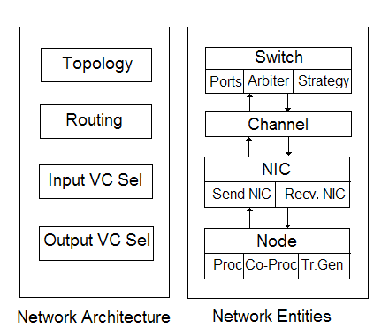

==============================================================
BigSimulator (BigNetSim) for Extremely Large Parallel Machines
==============================================================

.. contents::
   :depth: 3

.. _bignetsim:

BigSim Network Simulator
========================

The BigSim Network Simulator is also known as Bigsimulator and lives in
the SVN repository https://charm.cs.uiuc.edu/svn/repos/BigNetSim. The
Network simulator is actually more of an Inter-connection network
simulator and hence more important in the context of large parallel
machines with interconnects. The BigSim simulator along with the network
simulator is together also known as BigNetSim.

Both the simulators run on top of the POSE framework, which is a
Parallel Discrete Event Simulation framework built on top of Charm++.

What does this software do?
---------------------------

BigNetSim is an effort to simulate large current and future computer
systems to study the behavior of applications developed for those
systems. BigNetSim could be used to study

-  new types of interconnection topologies and routing algorithms along
   with different types of switching architecture.

-  application performance on different machines. This uses the API
   provided in Section :numref:`bgapi` to run the application on
   some number of processors on some machine and generate (dump) all
   events (entry method executions or message send/recv). BigNetSim is
   used to model the machine that needs to be studied for this
   application and these logs are then fed into this simulation, and it
   predicts the performance of this application.

So, the two important uses are studying *interconnection networks* and
*performance prediction for applications*.

Compiling BigSimulator
----------------------

To compile the simulator which is called BigSimulator (or BigNetSim), we
need the regular Charm++ build (netlrts-linux-x86_64 in our example). It
needs to be complemented with a few more libraries from BigSim and with
the Pose discrete-event simulator. These pieces can be built,
respectively, with:

::

   ./build bgampi netlrts-linux-x86_64 -O2
   ./build pose netlrts-linux-x86_64 -O2

Access to the discrete-event simulation is realized via a Charm++
package originally named BigNetSim (now called BigSimulator). Assuming
that the ’subversion’ (svn) package is available, this package can be
obtained from the Web with a subversion checkout such as:

.. code-block:: bash

      svn co https://charm.cs.uiuc.edu/svn/repos/BigNetSim/

In the subdir ’trunk/’ created by the checkout, the file Makefile.common
must be edited so that ’CHARMBASE’ points to the regular Charm++
installation. Having that done, one chooses a topology in that subdir
(e.g. BlueGene for a torus topology) by doing a "cd" into the
corresponding directory (e.g. ’cd BlueGene’). Inside that directory, one
should simply "make". This will produce the binary
"../tmp/bigsimulator". That file, together with file
"BlueGene/netconfig.vc", will be used during a simulation. It may be
useful to set the variable SEQUENTIAL to 1 in Makefile.common to build a
sequential (non-parallel) version of bigsimulator.

Using BigSimulator
------------------

BigSimulator (BigNetSim) has 2 major modes.

-  Trace based traffic simulation

-  Artificial traffic generation based simulation. The mode of the
   simulator is governed by the :math:`USE\_TRANSCEIVER` parameter in
   the netconfig file. When set to 0, trace based simulation is used,
   when set to 1, traffic generation is used.

Trace based simulation. This is used to study target application
performance, or detailed network performance when loaded by a specific
application.

There are two command line parameters for traced based simulation.

.. code-block:: none

     ./charmrun +p2 ./bigsimulator arg1 arg2

.. code-block:: none

     arg1 = 0 => Latency only mode
            1 => Detailed contention model
     arg2 = N => starts execution at the time marked by skip point N (0 is start)

Simple Latency Model
~~~~~~~~~~~~~~~~~~~~

To use the simple latency model, follow the setup procedure above,
noting that the files are located in the trunk/SimpleLatency directory.
This will produce the "bigsimulator" file.

The command line parameters used for this model are different. The
format is as follows:

.. code-block:: none

     [charmrun +p#] bigsimulator -lat <latency> -bw <bandwidth>
                  [-cpp <cost per packet> -psize <packet size>]
                  [-winsize <window size>] [-skip] [-print_params]

.. code-block:: none

     Latency (lat)         - type double; in microseconds
     Bandwidth (bw)        - type double; in GB/s
     Cost per packet (cpp) - type double; in microseconds
     Packet size (psize)   - type int; in bytes
     Window size (winsize) - type int; in log entries

The implemented equation is: :math:`lat + (N/bw) + cpp \times (N/psize)`

Latency and bandwidth are required. If cost per packet is given, then
packet size must be given, as well. Otherwise, cost per packet defaults
to 0.0. Packet size, if given, must be a positive integer.

The -winsize flag allows the user to specify the size of the window
(number of log entries) used when reading in the bgTrace log files. This
is useful if the log files are large. If -winsize is not specified, the
value defaults to 0, which indicates that no windowing will be used
(i.e., there will be one window for each time line that is equal to the
size of the time line).

As with the second parameter in the examples of part (a) of this
section, the -skip flag indicates that the simulation should skip
forward to the time stamp set during trace creation (see the BigSim
tutorial talk from the 2008 Charm++ workshop). If -skip is not included,
then no skipping will occur.

The -print_params flag is provided for debugging convenience. When
present, the simple latency model parameters will be displayed during
simulation initialization.

Artificial Traffic Models
~~~~~~~~~~~~~~~~~~~~~~~~~

Artificial traffic generation based simulation is use to study the
performance of interconnects under standard network load schemes.

.. code-block:: none

     ./bigsimulator arg1 arg2 arg3 arg4 arg5 arg6

example

.. code-block:: none

     ./bigsimulator 1 2 3 100 2031 0.1

.. code-block:: none

     arg1 = 0 => Latency only mode
            1 => Detailed contention model
     arg2 = 1 => deterministic traffic
            2 => poisson traffic
     arg3 = 1 => KSHIFT
            2 => RING
            3 => BITTRANSPOSE
            4 => BITREVERSAL
            5 => BITCOMPLEMENT
            6 => UNIFORM_DISTRIBUTION
     arg4 = number of packets
     arg5 = message size
     arg6 = load factor

Which Interconnection networks are implemented?
-----------------------------------------------

A large number of topologies and routing strategies are implemented in
the software. Here, we present a list of interconnection networks. For a
complete list of routing strategies, input/output VC selectors, refer to
the corresponding directories in the software.

-  HyperCube

-  FatTree

-  DenseGraph

-  Three dimensional Mesh

-  K-ary-N-cube

-  K-ary-N-fly

-  K-ary-N-mesh

-  K-ary-N-tree

-  N-mesh

-  Hybrid of Fattree and Dense Graph

-  Hybrid of Fattree and HyperCube

Build your own Interconnection network
--------------------------------------

To build a new interconnection network, one has to create a new
directory for that interconnection network and then create the routing
strategy, topology, input virtual channel selection and output virtual
channel selection strategies for that network. If existing strategies
could be used, then reuse them, but if new ones are required, one has to
write these new strategies in the corresponding directories for routing,
topology, etc.

The InitNetwork function must be provided in InitNetwork.C for this new
interconnection network. It builds up all the nodes and switches and
NICs and channels that form the network. Look at one of the existing
interconnection topologies for reference.

BigNetSim Design and Internals
------------------------------

   BigNetSim conceptual model

This section focuses on the interconnection network simulation. The
entities that form an interconnection network are:

-  *switch:* A switch decides the routing on a packet. Switches could be
   input buffered or output buffered. The former are implemented as
   individual posers per port of each switch while the latter are
   implemented as a poser per switch. In an *Input Buffered (IB)*
   switch, a packet in a switch is stored at the input port until its
   next route is decided and leaves the switch if it finds available
   space on the next switch in the route. While in an *Output Buffered
   (OB)* switch, a packet in a switch decides beforehand on the next
   route to take and is buffered at the output port until space is
   available on the next switch along the route. Switches are modeled in
   much detail. Ports, buffers and virtual channels at ports to avoid
   head-of-the-line blocking are modeled. Hardware collectives are
   implemented on the switch to enable broadcasts, multicasts and other
   collective operations efficiently. These are configurable and can be
   used if the system being simulated supports them. We also support
   configurable strategies for arbitration, input virtual channel
   selection and output virtual channel selection. The configurability
   of the switch provides a flexible design, satisfying the requirements
   of a large number of networks.

-  *network card:* Network cards packetize and unpacketize messages. A
   NIC is implemented as two posers. The sending and receiving entities
   in a NIC are implemented as separate posers. A NIC is attached to
   each node.

-  *channel:* These are modeled as posers and connect a NIC to a switch
   or a switch to another switch.

-  *compute node:* Each compute node connects to a network interface
   card. A compute node simulates execution of entry methods on it. It
   is also attached to a message traffic generator, which is used when
   only an interconnection network is being simulated. This traffic
   generator can generate any message pattern on each of the compute
   nodes. The traffic generator can send point-to-point messages,
   reductions, multicasts, broadcasts and other collective traffic. It
   supports k-shift, ring, bit-transpose, bit-reversal, bit-complement
   and uniform random traffic. These are based on common communication
   patterns found in real applications. The frequency of message
   generation is determined by a uniform or Poisson distribution.

Topology, Routing and Virtual Channel Selection
-----------------------------------------------

Topology, Routing strategies and input and output virtual channel
selection strategies need to be decided for any inter-connection
network. Once we have all of these in place we can simulate an
inter-connection network.

Topology
~~~~~~~~

For every architecture one wants to design, a topology file has to
written which defines a few basic functions for that particular
topology. These are:

``void getNeighbours(int nodeid, int numP)``

This is called initially for every switch and this populates the data
structure next in a switch which contains the connectivity of that
switch. The switch specified by switch has numP ports.

``int getNext(int portid, int nodeid, int numP)``

Returns the index of the switch/node that is connected to the switch
nodeid, at portid. The number of ports this node has is numP.

``int getNextChannel(int portid, int nodeid, int numP)``

Returns the index of the channel that is connected to the switch nodeid,
at portid. The number of ports this node has is numP.

``int getStartPort(int nodeid, int numP, int dest)``

Return the index of the port that is connected to this compute node from
a switch

``int getStartVc()``

Returns the index of the first virtual channel (mostly 0).

``int getStartSwitch(int nodeid)``

Returns the index of the node/switch that is connected to the first port

``int getStartNode()``

Returns the index of the first node. Each poser has a separate index,
irrespective of the type of the poser.

``int getEndNode()``

Returns the index of the last node.

Routing
~~~~~~~

Routing strategy needs to be specified for every interconnection
network. There is usually at least one routing strategy that needs to be
defined for every topology, Usually we have many more. The following
functions need to be defined for every routing strategy.

``int selectRoute(int current, int dest, int numP, Topology* top, Packet
*p, map<int,int> &bufsize, unsigned short *xsubi)``

Returns the portid that should be taken on switch current if the
destination is dest. The number of ports on a switch is numP. We also
pass the pointer to the topology and to the Packet.

``int selectRoute(int current, int dest, int numP, Topology* top, Packet
*p, map<int,int> &bufsize, map<int,int> &portContention, unsigned short
*xsubi)``

Returns the portid that should be taken on switch current if the
destination is dest. The number of ports on a switch is numP. We also
pass the pointer to the topology and to the Packet. Bufsize is the state
of the ports in a switch, i.e. how many buffers on each port are full,
while portContention is used to give priority to certain ports, when
more options are available.

``int expectedTime(int src, int dest, POSE_TimeType ovt, POSE_TimeType
origOvt, int length, int *numHops)``

Returns the expected time for a packet to travel from src to dest, when
the number of hops it will need to travel is numHops.

``int convertOutputToInputPort(int id, Packet *p, int numP, int *next)``

Translate this output port to input port on the switch this port is
connected to.

Input Virtual Channel Selection
~~~~~~~~~~~~~~~~~~~~~~~~~~~~~~~

For every switch, we need to know the mechanism it uses to choose input
virtual channel. There are a few different input virtual channel
selection strategies, and a switch can choose among them. Each should
implement the following function.

``int selectInputVc(map<int,int> &availBuffer, map<int,int> &request,
map<int,vector<Header> > &inBuffer, int globalVc, int curSwitch)``

Returns the input virtual channel to be used depending on the strategy
and the input parameters.

Output Virtual Channel Selection
~~~~~~~~~~~~~~~~~~~~~~~~~~~~~~~~

For every switch, we need to know the mechanism it uses to choose output
virtual channel. There are a few different output virtual channel
selection strategies, and a switch can choose among them. Each should
implement the following function.

``int selectOutputVc(map<int,int> &bufsize, Packet *p, int unused)``

Returns the output virtual channel to be used depending on the strategy
and the input parameters.
