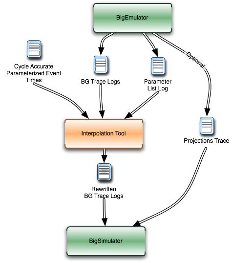
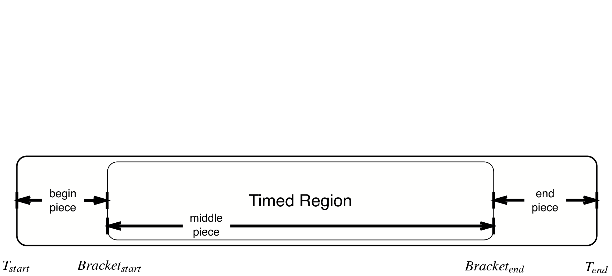
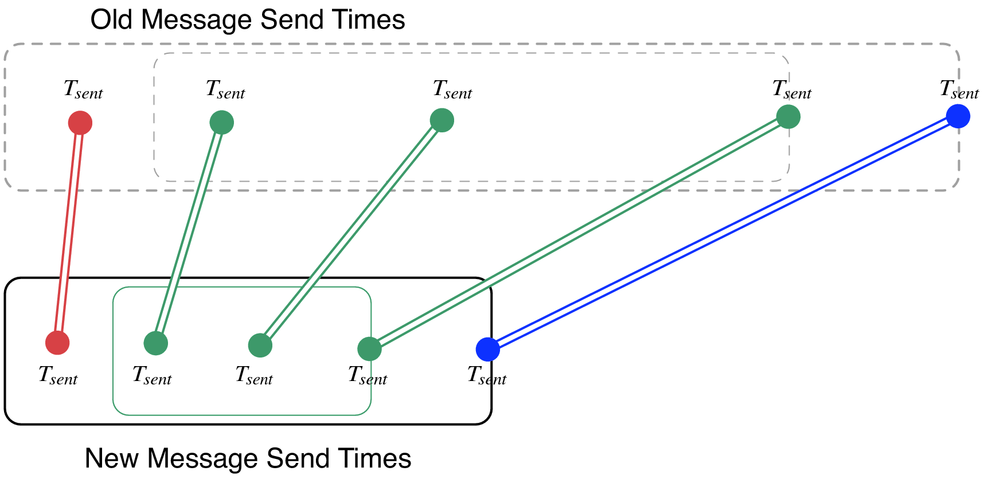

=========================
BigSim Parallel Simulator
=========================

.. contents::
   :depth: 3

Introduction
============

Parallel machines with an extremely large number of processors are now
being designed and built. For example, the BlueGene/L (BG/L) machine
built by IBM has 64,000 dual-processor nodes with 360 teraflops of peak
performance. Another more radical design from IBM, code-named Cyclops
(BlueGene/C), had over one million floating point units, fed by 8
million instructions streams supported by individual thread units,
targeting 1 petaflops of peak performance.

It is important that one can study the programming issues and
performance of parallel applications on such machines even before the
machine is built. Thus, we have developed a parallel simulator - BigSim,
to facilitate this research.

Since our research was initiated by the BlueGene/C project, in previous
editions of this manual we also called our simulator as Blue Gene
Simulator. Our simulator is capable of simulating a broad class of
"Massively Parallel Processors-In-Memory", or MPPIM machines.

Simulator system components
---------------------------

Our simulator system includes these components:

#. a parallel emulator which emulates a low level machine API targeting
   an architecture like BlueGene;

#. a message driven programming language (Charm++) running on top of the
   emulator;

#. the Adaptive MPI (an implementation of MPI on top of Charm++)
   environment;

#. a parallel post-mortem mode simulator for performance prediction,
   including network simulation.

History
-------

The first version of the BlueGene emulator was written in Charm++, a
parallel object language, in fall 2001. The second version of the
BlueGene emulator was completely rewritten on top of Converse instead of
Charm++ in spring 2002. While the API supported by the original emulator
remains almost the same, many new features were added. The new emulator
was implemented on a portable low layer communication library -
Converse, in order to achieve better performance by avoiding the cross
layer overhead.

Charm++ was ported to the emulator in 2002, providing the first parallel
language model on top of the emulator.

A performance simulation capability was added to the emulator in spring
2003. The new simulator was renamed to BigSim at the same time. During
the same year, we developed a POSE-based postmortem mode network
simulator called BigNetSim. In fall 2006, we renamed BigNetSim as simply
BigSim simulator.

In the following sections, we will first describe how to download and
compile the BigSim system (Section :numref:`install`).
Section :numref:`bgemulator` describes the BigSim Emulator and the low
level machine API in detail.

.. _install:

BigSim Emulator Installation and Usage
======================================

Installing Charm++ and BigSim
-----------------------------

The BigSim Emulator is distributed as part of the Charm++ standard
distribution. One needs to download Charm++ and compile the BigSim
Simulator. This process should begin with downloading Charm++ from the
website: http://charm.cs.uiuc.edu.

Please refer to “Charm++ Installation and Usage Manual” and also the
file README in the source code for detailed instructions on how to
compile Charm++. In short, the “build” script is the main tool for
compiling Charm++. One needs to provide *target* and *platform*
selections:

.. code-block:: bash

   $ ./build <target> <platform> [options ...] [charmc-options ...]

For example, to compile on a 64-bit Linux machine, one would type:

.. code-block:: bash

   $ ./build charm++ netlrts-linux-x86_64 -O2

which builds essential Charm++ kernel using UDP sockets as the
communication method; alternatively, it is possible to build the Charm++
kernel on MPI using:

.. code-block:: bash

   $ ./build charm++ mpi-linux-x86_64 -O2

For other platforms, netlrts-linux-x86_64 should be replaced by whatever
platform is being used. See the charm/README file for a complete list of
supported platforms.

Building Only the BigSim Emulator
~~~~~~~~~~~~~~~~~~~~~~~~~~~~~~~~~

The BigSim Emulator is implemented on top of Converse in Charm++. To
compile the BigSim Emulator, one can compile Emulator libraries directly
on top of normal Charm++ using “bgampi” as the compilation target, like

.. code-block:: bash

   $ ./build bgampi netlrts-linux-x86_64 -O2

With Emulator libraries, one can write BigSim applications using its low
level machine API (defined in  :numref:`bgemulator`).

Building Charm++ or AMPI on the BigSim Emulator
~~~~~~~~~~~~~~~~~~~~~~~~~~~~~~~~~~~~~~~~~~~~~~~

In order to build Charm++ or AMPI on top of BigSim Emulator (which
itself is implemented on top of Converse), a special build option
“bigemulator” needs to be specified:

.. code-block:: bash

   $ ./build bgampi netlrts-linux-x86_64 bigemulator -O2

The “bgampi” option is the compilation *target* that tells “build” to
compile BigSim Emulator libraries in addition to Charm++ kernel
libraries. The “bigemulator” option is a build *option* to platform
“netlrts-linux”, which tells “build” to build Charm++ on top of the
BigSim Emulator.

The above “build" command creates a directory named
“netlrts-linux-x86_64-bigemulator" under charm, which contains all the
header files and libraries needed for compiling a user application. With
this version of Charm++, one can run normal Charm++ and AMPI application
on top of the emulator (in a virtualized environment).

Compiling BigSim Applications
-----------------------------

Charm++ provides a compiler script ``charmc`` to compile all programs.
As will be described in this subsection, there are three methods to
write a BigSim application: (a) using the low level machine API, (b)
using Charm++ or (c) using AMPI. Methods (b) and (c) are essentially
used to obtain traces from the BigSim Emulator, such that one can use
those traces in a post-mortem simulation as explained in
Section :numref:`bignetsim`.

Writing a BigSim application using low level machine API
~~~~~~~~~~~~~~~~~~~~~~~~~~~~~~~~~~~~~~~~~~~~~~~~~~~~~~~~

The original goal of the low level machine API was to mimic the
BlueGene/C low level programming API. It is defined in
section :numref:`bgemulator`. Writing a program in the low level
machine API, one just needs to link Charm++’s BigSim emulator libraries,
which provide the emulation of the machine API using Converse as the
communication layer.

In order to link against the BigSim library, one must specify
``-language bigsim`` as an argument to the ``charmc`` command, for
example:

.. code-block:: bash

   $ charmc -o hello hello.C -language bigsim

Sample applications in low level machine API can be found in the
directory charm/examples/bigsim/emulator/.

Writing a BigSim application in Charm++
~~~~~~~~~~~~~~~~~~~~~~~~~~~~~~~~~~~~~~~

One can write a normal Charm++ application which can automatically run
on the BigSim Emulator after compilation. Charm++ implements an
object-based message-driven execution model. In Charm++ applications,
there are collections of C++ objects, which communicate by remotely
invoking methods on other objects via messages.

To compile a program written in Charm++ on the BigSim Emulator, one
specifies ``-language charm++`` as an argument to the ``charmc``
command:

.. code-block:: bash

   $ charmc -o hello hello.C -language charm++

This will link both Charm++ runtime libraries and BigSim Emulator
libraries.

Sample applications in Charm++ can be found in the directory
charm/examples/bigsim, specifically charm/examples/bigsim/emulator/littleMD.

Writing a BigSim application in MPI
~~~~~~~~~~~~~~~~~~~~~~~~~~~~~~~~~~~

One can also write an MPI application for the BigSim Emulator. Adaptive
MPI, or AMPI, is implemented on top of Charm++, supporting dynamic load
balancing and multithreading for MPI applications. Those are based on
the user-level migrating threads and load balancing capabilities
provided by the Charm++ framework. This allows legacy MPI programs to
run on top of BigSim Charm++ and take advantage of the Charm++’s
virtualization and adaptive load balancing capability.

Currently, AMPI implements most features in the MPI version 1.0, with a
few extensions for migrating threads and asynchronous reduction.

To compile an AMPI application for the BigSim Emulator, one needs to
link against the AMPI library as well as the BigSim Charm++ runtime
libraries by specifying ``-language ampi`` as an argument to the
``charmc`` command:

.. code-block:: bash

   $ charmc -o hello hello.C -language ampi

Sample applications in AMPI can be found in the directory
charm/examples/ampi, specifically charm/examples/ampi/pingpong.

Running a BigSim Application
----------------------------

To run a parallel BigSim application, Charm++ provides a utility program
called ``charmrun`` that starts the parallel execution. For detailed
description on how to run a Charm++ application, refer to the file
charm/README in the source code distribution.

To run a BigSim application, one needs to specify the following
parameters to ``charmrun`` to define the simulated machine size:

#. ``+vp``: define the number of processors of the hypothetical (future)
   system

#. ``+x``, ``+y`` and ``+z``: optionally define the size of the machine in
   three dimensions, these define the number of nodes along each
   dimension of the machine (assuming a torus/mesh topology);

#. ``+wth`` and ``+cth``: For one node, these two parameters define the
   number of worker processors (``+wth``) and the number of
   communication processors (``+cth``).

#. ``+bgwalltime``: used only in simulation mode, when specified, use
   wallclock measurement of the time taken on the simulating machine to
   estimate the time it takes to run on the target machine.

#. ``+bgcounter``: used only in simulation mode, when specified, use the
   performance counter to estimate the time on target machine. This is
   currently only supported when perfex is installed, like Origin2000.

#. ``+bglog``: generate BigSim trace log files, which can be used with
   BigNetSim.

#. ``+bgcorrect``: starts the simulation mode to predict performance.
   Without this option, a program simply runs on the emulator without
   doing any performance prediction. Note: this option is obsolete, and
   no longer maintained, use +bglog to generate trace logs, and use
   BigNetSim for performance prediction.

For example, to simulate a parallel machine of size 64K as 40x40x40,
with one worker processor and one communication processor on each node,
and use 100 real processors to run the simulation, the command to be
issued should be:

.. code-block:: bash

   $ ./charmrun +p100 ./hello +x40 +y40 +z40 +cth1 +wth1

To run an AMPI program, one may also want to specify the number of
virtual processors to run the MPI code by using ``+vp``. As an example,

.. code-block:: bash

   $ ./charmrun +p100 ./hello +x40 +y40 +z40 +cth1 +wth1 +vp 128000

starts the simulation of a machine of size 40x40x40 with one worker
processor in each node, running 128000 MPI tasks (2 MPI tasks on each
node), using 100 real processors to run the simulation. In this case,
``MPI_Comm_size()`` returns 128000 for ``MPI_COMM_WORLD``. If the
``+vp`` option is not specified, the number of virtual processors will
be equal to the number of worker processors of the simulated machine, in
this case 64000.

.. _bgemulator:

BigSim Emulator
===============

The BigSim emulator environment is designed with the following
objectives:

#. To support a realistic BigSim API on existing parallel machines

#. To obtain first-order performance estimates of algorithms

#. To facilitate implementations of alternate programming models for
   Blue Gene

The machine supported by the emulator consists of three-dimensional grid
of 1-chip nodes. The user may specify the size of the machine along each
dimension (e.g. 34x34x36). The chip supports :math:`k` threads (e.g.
200), each with its own integer unit. The proximity of the integer unit
with individual memory modules within a chip is not currently modeled.

The API supported by the emulator can be broken down into several
components:

#. Low-level API for chip-to-chip communication

#. Mid-level API that supports local micro-tasking with a chip level
   scheduler with features such as: read-only variables, reductions,
   broadcasts, distributed tables, get/put operations

#. Migratable objects with automatic load balancing support

Of these, the first two have been implemented. The simple time stamping
algorithm, without error correction, has been implemented. More
sophisticated timing algorithms, specifically aimed at error correction,
and more sophisticated features (2, 3, and others), as well as libraries
of commonly needed parallel operations are part of the proposed work for
future.

The following sections define the appropriate parts of the API, with
example programs and instructions for executing them.

BigSim Programming Environment
------------------------------

The basic philosophy of the BigSim Emulator is to hide intricate details
of the simulated machine from the application developer. Thus, the
application developer needs to provide initialization details and
handler functions only and gets the result as though running on a real
machine. Communication, Thread creation, Time Stamping, etc are done by
the emulator.

BigSim API: Level 0
~~~~~~~~~~~~~~~~~~~

``void addBgNodeInbuffer(bgMsg *msgPtr, int nodeID)``

low-level primitive invoked by Blue Gene emulator to put the message to
the inbuffer queue of a node.

msgPtr - pointer to the message to be sent to target node;

nodeID - node ID of the target node, it is the serial number of a
bluegene node in the emulator’s physical node.

``void addBgThreadMessage(bgMsg *msgPtr, int threadID)``

add a message to a
thread’s affinity queue, these messages can be only executed by a
specific thread indicated by threadID.

``void addBgNodeMessage(bgMsg *msgPtr)``

add a message to a node’s
non-affinity queue, these messages can be executed by any thread in the
node.

``boolean checkReady()``

invoked by communication thread to see if there is
any unattended message in inBuffer.

``bgMsg * getFullBuffer()``

invoked by communication thread to retrieve the
unattended message in inBuffer.

``CmiHandler msgHandlerFunc(char *msg)``

Handler function type that user
can register to handle the message.

``void sendPacket(int x, int y, int z, int msgSize,bgMsg *msg)``

chip-to-chip communication function. It send a message to Node[x][y][z].

bgMsg is the message type with message envelope used internally.

Initialization API: Level 1a
~~~~~~~~~~~~~~~~~~~~~~~~~~~~

All the functions defined in API Level 0 are used internally for the
implementation of bluegene node communication and worker threads.

From this level, the functions defined are exposed to users to write
bluegene programs on the emulator.

Considering that the emulator machine will emulate several Bluegene
nodes on each physical node, the emulator program defines this function
BgEmulatorInit(int argc, char \**argv) to initialize each emulator node.
In this function, user program can define the Bluegene machine size,
number of communication/worker threads, and check the command line
arguments.

The size of the simulated machine being emulated and the number of
thread per node is determined either by the command line arguments or
calling following functions:

``void BgSetSize(int sx, int sy, int sz)``

set Blue Gene Machine size;

``void BgSetNumWorkThread(int num)``

set number of worker threads per node;

``void BgSetNumCommThread(int num)``

set number of communication threads per node;

``int BgRegisterHandler(BgHandler h)``

register user message handler functions;

For each simulated node, the execution starts at ``BgNodeStart(int argc,
char **argv)`` called by the emulator, where application handlers can be
registered and computation is triggered by creating a task at required
nodes.

Similar to pthread’s thread specific data, each bluegene node has its
own node specific data associated with it. To do this, the user needs to
define its own node-specific variables encapsulated in a struct
definition and register the pointer to the data with the emulator by
following function:

``void BgSetNodeData(char *data)``

To retrieve the node specific data, call:

``char *BgGetNodeData()``

After completion of execution, user program invokes a function:

``void BgShutdown()``

to terminate the emulator.

Handler Function API: Level 1a
~~~~~~~~~~~~~~~~~~~~~~~~~~~~~~

The following functions can be called in user’s application program to
retrieve the simulated machine information, get thread execution time,
and perform the communication.

``void BgGetSize(int *sx, int *sy, int *sz)``

``int BgGetNumWorkThread()``

``int BgGetNumCommThread()``

``int BgGetThreadID()``

``double BgGetTime()``

``void BgSendPacket(int x, int y, int z, int threadID, int handlerID,
WorkType type, int numbytes, char* data)``

This sends a trunk of data to Node[x, y, z] and also specifies the
handler function to be used for this message i.e. the handlerID;
threadID specifies the desired thread to handle the message, ANYTHREAD
means no preference.

To specify the thread category:

1:
   a small piece of work that can be done by communication thread
   itself, so NO scheduling overhead.

0:
   a large piece of work, so communication thread schedules it for a
   worker thread

Writing a BigSim Application
----------------------------

Application Skeleton
~~~~~~~~~~~~~~~~~~~~

.. code-block:: c++

   Handler function prototypes;
   Node specific data type declarations;

   void  BgEmulatorInit(int argc, char **argv)  function
     Configure bluegene machine parameters including size, number of threads, etc.
     You also need to register handlers here.

   void *BgNodeStart(int argc, char **argv) function
     The usual practice in this function is to send an initial message to trigger
     the execution.
     You can also register node specific data in this function.

   Handler Function 1, void handlerName(char *info)
   Handler Function 2, void handlerName(char *info)
   ..
   Handler Function N, void handlerName(char *info)

Sample Application 1
~~~~~~~~~~~~~~~~~~~~

.. code-block:: c++

   /* Application:
    *   Each node starting at [0,0,0] sends a packet to next node in
    *   the ring order.
    *   After node [0,0,0] gets message from last node
    *   in the ring, the application ends.
    */

   #include "blue.h"

   #define MAXITER 2

   int iter = 0;
   int passRingHandler;

   void passRing(char *msg);

   void nextxyz(int x, int y, int z, int *nx, int *ny, int *nz)
   {
     int numX, numY, numZ;

     BgGetSize(&numX, &numY, &numZ);
     *nz = z+1; *ny = y; *nx = x;
     if (*nz == numZ) {
       *nz = 0; (*ny) ++;
       if (*ny == numY) {
         *ny = 0; (*nx) ++;
         if (*nx == numX) *nx = 0;
       }
     }
   }

   void BgEmulatorInit(int argc, char **argv)
   {
     passRingHandler = BgRegisterHandler(passRing);
   }

   /* user defined functions for bgnode start entry */
   void BgNodeStart(int argc, char **argv)
   {
     int x,y,z;
     int nx, ny, nz;
     int data, id;

     BgGetXYZ(&x, &y, &z);
     nextxyz(x, y, z, &nx, &ny, &nz);
     id = BgGetThreadID();
     data = 888;
     if (x == 0 && y==0 && z==0) {
       BgSendPacket(nx, ny, nz, -1,passRingHandler, LARGE_WORK,
   				sizeof(int), (char *)&data);
     }
   }

   /* user write code */
   void passRing(char *msg)
   {
     int x, y, z;
     int nx, ny, nz;
     int id;
     int data = *(int *)msg;

     BgGetXYZ(&x, &y, &z);
     nextxyz(x, y, z, &nx, &ny, &nz);
     if (x==0 && y==0 && z==0) {
       if (++iter == MAXITER) BgShutdown();
     }
     id = BgGetThreadID();
     BgSendPacket(nx, ny, nz, -1, passRingHandler, LARGE_WORK,
   				sizeof(int), (char *)&data);
   }

Sample Application 2
~~~~~~~~~~~~~~~~~~~~

.. code-block:: c++

   /* Application:
    *   Find the maximum element.
    *   Each node computes maximum of it's elements and
    *   the max values it received from other nodes
    *   and sends the result to next node in the reduction sequence.
    * Reduction Sequence: Reduce max data to X-Y Plane
    *   Reduce max data to Y Axis
    *   Reduce max data to origin.
    */

   #include <stdlib.h>
   #include "blue.h"

   #define A_SIZE 4

   #define X_DIM 3
   #define Y_DIM 3
   #define Z_DIM 3

   int REDUCE_HANDLER_ID;
   int COMPUTATION_ID;

   extern "C" void reduceHandler(char *);
   extern "C" void computeMax(char *);

   class ReductionMsg {
   public:
     int max;
   };

   class ComputeMsg {
   public:
     int dummy;
   };

   void BgEmulatorInit(int argc, char **argv)
   {
     if (argc < 2) {
       CmiAbort("Usage: <program> <numCommTh> <numWorkTh>\n");
     }

     /* set machine configuration */
     BgSetSize(X_DIM, Y_DIM, Z_DIM);
     BgSetNumCommThread(atoi(argv[1]));
     BgSetNumWorkThread(atoi(argv[2]));

     REDUCE_HANDLER_ID = BgRegisterHandler(reduceHandler);
     COMPUTATION_ID = BgRegisterHandler(computeMax);

   }

   void BgNodeStart(int argc, char **argv) {
     int x, y, z;
     BgGetXYZ(&x, &y, &z);

     ComputeMsg *msg = new ComputeMsg;
     BgSendLocalPacket(ANYTHREAD, COMPUTATION_ID, LARGE_WORK,
   			sizeof(ComputeMsg), (char *)msg);
   }

   void reduceHandler(char *info) {
     // assumption: THey are initialized to zero?
     static int max[X_DIM][Y_DIM][Z_DIM];
     static int num_msg[X_DIM][Y_DIM][Z_DIM];

     int i,j,k;
     int external_max;

     BgGetXYZ(&i,&j,&k);
     external_max = ((ReductionMsg *)info)->max;
     num_msg[i][j][k]++;

     if ((i == 0) && (j == 0) && (k == 0)) {
       // master node expects 4 messages:
       // 1 from itself;
       // 1 from the i dimension;
       // 1 from the j dimension; and
       // 1 from the k dimension
       if (num_msg[i][j][k] < 4) {
         // not ready yet, so just find the max
         if (max[i][j][k] < external_max) {
   	max[i][j][k] = external_max;
         }
       } else {
         // done. Can report max data after making last comparison
         if (max[i][j][k] < external_max) {
   	max[i][j][k] = external_max;
         }
         CmiPrintf("The maximal value is %d \n", max[i][j][k]);
         BgShutdown();
         return;
       }
     } else if ((i == 0) && (j == 0) && (k != Z_DIM - 1)) {
       // nodes along the k-axis other than the last one expects 4 messages:
       // 1 from itself;
       // 1 from the i dimension;
       // 1 from the j dimension; and
       // 1 from the k dimension
       if (num_msg[i][j][k] < 4) {
         // not ready yet, so just find the max
         if (max[i][j][k] < external_max) {
   	max[i][j][k] = external_max;
         }
       } else {
         // done. Forwards max data to node i,j,k-1 after making last comparison
         if (max[i][j][k] < external_max) {
   	max[i][j][k] = external_max;
         }
         ReductionMsg *msg = new ReductionMsg;
         msg->max = max[i][j][k];
         BgSendPacket(i,j,k-1,ANYTHREAD,REDUCE_HANDLER_ID,LARGE_WORK,
   				sizeof(ReductionMsg), (char *)msg);
       }
     } else if ((i == 0) && (j == 0) && (k == Z_DIM - 1)) {
       // the last node along the k-axis expects 3 messages:
       // 1 from itself;
       // 1 from the i dimension; and
       // 1 from the j dimension
       if (num_msg[i][j][k] < 3) {
         // not ready yet, so just find the max
         if (max[i][j][k] < external_max) {
   	max[i][j][k] = external_max;
         }
       } else {
         // done. Forwards max data to node i,j,k-1 after making last comparison
         if (max[i][j][k] < external_max) {
   	max[i][j][k] = external_max;
         }
         ReductionMsg *msg = new ReductionMsg;
         msg->max = max[i][j][k];
         BgSendPacket(i,j,k-1,ANYTHREAD,REDUCE_HANDLER_ID,LARGE_WORK,
   				sizeof(ReductionMsg), (char *)msg);
       }
     } else if ((i == 0) && (j != Y_DIM - 1)) {
       // for nodes along the j-k plane except for the last and first row of j,
       // we expect 3 messages:
       // 1 from itself;
       // 1 from the i dimension; and
       // 1 from the j dimension
       if (num_msg[i][j][k] < 3) {
         // not ready yet, so just find the max
         if (max[i][j][k] < external_max) {
   	max[i][j][k] = external_max;
         }
       } else {
         // done. Forwards max data to node i,j-1,k after making last comparison
         if (max[i][j][k] < external_max) {
   	max[i][j][k] = external_max;
         }
         ReductionMsg *msg = new ReductionMsg;
         msg->max = max[i][j][k];
         BgSendPacket(i,j-1,k,ANYTHREAD,REDUCE_HANDLER_ID,LARGE_WORK,
   				sizeof(ReductionMsg), (char *)msg);
       }
     } else if ((i == 0) && (j == Y_DIM - 1)) {
       // for nodes along the last row of j on the j-k plane,
       // we expect 2 messages:
       // 1 from itself;
       // 1 from the i dimension;
       if (num_msg[i][j][k] < 2) {
         // not ready yet, so just find the max
         if (max[i][j][k] < external_max) {
   	max[i][j][k] = external_max;
         }
       } else {
         // done. Forwards max data to node i,j-1,k after making last comparison
         if (max[i][j][k] < external_max) {
   	max[i][j][k] = external_max;
         }
         ReductionMsg *msg = new ReductionMsg;
         msg->max = max[i][j][k];
         BgSendPacket(i,j-1,k,ANYTHREAD,REDUCE_HANDLER_ID,LARGE_WORK,
   				sizeof(ReductionMsg), (char *)msg);
       }
     } else if (i != X_DIM - 1) {
       // for nodes anywhere the last row of i,
       // we expect 2 messages:
       // 1 from itself;
       // 1 from the i dimension;
       if (num_msg[i][j][k] < 2) {
         // not ready yet, so just find the max
         if (max[i][j][k] < external_max) {
   	max[i][j][k] = external_max;
         }
       } else {
         // done. Forwards max data to node i-1,j,k after making last comparison
         if (max[i][j][k] < external_max) {
   	max[i][j][k] = external_max;
         }
         ReductionMsg *msg = new ReductionMsg;
         msg->max = max[i][j][k];
         BgSendPacket(i-1,j,k,ANYTHREAD,REDUCE_HANDLER_ID,LARGE_WORK,
   				sizeof(ReductionMsg), (char *)msg);
       }
     } else if (i == X_DIM - 1) {
       // last row of i, we expect 1 message:
       // 1 from itself;
       if (num_msg[i][j][k] < 1) {
         // not ready yet, so just find the max
         if (max[i][j][k] < external_max) {
   	max[i][j][k] = external_max;
         }
       } else {
         // done. Forwards max data to node i-1,j,k after making last comparison
         if (max[i][j][k] < external_max) {
   	max[i][j][k] = external_max;
         }
         ReductionMsg *msg = new ReductionMsg;
         msg->max = max[i][j][k];
         BgSendPacket(i-1,j,k,-1,REDUCE_HANDLER_ID,LARGE_WORK,
   				sizeof(ReductionMsg), (char *)msg);
       }
     }
   }

   void computeMax(char *info) {
     int A[A_SIZE][A_SIZE];
     int i, j;
     int max = 0;

     int x,y,z; // test variables
     BgGetXYZ(&x,&y,&z);

     // Initialize
     for (i=0;i<A_SIZE;i++) {
       for (j=0;j<A_SIZE;j++) {
         A[i][j] = i*j;
       }
     }

   //  CmiPrintf("Finished Initializing %d %d %d!\n",  x , y , z);

     // Find Max
     for (i=0;i<A_SIZE;i++) {
       for (j=0;j<A_SIZE;j++) {
         if (max < A[i][j]) {
   	max = A[i][j];
         }
       }
     }

     // prepare to reduce
     ReductionMsg *msg = new ReductionMsg;
     msg->max = max;
     BgSendLocalPacket(ANYTHREAD, REDUCE_HANDLER_ID, LARGE_WORK,
   				sizeof(ReductionMsg), (char *)msg);

   //  CmiPrintf("Sent reduce message to myself with max value %d\n", max);
   }

Interpolation / Extrapolation Tool
=================================================

It is often desirable to predict performance of non-existent machines,
or across architectures. This section describes a tool that rewrites the
log files produced by BigSim (also known as *bgTrace trace logs*) to
provide new durations for portions of the application consisting of
sequential execution blocks. These new durations can be based upon
multiple types of models. The tool can be easily modified to add new
types of models if the user requires. The models can be generated from
full or partial executions of an application on an existing processor or
on a cycle-accurate simulator.

When predicting the runtime of a parallel application on a
not-yet-existent parallel platform, there are two important concerns.
The first is correctly modeling the interconnection network, which is
handled by BigSimulator (also called BigNetSim). The second is
determining the durations of the relevant sequential portions of code,
which we call **Sequential Execution Blocks (SEB)**, on a new type of
processor. The interpolation tool of this section handles only the
prediction of SEB durations, using currently three types of implemented
models:

#. **Scaling of SEB durations** observed on an available (existing)
   processor, via multiplication of the original durations by a constant
   factor.

#. **Parameterizations of SEBs**: each SEB is augmented with
   user-defined parameters that influence the duration of the SEB. An
   extrapolation model based on those parameters can predict the
   durations of SEBs not instrumented in the initial emulation run.

#. **Parameterizations with cycle-accurate simulations** for
   non-existent architectures: processor designers use cycle-accurate
   simulators to simulate the performance of a piece of code on a future
   processor that is currently unavailable. Timings for each SEB can be
   estimated in such a cycle-accurate simulator. The cycle-accurate
   timings can be extrapolated to predict the durations of SEBs not
   instrumented in the cycle-accurate simulator.

This tool will soon include a new model with support for performance
counters. The currently available tool rewrites the log files produced
by a run in the BigSim Emulator. The rewritten log files can then be
consumed by BigSimulator. This usage flow can be seen in
Figure :numref:`interpolationflow`, showing
that multiple types of models are supported in the tool.

.. _interpolationflow:

   Flow diagram for use of the interpolation tool

Tool Usage
-----------------

The interpolation tool is part of the regular Charm++ distribution and
can be found under the directory
``charm/examples/bigsim/tools/rewritelog`` with a ``README`` file
describing its use in more detail than this manual.

Producing the Parameterized Timings Log
~~~~~~~~~~~~~~~~~~~~~~~~~~~~~~~~~~~~~~~

The interpolation tool uses as input a log of actual durations of
user-bracketed sequential execution blocks. These timings come from a
full or partial execution of the parallel application on a real machine
or within a cycle-accurate simulator.

The user must insert ``startTraceBigSim()`` and ``endTraceBigSim()``
calls around the main computational regions in the parallel application.
These two calls bracket the region of interest and print out a record
for that computational region. The functions should be called at most
once during any SEB. The output produced by ``endTraceBigSim()`` is a
line similar to

``TRACEBIGSIM: event:{ PairCalculator::bwMultiplyHelper } time:{ 0.002586 } params:{ 16384.00 1.00 220.00 128.00 128.00 0.00 0.00 0.00 }``.

The event name and the values (in double-precision floating-point) for
up to 20 parameters are specified in the call to ``endTraceBigSim()``;
the ``time`` field records the duration of the bracketed region of
sequential code.

To run in a cycle-accurate simulator such as IBM’s MAMBO, the
``startTraceBigSim()`` and ``endTraceBigSim()`` functions would be
modified to switch between the “fast forward” mode used during the rest
of the program and the cycle-accurate mode during the bracketed region
of code. The functions are provided in C++ source files under the
directory ``charm/examples/bigsim/tools/rewritelog/traceBigSim`` and
their calls must be added to an application’s source file manually.

The BigSim log file format
~~~~~~~~~~~~~~~~~~~~~~~~~~

To understand how the interpolation tool works, it is instructive to
consider the format of logs produced by the BigSim Emulator. A BigSim
log file (i.e. bgTrace log) contains data from emulation of the full
parallel application. There is an entry for each SEB, with the following
fields: *ID*, *Name*, :math:`T_{start}`, :math:`T_{end}`, *Back*,
*Forward*, *Message ID*, *Source Node*, *Message ID*, *Sent Messages*.
The final field is actually a list of records for each message sent by
the execution block; each record contains the following fields: *Message
ID*, :math:`T_{sent}`, :math:`T_{recv}`, *Destination PE*, *Size*,
*Group*.

The interpolation tool will rewrite the durations of the SEBs by
correcting the :math:`T_{end}` field for the SEB and the
:math:`T_{sent}` fields for each message sent. The new durations of all
SEBs will be based upon some model :math:`M:SEB\rightarrow Duration`.

Each SEB can be decomposed into three temporal regions as shown in
Figure :numref:`event_diagram`:. The entire SEB is
associated with execution of a Charm++ entry method, while the middle
region is the computational kernel of interest, bracketed by the user’s
``startTraceBigSim()`` and ``endTraceBigSim()`` calls. The model is used
only to approximate the new duration of the middle temporal region; the
durations of the beginning and ending regions are simply scaled by a
constant factor. Internally, the interpolation tool takes the ID for
each SEB and looks up its associated parameters. When those parameters
are found, they are used as input for evaluation of the new duration
:math:`d_{new}` for the SEB. The end time is then modified to be
:math:`T_{end}\leftarrow  T_{start}+d_{new}`.

.. _event_diagram:

   SEBs in the bgTrace file have a start and end time. Only a portion of
   the SEB, e.g. the important computational kernel, is timed when
   performing cycle accurate simulation. The duration of the middle
   portion of the SEB can be estimated in a different manner than the
   rest of the SEB. For example, the begin and end pieces can be scaled
   by some constant factor, while the bracketed middle region’s duration
   can be estimated based on a more sophisticated model.

.. _event_diagram2:

   Message send times for messages sent from an SEB are remapped
   linearly onto the new time ranges for the SEB, region by region.

The messages in the message list for each SEB must also have their
:math:`T_{sent}` times rewritten. This is accomplished by linearly
mapping the old :math:`T_{sent}` value from to the new range for the
enclosing SEB region, as shown in Figure
:numref:`event_diagram2`. Any message sent during the
first portion will be mapped linearly onto the new first portion of the
SEB. The new message :math:`T_{recv}` times are ignored by BigSimulator,
so they do not need to be modified.

Supported performance models
~~~~~~~~~~~~~~~~~~~~~~~~~~~~

The interpolation tool supports three types of models, as described in
this subsection. The more sophisticated models use the least-square
curve fitting technique. The current implementation uses the Gnu
Scientific Library(gsl) to perform the least-square fit to the given
data. The library provides both the coefficients and a :math:`\chi^2`
measure of the closeness of the fit to the input data.

Model 1: Scaling SEB durations by a constant factor
^^^^^^^^^^^^^^^^^^^^^^^^^^^^^^^^^^^^^^^^^^^^^^^^^^^

In simple cases, a sufficient approximation of the performance of a
parallel application can be obtained by simply scaling the SEB durations
by a constant factor. As an example, a user may know that a desired
target machine has processors that will execute each SEB twice as fast
as on an existing machine. The application is emulated on the existing
machine and the observed SEB durations are scaled by a factor of
:math:`2.0`. Although simple, this method may be sufficient in many
cases. It becomes unnecessary to use the ``startTraceBigSim()`` and
``endTraceBigSim()`` calls. The scaling factor is hard coded in the
interpolation tool as ``time_dilation_factor``. It is used to scale all
blocks unless a suitable advanced model has a better method for
approximating the block’s duration. It will always be used to scale any
portions of blocks that are not bracketed with the calls
``startTraceBigSim()`` and ``endTraceBigSim()``.

Model 2: Extrapolation based on user’s parameterizations
^^^^^^^^^^^^^^^^^^^^^^^^^^^^^^^^^^^^^^^^^^^^^^^^^^^^^^^^

The user can simply insert the bracketing calls ``startTraceBigSim()``
and ``endTraceBigSim()`` around the computational kernels to log the
times taken for each kernel. In practice, the duration of the SEB will
likely depend upon the data distribution and access patterns for the
parallel application. Thus, the user must specify parameters likely to
influence the SEB duration. The parameters can include variables
indicating number of loop iterations, number of calls to computational
kernels, or sizes of accessed portions of data arrays. A model is built
to approximate the duration of any SEB based upon its specified
parameters.

As an example, NAMD uses a number of different types of objects. The
``compute`` objects will spend varying amounts of time depending upon
the lengths of their associated atom lists. If an atom list is large,
more interactions are computed and thus more computation is performed.
Meanwhile, assume that a Charm++ entry method called
``doWork(atomList)`` is where the majority of the work from an
application occurs. The function computes forces on atoms of various
types. Different calls to the function will contain different numbers
and types of atoms. The source code for ``doWork(atomList)`` will be
modified by the user to contain calls to ``startTraceBigSim()`` at the
entry and ``endTraceBigSim()`` at the exit of the function. The program
will be run, and the resulting timed samples will be used to build a
model. Assume the expected runtime of ``doWork(atomList)`` is quadratic
in the ``atomList`` length and linear in the number of carbon atoms in
the ``atomList``. The ``endTraceBigSim()`` call would be provided with a
descriptive name and a set of parameters, such as
``endTraceBigSim(“doWork()”, p_1,p_2)``, where parameter :math:`p_1` is
the length of ``atomList`` and parameter :math:`p_2` is the number of
carbon atoms in ``atomList``.

The goal of using a model is to be able to predict the execution time of
any arbitrary call to ``doWork()``, given its parameters. The
application can be run on an existing processor or parallel cluster for
only a few timesteps with the modified ``doWork()`` method. This run
will produce a list of
{:math:`\left(p_1,p_2\right)\rightarrow duration`} records. A least
squares method is applied to fit a curve
:math:`f(p_1,p_2)=c_1+c_2 p_1+c_3 p_1^2 + c_4 p_2` approximating the
durations of the records. The least square method minimizes the sum of
the squares of the difference between the function :math:`f` evaluated
at each parameter set and the actual timing observed at those
parameters. The least square method is provided
:math:`\left(1.0,p_1,p_1^2,p_2,time\right)` for each sample point and
produces the coefficients :math:`c_n` in :math:`f`. An arbitrary set of
parameters (in the current implementation, up to twenty) can be input to
:math:`f` to produce an approximation of the runtime of ``doWork()``
even though the particular instance was never timed before.

Model 3: Extrapolation of partial executions with cycle accurate simulations and user’s parameterizations
^^^^^^^^^^^^^^^^^^^^^^^^^^^^^^^^^^^^^^^^^^^^^^^^^^^^^^^^^^^^^^^^^^^^^^^^^^^^^^^^^^^^^^^^^^^^^^^^^^^^^^^^^

In this case, a cycle accurate simulator can be used to simulate a small
fraction of all SEBs for a run of the application. The partial execution
is used to build a model which applies to the whole execution.
Parameterizations can be used as previously described, so that only some
fraction of the SEBs will be run in the expensive cycle-accurate
simulator. In NAMD, for example, a sufficient model can be built from a
random sample of 2% of the cycle-accurate SEB durations from four
timeloop iterations.

.. _bgapi:

BigSim Log Generation API
=========================

To be added ...
