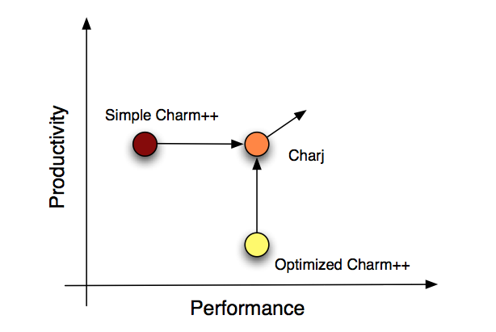
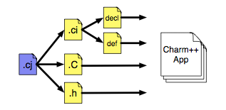

=======================================================================
Charj Manual Compiler Support for Productive Parallel Programming  [1]_
=======================================================================

.. contents::
   :depth: 3

Introduction
============

Charj is a new programming language which incorporates syntax, semantic
analysis, and optimization targeted at HPC code with its associated
compiler.

   Charj

With Charj, we aim to allow programmers to achieve the performance
associated with carefully written, hand-optimized Charm++ applications,
but with much less time and effort. If effect, we hope to combine the
productivity that programmers experience when writing relatively simple,
naive applications while enjoying performance that would normally
require a much greater investment of time, effort, and expertise.

Charj compiler takes Charj codes as input and produces Charm++ interface
(.ci) and C++ code (.C and .h) as an output.

   Compilation process for Charj application

To make use of Charj;

#. Build Charm++, then build Charj

#. Write your Charj program

#. Compile and run it!

Building, Compiling and Running
===============================

**To write a program and compile with Charj:**

#. Go to: *charm/src/langs/charj* and *"make"* (Assuming Charm++ is
   already installed)

#. Write your Charj code in a file with *.cj* extension.
   *(SampleProgram.cj)*

#. | Execute *charjc* script on the file *SampleProgram.cj*:
   | *$ charm/src/langs/charj/bin/charjc SampleProgram.cj*
   | For other compiler options, use help:
   | *$ charm/src/langs/bin/charjc -h*

#. After execution of *charjc* script, a folder named
   *“SampleProgram.cj.gen”* will be created in the directory of
   *SampleProgram.cj*. This folder will contain the emitted Charm++
   files; *SampleProgram.ci, SampleProgram.h SampleProgram.cc* .

   \* Example Charj programs can be found at
   *charm/src/langs/charj/tests*

Writing a Charj Program
=======================

General structure of a Charj program;
--------------------------------------

.. code-block:: none

       readonly Main@ mainProxy;   //readonly proxy type
       readonly int value;         //readonly variable

       public mainchare Main {
           public entry Main(CkArgMsg[~]@ m){...}  //Main constructor
           public entry void done(){...}               //entry method
           private int localMethod(int value){...}     //non-entry method
       }
       public chare_array [1d] SampleChareArray1d{...} //1d chare array
       public chare_array [2d] SampleChareArray2d{...} //2d chare array

       public class SampleObject{...}                  //sample class

       public chare SampleChare {
           public entry SampleChare(){...}             //constructor
           public entry SampleChare(boolean flag){...} //constructor 2
           public entry void test(SampleObject obj){...}   //entry method
       }

Chare creation and method calls:
---------------------------------

.. code-block:: none

       SampleChare@ sp = new SampleChare@();
       SampleChareArray1d@ sp1 = new SampleChareArray1d@(x_dim);
       SampleChareArray2d@ sp2 = new SampleChareArray2d@(x_dim, y_dim);
       sp@test();
       sp1@test();
       sp1[index]@test();
       sp2@test(int value);

Arrays:
-------

.. code-block:: none

       Array<int> foo = new Array<int>([10]);  //1d array of integers of size 10
       foo[i] = ...;
       Array<double, 2> foo2 = new Array<double, 2>([s1, s2]); //2d array of size s1, s2
       foo2[i, j] = ...;

SDAG statements:
----------------

These statements can be used inside of any entry method.

::

       when receiveMsg(SampleObject obj) {...}

       overlap{    //two overlapping when statements
           when receiveMsg1[i](int iter, SampleObject obj) {...}
           when receiveMsg2[i](int iter, int value) {...}
       }

Extern statements:
-------------------

If you want to use any other C++ function/feature, you have to define it
as *extern*.

::

       extern atoi;            //define in the beginning of the file
       int x = atoi(y);        //use anywhere

Reduction statements:
---------------------

Currently only plain reductions are supported.

::

       contribute(CkCallback(CkReductionTarget(Main, done), mainProxy));

Some Charm++ statements that can be used in a Charj program:
------------------------------------------------------------

::

       CkExit();
       CkPrintf();
       CkMyPe();
       CkNumPes();
       CkMyNode();
       CkNumNodes();
       CkWallTimer();
       thisProxy
       thisIndex

.. [1]
   last modified 12/14/2012 by Bilge Acun
