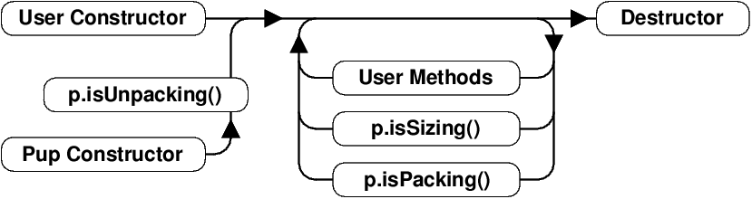
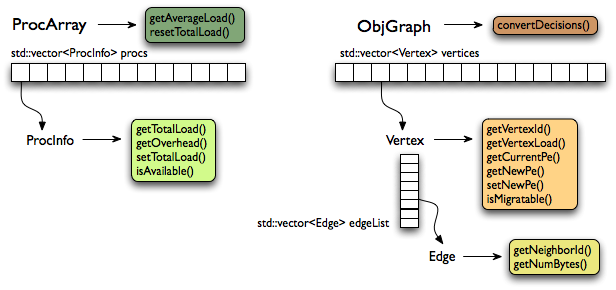

x1=======================================
The Charm++ Parallel Programming System
=======================================

.. contents::
   :depth: 3

Basic Concepts
==============

Charm++ is a C++-based parallel programming system, founded on the
migratable-objects programming model, and supported by a novel and
powerful adaptive runtime system. It supports both irregular as well as
regular applications, and can be used to specify task-parallelism as
well as data parallelism in a single application. It automates dynamic
load balancing for task-parallel as well as data-parallel applications,
via separate suites of load-balancing strategies. Via its message-driven
execution model, it supports automatic latency tolerance, modularity and
parallel composition. Charm++ also supports automatic
checkpoint/restart, as well as fault tolerance based on distributed
checkpoints.

Charm++ is a production-quality parallel programming system used by
multiple applications in science and engineering on supercomputers as
well as smaller clusters around the world. Currently the parallel
platforms supported by Charm++ are OpenPOWER
systems, Cray XE, XK, and XC systems, Omni-Path and Infiniband clusters,
single workstations and networks of workstations (including x86 (running
Linux, Windows, MacOS)), etc. The communication protocols and
infrastructures supported by Charm++ are UDP, MPI, OFI, UCX, Infiniband,
uGNI, and PAMI. Charm++ programs can run without changing the source on
all these platforms. Charm++ programs can also interoperate with MPI
programs (Section :numref:`sec:mpiinterop`). Please see the Installation and Usage
section for details about installing, compiling and running Charm++
programs (Section :numref:`sec:install`).

Programming Model
-----------------

The key feature of the migratable-objects programming model is
*over-decomposition*: The programmer decomposes the program into a large
number of work units and data units, and specifies the computation in
terms of creation of and interactions between these units, without any
direct reference to the processor on which any unit resides. This
empowers the runtime system to assign units to processors, and to change
the assignment at runtime as necessary. Charm++ is the main (and early)
exemplar of this programming model. AMPI is another example within the
Charm++ family of the same model.

.. _mainchare:

Execution Model
---------------

A basic unit of parallel computation in Charm++ programs is a *chare*.
A chare is similar to a process, an actor, an ADA task, etc. At its most
basic level, it is just a C++ object. A Charm++ computation consists of
a large number of chares distributed on available processors of the
system, and interacting with each other via asynchronous method
invocations. Asynchronously invoking a method on a remote object can
also be thought of as sending a “message” to it. So, these method
invocations are sometimes referred to as messages. (besides, in the
implementation, the method invocations are packaged as messages anyway).
Chares can be created dynamically.

Conceptually, the system maintains a “work-pool” consisting of seeds for
new chares, and messages for existing chares. The Charm++ runtime system
( *Charm RTS*) may pick multiple items, non-deterministically, from this
pool and execute them, with the proviso that two different methods
cannot be simultaneously executing on the same chare object (say, on
different processors). Although one can define a reasonable theoretical
operational semantics of Charm++ in this fashion, a more practical
description of execution is useful to understand Charm++. A Charm++
application’s execution is distributed among Processing Elements (PEs),
which are OS threads or processes depending on the selected Charm++
build options. (See section :numref:`sec:machine` for a
precise description.) On each PE, there is a scheduler operating with
its own private pool of messages. Each instantiated chare has one PE
which is where it currently resides. The pool on each PE includes
messages meant for Chares residing on that PE, and seeds for new Chares
that are tentatively meant to be instantiated on that PE. The scheduler
picks a message, creates a new chare if the message is a seed (i.e. a
constructor invocation) for a new Chare, and invokes the method
specified by the message. When the method returns control back to the
scheduler, it repeats the cycle. I.e. there is no pre-emptive scheduling
of other invocations.

When a chare method executes, it may create method invocations for other
chares. The Charm Runtime System (RTS) locates the PE where the targeted chare
resides, and delivers the invocation to the scheduler on that PE.

Methods of a chare that can be remotely invoked are called *entry*
methods. Entry methods may take serializable parameters, or a pointer to
a message object. Since chares can be created on remote processors,
obviously some constructor of a chare needs to be an entry method.
Ordinary entry methods [1]_ are completely non-preemptive- Charm++ will
not interrupt an executing method to start any other work, and all calls
made are asynchronous.

Charm++ provides dynamic seed-based load balancing. Thus location
(processor number) need not be specified while creating a remote chare.
The Charm RTS will then place the remote chare on a suitable processor.
Thus one can imagine chare creation as generating only a seed for the
new chare, which may *take root* on some specific processor at a later
time.

Chares can be grouped into collections. The types of collections of
chares supported in Charm++ are: *chare-arrays*, *chare-groups*, and
*chare-nodegroups*, referred to as *arrays*, *groups*, and *nodegroups*
throughout this manual for brevity. A Chare-array is a collection of an
arbitrary number of migratable chares, indexed by some index type, and
mapped to processors according to a user-defined map group. A group
(nodegroup) is a collection of chares, with exactly one member element
on each PE (“node”).

Charm++ does not allow global variables, except readonly variables (see
:numref:`readonly`). A chare can normally only access its own data
directly. However, each chare is accessible by a globally valid name.
So, one can think of Charm++ as supporting a *global object space*.

Every Charm++ program must have at least one mainchare. Each mainchare
is created by the system on processor 0 when the Charm++ program starts
up. Execution of a Charm++ program begins with the Charm RTS
constructing all the designated mainchares. For a mainchare named X,
execution starts at constructor X() or X(CkArgMsg \*) which are
equivalent. Typically, the mainchare constructor starts the computation
by creating arrays, other chares, and groups. It can also be used to
initialize shared readonly objects.

Charm++ program execution is terminated by the CkExit call. Like the
exit system call, CkExit never returns, and it optionally accepts an
integer value to specify the exit code that is returned to the calling
shell. If no exit code is specified, a value of zero (indicating
successful execution) is returned. The Charm RTS ensures that no more
messages are processed and no entry methods are called after a CkExit.
CkExit need not be called on all processors; it is enough to call it
from just one processor at the end of the computation.

As described so far, the execution of individual Chares is “reactive”:
When method A is invoked the chare executes this code, and so on. But
very often, chares have specific life-cycles, and the sequence of entry
methods they execute can be specified in a structured manner, while
allowing for some localized non-determinism (e.g. a pair of methods may
execute in any order, but when they both finish, the execution continues
in a pre-determined manner, say executing a 3rd entry method). To
simplify expression of such control structures, Charm++ provides two
methods: the structured dagger notation (Section :numref:`sec:sdag`), which
is the main notation we recommend you use. Alternatively, you may use
threaded entry methods, in combination with *futures* and *sync* methods
(See :numref:`threaded`). The threaded methods run in light-weight
user-level threads, and can block waiting for data in a variety of ways.
Again, only the particular thread of a particular chare is blocked,
while the PE continues executing other chares.

The normal entry methods, being asynchronous, are not allowed to return
any value, and are declared with a void return type. However, the *sync*
methods are an exception to this. They must be called from a threaded
method, and so are allowed to return (certain types of) values.

.. _proxies:

Proxies and the charm interface file
------------------------------------

To support asynchronous method invocation and global object space, the
RTS needs to be able to serialize (“marshall”) the parameters, and be
able to generate global “names” for chares. For this purpose,
programmers have to declare the chare classes and the signature of their
entry methods in a special “``.ci``” file, called an interface file.
Other than the interface file, the rest of a Charm++ program consists of
just normal C++ code. The system generates several classes based on the
declarations in the interface file, including “Proxy” classes for each
chare class. Those familiar with various component models (such as
CORBA) in the distributed computing world will recognize “proxy” to be a
dummy, standin entity that refers to an actual entity. For each chare
type, a “proxy” class exists. The methods of this “proxy” class
correspond to the remote methods of the actual class, and act as
“forwarders”. That is, when one invokes a method on a proxy to a remote
object, the proxy marshalls the parameters into a message, puts adequate
information about the target chare on the envelope of the message, and
forwards it to the remote object. Individual chares, chare array,
groups, node-groups, as well as the individual elements of these
collections have a such a proxy. Multiple methods for obtaining such
proxies are described in the manual. Proxies for each type of entity in
Charm++ have some differences among the features they support, but the
basic syntax and semantics remain the same - that of invoking methods on
the remote object by invoking methods on proxies.

The following sections provide detailed information about various
features of the Charm++ programming system. Part I, “Basic Usage”, is
sufficient for writing full-fledged applications. Note that only the
last two chapters of this part involve the notion of physical processors
(cores, nodes, ..), with the exception of simple query-type utilities
(Section :numref:`basic utility fns`). We strongly suggest that all
application developers, beginners and experts alike, try to stick to the
basic language to the extent possible, and use features from the
advanced sections only when you are convinced they are essential. (They
are useful in specific situations; but a common mistake we see when we
examine programs written by beginners is the inclusion of complex
features that are not necessary for their purpose. Hence the caution).
The advanced concepts in the Part II of the manual support
optimizations, convenience features, and more complex or sophisticated
features.  [2]_

.. _machineModel:
.. _sec:machine:

Machine Model
-------------

At its basic level, Charm++ machine model is very simple:
Think of each chare as a separate processor by itself. The methods of
each chare can access its own instance variables (which are all private,
at this level), and any global variables declared as *readonly*. It also
has access to the names of all other chares (the “global object space”),
but all that it can do with that is to send asynchronous remote method
invocations towards other chare objects. (Of course, the instance
variables can include as many other regular C++ objects that it “has”;
but no chare objects. It can only have references to other chare
objects).

In accordance with this vision, the first part of the manual (up to and
including the chapter on load balancing) has almost no mention of
entities with physical meanings (cores, nodes, etc.). The runtime system
is responsible for the magic of keeping closely communicating objects on
nearby physical locations, and optimizing communications within chares
on the same node or core by exploiting the physically available shared
memory. The programmer does not have to deal with this at all. The only
exception to this pure model in the basic part are the functions used
for finding out which “processor” an object is running on, and for
finding how many total processors are there.

However, for implementing lower level libraries, and certain
optimizations, programmers need to be aware of processors. In any case,
it is useful to understand how the Charm++ implementation works under
the hood. So, we describe the machine model, and some associated
terminology here.

In terms of physical resources, we assume the parallel machine consists
of one or more *nodes*, where a node is a largest unit over which cache
coherent shared memory is feasible (and therefore, the maximal set of
cores per which a single process *can* run. Each node may include one or
more processor chips, with shared or private caches between them. Each
chip may contain multiple cores, and each core may support multiple
hardware threads (SMT for example).

Charm++ recognizes two logical entities: a PE (processing element) and a
logical node, or simply “node”. In a Charm++ program, a PE is a unit of
mapping and scheduling: each PE has a scheduler with an associated pool
of messages. Each chare is assumed to reside on one PE at a time. A
logical node is implemented as an OS process. In non-SMP mode there is
no distinction between a PE and a logical node. Otherwise, a PE takes
the form of an OS thread, and a logical node may contain one or more
PEs. Physical nodes may be partitioned into one or more logical nodes.
Since PEs within a logical node share the same memory address space, the
Charm++ runtime system optimizes communication between them by using
shared memory. Depending on the runtime command-line parameters, a PE
may optionally be associated with a subset of cores or hardware threads.

A Charm++ program can be launched with one or more (logical) nodes per
physical node. For example, on a machine with a four-core processor,
where each core has two hardware threads, common configurations in
non-SMP mode would be one node per core (four nodes/PEs total) or one
node per hardware thread (eight nodes/PEs total). In SMP mode, the most
common choice to fully subscribe the physical node would be one logical
node containing *seven* PEs-one OS thread is set aside per process for
network communications. (When built in the “multicore” mode that lacks
network support, a comm thread is unnecessary, and eight PEs can be used
in this case. A comm thread is also omitted when using some
high-performance network layers such as PAMI.) Alternatively, one can
choose to partition the physical node into multiple logical nodes, each
containing multiple PEs. One example would be *three* PEs per logical
node and two logical nodes per physical node, again reserving a comm
thread per logical node.

It is not a general practice in Charm++ to oversubscribe the underlying
physical cores or hardware threads on each node. In other words, a
Charm++ program is usually not launched with more PEs than there are
physical cores or hardware threads allocated to it. More information
about these launch time options are provided in
Appendix :numref:`sec:run`. And utility functions to retrieve the
information about those Charm++ logical machine entities in user
programs can be referred in section :numref:`basic utility fns`.

Basic Charm++ Programming
=========================

.. _programstructure:

Program Structure, Compilation and Utilities
--------------------------------------------

A Charm++ program is essentially a C++ program where some components
describe its parallel structure. Sequential code can be written using
any programming technologies that cooperate with the C++ toolchain. This
includes C and Fortran. Parallel entities in the user’s code are written
in C++. These entities interact with the Charm++ framework via inherited
classes and function calls.

Charm++ Interface (.ci) Files
~~~~~~~~~~~~~~~~~~~~~~~~~~~~~

All user program components that comprise its parallel interface (such
as messages, chares, entry methods, etc.) are granted this elevated
status by declaring them in separate *charm++ interface* description
files. These files have a *.ci* suffix and adopt a C++-like declaration
syntax with several additional keywords. In some declaration contexts,
they may also contain some sequential C++ source code. Charm++ parses
these interface descriptions and generates C++ code (base classes, utility
classes, wrapper functions etc.) that facilitates the interaction of the
user program’s entities with the framework. A program may have several
interface description files.

Syntax Highlighting of .ci Files
^^^^^^^^^^^^^^^^^^^^^^^^^^^^^^^^

Vim
'''

To enable syntax highlighting of .ci files in Vim, do the following:

.. code-block:: bash

   $ cp charm/contrib/ci.vim ~/.vim/syntax/.
   $ vim ~/.vim/filetype.vim

And paste the following line in that file:

.. code-block:: vim

   au! BufRead,BufNewFile *.ci set filetype=ci

Sublime Text
''''''''''''

Syntax highlighting in Sublime Text (version 3 or newer) can be enabled
by installing the *Charmci* package through Package Control.

Emacs
'''''

Syntax highlighting in Emacs can be enabled by triggering C++ handling on the .ci file extension by adding the following line to your .emacs file.

.. code-block:: emacs

   (add-to-list 'auto-mode-alist '("\\.ci\\'" . c++-mode))

Pygments
''''''''

Pygments supports syntax highlighting of .ci files starting with version 2.4.0,
when setting ``charmci`` as the highlighting language, or automatically for files with
the ``.ci`` filename extension.

Modules
~~~~~~~

The top-level construct in a *ci* file is a named container for
interface declarations called a *module*. Modules allow related
declarations to be grouped together, and cause generated code for these
declarations to be grouped into files named after the module. Modules
cannot be nested, but each *ci* file can have several modules. Modules
are specified using the keyword *module*. A module name must be a valid
C++ identifier.

.. code-block:: charmci

   module myFirstModule {
       // Parallel interface declarations go here
       ...
   };

Generated Files
~~~~~~~~~~~~~~~

Each module present in a *ci* file is parsed to generate two files. The
basename of these files is the same as the name of the module and their
suffixes are *.decl.h* and *.def.h*. For e.g., the module defined
earlier will produce the files “myFirstModule.decl.h” and
“myFirstModule.def.h”. As the suffixes indicate, they contain the
declarations and definitions respectively, of all the classes and
functions that are generated based on the parallel interface
description.

We recommend that the header file containing the declarations (decl.h)
be included at the top of the files that contain the declarations or
definitions of the user program entities mentioned in the corresponding
module. The def.h is not actually a header file because it contains
definitions for the generated entities. To avoid multiple definition
errors, it should be compiled into just one object file. A convention we
find useful is to place the def.h file at the bottom of the source file
(.C, .cpp, .cc etc.) which includes the definitions of the corresponding
user program entities.

It should be noted that the generated files have no dependence on the
name of the *ci* file, but only on the names of the modules. This can
make automated dependency-based build systems slightly more complicated.

Module Dependencies
~~~~~~~~~~~~~~~~~~~

A module may depend on the parallel entities declared in another module.
It can express this dependency using the *extern* keyword. *extern* ed
modules do not have to be present in the same *ci* file.

.. code-block:: charmci

   module mySecondModule {

       // Entities in this module depend on those declared in another module
       extern module myFirstModule;

       // More parallel interface declarations
       ...
   };

The *extern* keyword places an include statement for the decl.h file of
the *extern* ed module in the generated code of the current module. Hence,
decl.h files generated from *extern* ed modules are required during the
compilation of the source code for the current module. This is usually
required anyway because of the dependencies between user program
entities across the two modules.

The Main Module and Reachable Modules
~~~~~~~~~~~~~~~~~~~~~~~~~~~~~~~~~~~~~

Charm++ software can contain several module definitions from several
independently developed libraries / components. However, the user
program must specify exactly one module as containing the starting point
of the program’s execution. This module is called the *mainmodule*. Every
Charm++ program has to contain precisely one *mainmodule*.

All modules that are “reachable” from the *mainmodule* via a chain of
*extern* ed module dependencies are included in a Charm++ program. More
precisely, during program execution, the Charm++ runtime system will
recognize only the user program entities that are declared in reachable
modules. The decl.h and def.h files may be generated for other modules,
but the runtime system is not aware of entities declared in such
unreachable modules.

.. code-block:: charmci

   module A {
       ...
   };

   module B {
       extern module A;
       ...
   };

   module C {
       extern module A;
       ...
   };

   module D {
       extern module B;
       ...
   };

   module E {
       ...
   };

   mainmodule M {
       extern module C;
       extern module D;
       // Only modules A, B, C and D are reachable and known to the runtime system
       // Module E is unreachable via any chain of externed modules
       ...
   };

Including other headers
~~~~~~~~~~~~~~~~~~~~~~~

There can be occasions where code generated from the module definitions
requires other declarations / definitions in the user program’s
sequential code. Usually, this can be achieved by placing such user code
before the point of inclusion of the decl.h file. However, this can
become laborious if the decl.h file has to included in several places.
Charm++ supports the keyword *include* in *ci* files to permit the
inclusion of any header directly into the generated decl.h files.

.. code-block:: charmci

   module A {
       include "myUtilityClass.h"; //< Note the semicolon
       // Interface declarations that depend on myUtilityClass
       ...
   };

   module B {
       include "someUserTypedefs.h";
       // Interface declarations that require user typedefs
       ...
   };

   module C {
       extern module A;
       extern module B;
       // The user includes will be indirectly visible here too
       ...
   };

The main() function
~~~~~~~~~~~~~~~~~~~

The Charm++ framework implements its own main function and
retains control until the parallel execution environment is initialized
and ready for executing user code. Hence, the user program must not
define a *main()* function. Control enters the user code via the
*mainchare* of the *mainmodule*. This will be discussed in further detail
in :numref:`mainchare`.

Using the facilities described thus far, the parallel interface
declarations for a Charm++ program can be spread across multiple ci
files and multiple modules, permitting good control over the grouping
and export of parallel API. This aids the encapsulation of parallel
software.

Compiling Charm++ Programs
~~~~~~~~~~~~~~~~~~~~~~~~~~

Charm++ provides a compiler-wrapper called *charmc* that handles all *ci*,
C, C++ and Fortran source files that are part of a user program. Users can
invoke charmc to parse their interface descriptions, compile source code
and link objects into binaries. It also links against the appropriate
set of charm framework objects and libraries while producing a binary.
*charmc* and its functionality is described in :numref:`sec:compile`.

.. _basic utility fns:

Utility Functions
~~~~~~~~~~~~~~~~~

The following calls provide basic rank information and utilities useful
when running a Charm++ program.

``void CkAssert(int expression)``
Aborts the program if expression is 0.

``void CkAbort(const char *format, ...)``
Causes the program to abort, printing
the given error message. Supports printf-style formatting.
This function never returns.

``void CkExit()``
This call informs the Charm RTS that computation on all
processors should terminate. This routine never returns, so any code
after the call to CkExit() inside the function that calls it will not
execute. Other processors will continue executing until they receive
notification to stop, so it is a good idea to ensure through
synchronization that all useful work has finished before calling
CkExit().

``double CkWallTimer()``
Returns the elapsed wall time since the start of execution in seconds.

Information about Logical Machine Entities
^^^^^^^^^^^^^^^^^^^^^^^^^^^^^^^^^^^^^^^^^^

As described in section :numref:`machineModel`, Charm++ recognizes
two logical machine entities: “node” and PE (processing element). The
following functions provide basic information about such logical machine
that a Charm++ program runs on. PE and “node” are numbered starting from
zero.

``int CkNumPes()``
Returns the total number of PEs across all nodes.

``int CkMyPe()``
Returns the index of the PE on which the call was made.

``int CkNumNodes()``
Returns the total number of logical Charm++ nodes.

``int CkMyNode()``
Returns the index of the “node” on which the call was
made.

``int CkMyRank()``
Returns the rank number of the PE on a “node” on which
the call was made. PEs within a “node” are also ranked starting from
zero.

``int CkNodeFirst(int nd)``
Returns the index of the first PE on the logical
node :math:`nd`.

``int CkNodeSize(int nd)``
Returns the number of PEs on the logical node
:math:`nd` on which the call was made.

``int CkNodeOf(int pe)``
Returns the “node” number that PE :math:`pe`
belongs to.

``int CkRankOf(int pe)``
Returns the rank of the given PE within its node.

Terminal I/O
^^^^^^^^^^^^

Charm++ provides both C and C++ style methods of doing terminal I/O.

In place of C-style printf and scanf, Charm++ provides CkPrintf and
CkScanf. These functions have interfaces that are identical to their C
counterparts, but there are some differences in their behavior that
should be mentioned.

Charm++ also supports all forms of printf, cout, etc. in addition to the
special forms shown below. The special forms below are still useful,
however, since they obey well-defined (but still lax) ordering
requirements.

``int CkPrintf(format [, arg]*)``
This call is used for atomic terminal
output. Its usage is similar to ``printf`` in C. However, CkPrintf has
some special properties that make it more suited for parallel
programming. CkPrintf routes all terminal output to a single end point
which prints the output. This guarantees that the output for a single
call to CkPrintf will be printed completely without being interleaved
with other calls to CkPrintf. Note that CkPrintf is implemented using an
asynchronous send, meaning that the call to CkPrintf returns immediately
after the message has been sent, and most likely before the message has
actually been received, processed, and displayed. As such, there is no
guarantee of order in which the output for concurrent calls to CkPrintf
is printed. Imposing such an order requires proper synchronization
between the calls to CkPrintf in the parallel application.

``void CkError(format [, arg]*))``
Like CkPrintf, but used to print error messages on stderr.

``int CkScanf(format [, arg]*)``
This call is used for atomic terminal input. Its usage is similar to scanf in C. A call to CkScanf, unlike CkPrintf, blocks all execution on the processor it is called from, and returns only after all input has been retrieved.

For C++ style stream-based I/O, Charm++ offers ``ckout`` and ``ckerr`` in place of
``cout`` and ``cerr``. The C++ streams and their Charm++ equivalents are related
in the same manner as printf and scanf are to ``CkPrintf`` and ``CkScanf``. The
Charm++ streams are all used through the same interface as the
C++ streams, and all behave in a slightly different way, just like C-style
I/O.

Basic Syntax
------------

.. _entry:

Entry Methods
~~~~~~~~~~~~~

Member functions in the user program which function as entry methods
have to be defined in public scope within the class definition. Entry
methods typically do not return data and have a “void” return type. An
entry method with the same name as its enclosing class is a constructor
entry method and is used to create or spawn chare objects during
execution. Class member functions are annotated as entry methods by
declaring them in the interface file as:

.. code-block:: charmci

   entry void Entry1(parameters);

Parameters is either a list of serializable parameters, (e.g., “int i,
double x”), or a message type (e.g., “MyMessage \*msg”). Since
parameters get marshalled into a message before being sent across the
network, in this manual we use “message” to mean either a message type
or a set of marshalled parameters.

Messages are lower level, more efficient, more flexible to use than
parameter marshalling.

For example, a chare could have this entry method declaration in the
interface (``.ci``) file:

.. code-block:: charmci

     entry void foo(int i,int k);

Then invoking foo(2,3) on the chare proxy will eventually invoke
foo(2,3) on the chare object.

Since Charm++ runs on distributed memory machines, we cannot pass an
array via a pointer in the usual C++ way. Instead, we must specify the
length of the array in the interface file, as:

.. code-block:: charmci

     entry void bar(int n,double arr[n]);

Since C++ does not recognize this syntax, the array data must be passed to
the chare proxy as a simple pointer. The array data will be copied and
sent to the destination processor, where the chare will receive the copy
via a simple pointer again. The remote copy of the data will be kept
until the remote method returns, when it will be freed. This means any
modifications made locally after the call will not be seen by the remote
chare; and the remote chare’s modifications will be lost after the
remote method returns- Charm++ always uses call-by-value, even for
arrays and structures.

This also means the data must be copied on the sending side, and to be
kept must be copied again at the receive side. Especially for large
arrays, this is less efficient than messages, as described in the next
section.

Array parameters and other parameters can be combined in arbitrary ways,
as:

.. code-block:: charmci

     entry void doLine(float data[n],int n);
     entry void doPlane(float data[n*n],int n);
     entry void doSpace(int n,int m,int o,float data[n*m*o]);
     entry void doGeneral(int nd,int dims[nd],float data[product(dims,nd)]);

The array length expression between the square brackets can be any valid
C++ expression, including a fixed constant, and may depend in any manner
on any of the passed parameters or even on global functions or global
data. The array length expression is evaluated exactly once per
invocation, on the sending side only. Thus executing the doGeneral
method above will invoke the (user-defined) product function exactly
once on the sending processor.

Marshalling User-Defined Structures and Classes
^^^^^^^^^^^^^^^^^^^^^^^^^^^^^^^^^^^^^^^^^^^^^^^

The marshalling system uses the pup framework to copy data, meaning
every user class that is marshalled needs either a pup routine, a
“PUPbytes” declaration, or a working operator|. See the PUP description
in Section :numref:`sec:pup` for more details on these
routines.

Any user-defined types in the argument list must be declared before
including the “.decl.h” file. Any user-defined types must be fully
defined before the entry method declaration that consumes it. This is
typically done by including the header defining the type in the ``.ci``
file. Alternatively, one may define it before including the ``.decl.h``
file. As usual in C, it is often dramatically more efficient to pass a
large structure by reference than by value.

As an example, refer to the following code from
``examples/charm++/PUP/HeapPUP``:

.. code-block:: charmci

   // In HeapObject.h:

   class HeapObject {
    public:
     int publicInt;

     // ... other methods ...

     void pup(PUP::er &p) {
       // remember to pup your superclass if there is one
       p|publicInt;
       p|privateBool;
       if (p.isUnpacking())
         data = new float[publicInt];
       PUParray(p, data, publicInt);
     }

    private:
     bool privateBool;
     float *data;
   };

   // In SimplePup.ci:

   mainmodule SimplePUP {
     include "HeapObject.h";

     // ... other Chare declarations ...

     array [1D] SimpleArray{
       entry SimpleArray();
       entry void acceptData(HeapObject &inData);
     };
   };

   // In SimplePup.h:

   #include "SimplePUP.decl.h"

   // ... other definitions ...

   class SimpleArray : public CBase_SimpleArray {
    public:
     void acceptData(HeapObject &inData) {
       // ... code using marshalled parameter ...
     }
   };

   // In SimplePup.C:

   #include "SimplePUP.h"

   main::main(CkArgMsg *m)
   {
     // normal object construction
     HeapObject exampleObject(... parameters ...);

     // normal chare array construction
     CProxy_SimpleArray simpleProxy = CProxy_SimpleArray::ckNew(30);

     // pass object to remote method invocation on the chare array
     simpleProxy[29].acceptData(exampleObject);
   }

   #include "SimplePUP.def.h"

Chare Objects
~~~~~~~~~~~~~

Chares are concurrent objects with methods that can be invoked remotely.
These methods are known as entry methods. All chares must have a
constructor that is an entry method, and may have any number of other
entry methods. All chare classes and their entry methods are declared in
the interface (``.ci``) file:

.. code-block:: charmci

       chare ChareType
       {
           entry ChareType(parameters1);
           entry void EntryMethodName(parameters2);
       };

Although it is *declared* in an interface file, a chare is a C++ object
and must have a normal C++ *implementation* (definition) in addition. A
chare class ``ChareType`` must inherit from the class
``CBase_ChareType``, which is a special class that is generated by the
Charm++ translator from the interface file. Note that C++ namespace
constructs can be used in the interface file, as demonstrated in
``examples/charm++/namespace``.

To be concrete, the C++ definition of the chare above might have the
following definition in a ``.h`` file:

.. code-block:: c++

      class ChareType : public CBase_ChareType {
          // Data and member functions as in C++
          public:
              ChareType(parameters1);
              void EntryMethodName2(parameters2);
      };

Each chare encapsulates data associated with medium-grained units of
work in a parallel application. Chares can be dynamically created on any
processor; there may be thousands of chares on a processor. The location
of a chare is usually determined by the dynamic load balancing strategy.
However, once a chare commences execution on a processor, it does not
migrate to other processors [3]_. Chares do not have a default “thread
of control”: the entry methods in a chare execute in a message driven
fashion upon the arrival of a message [4]_.

The entry method definition specifies a function that is executed
*without interruption* when a message is received and scheduled for
processing. Only one message per chare is processed at a time. Entry
methods are defined exactly as normal C++ function members, except that
they must have the return value void (except for the constructor entry
method which may not have a return value, and for a *synchronous* entry
method, which is invoked by a *threaded* method in a remote chare). Each
entry method can either take no arguments, take a list of arguments that
the runtime system can automatically pack into a message and send (see
section :numref:`entry`), or take a single argument that is a pointer
to a Charm++ message (see section :numref:`messages`).

A chare’s entry methods can be invoked via *proxies* (see
section :numref:`proxies`). Proxies to a chare of type ``chareType``
have type ``CProxy_chareType``. By inheriting from the CBase parent
class, each chare gets a ``thisProxy`` member variable, which holds a
proxy to itself. This proxy can be sent to other chares, allowing them
to invoke entry methods on this chare.

.. _chare creation:

Chare Creation
^^^^^^^^^^^^^^

Once you have declared and defined a chare class, you will want to
create some chare objects to use. Chares are created by the ``ckNew``
method, which is a static method of the chare’s proxy class:

.. code-block:: c++

      CProxy_chareType::ckNew(parameters, int destPE);

The ``parameters`` correspond to the parameters of the chare’s
constructor. Even if the constructor takes several arguments, all of the
arguments should be passed in order to ``ckNew``. If the constructor
takes no arguments, the parameters are omitted. By default, the new
chare’s location is determined by the runtime system. However, this can
be overridden by passing a value for ``destPE``, which specifies the PE
where the chare will be created.

The chare creation method deposits the *seed* for a chare in a pool of
seeds and returns immediately. The chare will be created later on some
processor, as determined by the dynamic load balancing strategy (or by
``destPE``). When a chare is created, it is initialized by calling its
constructor entry method with the parameters specified by ``ckNew``.

Suppose we have declared a chare class ``C`` with a constructor that
takes two arguments, an ``int`` and a ``double``.

#. This will create a new chare of type C on any processor and return a
   proxy to that chare:

   .. code-block:: c++

         CProxy_C chareProxy = CProxy_C::ckNew(1, 10.0);

#. This will create a new chare of type C on processor destPE and return
   a proxy to that chare:

   .. code-block:: c++

         CProxy_C chareProxy = CProxy_C::ckNew(1, 10.0, destPE);

For an example of chare creation in a full application, see
``examples/charm++/fib`` in the Charm++ software distribution, which
calculates Fibonacci numbers in parallel.

Method Invocation on Chares
^^^^^^^^^^^^^^^^^^^^^^^^^^^

A message may be sent to a chare through a proxy object using the
notation:

.. code-block:: c++

       chareProxy.EntryMethod(parameters)

This invokes the entry method EntryMethod on the chare referred to by
the proxy chareProxy. This call is asynchronous and non-blocking; it
returns immediately after sending the message.

Local Access
^^^^^^^^^^^^

You can get direct access to a local chare using the proxy’s ckLocal
method, which returns an ordinary C++ pointer to the chare if it exists on
the local processor, and NULL otherwise.

.. code-block:: c++

       C *c=chareProxy.ckLocal();
       if (c==NULL) {
           // object is remote; send message
       } else {
           // object is local; directly use members and methods of c
       }

.. _readonly:

Read-only Data
~~~~~~~~~~~~~~

Since Charm++ does not allow global variables, it provides a special
mechanism for sharing data amongst all objects. *Read-only* variables of
simple data types or compound data types including messages and arrays
are used to share information that is obtained only after the program
begins execution and does not change after they are initialized in the
dynamic scope of the ``main`` function of the mainchare. They are
broadcast to every Charm++ Node (process) by the Charm++ runtime, and
can be accessed in the same way as C++ “global” variables on any process.
Compound data structures containing pointers can be made available as
read-only variables using read-only messages(see
section :numref:`messages`) or read-only arrays(see
section :numref:`basic arrays`). Note that memory has to be
allocated for read-only messages by using new to create the message in
the ``main`` function of the mainchare.

Read-only variables are declared by using the type modifier readonly,
which is similar to const in C++. Read-only data is specified in the
``.ci`` file (the interface file) as:

.. code-block:: charmci

    readonly Type ReadonlyVarName;

The variable ReadonlyVarName is declared to be a read-only variable of
type Type. Type must be a single token and not a type expression.

.. code-block:: charmci

    readonly message MessageType *ReadonlyMsgName;

The variable ReadonlyMsgName is declared to be a read-only message of
type MessageType. Pointers are not allowed to be readonly variables
unless they are pointers to message types. In this case, the message
will be initialized on every PE.

.. code-block:: charmci

    readonly Type ReadonlyArrayName [arraysize];

The variable ReadonlyArrayName is declared to be a read-only array of
type Type with arraysize elements. Type must be a single token and not a
type expression. The value of arraysize must be known at compile time.

Read-only variables must be declared either as global or as public class
static data in the C/C++ implementation files, and these declarations have
the usual form:

.. code-block:: c++

    Type ReadonlyVarName;
    MessageType *ReadonlyMsgName;
    Type ReadonlyArrayName [arraysize];

Similar declarations preceded by extern would appear in the ``.h`` file.

*Note:* The current Charm++ translator cannot prevent assignments to
read-only variables. The user must make sure that no assignments occur
in the program outside of the mainchare constructor.

For concrete examples for using read-only variables, please refer to
examples such as ``examples/charm++/array`` and
``examples/charm++/gaussSeidel3D``.

Users can get the same functionality of readonly variables by making
such variables members of Charm++ Node Group objects and constructing
the Node Group in the mainchare’s main routine.

.. _basic arrays:

Chare Arrays
------------

Chare arrays are arbitrarily-sized, possibly-sparse collections of
chares that are distributed across the processors. The entire array has
a globally unique identifier of type CkArrayID, and each element has a
unique index of type CkArrayIndex. A CkArrayIndex can be a single
integer (i.e. a one-dimensional array), several integers (i.e. a
multi-dimensional array), or an arbitrary string of bytes (e.g. a binary
tree index).

Array elements can be dynamically created and destroyed on any PE,
migrated between PEs, and messages for the elements will still arrive
properly. Array elements can be migrated at any time, allowing arrays to
be efficiently load balanced. A chare array (or a subset of array
elements) can receive a broadcast/multicast or contribute to a
reduction.

An example program can be found here: ``examples/charm++/array``.

Declaring a One-dimensional Array
~~~~~~~~~~~~~~~~~~~~~~~~~~~~~~~~~

You can declare a one-dimensional (1D) chare array as:

.. code-block:: charmci

   //In the .ci file:
   array [1D] A {
     entry A(parameters1);
     entry void someEntry(parameters2);
   };

Array elements extend the system class CBase_ClassName, inheriting
several fields:

-  thisProxy: the proxy to the entire chare array that can be indexed to
   obtain a proxy to a specific array element (e.g. for a 1D chare array
   thisProxy[10]; for a 2D chare array thisProxy(10, 20))

-  thisArrayID: the array’s globally unique identifier

-  thisIndex: the element’s array index (an array element can obtain a
   proxy to itself like this thisProxy[thisIndex])

.. code-block:: c++

   class A : public CBase_A {
     public:
       A(parameters1);

       void someEntry(parameters2);
   };

Note that A must have a *migration constructor* if it is to be migratable.
The migration constructor is typically empty:

.. code-block:: c++

   //In the .C file:
   A::A(void)
   {
     //... constructor code ...
   }

   A::someEntry(parameters2)
   {
     // ... code for someEntry ...
   }

See the section :numref:`arraymigratable` on migratable array
elements for more information on the migration constructor that takes
CkMigrateMessage \* as the argument.

Declaring Multi-dimensional Arrays
~~~~~~~~~~~~~~~~~~~~~~~~~~~~~~~~~~

Charm++ supports multi-dimensional or user-defined indices. These array
types can be declared as:

.. code-block:: charmci

   //In the .ci file:
   array [1D]  ArrayA { entry ArrayA(); entry void e(parameters);}
   array [2D]  ArrayB { entry ArrayB(); entry void e(parameters);}
   array [3D]  ArrayC { entry ArrayC(); entry void e(parameters);}
   array [4D]  ArrayD { entry ArrayD(); entry void e(parameters);}
   array [5D]  ArrayE { entry ArrayE(); entry void e(parameters);}
   array [6D]  ArrayF { entry ArrayF(); entry void e(parameters);}
   array [Foo] ArrayG { entry ArrayG(); entry void e(parameters);}
   array [Bar<3>] ArrayH { entry ArrayH(); entry void e(parameters);}

The declaration of ArrayG expects an array index of type
CkArrayIndexFoo, which must be defined before including the ``.decl.h``
file (see section :numref:`user-defined array index type` on
user-defined array indices for more information).

.. code-block:: c++

   //In the .h file:
   class ArrayA : public CBase_ArrayA { public: ArrayA(){} ...};
   class ArrayB : public CBase_ArrayB { public: ArrayB(){} ...};
   class ArrayC : public CBase_ArrayC { public: ArrayC(){} ...};
   class ArrayD : public CBase_ArrayD { public: ArrayD(){} ...};
   class ArrayE : public CBase_ArrayE { public: ArrayE(){} ...};
   class ArrayF : public CBase_ArrayF { public: ArrayF(){} ...};
   class ArrayG : public CBase_ArrayG { public: ArrayG(){} ...};
   class ArrayH : public CBase_ArrayH { public: ArrayH(){} ...};

The fields in thisIndex are different depending on the dimensionality of
the chare array:

-  1D array: thisIndex

-  2D array (:math:`x`,\ :math:`y`): thisIndex.x, thisIndex.y

-  3D array (:math:`x`,\ :math:`y`,\ :math:`z`): thisIndex.x,
   thisIndex.y, thisIndex.z

-  4D array (:math:`w`,\ :math:`x`,\ :math:`y`,\ :math:`z`):
   thisIndex.w, thisIndex.x, thisIndex.y, thisIndex.z

-  5D array (:math:`v`,\ :math:`w`,\ :math:`x`,\ :math:`y`,\ :math:`z`):
   thisIndex.v, thisIndex.w, thisIndex.x, thisIndex.y, thisIndex.z

-  6D array
   (:math:`x_1`,\ :math:`y_1`,\ :math:`z_1`,\ :math:`x_2`,\ :math:`y_2`,\ :math:`z_2`):
   thisIndex.x1, thisIndex.y1, thisIndex.z1, thisIndex.x2, thisIndex.y2,
   thisIndex.z2

-  Foo array: thisIndex

-  Bar<3> array: thisIndex

.. _basic array creation:

Creating an Array
~~~~~~~~~~~~~~~~~

An array is created using the CProxy_Array::ckNew routine, which must be
called from PE 0. To create an array from any PE, asynchronous array
creation using a callback can be used. See
section :numref:`asynchronous_array_creation` for asynchronous
array creation. CProxy_Array::ckNew returns a proxy object, which can be
kept, copied, or sent in messages. The following creates a 1D array
containing elements indexed (0, 1, …, dimX-1):

.. code-block:: c++

   CProxy_ArrayA a1 = CProxy_ArrayA::ckNew(params, dimX);

Likewise, a dense multidimensional array can be created by passing the
extents at creation time to ckNew.

.. code-block:: c++

   CProxy_ArrayB a2 = CProxy_ArrayB::ckNew(params, dimX, dimY);
   CProxy_ArrayC a3 = CProxy_ArrayC::ckNew(params, dimX, dimY, dimZ);
   CProxy_ArrayD a4 = CProxy_ArrayC::ckNew(params, dimW, dimX, dimY, dimZ);
   CProxy_ArrayE a5 = CProxy_ArrayC::ckNew(params, dimV, dimW, dimX, dimY, dimZ);
   CProxy_ArrayF a6 = CProxy_ArrayC::ckNew(params, dimX1, dimY1, dimZ1, dimX2, dimY2, dimZ2);

For user-defined arrays, this functionality cannot be used. The array
elements must be inserted individually as described in
section :numref:`dynamic_insertion`.

During creation, the constructor is invoked on each array element. For
more options when creating the array, see
section :numref:`advanced array create`.

Entry Method Invocation
~~~~~~~~~~~~~~~~~~~~~~~

To obtain a proxy to a specific element in chare array, the chare array
proxy (e.g. thisProxy) must be indexed by the appropriate index call
depending on the dimensionality of the array:

-  1D array, to obtain a proxy to element :math:`i`:
   thisProxy[:math:`i`] or thisProxy(\ :math:`i`)

-  2D array, to obtain a proxy to element :math:`(i,j)`:
   thisProxy(\ :math:`i`,\ :math:`j`)

-  3D array, to obtain a proxy to element :math:`(i,j,k)`:
   thisProxy(\ :math:`i`,\ :math:`j`,\ :math:`k`)

-  4D array, to obtain a proxy to element :math:`(i,j,k,l)`:
   thisProxy(\ :math:`i`,\ :math:`j`,\ :math:`k`,\ :math:`l`)

-  5D array, to obtain a proxy to element :math:`(i,j,k,l,m)`:
   thisProxy(\ :math:`i`,\ :math:`j`,\ :math:`k`,\ :math:`l`,\ :math:`m`)

-  6D array, to obtain a proxy to element :math:`(i,j,k,l,m,n)`:
   thisProxy(\ :math:`i`,\ :math:`j`,\ :math:`k`,\ :math:`l`,\ :math:`m`,\ :math:`n`)

-  User-defined array, to obtain a proxy to element :math:`i`:
   thisProxy[:math:`i`] or thisProxy(\ :math:`i`)

To send a message to an array element, index the proxy and call the
method name:

.. code-block:: c++

   a1[i].doSomething(parameters);
   a3(x,y,z).doAnother(parameters);
   aF[CkArrayIndexFoo(...)].doAgain(parameters);

You may invoke methods on array elements that have not yet been created.
The Charm++ runtime system will buffer the message until the element is
created.  [5]_

Messages are not guaranteed to be delivered in order. For instance, if a
method is invoked on method A and then method B; it is possible that B
is executed before A.

.. code-block:: c++

   a1[i].A();
   a1[i].B();

Messages sent to migrating elements will be delivered after the
migrating element arrives on the destination PE. It is an error to send
a message to a deleted array element.

Broadcasts on Chare Arrays
~~~~~~~~~~~~~~~~~~~~~~~~~~

To broadcast a message to all the current elements of an array, simply
omit the index (invoke an entry method on the chare array proxy):

.. code-block:: c++

   a1.doIt(parameters); //<- invokes doIt on each array element

The broadcast message will be delivered to every existing array element
exactly once. Broadcasts work properly even with ongoing migrations,
insertions, and deletions.

.. _reductions:

Reductions on Chare Arrays
~~~~~~~~~~~~~~~~~~~~~~~~~~

A reduction applies a single operation (e.g. add, max, min, ...) to data
items scattered across many processors and collects the result in one
place. Charm++ supports reductions over the members of an array or
group.

The data to be reduced comes from a call to the member contribute
method:

.. code-block:: c++

   void contribute(int nBytes, const void *data, CkReduction::reducerType type);

This call contributes nBytes bytes starting at data to the reduction
type (see Section :numref:`builtin_reduction`). Unlike sending a
message, you may use data after the call to contribute. All members of
the chare array or group must call contribute, and all of them must use
the same reduction type.

For example, if we want to sum each array/group member’s single integer
myInt, we would use:

.. code-block:: c++

       // Inside any member method
       int myInt=get_myInt();
       contribute(sizeof(int),&myInt,CkReduction::sum_int);

The built-in reduction types (see below) can also handle arrays of
numbers. For example, if each element of a chare array has a pair of
doubles forces[2], the corresponding elements of which are to be added
across all elements, from each element call:

.. code-block:: c++

       double forces[2]=get_my_forces();
       contribute(2*sizeof(double),forces,CkReduction::sum_double);

Note that since C++ arrays (like forces[2]) are already pointers, we
don’t use &forces.

A slightly simpler interface is available for ``std::vector<T>``, since
the class determines the size and count of the underlying type:

.. code-block:: c++

       CkCallback cb(...);
       vector<double> forces(2);
       get_my_forces(forces);
       contribute(forces, CkReduction::sum_double, cb);

Either of these will result in a ``double`` array of 2 elements, the
first of which contains the sum of all forces[0] values, with the second
element holding the sum of all forces[1] values of the chare array
elements.

Typically the client entry method of a reduction takes a single argument
of type CkReductionMsg (see Section :numref:`reductionClients`).
However, by giving an entry method the reductiontarget attribute in the
``.ci`` file, you can instead use entry methods that take arguments of
the same type as specified by the *contribute* call. When creating a
callback to the reduction target, the entry method index is generated by
``CkReductionTarget(ChareClass, method_name)`` instead of
``CkIndex_ChareClass::method_name(...)``. For example, the code for a
typed reduction that yields an ``int``, would look like this:

.. code-block:: charmci

     // In the .ci file...
     entry [reductiontarget] void done(int result);

     // In some .C file:
     // Create a callback that invokes the typed reduction client
     // driverProxy is a proxy to the chare object on which
     // the reduction target method "done" is called upon completion
     // of the reduction
     CkCallback cb(CkReductionTarget(Driver, done), driverProxy);

     // Contribution to the reduction...
     contribute(sizeof(int), &intData, CkReduction::sum_int, cb);

     // Definition of the reduction client...
     void Driver::done(int result)
     {
       CkPrintf("Reduction value: %d", result);
     }

This will also work for arrays of data
elements(\ ``entry [reductiontarget] void done(int n, int result[n])``),
and for any user-defined type with a PUP method (see
:numref:`sec:pup`). If you know that the reduction will yield a
particular number of elements, say 3 ``int``\ s, you can also specify a
reduction target which takes 3 ``int``\ s and it will be invoked
correctly.

Reductions do not have to specify commutative-associative operations on
data; they can also be used to signal the fact that all array/group
members have reached a certain synchronization point. In this case, a
simpler version of contribute may be used:

.. code-block:: c++

       contribute();

In all cases, the result of the reduction operation is passed to the
*reduction client*. Many different kinds of reduction clients can be
used, as explained in Section :numref:`reductionClients`.

Please refer to ``examples/charm++/reductions/typed_reduction`` for a
working example of reductions in Charm++.

Note that the reduction will complete properly even if chare array
elements are *migrated* or *deleted* during the reduction. Additionally,
when you create a new chare array element, it is expected to contribute
to the next reduction not already in progress on that processor.

.. _builtin_reduction:

Built-in Reduction Types
^^^^^^^^^^^^^^^^^^^^^^^^

Charm++ includes several built-in reduction types, used to combine
individual contributions. Any of them may be passed as an argument of
type CkReduction::reducerType to contribute.

The first four operations (``sum``, ``product``, ``max``, and ``min``)
work on ``char``, ``short``, ``int``, ``long``, ``long long``,
``float``, or ``double`` data as indicated by the suffix. The logical
reductions (``and``, ``or``) only work on bool and integer data. All the
built-in reductions work on either single numbers (pass a pointer) or
arrays- just pass the correct number of bytes to contribute.

#. CkReduction::nop : no operation performed.

#. CkReduction::sum_char, sum_short, sum_int, sum_long, sum_long_long,
   sum_uchar, sum_ushort, sum_uint, sum_ulong, sum_ulong_long,
   sum_float, sum_double : the result will be the sum of the given
   numbers.

#. CkReduction::product_char, product_short, product_int, product_long,
   product_long_long, product_uchar, product_ushort, product_uint,
   product_ulong, product_ulong_long, product_float, product_double :
   the result will be the product of the given numbers.

#. CkReduction::max_char, max_short, max_int, max_long, max_long_long,
   max_uchar, max_ushort, max_uint, max_ulong, max_ulong_long,
   max_float, max_double : the result will be the largest of the given
   numbers.

#. CkReduction::min_char, min_short, min_int, min_long, min_long_long,
   min_uchar, min_ushort, min_uint, min_ulong, min_ulong_long,
   min_float, min_double : the result will be the smallest of the given
   numbers.

#. CkReduction::logical_and_bool, logical_and_int : the result will be
   the logical AND of the given values.

#. CkReduction::logical_or_bool, logical_or_int : the result will be the
   logical OR of the given values.

#. CkReduction::logical_xor_bool, logical_xor_int : the result will be
   the logical XOR of the given values.

#. CkReduction::bitvec_and_bool, bitvec_and_int : the result will be the
   bitvector AND of the given values.

#. CkReduction::bitvec_or_bool, bitvec_or_int : the result will be the
   bitvector OR of the given values.

#. CkReduction::bitvec_xor_bool, bitvec_xor_int : the result will be the
   bitvector XOR of the given values.

#. CkReduction::set : the result will be a verbatim concatenation of all
   the contributed data, separated into CkReduction::setElement records.
   The data contributed can be of any length, and can vary across array
   elements or reductions. To extract the data from each element, see
   the description below.

#. CkReduction::concat : the result will be a byte-by-byte concatenation
   of all the contributed data. The contributed elements are not
   delimiter-separated.

#. CkReduction::random : the result will be a single randomly selected
   value of all of the contributed values.

#. CkReduction::statistics : returns a CkReduction::statisticsElement
   struct, containing summary statistics of the contributed data.
   Specifically, the struct contains the following fields: int count,
   double mean, and double m2, and the following functions: double
   variance() and double stddev().

CkReduction::set returns a collection of CkReduction::setElement
objects, one per contribution. This class has the definition:

.. code-block:: c++

   class CkReduction::setElement
   {
   public:
     int dataSize; //The length of the `data' array in bytes.
     char data[1]; //A place holder that marks the start of the data array.
     CkReduction::setElement *next(void);
   };

Example: Suppose you would like to contribute 3 integers from each array
element. In the reduction method you would do the following:

.. code-block:: c++

   void ArrayClass::methodName (CkCallback &cb)
   {
     int result[3];
     result[0] = 1;            // Copy the desired values into the result.
     result[1] = 2;
     result[2] = 3;
     // Contribute the result to the reductiontarget cb.
     contribute(3*sizeof(int), result, CkReduction::set, cb);
   }

Inside the reduction’s target method, the contributions can be accessed
by using the ``CkReduction::setElement->next()`` iterator.

.. code-block:: c++

   void SomeClass::reductionTargetMethod (CkReductionMsg *msg)
   {
     // Get the initial element in the set.
     CkReduction::setElement *current = (CkReduction::setElement*) msg->getData();
     while(current != NULL) // Loop over elements in set.
     {
       // Get the pointer to the packed int's.
       int *result = (int*) &current->data;
       // Do something with result.
       current = current->next(); // Iterate.
     }
   }

The reduction set order is undefined. You should add a source field to
the contributed elements if you need to know which array element gave a
particular contribution. Additionally, if the contributed elements are
of a complex data type, you will likely have to supply code for
serializing/deserializing them. Consider using the PUP interface
(Section :numref:`sec:pup`) to simplify your object serialization
needs.

If the outcome of your reduction is dependent on the order in which data
elements are processed, or if your data is just too heterogeneous to be
handled elegantly by the predefined types and you don’t want to
undertake multiple reductions, you can use a tuple reduction or define
your own custom reduction type.

Tuple reductions allow performing multiple different reductions in the
same message. The reductions can be on the same or different data, and
the reducer type for each reduction can be set independently as well.
The contributions that make up a single tuple reduction message are all
reduced in the same order as each other. As an example, a chare array
element can contribute to a gatherv-like operation using a tuple
reduction that consists of two set reductions.

.. code-block:: c++

   int tupleSize = 2;
   CkReduction::tupleElement tupleRedn[] = {
     CkReduction::tupleElement(sizeof(int), &thisIndex, CkReduction::set),
     CkReduction::tupleElement(sizeData, data, CkReduction::set)
   };
   CkReductionMsg* msg = CkReductionMsg::buildFromTuple(tupleRedn, tupleSize);
   CkCallback allgathervCB(CkIndex_Foo::allgathervResult(0), thisProxy);
   msg->setCallback(allgathervCB);
   contribute(msg);

Note that ``CkReduction::tupleElement`` only holds pointers to the data that
will make up the reduction message, therefore any local variables used must
remain in scope until ``CkReductionMsg::buildFromTuple`` completes.

The result of this reduction is a single CkReductionMsg that can be
processed as multiple reductions:

.. code-block:: c++

   void Foo::allgathervResult (CkReductionMsg* msg)
   {
     int numReductions;
     CkReduction::tupleElement* results;

     msg->toTuple(&results, &numReductions);
     CkReduction::setElement* currSrc  = (CkReduction::setElement*)results[0].data;
     CkReduction::setElement* currData = (CkReduction::setElement*)results[1].data;

     // ... process currSrc and currData

     delete [] results;
   }

See the next section (Section :numref:`new_type_reduction`) for details
on custom reduction types.

Destroying Array Elements
~~~~~~~~~~~~~~~~~~~~~~~~~

To destroy an array element - detach it from the array, call its
destructor, and release its memory-invoke its Array destroy method, as:

.. code-block:: c++

   a1[i].ckDestroy();

Note that this method can also be invoked remotely i.e. from a process
different from the one on which the array element resides. You must
ensure that no messages are sent to a deleted element. After destroying
an element, you may insert a new element at its index.

.. _sec:sdag:

Structured Control Flow: Structured Dagger
------------------------------------------

Charm++ is based on the message-driven parallel programming paradigm. In
contrast to many other approaches, Charm++ programmers encode entry
points to their parallel objects, but do not explicitly wait (i.e.
block) on the runtime to indicate completion of posted ‘receive’
requests. Thus, a Charm++ object’s overall flow of control can end up
fragmented across a number of separate methods, obscuring the sequence
in which code is expected to execute. Furthermore, there are often
constraints on when different pieces of code should execute relative to
one another, related to data and synchronization dependencies.

Consider one way of expressing these constraints using flags, buffers,
and counters, as in the following example:

.. code-block:: charmci

   // in .ci file
   chare ComputeObject {
     entry void ComputeObject();
     entry void startStep();
     entry void firstInput(Input i);
     entry void secondInput(Input j);
   };

   // in C++ file
   class ComputeObject : public CBase_ComputeObject {
     int   expectedMessageCount;
     Input first, second;

   public:
     ComputeObject() {
       startStep();
     }
     void startStep() {
       expectedMessageCount = 2;
     }

     void firstInput(Input i) {
       first = i;
       if (--expectedMessageCount == 0)
         computeInteractions(first, second);
       }
     void recv_second(Input j) {
       second = j;
       if (--expectedMessageCount == 0)
         computeInteractions(first, second);
     }

     void computeInteractions(Input a, Input b) {
       // do computations using a and b
       ...
       // send off results
       ...
       // reset for next step
       startStep();
     }
   };

In each step, this object expects pairs of messages, and waits to
process the incoming data until it has both of them. This sequencing is
encoded across 4 different functions, which in real code could be much
larger and more numerous, resulting in a spaghetti-code mess.

Instead, it would be preferable to express this flow of control using
structured constructs, such as loops. Charm++ provides such constructs
for structured control flow across an object’s entry methods in a
notation called Structured Dagger. The basic constructs of Structured
Dagger (SDAG) provide for *program-order execution* of the entry methods
and code blocks that they define. These definitions appear in the
``.ci`` file definition of the enclosing chare class as a ‘body’ of an
entry method following its signature.

The most basic construct in SDAG is the ``serial`` block (previously also
denoted by ``atomic``, this usage is now deprecated). Serial blocks contain
sequential C++ code, and the code within them executes to completion without
returning control to the Charm++ runtime scheduler, thus avoiding interruption
from incoming messages. Typically, serial blocks hold the code that actually
deals with incoming messages in a ``when`` statement or performs local
operations before a message is sent or after it is received. The earlier example
can be adapted to use serial blocks as follows:

.. code-block:: charmci

   // in .ci file
   chare ComputeObject {
     entry void ComputeObject();
     entry void startStep();
     entry void firstInput(Input i) {
       serial {
         first = i;
         if (--expectedMessageCount == 0)
           computeInteractions(first, second);
       }
     };
     entry void secondInput(Input j) {
       serial {
         second = j;
         if (--expectedMessageCount == 0)
           computeInteractions(first, second);
       }
     };
   };

   // in C++ file
   class ComputeObject : public CBase_ComputeObject {
     ComputeObject_SDAG_CODE
     int   expectedMessageCount;
     Input first, second;

   public:
     ComputeObject() {
       startStep();
     }
     void startStep() {
       expectedMessageCount = 2;
     }

     void computeInteractions(Input a, Input b) {
       // do computations using a and b
       . . .
       // send off results
       . . .
       // reset for next step
       startStep();
     }
   };

Note that chare classes containing SDAG code must include a few
additional declarations in addition to inheriting from their
``CBase_Foo`` class, by incorporating the ``Foo_SDAG_CODE``
generated-code macro in the class.

Serial blocks can also specify a textual ‘label’ that will appear in
traces, as follows:

.. code-block:: charmci

     entry void firstInput(Input i) {
       serial "process first" {
         first = i;
         if (--expectedMessageCount == 0)
           computeInteractions(first, second);
       }
     };

In order to control the sequence in which entry methods are processed,
SDAG provides the ``when`` construct. These statements, also called
triggers, indicate that we expect an incoming message of a particular
type, and provide code to handle that message when it arrives. From the
perspective of a chare object reaching a ``when`` statement, it is
effectively a ‘blocking receive.’

Entry methods defined by a ``when`` are not executed immediately when a
message targeting them is delivered, but instead are held until control
flow in the chare reaches a corresponding ``when`` clause. Conversely,
when control flow reaches a ``when`` clause, the generated code checks
whether a corresponding message has arrived: if one has arrived, it is
processed; otherwise, control is returned to the Charm++ scheduler.

The use of ``when`` substantially simplifies the example from above:

.. code-block:: charmci

   // in .ci file
   chare ComputeObject {
     entry void ComputeObject();
     entry void startStep() {
       when firstInput(Input first)
         when secondInput(Input second)
           serial {
             computeInteractions(first, second);
           }
     };
     entry void firstInput(Input i);
     entry void secondInput(Input j);
   };

   // in C++ file
   class ComputeObject : public CBase_ComputeObject {
     ComputeObject_SDAG_CODE

   public:
     ComputeObject() {
       startStep();
     }

     void computeInteractions(Input a, Input b) {
       // do computations using a and b
       . . .
       // send off results
       . . .
       // reset for next step
       startStep();
     }
   };

Like an ``if`` or ``while`` in C code, each ``when`` clause has a body
made up of the statement or block following it. The variables declared
as arguments to the entry method triggering the when are available in
the scope of the body. By using the sequenced execution of SDAG code and
the availability of parameters to when-defined entry methods in their
bodies, the counter ``expectedMessageCount`` and the intermediate copies
of the received input are eliminated. Note that the entry methods
``firstInput`` and ``secondInput`` are still declared in the ``.ci``
file, but their definition is in the SDAG code. The interface translator
generates code to handle buffering and triggering them appropriately.

For simplicity, ``when`` constructs can also specify multiple expected
entry methods that all feed into a single body, by separating their
prototypes with commas:

.. code-block:: charmci

   entry void startStep() {
     when firstInput(Input first),
          secondInput(Input second)
       serial {
         computeInteractions(first, second);
       }
   };

A single entry method is allowed to appear in more than one ``when``
statement. If only one of those ``when`` statements has been triggered
when the runtime delivers a message to that entry method, that ``when``
statement is guaranteed to process it. If there is no trigger waiting
for that entry method, then the next corresponding ``when`` to be
reached will receive that message. If there is more than one ``when``
waiting on that method, which one will receive it is not specified, and
should not be relied upon. For an example of multiple ``when``
statements handling the same entry method without reaching the
unspecified case, see the CharmLU benchmark.

To more finely control the correspondence between incoming messages and
``when`` clauses associated with the target entry method, SDAG supports
*matching* on reference numbers. Matching is typically used to denote an
iteration of a program that executes asynchronously (without any sort of
barrier or other synchronization between steps) or a particular piece of
the problem being solved. Matching is requested by placing an expression
denoting the desired reference number in square brackets between the
entry method name and its parameter list. For parameter marshalled entry
methods, the reference number expression will be compared for equality
with the entry method’s first argument. For entry methods that accept an
explicit message (Section :numref:`messages`), the reference number on the
message can be set by calling the function
``CkSetRefNum(void *msg, CMK_REFNUM_TYPE ref)``. Matching is used in the
loop example below, and in
``examples/charm++/jacobi2d-sdag/jacobi2d.ci``. Multiple ``when``
triggers for an entry method with different matching reference numbers
will not conflict - each will receive only corresponding messages.

SDAG supports the ``for`` and ``while`` loop constructs mostly as if
they appeared in plain C or C++ code. In the running example,
``computeInteractions()`` calls ``startStep()`` when it is finished to
start the next step. Instead of this arrangement, the loop structure can
be made explicit:

.. code-block:: charmci

   // in .ci file
   chare ComputeObject {
     entry void ComputeObject();
     entry void runForever() {
       while(true) {
         when firstInput(Input first),
              secondInput(Input second) serial {
             computeInteractions(first, second);
         }
       }
     };
     entry void firstInput(Input i);
     entry void secondInput(Input j);
   };

   // in C++ file
   class ComputeObject : public CBase_ComputeObject {
     ComputeObject_SDAG_CODE

   public:
     ComputeObject() {
       runForever();
     }

     void computeInteractions(Input a, Input b) {
       // do computations using a and b
       . . .
       // send off results
       . . .
     }
   };

If this code should instead run for a fixed number of iterations, we can
instead use a for loop:

.. code-block:: charmci

   // in .ci file
   chare ComputeObject {
     entry void ComputeObject();
     entry void runForever() {
       for(iter = 0; iter < n; ++iter) {
         // Match to only accept inputs for the current iteration
         when firstInput[iter](int a, Input first),
              secondInput[iter](int b, Input second) serial {
           computeInteractions(first, second);
         }
       }
     };
     entry void firstInput(int a, Input i);
     entry void secondInput(int b, Input j);
   };

   // in C++ file
   class ComputeObject : public CBase_ComputeObject {
     ComputeObject_SDAG_CODE
     int n, iter;

   public:
     ComputeObject() {
       n = 10;
       runForever();
     }

     void computeInteractions(Input a, Input b) {
       // do computations using a and b
       . . .
       // send off results
       . . .
     }
   };

Note that ``int iter;`` is declared in the chare’s class definition and
not in the ``.ci`` file. This is necessary because the Charm++ interface
translator does not fully parse the declarations in the ``for`` loop
header, because of the inherent complexities of C++. Finally, there is
currently no mechanism by which to ``break`` or ``continue`` from an
SDAG loop.

SDAG also supports conditional execution of statements and blocks with
``if`` statements. The syntax of SDAG ``if`` statements matches that of
C and C++. However, if one encounters a syntax error on correct-looking
code in a loop or conditional statement, try assigning the condition
expression to a boolean variable in a serial block preceding the
statement and then testing that boolean’s value. This can be necessary
because of the complexity of parsing C++ code.

In cases where multiple tasks must be processed before execution
continues, but with no dependencies or interactions among them, SDAG
provides the ``overlap`` construct. Overlap blocks contain a series of
SDAG statements within them which can occur in any order. Commonly these
blocks are used to hold a series of ``when`` triggers which can be
received and processed in any order. Flow of control doesn’t leave the
overlap block until all the statements within it have been processed.

In the running example, suppose each input needs to be preprocessed
independently before the call to ``computeInteractions``. Since we don’t
care which order they get processed in, and want it to happen as soon as
possible, we can apply ``overlap``:

.. code-block:: charmci

   // in .ci file
   chare ComputeObject {
     entry void ComputeObject();
     entry void startStep() {
       overlap {
         when firstInput(Input i)
           serial { first = preprocess(i); }
         when secondInput(Input j)
           serial { second = preprocess(j); }
        }
        serial {
          computeInteractions(first, second);
        }
     };
     entry void firstInput(Input i);
     entry void secondInput(Input j);
   };

   // in C++ file
   class ComputeObject : public CBase_ComputeObject {
     ComputeObject_SDAG_CODE

   public:
     ComputeObject() {
       startStep();
     }

     void computeInteractions(Input a, Input b) {
       // do computations using a and b
       . . .
       // send off results
       . . .
       // reset for next step
       startStep();
     }
   };

Another construct offered by SDAG is the ``forall`` loop. These loops
are used when the iterations of a loop can be performed independently
and in any order. This is in contrast to a regular ``for`` loop, in
which each iteration is executed sequentially. The loop iterations are
executed entirely on the calling PE, so they do not run in parallel.
However, they are executed concurrently, in that execution of different
iterations can interleave at ``when`` statements, like any other SDAG
code. SDAG statements following the ``forall`` loop will not execute
until all iterations have completed. The ``forall`` loop can be seen as
an ``overlap`` with an indexed set of otherwise identical statements in
the body.

The syntax of ``forall`` is

.. code-block:: c++

   forall [IDENT] (MIN:MAX,STRIDE) BODY

The range from MIN to MAX is inclusive. In each iteration instance of
``BODY``, the ``IDENT`` variable will take on one of the values in the
specified range. The ``IDENT`` variable must be declared in the
application C++ code as a member of the enclosing chare class.

Use of ``forall`` is demonstrated through distributed parallel
matrix-matrix multiply shown in ``examples/charm++/matmul/matmul.ci``

The ``case`` Statement
~~~~~~~~~~~~~~~~~~~~~~

The ``case`` statement in SDAG expresses a disjunction over a set of
``when`` clauses. In other words, if it is known that one dependency out
of a set will be satisfied, but which one is not known, this statement
allows the set to be specified and will execute the corresponding block
based on which dependency ends up being fulfilled.

The following is a basic example of the ``case`` statement. Note that
the trigger ``b(), d()`` will only be fulfilled if both ``b()`` and
``d()`` arrive. If only one arrives, then it will partially match, and
the runtime will not “commit” to this branch until the second arrives.
If another dependency fully matches, the partial match will be ignored
and can be used to trigger another ``when`` later in the execution.

.. code-block:: text

   case {
     when a() { }
     when b(), d() { }
     when c() { }
   }

A full example of the ``case`` statement can be found
``tests/charm++/sdag/case/caseTest.ci``.

Usage Notes
~~~~~~~~~~~

SDAG Code Declaration
^^^^^^^^^^^^^^^^^^^^^

If you’ve added *Structured Dagger* code to your class, you must link in
the code by adding “*className*\ \_SDAG_CODE” inside the class
declaration in the .h file. This macro defines the entry points and
support code used by *Structured Dagger*. Forgetting this results in a
compile error (undefined SDAG entry methods referenced from the .def.h
file).

For example, an array named “Foo” that uses sdag code might contain:

.. code-block:: c++

   class Foo : public CBase_Foo {
   public:
       Foo_SDAG_CODE
       Foo(...) {
          ...
       }
       Foo(CkMigrateMessage *m) { }

       void pup(PUP::er &p) {
          ...
       }
       . . .
   };

Direct Calls to SDAG Entry Methods
^^^^^^^^^^^^^^^^^^^^^^^^^^^^^^^^^^

An SDAG entry method that contains one or more when clause(s) cannot be
directly called and will result in a runtime error with an error
message. It has to be only called through a proxy. This is a runtime
requirement that is enforced in order to prevent accidental calls to
SDAG entry methods that are asynchronous in nature. Additionally, since
they are called using a proxy, it enhances understandability and clarity
as to not be confused for a regular function call that returns
immediately.

For example, in the first example discussed, it is invalid to call the
SDAG entry method ``startStep`` directly as ``startStep();`` because it
contains when clauses. It has to be only called using the proxy i.e.
``computeObj.startStep();`` , where ``computeObj`` is the proxy to
``ComputeObject``.

.. _sec:pup:

Serialization Using the PUP Framework
-------------------------------------

The PUP (Pack/Unpack) framework is a generic way to describe the data in
an object and to use that description for serialization. The
Charm++ system can use this description to pack the object into a
message and unpack the message into a new object on another processor,
to pack and unpack migratable objects for load balancing or
checkpoint/restart-based fault tolerance. The PUP framework also
includes support special for STL containers to ease development in C++.

Like many C++ concepts, the PUP framework is easier to use than describe:

.. code-block:: c++

   class foo : public mySuperclass {
    private:
       double a;
       int x;
       char y;
       unsigned long z;
       float arr[3];
    public:
       ...other methods...

       //pack/unpack method: describe my fields to charm++
       void pup(PUP::er &p) {
         mySuperclass::pup(p);
         p|a;
         p|x; p|y; p|z;
         PUParray(p,arr,3);
       }
   };

This class’s pup method describes the fields of the class to Charm++.
This allows Charm++ to marshall parameters of type foo across
processors, translate foo objects across processor architectures, read
and write foo objects to files on disk, inspect and modify foo objects
in the debugger, and checkpoint and restart programs involving foo
objects.

.. _sec:pupcontract:

PUP contract
~~~~~~~~~~~~

Your object’s pup method must save and restore all your object’s data.
As shown, you save and restore a class’s contents by writing a method
called “pup” which passes all the parts of the class to an object of
type PUP::er, which does the saving or restoring. This manual will often
use “pup” as a verb, meaning “to save/restore the value of” or
equivalently, “to call the pup method of”.

Pup methods for complicated objects normally call the pup methods for
their simpler parts. Since all objects depend on their immediate
superclass, the first line of every pup method is a call to the
superclass’s pup method—the only time you shouldn’t call your
superclass’s pup method is when you don’t have a superclass. If your
superclass has no pup method, you must pup the values in the superclass
yourself.

.. _sec:pupoperator:

PUP operator
^^^^^^^^^^^^

The recommended way to pup any object ``a`` is to use ``p|a;``. This
syntax is an operator ``|`` applied to the PUP::er ``p`` and the user
variable ``a``.

The ``p|a;`` syntax works wherever ``a`` is:

-  A simple type, including char, short, int, long, float, or double. In
   this case, ``p|a;`` copies the data in-place. This is equivalent to
   passing the type directly to the PUP::er using ``p(a)``.

-  Any object with a pup method. In this case, ``p|a;`` calls the
   object’s pup method. This is equivalent to the statement a.pup(p);.

-  A pointer to a PUP::able object, as described in
   Section :numref:`sec:pup::able`. In this case, ``p|a;`` allocates
   and copies the appropriate subclass.

-  An object with a PUPbytes(myClass) declaration in the header. In this
   case, ``p|a;`` copies the object as plain bytes, like memcpy.

-  An object with a custom ``operator |`` defined. In this case,
   ``p|a;`` calls the custom ``operator |``.

See ``examples/charm++/PUP``

For container types, you must simply pup each element of the container.
For arrays, you can use the utility method PUParray, which takes the
PUP::er, the array base pointer, and the array length. This utility
method is defined for user-defined types T as:

.. code-block:: c++

       template<class T>
       inline void PUParray(PUP::er &p,T *array,int length) {
          for (int i=0;i<length;i++) p|array[i];
       }

.. _sec:pupstl:

PUP STL Container Objects
^^^^^^^^^^^^^^^^^^^^^^^^^

If the variable is from the C++ Standard Template Library, you can
include operator\ ``|``\ ’s for STL containers such as vector, map, set,
list, pair, and string, templated on anything, by including the header
“pup_stl.h”.

See ``examples/charm++/PUP/STLPUP``

PUP Dynamic Data
^^^^^^^^^^^^^^^^

As usual in C++, pointers and allocatable objects usually require special
handling. Typically this only requires a p.isUnpacking() conditional
block, where you perform the appropriate allocation. See
Section :numref:`sec:pupdynalloc` for more information and examples.

If the object does not have a pup method, and you cannot add one or use
PUPbytes, you can define an operator\ ``|`` to pup the object. For
example, if myClass contains two fields a and b, the operator\ ``|``
might look like:

.. code-block:: c++

     inline void operator|(PUP::er &p,myClass &c) {
       p|c.a;
       p|c.b;
     }

See ``examples/charm++/PUP/HeapPUP``

.. _sec:pupbytes:

PUP as bytes
^^^^^^^^^^^^

For classes and structs with many fields, it can be tedious and
error-prone to list all the fields in the pup method. You can avoid this
listing in two ways, as long as the object can be safely copied as raw
bytes—this is normally the case for simple structs and classes without
pointers.

-  Use the ``PUPbytes(myClass)`` macro in your header file. This lets
   you use the ``p|*myPtr;`` syntax to pup the entire class as
   sizeof(myClass) raw bytes.

-  Use ``p((void *)myPtr,sizeof(myClass));`` in the pup method. This is
   a direct call to pup a set of bytes.

-  Use ``p((char *)myCharArray,arraySize);`` in the pup method. This is
   a direct call to pup a set of bytes. Other primitive types may also
   be used.

Note that pupping as bytes is just like using ‘memcpy’: it does nothing
to the data other than copy it whole. For example, if the class contains
any pointers, you must make sure to do any allocation needed, and pup
the referenced data yourself.

Pupping as bytes may prevent your pup method from ever being able to
work across different machine architectures. This is currently an
uncommon scenario, but heterogeneous architectures may become more
common, so pupping as bytes is discouraged.

.. _sec:pupoverhead:

PUP overhead
^^^^^^^^^^^^

The PUP::er overhead is very small—one virtual function call for each
item or array to be packed/unpacked. The actual packing/unpacking is
normally a simple memory-to-memory binary copy.

For arrays and vectors of builtin arithmetic types like “int" and
“double", or of types declared as “PUPbytes”, PUParray uses an even
faster block transfer, with one virtual function call per array or
vector.

Thus, if an object does not contain pointers, you should prefer
declaring it as PUPbytes.

For types of objects whose default constructors do more than necessary
when an object will be unpacked from PUP, it is possible to tell the
runtime system to call a more minimalistic alternative. This can apply
to types used as both member variables of chares and as marshalled
arguments to entry methods. A non-chare class can define a constructor
that takes an argument of type ``PUP::reconstruct`` for this purpose.
The runtime system code will call a ``PUP::reconstruct`` constructor in
preference to a default constructor when it’s available. Where
necessary, constructors taking ``PUP::reconstruct`` should call the
constructors of members variables with ``PUP::reconstruct`` if
applicable to that member.

.. _sec:pupmodes:

PUP modes
^^^^^^^^^

Charm++ uses your pup method to both pack and unpack, by passing
different types of PUP::ers to it. The method ``p.isUnpacking()`` returns
true if your object is being unpacked—that is, your object’s values are
being restored. Your pup method must work properly in sizing, packing,
and unpacking modes; and to save and restore properly, the same fields
must be passed to the PUP::er, in the exact same order, in all modes.
This means most pup methods can ignore the pup mode.

Three modes are used, with three separate types of PUP::er: sizing,
which only computes the size of your data without modifying it; packing,
which reads/saves values out of your data; and unpacking, which
writes/restores values into your data. You can determine exactly which
type of PUP::er was passed to you using the ``p.isSizing()``, ``p.isPacking()``,
and ``p.isUnpacking()`` methods. However, sizing and packing should almost
always be handled identically, so most programs should use
``p.isUnpacking()`` and ``!p.isUnpacking()``. Any program that calls
``p.isPacking()`` and does not also call ``p.isSizing()`` is probably buggy,
because sizing and packing must see exactly the same data.

The ``p.isDeleting()`` flag indicates the object will be deleted after
calling the pup method. This is normally only needed for pup methods
called via the C or f90 interface, as provided by AMPI or the other
frameworks. Other Charm++ array elements, marshalled parameters, and
other C++ interface objects have their destructor called when they are
deleted, so the ``p.isDeleting()`` call is not normally required—instead,
memory should be deallocated in the destructor as usual.

Separately from indicating if the pup method is being used for sizing,
packing, or unpacking, the system also provides methods to determine
the purpose of a pup. The ``p.isCheckpoint()`` and ``p.isMigration()``
methods let the user determine if the runtime system has invoked the
pup method for checkpointing (both in-memory and to disk) or for
PE-to-PE migration (this is most commonly done for load balancing).
These allow the user to customize their pup functions, for
example, one may want to minimize checkpoint size by not including
data that can be reconstructed. Note that these are orthogonal to the
direction of the pup (e.g. ``p.isCheckpoint()`` will return true both
when creating a checkpoint and when restoring from a checkpoint; one
can differentiate between these two cases because when creating a
checkpoint ``p.isPacking()`` will also return true, while
``p.isUnpacking()`` will return true when restoring). The runtime
system guarantees that at most of these will be set. There may be
cases where neither ``p.isCheckpoint()`` nor ``p.isMigration()``
return true (e.g. when the system is marshalling entry method
arguments).

More specialized modes and PUP::ers are described in
section :numref:`sec:PUP:CommonPUPers`.

.. _sec:lifecycle:

PUP Usage Sequence
~~~~~~~~~~~~~~~~~~

   Method sequence of an object with a pup method.

Typical method invocation sequence of an object with a pup method is
shown in Figure :numref:`fig:pup`. As usual in C++, objects are
constructed, do some processing, and are then destroyed.

Objects can be created in one of two ways: they can be created using a
normal constructor as usual; or they can be created using their pup
constructor. The pup constructor for Charm++ array elements and
PUP::able objects is a “migration constructor” that takes a single
“CkMigrateMessage \*" which the user should not free; for other objects,
such as parameter marshalled objects, the pup constructor has no parameters.
The pup constructor is always followed by a call to the object’s pup method
in ``isUnpacking`` mode.

Once objects are created, they respond to regular user methods and
remote entry methods as usual. At any time, the object pup method can be
called in ``isSizing`` or ``isPacking`` mode. User methods and sizing or
packing pup methods can be called repeatedly over the object lifetime.

Finally, objects are destroyed by calling their destructor as usual.

.. _arraymigratable:

Migratable Array Elements using PUP
~~~~~~~~~~~~~~~~~~~~~~~~~~~~~~~~~~~

Array objects can migrate from one PE to another. For example, the load
balancer (see section :numref:`lbFramework`) might migrate array
elements to better balance the load between processors. For an array
element to be migratable, it must implement a pup method. The standard
PUP contract (see section :numref:`sec:pupcontract`) and constraints
wrt to serializing data apply. The one exception for chare , group and
node group types is that since the runtime system will be the one to
invoke their PUP routines, the runtime will automatically call PUP on
the generated CBase\_ superclasses so users do not need to call PUP on
generated superclasses.

A simple example for an array follows:

.. code-block:: c++

   //In the .h file:
   class A2 : public CBase_A2 {
   private: //My data members:
       int nt;
       unsigned char chr;
       float flt[7];
       int numDbl;
       double *dbl;
   public:
       //...other declarations

       virtual void pup(PUP::er &p);
   };

   //In the .C file:
   void A2::pup(PUP::er &p)
   {
       // The runtime will automatically call CBase_A2::pup()
       p|nt;
       p|chr;
       p(flt,7);
       p|numDbl;
       if (p.isUnpacking()) dbl=new double[numDbl];
       p(dbl,numDbl);
   }

The default assumption, as used in the example above, for the object
state at PUP time is that a chare, and its member objects, could be
migrated at any time while it is inactive, i.e. not executing an entry
method. Actual migration time can be controlled (see
section :numref:`lbFramework`) to be less frequent. If migration
timing is fully user controlled, e.g., at the end of a synchronized load
balancing step, then PUP implementation can be simplified to only
transport “live” ephemeral data matching the object state which
coincides with migration. More intricate state based PUPing, for objects
whose memory footprint varies substantially with computation phase, can
be handled by explicitly maintaining the object’s phase in a member
variable and implementing phase conditional logic in the PUP method (see
section :numref:`sec:pupdynalloc`).

Marshalling User Defined Data Types via PUP
~~~~~~~~~~~~~~~~~~~~~~~~~~~~~~~~~~~~~~~~~~~

Parameter marshalling requires serialization and is therefore
implemented using the PUP framework. User defined data types passed as
parameters must abide by the standard PUP contract (see section
:numref:`sec:pupcontract`).

A simple example of using PUP to marshall user defined data types
follows:

.. code-block:: charmci

   class Buffer {
   public:
   //...other declarations
     void pup(PUP::er &p) {
       // remember to pup your superclass if there is one
       p|size;
       if (p.isUnpacking())
         data = new int[size];
       PUParray(p, data, size);
     }

   private:
     int size;
     int *data;
   };

   // In some .ci file
   entry void process(Buffer &buf);

For efficiency, arrays are always copied as blocks of bytes and passed
via pointers. This means classes that need their pup routines to be
called, such as those with dynamically allocated data or virtual methods
cannot be passed as arrays-use STL vectors to pass lists of complicated
user-defined classes. For historical reasons, pointer-accessible
structures cannot appear alone in the parameter list (because they are
confused with messages).

The order of marshalling operations on the send side is:

-  Call “p\ ``|``\ a” on each marshalled parameter with a sizing
   PUP::er.

-  Compute the lengths of each array.

-  Call “p\ ``|``\ a” on each marshalled parameter with a packing
   PUP::er.

-  memcpy each arrays’ data.

The order of marshalling operations on the receive side is:

-  Create an instance of each marshalled parameter using its default
   constructor.

-  Call “p\ ``|``\ a” on each marshalled parameter using an unpacking
   PUP::er.

-  Compute pointers into the message for each array.

Finally, very large structures are most efficiently passed via messages,
because messages are an efficient, low-level construct that minimizes
copying and overhead; but very complicated structures are often most
easily passed via marshalling, because marshalling uses the high-level
pup framework.

See ``examples/charm++/PUP/HeapPUP``

.. _loadbalancing:

Load Balancing
--------------

Load balancing in Charm++ is enabled by its ability to place and
migrate chares (note that only chare array elements are relocatable
via migration, singleton chares can be created on a particular PE via
seed balancing to balance load). Typical application usage to exploit
this feature will construct many more chares than processors, and
enable their runtime migration.

Iterative applications, which are commonplace in physical simulations,
are the most suitable target for Charm++’s measurement based load
balancing techniques. Such applications may contain a series of
time-steps, and/or iterative solvers that run to convergence. For such
computations, typically, the heuristic principle that we call “principle
of persistence” holds: the computational loads and communication
patterns between objects (chares) tend to persist over multiple
iterations, even in dynamic applications. In such cases, the recent past
is a good predictor of the near future. Measurement-based chare
migration strategies are useful in this context. Currently these apply
to chare-array elements, but they may be extended to chares in the
future.

For applications without such iterative structure, or with iterative
structure, but without predictability (i.e. where the principle of
persistence does not apply), Charm++ supports “seed balancers” that move
“seeds” for new chares among processors (possibly repeatedly) to achieve
load balance. These strategies are currently available for both chares
and chare-arrays. Seed balancers were the original load balancers
provided in Charm since the late 80’s. They are extremely useful for
state-space search applications, and are also useful in other
computations, as well as in conjunction with migration strategies.

For iterative computations when there is a correlation between
iterations/steps, but either it is not strong, or the machine
environment is not predictable (due to noise from OS interrupts on small
time steps, or time-shared desktop machines), one can use a combination
of the two kinds of strategies. The baseline load balancing is provided
by migration strategies, but in each iteration one also spawns off work
in the form of chares that can run on any processor. The seed balancer
will handle such work as it arises.

Examples are in ``examples/charm++/load_balancing`` and
``tests/charm++/load_balancing``

.. _lbFramework:

Measurement-based Object Migration Strategies
~~~~~~~~~~~~~~~~~~~~~~~~~~~~~~~~~~~~~~~~~~~~~

In Charm++, chare array elements can migrate from processor to
processor at runtime. Object migration can potentially improve the
performance of the parallel program by migrating objects from
overloaded processors to underloaded ones.

Charm++ implements a generic, measurement-based load balancing
framework which automatically instruments all Charm++ objects,
collecting computational load and communication structure during
execution and storing them into a load balancing database (this only
happens when a load balancer is activated during execution, see
section :numref:`lbOption`). This instrumentation starts automatically
at the beginning of application execution by default. It can be
disabled at startup by passing the *+LBOff* flag at runtime, and
toggled from the application by calling ``LBTurnInstrumentOn()`` and
``LBTurnInstrumentOff()``, enabling or disabling instrumentation on
the calling PE.

Charm++ then provides a collection of load balancing strategies whose
job it is to decide on a new mapping of objects to processors based on
the information from the database. Such measurement based strategies
are efficient when we can reasonably assume that objects in a Charm++
application tend to exhibit temporal correlation in their computation
and communication patterns, i.e. that the future can be to some extent
predicted using the historical measurement data, allowing effective
measurement-based load balancing without application-specific
knowledge.

The instrumentation stored in the load balancing database is cleared
immediately following each time load balancing completes. This means
that each invocation of load balancing uses only data measured since
the last invocation, providing adaptive and responsive results even
for dynamic applications.

Two key terms in the Charm++ load balancing framework are:

- The **load balancing manager** provides the interface of almost all
  load balancing calls. On each processor, it manages the load
  balancing database, which stores the instrumented load data, and
  controls and invokes the selected load balancing strategies. It is
  implemented as a chare group called ``LBManager``.

- A **load balancing strategy** gathers the relevant load data, runs a
  decision algorithm and produces the new mapping of the
  objects. Charm++ supports several kinds of strategies:

  a. Configurable, hierarchical load balancers using TreeLB
  b. Fully distributed load balancers
  c. *(deprecated)* Centralized load balancers using CentralLB
  d. *(deprecated)* Hierarchical load balancers using HybridBaseLB

.. _lbStrategy:

Available Load Balancing Strategies
~~~~~~~~~~~~~~~~~~~~~~~~~~~~~~~~~~~

TreeLB and its pluggable strategies supersede the previous
implementations of centralized and hierarchical load balancing. To use
TreeLB, the user selects one of several trees. Each level corresponds
to a different division of the overall execution (e.g. PE,
process). Each level is configurable with a list of strategies,
frequency, and other parameters. See :numref:`treeLb` below for more
detail, along with configuration and execution instructions. The
following strategies can be used with TreeLB (the old runtime
selection syntax still works and is specified in parentheses, it uses
the new TreeLB versions with a two level PE_Root tree rooted at PE 0,
emulating the centralized structure of the old implementation):

- **Greedy**: Uses a greedy algorithm that iterates over the objects
  and assigns the heaviest remaining object to the least loaded
  processor. (Old: ``+balancer GreedyLB``)

- **GreedyRefine**: Uses a greedy algorithm that assigns the heaviest
  remaining object to the least loaded processor when it is currently
  assigned to a heavily loaded processor, otherwise leaves the object
  on its current processor to limit migrations. It takes an optional
  argument ``tolerance`` via the configuration file, which specifies
  the tolerance it should allow above the maximum load Greedy would
  produce (e.g. ``1.1`` allows the maximum load to be 10% higher than
  Greedy's max load). (Old: ``+balancer GreedyRefineLB``)

- **RefineA, RefineB**: Moves objects away from the most overloaded
  processors to reach average, limits the number of objects
  migrated. RefineA allows a heavy object to go to any of the lightly
  loaded PEs, while RefineB always moves the heaviest remaining object
  to the lightest loaded PE. (Old: ``+balancer RefineLB`` runs RefineA)

Listed below are load balancers intended for diagnostic purposes:

- **Dummy**: Does nothing, does not move objects at all. (Old:
  ``+balancer DummyLB``)

- **Random**: Randomly assigns objects to processors. (Old:
  ``+balancer RandCentLB``)

- **Rotate**: Moves objects to the next available PE every time it is
  called. It is useful for debugging PUP routines and other migration
  related bugs. (Old: ``+balancer RotateLB``)

The following centralized communication-aware load balancers do not
yet use TreeLB, but continue to be available using the old CentralLB
infrastructure:

- **RecBipartLB**: Uses recursive bipartitioning to partition the
  object communication graph. (``+balancer RecBipartLB``)

- **MetisLB**: Uses `METIS
  <http://glaros.dtc.umn.edu/gkhome/metis/metis/overview>`__ to
  partition the object communication graph. METIS is distributed with
  Charm++, so there is no need to separately get this
  dependence. (``+balancer MetisLB``)

- **ScotchLB**: Uses the `SCOTCH
  <http://www.labri.fr/perso/pelegrin/scotch/>`__ library for
  partitioning the object communication graph, while also taking
  object load imbalance into account. SCOTCH is not distributed with
  Charm++, so end users must download and build the library from the
  above link in order to use this load balancer. Because of this
  dependence, ScotchLB is not built by default; it can be built by
  running ``make ScotchLB`` in the Charm++ build folder
  (e.g. ``netlrts-linux-x86_64-smp/``). If SCOTCH is installed in a
  non-standard location, use the *-incdir* and *-libdir* build time
  options to point to the include and library directories used,
  respectively. (``+balancer ScotchLB``)

In distributed approaches, the strategy executes across multiple PEs,
providing scalable computational and communication performance.

Listed below are the distributed load balancers:

- **DistributedLB**: A load balancer which uses partial information
  about underloaded and overloaded processors in the system to do
  probabilistic transfer of load. This is a refinement based
  strategy. (``+balancer DistributedLB``)

Custom strategies should be built using TreeLB or DistBaseLB (the base
class for DistributedLB). Custom strategies that are based on
CentralLB or HybridBaseLB will continue to be supported for now, but
support for these will likely be dropped in a future release.

All built-in load balancers that do not require external dependencies
(that is, all of the above load balancers except for ScotchLB) are
built by default. To use load balancing, users must link a load
balancing module with their application and pass the appropriate
runtime flags. See :numref:`lbOption` for details on how to
use load balancing.

Users can choose any load balancing strategy they think is appropriate
for their application. We recommend using TreeLB with GreedyRefine for
applications in general. For applications where the cost of migrating
objects is very high, say, due to frequent load balancing to handle
frequent load changes or due to size of data in the object being
large, a strategy which favors migration minimization at the cost of
balance (eg: RefineLB) is more suitable. DistributedLB is suitable for
a large number of nodes. Communication-aware load balancers like
MetisLB and RecBipartLB are suitable for communication intensive
applications. The compiler and runtime options are described in
section :numref:`lbOption`.

.. _treeLb:

TreeLB and its Configuration
~~~~~~~~~~~~~~~~~~~~~~~~~~~~

TreeLB allows for user-configurable hierarchical load balancing. While
the legacy centralized strategies above are still supported, TreeLB
allows load balancing to be performed at different levels and
frequencies in a modular way. TreeLB includes several kinds of trees:
the 2-level tree consists of PE and root levels (essentially the same
as centralized load balancing), the 3-level tree consists of PE,
process, and root levels, and the 4-level tree consists of PE,
process, process group, and root levels (process groups are
collections of consecutive processes; the number of groups is
configurable, see below). Each level only balances load within its
corresponding domain; for example, for the 3-level PE-Process-Root
tree: during process steps, each process runs the specified LB
strategy over only the PEs and objects contained within the process,
while, at root steps, the root strategy is run over all PEs and
objects in the job. Supposing the root step frequency is 3, the root
strategy is GreedyRefine, and the process strategy is Greedy, LB would
proceed as follows:

=======    ===================================================
LB Step    LB Action
=======    ===================================================
0          Each process runs Greedy over its own PEs
1          Each process runs Greedy over its own PEs
2          Root PE runs GreedyRefine over all PEs
3          Each process runs Greedy over its own PEs
...        ...
=======    ===================================================

The load balancing strategy to be used at each level and frequency at
which to invoke LB at each level can be specified using a JSON
configuration file with name ``treelb.json`` or by specifying the JSON
file name using command line option ``+TreeLBFile``. We provide
examples of some configuration files below:

Creating a 2-level tree that first uses the Greedy strategy and then
the GreedyRefine strategy at the root:

.. code-block:: json

  {
    "tree": "PE_Root",
    "root":
    {
        "pe": 0,
        "strategies": ["Greedy", "GreedyRefine"]
    }
  }

Creating a 3-level tree that uses the Greedy strategy at the process level
and the GreedyRefine strategy at the root, which runs only every three
steps:

.. code-block:: json

  {
    "tree": "PE_Process_Root",
    "root":
    {
        "pe": 0,
        "step_freq": 3,
        "strategies": ["GreedyRefine"]
    },
    "process":
    {
        "strategies": ["Greedy"]
    }
  }

Creating a 4-level tree that uses the GreedyRefine strategy at the
process and process group levels. The number of user-specified process
groups is four in this example. A strategy is not allowed at root
level for a 4-level tree since communicating all object load
information to the root can be expensive given the size of the PE
tree. Instead, a scheme where coarsened representations of the
subtrees exchange load tokens is used at the root level. Load is
balanced at the process group level every five steps and at the root
level every ten steps. Note also that the process group usage of
GreedyRefine provides a custom parameter to the strategy. This
parameter will only be used for the process group level version of
GreedyRefine, not the process level version.

.. code-block:: json

  {
    "tree": "PE_Process_ProcessGroup_Root",
    "root":
    {
        "pe": 0,
        "step_freq": 10
    },
    "processgroup":
    {
        "step_freq": 5,
        "strategies": ["GreedyRefine"],
        "num_groups": 4,
        "GreedyRefine":
        {
            "tolerance": 1.03
        }
    },
    "process":
    {
        "strategies": ["GreedyRefine"]
    }
  }

**TreeLB Configuration Parameters**

The following parameters may be used to specify the configuration of TreeLB:

- ``tree`` (**required**): String specifying the tree to use. Can be one of "PE_Root",
  "PE_Process_Root", or "PE_Process_ProcessGroup_Root".
- ``root`` (**required**): The configuration block for the root level of the
  tree.

  - ``pe``: Integer specifying the root PE. (default = ``0``)
  - ``token_passing`` : Boolean specifying whether to use the coarsened
    token passing strategy or not, only allowed for the "PE_Process_ProcessGroup_Root"
    tree. If false, load will only be balanced within process groups
    at most, never across the whole job. (default = ``true``)

- ``processgroup`` (**required** for "PE_Process_ProcessGroup_Root" tree): The configuration block for
  the process group level of the tree.

  - ``num_groups`` (**required**): Integer specifying the number of process
    groups to create.

- ``process`` (**required** for "PE_Process_Root" and
  "PE_Process_ProcessGroup_Root" trees): The configuration block for
  the process level of the tree.
- ``mcast_bfactor``: 8-bit integer specifying the branching factor of
  the communication tree used to send inter-subtree migrations for the
  4-level tree's token passing scheme. (default = ``4``)

The ``root``, ``processgroup``, and ``process`` blocks may include the
following tree level configuration parameters:

- ``strategies`` (**required** except for root level of
  "PE_Process_ProcessGroup_Root" tree): List of strings specifying which
  LB  strategies to run at the given level.
- ``repeat_strategies``: Boolean specifying if the whole list of
  strategies should be repeated or not. If true, start back at the
  beginning when the end of ``strategies`` is reached, otherwise keep
  repeating the last strategy (e.g. for ``"strategies": ["1", "2"]``,
  ``true`` would result in 1, 2, 1, 2, ...; ``false`` in 1, 2, 2, 2, ...).
  (default = ``false``)
- ``step_freq``: Integer specifying frequency at which to balance at the given
  level of the tree. Not allowed to be specified on the level
  immediately above the PE level of the tree, which implicitly has a
  value of 1. This value must be a multiple of the value for the level
  below it. For example, for the 4-level tree, this can be specified
  for the process group and root levels, and the value for the root
  level must be a multiple of the process group value. If these values
  are given as 2 and 4, respectively, then load balancing will be
  performed at the following levels in sequence: process, process
  group, process, root, process, and so on. (default = max(value of
  the level below, ``1``))
- Individual strategies can also be configured using parameters in
  this file. These should be placed in a block with a key exactly
  matching the name of the load balancer, and can be parsed from
  within the strategy's constructor.

  - ``GreedyRefine``:

    - ``tolerance``: Float specifying the tolerance GreedyRefine
      should allow above the maximum load of Greedy, e.g. ``1.1``
      allows the maximum load to be 10% higher than Greedy's max load.
      (default = ``1``)

**Metabalancer to automatically schedule load balancing**

Metabalancer can be invoked to automatically decide when to invoke the
load balancer, given the load-balancing strategy. Metabalancer uses a
linear prediction model to set the load balancing period based on
observed load imbalance.

The runtime option *+MetaLB* can be used to invoke this feature to
automatically invoke the load balancing strategy based on the imbalance
observed. This option needs to be specified alongside the *+balancer*
option to specify the load balancing strategy to use. Metabalancer
relies on the AtSync() calls specified in Section :numref:`lbarray`
to collect load statistics.

*+MetaLBModelDir* ``<path-to-model>`` can be used to invoke the
Metabalancer feature to automatically decide which load balancing
strategy to invoke. A model trained on a generic representative load
imbalance benchmark can be found in ``charm/src/ck-ldb/rf_model``.
Metabalancer makes a decision on which load balancing strategy to
invoke out of a subset of strategies, namely GreedyLB, RefineLB,
HybridLB, DistributedLB, MetisLB and ScotchLB. For using the model
based prediction in Metabalancer, Charm++ needs to be built with all
the above load balancing strategies, including ScotchLB, which relies
on the external graph partitioning library SCOTCH specified in Section
:numref:`lbStrategy`.

.. _lbarray:

Load Balancing Chare Arrays
~~~~~~~~~~~~~~~~~~~~~~~~~~~

The load balancing framework is well integrated with chare array
implementation - when a chare array is created, it automatically
registers its elements with the load balancing framework. The
instrumentation of compute time (WALL/CPU time) and communication
pattern is done automatically and APIs are provided for users to trigger
the load balancing. To use the load balancer, you must make your array
elements migratable (see migration section above) and choose a load
balancing strategy (see the section :numref:`lbStrategy` for a
description of available load balancing strategies).

There are two different ways to use load balancing for chare arrays to
meet different needs of the applications. These methods are different
in how and when a load balancing phase starts. The two methods are:
**AtSync mode** and **periodic load balancing mode**.  In *AtSync
mode*, the application invokes the load balancer explicitly at an
appropriate location (generally at a pre-existing synchronization
boundary) to trigger load balancing by inserting a function call
(``AtSync()``) in the application source code.  In *periodic load
balancing mode*, a user specifies only how often load balancing is to
occur, using the *+LBPeriod* runtime parameter or the
``LBManager::SetLBPeriod(double period)`` call to specify the time
interval.

The detailed APIs of these two methods are described as follows:

#. **AtSync mode**: Using this method, load balancing is triggered
   only at certain points in the execution, when the application
   invokes ``AtSync()``, which is essentially a non-blocking
   barrier. In order to use AtSync mode, one should set the variable
   ``usesAtSync`` to true in the constructors of chare array elements
   that are participating in the AtSync barrier. When an element is
   ready to start load balancing, it calls ``AtSync()`` [6]_. When all
   local elements that have set ``usesAtSync`` to true call
   ``AtSync()``, the load balancer is triggered. (Note that when the
   load balancer is triggered, it is triggered for all array elements,
   even those without ``usesAtSync`` set to true. If they are
   migratable, then they should have PUP routines suitable for anytime
   migration.) Once all local migrations (both in and out) are
   completed, the load balancer calls the virtual function
   ``ResumeFromSync()`` on each of the local array elements
   participating in the AtSync barrier. This function is usually
   overridden by the application to trigger the resumption of
   execution.

   Note that ``AtSync()`` is not a blocking call. The object may be
   migrated during the time between ``AtSync()`` and
   ``ResumeFromSync()``. One can choose to let objects continue
   working with incoming messages; however, keep in mind the object
   may suddenly show up in another processor, so make sure no
   operations that could possibly prevent migration be performed. This
   is the automatic way of doing load balancing where the application
   does not need to define ``ResumeFromSync()``.

   The more commonly used approach is to force the object to be idle
   until load balancing finishes. The user calls ``AtSync()`` at the
   end of some iteration, then, when all participating elements reach
   that call, load balancing is triggered. The objects can start
   executing again when ``ResumeFromSync()`` is called. In this case,
   the user redefines ``ResumeFromSync()`` to trigger the next
   iteration of the application. This pattern effectively results in a
   barrier at load balancing time (see example here
   :numref:`lbexample`).

   .. note:: In AtSync mode, Applications that use dynamic insertion or
	     deletion of array elements must not be doing so when any element
	     calls ``AtSync()``. This is because AtSync mode requires an
	     application to have a fixed, known number of objects when
	     determining if ``AtSync()`` has been called by all relevant objects
	     in order to prevent race conditions (the implementation is designed
	     to be robust against these issues and will often be able to handle
	     them, but we make no guarantees if these rules are not obeyed). If
	     using dynamic insertion, please ensure that insertions and calls to
	     ``AtSync()`` cannot be interleaved and that ``doneInserting()`` is
	     called after insertions are complete and before any element calls
	     ``AtSync()``. Insertions and/or deletions may begin again after
	     load balancing is complete (i.e. ``ResumeFromSync()`` is called for
	     an object on the given PE for insertions or for the object in
	     question for deletions).

#. **Periodic load balancing mode**: This mode uses a timer to perform
   load balancing periodically at a user-specified interval. In order
   to use this mode, the user must either provide the *+LBPeriod
   {period}* runtime option or set the period from the application
   using ``LBManager::SetLBPeriod(double period)`` on every PE, the
   *period* argument specifying the minimum time between consecutive
   LB invocations in seconds in both cases. For example, *+LBPeriod
   10.5* can be used to invoke load balancing roughly every 10.5
   seconds. Additionally, no array element can have ``usesAtSync`` set
   to true. In this mode, array elements may be asked to migrate at
   any time, provided that they are not in the middle of executing an
   entry method. Thus, the PUP routines for array elements must
   migrate all data needed to reconstruct the object at any point in
   its lifecycle (as opposed to AtSync mode, where PUP routines for
   load balancing migration are only called after ``AtSync()`` and
   before ``ResumeFromSync()``, so they can make some assumptions
   about state).

   .. note:: Dynamic insertion works with periodic load balancing with
	     no issues. However, dynamic deletion does not, since
	     deletion may occur while the load balancing strategy is
	     running.

.. _lbmigobj:

Migrating objects
~~~~~~~~~~~~~~~~~

Load balancers migrate objects automatically. For an array element to
migrate, user can refer to Section :numref:`arraymigratable` for how
to write a “pup” for an array element.

In general one needs to pack the whole snapshot of the member data in an
array element in the pup subroutine. This is because the migration of
the object may happen at any time. In certain load balancing schemes
where the user explicitly controls when load balancing occurs, the user
may choose to pack only a part of the data and may skip temporary data.

An array element can migrate by calling the migrateMe(destination
processor) member function- this call must be the last action in an
element entry method. The system can also migrate array elements for
load balancing (see the section :numref:`lbarray`).

To migrate your array element to another processor, the Charm++ runtime
will:

-  Call your ckAboutToMigrate method

-  Call your pup method with a sizing PUP::er to determine how big a
   message it needs to hold your element.

-  Call your pup method again with a packing PUP::er to pack your
   element into a message.

-  Call your element’s destructor (deleting the old copy).

-  Send the message (containing your element) across the network.

-  Call your element’s migration constructor on the new processor.

-  Call your pup method on with an unpacking PUP::er to unpack the
   element.

-  Call your ckJustMigrated method

Migration constructors, then, are normally empty- all the unpacking and
allocation of the data items is done in the element’s pup routine.
Deallocation is done in the element destructor as usual.

Other utility functions
~~~~~~~~~~~~~~~~~~~~~~~

There are several utility functions that can be called in applications
to configure the load balancer, etc. These functions are:

-  **LBTurnInstrumentOn()** and **LBTurnInstrumentOff()**: are plain C
   functions to control the load balancing statistics instrumentation on
   or off on the calling processor. No implicit broadcast or
   synchronization exists in these functions. Fortran interface:
   **FLBTURNINSTRUMENTON()** and **FLBTURNINSTRUMENTOFF()**.

-  **setMigratable(bool migratable)**: is a member function of array
   element. This function can be called in an array element constructor
   to tell the load balancer whether this object is migratable or
   not [7]_.

-  **double LBManager::GetLBPeriod()**: returns the current load
   balancing period when using *periodic load balancing mode*. Returns
   -1.0 when no period is set or when using a different LB mode.

-  **LBManager::SetLBPeriod(double s)**: The **SetLBPeriod** function
   can be called anywhere (even in Charm++ initnodes or initprocs) to
   change the load balancing period time when using *periodic load
   balancing mode*. It tells the load balancer to use the given period
   :math:`s` as the new minimum time between load balancing
   invocations. It may take up to one full cycle of load balancing
   before the new period comes into effect (so up to the the period
   after the next load balancing invocation completes). This call
   should be made at least once on every PE when setting the
   period. If no elements have ``usesAtSync`` set to true and no LB
   period was set on the command line, this call will also enable
   *periodic load balancing mode*. Here is how to use it:

   .. code-block:: c++

      // if used in an array element:
      LBManager* lbmgr = getLBMgr();
      lbmgr->SetLBPeriod(5.0);

      // If used outside an array element, since it's a static member function:
      LBManager::SetLBPeriod(5.0);

.. _lbOption:

Compiler and runtime options to use load balancing
~~~~~~~~~~~~~~~~~~~~~~~~~~~~~~~~~~~~~~~~~~~~~~~~~~

Load balancing strategies are implemented as libraries in Charm++. This
allows programmers to easily experiment with different existing
strategies by simply linking a pool of strategy modules and choosing one
to use at runtime via a command line option.

**Note:** linking a load balancing module is distinct from activating
it:

  - link an LB module: to link an load balancing module (library) at
    compile time. You can link against multiple LB libraries.

  - activate an LB: to actually ask the runtime to create an LB
    strategy and use it for a given run. You can only activate load
    balancers that have been already been linked in at compile
    time. The special ``-balancer {balancer name}`` link time argument
    both links a module and activates it at runtime by default.

Below are the descriptions about the compiler and runtime options:

#. **Compile time options:** (to ``charmc``)

   - | *-module TreeLB -module RecBipartLB ...*
     | links the listed LB modules into an application, which can then
       be used at runtime via the ``+balancer`` option.

   - | *-module CommonLBs*
     | links a special module CommonLBs which includes some commonly
       used Charm++ built-in load balancers. This set includes the
       following commonly used load balancers: *TreeLB (usable with
       Greedy, GreedyRefine, RefineA, RefineB, Dummy, Random, and
       Rotate) and DistributedLB*.

   - | *-module EveryLB*
     | links a special module EveryLB which includes all Charm++ load
       balancers built by default. This set includes everything
       specified in CommonLBs plus *MetisLB and RecBipartLB*.

   - | *-balancer MetisLB*
     | links the given load balancer *and activates* it for use at
       runtime. This is equivalent to using *-module MetisLB* at
       compile time and then *+balancer MetisLB* at runtime.

   - | *-balancer GreedyLB -balancer RefineLB*
     | links both listed balancers, then invokes GreedyLB at the first
       load balancing step and RefineLB in all subsequent load
       balancing steps.

   The list of existing load balancers is given in Section
   :numref:`lbStrategy`. Note: you can have multiple *-module \*LB*
   options. LB modules are linked into a program, but they are not
   activated automatically at runtime. Using *-balancer A* at compile time
   will activate load balancer A automatically at runtime. Having
   *-balancer A* implies *-module A*, so you don’t have to write *-module A*
   again, although that is not invalid. Using CommonLBs is a convenient
   way to link against the commonly used existing load balancers.

#. **Runtime options:**

   Runtime balancer selection options are similar to the compile time
   options as described above, but they can be used to override those
   compile time options.

   -  | *+balancer help*
      | displays all available balancers that have been linked in.

   -  | *+balancer DistributedLB*
      | invokes DistributedLB

   -  | *+balancer GreedyLB +balancer RefineLB*
      | invokes GreedyLB at the first load balancing step and
        RefineLB in all subsequent load balancing steps.

   Note: The *+balancer* option works only if you have already linked
   the corresponding load balancer module at compile time. Providing
   *+balancer* with an invalid LB name will result in a runtime
   error. When you have used *-balancer A* rather than *-module A* as
   a compile time option, you do not need to use *+balancer A* again
   to activate it at runtime. However, you can use *+balancer B* to
   override the compile time option and choose to activate B instead
   of A (assuming that B was also linked into the application).

#. **Other useful runtime options**

   There are a few other runtime options for load balancing that may be
   useful:

   -  | *+LBPeriod {seconds}*
      | When not using AtSync mode (meaning no chare array element in
        the application has ``usesAtSync`` set to true), this option
	enables *periodic load balancing mode*. The argument {seconds}
	specifies the interval for invoking load balancing in seconds;
	it can be any floating point number. Note that this sets the
	*minimum period* between two consecutive load balancing steps.

   -  | *+LBDebug {verbose level}*
      | {verbose level} can be any non-negative integer. 0 is
        equivalent to not passing this flag at all. When active, the
	load balancer will output load balancing information to stdout
	when it runs. The bigger {verbose level} is, the more verbose
	the output (the number of levels varies by load balancer).

   -  | *+LBSameCpus*
      | This option simply tells load balancer that all processors are
        of same speed. The load balancer will then skip the measurement
        of CPU speed at runtime. This is the default.

   -  | *+LBTestPESpeed*
      | This option tells the load balancer to test the speed of all
        processors at runtime. The load balancer may use this
        measurement to perform speed-aware load balancing.

   -  | *+LBObjOnly*
      | This tells load balancer to ignore processor background load
        when making migration decisions.

   -  | *+LBSyncResume*
      | After load balancing step, normally a processor can resume
        computation once all objects are received on that processor,
        even when other processors are still working on migrations. If
        this turns out to be a problem, that is when some processors
        start working on computation while the other processors are
        still busy migrating objects, then this option can be used to
        force a global barrier on all processors to make sure that
        processors can only resume computation after migrations are
        completed on all processors.

   -  | *+LBOff*
      | This option turns off load balancing instrumentation of both CPU
        and communication usage at startup time.

   -  | *+LBCommOff*
      | This option turns off load balancing instrumentation of
        communication at startup time. The instrument of CPU usage is
        left on.

.. _seedlb:

Seed load balancers - load balancing Chares at creation time
~~~~~~~~~~~~~~~~~~~~~~~~~~~~~~~~~~~~~~~~~~~~~~~~~~~~~~~~~~~~

Seed load balancing involves the movement of object creation messages,
or "seeds", to create a balance of work across a set of processors. This
seed load balancing scheme is used to balance chares at creation time.
After the chare constructor is executed on a processor, the seed
balancer does not migrate it. Depending on the movement strategy,
several seed load balancers are available now. Examples can be found
``examples/charm++/NQueen``.

#. | *random*
   | A strategy that places seeds randomly when they are created and
     does no movement of seeds thereafter. This is used as the default
     seed load balancer.

#. | *neighbor*
   | A strategy which imposes a virtual topology on the processors, load
     exchange happens among neighbors only. The overloaded processors
     initiate the load balancing and send work to its neighbors when it
     becomes overloaded. The default topology is mesh2D, one can use
     command line option to choose other topology such as ring, mesh3D
     and dense graph.

#. | *spray*
   | A strategy which imposes a spanning tree organization on the
     processors, results in communication via global reduction among all
     processors to compute global average load via periodic reduction.
     It uses averaging of loads to determine how seeds should be
     distributed.

#. | *workstealing*
   | A strategy that the idle processor requests a random processor and
     steal chares.

Other strategies can also be explored by following the simple API of the
seed load balancer.

**Compile and run time options for seed load balancers**

To choose a seed load balancer other than the default *rand* strategy,
use link time command line option **-balance foo**.

When using neighbor seed load balancer, one can also specify the virtual
topology at runtime. Use **+LBTopo topo**, where *topo* can be one of:
(a) ring, (b) mesh2d, (c) mesh3d and (d) graph.

To write a seed load balancer, name your file as *cldb.foo.c*, where
*foo* is the strategy name. Compile it in the form of library under
charm/lib, named as *libcldb-foo.a*, where *foo* is the strategy name
used above. Now one can use **-balance foo** as compile time option to
**charmc** to link with the *foo* seed load balancer.

.. _lbexample:

Simple Load Balancer Usage Example - Automatic with Sync LB
~~~~~~~~~~~~~~~~~~~~~~~~~~~~~~~~~~~~~~~~~~~~~~~~~~~~~~~~~~~

A simple example of how to use a load balancer in sync mode in one’s
application is presented below.

.. code-block:: charmci

   /*** lbexample.ci ***/
   mainmodule lbexample {
     readonly CProxy_Main mainProxy;
     readonly int nElements;

     mainchare Main {
       entry Main(CkArgMsg *m);
       entry void done(void);
     };

     array [1D] LBExample {
       entry LBExample(void);
       entry void doWork();
     };
   };

——————————————————————————-

.. code-block:: c++

   /*** lbexample.C ***/
   #include <stdio.h>
   #include "lbexample.decl.h"

   /*readonly*/ CProxy_Main mainProxy;
   /*readonly*/ int nElements;

   #define MAX_WORK_CNT 50
   #define LB_INTERVAL 5

   /*mainchare*/
   class Main : public CBase_Main
   {
   private:
     int count;
   public:
     Main(CkArgMsg* m)
     {
       /*....Initialization....*/
       mainProxy = thisProxy;
       CProxy_LBExample arr = CProxy_LBExample::ckNew(nElements);
       arr.doWork();
     };

     void done(void)
     {
       count++;
       if(count==nElements){
         CkPrintf("All done");
         CkExit();
       }
     };
   };

   /*array [1D]*/
   class LBExample : public CBase_LBExample
   {
   private:
     int workcnt;
   public:
     LBExample()
     {
       workcnt=0;
       /* May initialize some variables to be used in doWork */
       //Must be set to true to make AtSync work
       usesAtSync = true;
     }

     LBExample(CkMigrateMessage *m) { /* Migration constructor -- invoked when chare migrates */ }

     /* Must be written for migration to succeed */
     void pup(PUP::er &p){
       p|workcnt;
       /* There may be some more variables used in doWork */
     }

     void doWork()
     {
       /* Do work proportional to the chare index to see the effects of LB */

       workcnt++;
       if(workcnt==MAX_WORK_CNT)
         mainProxy.done();

       if(workcnt%LB_INTERVAL==0)
         AtSync();
       else
         doWork();
     }

     void ResumeFromSync(){
       doWork();
     }
   };

   #include "lbexample.def.h"

Processor-Aware Chare Collections
---------------------------------

So far, we have discussed chares separately from the underlying hardware
resources to which they are mapped. However, for writing lower-level
libraries or optimizing application performance it is sometimes useful
to create chare collections where a single chare is mapped per specified
resource used in the run. The group  [8]_ and node group constructs
provide this facility by creating a collection of chares with a single
chare (or branch) on each PE (in the case of groups) or process (for
node groups).

.. _sec:group:

Group Objects
~~~~~~~~~~~~~

Groups have a definition syntax similar to normal chares, and they have
to inherit from the system-defined class CBase_ClassName, where
ClassName is the name of the group’s C++ class  [9]_.

Group Definition
^^^^^^^^^^^^^^^^

In the interface (``.ci``) file, we declare

.. code-block:: c++

   group Foo {
     // Interface specifications as for normal chares

     // For instance, the constructor ...
     entry Foo(parameters1);

     // ... and an entry method
     entry void someEntryMethod(parameters2);
   };

The definition of the ``Foo`` class is given in the ``.h`` file, as
follows:

.. code-block:: c++

   class Foo : public CBase_Foo {
     // Data and member functions as in C++
     // Entry functions as for normal chares

     public:
       Foo(parameters1);
       void someEntryMethod(parameters2);
   };

.. _sec:groups/creation:

Group Creation
^^^^^^^^^^^^^^

Groups are created using ckNew like chares and chare arrays. Given the
declarations and definitions of group ``Foo`` from above, we can create
a group in the following manner:

.. code-block:: c++

   CProxy_Foo fooProxy = CProxy_Foo::ckNew(parameters1);

One can also use ckNew to get a CkGroupID as shown below:

.. code-block:: c++

   CkGroupID fooGroupID = CProxy_Foo::ckNew(parameters1);

A CkGroupID is useful to specify dependence in group creations using
CkEntryOptions. For example, in the following code, the creation of
group ``GroupB`` on each PE depends on the creation of ``GroupA`` on
that PE.

.. code-block:: c++

   // Create GroupA
   CkGroupID groupAID = CProxy_GroupA::ckNew(parameters1);

   // Create GroupB. However, for each PE, do this only
   // after GroupA has been created on it

   // Specify the dependency through a `CkEntryOptions' object
   CkEntryOptions opts;
   opts.setGroupDepID(groupAId);

   // The last argument to `ckNew' is the `CkEntryOptions' object from above
   CkGroupID groupBID = CProxy_GroupB::ckNew(parameters2, opts);

Note that there can be several instances of each group type. In such a
case, each instance has a unique group identifier, and its own set of
branches.

Method Invocation on Groups
^^^^^^^^^^^^^^^^^^^^^^^^^^^

An asynchronous entry method can be invoked on a particular branch of a
group through a proxy of that group. If we have a group with a proxy
``fooProxy`` and we wish to invoke entry method ``someEntryMethod`` on
that branch of the group which resides on PE ``somePE``, we would
accomplish this with the following syntax:

.. code-block:: c++

   fooProxy[somePE].someEntryMethod(parameters);

This call is asynchronous and non-blocking; it returns immediately after
sending the message. A message may be broadcast to all branches of a
group (i.e., to all PEs) using the notation :

.. code-block:: c++

   fooProxy.anotherEntryMethod(parameters);

This invokes entry method anotherEntryMethod with the given parameters
on all branches of the group. This call is also asynchronous and
non-blocking, and it, too, returns immediately after sending the
message.

Finally, when running in SMP mode with multiple PEs per node, one can
broadcast a message to the branches of a group local to the sending node:

.. code-block:: c++

   CkWithinNodeBroadcast(CkIndex_Foo::bar(), msg, fooProxy);

Where ``CkIndex_Foo::bar()`` is the index of the entry method you wish to
invoke, msg is the ``Charm++`` message (section :numref:`messages`) you wish to
send, and ``fooProxy`` is the proxy to the group you wish to send. As before,
it is an asynchrounous call which returns immediately. Furthermore, if the
receiving entry method is marked as ``[nokeep]`` (:numref:`attributes`), the
message pointer will be shared with each group chare instead of creating an
independent copy per receiver.

Recall that each PE hosts a branch of every instantiated group.
Sequential objects, chares and other groups can gain access to this
*PE-local* branch using ckLocalBranch():

.. code-block:: c++

   GroupType *g=groupProxy.ckLocalBranch();

This call returns a regular C++ pointer to the actual object (not a proxy)
referred to by the proxy groupProxy. Once a proxy to the local branch of
a group is obtained, that branch can be accessed as a regular C++ object.
Its public methods can return values, and its public data is readily
accessible.

Let us end with an example use-case for groups. Suppose that we have a
task-parallel program in which we dynamically spawn new chares.
Furthermore, assume that each one of these chares has some data to send
to the mainchare. Instead of creating a separate message for each
chare’s data, we create a group. When a particular chare finishes its
work, it reports its findings to the local branch of the group. When all
the chares on a PE have finished their work, the local branch can send a
single message to the main chare. This reduces the number of messages
sent to the mainchare from the number of chares created to the number of
processors.

For a more concrete example on how to use groups, please refer to
``examples/charm++/histogram_group``. It presents a parallel
histogramming operation in which chare array elements funnel their bin
counts through a group, instead of contributing directly to a reduction
across all chares.

NodeGroup Objects
~~~~~~~~~~~~~~~~~

The *node group* construct is similar to the group construct discussed
above. Rather than having one chare per PE, a node group is a collection
of chares with one chare per *process*, or *logical node*. Therefore,
each logical node hosts a single branch of the node group. As with
groups, node groups can be addressed via globally unique identifiers.
Nonetheless, there are significant differences in the semantics of node
groups as compared to groups and chare arrays. When an entry method of a
node group is executed on one of its branches, it executes on *some* PE
within the logical node. Also, multiple entry method calls can execute
concurrently on a single node group branch. This makes node groups
significantly different from groups and requires some care when using
them.

NodeGroup Declaration
^^^^^^^^^^^^^^^^^^^^^

Node groups are defined in a similar way to groups.  [10]_ For example,
in the interface file, we declare:

.. code-block:: c++

    nodegroup NodeGroupType {
     // Interface specifications as for normal chares
    };

In the ``.h`` file, we define NodeGroupType as follows:

.. code-block:: c++

    class NodeGroupType : public CBase_NodeGroupType {
     // Data and member functions as in C++
     // Entry functions as for normal chares
    };

Like groups, NodeGroups are identified by a globally unique identifier
of type CkGroupID. Just as with groups, this identifier is common to all
branches of the NodeGroup, and can be obtained from the inherited data
member thisgroup. There can be many instances corresponding to a single
NodeGroup type, and each instance has a different identifier, and its
own set of branches.

Method Invocation on NodeGroups
^^^^^^^^^^^^^^^^^^^^^^^^^^^^^^^

As with chares, chare arrays and groups, entry methods are invoked on
NodeGroup branches via proxy objects. An entry method may be invoked on
a *particular* branch of a nodegroup by specifying a *logical node
number* argument to the square bracket operator of the proxy object. A
broadcast is expressed by omitting the square bracket notation. For
completeness, example syntax for these two cases is shown below:

.. code-block:: c++

    // Invoke `someEntryMethod' on the i-th logical node of
    // a NodeGroup whose proxy is `myNodeGroupProxy':
    myNodeGroupProxy[i].someEntryMethod(parameters);

    // Invoke `someEntryMethod' on all logical nodes of
    // a NodeGroup whose proxy is `myNodeGroupProxy':
    myNodeGroupProxy.someEntryMethod(parameters);

It is worth restating that when an entry method is invoked on a
particular branch of a nodegroup, it may be executed by *any* PE in that
logical node. Thus two invocations of a single entry method on a
particular branch of a NodeGroup may be executed *concurrently* by two
different PEs in the logical node. If this could cause data races in
your program, please consult Section :numref:`sec:nodegroups/exclusive`
(below).

.. _sec:nodegroups/exclusive:

NodeGroups and exclusive Entry Methods
^^^^^^^^^^^^^^^^^^^^^^^^^^^^^^^^^^^^^^

Node groups may have exclusive entry methods. The execution of an
exclusive entry method invocation is *mutually exclusive* with those of
all other exclusive entry methods invocations. That is, an exclusive
entry method invocation is not executed on a logical node as long as
another exclusive entry method is executing on it. More explicitly, if a
method M of a nodegroup NG is marked exclusive, it means that while an
instance of M is being executed by a PE within a logical node, no other
PE within that logical node will execute any other *exclusive* methods.
However, PEs in the logical node may still execute *non-exclusive* entry
method invocations. An entry method can be marked exclusive by tagging
it with the exclusive attribute, as explained in
Section :numref:`attributes`.

Accessing the Local Branch of a NodeGroup
^^^^^^^^^^^^^^^^^^^^^^^^^^^^^^^^^^^^^^^^^

The local branch of a NodeGroup NG, and hence its member fields and
methods, can be accessed through the method NG\*
CProxy_NG::ckLocalBranch() of its proxy. Note that accessing data
members of a NodeGroup branch in this manner is *not* thread-safe by
default, although you may implement your own mutual exclusion schemes to
ensure safety. One way to ensure safety is to use node-level locks,
which are described in the Converse manual.

NodeGroups can be used in a similar way to groups so as to implement
lower-level optimizations such as data sharing and message reduction.

Initializations at Program Startup
----------------------------------

.. _initnode:
.. _initproc:

initnode and initproc Routines
~~~~~~~~~~~~~~~~~~~~~~~~~~~~~~

Some registration routines need be executed
exactly once before the computation begins. You may choose to declare a
regular C++ subroutine initnode in the .ci file to ask Charm++ to execute
the routine exactly once on *every logical node* before the computation
begins, or to declare a regular C++ subroutine initproc to be executed
exactly once on *every PE*.

.. code-block:: charmci

   module foo {
       initnode void fooNodeInit(void);
       initproc void fooProcInit(void);
       chare bar {
           ...
           initnode void barNodeInit(void);
           initproc void barProcInit(void);
       };
   };

This code will execute the routines fooNodeInit and static
bar::barNodeInit once on every logical node and fooProcInit and
bar::barProcInit on every PE before the main computation starts.
Initnode calls are always executed before initproc calls. Both init
calls (declared as static member functions) can be used in chares, chare
arrays and groups.

Note that these routines should only implement registration and startup
functionality, and not parallel computation, since the Charm++ run time
system will not have started up fully when they are invoked. In order to
begin the parallel computation, you should use a mainchare instead,
which gets executed on only PE 0.

Event Sequence During Charm++ Startup
~~~~~~~~~~~~~~~~~~~~~~~~~~~~~~~~~~~~~

At startup, every Charm++ program performs the following actions, in
sequence:

#. Module Registration: all modules given in the .ci files are
   registered in the order of their specification in the linking stage
   of program compilation. For example, if you specified
   “``-module A -module B``” while linking your Charm++ program, then
   module ``A`` is registered before module ``B`` at runtime.

#. initnode, initproc Calls: all initnode and initproc functions are
   invoked before the creation of Charm++ data structures, and before
   the invocation of any mainchares’ main() methods.

#. readonly Variables: readonly variables are initialized on PE 0 in the
   mainchare, following program order as given in the ``main()`` method.
   After initialization, they are broadcast to all other PEs making them
   available in the constructors groups, chares, chare arrays, etc. (see
   below.)

#. Group and NodeGroup Creation: on PE 0, constructors of these objects
   are invoked in program order. However, on all other PEs, their
   creation is triggered by messages. Since message order is not
   guaranteed in Charm++ program, constructors of groups and nodegroups
   should **not** depend on other Group or NodeGroup objects on a PE.
   However, if your program structure requires it, you can explicitly
   specify that the creation of certain Groups/NodeGroups depends on the
   creation of others, as described in
   Section :numref:`sec:groups/creation`. In addition, since those
   objects are initialized after the initialization of readonly
   variables, readonly variables can be used in the constructors of
   Groups and NodeGroups.

#. Charm++ Array Creation: the order in which array constructors are
   called on PEs is similar to that described for groups and nodegroups,
   above. Therefore, the creation of one array should **not** depend on
   other arrays. As Array objects are initialized last, their
   constructors can use readonly variables and local branches of Group
   or NodeGroup objects.

Advanced Programming Techniques
===============================

Optimizing Entry Method Invocation
----------------------------------

.. _messages:

Messages
~~~~~~~~

Although Charm++ supports automated parameter marshalling for entry
methods, you can also manually handle the process of packing and
unpacking parameters by using messages. A message encapsulates all the
parameters sent to an entry method. Since the parameters are already
encapsulated, sending messages is often more efficient than parameter
marshalling, and can help to avoid unnecessary copying. Moreover, assume
that the receiver is unable to process the contents of the message at
the time that it receives it. For example, consider a tiled matrix
multiplication program, wherein each chare receives an :math:`A`-tile
and a :math:`B`-tile before computing a partial result for
:math:`C = A \times B`. If we were using parameter marshalled entry
methods, a chare would have to copy the first tile it received, in order
to save it for when it has both the tiles it needs. Then, upon receiving
the second tile, the chare would use the second tile and the first
(saved) tile to compute a partial result. However, using messages, we
would just save a *pointer* to the message encapsulating the tile
received first, instead of the tile data itself.

**Managing the memory buffer associated with a message.** As suggested
in the example above, the biggest difference between marshalled
parameters and messages is that an entry method invocation is assumed to
*keep* the message that it is passed. That is, the Charm++ runtime
system assumes that code in the body of the invoked entry method will
explicitly manage the memory associated with the message that it is
passed. Therefore, in order to avoid leaking memory, the body of an
entry method must either delete the message that it is receives, or save
a pointer to it, and delete it a later point in the execution of the
code.

Moreover, in the Charm++ execution model, once you pass a message buffer
to the runtime system (via an asynchronous entry method invocation), you
should *not* reuse the buffer. That is, after you have passed a message
buffer into an asynchronous entry method invocation, you shouldn’t
access its fields, or pass that same buffer into a second entry method
invocation. Note that this rule doesn’t preclude the *single reuse* of
a received message - consider being inside the body of an entry method
invocation :math:`i_1`, which has received the message buffer :math:`m_1`
as an input parameter. Then, :math:`m_1` may be passed to an asynchronous
entry method invocation :math:`i_2`. However, once :math:`i_2` has been
issued with :math:`m_1` as its input parameter, :math:`m_1` cannot be
used in any further entry method invocations.

Several kinds of message are available. Regular Charm++ messages are
objects of *fixed size*. One can have messages that contain pointers or
variable length arrays (arrays with sizes specified at runtime) and
still have these pointers as valid when messages are sent across
processors, with some additional coding. Also available is a mechanism
for assigning *priorities* to a message regardless of its type. A
detailed discussion of priorities appears later in this section.

Message Types
^^^^^^^^^^^^^

**Fixed-Size Messages.** The simplest type of message is a *fixed-size*
message. The size of each data member of such a message should be known
at compile time. Therefore, such a message may encapsulate primitive
data types, user-defined data types that *don’t* maintain pointers to
memory locations, and *static* arrays of the aforementioned types.

**Variable-Size Messages.** Very often, the size of the data contained
in a message is not known until runtime. For such scenarios, you can use
variable-size (*varsize*) messages. A *varsize* message can encapsulate
several arrays, each of whose size is determined at run time. The space
required for these encapsulated, variable length arrays is allocated
with the entire message comprises a contiguous buffer of memory.

**Packed Messages.** A *packed* message is used to communicate
non-linear data structures via messages. However, we defer a more
detailed description of their use to
Section :numref:`sec:messages/packed_msgs`.

.. _memory allocation:

Using Messages In Your Program
^^^^^^^^^^^^^^^^^^^^^^^^^^^^^^

There are five steps to incorporating a (fixed or varsize) message type
in your Charm++ program: (1) Declare message type in .ci file; (2)
Define message type in .h file; (3) Allocate message; (4) Pass message
to asynchronous entry method invocation and (5) Deallocate message to
free associated memory resources.

**Declaring Your Message Type.** Like all other entities involved in
asynchronous entry method invocation, messages must be declared in the
``.ci`` file. This allows the Charm++ translator to generate support
code for messages. Message declaration is straightforward for fixed-size
messages. Given a message of type ``MyFixedSizeMsg``, simply include the
following in the .ci file:

.. code-block:: charmci

    message MyFixedSizeMsg;

For varsize messages, the .ci declaration must also include the names
and types of the variable-length arrays that the message will
encapsulate. The following example illustrates this requirement. In it,
a message of type ``MyVarsizeMsg``, which encapsulates three
variable-length arrays of different types, is declared:

.. code-block:: charmci

    message MyVarsizeMsg {
      int arr1[];
      double arr2[];
      MyPointerlessStruct arr3[];
    };

**Defining Your Message Type.** Once a message type has been declared to
the Charm++ translator, its type definition must be provided. Your
message type must inherit from a specific generated base class. If the
type of your message is ``T``, then ``class T`` must inherit from
``CMessage_T``. This is true for both fixed and varsize messages. As an
example, for our fixed size message type ``MyFixedSizeMsg`` above, we
might write the following in the .h file:

.. code-block:: c++

   class MyFixedSizeMsg : public CMessage_MyFixedSizeMsg {
     int var1;
     MyPointerlessStruct var2;
     double arr3[10];

     // Normal C++ methods, constructors, etc. go here
   };

In particular, note the inclusion of the static array of ``double``\ s,
``arr3``, whose size is known at compile time to be that of ten
``double``\ s. Similarly, for our example varsize message of type
``MyVarsizeMsg``, we would write something like:

.. code-block:: c++

   class MyVarsizeMsg : public CMessage_MyVarsizeMsg {
     // variable-length arrays
     int *arr1;
     double *arr2;
     MyPointerlessStruct *arr3;

     // members that are not variable-length arrays
     int x,y;
     double z;

     // Normal C++ methods, constructors, etc. go here
   };

Note that the .h definition of the class type must contain data members
whose names and types match those specified in the .ci declaration. In
addition, if any of data members are private or protected, it should
declare class CMessage_MyVarsizeMsg to be a friend class. Finally, there
are no limitations on the member methods of message classes, except that
the message class may not redefine operators ``new`` or ``delete``.

Thus the mtype class declaration should be similar to:

**Creating a Message.** With the .ci declaration and .h definition in
place, messages can be allocated and used in the program. Messages are
allocated using the C++ new operator:

.. code-block:: c++

    MessageType *msgptr =
     new [(int sz1, int sz2, ... , int priobits=0)] MessageType[(constructor arguments)];

The arguments enclosed within the square brackets are optional, and are
used only when allocating messages with variable length arrays or
prioritized messages. These arguments are not specified for fixed size
messages. For instance, to allocate a message of our example message
``MyFixedSizeMsg``, we write:

.. code-block:: c++

   MyFixedSizeMsg *msg = new MyFixedSizeMsg(<constructor args>);

In order to allocate a varsize message, we must pass appropriate values
to the arguments of the overloaded new operator presented previously.
Arguments sz1, sz2, ... denote the size (in number of elements) of the
memory blocks that need to be allocated and assigned to the pointers
(variable-length arrays) that the message contains. The priobits
argument denotes the size of a bitvector (number of bits) that will be
used to store the message priority. So, if we wanted to create
``MyVarsizeMsg`` whose ``arr1``, ``arr2`` and ``arr3`` arrays contain
10, 20 and 7 elements of their respective types, we would write:

.. code-block:: c++

   MyVarsizeMsg *msg = new (10, 20, 7) MyVarsizeMsg(<constructor args>);

Further, to add a 32-bit priority bitvector to this message, we would
write:

.. code-block:: c++

   MyVarsizeMsg *msg = new (10, 20, 7, sizeof(uint32_t)*8) VarsizeMessage;

Notice the last argument to the overloaded new operator, which specifies
the number of bits used to store message priority. The section on
prioritized execution (Section :numref:`prioritized message passing`)
describes how priorities can be employed in your program.

Another version of the overloaded new operator allows you to pass in an
array containing the size of each variable-length array, rather than
specifying individual sizes as separate arguments. For example, we could
create a message of type ``MyVarsizeMsg`` in the following manner:

.. code-block:: c++

   int sizes[3];
   sizes[0] = 10;               // arr1 will have 10 elements
   sizes[1] = 20;               // arr2 will have 20 elements
   sizes[2] = 7;                // arr3 will have 7 elements

   MyVarsizeMsg *msg = new(sizes, 0) MyVarsizeMsg(<constructor args>); // 0 priority bits

**Sending a Message.** Once we have a properly allocated message, we can
set the various elements of the encapsulated arrays in the following
manner:

.. code-block:: c++

     msg->arr1[13] = 1;
     msg->arr2[5] = 32.82;
     msg->arr3[2] = MyPointerlessStruct();
     // etc.

And pass it to an asynchronous entry method invocation, thereby sending
it to the corresponding chare:

.. code-block:: c++

   myChareArray[someIndex].foo(msg);

When a message is *sent*, i.e. passed to an asynchronous entry method
invocation, the programmer relinquishes control of it; the space
allocated for the message is freed by the runtime system. However, when
a message is *received* at an entry point, it is *not* freed by the
runtime system. As mentioned at the start of this section, received
messages may be reused or deleted by the programmer. Finally, messages
are deleted using the standard C++ delete operator.

.. _message packing:

Message Packing
^^^^^^^^^^^^^^^

The Charm++ interface translator generates implementation for three
static methods for the message class CMessage_mtype. These methods have
the prototypes:

.. code-block:: c++

       static void* alloc(int msgnum, size_t size, int* array, int priobits);
       static void* pack(mtype*);
       static mtype* unpack(void*);

One may choose not to use the translator-generated methods and may
override these implementations with their own alloc, pack and unpack
static methods of the mtype class. The alloc method will be called when
the message is allocated using the C++ new operator. The programmer never
needs to explicitly call it. Note that all elements of the message are
allocated when the message is created with new. There is no need to call
new to allocate any of the fields of the message. This differs from a
packed message where each field requires individual allocation. The
alloc method should actually allocate the message using CkAllocMsg,
whose signature is given below:

.. code-block:: c++

   void *CkAllocMsg(int msgnum, int size, int priobits);

For varsize messages, these static methods ``alloc``, ``pack``, and
``unpack`` are generated by the interface translator. For example, these
methods for the VarsizeMessage class above would be similar to:

.. code-block:: c++

   // allocate memory for varmessage so charm can keep track of memory
   static void* alloc(int msgnum, size_t size, int* array, int priobits)
   {
     int totalsize, first_start, second_start;
     // array is passed in when the message is allocated using new (see below).
     // size is the amount of space needed for the part of the message known
     // about at compile time.  Depending on their values, sometimes a segfault
     // will occur if memory addressing is not on 8-byte boundary, so altered
     // with ALIGN8
     first_start = ALIGN8(size);  // 8-byte align with this macro
     second_start = ALIGN8(first_start + array[0]*sizeof(int));
     totalsize = second_start + array[1]*sizeof(double);
     VarsizeMessage* newMsg =
       (VarsizeMessage*) CkAllocMsg(msgnum, totalsize, priobits);
     // make firstArray point to end of newMsg in memory
     newMsg->firstArray = (int*) ((char*)newMsg + first_start);
     // make secondArray point to after end of firstArray in memory
     newMsg->secondArray = (double*) ((char*)newMsg + second_start);

     return (void*) newMsg;
   }

   // returns pointer to memory containing packed message
   static void* pack(VarsizeMessage* in)
   {
     // set firstArray an offset from the start of in
     in->firstArray = (int*) ((char*)in->firstArray - (char*)in);
     // set secondArray to the appropriate offset
     in->secondArray = (double*) ((char*)in->secondArray - (char*)in);
     return in;
   }

   // returns new message from raw memory
   static VarsizeMessage* VarsizeMessage::unpack(void* inbuf)
   {
     VarsizeMessage* me = (VarsizeMessage*)inbuf;
     // return first array to absolute address in memory
     me->firstArray = (int*) ((size_t)me->firstArray + (char*)me);
     // likewise for secondArray
     me->secondArray = (double*) ((size_t)me->secondArray + (char*)me);
     return me;
   }

The pointers in a varsize message can exist in two states. At creation,
they are valid C++ pointers to the start of the arrays. After packing,
they become offsets from the address of the pointer variable to the
start of the pointed-to data. Unpacking restores them to pointers.

.. _sec:messages/packed_msgs:

Custom Packed Messages
''''''''''''''''''''''

In many cases, a message must store a *non-linear* data structure using
pointers. Examples of these are binary trees, hash tables etc. Thus, the
message itself contains only a pointer to the actual data. When the
message is sent to the same processor, these pointers point to the
original locations, which are within the address space of the same
processor. However, when such a message is sent to other processors,
these pointers will point to invalid locations.

Thus, the programmer needs a way to “serialize” these messages *only if*
the message crosses the address-space boundary. Charm++ provides a way
to do this serialization by allowing the developer to override the
default serialization methods generated by the Charm++ interface
translator. Note that this low-level serialization has nothing to do
with parameter marshalling or the PUP framework described later.

Packed messages are declared in the ``.ci`` file the same way as
ordinary messages:

.. code-block:: c++

   message PMessage;

Like all messages, the class PMessage needs to inherit from
CMessage_PMessage and should provide two *static* methods: pack and
unpack. These methods are called by the Charm++ runtime system, when the
message is determined to be crossing address-space boundary. The
prototypes for these methods are as follows:

.. code-block:: c++

   static void *PMessage::pack(PMessage *in);
   static PMessage *PMessage::unpack(void *in);

Typically, the following tasks are done in pack method:

-  Determine size of the buffer needed to serialize message data.

-  Allocate buffer using the CkAllocBuffer function. This function takes
   in two parameters: input message, and size of the buffer needed, and
   returns the buffer.

-  Serialize message data into buffer (along with any control
   information needed to de-serialize it on the receiving side.

-  Free resources occupied by message (including message itself.)

On the receiving processor, the unpack method is called. Typically, the
following tasks are done in the unpack method:

-  Allocate message using CkAllocBuffer function. *Do not use new to
   allocate message here. If the message constructor has to be called,
   it can be done using the in-place new operator.*

-  De-serialize message data from input buffer into the allocated
   message.

-  Free the input buffer using CkFreeMsg.

Here is an example of a packed-message implementation:

.. code-block:: c++

   // File: pgm.ci
   mainmodule PackExample {
     ...
     message PackedMessage;
     ...
   };

   // File: pgm.h
   ...
   class PackedMessage : public CMessage_PackedMessage
   {
     public:
       BinaryTree<char> btree; // A non-linear data structure
       static void* pack(PackedMessage*);
       static PackedMessage* unpack(void*);
       ...
   };
   ...

   // File: pgm.C
   ...
   void*
   PackedMessage::pack(PackedMessage* inmsg)
   {
     int treesize = inmsg->btree.getFlattenedSize();
     int totalsize = treesize + sizeof(int);
     char *buf = (char*)CkAllocBuffer(inmsg, totalsize);
     // buf is now just raw memory to store the data structure
     int num_nodes = inmsg->btree.getNumNodes();
     memcpy(buf, &num_nodes, sizeof(int));  // copy numnodes into buffer
     buf = buf + sizeof(int);               // don't overwrite numnodes
     // copies into buffer, give size of buffer minus header
     inmsg->btree.Flatten((void*)buf, treesize);
     buf = buf - sizeof(int);              // don't lose numnodes
     delete inmsg;
     return (void*) buf;
   }

   PackedMessage*
   PackedMessage::unpack(void* inbuf)
   {
     // inbuf is the raw memory allocated and assigned in pack
     char* buf = (char*) inbuf;
     int num_nodes;
     memcpy(&num_nodes, buf, sizeof(int));
     buf = buf + sizeof(int);
     // allocate the message through Charm RTS
     PackedMessage* pmsg =
       (PackedMessage*)CkAllocBuffer(inbuf, sizeof(PackedMessage));
     // call "inplace" constructor of PackedMessage that calls constructor
     // of PackedMessage using the memory allocated by CkAllocBuffer,
     // takes a raw buffer inbuf, the number of nodes, and constructs the btree
     pmsg = new ((void*)pmsg) PackedMessage(buf, num_nodes);
     CkFreeMsg(inbuf);
     return pmsg;
   }
   ...
   PackedMessage* pm = new PackedMessage();  // just like always
   pm->btree.Insert('A');
   ...

While serializing an arbitrary data structure into a flat buffer, one
must be very wary of any possible alignment problems. Thus, if possible,
the buffer itself should be declared to be a flat struct. This will
allow the C++ compiler to ensure proper alignment of all its member
fields.

.. _attributes:

Entry Method Attributes
~~~~~~~~~~~~~~~~~~~~~~~

Charm++ provides a handful of special attributes that entry methods may
have. In order to give a particular entry method an attribute, you must
specify the keyword for the desired attribute in the attribute list of
that entry method’s ``.ci`` file declaration. The syntax for this is as
follows:

.. code-block:: c++

   entry [attribute1, ..., attributeN] void EntryMethod(parameters);

Charm++ currently offers the following attributes that one may assign to
an entry method: threaded, sync, exclusive, nokeep, notrace, appwork,
immediate, expedited, inline, local, python, reductiontarget, aggregate.

threaded
   entry methods run in their own non-preemptible threads. These entry
   methods may perform blocking operations, such as calls to a sync
   entry method, or explicitly suspending themselves. For more details,
   refer to section :numref:`threaded`.

sync
   entry methods are special in that calls to them are blocking-they do
   not return control to the caller until the method finishes execution
   completely. Sync methods may have return values; however, they may
   only return messages or data types that have the PUP method
   implemented. Callers must run in a thread separate from the runtime
   scheduler, e.g. a threaded entry methods. Calls expecting a return
   value will receive it as the return from the proxy invocation:

   .. code-block:: c++

       ReturnMsg* m;
       m = A[i].foo(a, b, c);

   For more details, refer to section :numref:`sync`.

exclusive
   entry methods should only exist on NodeGroup objects. One such entry
   method will not execute while some other exclusive entry methods
   belonging to the same NodeGroup object are executing on the same
   node. In other words, if one exclusive method of a NodeGroup object
   is executing on node N, and another one is scheduled to run on the
   same node, the second exclusive method will wait to execute until the
   first one finishes. An example can be found in
   ``benchmarks/charm++/pingpong``.

nokeep
   entry methods take only a message as their lone argument, and the
   memory buffer for this message is managed by the Charm++ runtime
   system rather than by the user. This means that the user has to
   guarantee that the message will not be buffered for later usage or be
   freed in the user code. Additionally, users are not allowed to modify
   the contents of a nokeep message, since for a broadcast the same
   message can be reused for all entry method invocations on each PE. If
   a user frees the message or modifies its contents, a runtime error
   may result. An example can be found in
   ``examples/charm++/histogram_group``.

notrace
   entry methods will not be traced during execution. As a result, they
   will not be considered and displayed in Projections for performance
   analysis. Additionally, ``immediate`` entry methods are by default
   ``notrace`` and will not be traced during execution.

appwork
   this entry method will be marked as executing application work. It
   will be used for performance analysis.

immediate
   entry methods are executed in an “immediate” fashion as they skip the
   message scheduling while other normal entry methods do not. Immediate
   entry methods can only be associated with NodeGroup objects,
   otherwise a compilation error will result. If the destination of such
   entry method is on the local node, then the method will be executed
   in the context of the regular PE regardless the execution mode of
   Charm++ runtime. However, in the SMP mode, if the destination of the
   method is on the remote node, then the method will be executed in the
   context of the communication thread. For that reason, immediate entry
   methods should be used for code that is performance critical and does
   not take too long in terms of execution time because long running
   entry methods can delay communication by occupying the communication
   thread for entry method execution rather than remote communication.

   Such entry methods can be useful for implementing
   multicasts/reductions as well as data lookup when such operations are
   on the performance critical path. On a certain Charm++ PE, skipping
   the normal message scheduling prevents the execution of immediate
   entry methods from being delayed by entry functions that could take a
   long time to finish. Immediate entry methods are implicitly
   “exclusive” on each node, meaning that one execution of immediate
   message will not be interrupted by another. Function
   CmiProbeImmediateMsg() can be called in user codes to probe and
   process immediate messages periodically. Also note that ``immediate``
   entry methods are by default ``notrace`` and are not traced during
   execution. An example of ``immediate`` entry method can be found in
   ``examples/charm++/immediateEntryMethod``.

expedited
   entry methods skip the priority-based message queue in Charm++
   runtime. It is useful for messages that require prompt processing
   when adding the immediate attribute to the message does not apply.
   Compared with the immediate attribute, the expedited attribute
   provides a more general solution that works for all types of Charm++
   objects, i.e. Chare, Group, NodeGroup and Chare Array. However,
   expedited entry methods will still be scheduled in the lower-level
   Converse message queue, and be processed in the order of message
   arrival. Therefore, they may still suffer from delays caused by long
   running entry methods. An example can be found in
   ``examples/charm++/satisfiability``.

inline
   entry methods will be called as a normal C++ member function if the
   message recipient happens to be on the same PE. The call to the
   function will happen inline, and control will return to the calling
   function after the inline method completes. Because of this, these
   entry methods need to be re-entrant as they could be called multiple
   times recursively. Parameters to the inline method will be passed by
   reference to avoid any copying, packing, or unpacking of the
   parameters. This makes inline calls effective when large amounts of
   data are being passed, and copying or packing the data would be an
   expensive operation. Perfect forwarding has been implemented to allow
   for seamless passing of both lvalue and rvalue references. Note that
   calls with rvalue references must take place in the same translation
   unit as the .decl.h file to allow for the appropriate template
   instantiations. Alternatively, the method can be made templated and
   referenced from multiple translation units via ``CK_TEMPLATES_ONLY``.
   An explicit instantiation of all lvalue references is provided for
   compatibility with existing code. If the recipient resides on a
   different PE, a regular message is sent with the message arguments
   packed up using PUP, and inline has no effect. An example “inlineem”
   can be found in ``tests/charm++/megatest``.

local
   entry methods are equivalent to normal function calls: the entry
   method is always executed immediately. This feature is available only
   for Group objects and Chare Array objects. The user has to guarantee
   that the recipient chare element resides on the same PE. Otherwise,
   the application will abort with a failure. If the local entry method
   uses parameter marshalling, instead of marshalling input parameters
   into a message, it will pass them directly to the callee. This
   implies that the callee can modify the caller data if method
   parameters are passed by pointer or reference. The above description
   of perfect forwarding for inline entry methods also applies to local
   entry methods. Furthermore, input parameters are not required to be
   PUPable. Considering that these entry methods always execute
   immediately, they are allowed to have a non-void return value. An
   example can be found in ``examples/charm++/hello/local``.

whenidle
   a local entry method meant to be used with ``CkCallWhenIdle``,
   which registers an entry method to be called when a processor is
   idle. This mechanism provides a convenient way to do work (e.g. low
   priority or speculative) in the absence of other work. ``whenidle``
   entry methods must return a ``bool`` value, indicating whether the
   entry method should be called when the processor is idle again, and
   take no arguments. An example can be found in ``examples/charm++/whenidle``.

python
   entry methods are enabled to be called from python scripts as
   explained in chapter :numref:`python`. Note that the object owning
   the method must also be declared with the keyword python. Refer to
   chapter :numref:`python` for more details.

reductiontarget
   entry methods can be used as the target of reductions while taking
   arguments of the same type specified in the contribute call rather
   than a message of type CkReductionMsg. See
   section :numref:`reductions` for more information.

aggregate
   data sent to this entry method will be aggregated into larger
   messages before being sent, to reduce fine-grained overhead. The
   aggregation is handled by the Topological Routing and Aggregation
   Module (TRAM). The argument to this entry method must be a single
   PUPable object. More details on TRAM are given in the `TRAM
   section <http://charm.cs.illinois.edu/manuals/html/libraries/manual-1p.html#TRAM>`__
   of the libraries manual.

Controlling Delivery Order
~~~~~~~~~~~~~~~~~~~~~~~~~~

By default, Charm++ processes the messages sent in roughly FIFO order
when they arrive at a PE. For most programs, this behavior is fine.
However, for optimal performance, some programs need more explicit
control over the order in which messages are processed. Charm++ allows
you to adjust delivery order on a per-message basis.

An example program demonstrating how to modify delivery order for
messages and parameter marshaling can be found in
``examples/charm++/prio``.

.. _queueing strategies:

Queueing Strategies
^^^^^^^^^^^^^^^^^^^

The order in which messages are processed in the recipient’s queue can
be set by explicitly setting the queuing strategy using one the
following constants. These constants can be applied when sending a
message or invoking an entry method using parameter marshaling:

-  ``CK_QUEUEING_FIFO``: FIFO ordering

-  ``CK_QUEUEING_LIFO``: LIFO ordering

-  ``CK_QUEUEING_IFIFO``: FIFO ordering with *integer* priority

-  ``CK_QUEUEING_ILIFO``: LIFO ordering with *integer* priority

-  ``CK_QUEUEING_BFIFO``: FIFO ordering with *bitvector* priority

-  ``CK_QUEUEING_BLIFO``: LIFO ordering with *bitvector* priority

-  ``CK_QUEUEING_LFIFO``: FIFO ordering with *long integer* priority

-  ``CK_QUEUEING_LLIFO``: FIFO ordering with *long integer* priority

Parameter Marshaling
^^^^^^^^^^^^^^^^^^^^

For parameter marshaling, the queueingtype can be set for
CkEntryOptions, which is passed to an entry method invocation as the
optional last parameter.

.. code-block:: c++

     CkEntryOptions opts1, opts2;
     opts1.setQueueing(CK_QUEUEING_FIFO);
     opts2.setQueueing(CK_QUEUEING_LIFO);

     chare.entry_name(arg1, arg2, opts1);
     chare.entry_name(arg1, arg2, opts2);

When the message with opts1 arrives at its destination, it will be
pushed onto the end of the message queue as usual. However, when the
message with opts2 arrives, it will be pushed onto the *front* of the
message queue.

.. _messages-1:

Messages
^^^^^^^^

| For messages, the CkSetQueueing function can be used to change the
  order in which messages are processed, where queueingtype is one of
  the above constants.
| void CkSetQueueing(MsgType message, int queueingtype)

The first two options, CK_QUEUEING_FIFO and CK_QUEUEING_LIFO, are used
as follows:

.. code-block:: c++

     MsgType *msg1 = new MsgType ;
     CkSetQueueing(msg1, CK_QUEUEING_FIFO);

     MsgType *msg2 = new MsgType ;
     CkSetQueueing(msg2, CK_QUEUEING_LIFO);

Similar to the parameter marshalled case described above, msg1 will be
pushed onto the end of the message queue, while msg2 will be pushed onto
the *front* of the message queue.

.. _prioritized message passing:

Prioritized Execution
^^^^^^^^^^^^^^^^^^^^^

The basic FIFO and LIFO strategies are sufficient to approximate
parallel breadth-first and depth-first explorations of a problem space,
but they do not allow more fine-grained control. To provide that degree
of control, Charm++ also allows explicit prioritization of messages.

The other six queueing strategies involve the use of priorities . There
are two kinds of priorities which can be attached to a message: *integer
priorities* and *bitvector priorities* . These correspond to the *I* and
*B* queueing strategies, respectively. In both cases, numerically lower
priorities will be dequeued and delivered before numerically greater
priorities. The FIFO and LIFO queueing strategies then control the
relative order in which messages of the same priority will be delivered.

To attach a priority field to a message, one needs to set aside space
in the message’s buffer while allocating the message . To achieve
this, the size of the priority field in bits should be specified as a
placement argument to the new operator, as described in
section :numref:`memory allocation`. Although the
size of the priority field is specified in bits, it is always padded
to an integral number of ``int``\ s. A pointer to the priority part of
the message buffer can be obtained with this call:
``void *CkPriorityPtr(MsgType msg)``.

Integer priorities are quite straightforward. One allocates a message
with an extra integer parameter to “new” (see the first line of the
example below), which sets aside enough space (in bits) in the message
to hold the priority. One then stores the priority in the message.
Finally, one informs the system that the message contains an integer
priority using CkSetQueueing:

.. code-block:: c++

     MsgType *msg = new (8*sizeof(int)) MsgType;
     *(int*)CkPriorityPtr(msg) = prio;
     CkSetQueueing(msg, CK_QUEUEING_IFIFO);

Bitvector Prioritization
^^^^^^^^^^^^^^^^^^^^^^^^

Bitvector priorities are arbitrary-length bit-strings representing
fixed-point numbers in the range 0 to 1. For example, the bit-string
“001001” represents the number .001001. As with integer priorities,
higher numbers represent lower priorities. However, bitvectors can be of
arbitrary length, and hence the priority numbers they represent can be
of arbitrary precision.

Arbitrary-precision priorities are often useful in AI search-tree
applications. Suppose we have a heuristic suggesting that tree node
:math:`N_1` should be searched before tree node :math:`N_2`. We
therefore designate that node :math:`N_1` and its descendants will use
high priorities, and that node :math:`N_2` and its descendants will use
lower priorities. We have effectively split the range of possible
priorities in two. If several such heuristics fire in sequence, we can
easily split the priority range in two enough times that no significant
bits remain, and the search begins to fail for lack of meaningful
priorities to assign. The solution is to use arbitrary-precision
priorities, i.e. bitvector priorities.

To assign a bitvector priority, two methods are available. The first is
to obtain a pointer to the priority field using CkPriorityPtr, and then
manually set the bits using the bit-setting operations inherent to C. To
achieve this, one must know the format of the bitvector, which is as
follows: the bitvector is represented as an array of unsigned integers.
The most significant bit of the first integer contains the first bit of
the bitvector. The remaining bits of the first integer contain the next
31 bits of the bitvector. Subsequent integers contain 32 bits each. If
the size of the bitvector is not a multiple of 32, then the last integer
contains 0 bits for padding in the least-significant bits of the
integer.

The second way to assign priorities is only useful for those who are
using the priority range-splitting described above. The root of the tree
is assigned the null priority-string. Each child is assigned its
parent’s priority with some number of bits concatenated. The net effect
is that the entire priority of a branch is within a small epsilon of the
priority of its root.

It is possible to utilize unprioritized messages, integer priorities,
and bitvector priorities in the same program. The messages will be
processed in roughly the following order :

-  Among messages enqueued with bitvector priorities, the messages are
   dequeued according to their priority. The priority “0000...” is
   dequeued first, and “1111...” is dequeued last.

-  Unprioritized messages are treated as if they had the priority
   “1000...” (which is the “middle” priority, it lies exactly halfway
   between “0000...” and “1111...”).

-  Integer priorities are converted to bitvector priorities. They are
   normalized so that the integer priority of zero is converted to
   “1000...” (the “middle” priority). To be more specific, the
   conversion is performed by adding 0x80000000 to the integer, and then
   treating the resulting 32-bit quantity as a 32-bit bitvector
   priority.

-  Among messages with the same priority, messages are dequeued in FIFO
   order or LIFO order, depending upon which queuing strategy was used.

Additionally, long integer priorities can be specified by the *L*
strategy.

A final reminder about prioritized execution: Charm++ processes messages
in *roughly* the order you specify; it never guarantees that it will
deliver the messages in *precisely* the order you specify. Thus, the
correctness of your program should never depend on the order in which
the runtime delivers messages. However, it makes a serious attempt to be
“close”, so priorities can strongly affect the efficiency of your
program.

Skipping the Queue
^^^^^^^^^^^^^^^^^^

Some operations that one might want to perform are sufficiently
latency-sensitive that they should never wait in line behind other
messages. The Charm++ runtime offers two attributes for entry methods,
expedited and immediate, to serve these needs. For more information on
these attributes, see Section :numref:`attributes` and the example in
``tests/charm++/megatest/immediatering.ci``.

.. _nocopyapi:

Zero Copy Messaging API
~~~~~~~~~~~~~~~~~~~~~~~

Apart from using messages, Charm++ also provides APIs to avoid sender
and receiver side copies. On RDMA enabled networks like GNI, Verbs, PAMI, OFI,
and UCX these internally make use of one-sided communication by using
the underlying Remote Direct Memory Access (RDMA) enabled network. For
large arrays (few 100 KBs or more), the cost of copying during
marshalling the message can be quite high. Using these APIs can help not
only save the expensive copy operation but also reduce the application’s
memory footprint by avoiding data duplication. Saving these costs for
large arrays proves to be a significant optimization in achieving faster
message send and receive times in addition to overall improvement in
performance because of lower memory consumption. On the other hand,
using these APIs for small arrays can lead to a drop in performance due
to the overhead associated with one-sided communication. The overhead is
mainly due to additional small messages required for sending the
metadata message and the acknowledgment message on completion.

For within process data-transfers, this API uses regular memcpy to
achieve zero copy semantics. Similarly, on CMA-enabled machines, in a few
cases, this API takes advantage of CMA to perform inter-process
intra-physical host data transfers. This API is also functional on
non-RDMA enabled networks like regular ethernet, except that it does not
avoid copies and behaves like a regular Charm++ entry method invocation.

There are three APIs that provide zero copy semantics in Charm++:

-  Zero Copy Direct API

-  Zero Copy Entry Method Send API

-  Zero Copy Entry Method Post API

Zero Copy Direct API
^^^^^^^^^^^^^^^^^^^^

The Zero Copy Direct API allows users to explicitly invoke a standard
set of methods on predefined buffer information objects to avoid copies.
Unlike the Entry Method API which calls the zero copy operation for
every zero copy entry method invocation, the direct API provides a more
flexible interface by allowing the user to exploit the persistent nature
of iterative applications to perform zero copy operations using the same
buffer information objects across iteration boundaries. It is also more
beneficial than the Zero Copy Entry Method Send API because unlike the entry
method Send API, which avoids just the sender side copy, the Zero Copy Direct
API avoids both sender and receiver side copies.

To send an array using the Zero Copy Direct API, define a CkNcpyBuffer
object on the sender chare specifying the pointer, size, a CkCallback
object and optional reg-mode and dereg-mode parameters.

.. code-block:: c++

   CkCallback srcCb(CkIndex_Ping1::sourceDone, thisProxy[thisIndex]);
   // CkNcpyBuffer object representing the source buffer
   CkNcpyBuffer source(arr1, arr1Size * sizeof(int), srcCb);
   // ^ is equivalent to CkNcpyBuffer source(arr1, arr1Size * sizeof(int), srcCb, CK_BUFFER_REG, CK_BUFFER_DEREG);

When used inside a CkNcpyBuffer object that represents the source buffer
information, the callback is specified to notify about the safety of
reusing the buffer and indicates that the get or put call has been
completed. In those cases where the application can determine the safety of
reusing the buffer through other synchronization mechanisms, the
callback is not entirely useful and in such cases,
``CkCallback::ignore`` can be passed as the callback parameter. The
optional reg-mode and dereg-mode parameters are used to determine the network
registration mode and de-registration mode for the buffer. They are only relevant on
networks requiring explicit memory registration for performing RDMA operations.
These networks include GNI, OFI, UCX and Verbs. When the reg-mode is not specified by the user,
the default reg-mode is considered to be ``CK_BUFFER_REG`` and similarly, when the
dereg-mode is not specified by the user, the default dereg-mode is considered to be
``CK_BUFFER_DEREG``.

Similarly, to receive an array using the Zero Copy Direct API, define
another CkNcpyBuffer object on the receiver chare object specifying the
pointer, the size, a CkCallback object and the optional reg-mode and dereg-mode
parameters. When used inside a CkNcpyBuffer object that represents the
destination buffer, the callback is specified to notify the completion of data
transfer into the CkNcpyBuffer buffer. In those cases where the
application can determine data transfer completion through other
synchronization mechanisms, the callback is not entirely useful and in
such cases, ``CkCallback::ignore`` can be passed as the callback
parameter.

.. code-block:: c++

   CkCallback destCb(CkIndex_Ping1::destinationDone, thisProxy[thisIndex]);
   // CkNcpyBuffer object representing the destination buffer
   CkNcpyBuffer dest(arr2, arr2Size * sizeof(int), destCb);
   // is equivalent to CkNcpyBuffer dest(arr2, arr2Size * sizeof(int), destCb, CK_BUFFER_REG, CK_BUFFER_DEREG);

Once the source CkNcpyBuffer and destination CkNcpyBuffer objects have
been defined on the sender and receiver chares, to perform a get
operation, send the source CkNcpyBuffer object to the receiver chare.
This can be done using a regular entry method invocation as shown in the
following code snippet, where the sender, arrProxy[0] sends its source
object to the receiver chare, arrProxy[1].

.. code-block:: c++

   // On Index 0 of arrProxy chare array
   arrProxy[1].recvNcpySrcObj(source);

After receiving the sender’s source CkNcpyBuffer object, the receiver
can perform a get operation on its destination CkNcpyBuffer object by
passing the source object as an argument to the runtime defined get
method as shown in the following code snippet.

.. code-block:: c++

   // On Index 1 of arrProxy chare array
   // Call get on the local destination object passing the source object
   dest.get(source);

This call performs a get operation, reading the remote source buffer
into the local destination buffer.

Similarly, a receiver’s destination CkNcpyBuffer object can be sent to
the sender for the sender to perform a put on its source object by
passing the source CkNcpyBuffer object as an argument to the runtime
defined put method as shown in the code snippet.

.. code-block:: c++

   // On Index 1 of arrProxy chare array
   arrProxy[0].recvNcpyDestObj(dest);

.. code-block:: c++

   // On Index 0 of arrProxy chare array
   // Call put on the local source object passing the destination object
   source.put(dest);

After the completion of either a get or a put, the callbacks specified
in both the objects are invoked. Within the CkNcpyBuffer source
callback, ``sourceDone()``, the buffer can be safely modified or freed
as shown in the following code snippet.

.. code-block:: c++

   // Invoked by the runtime on source (Index 0)
   void sourceDone() {
       // update the buffer to the next pointer
       updateBuffer();
   }

Similarly, inside the CkNcpyBuffer destination callback,
``destinationDone()``, the user is guaranteed that the data transfer is
complete into the destination buffer and the user can begin operating on
the newly available data as shown in the following code snippet.

.. code-block:: c++

   // Invoked by the runtime on destination (Index 1)
   void destinationDone() {
       // received data, begin computing
       computeValues();
   }

The callback methods can also take a pointer to a ``CkDataMsg`` message.
This message can be used to access the original buffer information
object i.e. the ``CkNcpyBuffer`` objects used for the zero copy
transfer. The buffer information object available in the callback allows
access to all its information including the buffer pointer and the
arbitrary reference pointer set using the method ``setRef``. It is
important to note that only the source ``CkNcpyBuffer`` object is
accessible using the ``CkDataMsg`` in the source callback and similarly,
the destination ``CkNcpyBuffer`` object is accessible using the
``CkDataMsg`` in the destination callback. The following code snippet
illustrates the accessing of the original buffer pointer in the callback
method by casting the ``data`` field of the ``CkDataMsg`` object into a
``CkNcpyBuffer`` object.

.. code-block:: c++

   // Invoked by the runtime on source (Index 0)
   void sourceDone(CkDataMsg *msg) {
       // Cast msg->data to a CkNcpyBuffer to get the source buffer information object
       CkNcpyBuffer *source = (CkNcpyBuffer *)(msg->data);

       // access buffer pointer and free it
       free(source->ptr);

       delete msg;
   }

The following code snippet illustrates the usage of the ``setRef``
method.

.. code-block:: c++

   const void *refPtr = &index;
   CkNcpyBuffer source(arr1, arr1Size * sizeof(int), srcCb, CK_BUFFER_REG);
   source.setRef(refPtr);

Similar to the buffer pointer, the user set arbitrary reference pointer
can be also accessed in the callback method. This is shown in the next
code snippet.

.. code-block:: c++

   // Invoked by the runtime on source (Index 0)
   void sourceDone(CkDataMsg *msg) {
       // update the buffer to the next pointer
       updateBuffer();

       // Cast msg->data to a CkNcpyBuffer
       CkNcpyBuffer *src = (CkNcpyBuffer *)(msg->data);

       // access buffer pointer and free it
       free(src->ptr);

       // get reference pointer
       const void *refPtr = src->ref;

       delete msg;
   }

The usage of ``CkDataMsg`` and ``setRef`` in order to access the
original pointer and the arbitrary reference pointer is illustrated in
``examples/charm++/zerocopy/direct_api/unreg/simple_get``

Both the source and destination buffers are of the same type i.e.
CkNcpyBuffer. What distinguishes a source buffer from a destination
buffer is the way the get or put call is made. A valid get call using
two CkNcpyBuffer objects ``obj1`` and ``obj2`` is performed as
``obj1.get(obj2)``, where ``obj1`` is the local destination buffer
object and ``obj2`` is the remote source buffer object that was passed
to this PE. Similarly, a valid put call using two CkNcpyBuffer objects
``obj1`` and ``obj2`` is performed as ``obj1.put(obj2)``, where ``obj1``
is the local source buffer object and ``obj2`` is the remote destination
buffer object that was passed to this PE.

In addition to the callbacks, the return values of get and put also
indicate the completion of data transfer between the buffers. When the
source and destination buffers are within the same process or on
different processes within the same CMA-enabled physical node, the
zerocopy data transfer happens immediately without an asynchronous RDMA
call. In such cases, both the methods, get and put return an enum value
of CkNcpyStatus::complete. This value of the API indicates the
completion of the zerocopy data transfer. On the other hand, in the case
of an asynchronous RDMA call, the data transfer is not immediate and the
return enum value of the get and put methods is
CkNcpyStatus::incomplete. This indicates that the data transfer is
in-progress and not necessarily complete. Use of CkNcpyStatus in an
application is illustrated in
``examples/charm++/zerocopy/direct_api/reg/simple_get``.

Since callbacks in Charm++ allow to store a reference number, these
callbacks passed into CkNcpyBuffer can be set with a reference number
using the method ``cb.setRefNum(num)``. Upon callback invocation, these
reference numbers can be used to identify the buffers that were passed
into the CkNcpyBuffer objects. Upon callback invocation, the reference
number of the callback can be accessed using the ``CkDataMsg`` argument
of the callback function. For a callback using a ``CkDataMsg *msg``, the
reference number is obtained by using the method ``CkGetRefNum(msg);``.
This is illustrated in
``examples/charm++/zerocopy/direct_api/unreg/simple_get``. specifically
useful where there is an indexed collection of buffers, where the
reference number can be used to index the collection.

Note that the CkNcpyBuffer objects can be either statically declared or
be dynamically allocated. Additionally, the objects are also reusable
across iteration boundaries i.e. after sending the CkNcpyBuffer object,
the remote PE can use the same object to perform get or put. This
pattern of using the same objects across iterations is demonstrated in
``benchmarks/charm++/zerocopy/direct_api/reg/pingpong``.

This API is demonstrated in ``examples/charm++/zerocopy/direct_api``

Memory Registration and Registration Modes
''''''''''''''''''''''''''''''''''''''''''

There are four modes of memory registration for the Zero Copy API. These
registration modes act as control switches on networks that require memory
registration like GNI, OFI, UCX and Verbs, in order to perform RDMA
operations . They dictate the functioning of the API providing flexible
options based on user requirement. On other networks, where network
memory management is not necessary (Netlrts) or is internally handled by
the lower layer networking API (PAMI, MPI), these switches are still
supported to maintain API consistency by all behaving in the similar
default mode of operation.

``CK_BUFFER_REG``:

``CK_BUFFER_REG`` is the default mode that is used when no mode is
passed. This mode doesn’t distinguish between non-network and network
data transfers. When this mode is passed, the buffer is registered
immediately and this can be used for both non-network sends (memcpy) and
network sends without requiring an extra message being sent by the
runtime system for the latter case. This mode is demonstrated in
``examples/charm++/zerocopy/direct_api/reg``

``CK_BUFFER_UNREG``:

When this mode is passed, the buffer is initially unregistered and it
is registered only for network transfers where registration is
absolutely required. For example, if the target buffer is on the same PE
or same logical node (or process), since the get internally performs a
memcpy, registration is avoided for non-network transfers. On the other
hand, if the target buffer resides on a remote PE on a different logical
node, the get is implemented through an RDMA call requiring
registration. In such a case, there is a small message sent by the RTS
to register and perform the RDMA operation. This mode is demonstrated in
``examples/charm++/zerocopy/direct_api/unreg``

``CK_BUFFER_PREREG``:

This mode is only beneficial by implementations that use
pre-registered memory pools. In Charm++, GNI and Verbs machine layers
use pre-registered memory pools for avoiding registration costs. On
other machine layers, this mode is supported, but it behaves similar to
``CK_BUFFER_REG``. A custom allocator, ``CkRdmaAlloc`` can be used to
allocate a buffer from a pool of pre-registered memory to avoid the
expensive malloc and memory registration costs. For a buffer allocated
through ``CkRdmaAlloc``, the mode ``CK_BUFFER_PREREG`` should be passed
to indicate the use of a mempooled buffer to the RTS. A buffer allocated
with ``CkRdmaAlloc`` can be deallocated by calling a custom deallocator,
``CkRdmaFree``. Although the allocator ``CkRdmaAlloc`` and deallocator,
``CkRdmaFree`` are beneficial on GNI and Verbs, the allocators are
functional on other networks and allocate regular memory similar to a
``malloc`` call. Importantly, it should be noted that with the
``CK_BUFFER_PREREG`` mode, the allocated buffer’s pointer should be used
without any offsets. Using a buffer pointer with an offset will cause a
segmentation fault. This mode is demonstrated in
``examples/charm++/zerocopy/direct_api/prereg``

``CK_BUFFER_NOREG``:

This mode is used for just storing pointer information without any
actual networking or registration information. It cannot be used for
performing any zerocopy operations. This mode was added as it was useful
for implementing a runtime system feature.

Memory De-registration and De-registration Modes
''''''''''''''''''''''''''''''''''''''''''''''''

On network layers that require explicit memory registration, it is
important to de-register the registered memory. Since networks are limited
by the maximum registered or pinned memory, not de-registering pinned memory can
lead to a pinned memory leak, which could potentially reduce application performance
because it limits the amount of pinned memory available to the process.

Similar to memory registration modes, the ZC API also provides two de-registration modes.

``CK_BUFFER_DEREG``:

``CK_BUFFER_DEREG`` is the default mode that is used when no dereg-mode is
specified. This mode signals to the RTS that all the memory registered by the ``CkNcpyBuffer``
object should be de-registered by the RTS. Hence, when ``CK_BUFFER_DEREG`` is specified by the user,
it is the runtime system's responsibility to de-register the buffer registered by the ``CkNcpyBuffer``
object. This dereg-mode is used when the user is not likely to reuse the buffer and wants the
de-registration responsibility transferred to the RTS.

``CK_BUFFER_NODEREG``:

This mode is specified when the user doesn't want the RTS to de-register the buffer after the
completion of the zero copy operation. It is beneficial when the user wants to reuse the same buffer
(and reuse the ``CkNcpyBuffer`` object) by avoiding the cost of de-registration and registration.

Important Methods
'''''''''''''''''

The Zero Copy API provides important methods that offer utilities that
can be used by the user.

The ``deregisterMem`` method is used by the user to de-register memory after
the completion of the zero copy operations. This allows for other buffers to use the
registered memory as machines/networks are limited by the maximum amount of
registered or pinned memory. Registered memory can be de-registered by calling
the ``deregisterMem()`` method on the CkNcpyBuffer object.

.. code-block:: c++

   // de-register previously registered buffer
   dest.registerMem();

In addition to ``deregisterMem()``, there are other methods in a
CkNcpyBuffer object that offer other utilities. The
``init(const void *ptr, size_t cnt, CkCallback &cb, unsigned short int mode=CK_BUFFER_UNREG)``
method can be used to re-initialize the CkNcpyBuffer object to new
values similar to the ones that were passed in the constructor. For
example, after using a CkNcpyBuffer object called ``srcInfo``, the user
can re-initialize the same object with other values. This is shown in
the following code snippet.

.. code-block:: c++

   // initialize src with new values
   src.init(ptr, 200, newCb, CK_BUFFER_REG);

Additionally, the user can use another method ``registerMem`` in order
to register a buffer that has been de-registered. Note that it is not
required to call ``registerMem`` after a new initialization using
``init`` as ``registerMem`` is internally called on every new
initialization. The usage of ``registerMem`` is illustrated in the
following code snippet. Additionally, also note that following
de-registration, if intended to register again, it is required to call
``registerMem`` even in the ``CK_BUFFER_PREREG`` mode when the buffer is
allocated from a preregistered mempool. This is required to set the
registration memory handles and will not incur any registration costs.

.. code-block:: c++

   // register previously de-registered buffer
   src.registerMem();

It should be noted that the Zero Copy Direct API is optimized only for
point to point communication. Although it can be used for use cases where a
single buffer needs to be broadcasted to multiple recipients, it is very likely
that the API will currently perform suboptimally. This is primarily
because of the implementation which assumes point to point communication for the
Zero Copy Direct API. Having the same source buffer information (CkNcpyBuffer)
being passed to a large number of processes, with each process performing a get call
from the same source process will cause network congestion at the source process by
slowing down each get operation because of competing get calls.

We are currently working on optimizing the Zero Copy Direct API for broadcast operations.
Currently, the Zero Copy Entry Method Send API and the Zero Copy Entry Method Post API
handle optimized broadcast operations by using a spanning tree as explained in the following
sections.

Zero Copy Entry Method Send API
^^^^^^^^^^^^^^^^^^^^^^^^^^^^^^^

The Zero Copy Entry Method Send API allows the user to only avoid
the sender side copy. On the receiver side, the buffer is allocated by the
runtime system and a pointer to the Readonly buffer is provided to the user
as an entry method parameter.
For a broadcast operation, there is only one buffer allocated by the
runtime system for each recipient process and a pointer to the same buffer is passed
to all the recipient objects on that process (or logical node).

This API offloads the user from the responsibility of making additional calls to
support zero copy semantics. It extends the capability of the existing
entry methods with slight modifications in order to send large buffers
without a copy.

To send an array using the Zero Copy Message Send API, specify the array
parameter in the .ci file with the nocopy specifier.

.. code-block:: charmci

   // same .ci specification is used for p2p and bcast operations
   entry void foo (int size, nocopy int arr[size]);

While calling the entry method from the .C file, wrap the array i.e the
pointer in a CkSendBuffer wrapper. The CkSendBuffer wrapper is essentially
a method that constructs a CkNcpyBuffer around the passed pointer.

.. code-block:: c++

   // for point to point send
   arrayProxy[0].foo(500000, CkSendBuffer(arrPtr));

   // for readonly broadcast send
   arrayProxy.foo(500000, CkSendBuffer(arrPtr));

Until the RDMA operation is completed, it is not safe to modify the
buffer. To be notified on completion of the RDMA operation, pass an
optional callback object in the CkSendBuffer wrapper associated with the
specific nocopy array.

.. code-block:: c++

   CkCallback cb1(CkIndex_Foo::zerocopySent(), thisProxy[thisIndex]);

   // for point to point send
   arrayProxy[0].foo(500000, CkSendBuffer(arrPtr, cb1));

   // for readonly broadcast send
   arrayProxy.foo(500000, CkSendBuffer(arrPtr, cb1));

The CkSendBuffer wrapper also allows users to specify two optional mode parameters.
These are used to determine the network registration mode and network de-registration
mode for the buffer.  It is only relevant on networks requiring explicit memory registration
for performing RDMA operations. These networks include GNI, OFI, and Verbs. When the registration mode
is not specified by the user, the default mode is considered to be ``CK_BUFFER_REG``. Similarly, when
the de-registration mode is not specified by the user, the default mode is considered to be ``CK_BUFFER_DEREG``.
Note that in order to specify a de-registration mode, the registration mode has to be specified in the
constructor because of how default parameters work with constructors.

.. code-block:: c++

   /* Specifying registration modes only, without any de-registration mode (uses default de-reg mode) */

   // for point to point send
   arrayProxy[0].foo(500000, CkSendBuffer(arrPtr, cb1, CK_BUFFER_REG));

   // or arrayProxy[0].foo(500000, CkSendBuffer(arrPtr, cb1)); for REG reg-mode because of REG being the default
   // or arrayProxy[0].foo(500000, CkSendBuffer(arrPtr, cb1, CK_BUFFER_UNREG)); for UNREG reg-mode
   // or arrayProxy[0].foo(500000, CkSendBuffer(arrPtr, cb1, CK_BUFFER_PREREG)); for PREREG reg-mode

   // for bcast send
   arrayProxy.foo(500000, CkSendBuffer(arrPtr, cb1, CK_BUFFER_REG));

   // or arrayProxy.foo(500000, CkSendBuffer(arrPtr, cb1)); for REG reg-mode because of REG being the default
   // or arrayProxy.foo(500000, CkSendBuffer(arrPtr, cb1, CK_BUFFER_UNREG)); for UNREG reg-mode
   // or arrayProxy.foo(500000, CkSendBuffer(arrPtr, cb1, CK_BUFFER_PREREG)); for PREREG reg-mode

   /* Specifying de-registration modes */

   // for point to point send
   arrayProxy[0].foo(500000, CkSendBuffer(arrPtr, cb1, CK_BUFFER_REG, CK_BUFFER_DEREG));

   // or arrayProxy[0].foo(500000, CkSendBuffer(arrPtr, cb1, CK_BUFFER_REG)); for DEREG dereg-mode because of DEREG being the default
   // or arrayProxy[0].foo(500000, CkSendBuffer(arrPtr, cb1, CK_BUFFER_REG, CK_BUFFER_NODEREG)); for NODEREG dereg-mode

   // for bcast send
   arrayProxy.foo(500000, CkSendBuffer(arrPtr, cb1, CK_BUFFER_REG, CK_BUFFER_DEREG));

   // or arrayProxy.foo(500000, CkSendBuffer(arrPtr, cb1, CK_BUFFER_REG)); for DEREG dereg-mode because of DEREG being the default
   // or arrayProxy.foo(500000, CkSendBuffer(arrPtr, cb1, CK_BUFFER_REG, CK_BUFFER_NODEREG)); for NODEREG dereg-mode

The memory registration mode and de-registration mode can also be specified without a callback, as shown below:

.. code-block:: c++

   /* Specifying registration modes only, without any de-registration mode (uses default de-reg mode) */

   // for point to point send
   arrayProxy[0].foo(500000, CkSendBuffer(arrPtr, CK_BUFFER_REG));

   // or arrayProxy[0].foo(500000, CkSendBuffer(arrPtr)); for REG reg-mode because of REG being the default
   // or arrayProxy[0].foo(500000, CkSendBuffer(arrPtr, CK_BUFFER_UNREG)); for UNREG reg-mode
   // or arrayProxy[0].foo(500000, CkSendBuffer(arrPtr, CK_BUFFER_PREREG)); for PREREG reg-mode

   // for bcast send
   arrayProxy.foo(500000, CkSendBuffer(arrPtr, CK_BUFFER_REG));

   // or arrayProxy.foo(500000, CkSendBuffer(arrPtr)); for REG reg-mode because of REG being the default
   // or arrayProxy.foo(500000, CkSendBuffer(arrPtr, CK_BUFFER_UNREG)); for UNREG reg-mode
   // or arrayProxy.foo(500000, CkSendBuffer(arrPtr, CK_BUFFER_PREREG)); for PREREG reg-mode

   /* Specifying de-registration modes */

   // for point to point send
   arrayProxy[0].foo(500000, CkSendBuffer(arrPtr, CK_BUFFER_REG, CK_BUFFER_DEREG));

   // or arrayProxy[0].foo(500000, CkSendBuffer(arrPtr, CK_BUFFER_REG)); for DEREG dereg-mode because of DEREG being the default
   // or arrayProxy[0].foo(500000, CkSendBuffer(arrPtr, CK_BUFFER_REG, CK_BUFFER_NODEREG)); for NODEREG dereg-mode

   // for bcast send
   arrayProxy.foo(500000, CkSendBuffer(arrPtr, CK_BUFFER_REG, CK_BUFFER_DEREG));

   // or arrayProxy.foo(500000, CkSendBuffer(arrPtr, CK_BUFFER_REG)); for DEREG dereg-mode because of DEREG being the default
   // or arrayProxy.foo(500000, CkSendBuffer(arrPtr, CK_BUFFER_REG, CK_BUFFER_NODEREG)); for NODEREG dereg-mode

In the case of point to point communication, the callback will be invoked on completion
of the RDMA operation associated with the corresponding array.

For zero copy broadcast operations, the callback will be invoked when all the broadcast
recipient processes have successfully received the broadcasted array. Note that this does
not necessarily mean that the recipient objects have received the data i.e. it is possible that the
process (or the logical node) has received the data, but the individual entry methods
are still waiting in the scheduler (and are scheduled to run) and hence have not received the
data.

Inside the callback, it is safe to overwrite the buffer sent via the Zero Copy Entry Method Send API.

.. code-block:: c++

   //called when RDMA operation is completed
   void zerocopySent() {
     // update the buffer to the next pointer
     updateBuffer();
   }

The callback methods can also take a pointer to a ``CkDataMsg`` message.
This message can be used to access the original buffer information
object i.e. the ``CkNcpyBuffer`` object constructed by CkSendBuffer and
used for the zero copy transfer. The buffer information object available in
the callback allows access to all its information including the buffer pointer.

.. code-block:: c++

   //called when RDMA operation is completed
   void zerocopySent(CkDataMsg *msg)
   {
     // Cast msg->data to a CkNcpyBuffer to get the source buffer information object
     CkNcpyBuffer *source = (CkNcpyBuffer *)(msg->data));

     // access buffer pointer and free it
     free(ptr); // if the callback is executed on the source process
     delete msg;
   }

The RDMA call is associated with a nocopy array rather than the entry
method. In the case of sending multiple nocopy arrays, each RDMA call is
independent of the other. Hence, the callback applies to only the array
it is attached to and not to all the nocopy arrays passed in an entry
method invocation. On completion of the RDMA call for each array, the
corresponding callback is separately invoked.

On the receiver side, the entry method is defined as a regular entry method in the .C file,
with the nocopy parameter being received as a pointer as shown below:

.. code-block:: c++

   void foo (int size, int *arr) {
     // data received in runtime system buffer pointed by arr
     // Note that 'arr' buffer is Readonly

     computeValues();
   }

As an example, for an entry method with two nocopy array parameters,
each called with the same callback, the callback will be invoked twice:
on completing the transfer of each of the two nocopy parameters.

For multiple arrays to be sent via RDMA, declare the entry method in the
.ci file as:

.. code-block:: charmci

   entry void foo (int size1, nocopy int arr1[size1], int size2, nocopy double arr2[size2]);

In the .C file, it is also possible to have different callbacks
associated with each nocopy array.

.. code-block:: c++

   CkCallback cb1(CkIndex_Foo::zerocopySent1(NULL), thisProxy[thisIndex]);
   CkCallback cb2(CkIndex_Foo::zerocopySent2(NULL), thisProxy[thisIndex]);
   arrayProxy[0].foo(500000, CkSendBuffer(arrPtr1, cb1), 1024000, CkSendBuffer(arrPtr2, cb2));

This API for point to point communication is demonstrated in
``examples/charm++/zerocopy/entry_method_api`` and
``benchmarks/charm++/pingpong``. For broadcast operations, the usage of this API is
demonstrated in ``examples/charm++/zerocopy/entry_method_bcast_api``.

It should be noted that calls to entry methods with nocopy specified
parameters is currently supported for point to point operations
and only collection-wide broadcast operations like broadcasts across an entire
chare array or group or nodegroup. It is yet to be supported for section broadcasts.
Additionally, there is also no support for migration of chares that have
pending RDMA transfer requests.

It should also be noted that the benefit of this API can be seen for
large arrays on only RDMA enabled networks. On networks which do not
support RDMA, and, for within process sends (which uses shared memory),
the API is functional but doesn’t show any performance benefit as it
behaves like a regular entry method that copies its arguments.

Table :numref:`tab:rdmathreshold` displays the
message size thresholds for the Zero Copy Entry Method Send API on
popular systems and build architectures. These results were obtained by
running ``benchmarks/charm++/zerocopy/entry_method_api/pingpong`` in
non-SMP mode on production builds. For message sizes greater than or
equal to the displayed thresholds, the Zero Copy API is found to perform
better than the regular message send API. For network layers that are
not pamilrts, gni, verbs, ofi or mpi, the generic implementation is
used.

.. table:: Message Size Thresholds for which Zero Copy Entry API performs better than Regular API
   :name: tab:rdmathreshold

   ============================= =============== ====================== =============== ========== ==========
   Machine                       Network         Build Architecture     Intra Processor Intra Host Inter Host
   ============================= =============== ====================== =============== ========== ==========
   Cray XC30 (Edison)            Aries           ``gni-crayxc``         1 MB            2 MB       2 MB
   Cray XC30 (Edison)            Aries           ``mpi-crayxc``         256 KB          8 KB       32 KB
   Dell Cluster (Golub)          Infiniband      ``verbs-linux-x86_64`` 128 KB          2 MB       1 MB
   Dell Cluster (Golub)          Infiniband      ``mpi-linux-x86_64``   128 KB          32 KB      64 KB
   Intel Cluster (Bridges)       Intel Omni-Path ``ofi-linux-x86_64``   64 KB           32 KB      32 KB
   Intel KNL Cluster (Stampede2) Intel Omni-Path ``ofi-linux-x86_64``   1 MB            64 KB      64 KB
   ============================= =============== ====================== =============== ========== ==========

Zero Copy Entry Method Post API
^^^^^^^^^^^^^^^^^^^^^^^^^^^^^^^

The Zero Copy Entry Method Post API is an extension of the Zero Copy Entry Method
Send API. This API allows users to receive the sent data in a user posted buffer. In
addition to saving the sender side copy, it also avoids the receiver side copy by not
using any intermediate buffers and directly receiving the data in the user posted buffer.
Unlike the Zero Copy Entry Method Send API, this API should be used when the user wishes
to receive the data in a user posted buffer, which is allocated and managed by the user.

The posting of the receiver buffer happens at an object level, where each recipient object,
for example, a chare array element or a group element or nodegroup element matches the received
source buffer with a receiver buffer using tag matching.

To send an array using the Zero Copy Post API, specify the array
parameter in the .ci file with the nocopypost specifier.

.. code-block:: charmci

   // same .ci specification is used for p2p and bcast operations
   entry void foo (int size, nocopypost int arr[size]);

   // ^ note that the nocopypost specifier is different from nocopy and
   // indicates the usage of the post API for the array arr

The sender side code for the Zero Copy Entry Method Post API is exactly the same as
Zero Copy Entry Method Send API and can be referenced from the previous section. In this section,
we will highlight the differences between the two APIs and demonstrate the usage of the Post API
on the receiver side.

As previously mentioned, the Zero Copy Entry Method Post API matches and posts user buffers to receive the
data sent by the sender. This is done using a special overloaded version of the recipient
entry method, called Post entry method. The overloaded function has all the entry method parameters
and an additional ``CkNcpyBufferPost`` array parameter at the end of the signature. Inside this post
entry method, the user is required to make calls to ``CkMatchBuffer`` to specify the association between
the received source buffer and a user provided integer tag. Additionally, for every ``CkMatchBuffer`` call,
the user is also required to make a corresponding ``CkPostBuffer`` call with the same tag to specify the association
between that tag and a receiver buffer. Note that the ``CkMatchBuffer`` call should always be made inside
the Post Entry Method, whereas the ``CkPostBuffer`` call can be made from anywhere in the program whenever the
receiver is ready to post a buffer. The Post Entry method executes on the arrival of the metadata message, and
the ``CkPostBuffer`` call for receiving those buffers can be executed before, after, or inside the Post Entry Method.
However, it is important to note that it is required that both the ``CkMatchBuffer`` and ``CkPostBuffer`` calls are made
on the same PE.

The post entry method also allows the receiver to specify the memory registration mode and the memory
de-registration mode. This is done by indexing the ncpyPost array and assigning the ``regMode`` and ``deregMode``
parameters present inside each array element of the ``CkNcpyBufferPost`` array. When the network memory
registration mode is unassigned by the user, the default ``CK_BUFFER_REG`` regMode is used. Similarly, when
the de-registration mode is unassigned by the user, the default ``CK_BUFFER_DEREG`` deregMode is used.
It is important to ensure that the ``CkMatchBuffer`` call is made after setting the ``regMode`` and/or ``deregMode``
parameters.

For the entry method ``foo`` specified with a nocopypost specifier, the resulting post entry method defined
in the .C file will be:

.. code-block:: c++

   void foo (int size, int *arr, CkNcpyBufferPost *ncpyPost) {

     ncpyPost[0].regMode = CK_BUFFER_REG; // specify the regMode for the 0th pointer

     ncpyPost[0].deregMode = CK_BUFFER_DEREG; // specify the deregMode for the 0th pointer

     CkMatchBuffer(ncpyPost, 0, 22);
   }

As seen in the above example, the ``CkMatchBuffer`` call associates the 0th source buffer with tag 22.
It has the following signature:

.. code-block:: c++

   template <typename T>
   void CkMatchBuffer(CkNcpyBufferPost *post, int index, int tag);

It takes three parameters, the passed ``CkNcpyBufferPost`` pointer, index, and tag.
The first parameter is always the ``CkNcpyBufferPost`` parameter received in the
Post Entry Method. The second parameter is the index of the nocopypost buffer among the nocopypost buffers sent
in the entry method, starting with 0. For example, for 1 nocopypost buffer sent in the entry method, the index will
always be 0. For 2 nocopypost buffers, the index will be 0 for the first buffer and 1 for the second buffer. For n
buffers, it will be 0 for the first buffer, 1 for the second buffer, 2 for the third buffer up to (n-1) for the nth buffer.
The third parameter is a user provided integer tag (22 in this case), used to associate the 0th source buffer of this
entry method with tag 22.

In order to post a buffer when ready, the user has to also call ``CkPostBuffer`` with the same tag (22) to associate
the tag (22) with a receiver or destination buffer. As mentioned earlier, this function can be called at any time the user
is ready to post a buffer. The following code illustrates the usage of ``CkPostBuffer``, which is called in a function
when the user is ready to supply a destination buffer.

.. code-block:: c++

   void readyToPost() {
     CkPostBuffer(myBuffer, mySize, 22);
   }

As seen in the above example, the ``CkPostBuffer`` call has the following signature:

.. code-block:: c++

   template <typename T>
   void CkPostBuffer(T *buffer, size_t size, int tag);

It takes three parameters, the destination buffer pointer, the size of the destination buffer and a tag.
The first parameter is the destination buffer pointer where the user wants the source data. The second parameter
is the size of the destination buffer. Note that this size should be always smaller than or equal to the size of the source buffer.
The third parameter is the same user provided integer tag (22 in this case) that was used in the corresponding ``CkMatchBuffer``
call inside the Post Entry Method.

It is important to associate a unique tag with the ``CkMatchBuffer`` and ``CkPostBuffer`` calls for a single buffer on that PE.
Using the same tag on the PE when the RDMA transfer is in progress triggers an abort from the runtime system because
the same tag cannot be used to denote two different buffers in the internal PE-level data structures.

After the execution of the Post Entry Method with the ``CkMatchBuffer`` calls and corresponding ``CkPostBuffer`` calls,
the regular entry method is executed to signal the completion of all zero copy transfers into the posted receiver buffers.
The regular entry method needs to be defined as in the case of the Entry Method Send API as shown below:

.. code-block:: c++

  void foo (int size, int *arr) {
    // arr points to myBuffer and the data sent is received in myBuffer
    // Note that 'arr' buffer is the same as myBuffer, which is user allocated and managed

    computeValues();
  }

Similarly, for sending and receiving multiple arrays, the .ci file specification will be:

.. code-block:: charmci

  entry void foo(nocopypost int arr1[size1], int size1, nocopypost char arr2[size2], int size2);

In the .C file, we define a post entry method and a regular entry method:

.. code-block:: c++

  // post entry method
  void foo(int *arr1, int size1, char *arr2, int size2, CkNcpyBufferPost *ncpyPost) {

    ncpyPost[0].regMode = CK_BUFFER_UNREG;
    ncpyPost[0].deregMode = CK_BUFFER_DEREG;
    CkMatchBuffer(ncpyPost, 0, 60);

    ncpyPost[1].regMode = CK_BUFFER_PREREG; // myBuffer2 is allocated using CkRdmaAlloc
    ncpyPost[1].deregMode = CK_BUFFER_NODEREG;
    CkMatchBuffer(ncpyPost, 1, 61);
  }

  void otherFn1() {
    // somewhere else in the code
    CkPostBuffer(myBuffer1, mySize1, 60);
  }

  void otherFn2() {
    // somewhere else in the code
    CkPostBuffer(myBuffer2, mySize2, 61);
  }

  // regular entry method
  void foo(int *arr1, int size1, char *arr2, int size2) {

    // sent buffer is received in myBuffer1, same as arr1

    // sent buffer is received in myBuffer2, same as arr2
  }

It is important to note that the ``CkNcpyBufferPost`` array has as many elements as the
number of ``nocopypost`` parameters in the entry method declaration in the .ci file. For
n nocopypost parameters, the ``CkNcpyBufferPost`` array is indexed by 0 to n-1.

This API for point to point communication and broadcast is demonstrated in
``tests/charm++/zerocopy/zc_post_async``.

In addition to the PE-level match and post buffers as described above, there are node-level
variants of the same methods called ``CkMatchNodeBuffer`` and ``CkPostNodeBuffer``. They
have the exact same signature but are applicable for node-level matching operations that
are often useful for node groups. The node equivalent match and post buffers allows two
different PEs of the same node to call ``CkMatchNodeBuffer`` and ``CkPostNodeBuffer``.
Similar to the PE-level API, it is important to associate a unique tag with the
``CkMatchNodeBuffer`` and ``CkPostNodeBuffer`` calls for a single buffer on that node.
Using the same tag on the node when the RDMA transfer is in progress triggers an abort
from the runtime system because the same tag cannot be used to denote two different buffers
in the internal node-level data structures.

Similar to the Zero Copy Entry Method Send API, it should be noted that calls to
entry methods with nocopypost specified parameters are currently supported for
point to point operations and only collection-wide broadcast operations like broadcasts
across an entire chare array or group or nodegroup. It is yet to be supported for
section broadcasts. Additionally, there is also no support for migration of chares that have
pending RDMA transfer requests.

Using Zerocopy Post API in iterative applications
^^^^^^^^^^^^^^^^^^^^^^^^^^^^^^^^^^^^^^^^^^^^^^^^^

In iterative applications, when using the Zerocopy Post API, it is important to post different
buffers for each iteration in order to receive each iteration's sent data in a separate buffer.
Posting the same buffer across iterations could lead to overwriting the buffer when the receiver receives
a message for that entry method. An example illustrating the use of the Zerocopy Post API to post
different buffers in an iterative program, which uses SDAG is
``examples/charm++/zerocopy/entry_method_post_api/reg/multiplePostedBuffers``. It is also important
to post different buffers for each unique sender in order to receive each sender's data in a separate
buffer. Posting the same buffer for different senders would overwrite the buffer when the receiver
receives a message for that entry method.

Additionally, in iterative applications which use load balancing, for the load balancing iterations,
it is required to ensure that the Zerocopy sends are performed only after all chare array elements have
completed migration. This can be achieved by a chare array wide reduction after ``ResumeFromSync`` has been
reached. This programming construct has the same effect as that of a barrier, enforced after array elements
have completed load balancing. This is required to avoid cases where it is possible that the buffer is
posted on receiving a send and is then freed by the destructor or the unpacking pup method,
which is invoked by the RTS because of migration due to load balancing. This scheme of using a
reduction following ``ResumeFromSync`` is illustrated in
``examples/charm++/zerocopy/entry_method_post_api/reg/simpleZeroCopy`` and
``examples/charm++/zerocopy/entry_method_post_api/reg/multiplePostedBuffers``.

.. _callbacks:

Callbacks
---------

Callbacks provide a generic way to store the information required to
invoke a communication target, such as a chare’s entry method, at a
future time. Callbacks are often encountered when writing library code,
where they provide a simple way to transfer control back to a client
after the library has finished. For example, after finishing a
reduction, you may want the results passed to some chare’s entry method.
To do this, you would create an object of type CkCallback with the
chare’s CkChareID and entry method index, and pass this callback object
to the reduction library.

.. _sec:callbacks/creating:

Creating a CkCallback Object
~~~~~~~~~~~~~~~~~~~~~~~~~~~~

There are several different types of CkCallback objects; the type of the
callback specifies the intended behavior upon invocation of the
callback. Callbacks must be invoked with the Charm++ message of the type
specified when creating the callback. If the callback is being passed
into a library which will return its result through the callback, it is
the user’s responsibility to ensure that the type of the message
delivered by the library is the same as that specified in the callback.
Messages delivered through a callback are not automatically freed by the
Charm RTS. They should be freed or stored for future use by the user.

Callbacks that target chares require an “entry method index”, an integer
that identifies which entry method will be called. An entry method index
is the Charm++ version of a function pointer. The entry method index can
be obtained using the syntax:

.. code-block:: c++

   int myIdx = CkIndex_ChareName::EntryMethod(parameters);

Here, ChareName is the name of the chare (group, or array) containing
the desired entry method, EntryMethod is the name of that entry method,
and parameters are the parameters taken by the method. These parameters
are only used to resolve the proper EntryMethod; they are otherwise
ignored.

Under most circumstances, entry methods to be invoked through a
CkCallback must take a single message pointer as argument. As such, if
the entry method specified in the callback is not overloaded, using NULL
in place of parameters will suffice in fully specifying the intended
target. If the entry method is overloaded, a message pointer of the
appropriate type should be defined and passed in as a parameter when
specifying the entry method. The pointer does not need to be initialized
as the argument is only used to resolve the target entry method.

The intended behavior upon a callback’s invocation is specified through
the choice of callback constructor used when creating the callback.
Possible constructors are:

#. CkCallback(int ep, const CkChareID &id) - When invoked, the callback
   will send its message to the given entry method (specified by the
   entry point index - ep) of the given Chare (specified by the chare
   id). Note that a chare proxy will also work in place of a chare id:

   .. code-block:: c++

      CkCallback(CkIndex_Foo::bar(NULL), thisProxy[thisIndex])

#. CkCallback(void (\*CallbackFn)(void \*, void \*), void \*param) - When
   invoked, the callback will pass param and the result message to the
   given C function, which should have a prototype like:

   .. code-block:: c++

      void myCallbackFn(void *param, void *message)

   This function will be called on the processor where the callback was
   created, so param is allowed to point to heap-allocated data. Hence,
   this constructor should be used only when it is known that the
   callback target (which by definition here is just a C-like function)
   will be on the same processor as from where the constructor was
   called. Of course, you are required to free any storage referenced by
   param.

#. CkCallback(CkCallback::ignore) - When invoked, the callback will do
   nothing. This can be useful if a Charm++ library requires a callback,
   but you don’t care when it finishes, or will find out some other way.

#. CkCallback(CkCallback::ckExit) - When invoked, the callback will call
   CkExit(), ending the Charm++ program.

#. CkCallback(int ep, const CkArrayID &id) - When invoked, the callback
   will broadcast its message to the given entry method of the given
   array. An array proxy will work in the place of an array id.

#. CkCallback(int ep, const CkArrayIndex &idx, const CkArrayID &id) -
   When invoked, the callback will send its message to the given entry
   method of the given array element.

#. CkCallback(int ep, const CkGroupID &id) - When invoked, the callback
   will broadcast its message to the given entry method of the given
   group.

#. CkCallback(int ep, int onPE, const CkGroupID &id) - When invoked, the
   callback will send its message to the given entry method of the given
   group member.

#. CkCallback(CkFuture fut) - When invoked, the callback will send its
   message to the given future. For a ck::future object, the underlying
   CkFuture is accesible via its handle method. For an example, see:
   ``examples/charm++/hello/xarraySection/hello.C``

One final type of callback, CkCallbackResumeThread(), can only be used
from within threaded entry methods. This callback type is discussed in
section :numref:`sec:ckcallbackresumethread`.

.. _libraryInterface:

CkCallback Invocation
~~~~~~~~~~~~~~~~~~~~~

A properly initialized CkCallback object stores a global destination
identifier, and as such can be freely copied, marshalled, and sent in
messages. Invocation of a CkCallback is done by calling the function
send on the callback with the result message as an argument. As an
example, a library which accepts a CkCallback object from the user and
then invokes it to return a result may have the following interface:

.. code-block:: c++

   //Main library entry point, called by asynchronous users:
   void myLibrary(...library parameters...,const CkCallback &cb)
   {
     ..start some parallel computation, store cb to be passed to myLibraryDone later...
   }

   //Internal library routine, called when computation is done
   void myLibraryDone(...parameters...,const CkCallback &cb)
   {
     ...prepare a return message...
     cb.send(msg);
   }

A *CkCallback* will accept any message type, even *nullptr*. The message is
immediately sent to the user’s client function or entry point. A library
which returns its result through a callback should have a clearly
documented return message type. The type of the message returned by the
library must be the same as the type accepted by the entry method
specified in the callback. Note that message flag(s) may be passed as an
optional argument to “send;” for example, :code:`send(_, CK_MSG_EXPEDITED)`
will send a message with expediency.

As an alternative to “send”, the callback can be used in a *contribute*
collective operation. This will internally invoke the “send” method on
the callback when the contribute operation has finished.

For examples of how to use the various callback types, please see
``tests/charm++/megatest/callback.C``

In addition to the above mechanisms for invoking a callback, it is possible
that a library may want to accept a callback which broadcasts to a group
or nodegroup, but then handles the exact logic for the broadcast manually.
For example, if the data is already distributed across compute elements we
can avoid performing the actual broadcast, or if we want to send different
data to each member of the group. To accomplish this, users can invoke

``void CkCallback::transformBcastToLocalElem(int elem = -1);``

This will convert a callback that is broadcast to a group or nodegroup into
a point-to-point callback for a particular element of the group (the local
element if no element is passed).

.. _sec:ckcallbackresumethread:

Synchronous Execution with CkCallbackResumeThread
~~~~~~~~~~~~~~~~~~~~~~~~~~~~~~~~~~~~~~~~~~~~~~~~~

Threaded entry methods can be suspended and resumed through the
*CkCallbackResumeThread* class. *CkCallbackResumeThread* is derived from
*CkCallback* and has specific functionality for threads. This class
automatically suspends the thread when the destructor of the callback is
called. A suspended threaded client will resume when the “send” method
is invoked on the associated callback. It can be used in situations when
the return value is not needed, and only the synchronization is
important. For example:

.. code-block:: c++

   // Call the "doWork" method and wait until it has completed
   void mainControlFlow() {
     ...perform some work...
     // call a library
     doWork(...,CkCallbackResumeThread());
     // or send a broadcast to a chare collection
     myProxy.doWork(...,CkCallbackResumeThread());
     // callback goes out of scope; the thread is suspended until doWork calls 'send' on the callback

     ...some more work...
   }

Alternatively, if doWork returns a value of interest, this can be
retrieved by passing a pointer to *CkCallbackResumeThread*. This pointer
will be modified by *CkCallbackResumeThread* to point to the incoming
message. Notice that the input pointer has to be cast to *(void*&)*:

.. code-block:: c++

   // Call the "doWork" method and wait until it has completed
   void mainControlFlow() {
     ...perform some work...
     MyMessage *mymsg;
     myProxy.doWork(...,CkCallbackResumeThread((void*&)mymsg));
     // The thread is suspended until doWork calls send on the callback

     ...some more work using "mymsg"...
   }

Notice that the instance of *CkCallbackResumeThread* is constructed as
an anonymous parameter to the “doWork” call. This insures that the
callback is destroyed as soon as the function returns, thereby
suspending the thread.

It is also possible to allocate a *CkCallbackResumeThread* on the heap
or on the stack. We suggest that programmers avoid such usage, and favor
the anonymous instance construction shown above. For completeness, we
still present the code for heap and stack allocation of
CkCallbackResumeThread callbacks below.

For heap allocation, the user must explicitly “delete” the callback in
order to suspend the thread.

.. code-block:: c++

   // Call the "doWork" method and wait until it has completed
   void mainControlFlow() {
     ...perform some work...
     CkCallbackResumeThread cb = new CkCallbackResumeThread();
     myProxy.doWork(...,cb);
     ...do not suspend yet, continue some more work...
     delete cb;
     // The thread suspends now

     ...some more work after the thread resumes...
   }

For a callback that is allocated on the stack, its destructor will be
called only when the callback variable goes out of scope. In this
situation, the function “thread_delay” can be invoked on the callback to
force the thread to suspend. This also works for heap allocated
callbacks.

.. code-block:: c++

   // Call the "doWork" method and wait until it has completed
   void mainControlFlow() {
     ...perform some work...
     CkCallbackResumeThread cb;
     myProxy.doWork(...,cb);
     ...do not suspend yet, continue some more work...
     cb.thread_delay();
     // The thread suspends now

     ...some more work after the thread is resumed...
   }

In all cases a *CkCallbackResumeThread* can be used to suspend a
thread only once.
(See Main.cpp of `Barnes-Hut
MiniApp <http://charmplusplus.org/miniApps/#barnes>`__ for a complete
example).
*Deprecated usage*: in the past, “thread_delay” was used to retrieve
the incoming message from the callback. While that is still allowed
for backward compatibility, its usage is deprecated. The old usage is
subject to memory leaks and dangling pointers.

Callbacks can also be tagged with reference numbers which can be
matched inside SDAG code. When the callback is created, the creator
can set the refnum and the runtime system will ensure that the message
invoked on the callback’s destination will have that refnum. This
allows the receiver of the final callback to match the messages based
on the refnum value. (See
``examples/charm++/examples/charm++/ckcallback`` for a complete
example).

Waiting for Completion
----------------------

.. _threaded:

Threaded Entry Methods
~~~~~~~~~~~~~~~~~~~~~~

Typically, entry methods run in the same thread of execution as the
Charm++ scheduler. This prevents them from undertaking any actions that
would cause their thread to block, as blocking would prevent the
receiving and processing of incoming messages.

However, entry methods with the threaded attribute run in their own
user-level nonpreemptible thread, and are therefore able to block
without interrupting the runtime system. This allows them to undertake
blocking operations or explicitly suspend themselves, which is necessary
to use some Charm++ features, such as sync entry methods and futures.

For details on the threads API available to threaded entry methods, see
chapter 3 of the Converse programming manual. The use of threaded entry
methods is demonstrated in an example program located in
``examples/charm++/threaded_ring``.

.. _sync:

Sync Entry Methods
~~~~~~~~~~~~~~~~~~

Generally, entry methods are invoked asynchronously and return ``void``.
Therefore, while an entry method may send data back to its invoker, it
can only do so by invoking another asynchronous entry method on the
chare object that invoked it.

However, it is possible to use sync entry methods, which have blocking
semantics. The data returned by the invocation of such an entry method
is available at the call site when it returns from blocking. This
returned data can either be in the form of a Charm++ message or any type
that has the PUP method implemented. Because the caller of a sync entry
method will block, it must execute in a thread separate from the
scheduler; that is, it must be a threaded entry method (*cf.*
Section :numref:`threaded`, above). If a sync entry method returns a value,
it is provided as the return value from the invocation on the proxy
object:

.. code-block:: c++

    ReturnMsg* m;
    m = A[i].foo(a, b, c);

An example of the use of sync entry methods is given in
``tests/charm++/sync_square``.

Futures
~~~~~~~

Similar to Multilisp and other functional programming languages,
Charm++ provides the abstraction of *futures*. In simple terms, a
*future* is a contract with the runtime system to evaluate an expression
asynchronously with the calling program. This mechanism promotes the
evaluation of expressions in parallel as several threads concurrently
evaluate the futures created by a program.

In some ways, a future resembles lazy evaluation. Each future is
assigned to a particular thread (or to a chare, in Charm++) and,
eventually, its value is delivered to the calling program. Once a future
is created, a *reference* is returned immediately. However, if the
*value* calculated by the future is needed, the calling program blocks
until the value is available.

We provide both C-compatible and object-oriented interfaces for using
futures, which include the following functions:

+------------------------------------------------------+-------------------------------------+
| C                                                    | C++                                 |
+======================================================+=====================================+
| :code:`CkFuture CkCreateFuture(void)`                | :code:`ck::future()`                |
+------------------------------------------------------+-------------------------------------+
| :code:`void CkReleaseFuture(CkFuture fut)`           | :code:`void ck::future::release()`  |
+------------------------------------------------------+-------------------------------------+
| :code:`int CkProbeFuture(CkFuture fut)`              | :code:`bool ck::future::is_ready()` |
+------------------------------------------------------+-------------------------------------+
| :code:`void *CkWaitFuture(CkFuture fut)`             | :code:`T ck::future::get()`         |
+------------------------------------------------------+-------------------------------------+
| :code:`void CkSendToFuture(CkFuture fut, void *msg)` | :code:`void ck::future::set(T)`     |
+------------------------------------------------------+-------------------------------------+

The object-oriented versions are methods of ``ck::future<T>``, which can be templated with any
PUP-able type. Note, in most cases, messages/values cannot be retrieved via ``get`` when they were
not been sent/set by a corresponding call to ``set``; however, it can receive messages of supported,
internal message types sent via ``CkSendFuture``. Other message types must be wrapped as a PUP-able
value and explicitly received as the expected message type(s); for example, one might wrap a message
as ``CkMarshalledMsg`` or ``MsgPointerWrapper`` then type-cast the (``void*``) message on the
receiver-side. In such cases, one may consider using the C-like API for greater efficiency.

An example of the object-oriented interface is available under `examples/charm++/future`, with an
equivalent example for the C-compatible interface presented below:

.. code-block:: charmci

   chare fib {
     entry fib(bool amIroot, int n, CkFuture f);
     entry [threaded] void run(bool amIroot, int n, CkFuture f);
   };

.. code-block:: c++

   void  fib::run(bool amIRoot, int n, CkFuture f) {
      if (n < THRESHOLD)
       result = seqFib(n);
     else {
       CkFuture f1 = CkCreateFuture();
       CkFuture f2 = CkCreateFuture();
       CProxy_fib::ckNew(0, n-1, f1);
       CProxy_fib::ckNew(0, n-2, f2);
       ValueMsg * m1 = (ValueMsg *) CkWaitFuture(f1);
       ValueMsg * m2 = (ValueMsg *) CkWaitFuture(f2);
       result = m1->value + m2->value;
       delete m1; delete m2;
     }
     if (amIRoot) {
       CkPrintf("The requested Fibonacci number is : %d\n", result);
       CkExit();
     } else {
       ValueMsg *m = new ValueMsg();
       m->value = result;
       CkSendToFuture(f, m);
     }
   }

The constant *THRESHOLD* sets a limit value for computing the Fibonacci
number with futures or just with the sequential procedure. Given value
*n*, the program creates two futures using *CkCreateFuture*. Those
futures are used to create two new chares that will carry out the
computation. Next, the program blocks until the two component values of
the recurrence have been evaluated. Function *CkWaitFuture* is used for
that purpose. Finally, the program checks whether or not it is the root
of the recursive evaluation. The very first chare created with a future
is the root. If a chare is not the root, it must indicate that its
future has finished computing the value. *CkSendToFuture* is meant to
return the value for the current future.

Other functions complete the API for futures. *CkReleaseFuture* destroys
a future. *CkProbeFuture* tests whether the future has already finished
computing the value of the expression.

The maximum number of outstanding futures a PE may have is limited by the size of
*CMK_REFNUM_TYPE*. Specifically, no more than :math:`2^{SIZE}-1` futures, where :math:`SIZE`
is the size of *CMK_REFNUM_TYPE* in bits, may be outstanding at any time.
Waiting on more futures will cause a fatal error in non-production builds,
and will cause the program to hang in production builds. The default *CMK_REFNUM_TYPE*
is ``unsigned short``, limiting each PE to 65,535 outstanding futures.
To increase this limit, build Charm++ with a larger *CMK_REFNUM_TYPE*, e.g. specifying
``--with-refnum-type=uint`` to use ``unsigned int`` when building Charm++.

There are additional facilities for operating on collections of futures, which include:

+-------------------+-----------+---------------------------------------------------+
| Function          | Blocking? | Description                                       |
+===================+===========+===================================================+
| ``ck::wait_any``  | Yes       | Take a value, as soon as one is available, and    |
|                   |           | return a pair with the value and position of the  |
|                   |           | fulfilled future. (``std::pair<T, InputIter>``)   |
+-------------------+-----------+---------------------------------------------------+
| ``ck::wait_all``  | Yes       | Wait for all the futures to become available, and |
|                   |           | return a vector of values. (``std::vector<T>``)   |
+-------------------+-----------+---------------------------------------------------+
| ``ck::wait_some`` | No        | Take any immediately available values, returning  |
|                   |           | the values and any outstanding futures.           |
|                   |           | (``std::pair<std::vector<T>, InputIter>``)        |
+-------------------+-----------+---------------------------------------------------+

Note, these are also demonstrated in ``examples/charm++/future``. The Converse
version of future functions can be found in the :ref:`conv-futures` section.

.. _sec-completion:

Completion Detection
~~~~~~~~~~~~~~~~~~~~

Completion detection is a method for automatically detecting completion
of a distributed process within an application. This functionality is
helpful when the exact number of messages expected by individual objects
is not known. In such cases, the process must achieve global consensus
as to the number of messages produced and the number of messages
consumed. Completion is reached within a distributed process when the
participating objects have produced and consumed an equal number of
events globally. The number of global events that will be produced and
consumed does not need to be known, just the number of producers is
required.

The completion detection feature is implemented in Charm++ as a module,
and therefore is only included when ``-module completion`` is
specified when linking your application.

First, the detector should be constructed. This call would typically
belong in application startup code (it initializes the group that keeps
track of completion):

.. code-block:: c++

   CProxy_CompletionDetector detector = CProxy_CompletionDetector::ckNew();

When it is time to start completion detection, invoke the following
method of the library on *all* branches of the completion detection
group:

.. code-block:: c++

   void start_detection(int num_producers,
                        CkCallback start,
                        CkCallback all_produced,
                        CkCallback finish,
                        int prio);

The ``num_producers`` parameter is the number of objects (chares) that
will produce elements. So if every chare array element will produce one
event, then it would be the size of the array.

The ``start`` callback notifies your program that it is safe to begin
producing and consuming (this state is reached when the module has
finished its internal initialization).

The ``all_produced`` callback notifies your program when the client has
called ``done`` with arguments summing to ``num_producers``.

The ``finish`` callback is invoked when completion has been detected
(all objects participating have produced and consumed an equal number of
elements globally).

The ``prio`` parameter is the priority with which the completion
detector will run. This feature is still under development, but it
should be set below the application’s priority if possible.

For example, the call

.. code-block:: c++

   detector.start_detection(10,
                            CkCallback(CkIndex_chare1::start_test(), thisProxy),
                            CkCallback(CkIndex_chare1::produced_test(), thisProxy),
                            CkCallback(CkIndex_chare1::finish_test(), thisProxy),
                            0);

sets up completion detection for 10 producers. Once initialization is
done, the callback associated with the ``start_test`` method will be
invoked. Once all 10 producers have called ``done`` on the completion
detector, the ``produced_test`` method will be invoked. Furthermore,
when the system detects completion, the callback associated with
``finish_test`` will be invoked. Finally, the priority given to the
completion detection library is set to 0 in this case.

Once initialization is complete (the “start” callback is triggered),
make the following call to the library:

.. code-block:: c++

   void CompletionDetector::produce(int events_produced)
   void CompletionDetector::produce() // 1 by default

For example, within the code for a chare array object, you might make
the following call:

.. code-block:: c++

   detector.ckLocalBranch()->produce(4);

Once all the “events” that this chare is going to produce have been sent
out, make the following call:

.. code-block:: c++

   void CompletionDetector::done(int producers_done)
   void CompletionDetector::done() // 1 by default

.. code-block:: c++

   detector.ckLocalBranch()->done();

At the same time, objects can also consume produced elements, using the
following calls:

.. code-block:: c++

   void CompletionDetector::consume(int events_consumed)
   void CompletionDetector::consume() // 1 by default

.. code-block:: c++

   detector.ckLocalBranch()->consume();

Note that an object may interleave calls to ``produce()`` and
``consume()``, i.e. it could produce a few elements, consume a few, etc.
When it is done producing its elements, it should call ``done()``, after
which cannot ``produce()`` any more elements. However, it can continue
to ``consume()`` elements even after calling ``done()``. When the
library detects that, globally, the number of produced elements equals
the number of consumed elements, and all producers have finished
producing (i.e. called ``done()``), it will invoke the ``finish``
callback. Thereafter, ``start_detection`` can be called again to restart
the process.

.. _sec:qd:

Quiescence Detection
~~~~~~~~~~~~~~~~~~~~

In Charm++, quiescence is defined as the state in which no processor is
executing an entry point, no messages are awaiting processing, and there
are no messages in-flight. Charm++ provides two facilities for detecting
quiescence: CkStartQD and CkWaitQD. CkStartQD registers with the system
a callback that is to be invoked the next time quiescence is detected.
Note that if immediate messages are used, QD cannot be used. CkStartQD
has two variants which expect the following arguments:

#. A CkCallback object. The syntax of this call looks like:

   .. code-block:: c++

        CkStartQD(const CkCallback& cb);

   Upon quiescence detection, the specified callback is called with no
   parameters. Note that using this variant, you could have your program
   terminate after quiescence is detected, by supplying the above method
   with a CkExit callback (Section :numref:`sec:callbacks/creating`).

#. An index corresponding to the entry function that is to be called,
   and a handle to the chare on which that entry function should be
   called. The syntax of this call looks like this:

   .. code-block:: c++

       CkStartQD(int Index,const CkChareID* chareID);

   To retrieve the corresponding index of a particular entry method, you
   must use a static method contained within the (charmc-generated)
   CkIndex object corresponding to the chare containing that entry
   method. The syntax of this call is as follows:

   .. code-block:: c++

      myIdx=CkIndex_ChareClass::entryMethod(parameters);

   where ChareClass is the C++ class of the chare containing the desired
   entry method, entryMethod is the name of that entry method, and
   parameters are the parameters taken by the method. These parameters
   are only used to resolve the proper entryMethod; they are otherwise
   ignored.

CkWaitQD, by contrast, does not register a callback. Rather, CkWaitQD
*blocks* and does not return until quiescence is detected. It takes no
parameters and returns no value. A call to CkWaitQD simply looks like
this:

.. code-block:: c++

     CkWaitQD();

Note that CkWaitQD should only be called from a threaded entry method
because a call to CkWaitQD suspends the current thread of execution
(*cf.* Section :numref:`threaded`).

.. _advanced arrays:

More Chare Array Features
-------------------------

The basic array features described previously (creation, messaging,
broadcasts, and reductions) are needed in almost every Charm++ program.
The more advanced techniques that follow are not universally needed, but
represent many useful optimizations.

.. _ckLocal for arrays:

Local Access
~~~~~~~~~~~~

It is possible to get direct access to a local array element using the
proxy’s ckLocal method, which returns an ordinary C++ pointer to the
element if it exists on the local processor, and NULL if the element
does not exist or is on another processor.

.. code-block:: c++

   A1 *a=a1[i].ckLocal();
   if (a==NULL) // ...is remote -- send message
   else // ...is local -- directly use members and methods of a

Note that if the element migrates or is deleted, any pointers obtained
with ckLocal are no longer valid. It is best, then, to either avoid
ckLocal or else call ckLocal each time the element may have migrated;
e.g., at the start of each entry method.

An example of this usage is available in
``examples/charm++/topology/matmul3d``.

.. _advanced array create:

Advanced Array Creation
~~~~~~~~~~~~~~~~~~~~~~~

There are several ways to control the array creation process. You can
adjust the map and bindings before creation, change the way the initial
array elements are created, create elements explicitly during the
computation, and create elements implicitly, “on demand”.

You can create all of an arrays elements using any one of these methods,
or create different elements using different methods. An array element
has the same syntax and semantics no matter how it was created.

.. _CkArrayOptions:

Configuring Array Characteristics Using CkArrayOptions
^^^^^^^^^^^^^^^^^^^^^^^^^^^^^^^^^^^^^^^^^^^^^^^^^^^^^^

The array creation method ckNew actually takes a parameter of type
CkArrayOptions. This object describes several optional attributes of the
new array.

The most common form of CkArrayOptions is to set the number of initial
array elements. A CkArrayOptions object will be constructed
automatically in this special common case. Thus the following code
segments all do exactly the same thing:

.. code-block:: c++

   // Implicit CkArrayOptions
   a1=CProxy_A1::ckNew(parameters,nElements);

   // Explicit CkArrayOptions
   a1=CProxy_A1::ckNew(parameters,CkArrayOptions(nElements));

   // Separate CkArrayOptions
   CkArrayOptions opts(nElements);
   a1=CProxy_A1::ckNew(parameters,opts);

Note that the “numElements” in an array element is simply the
numElements passed in when the array was created. The true number of
array elements may grow or shrink during the course of the computation,
so numElements can become out of date. This “bulk” constructor approach
should be preferred where possible, especially for large arrays. Bulk
construction is handled via a broadcast which will be significantly more
efficient in the number of messages required than inserting each element
individually, which will require one message send per element.

Examples of bulk construction are commonplace, see
``examples/charm++/jacobi3d-sdag`` for a demonstration of the slightly
more complicated case of multidimensional chare array bulk construction.

CkArrayOptions can also be used for bulk creation of sparse arrays when
the sparsity of the array can be described in terms of a start index, an
end index, and a step index. The start, end, and step can either be
passed into the CkArrayOptions constructor, or set one at a time. The
following shows two different ways to create CkArrayOptions for a 2D
array with only the odd indices from (1,1) to (10,10) being populated:

.. code-block:: c++

   // Set at construction
   CkArrayOptions options(CkArrayIndex2D(1,1),
                          CkArrayIndex2D(10,10),
                          CkArrayIndex(2,2));

   // Set one at a time
   CkArrayOptions options;
   options.setStart(CkArrayIndex2D(1,1))
          .setEnd(CkArrayIndex2D(10,10))
          .setStep(CkArrayIndex2D(2,2));

The default for start is :math:`0^d` and the default for step is
:math:`1^d` (where :math:`d` is the dimension of the array), so the
following are equivalent:

.. code-block:: c++

   // Specify just the number of elements
   CkArrayOptions options(nElements);

   // Specify just the end index
   CkArrayOptions options;
   options.setEnd(CkArrayIndex1D(nElements));

   // Specify all three indices
   CkArrayOptions options;
   options.setStart(CkArrayIndex1D(0))
          .setEnd(CkArrayIndex1D(nElements))
          .setStep(CkArrayIndex1D(1));

In addition to controlling how many elements and at which indices to
create them, CkArrayOptions contains a few flags that the runtime can
use to optimize handling of a given array. If the array elements will
only migrate at controlled points (such as periodic load balancing with
``AtASync()``), this is signaled to the runtime by calling
``opts.setAnytimeMigration(false)``\  [11]_. Similarly, certain optimizations can
be made if all array elements are statically inserted via bulk construction during the
``ckNew(...)`` call [12]_. By default, insertion is set to ``STATIC`` if ``ckNew`` is
called with a non-zero number of initial elements, and is set to ``DYNAMIC`` in cases
where the number of initial elements is 0. Applications can call
``opts.setStaticInsertion(false)`` to override this behavior for cases where there are a
non-zero number of initial insertions, but more dynamic insertions will follow.

If the application needs to know when an array has been fully constructed, CkArrayOptions
provides ``CkArrayOptions::setInitCallback(CkCallback)``. The callback passed will be
invoked once every element in the initial set of elements has been created. This works
both for bulk insertion, and if dynamic insertion is used to create the initial elements.
In the latter case, after the initial elements have been inserted and ``doneInserting`` is
called, the initialization callback will be invoked once all insertions have completed.

.. _array map:

Initial Placement Using Map Objects
^^^^^^^^^^^^^^^^^^^^^^^^^^^^^^^^^^^

You can use CkArrayOptions to specify a “map object” for an array. The
map object is used by the array manager to determine the “home” PE of
each element. The home PE is the PE upon which it is initially placed,
which will retain responsibility for maintaining the location of the
element.

There is a default map object, which maps 1D array indices in a block
fashion to processors, and maps other array indices based on a hash
function. Some other mappings such as round-robin (RRMap) also exist,
which can be used similar to custom ones described below.

A custom map object is implemented as a group which inherits from
CkArrayMap and defines these virtual methods:

.. code-block:: c++

    class CkArrayMap : public Group {
    public:
      // ...

      // Return an arrayHdl, given some information about the array
      virtual int registerArray(CkArrayIndex& numElements,CkArrayID aid);
      // Return the home processor number for this element of this array
      virtual int procNum(int arrayHdl,const CkArrayIndex &element);
    };

For example, a simple 1D blockmapping scheme. Actual mapping is handled
in the procNum function.

.. code-block:: charmci

    // In the .ci file:
    group BlockMap : CkArrayMap {
      entry BlockMap();
    };

    // In the .C/.h files
    class BlockMap : public CkArrayMap {
    public:
      BlockMap(void) {}
      BlockMap(CkMigrateMessage* m){}
      int registerArray(CkArrayIndex& numElements,CkArrayID aid) {
        return 0;
      }
      int procNum(int /*arrayHdl*/,const CkArrayIndex &idx) {
        int elem = *(int*)idx.data();
        int penum = (elem/(32/CkNumPes()));
        return penum;
      }
    };

Note that the first argument to the procNum method exists for reasons
internal to the runtime system and is not used in the calculation of
processor numbers.

Once you’ve instantiated a custom map object, you can use it to control
the location of a new array’s elements using the setMap method of the
CkArrayOptions object described above. For example, if you’ve declared a
map object named BlockMap:

.. code-block:: c++

    // Create the map group
    CProxy_BlockMap myMap=CProxy_BlockMap::ckNew();

    // Make a new array using that map
    CkArrayOptions opts(nElements);
    opts.setMap(myMap);
    a1=CProxy_A1::ckNew(parameters,opts);

A very basic example which also demonstrates how initial elements are created
may be found in ``examples/charm++/array_map``

An example which constructs one element per physical node may be found
in ``examples/charm++/PUP/pupDisk``.

Other 3D Torus network oriented map examples are in
``examples/charm++/topology``.

.. _array initial:

Initial Elements
^^^^^^^^^^^^^^^^

The map object described above can also be used to create the initial set of
array elements in a distributed fashion. An array’s initial elements are
created by its map object, by making a call to populateInitial on each
processor. This function is defined in the CkArrayMap class to iterate through
the index space of the initial elements (defined as a start index, end index,
and step index) and call procNum for each index. If the PE returned by procNum
is the same as the calling PE, then an object is created on that PE.

If there is a more direct way to determine the elements to create on each PE,
the populateInitial function can be overridden by using the following signature:

.. code-block:: c++

    virtual void populateInitial(int arrayHdl, CkArrayOptions& options,
        void* ctorMsg,CkArray* mgr)

In this call, ``arrayHdl`` is the value returned by registerArray, ``options``
contains the CkArrayOptions passed into the array at construction, ``ctorMsg``
is the constructor message to pass, and ``mgr`` is the array manager which
creates the elements.

To create an element, call ``void CkArray::insertInitial(CkArrayIndex
idx, void* ctorMsg)`` on ``mgr``, passing in the index and a copy of the
constructor message. For example, to insert a 2D element (x,y), call:

.. code-block:: c++

    mgr->insertInitial(CkArrayIndex2D(x,y), CkCopyMsg(&msg));

After inserting elements free the constructor message:

.. code-block:: c++

    CkFreeMsg(msg);

A simple example using populateInitial can be found in
``examples/charm++/array_map``

Bound Arrays
^^^^^^^^^^^^

You can “bind” a new array to an existing array using the bindTo method
of CkArrayOptions. Bound arrays act like separate arrays in all ways
except for migration- corresponding elements of bound arrays always
migrate together. For example, this code creates two arrays A and B
which are bound together- A[i] and B[i] will always be on the same
processor.

.. code-block:: c++

   // Create the first array normally
   aProxy=CProxy_A::ckNew(parameters,nElements);
   // Create the second array bound to the first
   CkArrayOptions opts(nElements);
   opts.bindTo(aProxy);
   bProxy=CProxy_B::ckNew(parameters,opts);

An arbitrary number of arrays can be bound together- in the example
above, we could create yet another array C and bind it to A or B. The
result would be the same in either case- A[i], B[i], and C[i] will
always be on the same processor.

There is no relationship between the types of bound arrays- it is
permissible to bind arrays of different types or of the same type. It is
also permissible to have different numbers of elements in the arrays,
although elements of A which have no corresponding element in B obey no
special semantics. Any method may be used to create the elements of any
bound array.

Bound arrays are often useful if A[i] and B[i] perform different aspects
of the same computation, and thus will run most efficiently if they lie
on the same processor. Bound array elements are guaranteed to always be
able to interact using ckLocal (see
section :numref:`ckLocal for arrays`), although the local pointer
must be refreshed after any migration. This should be done during the
pup routine. When migrated, all elements that are bound together will be
created at the new processor before pup is called on any of them,
ensuring that a valid local pointer to any of the bound objects can be
obtained during the pup routine of any of the others.

For example, an array *Alibrary* is implemented as a library module. It
implements a certain functionality by operating on a data array *dest*
which is just a pointer to some user provided data. A user defined array
*UserArray* is created and bound to the array *Alibrary* to take
advantage of the functionality provided by the library. When bound array
element migrated, the *data* pointer in *UserArray* is re-allocated in
*pup()*, thus *UserArray* is responsible to refresh the pointer *dest*
stored in *Alibrary*.

.. code-block:: c++

   class Alibrary: public CProxy_Alibrary {
   public:
     ...
     void set_ptr(double *ptr) { dest = ptr; }
     virtual void pup(PUP::er &p);
   private:
     double *dest; // point to user data in user defined bound array
   };

   class UserArray: public CProxy_UserArray {
   public:
     virtual void pup(PUP::er &p) {
       p|len;
       if(p.isUnpacking()) {
         data = new double[len];
         Alibrary *myfellow = AlibraryProxy(thisIndex).ckLocal();
         myfellow->set_ptr(data); // refresh data in bound array
       }
       p(data, len);
     }
   private:
     CProxy_Alibrary AlibraryProxy; // proxy to my bound array
     double *data; // user allocated data pointer
     int len;
   };

A demonstration of bound arrays can be found in
``tests/charm++/startupTest``

Note that if any bound array element sets *usesAtSync=true* in its
constructor, then users must ensure that *AtSync()* is called on all of
those array elements. If a bound array element does not have the
usesAtSync flag set to true, then it will migrate along with any
elements it is bound to when they migrate. In this case, such an array
element does not need to call *AtSync()* itself.

.. _dynamic_insertion:

Dynamic Insertion
^^^^^^^^^^^^^^^^^

In addition to creating initial array elements using ``ckNew(...)``,
you can also create array elements during the computation.

You insert elements into the array by indexing the proxy and calling
``insert(...)``. This call optionally takes parameters, which are
passed to the constructor, and a processor number, where the element
will be created. Array elements can be inserted in any order from any
processor at any time. Array elements need not be contiguous.

If using insert to create all the elements of the array, you must call
``CProxy_Array::doneInserting()`` before using the array.

.. code-block:: c++

   // In the .C file:
   int x,y,z;
   CProxy_A1 a1=CProxy_A1::ckNew(); // Creates a new, empty 1D array
   for (x=...) {
      a1[x  ].insert(parameters); // Bracket syntax
      a1(x+1).insert(parameters); // or equivalent parenthesis syntax
   }
   a1.doneInserting();

   CProxy_A2 a2=CProxy_A2::ckNew(); // Creates 2D array
   for (x=...) for (y=...)
      a2(x,y).insert(parameters); // Can't use brackets!
   a2.doneInserting();

   CProxy_A3 a3=CProxy_A3::ckNew(); // Creates 3D array
   for (x=...) for (y=...) for (z=...)
      a3(x,y,z).insert(parameters);
   a3.doneInserting();

   CProxy_AF aF=CProxy_AF::ckNew(); // Creates user-defined index array
   for (...) {
      aF[CkArrayIndexFoo(...)].insert(parameters); // Use brackets...
      aF(CkArrayIndexFoo(...)).insert(parameters); // ...or parenthesis
   }
   aF.doneInserting();

The ``doneInserting()`` call starts the reduction manager (see “Array
Reductions”) and load balancer (see :numref:`lbFramework`). Since
these objects need to know about all the array’s elements, they must
be started after the initial elements are inserted. If this is the first wave
of insertions, and an initialization callback was set on ``CkArrayOptions`` it will be
invoked once these initial elements have all been created. You may call
``doneInserting()`` multiple times, but only the first call actually
does anything. You may even insert or destroy elements after a call to
``doneInserting()``, with different semantics - see the reduction
manager. For AtSync load balancing, subsequent dynamic insertion or
deletion sessions should begin with a call to
``CProxy_Array::beginInserting()`` and end with a call to
``doneInserting()``. ``beginInserting()`` is also idempotent and can
be called multiple times with only the first having any effect until
``doneInserting()`` is called on the same array proxy on the same PE.

If you do not specify one, the system will choose a processor to create
an array element on based on the current map object.

A demonstration of dynamic insertion is available:
``examples/charm++/hello/fancyarray``

Demand Creation
^^^^^^^^^^^^^^^

Demand Creation is a specialized form of dynamic insertion. Normally,
invoking an entry method on a nonexistent array element is an error. But
if you add the attribute [createhere] or [createhome] to an entry
method, the array manager will “demand create” a new element to handle
the message.

With [createhome], the new element will be created on the home
processor, which is most efficient when messages for the element may
arrive from anywhere in the machine. With [createhere], the new element
is created on the sending processor, which is most efficient if when
messages will often be sent from that same processor.

The new element is created by calling its default (taking no parameters)
constructor, which must exist and be listed in the .ci file. A single
array can have a mix of demand-creation and classic entry methods; and
demand-created and normally created elements.

A simple example of demand creation ``tests/charm++/demand_creation``.

.. _asynchronous_array_creation:

Asynchronous Array Creation
^^^^^^^^^^^^^^^^^^^^^^^^^^^

Normally, CProxy_Array::ckNew call must always be made from PE 0.
However, asynchronous array creation can be used to lift this
restriction and let the array creation be made from any PE. To do this,
CkCallback must be given as an argument for ckNew to provide the created
chare array’s CkArrayID to the callback function.

.. code-block:: c++

   CProxy_SomeProxy::ckNew(parameters, nElements, CkCallback(CkIndex_MyClass::someFunction(NULL), thisProxy));

   void someFunction(CkArrayCreatedMsg *m) {
       CProxy_AnotherProxy(m->aid)[index].myFunction(); // m->aid is CkArrayID
       delete m;
   }

Similar to the standard array creation method, arguments to the array
element constructor calls are taken first, followed by the dimensions of
the array. Note that the parameters field can be optional, if the
default constructor is expected to be used.

Alternatively, CkArrayOptions can be used in place of nElements to
further configure array characteristics.

.. code-block:: c++

   // Creating a 3-dimensional chare array with 2 parameters
   CkArrayOptions options(dimX, dimY, dimZ);
   CProxy_AnotherProxy::ckNew(param1, param2, options, CkCallback(CkIndex_SomeClass::anotherFunction(NULL), thisProxy));

A demonstration of asynchronous array creation can be found in
``examples/charm++/hello/darray``.

.. _user-defined array index type:

User-defined Array Indices
~~~~~~~~~~~~~~~~~~~~~~~~~~

Charm++ array indices are arbitrary collections of integers. To define a
new array index type, you create an ordinary C++ class which inherits from
CkArrayIndex, allocates custom data in the space it has set aside for index
data, and sets the “nInts” member to the length, in integers, of the custom
index data.

For example, if you have a structure or class named “Foo”, you can use a
Foo object as an array index by defining the class:

.. code-block:: c++

    // Include to inherit from CkArrayIndex
    #include <charm++.h>

    class CkArrayIndexFoo : public CkArrayIndex {
    private:
      Foo* f;
    public:
      CkArrayIndexFoo(const Foo &in) {
        f = new (index) Foo(in);
        nInts = sizeof(Foo)/sizeof(int);
      }
    };

Note that Foo must be allocated using placement new pointing to the "index"
member of CkArrayIndex. Furthermore, its size must be an integral number of
integers- you must pad it with zero bytes if this is not the case. Also, Foo
must be a simple class- it cannot contain pointers, have virtual functions, or
require a destructor. Finally, there is a Charm++ configuration-time option
called CK_ARRAYINDEX_MAXLEN which is the largest allowable number of integers
in an array index. The default is 3; but you may override this to any value by
passing “-DCK_ARRAYINDEX_MAXLEN=n” to the Charm++ build script as well as all
user code. Larger values will increase the size of each message.

You can then declare an array indexed by Foo objects with

.. code-block:: charmci

    // in the .ci file:
    array [Foo] AF { entry AF(); ... }

    // in the .h file:
    class AF : public CBase_AF
    { public: AF() {} ... }

    // in the .C file:
    Foo f;
    CProxy_AF a=CProxy_AF::ckNew();
    a[CkArrayIndexFoo(f)].insert();
    ...

Note that since our CkArrayIndexFoo constructor is not declared with the
explicit keyword, we can equivalently write the last line as:

.. code-block:: c++

    a[f].insert();

The array index (an object of type Foo) is then accessible as “thisIndex”. For
example:

.. code-block:: c++

    // in the .C file:
    AF::AF() {
      Foo myF=thisIndex;
      functionTakingFoo(myF);
    }

A demonstration of user defined indices can be seen in
``examples/charm++/hello/fancyarray``.

.. _array section:

Sections: Subsets of a Chare Array/Group
----------------------------------------

Charm++ supports defining and communicating with subsets of a chare
array or group. This entity is called a chare array section or a group
section (*section*). Section elements are addressed via a section proxy.
Charm++ also supports sections which are a subset of elements of
multiple chare arrays/groups of the same type (see
:numref:`cross array section`).

Multicast operations (a broadcast to all members of a section) are
directly supported by the section proxy. For array sections, multicast
operations by default use optimized spanning trees via the CkMulticast
library in Charm++. For group sections, multicast operations by default
use an unoptimized direct-sending implementation. To optimize messaging,
group sections need to be manually delegated to CkMulticast (see
:numref:`Manual Delegation`). Reductions are also supported for both
arrays and group sections via the CkMulticast library.

Array and group sections work in mostly the same way. Check
``examples/charm++/groupsection`` for a group section example and
``examples/charm++/arraysection`` for an array section example.

.. _section creation:

Section Creation
~~~~~~~~~~~~~~~~

Array sections
^^^^^^^^^^^^^^

For each chare array “A” declared in a ci file, a section proxy of type
“CProxySection_A” is automatically generated in the decl and def header
files. You can create an array section in your application by invoking
ckNew() function of the CProxySection. The user will need to provide
array indexes of all the array section members through either explicit
enumeration, or an index range expression. For example, for a 3D array:

.. code-block:: c++

     std::vector<CkArrayIndex3D> elems;  // add array indices
     for (int i=0; i<10; i++)
       for (int j=0; j<20; j+=2)
         for (int k=0; k<30; k+=2)
            elems.emplace_back(i, j, k);
     CProxySection_Hello proxy = CProxySection_Hello::ckNew(helloArrayID, elems);

Alternatively, one can do the same thing by providing the index range
[lbound:ubound:stride] for each dimension:

.. code-block:: c++

     CProxySection_Hello proxy = CProxySection_Hello::ckNew(helloArrayID, 0, 9, 1, 0, 19, 2, 0, 29, 2);

The above code creates a section proxy that contains array elements
[0:9, 0:19:2, 0:29:2].

For user-defined array index other than CkArrayIndex1D to
CkArrayIndex6D, one needs to use the generic array index type:
CkArrayIndex.

.. code-block:: c++

     std::vector<CkArrayIndex> elems;  // add array indices
     CProxySection_Hello proxy = CProxySection_Hello::ckNew(helloArrayID, elems);

Group sections
^^^^^^^^^^^^^^

Group sections are created in the same way as array sections. A group
“A” will have an associated “CProxySection_A” type which is used to
create a section and obtain a proxy. In this case, ``ckNew()`` will receive
the list of PE IDs which will form the section. See
``examples/charm++/groupsection`` for an example.

.. important::
    It is important to note that Charm++ does not automatically delegate
    group sections to the internal CkMulticast library, and instead defaults
    to a point-to-point implementation of multicasts. To use CkMulticast
    with group sections, the user must manually delegate after invoking
    group creation. See :numref:`Manual Delegation` for information on how
    to do this.

Creation order restrictions
^^^^^^^^^^^^^^^^^^^^^^^^^^^

.. attention::
    Array sections should be created in post-constructor entry
    methods to avoid race conditions.

If the user wants to invoke section creation from a group, special care
must be taken that the collection for which we are creating a section
(array or group) already exists.

For example, suppose a user wants to create a section of array “A” from
an entry method in group “G”. Because groups are created before arrays
in Charm++, and there is no guarantee of creation order of groups, there
is a risk that array A’s internal structures have not been initialized
yet on every PE, causing section creation to fail. As such, the
application must ensure that A has been created before attempting to
create a section.

If the section is created from inside an array element there is no such
risk.

.. _array_section_multicast:

Section Multicasts
~~~~~~~~~~~~~~~~~~

Once the proxy is obtained at section creation time, the user can
broadcast to all the section members, like this:

.. code-block:: c++

     CProxySection_Hello proxy;
     proxy.someEntry(...); // section broadcast

See ``examples/charm++/arraysection`` for examples on how sections are used.

You can send the section proxy in a message to another processor, and
still safely invoke the entry functions on the section proxy.

Optimized multicast via CkMulticast
^^^^^^^^^^^^^^^^^^^^^^^^^^^^^^^^^^^

Charm++ has a built-in CkMulticast library that optimizes section
communications. By default, the Charm++ runtime system will use this
library for array and cross-array sections. For group sections, the user
must manually delegate the section proxy to CkMulticast (see
:numref:`Manual Delegation`).

By default, CkMulticast builds a spanning tree for multicast/reduction
with a factor of 2 (binary tree). One can specify a different branching
factor when creating the section.

.. code-block:: c++

     CProxySection_Hello sectProxy = CProxySection_Hello::ckNew(..., 3); // factor is 3

Note that, to use CkMulticast library, all multicast messages must inherit
from CkMcastBaseMsg, as the following example shows.

.. code-block:: c++

   class HiMsg : public CkMcastBaseMsg, public CMessage_HiMsg
   {
   public:
     int *data;
   };

.. attention::
    CkMcastBaseMsg must come first, this is important for CkMulticast
    library to retrieve section information from the message.

Due to this restriction, when using CkMulticast you must define messages
explicitly for multicast entry functions and no parameter marshalling
can be used.

Section Reductions
~~~~~~~~~~~~~~~~~~

Reductions over the elements of a section are supported through the
CkMulticast library. As such, to perform reductions, the section must
have been delegated to CkMulticast, either automatically (which is the
default case for array sections), or manually for group sections.

Since an array element can be a member of multiple array sections, it is
necessary to disambiguate between which array section reduction it is
participating in each time it contributes to one. For this purpose, a
data structure called ``CkSectionInfo`` is created by CkMulticast library
for each array section that the array element belongs to. During a
section reduction, the array element must pass the CkSectionInfo as a
parameter in the ``contribute()``. The CkSectionInfo for a section can be
retrieved from a message in a multicast entry point using function call
``CkGetSectionInfo()``:

.. code-block:: c++

     CkSectionInfo cookie;

     void SayHi(HiMsg *msg)
     {
       CkGetSectionInfo(cookie, msg); // update section cookie every time
       int data = thisIndex;
       CProxySection_Hello::contribute(sizeof(int), &data, CkReduction::sum_int, cookie, cb);
     }

Note that the cookie cannot be used as a one-time local variable in the
function, the same cookie is needed for the next contribute. This is
because the cookie includes some context-sensitive information (e.g.,
the reduction counter). Subsequent invocations of CkGetSectionInfo()
only updates part of the data in the cookie, rather than creating a
brand new one.

Similar to array reductions, to use section-based reductions, a
reduction client CkCallback object must be created. You may pass the
client callback as an additional parameter to contribute. If different
contribute calls to the same reduction operation pass different
callbacks, some (unspecified, unreliable) callback will be chosen for
use.

See the following example:

.. code-block:: c++

       CkCallback cb(CkIndex_myArrayType::myReductionEntry(NULL),thisProxy);
       CProxySection_Hello::contribute(sizeof(int), &data, CkReduction::sum_int, cookie, cb);

As in an array reduction, users can use built-in reduction types
(Section :numref:`builtin_reduction`) or define his/her own reducer
functions (Section :numref:`new_type_reduction`).

Section Operations with Migrating Elements
~~~~~~~~~~~~~~~~~~~~~~~~~~~~~~~~~~~~~~~~~~

When using a section reduction, you don’t need to worry about migrations
of array elements. When migration happens, an array element in the array
section can still use the CkSectionInfo it stored previously for doing a
reduction. Reduction messages will be correctly delivered but may not be
as efficient until a new multicast spanning tree is rebuilt internally
in the CkMulticast library. When a new spanning tree is rebuilt, an
updated CkSectionInfo is passed along with a multicast message, so it is
recommended that CkGetSectionInfo() function is always called when a
multicast message arrives (as shown in the above SayHi example).

In the case where a multicast root migrates, the library must
reconstruct the spanning tree to get optimal performance. One will get
the following warning message if this is not done: “Warning: Multicast
not optimized after multicast root migrated.” In the current
implementation, the user needs to initiate the rebuilding process using
resetSection.

.. code-block:: c++

   void Foo::pup(PUP::er & p) {
       // if I am multicast root and it is unpacking
      if (ismcastroot && p.isUnpacking()) {
         CProxySection_Foo fooProxy; // proxy for the section
         fooProxy.resetSection(fooProxy);

         // you may want to reset reduction client to root
         CkCallback *cb = new CkCallback(...);
      }
   }

.. _cross array section:

Cross Array Sections
~~~~~~~~~~~~~~~~~~~~

Cross array sections contain elements from multiple arrays. Construction
and use of cross array sections is similar to normal array sections with
the following restrictions.

-  Arrays in a section must all be of the same type.

-  Each array must be enumerated by array ID.

-  The elements within each array must be enumerated explicitly.

Note: cross section logic also works for groups with analogous
characteristics.

Given three arrays declared thusly:

.. code-block:: c++

  std::vector<CkArrayID> aidArr(3);
  for (int i=0; i<3; i++) {
    CProxy_multisectiontest_array1d Aproxy = CProxy_multisectiontest_array1d::ckNew(masterproxy.ckGetGroupID(), ArraySize);
    aidArr[i] = Aproxy.ckGetArrayID();
  }

One can make a section including the lower half elements of all three
arrays as follows:

.. code-block:: c++

  int aboundary = ArraySize/2;
  int afloor = aboundary;
  int aceiling = ArraySize-1;
  int asectionSize = aceiling-afloor+1;
  // cross section lower half of each array
  std::vector<std::vector<CkArrayIndex> > aelems(3);
  for (int k=0; k<3; k++) {
    aelems[k].resize(asectionSize);
    for (int i=afloor,j=0; i<=aceiling; i++,j++)
      aelems[k][j] = CkArrayIndex1D(i);
  }
  CProxySection_multisectiontest_array1d arrayLowProxy(aidArr, aelems);

The resulting cross section proxy, as in the example arrayLowProxy, can
then be used for multicasts in the same way as a normal array section.

Note: For simplicity the above example has all arrays and sections of
uniform size. The size of each array and the number of elements in each
array within a section can all be set independently. For a more concrete
example on how to use cross array section reduction, please refer to:
``examples/charm++/hello/xarraySection``.

.. _Manual Delegation:

Manual Delegation
~~~~~~~~~~~~~~~~~

By default Charm++ uses the CkMulticast library for optimized broadcasts
and reductions on array sections, but advanced Charm++ users can choose
to delegate [13]_ sections to custom libraries (called delegation
managers). Note that group sections are not automatically delegated to
CkMulticast and hence must be manually delegated to this library to
benefit from the optimized multicast tree implementation. This is
explained here, and see ``examples/charm++/groupsection`` for an
example.

While creating a chare array one can set the auto delegation flag to
``false`` in CkArrayOptions and the runtime system will not use the default
CkMulticast library. A CkMulticastMgr (or any other delegation manager)
group can then be created by the user, and any section delegated to it.

One only needs to create one delegation manager group, and it can serve
all multicast/reduction delegations for different array/group sections
in an application. In the following we show a manual delegation example
using CkMulticast (the same can be applied to custom delegation
managers):

.. code-block:: c++

     CkArrayOptions opts(...);
     opts.setSectionAutoDelegate(false); // manual delegation
     CProxy_Hello arrayProxy = CProxy_Hello::ckNew(opts,...);
     CProxySection_Hello sectProxy = CProxySection_Hello::ckNew(...);
     CkGroupID mCastGrpId = CProxy_CkMulticastMgr::ckNew();
     CkMulticastMgr *mCastGrp = CProxy_CkMulticastMgr(mCastGrpId).ckLocalBranch();

     sectProxy.ckSectionDelegate(mCastGrp); // initialize section proxy

     sectProxy.someEntry(...); // multicast via delegation library as before

One can also set the default branching factor when creating a
CkMulticastMgr group. Sections created via this manager will use the
specified branching factor for their multicast tree. For example:

.. code-block:: c++

     CkGroupID mCastGrpId = CProxy_CkMulticastMgr::ckNew(3); // factor is 3

Contributing using a custom CkMulticastMgr group:

.. code-block:: c++

     CkSectionInfo cookie;

     void SayHi(HiMsg *msg)
     {
       CkGetSectionInfo(cookie, msg); // update section cookie every time
       int data = thisIndex;
       CkCallback cb(CkIndex_myArrayType::myReductionEntry(NULL),thisProxy);
       mcastGrp->contribute(sizeof(int), &data, CkReduction::sum_int, cookie, cb);
     }

Setting default reduction client for a section when using manual
delegation:

.. code-block:: c++

     CProxySection_Hello sectProxy;
     CkMulticastMgr *mcastGrp = CProxy_CkMulticastMgr(mCastGrpId).ckLocalBranch();
     mcastGrp->setReductionClient(sectProxy, new CkCallback(...));

Writing the pup method:

.. code-block:: c++

    void Foo::pup(PUP::er & p) {
      // if I am multicast root and it is unpacking
      if (ismcastroot && p.isUnpacking()) {
        CProxySection_Foo fooProxy; // proxy for the section
        CkMulticastMgr *mg = CProxy_CkMulticastMgr(mCastGrpId).ckLocalBranch();
        mg->resetSection(fooProxy);

        // you may want to reset reduction client to root
        CkCallback *cb = new CkCallback(...);
        mg->setReductionClient(mcp, cb);
      }
    }

.. _inheritance:

Chare and Message Inheritance
-----------------------------

Charm++ supports C++ like inheritance among Charm++ objects such as
chares, groups, and messages, making it easier to keep applications
modular and allowing reuse of code.

Chare Inheritance
~~~~~~~~~~~~~~~~~

Chare inheritance makes it possible to remotely invoke methods of a base
chare from a proxy of a derived chare. Suppose a base chare is of type
BaseChare, then the derived chare of type DerivedChare needs to be
declared in the Charm++ interface file to be explicitly derived from
BaseChare. Thus, the constructs in the ``.ci`` file should look like:

.. code-block:: charmci

     chare BaseChare {
       entry BaseChare(someMessage *);
       entry void baseMethod(void);
       ...
     }
     chare DerivedChare : BaseChare {
       entry DerivedChare(otherMessage *);
       entry void derivedMethod(void);
       ...
     }

Note that the access specifier public is omitted, because
Charm++ interface translator only needs to know about the public
inheritance, and thus public is implicit. A Chare can inherit privately
from other classes too, but the Charm++ interface translator does not
need to know about it, because it generates support classes (*proxies*)
to remotely invoke only public methods.

The class definitions of these chares should look like:

.. code-block:: c++

     class BaseChare : public CBase_BaseChare {
       // private or protected data
       public:
         BaseChare(someMessage *);
         void baseMethod(void);
     };
     class DerivedChare : public CBase_DerivedChare {
       // private or protected data
       public:
         DerivedChare(otherMessage *);
         void derivedMethod(void);
     };

It is possible to create a derived chare, and invoke methods of base
chare from it, or to assign a derived chare proxy to a base chare proxy
as shown below:

.. code-block:: c++

     ...
     otherMessage *msg = new otherMessage();
     CProxy_DerivedChare pd = CProxy_DerivedChare::ckNew(msg);
     pd.baseMethod();     // OK
     pd.derivedMethod();  // OK
     ...
     CProxy_BaseChare pb = pd;
     pb.baseMethod();    // OK
     pb.derivedMethod(); // COMPILE ERROR

To pass constructor arguments from
DerivedChare::DerivedChare(someMessage*) to
BaseChare::BaseChare(someMessage*), they can be forwarded through the
CBase type constructor as follows:

.. code-block:: c++

   DerivedChare::DerivedChare(someMessage *msg)
   : CBase_DerivedChare(msg) // Will forward all arguments to BaseChare::BaseChare
   { }

If no arguments are provided, the generated C++ code for the
CBase_DerivedChare constructor calls the default constructor of the base
class BaseChare.

Entry methods are inherited in the same manner as methods of sequential
C++ objects. To make an entry method virtual, just add the keyword virtual
to the corresponding chare method declaration in the class header- no
change is needed in the interface file. Pure virtual entry methods also
require no special description in the interface file.

Inheritance for Messages
~~~~~~~~~~~~~~~~~~~~~~~~

Messages cannot inherit from other messages. A message can, however,
inherit from a regular C++ class. For example:

.. code-block:: charmci

    // In the .ci file:
    message BaseMessage1;
    message BaseMessage2;

    // In the .h file:
    class Base {
      // ...
    };
    class BaseMessage1 : public Base, public CMessage_BaseMessage1 {
      // ...
    };
    class BaseMessage2 : public Base, public CMessage_BaseMessage2 {
      // ...
    };

Messages cannot contain virtual methods or virtual base classes unless
you use a packed message. Parameter marshalling has complete support for
inheritance, virtual methods, and virtual base classes via the PUP::able
framework.

.. _templates:

Generic and Meta Programming with Templates
-------------------------------------------

Templates are a mechanism provided by the C++ language to parametrize code
over various types and constants with compile-time code specialization
for each instance. Charm++ allows developers to implement various
entities using C++ templates to gain their advantages in abstraction,
flexibility, and performance. Because the Charm++ runtime system
requires some generated code for each entity type that is used in a
program, template entities must each have a declaration in a .ci file, a
definition in a C++ header, and declarations of their instantiations in
one or more .ci files.

The first step to implementing a templated Charm++ entity is declaring
it as such in a .ci file. This declaration takes the same form as any C++
template: the ``template`` keyword, a list of template parameters
surrounded by angle brackets, and the normal declaration of the entity
with possible reference to the template parameters. The Charm++
interface translator will generate corresponding templated code for the
entity, similar to what it would generate for a non-templated entity of
the same kind. Differences in how one uses this generated code are
described below.

A message template might be declared as follows:

.. code-block:: charmci

   module A {
     template <class DType, int N=3>
     message TMessage;
   };

Note that default template parameters are supported.

If one wished to include variable-length arrays in a message template,
those can be accomodated as well:

.. code-block:: c++

   module B {
     template <class DType>
     message TVarMessage {
       DType payload[];
     };
   };

Similarly, chare class templates (for various kinds of chares) would be
written:

.. code-block:: c++

   module C {
     template <typename T>
     chare TChare {
       entry TChare();
       entry void doStuff(T t);
     };

     template <typename U>
     group TGroup {
       entry TGroup();
       entry void doSomethingElse(U u, int n);
     };

     template <typename V, int s>
     array [2D] TArray {
       entry TArray(V v);
     };

     template <typename W>
     nodegroup TNodeGroup {
       entry TNodeGroup();
       entry void doAnotherThing(W w);
     };
   };

Entry method templates are declared like so:

.. code-block:: c++

   module D {
       array [1D] libArray {
           entry libArray(int _dataSize);
           template <typename T>
           entry void doSomething(T t, CkCallback redCB);
       };
   };

The definition of templated Charm++ entities works almost identically to
the definition of non-template entities, with the addition of the
expected template signature:

.. code-block:: c++

   // A.h
   #include "A.decl.h"

   template <class DType, int N=3>
   struct TMessage : public CMessage_TMessage<DType, N> {
     DType d[N];
   };

   #define CK_TEMPLATES_ONLY
   #include "A.def.h"
   #undef CK_TEMPLATES_ONLY

The distinguishing change is the additional requirement to include parts
of the generated .def.h file that relate to the templates being defined.
This exposes the generated code that provides registration and other
supporting routines to client code that will need to instantiate it. As
with C++ template code in general, the entire definition of the templated
entity must be visible to the code that eventually references it to
allow instantiation. In circumstances where ``module A`` contains only
template code, some source file including ``A.def.h`` without the
template macro will still have to be compiled and linked to incorporate
module-level generated code.

Code that references particular templated entities needs to ask the
interface translator to instantiate registration and delivery code for
those entities. This is accomplished by a declaration in a ``.ci`` file
that names the entity and the actual template arguments for which an
instantiation is desired.

For the message and chare templates described above, a few
instantiations might look like

.. code-block:: charmci

   module D {
     extern module A;
     message TMessage<float, 7>;
     message TMessage<double>;
     message TMessage<int, 1>;

     extern module C;
     array [2D] TArray<std::string, 4>;
     group TGroup<char>;
   };

Instantiations of entry method templates are slightly more complex,
because they must specify the chare class containing them. The template
arguments are also specified directly in the method’s parameters, rather
than as distinct template arguments.

.. code-block:: charmci

   module E {
     extern module D;

     // syntax: extern entry void chareClassName templateEntryMethodName(list, of, actual, arguments);
     extern entry void libArray doSomething(int&, CkCallback redCB);
   };

To enable generic programming using Charm++ entities, we define a number
of type trait utilities. These can be used to determine at compile-time
if a type is a certain kind of Charm++ type:

.. code-block:: c++

   #include "charm++_type_traits.h"

   // Is T a chare array proxy?
   using result = charmxx::is_array_proxy<T>;

   // Is T a group proxy?
   using result = charmxx::is_group_proxy<T>;

   // Is T a node group proxy?
   using result = charmxx::is_node_group_proxy<T>;

   // Is T a chare proxy?
   using result = charmxx::is_chare_proxy<T>;

   // Is T a bound array?
   using result = charmxx::is_bound_array<T>;

   // Does T have a PUP routine defined for it?
   using result = charmxx::is_pupable<T>;

Collectives
-----------

.. _reductionClients:

Reduction Clients
~~~~~~~~~~~~~~~~~

After the data is reduced, it is passed to you via a callback object, as
described in section :numref:`callbacks`. The message passed
to the callback is of type CkReductionMsg. Unlike typed reductions
briefed in Section :numref:`reductions`, here we discuss callbacks
that take CkReductionMsg\* argument. The important members of
CkReductionMsg are getSize(), which returns the number of bytes of
reduction data; and getData(), which returns a “void \*” to the actual
reduced data.

The callback to be invoked when the reduction is complete is specified
as an additional parameter to contribute. It is an error for chare array
elements to specify different callbacks to the same reduction
contribution.

.. code-block:: c++

       double forces[2]=get_my_forces();
       // When done, broadcast the CkReductionMsg to "myReductionEntry"
       CkCallback cb(CkIndex_myArrayType::myReductionEntry(NULL), thisProxy);
       contribute(2*sizeof(double), forces,CkReduction::sum_double, cb);

In the case of the reduced version used for synchronization purposes,
the callback parameter will be the only input parameter:

.. code-block:: c++

       CkCallback cb(CkIndex_myArrayType::myReductionEntry(NULL), thisProxy);
       contribute(cb);

and the corresponding callback function:

.. code-block:: c++

   void myReductionEntry(CkReductionMsg *msg)
   {
     int reducedArrSize=msg->getSize() / sizeof(double);
     double *output=(double *) msg->getData();
     for(int i=0 ; i<reducedArrSize ; i++)
     {
      // Do something with the reduction results in each output[i] array element
      .
      .
      .
     }
     delete msg;
   }

(See ``examples/charm++/reductions/simple_reduction`` for a complete
example).

If the target of a reduction is an entry method defined by a *when*
clause in SDAG (Section :numref:`sec:sdag`), one may wish to set a
reference number (or tag) that SDAG can use to match the resulting
reduction message. To set the tag on a reduction message, call the
``CkCallback::setRefNum(CMK_REFNUM_TYPE refnum)`` method on the callback
passed to the ``contribute()`` call.

.. _new_type_reduction:

Defining a New Reduction Type
~~~~~~~~~~~~~~~~~~~~~~~~~~~~~

It is possible to define a new type of reduction, performing a
user-defined operation on user-defined data. This is done by creating a
*reduction function*, which combines separate contributions into a
single combined value.

The input to a reduction function is a list of CkReductionMsgs. A
CkReductionMsg is a thin wrapper around a buffer of untyped data to be
reduced. The output of a reduction function is a single CkReductionMsg
containing the reduced data, which you should create using the
CkReductionMsg::buildNew(int nBytes,const void \*data) method.

Thus every reduction function has the prototype:

.. code-block:: c++

   CkReductionMsg *reductionFn(int nMsg,CkReductionMsg **msgs);

For example, a reduction function to add up contributions consisting of
two machine ``short int``\ s would be:

.. code-block:: c++

   CkReductionMsg *sumTwoShorts(int nMsg,CkReductionMsg **msgs)
   {
     // Sum starts off at zero
     short ret[2]={0,0};
     for (int i=0;i<nMsg;i++) {
       // Sanity check:
       CkAssert(msgs[i]->getSize()==2*sizeof(short));
       // Extract this message's data
       short *m=(short *)msgs[i]->getData();
       ret[0]+=m[0];
       ret[1]+=m[1];
     }
     return CkReductionMsg::buildNew(2*sizeof(short),ret);
   }

The reduction function must be registered with Charm++ using
CkReduction::addReducer(reducerFn fn=NULL, bool streamable=false, const
char\* name=NULL) from an initnode routine (see
section :numref:`initnode` for details on the initnode
mechanism). It takes a required parameter, reducerFn fn, a function
pointer to the reduction function, and an optional parameter bool
streamable, which indicates if the function is streamable or not (see
section :numref:`streamable_reductions` for more information).
CkReduction::addReducer returns a CkReduction::reducerType which you can
later pass to contribute. Since initnode routines are executed once on
every node, you can safely store the CkReduction::reducerType in a
global or class-static variable. For the example above, the reduction
function is registered and used in the following manner:

.. code-block:: charmci

   // In the .ci file:
   initnode void registerSumTwoShorts(void);

   // In some .C file:
   /*global*/ CkReduction::reducerType sumTwoShortsType;
   /*initnode*/ void registerSumTwoShorts(void)
   {
     sumTwoShortsType=CkReduction::addReducer(sumTwoShorts);
   }

   // In some member function, contribute data to the customized reduction:
   short data[2]=...;
   contribute(2*sizeof(short),data,sumTwoShortsType);

| Note that typed reductions briefed in Section :numref:`reductions`
  can also be used for custom reductions. The target reduction client
  can be declared as in Section :numref:`reductions` but the
  reduction functions will be defined as explained above.
| Note that you cannot call CkReduction::addReducer from anywhere but an
  initnode routine.
| (See Reduction.cpp of `Barnes-Hut
  MiniApp <http://charmplusplus.org/miniApps/#barnes>`__ for a complete
  example).

.. _streamable_reductions:

Streamable Reductions
^^^^^^^^^^^^^^^^^^^^^

For custom reductions over fixed sized messages, it is often desirable
that the runtime process each contribution in a streaming fashion, i.e.
as soon as a contribution is received from a chare array element, that
data should be combined with the current aggregation of other
contributions on that PE. This results in a smaller memory footprint
because contributions are immediately combined as they come in rather
than waiting for all contributions to be received. Users can write their
own custom streamable reducers by reusing the message memory of the
zeroth message in their reducer function by passing it as the last
argument to CkReduction::buildNew:

.. code-block:: c++

   CkReductionMsg *sumTwoShorts(int nMsg,CkReductionMsg **msgs)
   {
     // reuse msgs[0]'s memory:
     short *retData = (short*)msgs[0]->getData();
     for (int i=1;i<nMsg;i++) {
       // Sanity check:
       CkAssert(msgs[i]->getSize()==2*sizeof(short));
       // Extract this message's data
       short *m=(short *)msgs[i]->getData();
       retData[0]+=m[0];
       retData[1]+=m[1];
     }
     return CkReductionMsg::buildNew(2*sizeof(short), retData, sumTwoShortsReducer, msgs[0]);
   }

Note that *only message zero* is allowed to be reused. For reducer
functions that do not operate on fixed sized messages, such as set and
concat, streaming would result in quadratic memory allocation and so is
not desirable. Users can specify that a custom reducer is streamable
when calling CkReduction::addReducer by specifying an optional boolean
parameter (default is false). They can also provide a name string for
their reducer to aid in debugging (default is NULL).

.. code-block:: c++

   static void initNodeFn(void) {
       sumTwoShorts = CkReduction::addReducer(sumTwoShorts, /* streamable = */ true, /* name = */ "sumTwoShorts");
   }

Serializing Complex Types
-------------------------

This section describes advanced functionality in the PUP framework. The
first subsections describe features supporting complex objects, with
multiple levels of inheritance, or with dynamic changes in heap usage.
The latter subsections describe additional language bindings, and
features supporting PUP modes which can be used to copy object state
from and to long-term storage for checkpointing, or other application
level purposes.

.. _sec:pupdynalloc:

Dynamic Allocation
~~~~~~~~~~~~~~~~~~

If your class has fields that are dynamically allocated, when unpacking,
these need to be allocated in the usual way before you pup them.
Deallocation should be left to the class destructor as usual.

No allocation
^^^^^^^^^^^^^

The simplest case is when there is no dynamic allocation. Example:

.. code-block:: c++

   class keepsFoo : public mySuperclass {
   private:
       foo f; /* simple foo object */
   public:
       keepsFoo(void) { }
       void pup(PUP::er &p) {
         mySuperclass::pup(p);
         p|f; // pup f's fields (calls f.pup(p);)
       }
       ~keepsFoo() { }
   };

Allocation outside pup
^^^^^^^^^^^^^^^^^^^^^^

The next simplest case is when we contain a class that is always
allocated during our constructor, and deallocated during our destructor.
Then no allocation is needed within the pup routine.

.. code-block:: c++

   class keepsHeapFoo : public mySuperclass {
   private:
       foo *f; /* Heap-allocated foo object */
   public:
       keepsHeapFoo(void) {
         f=new foo;
       }
       void pup(PUP::er &p) {
         mySuperclass::pup(p);
         p|*f; // pup f's fields (calls f->pup(p))
       }
       ~keepsHeapFoo() { delete f; }
   };

Allocation during pup
^^^^^^^^^^^^^^^^^^^^^

If we need values obtained during the pup routine before we can allocate
the class, we must allocate the class inside the pup routine. Be sure to
protect the allocation with ``if (p.isUnpacking())``.

.. code-block:: c++

   class keepsOneFoo : public mySuperclass {
   private:
       foo *f; /* Heap-allocated foo object */
   public:
       keepsOneFoo(...) { f=new foo(...); }
       keepsOneFoo() { f=NULL; } /* pup constructor */
       void pup(PUP::er &p) {
         mySuperclass::pup(p);
         // ...
         if (p.isUnpacking()) /* must allocate foo now */
            f=new foo(...);
         p|*f; // pup f's fields
       }
       ~keepsOneFoo() { delete f; }
   };

Allocatable array
^^^^^^^^^^^^^^^^^

For example, if we keep an array of doubles, we need to know how many
doubles there are before we can allocate the array. Hence we must first
pup the array length, do our allocation, and then pup the array data. We
could allocate memory using malloc/free or other allocators in exactly
the same way.

.. code-block:: c++

   class keepsDoubles : public mySuperclass {
   private:
       int n;
       double *arr; /* new'd array of n doubles */
   public:
       keepsDoubles(int n_) {
         n=n_;
         arr=new double[n];
       }
       keepsDoubles() { }

       void pup(PUP::er &p) {
         mySuperclass::pup(p);
         p|n; // pup the array length n
         if (p.isUnpacking()) arr=new double[n];
         PUParray(p,arr,n); // pup data in the array
       }

       ~keepsDoubles() { delete[] arr; }
   };

NULL object pointer
^^^^^^^^^^^^^^^^^^^

If our allocated object may be ``NULL``, our allocation becomes much more
complicated. We must first check and pup a flag to indicate whether the
object exists, then depending on the flag, pup the object.

.. code-block:: c++

   class keepsNullFoo : public mySuperclass {
   private:
       foo *f; /*Heap-allocated foo object, or NULL*/
   public:
       keepsNullFoo(...) { if (...) f=new foo(...); }
       keepsNullFoo() { f=NULL; }
       void pup(PUP::er &p) {
         mySuperclass::pup(p);
         int has_f = (f!=NULL);
         p|has_f;
         if (has_f) {
           if (p.isUnpacking()) f=new foo;
           p|*f;
         } else {
           f=NULL;
         }
       }
       ~keepsNullFoo() { delete f; }
   };

This sort of code is normally much longer and more error-prone if split
into the various packing/unpacking cases.

Array of classes
^^^^^^^^^^^^^^^^

An array of actual classes can be treated exactly the same way as an
array of basic types. ``PUParray`` will pup each element of the array
properly, calling the appropriate ``operator|``.

.. code-block:: c++

   class keepsFoos : public mySuperclass {
   private:
       int n;
       foo *arr; /* new'd array of n foos */
   public:
       keepsFoos(int n_) {
         n=n_;
         arr=new foo[n];
       }
       keepsFoos() { arr=NULL; }

       void pup(PUP::er &p) {
         mySuperclass::pup(p);
         p|n; // pup the array length n
         if (p.isUnpacking())  arr=new foo[n];
         PUParray(p,arr,n); // pup each foo in the array
       }

       ~keepsFoos() { delete[] arr; }
   };

Array of pointers to classes
^^^^^^^^^^^^^^^^^^^^^^^^^^^^

An array of pointers to classes must handle each element separately,
since the PUParray routine does not work with pointers. An "allocate"
routine to set up the array could simplify this code. More ambitious is
to construct a "smart pointer" class that includes a pup routine.

.. code-block:: c++

   class keepsFooPtrs : public mySuperclass {
   private:
       int n;
       foo **arr; /* new'd array of n pointer-to-foos */
   public:
       keepsFooPtrs(int n_) {
         n=n_;
         arr=new foo*[n]; // allocate array
         for (int i=0; i<n; i++) arr[i]=new foo(...); // allocate i'th foo
       }
       keepsFooPtrs() { arr=NULL; }

       void pup(PUP::er &p) {
         mySuperclass::pup(p);
         p|n; // pup the array length n
         if (p.isUnpacking()) arr=new foo*[n]; // allocate array
         for (int i=0; i<n; i++) {
           if (p.isUnpacking()) arr[i]=new foo(...); // allocate i'th foo
           p|*arr[i];  // pup the i'th foo
         }
       }

       ~keepsFooPtrs() {
          for (int i=0; i<n; i++) delete arr[i];
          delete[] arr;
        }
   };

Note that this will not properly handle the case where some elements of
the array are actually subclasses of foo, with virtual methods. The
``PUP::able`` framework described in the next section can be helpful in this
case.

.. _sec:pup::able:

Subclass allocation via PUP::able
~~~~~~~~~~~~~~~~~~~~~~~~~~~~~~~~~

If the class *foo* above might have been a subclass, instead of simply
using ``new foo`` above we would have had to allocate an object of the
appropriate subclass. Since determining the proper subclass and calling
the appropriate constructor yourself can be difficult, the PUP framework
provides a scheme for automatically determining and dynamically
allocating subobjects of the appropriate type.

Your superclass must inherit from ``PUP::able``, which provides the basic
machinery used to move the class. A concrete superclass and all its
concrete subclasses require these four features:

-  A line declaring ``PUPable className;`` in the .ci file. This registers
   the class' constructor. If ``className`` is a templated class, each concrete
   instantiation should have its own fully specified ``PUPable`` declaration in
   the .ci file.

-  A call to the macro ``PUPable_decl(className)`` in the class'
   declaration, in the header file. This adds a virtual method to your
   class to allow PUP::able to determine your class' type. If ``className`` is a
   templated class, instead use ``PUPable_decl_base_template(baseClassName,
   className)``, where ``baseClassName`` is the name of the base class. Both
   class names should include template specifications if necessary.

-  A migration constructor — a constructor that takes ``CkMigrateMessage *``.
   This is used to create the new object on the receive side,
   immediately before calling the new object's pup routine. Users should not free
   the CkMigrateMessage.

-  A working, virtual ``pup`` method. You can omit this if your class has no
   data that needs to be packed.

As an added note for ``PUP::able`` classes which are templated: just as with
templated chares, you will also need to include the .def.h surrounded by
``CK_TEMPLATES_ONLY`` preprocessor guards in an appropriate location, as
described in Section :numref:`templates`.

An abstract superclass — a superclass that will never actually be
packed — only needs to inherit from ``PUP::able`` and include a
``PUPable_abstract(className)`` macro in their body. For these abstract
classes, the .ci file, ``PUPable_decl`` macro, and constructor are not
needed.

For example, if *parent* is a concrete superclass, and *child* and *tchild* are
its subclasses:

.. code-block:: charmci

   // --------- In the .ci file ---------
   PUPable parent;
   PUPable child; // Could also have said `PUPable parent, child;`
   // One PUPable declaration per concrete intantiantion of tchild
   PUPable tchild<int, double>;
   PUPable tchild<char, Foo>;

   // --------- In the .h file ---------
   class parent : public PUP::able {
       // ... data members ...
   public:
       // ... other methods ...
       parent() {...}

       // PUP::able support: decl, migration constructor, and pup
       PUPable_decl(parent);
       parent(CkMigrateMessage *m) : PUP::able(m) {}
       virtual void pup(PUP::er &p) {
           PUP::able::pup(p); // Call base class
           // ... pup data members as usual ...
       }
   };

   class child : public parent {
       // ... more data members ...
   public:
       // ... more methods, possibly virtual ...
       child() {...}

       // PUP::able support: decl, migration constructor, and pup
       PUPable_decl(child);
       child(CkMigrateMessage *m) : parent(m) {}
       virtual void pup(PUP::er &p) {
           parent::pup(p); // Call base class
           // ... pup child's data members as usual ...
       }
   };

   template <typename T1, typename T2>
   class tchild : public parent {
       // ... more data members ...
   public:
       // ... more methods, possibly virtual ...
       tchild() { ... }

       // PUP::able support for templated classes
       // If parent were templated, we'd also include template args for parent
       PUPable_decl_base_template(parent, tchild<T1,T2>);
       tchild(CkMigrateMessage* m) : parent(m) {}
       virtual void pup(PUP::er &p) {
           parent::pup(p); // Call base class
           // ... pup tchild's data memebers as usual ...
       }
   };

   // Because tchild is a templated class with PUPable decls in the .ci file ...
   #define CK_TEMPLATES_ONLY
   #include "module_name.def.h"
   #undef CK_TEMPLATES_ONLY

With these declarations, we can automatically allocate and pup a
pointer to a parent or child using the vertical bar ``PUP::er`` syntax,
which on the receive side will create a new object of the appropriate
type:

.. code-block:: c++

   class keepsParent {
       parent *obj; // May actually point to a child class (or be NULL)
   public:
       // ...
       ~keepsParent() {
           delete obj;
       }
       void pup(PUP::er &p)
       {
           p|obj;
       }
   };

This will properly pack, allocate, and unpack ``obj`` whether it is actually
a parent or child object. The child class can use all the usual
C++ features, such as virtual functions and extra private data.

If ``obj`` is ``NULL`` when packed, it will be restored to ``NULL`` when unpacked.
For example, if the nodes of a binary tree are PUP::able, one may write
a recursive pup routine for the tree quite easily:

.. code-block:: c++

   // --------- In the .ci file ---------
   PUPable treeNode;

   // --------- In the .h file ---------
   class treeNode : public PUP::able {
       treeNode *left; // Left subtree
       treeNode *right; // Right subtree
       // ... other fields ...
   public:
       treeNode(treeNode *l=NULL, treeNode *r=NULL);
       ~treeNode() { delete left; delete right; }

       // The usual PUP::able support:
       PUPable_decl(treeNode);
       treeNode(CkMigrateMessage *m) : PUP::able(m) { left = right = NULL; }
       void pup(PUP::er &p) {
           PUP::able::pup(p); // Call base class
           p|left;
           p|right;
           // ... pup other fields as usual ...
       }
   };

This same implementation will also work properly even if the tree's
internal nodes are actually subclasses of ``treeNode``.

You may prefer to use the macros ``PUPable_def(className)`` and
``PUPable_reg(className)`` rather than using ``PUPable`` in the .ci file.
``PUPable_def`` provides routine definitions used by the PUP::able
machinery, and should be included in exactly one source file at file
scope. ``PUPable_reg`` registers this class with the runtime system, and
should be executed exactly once per node during program startup.

Finally, a ``PUP::able`` superclass like *parent* above must normally be
passed around via a pointer or reference, because the object might
actually be some subclass like *child*. Because pointers and references
cannot be passed across processors, for parameter marshalling you must
use the special templated smart pointer classes ``CkPointer`` and
``CkReference``, which only need to be listed in the .ci file.

A ``CkReference`` is a read-only reference to a ``PUP::able`` object — it is only
valid for the duration of the method call. A ``CkPointer`` transfers
ownership of the unmarshalled ``PUP::able`` to the method, so the pointer
can be kept and the object used indefinitely.

For example, if the entry method bar needs a ``PUP::able`` parent object for
in-call processing, you would use a ``CkReference`` like this:

.. code-block:: charmci

   // --------- In the .ci file ---------
   entry void barRef(int x, CkReference<parent> p);

   // --------- In the .h file ---------
   void barRef(int x, parent &p) {
     // can use p here, but only during this method invocation
   }

If the entry method needs to keep its parameter, use a ``CkPointer`` like
this:

.. code-block:: charmci

   // --------- In the .ci file ---------
   entry void barPtr(int x, CkPointer<parent> p);

   // --------- In the .h file ---------
   void barPtr(int x, parent *p) {
     // can keep this pointer indefinitely, but must eventually delete it
   }

Both ``CkReference`` and ``CkPointer`` are read-only from the send side — unlike
messages, which are consumed when sent, the same object can be passed to
several parameter marshalled entry methods. In the example above, we
could do:

.. code-block:: c++

      parent *p = new child;
      someProxy.barRef(x, *p);
      someProxy.barPtr(x, p); // Makes a copy of p
      delete p; // We allocated p, so we destroy it.

C and Fortran bindings
~~~~~~~~~~~~~~~~~~~~~~

C and Fortran programmers can use a limited subset of the ``PUP::er``
capability. The routines all take a handle named ``pup_er``. The routines
have the prototype:

.. code-block:: c++

   void pup_type(pup_er p, type *val);
   void pup_types(pup_er p, type *vals, int nVals);

The first call is for use with a single element; the second call is for
use with an array. The supported types are ``char``, ``short``, ``int``, ``long``,
``uchar``, ``ushort``, ``uint``, ``ulong``, ``float``, and ``double``, which all have the usual
C meanings.

A byte-packing routine

.. code-block:: c++

   void pup_bytes(pup_er p, void *data, int nBytes);

is also provided, but its use is discouraged for cross-platform puping.

``pup_isSizing``, ``pup_isPacking``, ``pup_isUnpacking``, and ``pup_isDeleting`` calls
are also available. Since C and Fortran have no destructors, you should
actually deallocate all data when passed a deleting ``pup_er``.

C and Fortran users cannot use ``PUP::able`` objects, seeking, or write
custom ``PUP::ers``. Using the C++ interface is recommended.

.. _sec:PUP:CommonPUPers:

Common PUP::ers
~~~~~~~~~~~~~~~

The most common *PUP::ers* used are ``PUP::sizer``, ``PUP::toMem``, and
``PUP::fromMem``. These are sizing, packing, and unpacking PUP::ers,
respectively.

``PUP::sizer`` simply sums up the sizes of the native binary representation
of the objects it is passed. ``PUP::toMem`` copies the binary representation
of the objects passed into a preallocated contiguous memory buffer.
``PUP::fromMem`` copies binary data from a contiguous memory buffer into the
objects passed. All three support the size method, which returns the
number of bytes used by the objects seen so far.

Other common PUP::ers are ``PUP::toDisk``, ``PUP::fromDisk``, and ``PUP::xlater``.
The first two are simple filesystem variants of the ``PUP::toMem`` and
``PUP::fromMem`` classes; ``PUP::xlater`` translates binary data from an
unpacking PUP::er into the machine's native binary format, based on a
``machineInfo`` structure that describes the format used by the source
machine.

An example of ``PUP::toDisk`` is available in ``examples/charm++/PUP/pupDisk``.

PUP::seekBlock
~~~~~~~~~~~~~~

It may rarely occur that you require items to be unpacked in a different
order than they are packed. That is, you want a seek capability.
*PUP::ers* support a limited form of seeking.

To begin a seek block, create a ``PUP::seekBlock`` object with your current
``PUP::er`` and the number of "sections" to create. Seek to a (0-based)
section number with the ``seek`` method, and end the seeking with the
``endBlock`` method. For example, if we have two objects A and B, where A's
pup depends on and affects some object B, we can pup the two with:

.. code-block:: c++

   void pupAB(PUP::er &p)
   {
     // ... other fields ...
     PUP::seekBlock s(p,2); // 2 seek sections
     if (p.isUnpacking())
     { // In this case, pup B first
       s.seek(1);
       B.pup(p);
     }
     s.seek(0);
     A.pup(p,B);

     if (!p.isUnpacking())
     { // In this case, pup B last
       s.seek(1);
       B.pup(p);
     }
     s.endBlock(); // End of seeking block
     // ... other fields ...
   };

Note that without the seek block, A’s fields would be unpacked over B’s
memory, with *disastrous* consequences. The packing or sizing path must
traverse the seek sections in numerical order; the unpack path may
traverse them in any order. There is currently a small fixed limit of **3**
on the maximum number of seek sections.

Writing a PUP::er
~~~~~~~~~~~~~~~~~

System-level programmers may occasionally find it useful to define their
own ``PUP::er`` objects. The system ``PUP::er`` class is an abstract base class
that funnels all incoming pup requests to a single subroutine:

.. code-block:: c++

       virtual void bytes(void *p, int n, size_t itemSize, dataType t);

The parameters are, in order, the field address, the number of items,
the size of each item, and the type of the items. The PUP::er is allowed
to use these fields in any way. However, an ``isSizing`` or ``isPacking``
PUP::er may not modify the referenced user data; while an ``isUnpacking``
PUP::er may not read the original values of the user data. If your
PUP::er is not clearly packing (saving values to some format) or
unpacking (restoring values), declare it as sizing PUP::er.

.. _topo:

Querying Network Topology
-------------------------

The following calls provide information about the machine upon which the
parallel program is executed. A processing element (PE) is a unit of
mapping and scheduling, which takes the form of an OS thread in SMP mode
and an OS process in non-SMP mode. A node (specifically, a logical node)
refers to an OS process: a set of one or more PEs that share memory
(i.e. an address space). PEs and nodes are ranked separately starting
from zero: PEs are ranked from ``0`` to ``CmiNumPes()``, and nodes are ranked
from ``0`` to ``CmiNumNodes()``.

Charm++ provides a unified abstraction for querying topology information of
Cray's XE6. The ``TopoManager`` singleton object, which can be
used by including ``TopoManager.h``, contains the following methods:

getDimNX(), getDimNY(), getDimNZ():
   Returns the length of X, Y and Z dimensions.

getDimNT():
   Returns the length of T dimension. TopoManager uses the T dimension to
   represent different cores that reside within a physical node.

rankToCoordinates(int pe, int &x, int &y, int &z, int &t):
   Get the coordinates of PE with rank *pe*.

coordinatesToRank(int x, int y, int z, int t):
   Returns the rank of PE with given coordinates.

getHopsBetweenRanks(int pe1, int pe2):
   Returns the distance between the given PEs in terms of the hops count
   on the network between the two PEs.

printAllocation(FILE \*fp):
   Outputs the allocation for a particular execution to the given file.

For example, one can obtain the rank of a processor, whose coordinates are
known, on Cray XE6 using the following code:

.. code-block:: c++

   TopoManager *tmgr = TopoManager::getTopoManager();
   int rank, x, y, z, t;
   x = y = z = t = 2;
   rank = tmgr->coordinatesToRank(x, y, z, t);

For more examples, please refer to ``examples/charm++/topology``.

.. _physical:

Physical Node API
-----------------

The following calls provide information about the division and mapping
of physical hardware in Charm++. A processing element (PE) is a unit of
mapping and scheduling, which takes the form of an OS thread in SMP mode
and an OS process in non-SMP mode. A logical node (often shortened to
*node*) refers to an OS process: a set of one or more PEs that share
memory (i.e. an address space). A physical node refers to an individual
hardware machine (or, more precisely, an operating system instance on
which Charm++ processes execute, or, in networking terminology, a *host*).

Communication between PEs on the same logical node is faster than
communication between different logical nodes because OS threads share
the same address space and can directly interact through shared memory.
Communication between PEs on the same *physical* node may also be faster
than between different physical nodes depending on the availability of
OS features such as POSIX shared memory and Cross Memory Attach, the
abilities of the network interconnect in use, and the speed of network
loopback.

PEs are ranked in the range ``0`` to ``CmiNumPes()``. Likewise, logical nodes
are ranked from ``0`` to ``CmiNumNodes()``, and physical nodes are ranked from
``0`` to ``CmiNumPhysicalNodes()``.

Charm++ provides a set of functions for querying information about the
mapping of PE's to physical nodes. The ``cputopology.C`` module, contains the
following globally accessible functions:

int CmiPeOnSamePhysicalNode(int pe1, int pe2)
   Returns 1 if PEs ``pe1`` and ``pe2`` are on the same physical node and 0
   otherwise.

int CmiNumPhysicalNodes()
   Returns the number of physical nodes that the program is running on.

int CmiNumPesOnPhysicalNode(int node)
   Returns the number of PEs that reside within a physical node.

void CmiGetPesOnPhysicalNode(int node, int \**pelist, int \*num)
   After execution ``pelist`` will point to a list of all PEs that reside
   within a physical ``node`` and ``num`` will point to the length of the list.
   One should be careful to not free or alter ``pelist`` since it points to
   reserved memory.

int CmiPhysicalRank(int pe)
   Returns the rank of a PE among all PEs running on the same physical
   node.

int CmiPhysicalNodeID(int pe)
   Returns the node ID of the physical node in which a PE resides.

int CmiGetFirstPeOnPhysicalNode(int node)
   Returns the lowest numbered processor on a physical node.

.. _sec:checkpoint:

Checkpoint/Restart-Based Fault Tolerance
----------------------------------------

Charm++ offers two checkpoint/restart mechanisms. Each of these
targets a specific need in parallel programming. However, both of them
are based on the same infrastructure.

Traditional chare-array-based Charm++ applications, including AMPI
applications, can be checkpointed to storage buffers (either files or
memory regions) and be restarted later from those buffers. The basic
idea behind this is straightforward: checkpointing an application is
like migrating its parallel objects from the processors onto buffers,
and restarting is the reverse. Thanks to the migration utilities like
PUP methods (Section :numref:`sec:pup`), users can decide what
data to save in checkpoints and how to save them. However, unlike
migration (where certain objects do not need a PUP method), checkpoint
requires all the objects to implement the PUP method.

The two checkpoint/restart schemes implemented are:

-  Shared filesystem: provides support for *split execution*, where the
   execution of an application is interrupted and later resumed.

-  Double local-storage: offers an online *fault tolerance* mechanism
   for applications running on unreliable machines.

Split Execution
~~~~~~~~~~~~~~~

There are several reasons for having to split the execution of an
application. These include protection against job failure, a single
execution needing to run beyond a machine's job time limit, and resuming
execution from an intermediate point with different parameters. All of
these scenarios are supported by a mechanism to record execution state,
and resume execution from it later.

Parallel machines are assembled from many complicated components, each
of which can potentially fail and interrupt execution unexpectedly.
Thus, parallel applications that take long enough to run from start to
completion need to protect themselves from losing work and having to
start over. They can achieve this by periodically taking a checkpoint of
their execution state from which they can later resume.

Another use of checkpoint/restart is where the total execution time of
the application exceeds the maximum allocation time for a job in a
supercomputer. For that case, an application may checkpoint before the
allocation time expires and then restart from the checkpoint in a
subsequent allocation.

A third reason for having a split execution is when an application
consists of *phases* and each phase may be run a different number of
times with varying parameters. Consider, for instance, an application
with two phases where the first phase only has a possible configuration
(it is run only once). The second phase may have several configuration
(for testing various algorithms). In that case, once the first phase is
complete, the application checkpoints the result. Further executions of
the second phase may just resume from that checkpoint.

An example of Charm++'s support for split execution can be seen in
``tests/charm++/chkpt/hello``.

.. _sec:diskcheckpoint:

Checkpointing
^^^^^^^^^^^^^

The API to checkpoint the application is:

.. code-block:: c++

     void CkStartCheckpoint(char* dirname, const CkCallback& cb, bool
     requestStatus = false, int writersPerNode = 0);

The string ``dirname`` is the destination directory where the checkpoint
files will be stored, and ``cb`` is the callback function which will be
invoked after the checkpoint is done, as well as when the restart is
complete. If ``CkStartCheckpoint`` is called again before ``cb`` has
been called, the new request may be silently dropped. When the
optional parameter ``requestStatus`` is true, the callback ``cb`` is
sent a message of type ``CkCheckpointStatusMsg`` which includes an
``int status`` field of value ``CK_CHECKPOINT_SUCCESS`` or
``CK_CHECKPOINT_FAILURE`` indicating the success of the checkpointing
operation. ``writersPerNode`` is an optional parameter that controls
the number of PEs per logical node simultaneously allowed to write
checkpoints. By default, it allows all PEs on a node to write at once,
but should be tuned for large runs to avoid overloading the
filesystem. Once set, this value persists for future calls to
``CkStartCheckpoint``, so it does not need to be provided on every
invocation (specifying 0 also leaves it at its current value).

Here is an example of a typical use:

.. code-block:: c++

     /* ... */ CkCallback cb(CkIndex_Hello::SayHi(), helloProxy);
     CkStartCheckpoint("log", cb);

A chare array usually has a PUP routine for the sake of migration. The
PUP routine is also used in the checkpointing and restarting process.
Therefore, it is up to the programmer what to save and restore for the
application. One illustration of this flexibility is a complicated
scientific computation application with 9 matrices, 8 of which hold
intermediate results and 1 that holds the final results of each
timestep. To save resources, the PUP routine can well omit the 8
intermediate matrices and checkpoint the matrix with the final results
of each timestep.

Group, nodegroup (Section :numref:`sec:group`), and singleton chare
objects are normally not meant to be migrated. In order to checkpoint
them, however, the user has to write PUP routines for the groups and
chare and declare them as ``[migratable]`` in the .ci file. Some
programs use *mainchares* to hold key control data like global object
counts, and thus mainchares need to be checkpointed too. To do this,
the programmer should write a PUP routine for the mainchares and
declare them as ``[migratable]`` in the .ci file, just as in the case
of group and nodegroup.

Variables marked as readonly are automatically checkpointed and
restored by the runtime system, so user PUP routines do not need to
explicitly handle them.

Checkpointing variables of type ``CProxy_*`` is completely valid.
After the restart callback is invoked, the original chare structures
will have been reconstructed and all proxy variables will be valid
references to the restarted versions of whatever they originally
referred to. The only caveat to this is when the application is
restarted on a different number of processors than it was checkpointed
on, in which case non-location invariant chares have special behavior:
singleton chares are not created or restored at all and
group/nodegroup chares are created per PE/node, but each
group/nodegroup element is restored from the checkpoint corresponding
to the element originally on PE/node 0. This does not effect
mainchares, which are always restarted on PE 0.

The checkpoint must be recorded at a synchronization point in the
application, to ensure a consistent state upon restart. One easy way to
achieve this is to synchronize through a reduction to a single chare
(such as the mainchare used at startup) and have that chare make the
call to initiate the checkpoint.

After ``CkStartCheckpoint`` is executed, a directory of the designated
name is created and a collection of checkpoint files are written into
it.

.. note::
   Note that checkpoints are written to and read from several
   automatically created subdirectories of the specified directory in
   order to avoid creating too many files in the same directory, which
   can stress the file system.

Restarting
^^^^^^^^^^

The user can choose to run the Charm++ application in restart mode,
i.e., restarting execution from a previously-created checkpoint. The
command line option ``+restart DIRNAME`` is required to invoke this
mode. For example:

.. code-block:: bash

     $ ./charmrun hello +p4 +restart log

Restarting is the reverse process of checkpointing. Charm++ allows
restarting the old checkpoint on a different number of physical
processors. This provides the flexibility to expand or shrink your
application when the availability of computing resources changes.

When restarting, the runtime system recreates the state of the
application based on the recorded log files, first restoring readonly
variables, then mainchares, then singleton chares (only when the
number of PEs in the restart matches the original number of PEs), then
groups, then nodegroups, then chare arrays. Dependencies in group
creation are implicitly respected since groups are recreated in the
same order as they were originally created in on every PE (the same
holds for nodegroups). Finally, when the state has been restored, the
callback specified when the checkpoint was created is executed,
restarting the application.

Note that on restart, if an array or group reduction client was set to a
static function, the function pointer might be lost and the user needs
to register it again. A better alternative is to always use an entry
method of a chare object. Since all the entry methods are registered
inside Charm++ system, in the restart phase, the reduction client will
be automatically restored.

After a failure, the system may contain fewer or more processors. Once
the failed components have been repaired, some processors may become
available again. Therefore, the user may need the flexibility to restart
on a different number of processors than in the checkpointing phase.
This is allowable by giving a different ``+pN`` option at runtime. One
thing to note is that the new load distribution might differ from the
previous one at checkpoint time, so running a load balancer (see
Section :numref:`loadbalancing`) after restart is suggested.

If restart is not done on the same number of processors, the
processor-specific data in a group/nodegroup branch cannot (and
usually should not) be restored individually. A copy from processor 0
will be propagated to all the processors. Additionally, singleton
chares will not be restored at all in this case, so they must be
specially handled when restarting on a different number of processors.
One can, for example, explicitly test for a new number of PEs when
unpacking and reconstruct singleton objects in that case.

Choosing What to Save
^^^^^^^^^^^^^^^^^^^^^

In your programs, you may use chare groups for different types of
purposes. For example, groups holding read-only data can avoid excessive
data copying, while groups maintaining processor-specific information
are used as a local manager of the processor. In the latter situation,
the data is sometimes too complicated to save and restore but easy to
re-compute. For the read-only data, you want to save and restore it in
the PUP’er routine and leave empty the migration constructor, via which
the new object is created during restart. For the easy-to-recompute type
of data, we just omit the PUP’er routine and do the data reconstruction
in the group’s migration constructor.

A similar example is the program mentioned above, where there are two
types of chare arrays, one maintaining intermediate results while the
other type holds the final result for each timestep. The programmer can
take advantage of the flexibility by leaving PUP’er routine empty for
intermediate objects, and do save/restore only for the important
objects.

.. _sec:MemCheckpointing:

Online Fault Tolerance
~~~~~~~~~~~~~~~~~~~~~~

As supercomputers grow in size, their reliability decreases
correspondingly. This is due to the fact that the ability to assemble
components in a machine surpasses the increase in reliability per
component. What we can expect in the future is that applications will
run on unreliable hardware.

The previous disk-based checkpoint/restart can be used as a fault
tolerance scheme. However, it would be a very basic scheme in that when
a failure occurs, the whole program gets killed and the user has to
manually restart the application from the checkpoint files. The double
local-storage checkpoint/restart protocol described in this subsection
provides an automatic fault tolerance solution. When a failure occurs,
the program can automatically detect the failure and restart from the
checkpoint. Further, this fault-tolerance protocol does not rely on any
reliable external storage (as needed in the previous method). Instead,
it stores two copies of checkpoint data to two different locations (can
be memory or local disk). This double checkpointing ensures the
availability of one checkpoint in case the other is lost. The double
in-memory checkpoint/restart scheme is useful and efficient for
applications with small memory footprint at the checkpoint state. The
double in-disk variant stores checkpoints into local disk, thus can be
useful for applications with large memory footprint.

Checkpointing
^^^^^^^^^^^^^

The function that application developers can call to record a checkpoint
in a chare-array-based application is:

.. code-block:: c++

         void CkStartMemCheckpoint(CkCallback &cb)

where ``cb`` has the same meaning as in
section :numref:`sec:diskcheckpoint`. Just like the above disk
checkpoint described, it is up to the programmer to decide what to save.
The programmer is responsible for choosing when to activate
checkpointing so that the size of a global checkpoint state, and
consequently the time to record it, is minimized.

In AMPI applications, the user just needs to create an ``MPI_Info`` object
with the key ``"ampi_checkpoint"`` and a value of either ``"in_memory"`` (for a
double in-memory checkpoint) or ``"to_file=file_name"`` (to checkpoint to
disk), and pass that object to the function ``AMPI_Migrate()`` as in the
following:

.. code-block:: c++

   // Setup
   MPI_Info in_memory, to_file;

   MPI_Info_create(&in_memory);
   MPI_Info_set(in_memory, "ampi_checkpoint", "in_memory");

   MPI_Info_create(&to_file);
   MPI_Info_set(to_file, "ampi_checkpoint", "to_file=chkpt_dir");

   ...

   // Main time-stepping loop
   for (int iter=0; iter < max_iters; iter++) {

     // Time step work ...

     if (iter % chkpt_freq == 0)
       AMPI_Migrate(in_memory);
   }

.. _restarting-1:

Restarting
^^^^^^^^^^

When a processor crashes, the restart protocol will be automatically
invoked to recover all objects using the last checkpoints. The program
will continue to run on the surviving processors. This is based on the
assumption that there are no extra processors to replace the crashed
ones.

However, if there are a pool of extra processors to replace the crashed
ones, the fault-tolerance protocol can also take advantage of this to
grab one free processor and let the program run on the same number of
processors as before the crash. In order to achieve this, Charm++ needs
to be compiled with the macro option ``CK_NO_PROC_POOL`` turned on.

Double in-disk checkpoint/restart
^^^^^^^^^^^^^^^^^^^^^^^^^^^^^^^^^

A variant of double memory checkpoint/restart, *double in-disk
checkpoint/restart*, can be applied to applications with large memory
footprint. In this scheme, instead of storing checkpoints in the memory,
it stores them in the local disk. The checkpoint files are named
``ckpt[CkMyPe]-[idx]-XXXXX`` and are stored under the ``/tmp`` directory.

Users can pass the runtime option ``+ftc_disk`` to activate this mode. For
example:

.. code-block:: c++

      ./charmrun hello +p8 +ftc_disk

Building Instructions
^^^^^^^^^^^^^^^^^^^^^

In order to have the double local-storage checkpoint/restart
functionality available, the parameter ``syncft`` must be provided at
build time:

.. code-block:: c++

      ./build charm++ netlrts-linux-x86_64 syncft

At present, only a few of the machine layers underlying the Charm++
runtime system support resilient execution. These include the TCP-based
``net`` builds on Linux and Mac OS X. For clusters overbearing
job-schedulers that kill a job if a node goes down, the way to
demonstrate the killing of a process is show in
Section :numref:`ft:inject` . Charm++ runtime system can
automatically detect failures and restart from checkpoint.

Failure Injection
^^^^^^^^^^^^^^^^^

To test that your application is able to successfully recover from
failures using the double local-storage mechanism, we provide a failure
injection mechanism that lets you specify which PEs will fail at what
point in time. You must create a text file with two columns. The first
colum will store the PEs that will fail. The second column will store
the time at which the corresponding PE will fail. Make sure all the
failures occur after the first checkpoint. The runtime parameter
``kill_file`` has to be added to the command line along with the file
name:

.. code-block:: bash

   $ ./charmrun hello +p8 +kill_file <file>

An example of this usage can be found in the ``syncfttest`` targets in
``tests/charm++/jacobi3d``.

.. _ft:inject:

Failure Demonstration
^^^^^^^^^^^^^^^^^^^^^

For HPC clusters, the job-schedulers usually kills a job if a node goes
down. To demonstrate restarting after failures on such clusters,
``CkDieNow()`` function can be used. You just need to place it at any
place in the code. When it is called by a processor, the processor will
hang and stop responding to any communication. A spare processor will
replace the crashed processor and continue execution after getting the
checkpoint of the crashed processor. To make it work, you need to add
the command line option ``+wp``, the number following that option is the
working processors and the remaining are the spare processors in the
system.

.. _sec:looplevel:

Support for Loop-level Parallelism
----------------------------------

To better utilize the multicore chip, it has become increasingly popular
to adopt shared-memory multithreading programming methods to exploit
parallelism on a node. For example, in hybrid MPI programs, OpenMP is
the most popular choice. When launching such hybrid programs, users have
to make sure there are spare physical cores allocated to the
shared-memory multithreading runtime. Otherwise, the runtime that
handles distributed-memory programming may interfere with resource
contention because the two independent runtime systems are not
coordinated. If spare cores are allocated, in the same way of launching
a MPI+OpenMP hybrid program, Charm++ will work perfectly with any
shared-memory parallel programming languages (e.g. OpenMP). As with
ordinary OpenMP applications, the number of threads used in the OpenMP
parts of the program can be controlled with the ``OMP_NUM_THREADS``
environment variable. See Section :numref:`charmrun` for details on how
to propagate such environment variables.

If there are no spare cores allocated, to avoid resource contention, a
*unified runtime* is needed to support both intra-node shared-memory
multithreading parallelism and inter-node distributed-memory
message-passing parallelism. Additionally, considering that a parallel
application may have only a small fraction of its critical computation
be suitable for porting to shared-memory parallelism (the savings on
critical computation may also reduce the communication cost, thus
leading to more performance improvement), dedicating physical cores on
every node to the shared-memory multithreading runtime will waste
computational power because those dedicated cores are not utilized at
all during most of the application's execution time. This case indicates
the necessity of a unified runtime supporting both types of parallelism.

Tass with StealQ for within-node load balancing
~~~~~~~~~~~~~~~~~~~~~~~~~~~~~~~~~~~~~~~~~~~~~~~

Converse, the underlying scheduling-and-communication system for Charm++, supports a steal queue as abuild time option,
which can be used to create tasks so that they can be executed by any PE within a logical node (i.e. a process),
in SMP mode.
To use this feature, you need an option --enable-task-queue while *building* Charm++ initially.
Tasks are fired with the call CsdTaskEnqueue(m) where m is a pointer to a Converse message, which is different
(and simpler and shorter) than a Charm++ message. It is simply a struct with an initial set of bytes
(CmiMsgHeaderSizeBytes bytes) reserved for system information. You must also write a handler that has the code
to execute the task and register with the system using CmiRegisterHandler called during system initialization.
(use *initcall* or *moduleinit* methods). Typically, it is also necessary to have a synchronization object that
can take action (such as a callback) when all the tasks
arising recursively from a set of fired objects, so you know when they are all done.

An example program illustrating this feature is in pgms/tasksAndRing, which illustrates concurrent execution
of tasks with regular Charm++ messages. Another example that illustrates the utility of tasks
for within-node load balancing is in pgms/testTasks.

The task queue is Cilk-style (specifically  the so called "THE") queue, which aims to minimize inter-PE interactions.
Each PE has its own task queue, annd the Converse scheduler polls this regularly. But only when the PE is completely
idle (no tasks and no other messages to process) does it steal tasks from other PE's queues. Efficiency of this method
requires that you try to divide the tasks recursively. (E.g. if you are processing a large array A[0:N], you may
want to fire tasks each responsible for range A[x:y] and each subdividing that range further (and enqueuing 2 tasks)
until some minimal tasks size is reached, when the handler will just do the work instead of firing subtasks.
This method is prefered to firing many
small subtasks at once, because it minimizes the number of steals, and therefore associated synchronization overheads.

CkLoop library
~~~~~~~~~~~~~~

The *CkLoop* library is an add-on to the Charm++ runtime to achieve such
a unified runtime. The library implements a simple OpenMP-like
shared-memory multithreading runtime that reuses Charm++ PEs to perform
tasks spawned by the multithreading runtime. This library targets the
SMP mode of Charm++.

The *CkLoop* library is built in
``$CHARM_DIR/$MACH_LAYER/tmp/libs/ck-libs/ckloop`` by executing ``make``. To
use it for user applications, one has to include ``CkLoopAPI.h`` in the
source code. The interface functions of this library are as follows:

-  CProxy_FuncCkLoop **CkLoop_Init**\ (int numThreads=0): This function
   initializes the CkLoop library, and it only needs to be called once
   on a single PE during the initialization phase of the application.
   The argument ``numThreads`` is only used in non-SMP mode, specifying
   the number of threads to be created for the single-node shared-memory
   parallelism. It will be ignored in SMP mode.

-  void **CkLoop_SetSchedPolicy**\ (CkLoop_sched
   schedPolicy=CKLOOP_NODE_QUEUE) : This function sets the scheduling
   policy of CkLoop work, three options available: ``CKLOOP_NODE_QUEUE``,
   ``CKLOOP_TREE`` and ``CKLOOP_LIST``. The default policy, ``CKLOOP_NODE_QUEUE`` on
   supported environments is to use node_queue message so that master or
   another idle PE delievers the CkLoop work to all other PEs.
   ``CKLOOP_TREE`` policy is set by default for builds not supporting a node
   queue. This policy delivers CkLoop messages on the implicit tree.
   ``CKLOOP_LIST`` uses list to deliver the messages.

-  void **CkLoop_Exit**\ (CProxy_FuncCkLoop ckLoop): This function is
   intended to be used in non-SMP mode, as it frees the resources (e.g.
   terminating the spawned threads) used by the CkLoop library. It
   should be called on just one PE.

-  | void **CkLoop_Parallelize**\ (
   | HelperFn func, /\* the function that finishes partial work on
     another thread \*/
   | int paramNum, /\* the number of parameters for func \*/
   | void \* param, /\* the input parameters for the above func \*/
   | int numChunks, /\* number of chunks to be partitioned \*/
   | int lowerRange, /\* lower range of the loop-like parallelization
     [lowerRange, upperRange] \*/
   | int upperRange, /\* upper range of the loop-like parallelization
     [lowerRange, upperRange] \*/
   | int sync=1, /\* toggle implicit barrier after each parallelized
     loop \*/
   | void \*redResult=NULL, /\* the reduction result, ONLY SUPPORT
     SINGLE VAR of TYPE int/float/double \*/
   | REDUCTION_TYPE type=CKLOOP_NONE /\* type of the reduction result
     \*/
   | CallerFn cfunc=NULL, /\* caller PE will call this function before
     ckloop is done and before starting to work on its chunks \*/
   | int cparamNum=0, void \*cparam=NULL /\* the input parameters to the
     above function \*/
   | )
   | The "HelperFn" is defined as "typedef void (\*HelperFn)(int
     first,int last, void \*result, int paramNum, void \*param);" and
     the "result" is the buffer for reduction result on a single
     simple-type variable. The "CallerFn" is defined as "typedef void
     (\*CallerFn)(int paramNum, void \*param);"

Lambda syntax for *CkLoop* is also supported. The interface for using
lambda syntax is as follows:

.. code-block:: c++

      void CkLoop_Parallelize(
      int numChunks, int lowerRange, int upperRange,
          [=](int first, int last, void *result) {
          for (int i = first; i <= last; ++i ) {
            // work to parallelize goes here
          }
        }, void *redResult=NULL, REDUCTION_TYPE type=CKLOOP_NONE,
        std::function<void()> cfunc=NULL
        }
      );

Examples using this library can be found in ``examples/charm++/ckloop``
and the widely used molecular dynamics simulation application
NAMD [14]_.

The CkLoop Hybrid library
^^^^^^^^^^^^^^^^^^^^^^^^^

The CkLoop_Hybrid library is a mode of CkLoop that incorporates specific
adaptive scheduling strategies aimed at providing a tradeoff between
dynamic load balance and spatial locality. It is used in a build of
Charm++ where all chares are placed on core 0 of each node (called the
drone-mode, or all-drones-mode). It incorporates a strategy called
staggered static-dynamic scheduling (from dissertation work of Vivek
Kale). The iteration space is first tentatively divided approximately
equally to all available PEs. Each PE's share of the iteration space is
divided into a static portion, specified by the staticFraction parameter
below, and the remaining dynamic portion. The dynamic portion of a PE is
divided into chunks of specified chunksize, and enqueued in the
task-queue associated with that PE. Each PE works on its static portion,
and then on its own task queue (thus preserving spatial locality, as
well as persistence of allocations across outer iterations), and after
finishing that, steals work from other PE's task queues.

CkLoopHybrid support requires the SMP mode of Charm++ and the additional
flags ``-enable-drone-mode`` and ``-enable-task-queue`` to be passed as build
options when Charm++ is built.

The changes to the CkLoop API call are the following:

-  **CkLoop_Init** does not need to be called

-  **CkLoop_SetSchedPolicy** is not supported

-  **CkLoop_Exit** does not need to be called

-  **CkLoop_Parallelize** call is similar to CkLoop but has an
   additional variable that provides the fraction of iterations that are
   statically scheduled:

   .. code-block:: c++

      void CkLoop_ParallelizeHybrid(
      float staticFraction,
      HelperFn func, /* the function that finishes partial work on another thread */
      int paramNum, /* the number of parameters for func */
      void * param, /* the input parameters for the above func */
      int numChunks, /* number of chunks to be partitioned */
      int lowerRange, /* lower range of the loop-like parallelization [lowerRange, upperRange] */
      int upperRange, /* upper range of the loop-like parallelization [lowerRange, upperRange] */
      int sync=1, /* toggle implicit barrier after each parallelized loop */
      void *redResult=NULL, /* the reduction result, ONLY SUPPORT SINGLE VAR of TYPE int/float/double */
      REDUCTION_TYPE type=CKLOOP_NONE /* type of the reduction result */
      CallerFn cfunc=NULL, /* caller PE will call this function before ckloop is done and before starting to work on its chunks */
      int cparamNum=0, void *cparam=NULL /* the input parameters to the above function */
      )

Reduction is supported for type ``CKLOOP_INT_SUM``, ``CKLOOP_FLOAT_SUM``,
``CKLOOP_DOUBLE_SUM``. It is recommended to use this mode without reduction.

Charm++/Converse Runtime Scheduler Integrated OpenMP
~~~~~~~~~~~~~~~~~~~~~~~~~~~~~~~~~~~~~~~~~~~~~~~~~~~~

The compiler-provided OpenMP runtime library can work with Charm++ but
it creates its own thread pool so that Charm++ and OpenMP can have
oversubscription problem. The integrated OpenMP runtime library
parallelizes OpenMP regions in each chare and runs on the Charm++
runtime without oversubscription. The integrated runtime creates OpenMP
user-level threads, which can migrate among PEs within a node. This
fine-grained parallelism by the integrated runtime helps resolve load
imbalance within a node easily. When PEs become idle, they help other
busy PEs within a node via work-stealing.

Instructions to build and use the integrated OpenMP library
^^^^^^^^^^^^^^^^^^^^^^^^^^^^^^^^^^^^^^^^^^^^^^^^^^^^^^^^^^^

Instructions to build
'''''''''''''''''''''

The OpenMP library can be built with ``omp`` keyword on any smp version
of Charm++ including multicore build when you build Charm++ or AMPI,
for example:

.. code-block:: bash

   $ $CHARM_DIR/build charm++ multicore-linux-x86_64 omp
   $ $CHARM_DIR/build charm++ netlrts-linux-x86_64 smp omp

This library is based on the LLVM OpenMP runtime library. So it supports
the ABI used by clang, intel and gcc compilers.
The following is the list of compilers which are verified to support
this integrated library on Linux.

-  GCC: 4.8 or newer

-  ICC: 15.0 or newer

-  Clang: 3.7 or newer

On Linux, the OpenMP supported version of clang has been installed in
default recently. For example, Ubuntu has been released with clang
higher than 3.7 since 15.10. Depending on which version of clang is
installed in your working environments, you should follow additional
instructions to use this integrated OpenMP with Clang. The following is
the instruction to use clang on Ubuntu where the default clang is older
than 3.7. If you want to use clang on other Linux distributions, you can
use package managers on those Linux distributions to install clang and
OpenMP library. This installation of clang will add headers for OpenMP
environmental routines and allow you to parse the OpenMP directives.
However, on Ubuntu, the installation of clang doesn't come with its
OpenMP runtime library so it results in an error message saying that it
fails to link the compiler provided OpenMP library. This library is not
needed to use the integrated OpenMP runtime but you need to avoid this
error to succeed compiling your codes. The following are the instructions
to avoid the error:

.. code-block:: bash

   # When you want to compile Integrated OpenMP on Ubuntu where the pre-installed clang
   # is older than 3.7, you can use integrated openmp with the following instructions.
   # e.g.) Ubuntu 14.04, the version of default clang is 3.4.
   $ sudo apt-get install clang-3.8 //you can use any version of clang higher than 3.8
   $ sudo ln -svT /usr/bin/clang-3.8 /usr/bin/clang
   $ sudo ln -svT /usr/bin/clang++-3.8 /usr/bin/clang

   $ $CHARM_DIR/build charm++ multicore-linux-x86_64 clang omp --with-production -j8
   $ echo '!<arch>' > $(CHARM_DIR)/lib/libomp.a  # Dummy library. This will make you avoid the error message.

On Mac, the Apple-provided clang installed in default doesn’t have
OpenMP feature. We're working on the support of this library on Mac
with OpenMP enabled clang which can be downloaded and installed
through Homebrew or MacPorts. Currently, this integrated library is
built and compiled on Mac with the normal GCC which can be downloaded
and installed via Homebrew and MacPorts. If installed globally, GCC
will be accessible by appending the major version number and adding it
to the invocation of the Charm++ build script. For example:

.. code-block:: bash

   $ $CHARM_DIR/build charm++ multicore-linux-x86_64 omp gcc-7
   $ $CHARM_DIR/build charm++ netlrts-linux-x86_64 smp omp gcc-7

If this does not work, you should set environment variables so that the
Charm++ build script uses the normal gcc installed from Homebrew or
MacPorts. The following is an example using Homebrew on Mac OS X
10.12.5:

.. code-block:: bash

   # Install Homebrew from https://brew.sh
   # Install gcc using 'brew' */
   $ brew install gcc

   # gcc, g++ and other binaries are installed at /usr/local/Cellar/gcc/<version>/bin
   # You need to make symbolic links to the gcc binaries at /usr/local/bin
   # In this example, gcc 7.1.0 is installed at the directory.
   $ cd /usr/local/bin
   $ ln -sv /usr/local/Cellar/gcc/7.1.0/bin/gcc-7 gcc
   $ ln -sv /usr/local/Cellar/gcc/7.1.0/bin/g++-7 g++
   $ ln -sv /usr/local/Cellar/gcc/7.1.0/bin/gcc-nm-7 gcc-nm
   $ ln -sv /usr/local/Cellar/gcc/7.1.0/bin/gcc-ranlib-7 gcc-ranlib
   $ ln -sv /usr/local/Cellar/gcc/7.1.0/bin/gcc-ar-7 gcc-ar

   # Finally, you should set PATH variable so that these binaries are accessed first in the build script.
   $ export PATH=/usr/local/bin:$PATH

In addition, this library will be supported on Windows in the next
release of Charm++.

How to use the integrated OpenMP on Charm++
'''''''''''''''''''''''''''''''''''''''''''

To use this library on your applications, you have to add ``-module OmpCharm``
in compile flags to link this library instead of the
compiler-provided library in compilers. Without ``-module OmpCharm``, your
application will use the compiler-provided OpenMP library which running
on its own separate runtime (you don't need to add ``-fopenmp`` or ``-openmp``
with gcc and icc. These flags are included in the predefined
compile options when you build Charm++ with ``omp``).

This integrated OpenMP adjusts the number of OpenMP instances on each
chare so the number of OpenMP instances can be changed for each OpenMP
region over execution. If your code shares some data structures among
OpenMP instances in a parallel region, you can set the size of the data
structures before the start of the OpenMP region with
``omp_get_max_threads()`` and use the data structure within each OpenMP
instance with ``omp_get_thread_num()``. After the OpenMP region, you can
iterate over the data structure to combine partial results with
``CmiGetCurKnownOmpThreads()``. ``CmiGetCurKnownOmpThreads()`` returns the
number of OpenMP threads for the latest OpenMP region on the PE where a
chare is running. The following is an example to describe how you can
use shared data structures for OpenMP regions on the integrated OpenMP
with Charm++:

.. code-block:: c++

   /* Maximum possible number of OpenMP threads in the upcoming OpenMP region.
      Users can restrict this number with 'omp_set_num_threads()' for each chare
      and the environmental variable, 'OMP_NUM_THREADS' for all chares.
      By default, omp_get_max_threads() returns the number of PEs for each logical node.
   */
   int maxAvailableThreads = omp_get_max_threads();
   int *partialResult = new int[maxAvailableThreads]{0};

   /* Partial sum for subsets of iterations assigned to each OpenMP thread.
      The integrated OpenMP runtime decides how many OpenMP threads to create
      with some heuristics internally.
   */
   #pragma omp parallel for
   for (int i = 0; i < 128; i++) {
     partialResult[omp_get_thread_num()] +=i;
   }
   /* We can know how many OpenMP threads are created in the latest OpenMP region
      by CmiCurKnownOmpthreads().
      You can get partial results each OpenMP thread generated */
   for (int j = 0; j < CmiCurKnownOmpThreads(); j++)
     CkPrintf("partial sum of thread %d: %d \n", j, partialResult[j]);

The list of supported pragmas
^^^^^^^^^^^^^^^^^^^^^^^^^^^^^

This library is forked from LLVM OpenMP Library supporting OpenMP 4.0.
Among many number of directives specified in OpenMP 4.0, limited set of
directives are supported. The following list of supported pragmas is
verified from the OpenMP conformance test suite which forked from LLVM
OpenMP library and ported to Charm++ program running multiple OpenMP
instances on chares. The test suite can be found in
``tests/converse/openmp_test``.

.. code-block:: c++

   /* omp_<directive>_<clauses> */
   omp_atomic
   omp_barrier
   omp_critical
   omp_flush

   /* the following directives means they work within omp parallel region */
   omp_for_firstprivate
   omp_for_lastprivate
   omp_for_nowait
   omp_for_private
   omp_for_reduction
   omp_for_schedule_dynamic
   omp_for_schedule_guided
   omp_for_schedule_static
   omp_section_firstprivate
   omp_section_lastprivate
   omp_section_private
   omp_sections_nowait
   omp_sections_reduction

   omp_get_num_threads
   omp_get_wtick
   omp_get_wtime
   omp_in_parallel
   omp_master
   omp_master_3
   omp_parallel_default
   omp_parallel_firstprivate

   /* the following directives means the combination of 'omp parallel and omp for/section' works */
   omp_parallel_for_firstprivate
   omp_parallel_for_if
   omp_parallel_for_lastprivate
   omp_parallel_for_private
   omp_parallel_for_reduction
   omp_parallel_sections_firstprivate
   omp_parallel_sections_lastprivate
   omp_parallel_sections_private
   omp_parallel_sections_reduction

   omp_parallel_if
   omp_parallel_private
   omp_parallel_reduction
   omp_parallel_shared
   omp_single
   omp_single_nowait
   omp_single_private

The other directives in OpenMP standard will be supported in the next
version.

A simple example using this library can be found in
``examples/charm++/openmp``. You can compare CkLoop and the integrated
OpenMP with this example. You can see that the total execution time of
this example with enough big size of problem is faster with OpenMP than
CkLoop thanks to load balancing through work-stealing between threads
within a node while the execution time of each chare can be slower on
OpenMP because idle PEs helping busy PEs.

API to control which PEs participating in CkLoop/OpenMP work
~~~~~~~~~~~~~~~~~~~~~~~~~~~~~~~~~~~~~~~~~~~~~~~~~~~~~~~~~~~~

User may want certain PE not to be involved in other PE’s loop-level
parallelization for some cases because it may add latency to works in
the PE by helping other PEs. User can enable or disable each PE to
participate in the loop-level parallelization through the following API:

void **CkSetPeHelpsOtherThreads** (int value)

value can be 0 or 1, 0 means this API disable the current PE to help
other PEs. value 1 or others can enable the current PE for loop-level
parallelization. By default, all the PEs are enabled for the loop-level
parallelization by CkLoop and OpenMP. User should explicitly enable the
PE again by calling this API with value 1 after they disable it during
certain procedure so that the PE can help others after that. The
following example shows how this API can be used.

.. code-block:: c++

   CkSetPeHelpsOtherThreads(0);

   /* codes which can run without the current PE
   interuppted by loop-level work from other PEs */

   CkSetPeHelpsOtherThreads(1);

.. _sec-gpu:

GPU Support
-----------

Overview
~~~~~~~~

GPUs are throughput-oriented devices with peak computational
capabilities that greatly surpass equivalent-generation CPUs but with
limited control logic. This currently constrains them to be used as
accelerator devices controlled by code on the CPU. Traditionally,
programmers have had to either (a) halt the execution of work on the CPU
whenever issuing GPU work to simplify synchronization or (b) issue GPU
work asynchronously and carefully manage and synchronize concurrent GPU
work in order to ensure progress and good performance. The latter becomes
significantly more difficult with overdecomposition as in Charm++, where
numerous concurrent objects launch computational kernels and initiate
data transfers on the GPU.

The support for GPUs in the Charm++ runtime system consist of the
**GPU Manager** module and **Hybrid API (HAPI)**. HAPI exposes the core
functionalities of GPU Manager to the Charm++ user. Currently only NVIDIA GPUs
(and CUDA) are supported, although we are actively working on providing
support for AMD and Intel GPUs as well. CUDA code can be integrated in
Charm++ just like any C/C++ program to offload computational kernels,
but when used naively, performance will most likely be far from ideal.
This is because overdecomposition, a core concept of Charm++, creates
relatively fine-grained objects and tasks that needs support from the
runtime to be executed efficiently.

We strongly recommend using CUDA Streams to assign one more streams
to each chare, so that multiple GPU operations initiated by different
chares can be executed concurrently when possible. Concurrent Kernel
Execution in CUDA allows kernels in different streams to execute
concurrently on the device unless a single kernel uses all of the available
GPU resources. It should be noted that concurrent data transfers (even when
they are in different streams) are limited by the number of DMA engines
on the GPU, and most current GPUs have only one engine per direction
(host-to-device, device-to-host).

In addition to using CUDA Streams to maximize concurrency, another
important consideration is avoiding synchronization calls such as
``cudaStreamSynchronize`` or ``cudaDeviceSynchronize``. This is because
the chare that has just enqueued some work to the GPU should yield the
PE, in order to allow other chares waiting on the same PE to execute.
Because of the message-driven execution pattern in Charm++, it is infeasible
for the user to asynchronously detect when a GPU operation completes,
either by manually polling the GPU or adding a CUDA Callback to the stream.
One of the core functionalities of GPU Manager is supporting this asynchronous
detection, which allows a Charm++ callback to be invoked when all previous
operations in a specified CUDA stream complete. This is exposed to the
user via a HAPI call, which is demonstrated in the usage section below.

Enabling GPU Support
~~~~~~~~~~~~~~~~~~~~

GPU support via GPU Manager and HAPI is not included by default when
building Charm++. Use ``build`` with the ``cuda`` option to build Charm++
with GPU support (or configure CMake with ``-D CUDA=ON``), e.g.

.. code-block:: bash

   $ ./build charm++ netlrts-linux-x86_64 cuda -j8 --with-production

Building with GPU support requires an installation of the CUDA Toolkit on the
system, which is automatically found by the build script. If the script fails
to find it, provide the path as one of ``CUDATOOLKIT_HOME``, ``CUDA_DIR``,
or ``CUDA_HOME`` environment variables.

Using GPU Support through HAPI
~~~~~~~~~~~~~~~~~~~~~~~~~~~~~~

As explained in the Overview section, use of CUDA streams is strongly
recommended. This provides the opportunity for kernels offloaded by chares
to execute concurrently on the GPU.

In a typical Charm++ application using CUDA, the ``.C`` and ``.ci`` files
would contain the Charm++ code, whereas a ``.cu`` file would contain the
definition of CUDA kernels and functions that serve as entry points
from the Charm++ application to use GPU capabilities. Calls to CUDA and/or
HAPI to invoke kernels, perform data transfers, or enqueue detection for
GPU work completion would be placed inside this file, although they could
also be put in the ``.C`` file provided that the right header files are
included (``<cuda_runtime.h>`` and/or ``"hapi.h"``). The user should make sure
that the CUDA kernels are compiled by ``nvcc``, however.

After the necessary GPU operations are enqueued in the appropriate CUDA stream,
the user would call ``hapiAddCallback`` to have a Charm++ callback to be invoked
when all previous operations in the stream complete. For example,
``hapiAddCallback`` can be called after a kernel invocation and a device-to-host
data transfer to asynchronously 'enqueue' a Charm++ callback that prints out
the data computed by the GPU to ``stdout``. The GPU Manager module ensures
that the Charm++ callback will only be invoked once the GPU kernel and
device-to-host data transfer complete.

The following is a list of HAPI functions:

.. code-block:: c++

   void hapiAddCallback(cudaStream_t stream, CkCallback* callback);

   void hapiCreateStreams();
   cudaStream_t hapiGetStream();

   void* hapiPoolMalloc(int size);
   void hapiPoolFree(void* ptr);

   hapiCheck(code);

``hapiCreateStreams`` creates as many streams as the maximum number of
concurrent kernels supported by the GPU device. ``hapiGetStream`` hands
out a stream created by the runtime in a round-robin fashion.
``hapiPool`` functions provides memory pool functionalities which are
used to obtain/free device memory without interrupting the GPU.
``hapiCheck`` is used to check if the input code block executes without
errors. The provided code should return ``cudaError_t`` for it to work.

Examples using CUDA and HAPI can be found under
``examples/charm++/cuda``. Codes under ``#ifdef USE_WR`` use the
``hapiWorkRequest`` scheme, which is now deprecated.

Direct GPU Messaging
~~~~~~~~~~~~~~~~~~~~

Inspired by CUDA-aware MPI, the direct GPU messaging feature in Charm++
attempts to reduce the latency and increase the bandwidth for inter-GPU
data transfers by bypassing host memory. In Charm++, however, some
metadata exchanges between the sender and receiver are required as the
destination buffer is not known by the sender. Thus our approach is
based on the Zero Copy Entry Method Post API (section :numref:`nocopyapi`),
where the sender sends a metadata message containing the address of the
source buffer on the GPU and the receiver posts an Rget from the source
buffer to the destination buffer (also on the GPU).

There are currently two implementations for direct GPU messaging:
(1) CUDA memcpy and IPC based mechanism for intra-node communication
(inter-node communication reverts back to a host-staging mechanism),
and (2) UCX-based mechanism that supports both intra-node and inter-node
communication. When Charm++ is built with the UCX machine layer
and CUDA support (e.g., ucx-linux-x86_64-cuda), it will automatically use
the UCX-based mechanism with the direct GPU messaging API.
Other CUDA-enabled builds will only support
the first mechanism and limit the use of direct GPU-GPU transfers within
a single physical node. For inter-node messages, the runtime system will
revert back to a host-staging mechanism where the GPU buffer is moved to
host memory before being sent.
The user APIs for both implementations remain the same, however, as detailed
in the following.

To send a GPU buffer with the direct GPU messaging feature, add a ``nocopydevice``
specifier to the corresponding parameter of the receiver's entry method in the ``.ci`` file:

.. code-block:: charmci

   entry void foo(int size, nocopydevice double arr[size]);

This entry method should be invoked on the sender by wrapping the
source buffer with ``CkDeviceBuffer``, whose constructor takes a pointer
to the source buffer, a Charm++ callback to be invoked once the transfer
completes (optional), and a CUDA stream associated with the transfer
(which is only used internally in the CUDA memcpy and IPC based implementation and is also optional):

.. code-block:: c++

   // Constructors of CkDeviceBuffer
   CkDeviceBuffer(const void* ptr);
   CkDeviceBuffer(const void* ptr, const CkCallback& cb);
   CkDeviceBuffer(const void* ptr, cudaStream_t stream);
   CkDeviceBuffer(const void* ptr, const CkCallback& cb, cudaStream_t stream);

   // Call on sender
   someProxy.foo(size, CkDeviceBuffer(buf, cb, stream));

As with the Zero Copy Entry Method Post API, both the post entry method
and regular entry method must be defined. In the post entry method,
the user must specify the location of the destination GPU buffer,
and the ``CkDeviceBufferPost`` parameter can be used to specify the CUDA stream
where the CUDA data transfer will be enqueued (only used in the CUDA memcpy and IPC based mechanism):

.. code-block:: c++

   // Post entry method
   void foo(int& size, double*& arr, CkDeviceBufferPost* post) {
     arr = dest_buffer; // Inform the location of the destination buffer to the runtime
     post[0].cuda_stream = stream; // Perform the data transfer in the specified CUDA stream
   }

   // Regular entry method
   void foo(int size, double* arr) {
     // Data has arrived in the destination GPU buffer
     ...
   }

As with the host-side Zero Copy API, the regular entry method is executed by the runtime
system after the GPU buffer has arrived at the destination.

For non-UCX builds, a more optimized mechanism for inter-process communication using CUDA IPC, POSIX shared memory,
and pre-allocated GPU communication buffers are available through runtime flags.
This significantly reduces the overhead from creating and opening CUDA IPC handles,
especially for small messages. ``+gpushm`` enables this optimization
feature, ``+gpucommbuffer [size]`` specifies the size of the communication buffer
allocated on each GPU (default is 64MB), and ``+gpuipceventpool`` determines the number of
CUDA IPC events per PE (default is 16).

Examples and benchmarks of the direct GPU messaging feature can be found in
``examples/charm++/cuda/gpudirect`` and ``benchmarks/charm++/cuda/gpudirect``.

Intra-node Persistent GPU Communication
~~~~~~~~~~~~~~~~~~~~~~~~~~~~~~~~~~~~~~~

Persistent GPU communication is a feature designed to take advantage of the fact
that the address and size of the source/destination buffers do not change in
persistent communication. Such patterns are found in many applications, including
iterative applications that exchange the same set of buffers between neighbors/peers
at every iteration. This allows us to reduce the overheads involved with
with direct GPU messaging, including the nature of the multi-hop mechanism and
CUDA IPC setup, and directly issue ``cudaMemcpy`` calls at the message send sites
(for a ``put`` type operation; a ``get`` type operation is also supported).
In inter-process communication, CUDA IPC handles are created, exchanged
and opened only once (this setup step can be performed again if the buffer addresses
or sizes involved in the persistent communication change). Note that this feature
is currently supported only for intra-node communication.

Setup and communication routines are supported through ``CkDevicePersistent``:

.. code-block:: c++

   struct CkDevicePersistent {
     // Constructors
     CkDevicePersistent(const void* ptr, size_t size);
     CkDevicePersistent(const void* ptr, size_t size, const CkCallback& cb);
     CkDevicePersistent(const void* ptr, size_t size, cudaStream_t stream);
     CkDevicePersistent(const void* ptr, size_t size, const CkCallback& cb, cudaStream_t stream);

     void open(); // Creates an IPC handle for inter-process communication
     void closes(); // Closes an opened IPC handle
     void set_msg(void* msg); // Ties a Charm++ message to the stored callback
     void get(CkDevicePersistent& src); // Initiates transfer from the specified source buffer
     void put(CkDevicePersistent& dst); // Initiates transfer to the specified destination buffer
   };

``CkDevicePersistent`` objects should be created on both the sender and receiver chares,
with the respective source and destination buffer addresses and sizes. The optional
Charm++ callback object will be invoked once the communication using that persistent
buffer is complete. For instance, if both sender and receiver ``CkDevicePersistent``
objects have callbacks associated with them, the sender's callback will be invoked
once the send operation is complete and when the user can reuse/free the associated buffer,
and the receiver's callback will be invoked once the received data is available.
The associated CUDA stream will be used in the ``cudaMemcpyAsync`` calls to asynchronously
invoke the underlying data transfers, which are tracked to invoke the subsequent callbacks, if any.
The ``open`` and ``close`` calls are required for CUDA IPC setup and teardown.
``open`` should be called after the creation of the ``CkDevicePersistent`` object and before
sending it to a communication peer, and ``close`` should be called when the persistent
object will no longer be used or before migration.

Once the ``CkDevicePersistent`` objects are created and ``open`` ed, they should be
exchanged between the communication peers. After this setup stage, the objects'
``get`` and ``put`` methods can be invoked freely to perform the desired communication.

Examples using the intra-node persistent GPU communication can be found in
``examples/charm++/cuda/gpudirect/persitent`` and ``examples/charm++/cuda/gpudirect/jacobi3d``.

.. _sec:mpiinterop:

Charm-MPI Interoperation
------------------------

Codes and libraries written in Charm++ and MPI can also be used in an
interoperable manner. Currently, this functionality is supported only if
Charm++ is built using MPI, PAMILRTS, or GNI as the network layer (e.g.
mpi-linux-x86_64 build). An example program to demonstrate the
interoperation is available in ``examples/charm++/mpi-coexist``. In the
following text, we will refer to this example program for the ease of
understanding.

Control Flow and Memory Structure
~~~~~~~~~~~~~~~~~~~~~~~~~~~~~~~~~

The control flow and memory structure of a Charm++-MPI interoperable
program is similar to that of a pure MPI program that uses external
MPI libraries. The execution of program begins with pure MPI code’s
*main*. At some point after MPI_Init() has been invoked, the following
function call should be made to initialize Charm++:

**void CharmLibInit(MPI_Comm newComm, int argc, char \**argv)**

If Charm++ is build on top of MPI, ``newComm`` is the MPI communicator
that Charm++ will use for the setup and communication. All the MPI
ranks that belong to ``newComm`` should call this function collectively.
A collection of MPI ranks that make the ``CharmLibInit`` call defines a
new Charm++ instance. Different MPI ranks that belong to different
communicators can make this call independently, and separate Charm++
instances that are not aware of each other will be created. This
results in a space division. As of now, a particular MPI rank can only
be part of one unique Charm++ instance. For PAMILRTS and GNI, the
``newComm`` argument is ignored. These layers do not support the space
division of given processors, but require all processors to make the
``CharmLibInit`` call. The mode of interoperating here is called time
division, and can be used with MPI-based Charm++ also if the size of
``newComm`` is same as ``MPI_COMM_WORLD``. Arguments ``argc`` and ``argv``
should contain the information required by Charm++ such as the load balancing
strategy, etc.

During initialization, control is transferred from MPI to the
Charm++ RTS on the MPI ranks that made the call. Along with basic setup,
the Charm++ RTS also invokes the constructors of all mainchares during
initialization. Once the initial set up is done, control is transferred
back to MPI as if returning from a function call. Since Charm++
initialization is made via a function call from the pure MPI program,
Charm++ resides in the same memory space as the pure MPI program. This
makes transfer of data to/from MPI from/to Charm++ convenient (using
pointers).

Writing Interoperable Charm++ Libraries
~~~~~~~~~~~~~~~~~~~~~~~~~~~~~~~~~~~~~~~

Minor modifications are required to make a Charm++ program interoperable
with a pure MPI program:

-  If the interoperable Charm++ library does not contain a main module,
   the Charm++ RTS provides a main module and the control is returned
   back to MPI after the initialization is complete. In the other case,
   the library should explicitly call ``CkExit`` to mark the end of
   initialization and the user should provide ``-nomain-module`` link time
   flag when building the final executable.

-  ``CkExit`` should be used the same way a *return* statement is used for
   returning back from a function call. ``CkExit`` should be called only
   once from one of the processors. This unique call marks the transfer
   of control from Charm++ RTS to MPI.

-  Include ``mpi-interoperate.h`` - if not included in the files that call
   ``CkExit``, invoking ``CkExit`` will result in unspecified behavior.

-  Since the ``CharmLibInit`` call invokes the constructors of mainchares,
   the constructors of mainchares should only perform basic set up such
   as creation of chare arrays etc, i.e. the set up should not result in
   invocation of actual work, which should be done using interface
   functions (when desired from the pure MPI program). However, if the
   main module is provided by the library, ``CharmLibInit`` behaves like a
   regular Charm++ startup and execution which is stopped when ``CkExit`` is
   explicitly called by the library. One can also avoid use of
   mainchares, and perform the necessary initializations in an interface
   function as demonstrated in the interoperable library
   ``examples/charm++/mpi-coexist/libs/hello``.

-  *Interface functions* - Every library needs to define interface
   function(s) that can be invoked from pure MPI programs, and transfers
   the control to the Charm++ RTS. The interface functions are simple
   functions whose task is to start work for the Charm++ libraries. Here
   is an example interface function for the *hello* library.

   .. code-block:: c++

      void HelloStart(int elems)
      {
        if(CkMyPe() == 0) {
          CkPrintf("HelloStart - Starting lib by calling constructor of MainHello\n");
          CProxy_MainHello mainhello = CProxy_MainHello::ckNew(elems);
        }
        StartCharmScheduler(-1);
      }

   This function creates a new chare (``mainHello``) defined in the *hello*
   library which subsequently results in work being done in *hello*
   library. More examples of such interface functions can be found in hi
   (HiStart) and kNeighbor (kNeighbor) directories in
   ``examples/charm++/mpi-coexist/libs``. Note that a scheduler call
   ``StartCharmScheduler()`` should be made from the interface functions
   to start the message reception by Charm++ RTS.

Writing Interoperable MPI Programs
~~~~~~~~~~~~~~~~~~~~~~~~~~~~~~~~~~

An MPI program that invokes Charm++ libraries should include
``mpi-interoperate.h``. As mentioned earlier, an initialization call,
``CharmLibInit`` is required after invoking ``MPI_Init`` to perform the
initial set up of Charm++. It is advisable to call an ``MPI_Barrier`` after
a control transfer between Charm++ and MPI to avoid any side effects.
Thereafter, a Charm++ library can be invoked at any point using the
interface functions. One may look at
``examples/charm++/mpi-coexist/multirun.cpp`` for a working example. Based
on the way interfaces are defined, a library can be invoked multiple
times. In the end, one should call ``CharmLibExit`` to free resources
reserved by Charm++.

Compilation and Execution
~~~~~~~~~~~~~~~~~~~~~~~~~

An interoperable Charm++ library can be compiled as usual using
*charmc*. Instead of producing an executable in the end, one should
create a library (\*.a) as shown in
``examples/charm++/mpi-coexist/libs/hi/Makefile``. The compilation process
of the MPI program, however, needs modification. One has to include the
charm directory (``-I$(CHARMDIR)/include``) to help the compiler find the
location of included ``mpi-interoperate.h``. The linking step to create
the executable should be done using ``charmc``, which in turn uses the
compiler used to build charm. In the linking step, it is required to
pass ``-mpi`` as an argument because of which *charmc* performs the
linking for interoperation. The charm libraries, which one wants to be
linked, should be passed using ``-module`` option. Refer to
``examples/charm++/mpi-coexist/Makefile`` to view a working example.

User Driven Mode
~~~~~~~~~~~~~~~~

In addition to the above technique for interoperation, one can also
interoperate with Charm++ in user driven mode. User driven mode is
intended for cases where the developer has direct control over the both
the Charm++ code and the non-Charm++ code, and would like a more tightly
coupled relation between the two. When executing in user driven mode,
*main* is called on every rank as in the above example. To initialize
the Charm++ runtime, a call to ``CharmInit`` should be called on every
rank:

**void CharmInit(int argc, char **argv)**

``CharmInit`` starts the Charm++ runtime in user driven mode, and
executes the constructor of any main chares, and sends out messages for
readonly variables and group creation. Control returns to user
code after this initialization completes. Once control is returned, user
code can do other work as needed, including creating chares, and
invoking entry methods on proxies. Any messages created by the user
code will be sent/received the next time the user calls
``StartCharmScheduler``. Calls to ``StartCharmScheduler`` allow the
Charm++ runtime to resume sending and processing messages, and control
returns to user code when ``CkExit`` is called. The Charm++ scheduler
can be started and stopped in this fashion as many times as necessary.
``CharmLibExit`` should be called by the user code at the end of
execution to exit the entire application.

Applications which wish to use readonlies, and/or create groups before
the rest of the application runs without using a mainchare can do a split
initialization. ``CharmBeginInit`` initializes the runtime system and
immediately returns control to the user after any mainchares are created.
At this point, user code can create groups, and set readonly variables on
PE 0. Then, a call to ``CharmFinishInit`` does the rest of the initialization
by sending out messages from PE 0 to the rest of the PEs for creating groups
and setting readonlies. ``CharmInit`` is just a shortcut for calling these
two functions one after another.

**void CharmBeginInit(int argc, char **argv)**
**void CharmFinishInit()**

A small example of user driven interoperation can be found in
``examples/charm++/user-driven-interop``.

.. _sec:kokkosinterop:

Interoperation with Kokkos
--------------------------

Kokkos is a shared-memory parallel programming model in C++ developed by
Sandia National Laboratories (https://github.com/kokkos/kokkos). It aims
to provide 'performance portability' to HPC applications through
abstractions for parallel execution and data management. For execution in
distributed memory environments, however, other frameworks such as MPI
must be used in conjunction, to enable multiple Kokkos processes running
on potentially different physical nodes to communicate with each other.

In this section, we explore the basic interoperability of Kokkos with
Charm++. Currently there is no sophisticated integration scheme, Charm++
only manages the communication between different Kokkos instances with
each instance individually managing the parallel execution underneath.
Example programs can be found in ``examples/charm++/shared_runtimes/kokkos/hello``
and ``examples/charm++/shared_runtimes/kokkos/vecadd``.

Compiling the Kokkos Library
~~~~~~~~~~~~~~~~~~~~~~~~~~~~

Kokkos supports multiple backends for parallel execution. We recommend
OpenMP for multicore CPUs and CUDA for machines with GPUs. Because Kokkos
can be built with more than one backend, it is preferrable to build both
OpenMP and CUDA backends on GPU machines.

To build Kokkos with the OpenMP backend, run the following commands from
the Kokkos source folder:

.. code-block:: bash

   $ mkdir build-omp
   $ cd build-omp
   $ ../generate_makefile.bash --prefix=<absolute path to build-omp> --with-openmp
                               --arch=<CPU architecture>
   $ make -j kokkoslib
   $ make install

To build Kokkos with both OpenMP and CUDA backends (required for ``vecadd``
example), use the following commands:

.. code-block:: bash

   $ mkdir build-cuda
   $ cd build-cuda
   $ generate_makefile.bash --prefix=<absolute path to build-cuda>
                            --with-cuda=<path to CUDA toolkit>
                            --with-cuda-options=enable_lambda
                            --with-openmp --arch=<CPU arch>,<GPU arch>
                            --compiler=<path to included NVCC wrapper>
   $ make -j kokkoslib
   $ make install

For more compilation options, please refer to
https://github.com/kokkos/kokkos/wiki/Compiling.

Program Structure and Flow
~~~~~~~~~~~~~~~~~~~~~~~~~~

The basic programming pattern using Kokkos and Charm++ together for
parallel execution in distributed memory environments is the following.
We use a Charm++ nodegroup (which corresponds to a OS process) to
encapsulate a Kokkos instance that will manage the parallel execution
underneath. We initialize Kokkos using ``Kokkos::initialize()`` in the
constructor of the nodegroup, and finalize it using ``Kokkos::finalize()``.
Calls to the Kokkos parallel API such as ``Kokkos::parallel_for()`` can
be made between these calls. Communication between the different Kokkos
instances can be done via messages and entry method invocation among
the nodegroup chares as in regular Charm++.

.. _sec:rajainterop:

Interoperation with RAJA
------------------------

RAJA is a shared-memory parallel programming model in C++ developed by
Lawrence Livermore National Laboratory (https://github.com/LLNL/RAJA).
RAJA shares similar goals and concepts with Kokkos (Section :numref:`sec:kokkosinterop`).

In this section, we explore the basic interoperability of RAJA with
Charm++. Currently there is no sophisticated integration scheme, Charm++
only manages the communication between different RAJA instances with
each instance individually managing the parallel execution underneath.
Example programs can be found in ``examples/charm++/shared_runtimes/raja/hello``
and ``examples/charm++/shared_runtimes/raja/vecadd``.

Compiling the RAJA Library
~~~~~~~~~~~~~~~~~~~~~~~~~~

RAJA supports multiple backends for parallel execution. We recommend
OpenMP for multicore CPUs and CUDA for machines with GPUs. Because RAJA
can be built with more than one backend, it is preferable to build both
OpenMP and CUDA backends on GPU machines.

To build RAJA with both OpenMP and CUDA backends (required for ``vecadd``
example), use the following commands:

.. code-block:: bash

   $ mkdir build && install
   $ cd build
   $ cmake -DENABLE_CUDA=On -DCMAKE_INSTALL_PREFIX=<path to RAJA install folder> ../
   $ make -j
   $ make install

For more compilation options and assistance, please refer to the `RAJA User Guide
<https://raja.readthedocs.io/en/master/>`_.

Program Structure and Flow
~~~~~~~~~~~~~~~~~~~~~~~~~~

The basic programming pattern using RAJA and Charm++ together for
parallel execution in distributed memory environments is the following.
We use a Charm++ nodegroup (which corresponds to a OS process) to
encapsulate a RAJA instance that will manage the parallel execution
underneath. Calls to the RAJA parallel API such as ``RAJA::forall()`` can
be made in a method of the nodegroup to perform parallel computation in
shared memory. Communication between the different RAJA instances can be
performed via messages and entry method invocation among the nodegroup
chares as in regular Charm++.

.. _sec:partition:

Partitioning in Charm++
-----------------------

Starting with the 6.5.0 release, Charm++ was augmented with support
for partitioning. The key idea is to divide the allocated set of nodes
into subsets that run independent Charm++ instances. These Charm++
instances (called *partitions* from now on) have a unique identifier, can
be programmed to do different tasks, and can interact with each other.
Addition of the partitioning scheme does not affect the existing code
base or codes that do not want to use partitioning. Some of the use
cases of partitioning are replicated NAMD, replica-based fault
tolerance, studying mapping performance etc. In some aspects,
partitioning is similar to disjoint communicator creation in MPI.

Overview
~~~~~~~~

The Charm++ stack has three components - Charm++, Converse and a machine
layer. In general, machine layer handles the exchange of messages among
nodes, and interacts with the next layer in the stack - Converse.
Converse is responsible for scheduling of tasks (including user code)
and is used by Charm++ to execute the user application. Charm++ is the
top-most level in which the applications are written. During
partitioning, Charm++ and machine layers are unaware of the
partitioning. Charm++ assumes its partition to be the entire world,
whereas machine layer considers the whole set of allocated nodes as one
partition. During start up, converse divides the allocated set of nodes
into partitions, in each of which Charm++ instances are run. It performs
the necessary translations as interactions happen with Charm++ and the
machine layer. The partitions can communicate with each other using the
Converse API described later.

Ranking
~~~~~~~

The Charm++ stack assigns a rank to every processing element (PE). In the
non-partitioned version, a rank assigned to a PE is the same at all three
layers of the Charm++ stack. This rank also generally coincides with the
rank provided to processors/cores by the underlying job scheduler. The
importance of these ranks derive from the fact that they are used for
multiple purposes. Partitioning leads to segregation of the notion of
ranks at different levels of Charm++ stack. What used to be the PE is
now a local rank within a partition running a Charm++ instance. Existing
methods such as ``CkMyPe()``, ``CkMyNode()``, ``CmiMyPe()``, etc.
continue to provide these local ranks. Hence, existing codes do not
require any change as long as inter-partition interaction is not
required.

On the other hand, machine layer is provided with the target ranks that
are globally unique. These ranks can be obtained using functions with the
*Global* suffix such as ``CmiNumNodesGlobal()``, ``CmiMyNodeGlobal()``,
``CmiMyPeGlobal()`` etc.

Converse, which operates at a layer between Charm++ and machine layer,
performs the required transitions. It maintains relevant information for
any conversion. Information related to partitions can be obtained using
Converse level functions such as ``CmiMyPartition()``,
``CmiNumPartitions()``, etc. If required, one can also obtain the
mapping of a local rank to a global rank using functions such as
``CmiGetPeGlobal(int perank, int partition)`` and
``CmiGetNodeGlobal(int noderank, int partition)``. These functions take
two arguments - the local rank and the partition number. For example,
CmiGetNodeGlobal(5, 2) will return the global rank of the node that
belongs to partition 2 and has a local rank of 5 in partition 2. The
inverse translation, from global rank to local rank, is not supported.

Startup and Partitioning
~~~~~~~~~~~~~~~~~~~~~~~~

A number of compile time and runtime parameters are available for users
who want to run multiple partitions in one single job.

-  Runtime parameter: ``+partitions <part_number>`` or
   ``+replicas <replica_number>`` - number of partitions to be created.
   If no further options are provided, allocated cores/nodes are divided
   equally among partitions. Only this option is supported from the
   6.5.0 release; remaining options are supported starting 6.6.0.

-  Runtime parameter: ``+master_partition`` - assign one core/node as
   the master partition (partition 0), and divide the remaining
   cores/nodes equally among remaining partitions.

-  Runtime parameter: ``+partition_sizes L[-U[:S[.R]]]#W[,...]`` -
   defines the size of partitions. A single number identifies a
   particular partition. Two numbers separated by a dash identify an
   inclusive range (*lower bound* and *upper bound*). If they are
   followed by a colon and another number (a *stride*), that range will
   be stepped through in increments of the additional number. Within
   each stride, a dot followed by a *run* will indicate how many
   partitions to use from that starting point. Finally, a compulsory
   number sign (#) followed by a *width* defines the size of each of the
   partitions identified so far. For example, the sequence
   ``0-4:2#10,1#5,3#15`` states that partitions 0, 2, 4 should be of
   size 10, partition 1 of size 5 and partition 3 of size 15. In SMP
   mode, these sizes are in terms of nodes. All workers threads
   associated with a node are assigned to the partition of the node.
   This option conflicts with ``+assign_master``.

-  Runtime parameter: ``+partition_topology`` - use a default topology
   aware scheme to partition the allocated nodes.

-  Runtime parameter: ``+partition_topology_scheme <scheme>`` - use the
   given scheme to partition the allocated nodes. Currently, two
   generalized schemes are supported that should be useful on torus
   networks. If scheme is set to 1, allocated nodes are traversed plane
   by plane during partitioning. A hilbert curve based traversal is used
   with scheme 2.

-  Compilation parameter: ``-custom-part``, runtime parameter:
   ``+use_custom_partition`` - enables use of user defined
   partitioning. In order to implement a new partitioning scheme, a
   user must link an object exporting a C function with following
   prototype:

   | ``extern "C" void createCustomPartitions(int numparts, int *partitionSize, int *nodeMap);``
   | ``numparts`` (input) - number of partitions to be created.
   | ``partitionSize`` (input) - an array that contains the size of each partition.
   | ``nodeMap`` (output, preallocated) - a preallocated array of length ``CmiNumNodesGlobal()``.
     Entry *i* in this array specifies the new
     global node rank of a node with default node rank *i*. The entries
     in this array are block-wise divided to create partitions, i.e.
     entries 0 to partitionSize[0]-1 belong to partition 1,
     partitionSize[0] to partitionSize[0]+partitionSize[1]-1 to
     partition 2 and so on.
   | When this function is invoked to create partitions, TopoManager is
     configured to view all the allocated nodes as one partition.
     Partition based API is yet to be initialized, and should not be
     used. A link time parameter ``-custom-part`` is required to be
     passed to ``charmc`` for successful compilation.

Redirecting output from individual partitions
~~~~~~~~~~~~~~~~~~~~~~~~~~~~~~~~~~~~~~~~~~~~~

Output to standard output (stdout) from various partitions can be
directed to separate files by passing the target path as a command line
option. The run time parameter ``+stdout <path>`` is to be used for this
purpose. The ``<path>`` may contain the C format specifier ``%d``, which
will be replaced by the partition number. In case, ``%d`` is specified
multiple times, only the first three instances from the left will be
replaced by the partition number (other or additional format specifiers
will result in undefined behavior). If a format specifier is not
specified, the partition number will be appended as a suffix to the
specified path. Example usage:

-  ``+stdout out/%d/log`` will write to *out/0/log, out/1/log,
   out/2/log,* :math:`\cdots`.

-  ``+stdout log`` will write to *log.0, log.1, log.2,* :math:`\cdots`.

-  ``+stdout out/%d/log%d`` will write to *out/0/log0, out/1/log1,
   out/2/log2,* :math:`\cdots`.

Inter-partition Communication
~~~~~~~~~~~~~~~~~~~~~~~~~~~~~

A new API was added to Converse to enable sending messages from one
replica to another. Currently, the following functions are available:

-  **CmiInterSyncSend(local_rank, partition, size, message)**

-  **CmiInterSyncSendAndFree(local_rank, partition, size, message)**

-  **CmiInterSyncNodeSend(local_node, partition, size, message)**

-  **CmiInterSyncNodeSendAndFree(local_node, partition, size, message)**

Users who have coded in Converse will find these functions to be very
similar to basic Converse functions for send - ``CmiSyncSend`` and
``CmiSyncSendAndFree``. Given the local rank of a PE and the partition it
belongs to, these two functions will pass the message to the machine
layer. ``CmiInterSyncSend`` does not return until ``message`` is ready for
reuse. ``CmiInterSyncSendAndFree`` passes the ownership of ``message`` to
the Charm++ RTS, which will free the message when the send is complete. Each
converse message contains a message header, which makes those messages
active - they contain information about their handlers. These handlers
can be registered using existing API in Charm++ - ``CmiRegisterHandler``.
``CmiInterNodeSend`` and ``CmiInterNodeSendAndFree`` are counterparts to these
functions that allow sending of a message to a node (in SMP mode).

Expert-Level Functionality
==========================

.. _advancedlb:

Tuning and Developing Load Balancers
------------------------------------

Load Balancing Simulation
~~~~~~~~~~~~~~~~~~~~~~~~~

The simulation feature of the load balancing framework allows the users
to collect information about the compute WALL/CPU time and communication
of the chares during a particular run of the program and use this
information later to test the different load balancing strategies to see
which one is suitable for the program behavior. Currently, this feature
is supported only for the centralized load balancing strategies. For
this, the load balancing framework accepts the following command line
options:

#. | *+LBDump StepStart*
   | This will dump the compute and the communication data collected by
     the load balancing framework starting from the load balancing step
     *StepStart* into a file on the disk. The name of the file is given
     by the *+LBDumpFile* option. The load balancing step in the program
     is numbered starting from 0. Negative value for *StepStart* will be
     converted to 0.

#. | *+LBDumpSteps StepsNo*
   | This option specifies the number of load balancing steps for which
     data will be dumped to disk. If omitted, its default value is 1.
     The program will exit after *StepsNo* files are created.

#. | *+LBDumpFile FileName*
   | This option specifies the base name of the file created with the
     load balancing data. If this option is not specified, the framework
     uses the default file ``lbdata.dat``. Since multiple steps are
     allowed, a number corresponding to the step number is appended to
     the filename in the form ``Filename.#``; this applies to both dump
     and simulation.

#. | *+LBSim StepStart*
   | This option instructs the framework to do the simulation starting
     from *StepStart* step. When this option is specified, the load
     balancing data along with the step number will be read from the
     file specified in the *+LBDumpFile* option. The program will print
     the results of the balancing for a number of steps given by the
     *+LBSimSteps* option, and then will exit.

#. | *+LBSimSteps StepsNo*
   | This option is applicable only to the simulation mode. It specifies
     the number of load balancing steps for which the data will be
     dumped. The default value is 1.

#. | *+LBSimProcs*
   | With this option, the user can change the number of processors
     specified to the load balancing strategy. It may be used to test
     the strategy in the cases where some processor crashes or a new
     processor becomes available. If this number is not changed since
     the original run, starting from the second step file, the program
     will print other additional information about how the simulated
     load differs from the real load during the run (considering all
     strategies that were applied while running). This may be used to
     test the validity of a load balancer prediction over the reality.
     If the strategies used during run and simulation differ, the
     additional data printed may not be useful.

Here is an example which collects the data for a 1000 processor run of a
program

.. code-block:: bash

   $ ./charmrun pgm +p1000 +balancer RandCentLB +LBDump 2 +LBDumpSteps 4 +LBDumpFile lbsim.dat

This will collect data on files lbsim.dat.2,3,4,5. We can use this data
to analyze the performance of various centralized strategies using:

.. code-block:: bash

   $ ./charmrun pgm +balancer <Strategy to test> +LBSim 2 +LBSimSteps 4 +LBDumpFile lbsim.dat
   [+LBSimProcs 900]

Please note that this does not invoke the real application. In fact,
"pgm" can be replaced with any generic application which calls
centralized load balancer. An example can be found in
``tests/charm++/load_balancing/lb_test``.

Future load predictor
~~~~~~~~~~~~~~~~~~~~~

When objects do not follow the assumption that the future workload will
be the same as the past, the load balancer might not have the right
information to do a good rebalancing job. To prevent this, the user can
provide a transition function to the load balancer to predict what will
be the future workload, given the past instrumented one. For this, the
user can provide a specific class which inherits from
``LBPredictorFunction`` and implement the appropriate functions. Here is
the abstract class:

.. code-block:: c++

   class LBPredictorFunction {
   public:
     int num_params;

     virtual void initialize_params(double *x);

     virtual double predict(double x, double *params) =0;
     virtual void print(double *params) {PredictorPrintf("LB: unknown model");};
     virtual void function(double x, double *param, double &y, double *dyda) =0;
   };

-  ``initialize_params`` by default initializes the parameters randomly.
   If the user knows how they should be, this function can be
   re-implemented.

-  ``predict`` is the function that predicts the future load based on
   the function parameters. An example for the *predict* function is
   given below.

   .. code-block:: c++

      double predict(double x, double *param) {return (param[0]*x + param[1]);}

-  ``print`` is useful for debugging and it can be re-implemented to
   have a meaningful print of the learned model

-  ``function`` is a function internally needed to learn the parameters,
   ``x`` and ``param`` are input, ``y`` and ``dyda`` are output (the
   computed function and all its derivatives with respect to the
   parameters, respectively). For the function in the example should
   look like:

   .. code-block:: c++

      void function(double x, double *param, double &y, double *dyda) {
        y = predict(x, param);
        dyda[0] = x;
        dyda[1] = 1;
      }

Other than these functions, the user should provide a constructor which
must initialize ``num_params`` to the number of parameters the model has
to learn. This number is the dimension of ``param`` and ``dyda`` in the
previous functions. For the given example, the constructor is
``{num_params = 2;}``.

If the model for computation is not known, the user can leave the system
to use the default function.

As seen, the function can have several parameters which will be learned
during the execution of the program. For this, user can be add the
following command line arguments to specify the learning behavior:

#. | *+LBPredictorWindow size*
   | This parameter specifies the number of statistics steps the load
     balancer will store. The greater this number is, the better the
     approximation of the workload will be, but more memory is required
     to store the intermediate information. The default is 20.

#. | *+LBPredictorDelay steps*
   | This will tell how many load balancer steps to wait before
     considering the function parameters learned and starting to use the
     mode. The load balancer will collect statistics for a
     *+LBPredictorWindow* steps, but it will start using the model as
     soon as *+LBPredictorDelay* information are collected. The default
     is 10.

| Moreover, another flag can be set to enable the predictor from command
  line: *+LBPredictor*.
| Other than the command line options, there are some methods which can
  be called from the user program to modify the predictor. These methods
  are:

-  ``void PredictorOn(LBPredictorFunction *model);``

-  ``void PredictorOn(LBPredictorFunction *model,int window);``

-  ``void PredictorOff();``

-  ``void ChangePredictor(LBPredictorFunction *model);``

An example can be found in
``tests/charm++/load_balancing/lb_test/predictor``.

Control CPU Load Statistics
~~~~~~~~~~~~~~~~~~~~~~~~~~~

Charm++ programmers can modify the CPU load data in the load balancing
database before a load balancing phase starts (which is the time when
load balancing database is collected and used by load balancing
strategies).

In an array element, the following function can be invoked to overwrite
the CPU load that is measured by the load balancing framework.

.. code-block:: c++

      double newTiming;
      setObjTime(newTiming);

*setObjTime()* is defined as a method of class *CkMigratable*, which is
the superclass of all array elements.

The users can also retrieve the current timing that the load balancing
runtime has measured for the current array element using *getObjTime()*.

.. code-block:: c++

      double measuredTiming;
      measuredTiming = getObjTime();

This is useful when the users want to derive a new CPU load based on the
existing one.

Model-based Load Balancing
~~~~~~~~~~~~~~~~~~~~~~~~~~

The user can choose to feed load balancer with their own CPU timing for
each Chare based on certain computational model of the applications.

To do so, in the array element’s constructor, the user first needs to
turn off automatic CPU load measurement completely by setting

.. code-block:: c++

      usesAutoMeasure = false;

The user must also implement the following function to the chare array
classes:

.. code-block:: c++

      virtual void CkMigratable::UserSetLBLoad();      // defined in base class

This function serves as a callback that is called on each chare object
when *AtSync()* is called and ready to do load balancing. The
implementation of *UserSetLBLoad()* is simply to set the current chare
object’s CPU load in load balancing framework. *setObjTime()* described
above can be used for this.

.. _lbWriteNewLB:

Writing a new load balancing strategy
~~~~~~~~~~~~~~~~~~~~~~~~~~~~~~~~~~~~~

Charm++ programmers can choose an existing load balancing strategy from
Charm++’s built-in strategies(see :numref:`lbStrategy`) for the best
performance based on the characteristics of their applications. However,
they can also choose to write their own load balancing strategies.

Users are recommended to use the TreeLB structure to write new custom
strategies if possible (see :numref:`lbWriteNewTreeLB`). Currently,
TreeLB may not be suitable for distributed strategies, if
communication graph information is needed, or when working with legacy
strategies.

The Charm++ load balancing framework provides a simple scheme to
incorporate new load balancing strategies. The programmer needs to write
their strategy for load balancing based on the instrumented ProcArray
and ObjGraph provided by the load balancing framework. This strategy is
implemented within this function:

.. code-block:: c++

   void FooLB::work(LDStats *stats) {
     /** ========================== INITIALIZATION ============================= */
     ProcArray *parr = new ProcArray(stats);
     ObjGraph *ogr = new ObjGraph(stats);

     /** ============================= STRATEGY ================================ */
     /// The strategy goes here
     /// The strategy goes here
     /// The strategy goes here
     /// The strategy goes here
     /// The strategy goes here

     /** ============================== CLEANUP ================================ */
     ogr->convertDecisions(stats);
   }

Figure :numref:`fig:ckgraph` explains the two data structures
available to the strategy: ProcArray and ObjGraph. Using them, the
strategy should assign objects to new processors where it wants to be
migrated through the setNewPe() method. ``src/ck-ldb/GreedyLB.C`` can be
referred.

   ProcArray and ObjGraph data structures to be used when writing a load
   balancing strategy

Use your own load balancer
~~~~~~~~~~~~~~~~~~~~~~~~~~

Compile it in the form of a library and name it *libmoduleFooLB.a*
where *FooLB* is the new load balancer. Add the path to the library
and link the load balancer into an application using *-module FooLB*.

You can create a library in the following way. This will create
*libmoduleFooLB.a*.

.. code-block:: bash

   $ bin/charmc -o libmoduleFooLB.a FooLB.C

To include this balancer in your application, the application's
Makefile can be changed in the following way:

.. code-block:: makefile

   $(TARGET): $(OBJECTS)
     $(CHARMC) -o $(TARGET) -L/path-to-the-lib $(OBJS) -module FooLB

Incorporating this strategy into the Charm++ build framework is
explained in the next section.

Adding a load balancer to Charm++
~~~~~~~~~~~~~~~~~~~~~~~~~~~~~~~~~

Let us assume that we are writing a new centralized load balancer called
FooLB. The next few steps explain the steps of adding the load balancer
to the Charm++ build system:

#. Create files named *FooLB.ci, FooLB.h and FooLB.C* in directory of
   ``src/ck-ldb``. One can choose to copy and rename the files
   GraphPartLB.\* and rename the class name in those files.

#. Implement the strategy in the *FooLB* class method —
   **FooLB::work(LDStats\* stats)** as described in the previous
   section.

#. Build charm for your platform (This will create the required links in
   the tmp directory).

#. To compile the strategy files, first add *FooLB* in the ALL_LDBS list
   in charm/tmp/Makefile_lb.sh. Also comment out the line containing
   UNCOMMON_LDBS in Makefile_lb.sh. If FooLB will require some libraries
   at link time, you also need to create the dependency file called
   libmoduleFooLB.dep. Run the script in charm/tmp, which creates the
   new Makefile named “Make.lb”.

#. Run ``make depends`` to update dependence rule of Charm++ files. And
   run ``make charm++`` to compile Charm++ which includes the new load
   balancing strategy files.

.. _lbWriteNewTreeLB:

Writing a new load balancing strategy with TreeLB
~~~~~~~~~~~~~~~~~~~~~~~~~~~~~~~~~~~~~~~~~~~~~~~~~

Writing a load balancing strategy with TreeLB is very simple. It involves
implementing a class inheriting from the abstract ``Strategy`` class
defined in the ``TreeStrategyBase.h`` header file. Specifically, the
load balancing strategy needs to be implemented in the ``solve`` method,
which receives objects and processors as vectors. The solution
needs to be stored in the ``solution`` object using its
``assign(O object, P pe)`` instance method and is used by the load
balancing framework to perform object migrations accordingly. The
``bool objSorted`` argument specifies whether the incoming vector of
objects is sorted by load values or not. This new strategy can be written
in a header file and must be included in the ``TreeStrategyFactory.h``
header file along with the mapping of the strategy name and class to
be invoked for the newly implemented strategy. It can then be used by
linking a program with TreeLB and specifying the newly created
strategy in the configuration file.

.. code-block:: c++

  namespace TreeStrategy
  {
  template <typename O, typename P, typename S>
  class FooLB : public Strategy<O, P, S>
  {
  public:
    void solve(std::vector<O>& objs, std::vector
& procs, S& solution, bool objsSorted)
    {
      // The strategy goes here.
      // This is a simple example strategy that round-robin assigns objects to processors.
      int index = 0;
      for (const auto& o : objs)
      {
        P p = procs[index];
        solution.assign(o, p); // update solution object
        index = (index + 1) % procs.size();
      }
    }
  };
  }  // namespace TreeStrategy

.. _lbdatabase:

Understand Load Balancing Database Data Structure
~~~~~~~~~~~~~~~~~~~~~~~~~~~~~~~~~~~~~~~~~~~~~~~~~

To write a load balancing strategy, you need to know what information is
measured during the runtime and how it is represented in the load
balancing database data structure.

There are mainly 3 categories of information: a) processor information
including processor speed, background load; b) object information
including per object CPU/WallClock compute time and c) communication
information .

The database data structure named LDStats is defined in *CentralLB.h*:

.. code-block:: c++

     struct ProcStats {  // per processor
       LBRealType total_walltime;
       LBRealType total_cputime;
       LBRealType idletime;
       LBRealType bg_walltime;
       LBRealType bg_cputime;
       int pe_speed;
       double utilization;
       bool available;
       int   n_objs;
     }

     struct LDStats { // load balancing database
       ProcStats  *procs;
       int count;

       int   n_objs;
       int   n_migrateobjs;
       LDObjData* objData;

       int   n_comm;
       LDCommData* commData;

       int  *from_proc, *to_proc;
     }

#. *LBRealType* is the data type for load balancer measured time. It is
   "double" by default. User can specify the type to float at Charm++
   compile time if want. For example, ./build charm++
   netlrts-linux-x86_64 --with-lbtime-type=float;

#. *procs* array defines processor attributes and usage data for each
   processor;

#. *objData* array records per object information, *LDObjData* is
   defined in *lbdb.h*;

#. *commData* array records per communication information. *LDCommData*
   is defined in *lbdb.h*.

.. _python:

Dynamic Code Injection
----------------------

The Python scripting language in Charm++ allows the user to dynamically
execute pieces of code inside a running application, without the need to
recompile. This is performed through the CCS (Converse Client Server)
framework (see :ref:`converse_client_server` for more information about this). The user specifies
which elements of the system will be accessible through the interface,
as we will see later, and then run a client which connects to the
server.

In order to exploit this functionality, Python interpreter needs to be
installed into the system, and Charm++ LIBS need to be built with:
``./build LIBS <arch> <options>``

The interface provides three different types of requests:

Execute
   requests to execute a code, it will contain the code to be executed
   on the server, together with the instructions on how to handle the
   environment;

Print
   asks the server to send back all the strings which have been printed
   by the script until now;

Finished
   asks the server if the current script has finished or it is still
   running.

There are three modes to run code on the server, ordered here by
increase of functionality, and decrease of dynamic flexibility:

-  **simple read/write** By implementing the read and write methods of
   the object exposed to python, in this way single variables may be
   exposed, and the code will have the possibility to modify them
   individually as desired. (see section :numref:`pythonServerRW`)

-  **iteration** By implementing the iterator functions in the server
   (see :numref:`pythonServerIterator`), the user can upload the code
   of a Python function and a user-defined iterator structure, and the
   system will apply the specified function to all the objects reflected
   by the iterator structure.

-  **high level** By implementing python entry methods, the Python code
   uploaded can access them and activate complex, parallel operations
   that will be performed by the Charm++ application. (see
   section :numref:`pythonHighLevel`)

This documentation will describe the client API first, and then the
server API.

.. _pythonClient:

Client API
~~~~~~~~~~

In order to facilitate the interface between the client and the server,
some classes are available to the user to include into the client.
Currently C++ and java interfaces are provided.

C++ programs need to include ``PythonCCS-client.h`` into their code. This
file is among the Charm++ include files. For java, the package
``charm.ccs`` needs to be imported. This is located under the java
directory on the Charm++ distribution, and it provides both the Python
and CCS interface classes.

There are three main classes provided: ``PythonExecute``,
``PythonPrint``, and ``PythonFinished`` which are used for the three
different types of request.

All of them have two common methods to enable communication across
different platforms:

int size();
   Returns the size of the class, as number of bytes that will be
   transmitted through the network (this includes the code and other
   dynamic variables in the case of ``PythonExecute``).

char \*pack();
   Returns a new memory location containing the data to be sent to the
   server, this is the data which has to be passed to the
   ``CcsSendRequest`` function. The original class will be unmodified
   and can be reused in subsequent calls.

A typical invocation to send a request from the client to the server has
the following format:

.. code-block:: c++

   CcsSendRequest (&server, "pyCode", 0, request.size(), request.pack());

.. _pythonExecute:

PythonExecute
~~~~~~~~~~~~~

To execute a Python script on a running server, the client has to create
an instance of ``PythonExecute``, the two constructors have the
following signature (java has a corresponding functionality):

.. code-block:: c++

   PythonExecute(char *code, bool persistent=false, bool highlevel=false, CmiUInt4 interpreter=0);
   PythonExecute(char *code, char *method, PythonIterator *info, bool persistent=false,
                 bool highlevel=false, CmiUInt4 interpreter=0);

The second one is used for iterative requests
(see :numref:`pythonIterator`). The only required argument is the code,
a null terminated string, which will not be modified by the system. All
the other parameters are optional. They refer to the possible variants
for an execution request. In particular, this is a list of all the
options:

iterative
   If the request is a single code (false) or if it represents a
   function over which to iterate (true) (see :numref:`pythonIterator`
   for more details).

persistent
   It is possible to store information on the server which will be
   retained across different client calls (from simple data all the way
   up to complete libraries). True means that the information will be
   retained on the server, false means that the information will be
   deleted when the script terminates. In order to properly release the
   memory, when the last call is made (and the data is no longer
   required), this flag should be set to false. To reuse persistent
   data, the interpreter field of the request should be set to handle
   returned by a previous persistent call (see later in this
   subsection).

high level
   In order to have the ability to call high level Charm++ functions
   (available through the keyword python) this flag must be set to true.
   If it is false, the entire module “charm” will not be present, but
   the startup of the script will be faster.

print retain
   When the requested action triggers printed output for the client,
   this data can be retrieved with a PythonPrint request. If the output
   is not desired, this flag can be set to false, and the output will be
   discarded. If it is set to true the output will be buffered pending
   retrieval by the client. The data will survive also after the
   termination of the Python script, and if not retrieved will bloat
   memory usage on the server.

busy waiting
   Instead of returning a handle immediately to the client, that can be
   used to retrieve prints and check if the script has finished, the
   server will answer to the client only when the script has terminated
   to run (and it will effectively work as a PythonFinished request).

These flags can be set and checked with the following routines (CmiUInt4
represent a 4 byte unsigned integer):

.. code-block:: c++

   void setCode(char *set);
   void setPersistent(bool set);
   void setIterate(bool set);
   void setHighLevel(bool set);
   void setKeepPrint(bool set);
   void setWait(bool set);
   void setInterpreter(CmiUInt4 i);

   bool isPersistent();
   bool isIterate();
   bool isHighLevel();
   bool isKeepPrint();
   bool isWait();
   CmiUInt4 getInterpreter();

From a PythonExecute request, the server will answer with a 4 byte
integer value, which is a handle for the interpreter that is running. It
can be used to request for prints, check if the script has finished, and
for reusing the same interpreter (if it was persistent).

A value of 0 means that there was an error and the script didn’t run.
This is typically due to a request to reuse an existing interpreter
which is not available, either because it was not persistent or because
another script is still running on that interpreter.

.. _pythonModules:

Auto-imported modules
~~~~~~~~~~~~~~~~~~~~~

When a Python script is run inside a Charm++ application, two Python
modules are made available by the system. One is **ck**, the other is
**charm**. The first one is always present and it represent basic
functions, the second is related to high level scripting and it is
present only when this is enabled (see :numref:`pythonExecute` for how
to enable it, and :numref:`pythonHighLevel` for a description on how
to implement charm functions).

The methods present in the ``ck`` module are the following:

printstr
   It accepts a string as parameter. It will write into the server
   stdout that string using the ``CkPrintf`` function call.

printclient
   It accepts a string as parameter. It will forward the string back to
   the client when it issues a PythonPrint request. It will buffer the
   strings until requested by PythonPrint if the ``KeepPrint`` option is
   true, otherwise it will discard them.

mype
   Requires no parameters, and will return an integer representing the
   current processor where the code is executing. It is equivalent to
   the Charm++ function ``CkMyPe()``.

numpes
   Requires no parameters, and will return an integer representing the
   total number of processors that the application is using. It is
   equivalent to the Charm++ function ``CkNumPes()``.

myindex
   Requires no parameters, and will return the index of the current
   element inside the array, if the object under which Python is running
   is an array, or None if it is running under a Chare, a Group or a
   Nodegroup. The index will be a tuple containing as many numbers as
   the dimension of the array.

read
   It accepts one object parameter, and it will perform a read request
   to the Charm++ object connected to the Python script, and return an
   object containing the data read (see :numref:`pythonServerRW` for a
   description of this functionality). An example of a call can be:
   *value = ck.read((number, param, var2, var3))* where the double
   parenthesis are needed to create a single tuple object containing
   four values passed as a single paramter, instead of four different
   parameters.

write
   It accepts two object parameters, and it will perform a write request
   to the Charm++ object connected to the Python script. For a
   description of this method, see :numref:`pythonServerRW`. Again,
   only two objects need to be passed, so extra parenthesis may be
   needed to create tuples from individual values.

.. _pythonIterator:

Iterate mode
~~~~~~~~~~~~

Sometimes some operations need to be iterated over all the elements in
the system. This “iterative” functionality provides a shortcut for the
client user to do this. As an example, suppose we have a system which
contains particles, with their position, velocity and mass. If we
implement ``read`` and ``write`` routines which allow us to access
single particle attributes, we may upload a script which doubles the
mass of the particles with velocity greater than 1:

.. code-block:: python

   size = ck.read(("numparticles", 0));
   for i in range(0, size):
       vel = ck.read(("velocity", i));
       mass = ck.read(("mass", i));
       mass = mass * 2;
       if (vel > 1): ck.write(("mass", i), mass);

Instead of all these read and writes, it will be better to be able to
write:

.. code-block:: python

   def increase(p):
       if (p.velocity > 1): p.mass = p.mass * 2;

This is what the “iterative” functionality provides. In order for this
to work, the server has to implement two additional functions
(see :numref:`pythonServerIterator`), and the client has to pass some
more information together with the code. This information is the name of
the function that has to be called (which can be defined in the “code”
or was previously uploaded to a persistent interpreter), and a user
defined structure which specifies over what data the function should be
invoked. These values can be specified either while constructing the
PythonExecute variable (see the second constructor in
section :numref:`pythonExecute`), or with the following methods:

.. code-block:: c++

   void setMethodName(char *name);
   void setIterator(PythonIterator *iter);

The ``PythonIterator`` object must be defined by the user, and the user
must insure that the same definition is present inside both the client
and the server. The Charm++ system will simply pass this structure as a
void pointer. This structure must inherit from ``PythonIterator``. In
the simple case (highly recommended), wherein no pointers or dynamic
allocation are used inside this class, nothing else needs to be done
because it is trivial to serialize such objects.

If instead pointers or dynamic memory allocation are used, the following
methods have to be reimplemented to support correct serialization:

.. code-block:: c++

   int size();
   char * pack();
   void unpack();

The first returns the size of the class/structure after being packed.
The second returns a pointer to a newly allocated memory containing all
the packed data, the returned memory must be compatible with the class
itself, since later on this same memory a call to unpack will be
performed. Finally, the third will do the work opposite to pack and fix
all the pointers. This method will not return anything and is supposed
to fix the pointers “inline”.

.. _pythonPrint:

PythonPrint
~~~~~~~~~~~

In order to receive the output printed by the Python script, the client
needs to send a PythonPrint request to the server. The constructor is:

*PythonPrint(CmiUInt4 interpreter, bool Wait=true, bool Kill=false);*

The interpreter for which the request is made is mandatory. The other
parameters are optional. The wait parameter represents whether a reply
will be sent back immediately to the client even if there is no output
(false), or if the answer will be delayed until there is an output
(true). The kill option set to true means that this is not a normal
request, but a signal to unblock the latest print request which was
blocking.

The returned data will be a non null-terminated string if some data is
present (or if the request is blocking), or a 4 byte zero data if
nothing is present. This zero reply can happen in different situations:

-  If the request is non blocking and no data is available on the
   server;

-  If a kill request is sent, the previous blocking request is squashed;

-  If the Python code ends without any output and it is not persistent;

-  If another print request arrives, the previous one is squashed and
   the second one is kept.

As for a print kill request, no data is expected to come back, so it is
safe to call ``CcsNoResponse(server)``.

The two options can also be dynamically set with the following methods:

.. code-block:: c++

   void setWait(bool set);
   bool isWait();

   void setKill(bool set);
   bool isKill();

.. _pythonFinished:

PythonFinished
~~~~~~~~~~~~~~

In order to know when a Python code has finished executing, especially
when using persistent interpreters, and a serialization of the scripts
is needed, a PythonFinished request is available. The constructor is the
following:

*PythonFinished(CmiUInt4 interpreter, bool Wait=true);*

The interpreter corresponds to the handle for which the request was
sent, while the wait option refers to a blocking call (true), or
immediate return (false).

The wait option can be dynamically modified with the two methods:

.. code-block:: c++

   void setWait(bool set);
   bool isWait();

This request will return a 4 byte integer containing the same
interpreter value if the Python script has already finished, or zero if
the script is still running.

.. _pythonServer:

Server API
~~~~~~~~~~

In order for a Charm++ object (chare, array, node, or nodegroup) to
receive python requests, it is necessary to define it as
python-compliant. This is done through the keyword python placed in
square brackets before the object name in the .ci file. Some examples
follow:

.. code-block:: charmci

   mainchare [python] main {...}
   array [1D] [python] myArray {...}
   group [python] myGroup {...}

In order to register a newly created object to receive Python scripts,
the method ``registerPython`` of the proxy should be called. As an
example, the following code creates a 10 element array myArray, and then
registers it to receive scripts directed to “pycode”. The argument of
``registerPython`` is the string that CCS will use to address the Python
scripting capability of the object.

.. code-block:: c++

   Cproxy_myArray localVar = CProxy_myArray::ckNew(10);
   localVar.registerPython("pycode");

.. _pythonServerRW:

Server read and write functions
~~~~~~~~~~~~~~~~~~~~~~~~~~~~~~~

As explained previously in subsection :numref:`pythonModules`, some
functions are automatically made available to the scripting code through
the *ck* module. Two of these, **read** and **write** are only available
if redefined by the object. The signatures of the two methods to
redefine are:

.. code-block:: c++

   PyObject* read(PyObject* where);
   void write(PyObject* where, PyObject* what);

The read function receives as a parameter an object specifying from
where the data will be read, and returns an object with the information
required. The write function will receive two parameters: where the data
will be written and what data, and will perform the update. All these
``PyObject``\ s are generic, and need to be coherent with the protocol
specified by the application. In order to parse the parameters, and
create the value of the read, please refer to the manual `Extending and Embedding the Python Interpreter <http://docs.python.org/>`__, and in
particular to the functions ``PyArg_ParseTuple`` and ``Py_BuildValue``.

.. _pythonServerIterator:

Server iterator functions
~~~~~~~~~~~~~~~~~~~~~~~~~

In order to use the iterative mode as explained in
subsection :numref:`pythonIterator`, it is necessary to implement two
functions which will be called by the system. These two functions have
the following signatures:

.. code-block:: c++

   int buildIterator(PyObject*, void*);
   int nextIteratorUpdate(PyObject*, PyObject*, void*);

The first one is called once before the first execution of the Python
code, and receives two parameters. The first is a pointer to an empty
PyObject to be filled with the data needed by the Python code. In order
to manage this object, some utility functions are provided. They are
explained in subsection :numref:`pythonUtilityFuncs`.

The second is a void pointer containing information of what the
iteration should run over. This parameter may contain any data
structure, and an agreement between the client and the user object is
necessary. The system treats it as a void pointer since it has no
information about what user defined data it contains.

The second function (``nextIteratorUpdate``) has three parameters. The
first parameter contains the object to be filled (similar to
``buildIterator``), but the second object contains the PyObject which
was provided for the last iteration, potentially modified by the Python
function. Its content can be read with the provided routines, used to
retrieve the next logical element in the iterator (with which to update
the parameter itself), and possibly update the content of the data
inside the Charm++ object. The second parameter is the object returned
by the last call to the Python function, and the third parameter is the
same data structure passed to ``buildIterator``.

Both functions return an integer which will be interpreted by the system
as follows:

1
   - a new iterator in the first parameter has been provided, and the
     Python function should be called with it;

0
   - there are no more elements to iterate.

.. _pythonUtilityFuncs:

Server utility functions
~~~~~~~~~~~~~~~~~~~~~~~~

These are inherited when declaring an object as Python-compliant, and
therefore they are available inside the object code. All of them accept
a PyObject pointer where to read/write the data, a string with the name
of a field, and one or two values containing the data to be read/written
(note that to read the data from the PyObject, a pointer needs to be
passed). The strings used to identify the fields will be the same
strings that the Python script will use to access the data inside the
object.

The name of the function identifies the type of Python object stored
inside the PyObject container (i.e String, Int, Long, Float, Complex),
while the parameter of the functions identifies the C++ object type.

.. code-block:: c++

   void pythonSetString(PyObject*, char*, char*);
   void pythonSetString(PyObject*, char*, char*, int);
   void pythonSetInt(PyObject*, char*, long);
   void pythonSetLong(PyObject*, char*, long);
   void pythonSetLong(PyObject*, char*, unsigned long);
   void pythonSetLong(PyObject*, char*, double);
   void pythonSetFloat(PyObject*, char*, double);
   void pythonSetComplex(PyObject*, char*, double, double);

   void pythonGetString(PyObject*, char*, char**);
   void pythonGetInt(PyObject*, char*, long*);
   void pythonGetLong(PyObject*, char*, long*);
   void pythonGetLong(PyObject*, char*, unsigned long*);
   void pythonGetLong(PyObject*, char*, double*);
   void pythonGetFloat(PyObject*, char*, double*);
   void pythonGetComplex(PyObject*, char*, double*, double*);

To handle more complicated structures like Dictionaries, Lists or
Tuples, please refer to `Python/C API Reference Manual <http://docs.python.org/>`__.

.. _pythonHighLevel:

High level scripting
~~~~~~~~~~~~~~~~~~~~

When in addition to the definition of the Charm++ object as python, an
entry method is also defined as python, this entry method can be
accessed directly by a Python script through the *charm* module. For
example, the following definition will be accessible with the python
call: *result = charm.highMethod(var1, var2, var3)* It can accept any
number of parameters (even complex like tuples or dictionaries), and it
can return an object as complex as needed.

The method must have the following signature:

.. code-block:: charmci

   entry [python] void highMethod(int handle);

The parameter is a handle that is passed by the system, and can be used
in subsequent calls to return values to the Python code.

The arguments passed by the Python caller can be retrieved using the
function:

*PyObject \*pythonGetArg(int handle);*

which returns a PyObject. This object is a Tuple containing a vector of
all parameters. It can be parsed using ``PyArg_ParseTuple`` to extract
the single parameters.

When the Charm++’s entry method terminates (by means of ``return`` or
termination of the function), control is returned to the waiting Python
script. Since the python entry methods execute within an user-level
thread, it is possible to suspend the entry method while some
computation is carried on in Charm++. To start parallel computation, the
entry method can send regular messages, as every other threaded entry
method (see :numref:`libraryInterface` for more information on how this
can be done using CkCallbackResumeThread callbacks). The only difference
with other threaded entry methods is that here the callback
``CkCallbackPython`` must be used instead of CkCallbackResumeThread. The
more specialized CkCallbackPython callback works exactly like the other
one, except that it correctly handles Python internal locks.

At the end of the computation, the following special function will
return a value to the Python script:

*void pythonReturn(int handle, PyObject\* result);*

where the second parameter is the Python object representing the
returned value. The function ``Py_BuildValue`` can be used to create
this value. This function in itself does not terminate the entry method,
but only sets the returning value for Python to read when the entry
method terminates.

A characteristic of Python is that in a multithreaded environment (like
the one provided in Charm++), the running thread needs to keep a lock to
prevent other threads to access any variable. When using high level
scripting, and the Python script is suspended for long periods of time
while waiting for the Charm++ application to perform the required task,
the Python internal locks are automatically released and re-acquired by
the ``CkCallbackPython`` class when it suspends.

.. _delegation:

Intercepting Messages via Delegation
------------------------------------

*Delegation* is a means by which a library writer can intercept messages
sent via a proxy. This is typically used to construct communication
libraries. A library creates a special kind of Group called a
*DelegationManager*, which receives the messages sent via a delegated
proxy.

There are two parts to the delegation interface- a very small
client-side interface to enable delegation, and a more complex
manager-side interface to handle the resulting redirected messages.

Client Interface
~~~~~~~~~~~~~~~~

All proxies (Chare, Group, Array, ...) in Charm++ support the following
delegation routines.

``void CProxy::ckDelegate(CkGroupID delMgr);`` Begin delegating messages
sent via this proxy to the given delegation manager. This only affects
the proxy it is called on- other proxies for the same object are *not*
changed. If the proxy is already delegated, this call changes the
delegation manager.

``CkGroupID CProxy::ckDelegatedIdx(void) const;`` Get this proxy’s current
delegation manager.

``void CProxy::ckUndelegate(void);`` Stop delegating messages sent via this
proxy. This restores the proxy to normal operation.

One use of these routines might be:

.. code-block:: c++

     CkGroupID mgr=somebodyElsesCommLib(...);
     CProxy_foo p=...;
     p.someEntry1(...); //Sent to foo normally
     p.ckDelegate(mgr);
     p.someEntry2(...); //Handled by mgr, not foo!
     p.someEntry3(...); //Handled by mgr again
     p.ckUndelegate();
     p.someEntry4(...); //Back to foo

The client interface is very simple; but it is often not called by users
directly. Often the delegate manager library needs some other
initialization, so a more typical use would be:

.. code-block:: c++

     CProxy_foo p=...;
     p.someEntry1(...); //Sent to foo normally
     startCommLib(p,...); // Calls ckDelegate on proxy
     p.someEntry2(...); //Handled by library, not foo!
     p.someEntry3(...); //Handled by library again
     finishCommLib(p,...); // Calls ckUndelegate on proxy
     p.someEntry4(...); //Back to foo

Sync entry methods, group and nodegroup multicast messages, and messages
for virtual chares that have not yet been created are never delegated.
Instead, these kinds of entry methods execute as usual, even if the
proxy is delegated.

Manager Interface
~~~~~~~~~~~~~~~~~

A delegation manager is a group which inherits from *CkDelegateMgr* and
overrides certain virtual methods. Since *CkDelegateMgr* does not do any
communication itself, it need not be mentioned in the .ci file; you can
simply declare a group as usual and inherit the C++ implementation from
*CkDelegateMgr*.

Your delegation manager will be called by Charm++ any time a proxy
delegated to it is used. Since any kind of proxy can be delegated, there
are separate virtual methods for delegated Chares, Groups, NodeGroups,
and Arrays.

.. code-block:: c++

   class CkDelegateMgr : public Group {
   public:
     virtual void ChareSend(int ep,void *m,const CkChareID *c,int onPE);

     virtual void GroupSend(int ep,void *m,int onPE,CkGroupID g);
     virtual void GroupBroadcast(int ep,void *m,CkGroupID g);

     virtual void NodeGroupSend(int ep,void *m,int onNode,CkNodeGroupID g);
     virtual void NodeGroupBroadcast(int ep,void *m,CkNodeGroupID g);

     virtual void ArrayCreate(int ep,void *m,const CkArrayIndex &idx,int onPE,CkArrayID a);
     virtual void ArraySend(int ep,void *m,const CkArrayIndex &idx,CkArrayID a);
     virtual void ArrayBroadcast(int ep,void *m,CkArrayID a);
     virtual void ArraySectionSend(int ep,void *m,CkArrayID a,CkSectionID &s);
   };

These routines are called on the send side only. They are called after
parameter marshalling; but before the messages are packed. The
parameters passed in have the following descriptions.

#. **ep** The entry point begin called, passed as an index into the Charm++
   entry table. This information is also stored in the message’s header;
   it is duplicated here for convenience.

#. **m** The Charm++ message. This is a pointer to the start of the user
   data; use the system routine UsrToEnv to get the corresponding
   envelope. The messages are not necessarily packed; be sure to use
   CkPackMessage.

#. **c** The destination CkChareID. This information is already stored in
   the message header.

#. **onPE** The destination processor number. For chare messages, this
   indicates the processor the chare lives on. For group messages, this
   indicates the destination processor. For array create messages, this
   indicates the desired processor.

#. **g** The destination CkGroupID. This is also stored in the message
   header.

#. **onNode** The destination node.

#. **idx** The destination array index. This may be looked up using the
   lastKnown method of the array manager, e.g., using:

   .. code-block:: c++

     int lastPE=CProxy_CkArray(a).ckLocalBranch()->lastKnown(idx);

#. **s** The destination array section.

The *CkDelegateMgr* superclass implements all these methods; so you only
need to implement those you wish to optimize. You can also call the
superclass to do the final delivery after you’ve sent your messages.

Experimental Features
=====================

SHMEM
---------
Charm++ SHMEM is an experimental module that aims to add
fast IPC to any machine layer. Each process opens a shared segment
containing an MPSC queue and a memory pool. Processes can allocate "blocks"
of memory from their peers' pools, and "push" them onto their MPSC queue.
This is mechanically similar to the PXSHM layer, but SHMEM uses
"address-free" atomics for synchronization instead of memory fences and the
like. The C++ standardization committee recommends that C++ atomics should
be address-free, i.e., ordering is enforced no matter which virtual address
is used to access a physical address; however, this is not guaranteed.
In practice, most modern compilers comply with this suggestion, but please
alert us if you encounter synchronization issues!

To build with SHMEM, pass ``--enable-shmem`` (to use PXSHM) or
``--enable-xpmem`` (to use XPMEM) as command-line options to a Charm++ build;
only CMake builds are supported at this time. Charm++ currently has a cutoff
for using SHMEM, after which it falls back to conventional messaging. This
decision accommodates SHMEM's bounded pool, and potentially more efficient
IPC mechanisms exist for "large" messages (e.g., the ZeroCopy API). One can
alter these behaviors with the command line options ``++ipcpoolsize`` and
``++ipccutoff``, which change the size of the shared pool of memory and
message size cutoff (in bytes), respectively. For example, this command
will run ``a.out`` with a 128MB IPC pool size and a 256KB message cutoff:
``./charmrun ++local ++auto-provision ./a.out ++ipcpoolsize $((128*1024*1024)) ++ipccutoff $((256*1024))``

Note, Charm++ maintains and polls its own SHMEM IPC manager. Libraries can
instantiate their own IPC manager if they require custom IPC behaviors. For
details, please consult the notes in ``cmishmem.h``.

.. _sec:controlpoint:

Control Point Automatic Tuning
------------------------------

Charm++ currently includes an experimental automatic tuning framework
that can dynamically adapt a program at runtime to improve its
performance. The program provides a set of tunable knobs that are
adjusted automatically by the tuning framework. The user program also
provides information about the control points so that intelligent tuning
choices can be made. This information will be used to steer the program
instead of requiring the tuning framework to blindly search the possible
program configurations.

**Warning: this is still an experimental feature not meant for
production applications**

Exposing Control Points in a Charm++ Program
~~~~~~~~~~~~~~~~~~~~~~~~~~~~~~~~~~~~~~~~~~~~

The program should include a header file before any of its ``*.decl.h``
files:

.. code-block:: c++

       #include <controlPoints.h>

The control point framework initializes itself, so no changes need to be
made at startup in the program.

The program will request the values for each control point on PE 0.
Control point values are non-negative integers:

.. code-block:: c++

       my_var = controlPoint("any_name", 5, 10);
       my_var2 = controlPoint("another_name", 100,101);

To specify information about the effects of each control point, make
calls such as these once on PE 0 before accessing any control point
values:

.. code-block:: c++

       ControlPoint::EffectDecrease::Granularity("num_chare_rows");
       ControlPoint::EffectDecrease::Granularity("num_chare_cols");
       ControlPoint::EffectIncrease::NumMessages("num_chare_rows");
       ControlPoint::EffectIncrease::NumMessages("num_chare_cols");
       ControlPoint::EffectDecrease::MessageSizes("num_chare_rows");
       ControlPoint::EffectDecrease::MessageSizes("num_chare_cols");
       ControlPoint::EffectIncrease::Concurrency("num_chare_rows");
       ControlPoint::EffectIncrease::Concurrency("num_chare_cols");
       ControlPoint::EffectIncrease::NumComputeObjects("num_chare_rows");
       ControlPoint::EffectIncrease::NumComputeObjects("num_chare_cols");

For a complete list of these functions, see ``cp_effects.h`` in
``charm/include``.

The program, of course, has to adapt its behavior to use these new
control point values. There are two ways for the control point values
to change over time. The program can request that a new phase (with its
own control point values) be used whenever it wants, or the control
point framework can automatically advance to a new phase periodically.
The structure of the program will be slightly different in these to
cases. Sections :numref:`frameworkAdvancesPhases` and
:numref:`programAdvancesPhases` describe the additional changes to
the program that should be made for each case.

.. _frameworkAdvancesPhases:

Control Point Framework Advances Phases
^^^^^^^^^^^^^^^^^^^^^^^^^^^^^^^^^^^^^^^

The program provides a callback to the control point framework in a
manner such as this:

.. code-block:: c++

       // Once early on in program, create a callback, and register it
       CkCallback cb(CkIndex_Main::granularityChange(NULL),thisProxy);
       registerCPChangeCallback(cb, true);

In the callback or after the callback has executed, the program should
request the new control point values on PE 0, and adapt its behavior
appropriately.

Alternatively, the program can specify that it wants to call
``gotoNextPhase();`` itself when it is ready. Perhaps the program wishes
to delay its adaptation for a while. To do this, it specifies ``false``
as the final parameter to ``registerCPChangeCallback`` as follows:

.. code-block:: c++

      registerCPChangeCallback(cb, false);

.. _programAdvancesPhases:

Program Advances Phases
^^^^^^^^^^^^^^^^^^^^^^^

.. code-block:: c++

        registerControlPointTiming(duration); // called after each program iteration on PE 0
        gotoNextPhase(); // called after some number of iterations on PE 0
       // Then request new control point values

Linking With The Control Point Framework
~~~~~~~~~~~~~~~~~~~~~~~~~~~~~~~~~~~~~~~~

The control point tuning framework is now an integral part of the
Charm++ runtime system. It does not need to be linked in to an
application in any special way. It contains the framework code
responsible for recording information about the running program as well
as adjust the control point values. The trace module will enable
measurements to be gathered including information about utilization,
idle time, and memory usage.

Runtime Command Line Arguments
~~~~~~~~~~~~~~~~~~~~~~~~~~~~~~

Various following command line arguments will affect the behavior of the
program when running with the control point framework. As this is an
experimental framework, these are subject to change.

The scheme used for tuning can be selected at runtime by the use of one
of the following options:

.. code-block:: none

        +CPSchemeRandom            Randomly Select Control Point Values
    +CPExhaustiveSearch            Exhaustive Search of Control Point Values
         +CPSimulAnneal            Simulated Annealing Search of Control Point Values
    +CPCriticalPathPrio            Use Critical Path to adapt Control Point Values
           +CPBestKnown            Use BestKnown Timing for Control Point Values
            +CPSteering            Use Steering to adjust Control Point Values
         +CPMemoryAware            Adjust control points to approach available memory

To intelligently tune or steer an application’s performance, performance
measurements ought to be used. Some of the schemes above require that
memory footprint statistics and utilization statistics be gathered. All
measurements are performed by a tracing module that has some overheads,
so is not enabled by default. To use any type of measurement based
steering scheme, it is necessary to add a runtime command line argument
to the user program to enable the tracing module:

.. code-block:: none

       +CPEnableMeasurements

The following flags enable the gathering of the different types of
available measurements.

.. code-block:: none

           +CPGatherAll            Gather all types of measurements for each phase
   +CPGatherMemoryUsage            Gather memory usage after each phase
   +CPGatherUtilization            Gather utilization & Idle time after each phase

The control point framework will periodically adapt the control point
values. The following command line flag determines the frequency at
which the control point framework will attempt to adjust things.

.. code-block:: none

        +CPSamplePeriod     number The time between Control Point Framework samples (in seconds)

The data from one run of the program can be saved and used in subsequent
runs. The following command line arguments specify that a file named
``controlPointData.txt`` should be created or loaded. This file contains
measurements for each phase as well as the control point values used in
each phase.

.. code-block:: none

            +CPSaveData            Save Control Point timings & configurations at completion
            +CPLoadData            Load Control Point timings & configurations at startup
        +CPDataFilename            Specify the data filename

It might be useful for example, to run once with
``+CPSimulAnneal +CPSaveData`` to try to find a good configuration for
the program, and then use ``+CPBestKnown +CPLoadData`` for all
subsequent production runs.

.. _sec:shrinkexpand:

Malleability: Shrink/Expand Number of Processors
------------------------------------------------

This feature enables a Charm++ application to dynamically shrink and
expand the number of processors that it is running on during the
execution. It internally uses three other features of Charm++: CCS
(Converse Client Server) interface, load balancing, and checkpoint
restart.

-  The CCS interface is used to send and receive the shrink and expand
   commands. These commands can be internal (i.e. application decides to
   shrink or expand itself) or external via a client. The runtime
   listens for the commands on a port specified at launch time.

-  The load balancing framework is used to evacuate the tasks before a
   shrink operation and distribute the load equally over the new set of
   processors after an expand operation.

-  The in-memory checkpoint restart mechanism is used to restart the
   application with the new processor count quickly and without leaving
   residual processes behind.

An example program with a CCS client to send shrink/expand commands can
be found in ``examples/charm++/shrink_expand`` in the charm
distribution.

To enable shrink expand, Charm++ needs to be built with the
``--enable-shrinkexpand`` option:

.. code-block:: bash

   	$ ./build charm++ netlrts-linux-x86_64 --enable-shrinkexpand

An example application launch command needs to include a load balancer,
a nodelist file that contains all of the nodes that are going to be
used, and a port number to listen the shrink/expand commands:

.. code-block:: bash

   	$ ./charmrun +p4 ./jacobi2d 200 20 +balancer GreedyLB ++nodelist ./mynodelistfile ++server ++server-port 1234

The CCS client to send shrink/expand commands needs to specify the
hostname, port number, the old(current) number of processor and the
new(future) number of processors:

.. code-block:: bash

   	$ ./client <hostname> <port> <oldprocs> <newprocs>
   	(./client valor 1234 4 8 //This will increase from 4 to 8 processors.)

To make a Charm++ application malleable, first, pup routines for all of
the constructs in the application need to be written. This includes
writing a pup routine for the ``mainchare`` and marking it migratable:

.. code-block:: charmci

   	mainchare [migratable]  Main { ... }

Second, the ``AtSync()`` and ``ResumeFromSync()`` functions need to be
implemented in the usual way of doing load balancing (See
Section :numref:`lbStrategy` for more info on load balancing).
Shrink/expand will happen at the next load balancing step after the
receipt of the shrink/expand command.

**NOTE:** If you want to shrink your application, for example, from two
physical nodes to one node where each node has eight cores, then you
should have eight entries in the nodelist file for each node, one per
processor. Otherwise, the application will shrink in a way that will use
four cores from each node, whereas what you likely want is to use eight
cores on only one of the physical nodes after shrinking. For example,
instead of having a nodelist like this:

.. code-block:: none

   	host a
   	host b

the nodelist should be like this:

.. code-block:: none

   	host a
   	host a
   	host a
   	host a
   	host a
   	host a
   	host a
   	host a
   	host b
   	host b
   	host b
   	host b
   	host b
   	host b
   	host b
   	host b

**Warning: this is an experimental feature and not supported in all
charm builds and applications.** Currently, it is tested on
``netlrts-{linux/darwin}-x86_64`` builds. Support for other Charm++
builds and AMPI applications are under development. It is only tested
with ``RefineLB`` and ``GreedyLB`` load balancing strategies; use other
strategies with caution.

Appendix
========

.. _sec:install:

Installing Charm++
------------------

Charm++ can be installed manually from the source code or using a
precompiled binary package. We also provide a source code package for
the *Spack* package manager. Building from the source code provides more
flexibility, since one can choose the options as desired. However, a
precompiled binary may be slightly easier to get running.

Manual installation
~~~~~~~~~~~~~~~~~~~

Downloading Charm++
^^^^^^^^^^^^^^^^^^^

Charm++ can be downloaded using one of the following methods:

-  From the Charm++ website - The current stable version (source code and
   binaries) can be downloaded from our website at
   *https://charm.cs.illinois.edu/software*.

-  From source archive - The latest development version of Charm++ can
   be downloaded from our source archive using *git clone
   https://github.com/UIUC-PPL/charm*.

If you download the source code from the website, you will have to
unpack it using a tool capable of extracting gzip’d tar files, such as
tar (on Unix) or WinZIP (under Windows). Charm++ will be extracted to a
directory called ``charm``.

.. _sec:manualinstall:

Installation
^^^^^^^^^^^^

A typical prototype command for building Charm++ from the source code
is:

.. code-block:: bash

   $ ./build <TARGET> <TARGET ARCHITECTURE> [OPTIONS]

where,

``TARGET``
   is the framework one wants to build such as *charm++* or *AMPI*.

``TARGET ARCHITECTURE``
   is the machine architecture one wants to build for such as
   *netlrts-linux-x86_64*, *multicore-darwin-arm8* etc.

``OPTIONS``
   are additional options to the build process, e.g. *smp* is used to
   build a shared memory version, *-j8* is given to build in parallel
   etc.

.. note::

   Starting from version 7.0, Charm++ uses the CMake-based build system
   when building with the ``./build`` command. To use the old configure-based
   build system, you can build with the ``./buildold`` command with the same
   options. We intend to remove the old build system in Charm++ 7.1.

In Table :numref:`tab:buildlist`, a list of build
commands is provided for some of the commonly used systems. Note that,
in general, options such as *smp*, ``--with-production``, compiler
specifiers etc can be used with all targets. It is advisable to build
with ``--with-production`` to obtain the best performance. If one
desires to perform trace collection (for Projections),
``--enable-tracing --enable-tracing-commthread`` should also be passed
to the build command.

Details on all the available alternatives for each of the above
mentioned parameters can be found by invoking ``./build --help``. One
can also go through the build process in an interactive manner. Run
``./build``, and it will be followed by a few queries to select
appropriate choices for the build one wants to perform.

.. table:: Build command for some common cases
   :name: tab:buildlist

   ================================================================ =====================================================================
   Machine                                                          Build command
   ================================================================ =====================================================================
   Multicore (single node, shared memory) 64 bit Linux              ``./build charm++ multicore-linux-x86_64 --with-production -j8``
   Net with 64 bit Linux                                            ``./build charm++ netlrts-linux-x86_64 --with-production -j8``
   Net with 64 bit Linux (intel compilers)                          ``./build charm++ netlrts-linux-x86_64 icc --with-production -j8``
   Net with 64 bit Linux (shared memory)                            ``./build charm++ netlrts-linux-x86_64 smp --with-production -j8``
   Net with 64 bit Linux (checkpoint restart based fault tolerance) ``./build charm++ netlrts-linux-x86_64 syncft --with-production -j8``
   Net with 32 bit Linux                                            ``./build charm++ netlrts-linux-i386 --with-production -j8``
   MPI with 64 bit Linux                                            ``./build charm++ mpi-linux-x86_64 --with-production -j8``
   MPI with 64 bit Linux (shared memory)                            ``./build charm++ mpi-linux-x86_64 smp --with-production -j8``
   MPI with 64 bit Linux (mpicxx wrappers)                          ``./build charm++ mpi-linux-x86_64 mpicxx --with-production -j8``
   IBVERBS with 64 bit Linux                                        ``./build charm++ verbs-linux-x86_64 --with-production -j8``
   OFI with 64 bit Linux                                            ``./build charm++ ofi-linux-x86_64 --with-production -j8``
   UCX with 64 bit Linux                                            ``./build charm++ ucx-linux-x86_64 --with-production -j8``
   UCX with 64 bit Linux (AArch64)                                  ``./build charm++ ucx-linux-arm8 --with-production -j8``
   Net with 64 bit Windows                                          ``./build charm++ netlrts-win-x86_64 --with-production -j8``
   MPI with 64 bit Windows                                          ``./build charm++ mpi-win-x86_64 --with-production -j8``
   Net with 64 bit macOS (x86_64)                                   ``./build charm++ netlrts-darwin-x86_64 --with-production -j8``
   Net with 64 bit macOS (ARM64)                                    ``./build charm++ netlrts-darwin-arm8 --with-production -j8``
   Cray XE6                                                         ``./build charm++ gni-crayxe --with-production -j8``
   Cray XK7                                                         ``./build charm++ gni-crayxe-cuda --with-production -j8``
   Cray XC40                                                        ``./build charm++ gni-crayxc --with-production -j8``
   Cray Shasta                                                      ``./build charm++ ofi-crayshasta --with-production -j8``
   ================================================================ =====================================================================

As mentioned earlier, one can also build Charm++ using the precompiled
binary in a manner similar to what is used for installing any common
software.

When a Charm++ build folder has already been generated, it is possible
to perform incremental rebuilds by invoking ``make`` from the ``tmp``
folder inside it. For example, with a *netlrts-linux-x86_64* build, the
path would be ``netlrts-linux-x86_64/tmp``. On Linux and macOS, the tmp
symlink in the top-level charm directory also points to the tmp
directory of the most recent build.

Alternatively, CMake can be used directly for configuring and building Charm++.
You can use ``cmake-gui`` or ``ccmake`` for an overview of available
options. Note that some are only effective when passed with ``-D`` from
the command line while configuring from a blank slate. To build with all
defaults, ``cmake .`` is sufficient, though invoking CMake from a
separate location (ex:
``mkdir mybuild && cd mybuild && cmake ..``) is recommended.
Please see Section :numref:`sec:cmakeinstall` for building Charm++
directly with CMake.

Installation through the Spack package manager
~~~~~~~~~~~~~~~~~~~~~~~~~~~~~~~~~~~~~~~~~~~~~~

Charm++ can also be installed through the Spack package manager
(https://spack.io/).

A basic command to install Charm++ through Spack is the following:

.. code-block:: bash

   	$ spack install charmpp

By default, the netlrts network backend with SMP support is built. You
can specify other backends by providing the ``backend`` parameter to
spack. It is also possible to specify other options, as listed in
Section :numref:`sec:manualinstall`, by adding them to the Spack
command prepended by a ``+``. For example, to build the MPI
version of Charm++ with the integrated OpenMP support, you can use the
following command:

.. code-block:: bash

   	$ spack install charmpp backend=mpi +omp

To disable an option, prepend it with a ``~``. For example, to
build Charm++ with SMP support disabled, you can use the following
command:

.. code-block:: bash

   	$ spack install charmpp ~smp

By default, the newest released version of Charm++ is built. You can
select another version with the ``@`` option (for example,
``@6.8.1``). To build the current git version of Charm++, specify the
``@develop`` version:

.. code-block:: bash

   	$ spack install charmpp@develop

.. _sec:cmakeinstall:

Installation with CMake
~~~~~~~~~~~~~~~~~~~~~~~

Charm++ can be installed directly with the CMake tool,
version 3.4 or newer, without using the ``./build`` command.

After downloading and unpacking Charm++, it can be installed in the following way:

.. code-block:: bash

   $ cd charm
   $ mkdir build-cmake
   $ cd build-cmake
   $ cmake ..
   $ make -j4

By default, CMake builds the netlrts version.
Other configuration options can be specified in the cmake command above.
For example, to build Charm++ and AMPI on top of the MPI layer with SMP, the following command can be used:

.. code-block:: bash

   $ cmake .. -DNETWORK=mpi -DSMP=on -DTARGET=AMPI

Alternatively, one could also specify other ``cmake`` configuration options via the 
``../build`` command, for example, by replacing the above ``cmake ..`` command with

.. code-block:: bash

   $ ../build AMPI mpi-linux-x86_64 smp

Charm++ installation directories
~~~~~~~~~~~~~~~~~~~~~~~~~~~~~~~~

The main directories in a Charm++ installation are:

``charm/bin``
   Executables, such as charmc and charmrun, used by Charm++.

``charm/doc``
   Documentation for Charm++, such as this document. Distributed as
   reStructuredText (RST or ReST) source code; HTML and PDF versions can be
   built or downloaded from our web site.

``charm/include``
   The Charm++ C++ and Fortran user include files (.h).

``charm/lib``
   The static libraries (.a) that comprise Charm++.

``charm/lib_so``
   The shared libraries (.so/.dylib) that comprise Charm++, if Charm++
   is compiled with the ``-build-shared`` option.

``charm/examples``
   Example Charm++ programs.

``charm/src``
   Source code for Charm++ itself.

``charm/tmp``
   Directory where Charm++ is built.

``charm/tests``
   Test Charm++ programs used by autobuild.

Reducing disk usage
~~~~~~~~~~~~~~~~~~~

The charm directory contains a collection of example-programs and
test-programs. These may be deleted with no other effects. You may also
``strip`` all the binaries in ``charm/bin``.

Installation for Specific Builds
~~~~~~~~~~~~~~~~~~~~~~~~~~~~~~~~

UCX
^^^
UCX stands for Unified Communication X and is a high performance communication
library that can be used as a backend networking layer for Charm++ builds on
supported transports like Mellanox Infiniband, Intel Omni-Path, Cray GNI, TCP/IP, etc.

In order to install Charm++ with the UCX backend, UCX or HPC-X modules are required
in your environment. In case UCX and HPC-X are not available in your environment,
you can build UCX from scratch using the following steps:

.. code-block:: bash

   $ git clone https://github.com/openucx/ucx.git
   $ cd ucx
   $ ./autogen.sh
   $ ./contrib/configure-release --prefix=$HOME/ucx/build
   $ make -j8
   $ make install

After installing UCX, there are several supported process management interfaces (PMI)
that can be specified as options in order to build Charm++ with UCX. These include
Simple PMI, Slurm PMI, Slurm PMI 2, and PMIx (included in OpenMPI or OpenPMIx). Currently, in order to
use PMIx for process management, it is required to have either OpenMPI or OpenPMIx installed on the system.
Additionally, in order to use the other supported process management interfaces, it is
required to have a non-OpenMPI based MPI implementation installed on the system (e.g.
Intel MPI, MVAPICH, MPICH, etc.).

It should be noted that the **PMIx** version is the *most stable* version of using the UCX backend.
We're in the process of debugging some recent issues with Simple PMI, Slurm PMI and Slurm PMI2.

The following section shows examples of build commands that can be used to build targets
with the UCX backend using different process management interfaces. It should be noted that
unless UCX is installed in a system directory, in order for Charm++ to find the UCX installation,
it is required to pass the UCX build directory as ``--basedir``.

**Simple PMI, Slurm PMI and Slurm PMI 2**

To build the Charm++ target with Simple PMI, do not specify any additional option as shown
in the build command.

.. code-block:: bash

   $ ./build charm++ ucx-linux-x86_64 --with-production --enable-error-checking --basedir=$HOME/ucx/build -j16

To build the Charm++ target with Slurm PMI, specify ``slurmpmi`` in the build command.

.. code-block:: bash

   $ ./build charm++ ucx-linux-x86_64 slurmpmi --with-production --enable-error-checking --basedir=$HOME/ucx/build -j16

Similarly, to build the Charm++ target with Slurm PMI 2, specify ``slurmpmi2`` in the build command.

.. code-block:: bash

   $ ./build charm++ ucx-linux-x86_64 slurmpmi2 --with-production --enable-error-checking --basedir=$HOME/ucx/build -j16

**PMIx (OpenPMIx or as included in OpenMPI)**

To build the Charm++ target with PMIx, you can either use OpenPMIx directly or use the version of
PMIx included in OpenMPI. Note that PMIx is no longer included in OpenMPI distributions
as of v4.0.5, so we recommend building with OpenPMIx instead.

To use OpenPMIx directly, you first need to install libevent (https://github.com/libevent/libevent)
if it's not available on your system:

.. code-block:: bash

   $ wget https://github.com/libevent/libevent/releases/download/release-2.1.12-stable/libevent-2.1.12-stable.tar.gz
   $ tar -xf libevent-2.1.12-stable.tar.gz
   $ cd libevent-2.1.12-stable
   $ ./configure --prefix=$HOME/libevent-2.1.12-stable/build
   $ make -j
   $ make install

Then you can download and build OpenPMIx as follows:

.. code-block:: bash

   $ wget https://github.com/openpmix/openpmix/releases/download/v3.1.5/pmix-3.1.5.tar.gz
   $ tar -xf pmix-3.1.5.tar.gz
   $ cd pmix-3.1.5
   $ ./configure --prefix=$HOME/pmix-3.1.5/build --with-libevent=$HOME/libevent-2.1.12-stable/build
   $ make -j
   $ make install

Finally, Charm++ with the UCX backend can be built with OpenPMIx using the following command
(with the OpenPMIx installation passed as an additional ``--basedir`` argument):

.. code-block:: bash

   $ ./build charm++ ucx-linux-x86_64 openpmix --with-production --enable-error-checking --basedir=$HOME/ucx/build --basedir=$HOME/pmix-3.1.5/build -j

It should be noted that in the absence of a working launcher such as ``jsrun``, an MPI distribution
such as OpenMPI may also be required to run Charm++ applications built with the UCX backend
and OpenPMIx. Since you no longer need PMIx included with OpenMPI, any version of OpenMPI can be built
(including v4.0.5 and later) with your build of OpenPMIx using the ``--with-pmix`` flag,
such as the following:

.. code-block:: bash

   $ wget https://download.open-mpi.org/release/open-mpi/v4.0/openmpi-4.0.5.tar.gz
   $ tar -xf openmpi-4.0.5.tar.gz
   $ cd openmpi-4.0.5
   $ ./configure --enable-mca-no-build=btl-uct --with-pmix=$HOME/pmix-3.1.5/build --prefix=$HOME/openmpi-4.0.5/build
   $ make -j
   $ make install

Before executing a Charm++ program, you may need to check that ``LD_LIBRARY_PATH`` and ``PATH``
are set to include OpenPMIx (and OpenMPI, if needed).

To use PMIx included with OpenMPI, an OpenMPI implementation with PMIx enabled is required
to be installed on your system. As a reminder, PMIx is no longer included in OpenMPI
distributions of v4.0.5 or later. In case OpenMPI is not available in your environment,
you can build OpenMPI from scratch using the following steps:

.. code-block:: bash

   $ wget https://download.open-mpi.org/release/open-mpi/v4.0/openmpi-4.0.1.tar.gz
   $ tar -xvf openmpi-4.0.1.tar.gz
   $ cd openmpi-4.0.1
   $ ./configure --enable-install-libpmix --prefix=$HOME/openmpi-4.0.1/build
   $ make -j24
   $ make install all

After installing OpenMPI or using the pre-installed OpenMPI, you can build the Charm++ target with
the UCX backend by specifying ``ompipmix`` in the build command and passing the OpenMPI installation
path as ``--basedir`` (in addition to passing the UCX build directory):

.. code-block:: bash

   $ ./build charm++ ucx-linux-x86_64 ompipmix --with-production --enable-error-checking --basedir=$HOME/ucx/build --basedir=$HOME/openmpi-4.0.1/build -j16

.. _sec:compile:

Compiling Charm++ Programs
--------------------------

The ``charmc`` program, located in “charm/bin”, standardizes compiling
and linking procedures among various machines and operating systems.
“charmc” is a general-purpose tool for compiling and linking, not only
restricted to Charm++ programs.

Charmc can perform the following tasks. The (simplified) syntax for each
of these modes is shown. Caution: in reality, one almost always has to
add some command-line options in addition to the simplified syntax shown
below. The options are described next.

.. code-block:: none

    * Compile C                            charmc -o pgm.o -c pgm.c
    * Compile C++                          charmc -o pgm.o -c pgm.C
    * Link                                 charmc -o pgm   obj1.o obj2.o obj3.o...
    * Compile + Link                       charmc -o pgm   src1.c src2.ci src3.C
    * Create Library                       charmc -o lib.a obj1.o obj2.o obj3.o...
    * Translate Charm++ Interface File     charmc file.ci

Charmc automatically determines where the charm lib and include
directories are — at no point do you have to configure this information.
However, the code that finds the lib and include directories can be
confused if you remove charmc from its normal directory, or rearrange
the directory tree. Thus, the files in the charm/bin, charm/include, and
charm/lib directories must be left where they are relative to each
other.

The following command-line options are available to users of charmc:

``-o`` *output-file*:
   Output file name. Note: charmc only ever produces one output file at
   a time. Because of this, you cannot compile multiple source files at
   once, unless you then link or archive them into a single output-file.
   If exactly one source-file is specified, then an output file will be
   selected by default using the obvious rule (e.g., if the input file
   if pgm.c, the output file is pgm.o). If multiple input files are
   specified, you must manually specify the name of the output file,
   which must be a library or executable.

``-c``:
   Ignored. There for compatibility with ``cc``.

``-Dsymbol[=value]``:
   Defines preprocessor variables from the command line at compile time.

``-I``:
   Add a directory to the search path for preprocessor include files.

``-g``:
   Causes compiled files to include debugging information.

``-L*``:
   Add a directory to the search path for libraries selected by the
   ``-l`` command.

``-l*``:
   Specifies libraries to link in.

``-module m1[,m2[,...]]``
   Specifies additional Charm++ modules to link in. Similar to ``-l``,
   but also registers Charm++ parallel objects. See the library’s
   documentation for whether to use ``-l`` or ``-module``.

``-optimize``:
   Causes files to be compiled with maximum optimization.

``-no-optimize``:
   If this follows ``-optimize`` on the command line, it turns
   optimization back off. This can be used to override options specified
   in makefiles.

``-production``:
   Enable architecture-specific production-mode features. For instance,
   use available hardware features more aggressively. It’s probably a
   bad idea to build some objects with this, and others without.

``-s``:
   Strip the executable of debugging symbols. Only meaningful when
   producing an executable.

``-verbose``:
   All commands executed by charmc are echoed to stdout.

``-seq``:
   Indicates that we’re compiling sequential code. On parallel machines
   with front ends, this option also means that the code is for the
   front end. This option is only valid with C and C++ files.

``-use-fastest-cc``:
   Some environments provide more than one C compiler (cc and gcc, for
   example). Usually, charmc prefers the less buggy of the two. This
   option causes charmc to switch to the most aggressive compiler,
   regardless of whether it’s buggy or not.

``-use-reliable-cc``:
   Some environments provide more than one C compiler (cc and gcc, for
   example). Usually, charmc prefers the less buggy of the two, but not
   always. This option causes charmc to switch to the most reliable
   compiler, regardless of whether it produces slow code or not.

``-language {converse|charm++|ampi|f90charm}``:
   When linking with charmc, one must specify the “language”. This is
   just a way to help charmc include the right libraries. Pick the
   “language” according to this table:

   -  Charm++ if your program includes Charm++, C++, and C.

   -  Converse if your program includes C or C++.

   -  f90charm if your program includes f90 Charm interface.

``-balance`` *seed load-balance-strategy*:
   When linking any Converse program (including any Charm++ or sdag
   program), one must include a seed load-balancing library. There are
   currently three to choose from: ``rand``, ``test``, and ``neighbor``
   are supported. Default is ``-balance rand``.

   When linking with ``neighbor`` seed load balancer, one can also
   specify a virtual topology for constructing neighbors during run-time
   using ``+LBTopo topo``, where *topo* can be one of (a) ring, (b)
   mesh2d, (c) mesh3d and (d) graph. The default is mesh2d.

``-tracemode`` *tracing-mode*:
   Selects the desired degree of tracing for Charm++ programs. See the
   Charm++ manual and the Projections manuals for more information.
   Currently supported modes are ``none``, ``summary``, and
   ``projections``. Default is ``-tracemode none``.

``-memory`` *memory-mode*:
   Selects the implementation of malloc and free to use. Select a memory
   mode from the table below.

   -  os Use the operating system’s standard memory routines.

   -  gnu Use a set of GNU memory routines.

   -  paranoid Use an error-checking set of routines. These routines
      will detect common mistakes such as buffer overruns, underruns,
      double-deletes, and use-after-delete. The extra checks slow down
      programs, so this version should not be used in production code.

   -  leak Use a special set of memory routines and annotation functions
      for detecting memory leaks. Call CmiMemoryMark() to mark allocated
      memory as OK, do work which you suspect is leaking memory, then
      call CmiMemorySweep(const char \*tag) to check.

   -  verbose Use a tracing set of memory routines. Every memory-related
      call results in a line printed to standard out.

   -  default Use the default, which depends on the version of Charm++.

``-c++`` *C++ compiler*:
   Forces the specified C++ compiler to be used.

``-cc`` *C-compiler*:
   Forces the specified C compiler to be used.

``-cp`` *copy-file*:
   Creates a copy of the output file in *copy-file*.

``-cpp-option`` *options*:
   Options passed to the C pre-processor.

``-ld`` *linker*:
   Use this option only when compiling programs that do not include C++
   modules. Forces charmc to use the specified linker.

``-ld++`` *linker*:
   Use this option only when compiling programs that include C++
   modules. Forces charmc to use the specified linker.

``-ld++-option`` *options*:
   Options passed to the linker for ``-language charm++``.

``-ld-option`` *options*:
   Options passed to the linker for ``-language converse``.

``-ldro-option`` *options*:
   Options passes to the linker when linking ``.o`` files.

Other options that are not listed here will be passed directly to the
underlying compiler and/or linker.

.. _sec:run:

Running Charm++ Programs
------------------------

.. _charmrun:

Launching Programs with charmrun
~~~~~~~~~~~~~~~~~~~~~~~~~~~~~~~~

When compiling Charm++ programs, the charmc linker produces both an
executable file and an utility called ``charmrun``, which is used to
load the executable onto the parallel machine.

To run a Charm++ program named “pgm” on four processors, type:

.. code-block:: bash

   $ charmrun pgm +p4

Execution on platforms which use platform specific launchers, (i.e.,
**aprun**, **ibrun**), can proceed without charmrun, or charmrun can be
used in coordination with those launchers via the ``++mpiexec`` (see
Section :numref:`mpiexec`) parameter.

Programs built using the network version of Charm++ can be run alone,
without charmrun. This restricts you to using the processors on the
local machine, but it is convenient and often useful for debugging. For
example, a Charm++ program can be run on one processor in the debugger
using:

.. code-block:: bash

   $ gdb pgm

If the program needs some environment variables to be set for its
execution on compute nodes (such as library paths), they can be set in
.charmrunrc under home directory. charmrun will run that shell script
before running the executable.

Charmrun normally limits the number of status messages it prints to a
minimal level to avoid flooding the terminal with unimportant
information. However, if you encounter trouble launching a job, try
using the ``++verbose`` option to help diagnose the issue. (See the
``++quiet`` option to suppress output entirely.)

Parameters that function as boolean flags within Charmrun (taking no
other parameters) can be prefixed with "no-" to negate their effect.
For example, ``++no-scalable-start``.

.. note::

   When running on OFI platforms such as Cray Shasta, the OFI runtime parameter
   ``+ofi_runtime_tcp`` may be required. By default, the exchange of EP names at
   startup is done via both PMI and OFI. With this flag, it is only done via
   PMI.

.. _command line options:

Command Line Options
~~~~~~~~~~~~~~~~~~~~

A Charm++ program accepts the following command line options:

``+auto-provision``
   Automatically determine the number of worker threads to launch in
   order to fully subscribe the machine running the program.

``+autoProvision``
   Same as above.

``+oneWthPerHost``
   Launch one worker thread per compute host. By the definition of
   standalone mode, this always results in exactly one worker thread.

``+oneWthPerSocket``
   Launch one worker thread per CPU socket.

``+oneWthPerCore``
   Launch one worker thread per CPU core.

``+oneWthPerPU``
   Launch one worker thread per CPU processing unit, i.e. hardware
   thread.

``+pN``
   Explicitly request exactly N worker threads. The default is 1.

``+ss``
   Print summary statistics about chare creation. This option prints the
   total number of chare creation requests, and the total number of
   chare creation requests processed across all processors.

``+cs``
   Print statistics about the number of create chare messages requested
   and processed, the number of messages for chares requested and
   processed, and the number of messages for branch office chares
   requested and processed, on a per processor basis. Note that the
   number of messages created and processed for a particular type of
   message on a given node may not be the same, since a message may be
   processed by a different processor from the one originating the
   request.

``user_options``
   Options that are be interpreted by the user program may be included
   mixed with the system options. However, ``user_options`` cannot start
   with +. The ``user_options`` will be passed as arguments to the user
   program via the usual ``argc/argv`` construct to the ``main`` entry
   point of the main chare. Charm++ system options will not appear in
   ``argc/argv``.

.. _network command line options:
.. _mpiexec:

Additional Network Options
^^^^^^^^^^^^^^^^^^^^^^^^^^

The following ``++`` command line options are available in the network
version.

First, commands related to subscription of computing resources:

``++auto-provision``
   Automatically determine the number of processes and threads to launch
   in order to fully subscribe the available resources.

``++autoProvision``
   Same as above.

``++processPerHost N``
   Launch N processes per compute host.

``++processPerSocket N``
   Launch N processes per CPU socket.

``++processPerCore N``
   Launch N processes per CPU core.

``++processPerPU N``
   Launch N processes per CPU processing unit, i.e. hardware thread.

The above options should allow sufficient control over process
provisioning for most users. If you need more control, the following
advanced options are available:

``++n N``
   Run the program with N processes. Functionally identical to ``+p`` in
   non-SMP mode (see below). The default is 1.

``++p N``
   Total number of processing elements to create. In SMP mode, this
   refers to worker threads (where
   :math:`\texttt{n} * \texttt{ppn} = \texttt{p}`), otherwise it refers
   to processes (:math:`\texttt{n} = \texttt{p}`). The default is 1. Use
   of ``++p`` is discouraged in favor of ``++processPer*`` (and
   ``++oneWthPer*`` in SMP mode) where desirable, or ``++n`` (and
   ``++ppn``) otherwise.

The remaining options cover details of process launch and connectivity:

``++local``
   Run charm program only on local machines. No remote shell invocation
   is needed in this case. It starts node programs right on your local
   machine. This could be useful if you just want to run small program
   on only one machine, for example, your laptop.

``++mpiexec``
   Use the cluster’s ``mpiexec`` job launcher instead of the
   built in ssh method.

   This will pass ``-n $P`` to indicate how many processes to launch. If
   ``-n $P`` is not required because the number of processes to launch
   is determined via queueing system environment variables then use
   ``++mpiexec-no-n`` rather than ``++mpiexec``. An executable named
   something other than ``mpiexec`` can be used with the additional
   argument ``++remote-shell`` *runmpi*, with ‘runmpi’ replaced by the
   necessary name.

   To pass additional arguments to ``mpiexec``, specify
   ``++remote-shell`` and list them as part of the value after the
   executable name as follows:

   .. code-block:: bash

      $ ./charmrun ++mpiexec ++remote-shell "mpiexec --YourArgumentsHere" ./pgm

   Use of this option can potentially provide a few benefits:

   -  Faster startup compared to the SSH approach charmrun would
      otherwise use

   -  No need to generate a nodelist file

   -  Multi-node job startup on clusters that do not allow connections
      from the head/login nodes to the compute nodes

   At present, this option depends on the environment variables for some
   common MPI implementations. It supports OpenMPI
   (``OMPI_COMM_WORLD_RANK`` and ``OMPI_COMM_WORLD_SIZE``), M(VA)PICH
   (``MPIRUN_RANK`` and ``MPIRUN_NPROCS`` or ``PMI_RANK`` and
   ``PMI_SIZE``), and IBM POE (``MP_CHILD`` and ``MP_PROCS``).

``++debug``
   Run each node under gdb in an xterm window, prompting the user to
   begin execution.

``++debug-no-pause``
   Run each node under gdb in an xterm window immediately (i.e. without
   prompting the user to begin execution).

   If using one of the ``++debug`` or ``++debug-no-pause`` options, the
   user must ensure the following:

   #. The ``DISPLAY`` environment variable points to your terminal.
      SSH’s X11 forwarding does not work properly with Charm++.

   #. The nodes must be authorized to create windows on the host machine
      (see man pages for ``xhost`` and ``xauth``).

   #. ``xterm``, ``xdpyinfo``, and ``gdb`` must be in the user’s path.

   #. The path must be set in the ``.cshrc`` file, not the ``.login``
      file, because ``ssh`` does not run the ``.login`` file.

``++scalable-start``
   Scalable start, or SMP-aware startup. It is useful for scalable
   process launch on multi-core systems since it creates only one ssh
   session per node and spawns all clients from that ssh session. This
   is the default startup strategy and the option is retained for
   backward compatibility.

``++batch``
   Ssh a set of node programs at a time, avoiding overloading Charmrun
   pe. In this strategy, the nodes assigned to a charmrun are divided
   into sets of fixed size. Charmrun performs ssh to the nodes in the
   current set, waits for the clients to connect back and then performs
   ssh on the next set. We call the number of nodes in one ssh set as
   batch size.

``++maxssh``
   Maximum number of ``ssh``\ ’s to run at a time. For backwards
   compatibility, this option is also available as ``++maxrsh``.

``++nodelist``
   File containing list of nodes.

``++numHosts``
   Number of nodes from the nodelist to use. If the value requested is
   larger than the number of nodes found, Charmrun will error out.

``++help``
   Print help messages

``++runscript``
   Script to run program with. The specified run script is invoked with the
   given program and arguments as parameters. This is useful for loading modules
   or setting up an environment prior the running the program. For example:

   .. code-block:: bash

      $ ./charmrun +p4 ./pgm 100 2 3 ++runscript ./set_env_script

   In this case, ``set_env_script`` is invoked on each node. **Note:** When this
   is provided, ``charmrun`` will not invoke the program directly, instead only
   invoking the script with the program name and program arguments passed in as
   script parameters; thus, ``set_env_script`` should generally end with ``$*``
   to actually start the program.

``++xterm``
   Which xterm to use

``++in-xterm``
   Run each node in an xterm window

``++display``
   X Display for xterm

``++debugger``
   Which debugger to use

``++remote-shell``
   Which remote shell to use

``++useip``
   Use IP address provided for charmrun IP

``++usehostname``
   Send nodes our symbolic hostname instead of IP address

``++server-auth``
   CCS Authentication file

``++server-port``
   Port to listen for CCS requests

``++server``
   Enable client-server (CCS) mode

``++nodegroup``
   Which group of nodes to use

``++verbose``
   Print diagnostic messages

``++quiet``
   Suppress runtime output during startup and shutdown

``++timeout``
   Seconds to wait per host connection

``++timelimit``
   Seconds to wait for program to complete

.. _sec-smpopts:

SMP Options
^^^^^^^^^^^

SMP mode in Charm++ spawns one OS process per logical node. Within this
process there are two types of threads:

#. Worker Threads that have objects mapped to them and execute entry
   methods

#. Communication Thread that sends and receives data (depending on the
   network layer)

| Charm++ always spawns one communication thread per process when using
  SMP mode and as many worker threads as the user specifies (see the
  options below). In general, the worker threads produce messages and
  hand them to the communication thread, which receives messages and
  schedules them on worker threads.
| To use SMP mode in Charm++, build charm with the ``smp`` option, e.g.:

.. code-block:: bash

   $ ./build charm++ netlrts-linux-x86_64 smp

There are various trade-offs associated with SMP mode. For instance,
when using SMP mode there is no waiting to receive messages due to long
running entry methods. There is also no time spent in sending messages
by the worker threads and memory is limited by the node instead of per
core. In SMP mode, intra-node messages use simple pointer passing, which
bypasses the overhead associated with the network and extraneous copies.
Another benefit is that the runtime will not pollute the caches of
worker threads with communication-related data in SMP mode.

However, there are also some drawbacks associated with using SMP mode.
First and foremost, you sacrifice one core to the communication thread.
This is not ideal for compute bound applications. Additionally, this
communication thread may become a serialization bottleneck in
applications with large amounts of communication. Keep these trade-offs
in mind when evaluating whether to use SMP mode for your application or
deciding how many processes to launch per physical node when using SMP
mode. Finally, any library code the application may call needs to be
thread-safe.

Charm++ provides the following options to control the number of worker
threads spawned and the placement of both worker and communication
threads:

``++oneWthPerHost``
   Launch one worker thread per compute host.

``++oneWthPerSocket``
   Launch one worker thread per CPU socket.

``++oneWthPerCore``
   Launch one worker thread per CPU core.

``++oneWthPerPU``
   Launch one worker thread per CPU processing unit, i.e. hardware
   thread.

The above options (and ``++auto-provision``) should allow sufficient
control over thread provisioning for most users. If you need more
precise control over thread count and placement, the following options
are available:

``++ppn N``
   Number of PEs (or worker threads) per logical node (OS process). This
   option should be specified even when using platform specific
   launchers (e.g., aprun, ibrun).

``+pemap L[-U[:S[.R]+O]][,...]``
   Bind the execution threads to the sequence of cores described by the
   arguments using the operating system’s CPU affinity functions. Can be
   used outside SMP mode.

   A single number identifies a particular core. Two numbers separated
   by a dash identify an inclusive range (*lower bound* and *upper
   bound*). If they are followed by a colon and another number (a
   *stride*), that range will be stepped through in increments of the
   additional number. Within each stride, a dot followed by a *run* will
   indicate how many cores to use from that starting point. A plus
   represents the offset to the previous core number. Multiple
   ``+offset`` flags are supported, e.g., 0-7+8+16 equals 0,8,16,1,9,17.

   For example, the sequence ``0-8:2,16,20-24`` includes cores 0, 2, 4,
   6, 8, 16, 20, 21, 22, 23, 24. On a 4-way quad-core system, if one
   wanted to use 3 cores from each socket, one could write this as
   ``0-15:4.3``. ``++ppn 10 +pemap 0-11:6.5+12`` equals
   ``++ppn 10 +pemap 0,12,1,13,2,14,3,15,4,16,6,18,7,19,8,20,9,21,10,22``

   By default, this option accepts PU indices assigned by the OS. The
   user might want to instead provide logical PU indices used by hwloc
   (see `link <https://www.open-mpi.org/projects/hwloc/doc/v2.1.0/a00342.php#faq_indexes>`
   for details). To do this, prepend the sequence with an alphabet L
   (case-insensitive). For instance, ``+pemap L0-3`` will instruct the
   runtime to bind threads to PUs with logical indices 0-3.

``+commap p[,q,...]``
   Bind communication threads to the listed cores, one per process.

To run applications in SMP mode, we generally recommend using one
logical node per socket or NUMA domain. ``++ppn`` will spawn N threads
in addition to 1 thread spawned by the runtime for the communication
threads, so the total number of threads will be N+1 per node.
Consequently, you should map both the worker and communication threads
to separate cores. Depending on your system and application, it may be
necessary to spawn one thread less than the number of cores in order to
leave one free for the OS to run on. An example run command might look
like:

.. code-block:: bash

   $ ./charmrun ++ppn 3 +p6 +pemap 1-3,5-7 +commap 0,4 ./app <args>

This will create two logical nodes/OS processes (2 = 6 PEs/3 PEs per
node), each with three worker threads/PEs (``++ppn 3``). The worker
threads/PEs will be mapped thusly: PE 0 to core 1, PE 1 to core 2, PE 2
to core 3 and PE 4 to core 5, PE 5 to core 6, and PE 6 to core 7.
PEs/worker threads 0-2 compromise the first logical node and 3-5 are the
second logical node. Additionally, the communication threads will be
mapped to core 0, for the communication thread of the first logical
node, and to core 4, for the communication thread of the second logical
node.

Please keep in mind that ``+p`` always specifies the total number of PEs
created by Charm++, regardless of mode (the same number as returned by
``CkNumPes()``). The ``+p`` option does not include the communication
thread, there will always be exactly one of those per logical node.

Multicore Options
^^^^^^^^^^^^^^^^^

On multicore platforms, operating systems (by default) are free to move
processes and threads among cores to balance load. This however
sometimes can degrade the performance of Charm++ applications due to the
extra overhead of moving processes and threads, especially for Charm++
applications that already implement their own dynamic load balancing.

Charm++ provides the following runtime options to set the processor
affinity automatically so that processes or threads no longer move. When
cpu affinity is supported by an operating system (tested at Charm++
configuration time), the same runtime options can be used for all
flavors of Charm++ versions including network and MPI versions, smp and
non-smp versions.

``+setcpuaffinity``
   Set cpu affinity automatically for processes (when Charm++ is based
   on non-smp versions) or threads (when smp). This option is
   recommended, as it prevents the OS from unnecessarily moving
   processes/threads around the processors of a physical node.

``+excludecore <core #>``
   Do not set cpu affinity for the given core number. One can use this
   option multiple times to provide a list of core numbers to avoid.

.. _io buffer options:

IO buffering options
^^^^^^^^^^^^^^^^^^^^

There may be circumstances where a Charm++ application may want to take
or relinquish control of stdout buffer flushing. Most systems default to
giving the Charm++ runtime control over stdout but a few default to
giving the application that control. The user can override these system
defaults with the following runtime options:

``+io_flush_user``
   User (application) controls stdout flushing

``+io_flush_system``
   The Charm++ runtime controls flushing

Nodelist file
~~~~~~~~~~~~~

For network of workstations, the list of machines to run the program can
be specified in a file. Without a nodelist file, Charm++ runs the
program only on the local machine.

The format of this file allows you to define groups of machines, giving
each group a name. Each line of the nodes file is a command. The most
important command is:

.. code-block:: none

   host <hostname> <qualifiers>

which specifies a host. The other commands are qualifiers: they modify
the properties of all hosts that follow them. The qualifiers are:

| ``group <groupname>``   - subsequent hosts are members of specified
  group
| ``login <login>`` - subsequent hosts use the specified login
| ``shell <shell>`` - subsequent hosts use the specified remote shell
| ``setup <cmd>`` - subsequent hosts should execute cmd
| ``pathfix <dir1> <dir2>`` - subsequent hosts should replace dir1 with
  dir2 in the program path
| ``cpus <n>`` - subsequent hosts should use N light-weight processes
| ``speed <s>`` - subsequent hosts have relative speed rating
| ``ext <extn>`` - subsequent hosts should append extn to the pgm name

**Note:** By default, charmrun uses a remote shell “ssh” to spawn node
processes on the remote hosts. The ``shell`` qualifier can be used to
override it with say, “rsh”. One can set the ``CONV_RSH`` environment
variable or use charmrun option ``++remote-shell`` to override the
default remote shell for all hosts with unspecified ``shell`` qualifier.

All qualifiers accept “\*” as an argument, this resets the modifier to
its default value. Note that currently, the passwd, cpus, and speed
factors are ignored. Inline qualifiers are also allowed:

.. code-block:: none

   host beauty ++cpus 2 ++shell ssh

Except for “group”, every other qualifier can be inlined, with the
restriction that if the “setup” qualifier is inlined, it should be the
last qualifier on the “host” or “group” statement line.

Here is a simple nodes file:

.. code-block:: none

           group kale-sun ++cpus 1
             host charm.cs.illinois.edu ++shell ssh
             host dp.cs.illinois.edu
             host grace.cs.illinois.edu
             host dagger.cs.illinois.edu
           group kale-sol
             host beauty.cs.illinois.edu ++cpus 2
           group main
             host localhost

This defines three groups of machines: group kale-sun, group kale-sol,
and group main. The ++nodegroup option is used to specify which group of
machines to use. Note that there is wraparound: if you specify more
nodes than there are hosts in the group, it will reuse hosts. Thus,

.. code-block:: bash

   $ charmrun pgm ++nodegroup kale-sun +p6

uses hosts (charm, dp, grace, dagger, charm, dp) respectively as nodes
(0, 1, 2, 3, 4, 5).

If you don’t specify a ++nodegroup, the default is ++nodegroup main.
Thus, if one specifies

.. code-block:: bash

   $ charmrun pgm +p4

it will use “localhost” four times. “localhost” is a Unix trick; it
always find a name for whatever machine you’re on.

Using “ssh”, the user will have to setup password-less login to remote
hosts using public key authentication based on a key-pair and adding
public keys to “.ssh/authorized_keys” file. See “ssh” documentation for
more information. If “rsh” is used for remote login to the compute
nodes, the user is required to set up remote login permissions on all
nodes using the “.rhosts” file in their home directory.

In a network environment, ``charmrun`` must be able to locate the
directory of the executable. If all workstations share a common file
name space this is trivial. If they don’t, ``charmrun`` will attempt to
find the executable in a directory with the same path from the **$HOME**
directory. Pathname resolution is performed as follows:

#. The system computes the absolute path of ``pgm``.

#. If the absolute path starts with the equivalent of **$HOME** or the
   current working directory, the beginning part of the path is replaced
   with the environment variable **$HOME** or the current working
   directory. However, if ``++pathfix dir1 dir2`` is specified in the
   nodes file (see above), the part of the path matching ``dir1`` is
   replaced with ``dir2``.

#. The system tries to locate this program (with modified pathname and
   appended extension if specified) on all nodes.

Instructions to run Charm++ programs for Specific Builds
~~~~~~~~~~~~~~~~~~~~~~~~~~~~~~~~~~~~~~~~~~~~~~~~~~~~~~~~

UCX
^^^
When Charm++ is built with UCX using Simple PMI, Slurm PMI or Slurm PMI2, ensure that
an MPI implementation which is not OpenMPI is loaded in the environment. Use the mpirun
launcher provided by the non-OpenMPI implementation to launch programs. Alternatively, you
can also use any system provided launchers.

When Charm++ is built with UCX using PMIx, ensure that an OpenMPI implementation is loaded
in the environment. Use the mpiexec/mpirun launcher provided with OpenMPI to launch programs.

Note that due to bug #2477, binaries built with UCX cannot be run in standalone mode i.e without
a launcher.

.. _sec:keywords:

Reserved words in ``.ci`` files
-------------------------------

The following words are reserved for the Charm++ interface translator,
and cannot appear as variable or entry method names in a ``.ci`` file:

-  module

-  mainmodule

-  chare

-  mainchare

-  group

-  nodegroup

-  namespace

-  array

-  message

-  conditional

-  extern

-  initcall

-  initnode

-  initproc

-  readonly

-  PUPable

-  pupable

-  template

-  class

-  include

-  virtual

-  packed

-  varsize

-  entry

-  using

-  nocopy

-  nocopypost

-  nocopydevice

-  migratable

-  python

-  Entry method attributes

   -  stacksize

   -  threaded

   -  createhere

   -  createhome

   -  sync

   -  iget

   -  exclusive

   -  immediate

   -  expedited

   -  inline

   -  local

   -  aggregate

   -  nokeep

   -  notrace

   -  accel (reserved for future/experimental use)

   -  readwrite (reserved for future/experimental use)

   -  writeonly (reserved for future/experimental use)

   -  accelblock (reserved for future/experimental use)

   -  memcritical

   -  reductiontarget

-  Basic C++ types

   -  int

   -  short

   -  long

   -  char

   -  float

   -  double

   -  unsigned

   -  void

   -  const

-  SDAG constructs

   -  atomic (deprecated)

   -  serial

   -  when

   -  while

   -  for

   -  forall

   -  if

   -  else

   -  overlap

.. _sec:trace-projections:

Performance Tracing for Analysis
--------------------------------

Projections is a performance analysis/visualization framework that helps
you understand and investigate performance-related problems in the
(Charm++) applications. It is a framework with an event tracing
component which allows to control the amount of information generated.
The tracing has low perturbation on the application. It also has a
Java-based visualization and analysis component with various views that
help present the performance information in a visually useful manner.

Performance analysis with Projections typically involves two simple
steps:

#. Prepare your application by linking with the appropriate trace
   generation modules and execute it to generate trace data.

#. Using the Java-based tool to visually study various aspects of the
   performance and locate the performance issues for that application
   execution.

The Charm++ runtime automatically records pertinent performance data for
performance-related events during execution. These events include the
start and end of entry method execution, message send from entry methods
and scheduler idle time. This means *most* users do not need to manually
insert code into their applications in order to generate trace data. In
scenarios where special performance information not captured by the
runtime is required, an API (see section :numref:`sec::api_charm`) is
available for user-specific events with some support for visualization
by the Java-based tool. If greater control over tracing activities (e.g.
dynamically turning instrumentation on and off) is desired, the API also
allows users to insert code into their applications for such purposes.

The automatic recording of events by the Projections framework
introduces the overhead of an if-statement for each runtime event, even
if no performance analysis traces are desired. Developers of Charm++
applications who consider such an overhead to be unacceptable (e.g. for
a production application which requires the absolute best performance)
may recompile the Charm++ runtime with the ``--with-production`` flag,
which removes the instrumentation stubs. To enable the instrumentation
stubs while retaining the other optimizations enabled by
``--with-production``, one may compile Charm++ with both
``--with-production`` and ``--enable-tracing``, which explicitly enables
Projections tracing.

To enable performance tracing of your application, users simply need to
link the appropriate trace data generation module(s) (also referred to
as *tracemode(s)*). (see section :numref:`sec::trace modules_charm`)

.. _sec::trace modules_charm:

Enabling Performance Tracing at Link/Run Time
~~~~~~~~~~~~~~~~~~~~~~~~~~~~~~~~~~~~~~~~~~~~~

Projections tracing modules dictate the type of performance data, data
detail and data format each processor will record. They are also
referred to as “tracemodes”. There are currently 2 tracemodes available.
Zero or more tracemodes may be specified at link-time. When no
tracemodes are specified, no trace data is generated.

.. _sec::trace module projections_charm:

Tracemode ``projections``
^^^^^^^^^^^^^^^^^^^^^^^^^

Link time option: ``-tracemode projections``

This tracemode generates files that contain information about all
Charm++ events like entry method calls and message packing during the
execution of the program. The data will be used by Projections in
visualization and analysis.

This tracemode creates a single symbol table file and :math:`p` ASCII
log files for :math:`p` processors. The names of the log files will be
NAME.#.log where NAME is the name of your executable and # is the
processor #. The name of the symbol table file is NAME.sts where NAME is
the name of your executable.

This is the main source of data needed by the performance visualizer.
Certain tools like timeline will not work without the detail data from
this tracemode.

The following is a list of runtime options available under this
tracemode:

-  ``+logsize NUM``: keep only NUM log entries in the memory of each
   processor. The logs are emptied and flushed to disk when filled.
   (defaults to 1,000,000)

-  ``+binary-trace``: generate projections log in binary form.

-  ``+gz-trace``: generate gzip (if available) compressed log files.

-  ``+no-gz-trace``: generate regular (uncompressed) log files.

-  ``+notracenested``: a debug option. Does not resume tracing outer
   entry methods when entry methods are nested (as can happen with
   ``[local]`` and ``[inline]`` calls.

-  ``+checknested``: a debug option. Checks if events are improperly
   nested while recorded and issue a warning immediately.

-  ``+trace-subdirs NUM``: divide the generated log files among ``NUM``
   subdirectories of the trace root, each named ``PROGNAME.projdir.K``

Tracemode ``summary``
^^^^^^^^^^^^^^^^^^^^^

Link time option: ``-tracemode summary``

In this tracemode, execution time across all entry points for each
processor is partitioned into a fixed number of equally sized
time-interval bins. These bins are globally resized whenever they are
all filled in order to accommodate longer execution times while keeping
the amount of space used constant.

Additional data like the total number of calls made to each entry point
is summarized within each processor.

This tracemode will generate a single symbol table file and :math:`p`
ASCII summary files for :math:`p` processors. The names of the summary
files will be NAME.#.sum where NAME is the name of your executable and #
is the processor #. The name of the symbol table file is NAME.sum.sts
where NAME is the name of your executable.

This tracemode can be used to control the amount of output generated in
a run. It is typically used in scenarios where a quick look at the
overall utilization graph of the application is desired to identify
smaller regions of time for more detailed study. Attempting to generate
the same graph using the detailed logs of the prior tracemode may be
unnecessarily time consuming or impossible.

The following is a list of runtime options available under this
tracemode:

-  ``+bincount NUM``: use NUM time-interval bins. The bins are resized
   and compacted when filled.

-  ``+binsize TIME``: sets the initial time quantum each bin represents.

-  ``+version``: set summary version to generate.

-  ``+sumDetail``: Generates a additional set of files, one per
   processor, that stores the time spent by each entry method associated
   with each time-bin. The names of “summary detail” files will be
   NAME.#.sumd where NAME is the name of your executable and # is the
   processor #.

-  ``+sumonly``: Generates a single file that stores a single
   utilization value per time-bin, averaged across all processors. This
   file bears the name NAME.sum where NAME is the name of your
   executable. This runtime option currently overrides the
   ``+sumDetail`` option.

.. _sec::general options_charm:

General Runtime Options
^^^^^^^^^^^^^^^^^^^^^^^

The following is a list of runtime options available with the same
semantics for all tracemodes:

-  ``+traceroot DIR``: place all generated files in DIR.

-  ``+traceoff``: trace generation is turned off when the application is
   started. The user is expected to insert code to turn tracing on at
   some point in the run.

-  ``+traceWarn``: By default, warning messages from the framework are
   not displayed. This option enables warning messages to be printed to
   screen. However, on large numbers of processors, they can overwhelm
   the terminal I/O system of the machine and result in unacceptable
   perturbation of the application.

-  ``+traceprocessors RANGE``: Only output logfiles for PEs present in
   the range (i.e. ``0-31,32-999966:1000,999967-999999`` to record every
   PE on the first 32, only every thousanth for the middle range, and
   the last 32 for a million processor run).

End-of-run Analysis for Data Reduction
^^^^^^^^^^^^^^^^^^^^^^^^^^^^^^^^^^^^^^

As applications are scaled to thousands or hundreds of thousands of
processors, the amount of data generated becomes extremely large and
potentially unmanageable by the visualization tool. At the time of
documentation, Projections is capable of handling data from 8000+
processors but with somewhat severe tool responsiveness issues. We have
developed an approach to mitigate this data size problem with options to
trim-off “uninteresting” processors’ data by not writing such data at
the end of an application’s execution.

This is currently done through heuristics to pick out interesting
extremal (i.e. poorly behaved) processors and at the same time using a
k-means clustering to pick out exemplar processors from equivalence
classes to form a representative subset of processor data. The analyst
is advised to also link in the summary module via ``+tracemode summary``
and enable the ``+sumDetail`` option in order to retain some profile
data for processors whose data were dropped.

-  ``+extrema``: enables extremal processor identification analysis at
   the end of the application’s execution.

-  ``+numClusters``: determines the number of clusters (equivalence
   classes) to be used by the k-means clustering algorithm for
   determining exemplar processors. Analysts should take advantage of
   their knowledge of natural application decomposition to guess at a
   good value for this.

This feature is still being developed and refined as part of our
research. It would be appreciated if users of this feature could contact
the developers if you have input or suggestions.

.. _sec::api_charm:

Controlling Tracing from Within the Program
~~~~~~~~~~~~~~~~~~~~~~~~~~~~~~~~~~~~~~~~~~~

Selective Tracing
^^^^^^^^^^^^^^^^^

Charm++ allows users to start/stop tracing the execution at certain
points in time on the local processor. Users are advised to make these
calls on all processors and at well-defined points in the application.

Users may choose to have instrumentation turned off at first (by command
line option ``+traceoff`` - see section
:numref:`sec::general options_charm`) if some period of time in middle of
the applicationś execution is of interest to the user.

Alternatively, users may start the application with instrumentation
turned on (default) and turn off tracing for specific sections of the
application.

Again, users are advised to be consistent as the ``+traceoff`` runtime
option applies to all processors in the application.

-  ``void traceBegin()``

   Enables the runtime to trace events (including all user events) on
   the local processor where ``traceBegin`` is called.

-  ``void traceEnd()``

   Prevents the runtime from tracing events (including all user events)
   on the local processor where ``traceEnd`` is called.

Explicit Flushing
^^^^^^^^^^^^^^^^^

By default, when linking with ``-tracemode projections``, log files are
flushed to disk whenever the number of entries on a processor reaches
the logsize limit (see Section :numref:`sec::trace module projections_charm`).
However, this can occur at any time during the
execution of the program, potentially causing performance perturbations.
To address this, users can explicitly flush to disk using the
``traceFlushLog()`` function. Note that automatic flushing will still
occur if the logsize limit is reached, but sufficiently frequent
explicit flushes should prevent that from happening.

-  ``void traceFlushLog()``

   Explicitly flushes the collected logs to disk.

User Events
^^^^^^^^^^^

Projections has the ability to visualize traceable user specified
events. User events are usually displayed in the Timeline view as
vertical bars above the entry methods. Alternatively the user event can
be displayed as a vertical bar that vertically spans the timelines for
all processors. Follow these following basic steps for creating user
events in a charm++ program:

#. Register an event with an identifying string and either specify or
   acquire a globally unique event identifier. All user events that are
   not registered will be displayed in white.

#. Use the event identifier to specify trace points in your code of
   interest to you.

The functions available are as follows:

-  ``int traceRegisterUserEvent(char* EventDesc, int EventNum=-1)``

   This function registers a user event by associating ``EventNum`` to
   ``EventDesc``. If ``EventNum`` is not specified, a globally unique
   event identifier is obtained from the runtime and returned. The
   string ``EventDesc`` must either be a constant string, or it can be a
   dynamically allocated string that is **NOT** freed by the program. If
   the ``EventDesc`` contains a substring “\**\*” then the Projections
   Timeline tool will draw the event vertically spanning all PE
   timelines.

   ``EventNum`` has to be the same on all processors. Therefore use one
   of the following methods to ensure the same value for any PEs
   generating the user events:

   #. Call ``traceRegisterUserEvent`` on PE 0 in main::main without
      specifying an event number, and store returned event number into a
      readonly variable.

   #. Call ``traceRegisterUserEvent`` and specify the event number on
      processor 0. Doing this on other processors would have no effect.
      Afterwards, the event number can be used in the following user
      event calls.

   Eg. ``traceRegisterUserEvent("Time Step Begin", 10);``

   Eg. ``eventID = traceRegisterUserEvent(“Time Step Begin”);``

There are two main types of user events, bracketed and non bracketed.
Non-bracketed user events mark a specific point in time. Bracketed user
events span an arbitrary contiguous time range. Additionally, the user
can supply a short user supplied text string that is recorded with the
event in the log file. These strings should not contain newline
characters, but they may contain simple html formatting tags such as
`` ``, ``<b>``, ``<i>``, ````, etc.

The calls for recording user events are the following:

-  ``void traceUserEvent(int EventNum)``

   This function creates a user event that marks a specific point in
   time.

   Eg. ``traceUserEvent(10);``

-  ``void traceBeginUserBracketEvent(int EventNum)``

   ``void traceEndUserBracketEvent(int EventNum)``

   These functions record a user event spanning a time interval. The
   tracing framework automatically associates the call with the time it
   was made, so timestamps are not explicitly passed in as they are with
   ``traceUserBracketEvent``.

-  ``void traceUserBracketEvent(int EventNum, double StartTime, double EndTime)``

   This function records a user event spanning a time interval from
   ``StartTime`` to ``EndTime``. Both ``StartTime`` and ``EndTime``
   should be obtained from a call to ``CmiWallTimer()`` at the
   appropriate point in the program.

   Eg.

   .. code-block:: c++

         traceRegisterUserEvent("Critical Code", 20); // on PE 0
         double critStart = CmiWallTimer();;  // start time
         // do the critical code
         traceUserBracketEvent(20, critStart,CmiWallTimer());

-  ``void traceUserSuppliedData(int data)``

   This function records a user specified data value at the current
   time. This data value can be used to color entry method invocations
   in Timeline, see :numref:`sec::timeline view`.

-  ``void traceUserSuppliedNote(char * note)``

   This function records a user specified text string at the current
   time.

-  ``void traceUserSuppliedBracketedNote(char *note, int EventNum, double StartTime, double EndTime)``

   This function records a user event spanning a time interval from
   ``StartTime`` to ``EndTime``. Both ``StartTime`` and ``EndTime``
   should be obtained from a call to ``CmiWallTimer()`` at the
   appropriate point in the program.

   Additionally, a user supplied text string is recorded, and the
   ``EventNum`` is recorded. These events are therefore displayed with
   colors determined by the ``EventNum``, just as those generated with
   ``traceUserBracketEvent`` are.

User Stats
^^^^^^^^^^

Charm++ allows the user to track the progression of any variable or
value throughout the program execution. These user specified stats can
then be plotted in Projections, either over time or by processor. To
enable this feature for Charm++, build Charm++ with the
``-enable-tracing`` flag.

Follow these steps to track user stats in a Charm++ program:

#. Register a stat with an identifying string and a globally unique
   integer identifier.

#. Update the value of the stat at points of interest in the code by
   calling the update stat functions.

#. Compile program with -tracemode projections flag.

The functions available are as follows:

-  ``int traceRegisterUserStat(const char * StatDesc, int StatNum)``

   This function is called once near the beginning the of the Charm++
   program. ``StatDesc`` is the identifying string and ``StatNum`` is
   the unique integer identifier.

-  ``void updateStat(int StatNum, double StatValue)``

   This function updates the value of a user stat and can be called many
   times throughout program execution. ``StatNum`` is the integer
   identifier corresponding to the desired stat. ``StatValue`` is the
   updated value of the user stat.

-  ``void updateStatPair(int StatNum, double StatValue, double Time)``

   This function works similar to ``updateStat()``, but also allows the
   user to store a user specified time for the update. In Projections,
   the user can then choose which time scale to use: real time, user
   specified time, or ordered.

Function-level Tracing for Adaptive MPI Applications
^^^^^^^^^^^^^^^^^^^^^^^^^^^^^^^^^^^^^^^^^^^^^^^^^^^^

Adaptive MPI (AMPI) is an implementation of the MPI interface on top of
Charm++. As with standard MPI programs, the appropriate semantic context
for performance analysis is captured through the observation of MPI
calls within C/C++/Fortran functions. Users can selectively begin and
end tracing in AMPI programs using the routines ``AMPI_Trace_begin`` and
``AMPI_Trace_end``.

Debugging
---------

Message Order Race Conditions
~~~~~~~~~~~~~~~~~~~~~~~~~~~~~

While common Charm++ programs are data-race free due to a lack of shared
mutable state between threads, it is still possible to observe race
conditions resulting from variation in the order that messages are
delivered to each chare object. The Charm++ ecosystem offers a variety
of ways to attempt to reproduce these often non-deterministic bugs,
diagnose their causes, and test fixes.

Randomized Message Queueing
^^^^^^^^^^^^^^^^^^^^^^^^^^^

To facilitate debugging of applications and to identify race conditions
due to message order, the user can enable a randomized message scheduler
queue. Using the build-time configuration option
``--enable-randomized-msgq``, the charm message queue will be
randomized. Note that a randomized message queue is only available when
message priority type is not bit vector. Therefore, the user needs to
specify prio-type to be a data type long enough to hold the msg
priorities in your application for eg: ``--with-prio-type=int``.

CharmDebug
^^^^^^^^^^

The CharmDebug interactive debugging tool can be used to inspect the
messages in the scheduling queue of each processing element, and to
manipulate the order in which they’re delivered. More details on how to
use CharmDebug can be found in its manual.

Deterministic Record-Replay
^^^^^^^^^^^^^^^^^^^^^^^^^^^

Charm++ supports recording the order in which messages are processed
from one run, to deterministically replay the same order in subsequent
runs. This can be useful to capture the infrequent undesirable message
order cases that cause intermittent failures. Once an impacted run has
been recorded, various debugging methods can be more easily brought to
bear, without worrying that they will perturb execution to avoid the
bug.

Support for record-replay is enabled in common builds of Charm++. Builds
with either of the ``--with-production`` or ``--disable-tracing`` options
disable record-replay support. To record traces, simply run the program with an additional
command line-flag ``+record``. The generated traces can be repeated with
the command-line flag ``+replay``. The full range of parallel and
sequential debugging techniques are available to apply during
deterministic replay.

The traces will work even if the application is modified and recompiled,
as long as entry method numbering and send/receive sequences do not
change. For instance, it is acceptable to add print statements or
assertions to aid in the debugging process.

Memory Access Errors
~~~~~~~~~~~~~~~~~~~~

Using Valgrind
^^^^^^^^^^^^^^

The popular Valgrind memory debugging tool can be used to monitor
Charm++ applications in both serial and parallel executions. For
single-process runs, it can be used directly:

.. code-block:: bash

   $ valgrind ...valgrind options... ./application_name ...application arguments...

When running in parallel, it is helpful to note a few useful adaptations
of the above incantation, for various kinds of process launchers:

.. code-block:: bash

   $ ./charmrun +p2 `which valgrind` --log-file=VG.out.%p --trace-children=yes ./application_name ...application arguments...
   $ aprun -n 2 `which valgrind` --log-file=VG.out.%p --trace-children=yes ./application_name ...application arguments...

The first adaptation is to use :literal:`\`which valgrind\`` to obtain a
full path to the valgrind binary, since parallel process launchers
typically do not search the environment ``$PATH`` directories for the
program to run. The second adaptation is found in the options passed to
valgrind. These will make sure that valgrind tracks the spawned
application process, and write its output to per-process logs in the
file system rather than standard error.

History
-------

The Charm software was developed as a group effort of the Parallel
Programming Laboratory at the University of Illinois at
Urbana-Champaign. Researchers at the Parallel Programming Laboratory
keep Charm++ updated for the new machines, new programming paradigms,
and for supporting and simplifying development of emerging applications
for parallel processing. The earliest prototype, Chare Kernel(1.0), was
developed in the late eighties. It consisted only of basic remote method
invocation constructs available as a library. The second prototype,
Chare Kernel(2.0), a complete re-write with major design changes. This
included C language extensions to denote Chares, messages and
asynchronous remote method invocation. Charm(3.0) improved on this
syntax, and contained important features such as information sharing
abstractions, and chare groups (called Branch Office Chares). Charm(4.0)
included Charm++ and was released in fall 1993. Charm++ in its initial
version consisted of syntactic changes to C++ and employed a special
translator that parsed the entire C++ code while translating the syntactic
extensions. Charm(4.5) had a major change that resulted from a
significant shift in the research agenda of the Parallel Programming
Laboratory. The message-driven runtime system code of the Charm++ was
separated from the actual language implementation, resulting in an
interoperable parallel runtime system called Converse. The
Charm++ runtime system was retargetted on top of Converse, and popular
programming paradigms such as MPI and PVM were also implemented on
Converse. This allowed interoperability between these paradigms and
Charm++. This release also eliminated the full-fledged
Charm++ translator by replacing syntactic extensions to C++ with C++ macros,
and instead contained a small language and a translator for describing
the interfaces of Charm++ entities to the runtime system. This version
of Charm++, which, in earlier releases was known as *Interface
Translator Charm++*, is the default version of Charm++ now, and hence
referred simply as **Charm++**. In early 1999, the runtime system of
Charm++  was rewritten in C++. Several new features were added. The
interface language underwent significant changes, and the macros that
replaced the syntactic extensions in original Charm++, were replaced by
natural C++ constructs. Late 1999, and early 2000 reflected several
additions to Charm++, when a load balancing framework and migratable
objects were added to Charm++.

Acknowledgements
----------------

-  Aaron Becker

-  Abhinav Bhatele

-  Abhishek Gupta

-  Akhil Langer

-  Amit Sharma

-  Anshu Arya

-  Artem Shvorin

-  Arun Singla

-  Attila Gursoy

-  Bilge Acun

-  Chao Huang

-  Chao Mei

-  Chee Wai Lee

-  Cyril Bordage

-  David Kunzman

-  Dmitriy Ofman

-  Edgar Solomonik

-  Ehsan Totoni

-  Emmanuel Jeannot

-  Eric Bohm

-  Eric Mikida

-  Eric Shook

-  Esteban Meneses

-  Esteban Pauli

-  Evan Ramos

-  Filippo Gioachin

-  Gengbin Zheng

-  Greg Koenig

-  Gunavardhan Kakulapati

-  Hari Govind

-  Harshit Dokania

-  Harshitha Menon

-  Isaac Dooley

-  Jaemin Choi

-  Jayant DeSouza

-  Jeffrey Wright

-  Jim Phillips

-  Jonathan Booth

-  Jonathan Lifflander

-  Joshua Unger

-  Josh Yelon

-  Juan Galvez

-  Justin Szaday

-  Kavitha Chandrasekar

-  Laxmikant Kale

-  Lixia Shi

-  Lukasz Wesolowski

-  Mani Srinivas Potnuru

-  Matthias Diener

-  Michael Robson

-  Milind Bhandarkar

-  Minas Charalambides

-  Narain Jagathesan

-  Neelam Saboo

-  Nihit Desai

-  Nikhil Jain

-  Nilesh Choudhury

-  Nitin Bhat

-  Orion Lawlor

-  Osman Sarood

-  Parthasarathy Ramachandran

-  Pathikrit Ghosh

-  Phil Miller

-  Prateek Jindal

-  Pritish Jetley

-  Puneet Narula

-  Raghavendra Kanakagiri

-  Rahul Joshi

-  Ralf Gunter

-  Ramkumar Vadali

-  Ramprasad Venkataraman

-  Rashmi Jyothi

-  Robert Blake

-  Robert Brunner

-  Ronak Buch

-  Rui Liu

-  Ryan Mokos

-  Sam White

-  Sameer Kumar

-  Sameer Paranjpye

-  Sanjeev Krishnan

-  Sayantan Chakravorty

-  Seonmyeong Bak

-  Sindhura Bandhakavi

-  Tarun Agarwal

-  Terry L. Wilmarth

-  Theckla Louchios

-  Tim Hinrichs

-  Timothy Knauff

-  Venkatasubrahmanian Narayanan

-  Vikas Mehta

-  Viraj Paropkari

-  Vipul Harsh

-  Xiang Ni

-  Yanhua Sun

-  Yan Shi

-  Yogesh Mehta

-  Zane Fink

-  Zheng Shao

.. [1]
   “Threaded” or “synchronous” methods are different. But even they do
   not lead to pre-emption; only to cooperative multi-threading

.. [2]
   For a description of the underlying design philosophy please refer
   to the following papers:

   - L. V. Kale and Sanjeev Krishnan, *“Charm++: Parallel Programming
     with Message-Driven Objects”*, in “Parallel Programming Using C++”,
     MIT Press, 1995.
   - L. V. Kale and Sanjeev Krishnan, *“Charm++: A Portable Concurrent
     Object Oriented System Based On C++”*, Proceedings of the Conference
     on Object Oriented Programming, Systems, Languages and Applications
     (OOPSLA), September 1993.

.. [3]
   Except when it is part of an array.

.. [4]
   Threaded methods augment this behavior since they execute in a
   separate user-level thread, and thus can block to wait for data.

.. [5]
   However, the element must eventually be created.

.. [6]
   AtSync() is a member function of class ArrayElement

.. [7]
   Currently not all load balancers recognize this setting though.

.. [8]
   Originally called *Branch Office Chare* or *Branched Chare*

.. [9]
   Older, deprecated syntax allows groups to inherit directly from the
   system-defined class Group

.. [10]
   As with groups, older syntax allows node groups to inherit from
   NodeGroup instead of a specific, generated “CBase\_” class.

.. [11]
   At present, this optimizes broadcasts to not save old messages for
   immigrating chares.

.. [12]
   This can enable a slightly faster default mapping scheme.

.. [13]
   See chapter :numref:`delegation` for general information on message
   delegation in Charm++.

.. [14]
   http://www.ks.uiuc.edu/Research/namd
