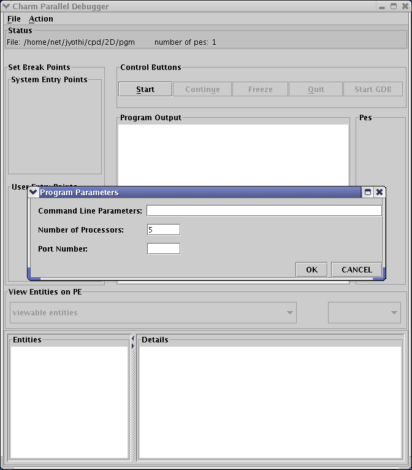
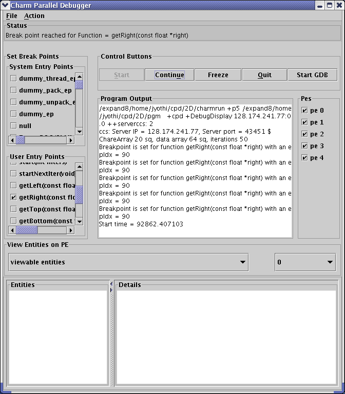
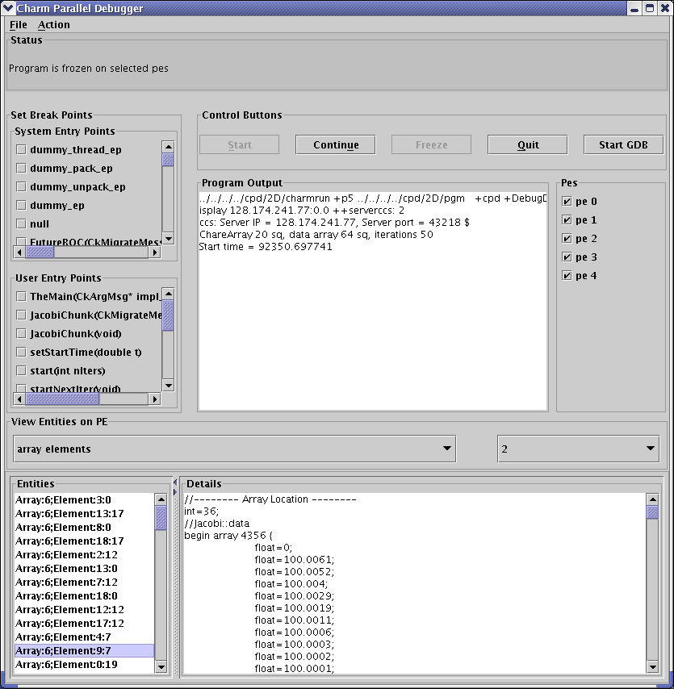
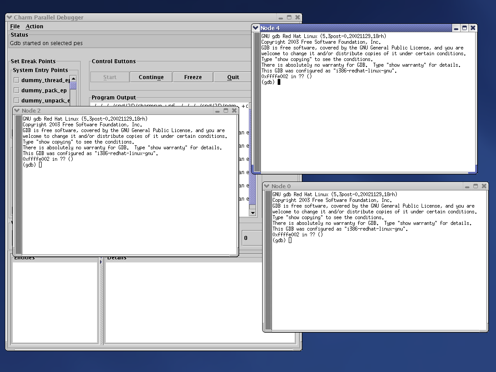
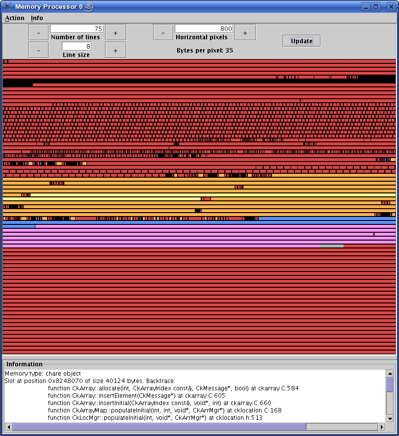
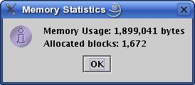
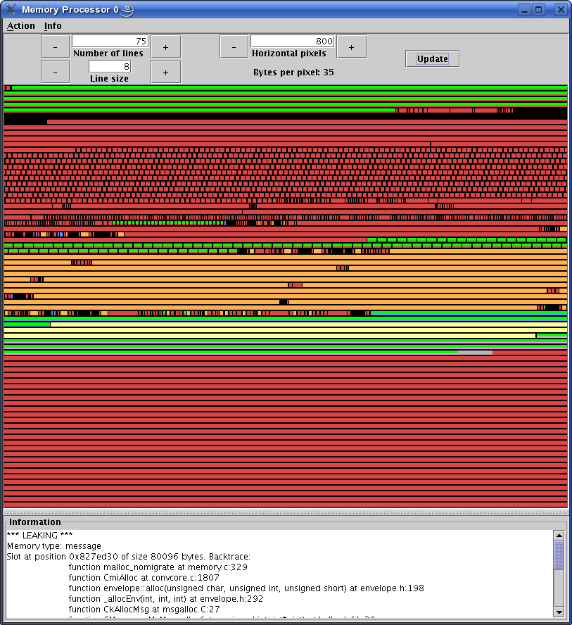
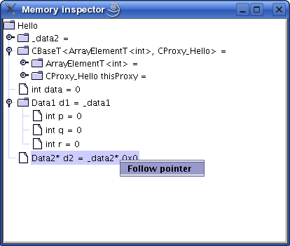

.. _charmdebug:

=======================
Charm++ Debugger Manual
=======================

.. contents::
   :depth: 3

Introduction
============

The primary goal of the Charm++ parallel debugger is to provide an integrated
debugging environment that allows the programmer to examine the
changing state of parallel programs during the course of their execution.

The Charm++ debugging system has a number of useful features for Charm++
programmers. The system includes a Java GUI client program which runs on
the programmer’s desktop, and a Charm++ parallel program which acts as a
server. The client and server need not be on the same machine, and
communicate over the network using a secure protocol described in
:ref:`converse_client_server`.

The system provides the following features:

-  Provides a means to easily access and view the major programmer-visible
   entities, including array elements and messages in queues,
   across the parallel machine during program execution. Objects and
   messages are extracted as raw data, and interpreted by the debugger.

-  Provides an interface to set and remove breakpoints on remote entry
   points, which capture the major programmer-visible control flows in a
   Charm++ program.

-  Provides the ability to freeze and unfreeze the execution of selected
   processors of the parallel program, which allows a consistent
   snapshot by preventing things from changing as they are examined.

-  Provides a way to attach a sequential debugger to a specific subset
   of processes of the parallel program during execution, which keeps a
   manageable number of sequential debugger windows open. Currently
   these windows are opened independently of the GUI interface, while in
   the future they will be transformed into an integrated view.

The debugging client provides these features via extensive support built
into the Charm++ runtime.

Building the Charm++ Debug Tool
===============================

To get the CharmDebug tool, check out the source code from the following
repository. This will create a directory named ccs_tools. Change to this
directory and build the project.

.. code-block:: bash

   > git clone https://charm.cs.illinois.edu/gerrit/ccs_tools
   > cd ccs_tools
   > ant

This will create the executable ``bin/charmdebug``.

You can also download the binaries from the Charm++ downloads website
and use it directly without building. (NOTE: Binaries may work properly
on some platforms, so building from the source code is recommended.)

Preparing the Charm++ Application for Debugging
===============================================

Build Charm++ using ``--enable-charmdebug`` option. For example:

.. code-block:: bash

   > ./build charm++ netlrts-darwin-x86_64 --enable-charmdebug

No instrumentation is required to use the Charm++ debugger. Being CCS
based, you can use it to set and step through entry point breakpoints
and examine Charm++ structures in any Charm++ application.

Nevertheless, for some features to be present, some additional options
may be required at either compile or link time:

-  In order to provide a symbolic representation of the machine code executed
   by the application, the ``-g`` option is needed at compile time. This
   setting is needed to provide function names as well as source file
   names and line numbers wherever useful. This is also important to fully
   utilize gdb (or any other serial debugger) on one or more processes.

-  Optimization options, by nature of transforming the source
   code, can produce a mismatch between the function displayed in the
   debugger (for example in a stack trace) and the functions present in
   the source code. To produce information coherent with source code,
   optimization is discouraged. Newer versions of some compilers support
   the ``-Og`` optimization level, which performs all optimizations that do
   not inhibit debugging.

-  The link time option ``-memory charmdebug`` is only needed if you want
   to use the Memory view (see :numref:`sec-memory`) or the
   Inspector framework (see :numref:`sec_inspector`) in CharmDebug.

Record Replay
-------------

The *Record Replay* feature is independent of the charmdebug
application. It is a mechanism used to detect bugs that happen rarely
depending on the order in which messages are processed. The
program in consideration is first executed in record mode which produces a
trace. When the program is run in replay mode it uses previously recorded
trace to ensure that messages are processed in the
same order as the recorded run. The idea is to make use of a
message sequence number to satisfy a theorem says that the serial numbers will
be the same if the messages are processed in the same order.
.. `\cite{rashmithesis}`

*Record Replay* tracing is automatically enabled for Charm++ programs
and requires nothing special to be done during compilation. (Linking with
the option ``-tracemode recordreplay`` used to be necessary). At run
time, the ``+record`` option is used, which records messages in order in
a file for each processor. The same execution order can be replayed
using the ``+replay`` runtime option, which can be used at the same time
as the other debugging tools in Charm++.

*Note!* If your Charm++ is built with ``CMK_OPTIMIZE`` on, all tracing
will be disabled. So, use an unoptimized Charm++ to do your debugging.

Running the Debugger
====================

CharmDebug command line parameters
----------------------------------

``-pes``
   Number of PEs

``+p``
   Number of PEs

``-host``
   hostname of CCS server for application

``-user``
   the username to use to connect to the hostname selected

``-port``
   portnumber of CCS server for application

``-sshtunnel``
   force the communication between client and server (in particular the
   one for CCS) to be tunnelled through ssh. This allow the bypass of
   firewalls.

``-display``
   X Display

Basic usage
-----------

To run an application locally via the debugger on 4 PEs with command
line options for your program (shown here as ``opt1 opt2``):

.. code-block:: bash

   > charmdebug pgm +p4 4 opt1 opt2

If the application should be run in a remote cluster behind a firewall,
the previous command line will become:

.. code-block:: bash

   > charmdebug -host cluster.inst.edu -user myname -sshtunnel pgm +p4 4 opt1 opt2

CharmDebug can also be executed without any parameters. The user can
then choose the application to launch and its command line parameters
from within the ``File`` menu as shown in Figure :numref:`menu`.

   Using the menu to set parameters for the Charm++ program

*Note: charmdebug command line launching only works on netlrts-\* and
verbs-\* builds of Charm++.*

To replay a previously recorded session:

.. code-block:: bash

   > charmdebug pgm +p4 opt1 opt2  +replay

Charm Debugging Related Options
-------------------------------

When using the Charm debugger to launch your application, it will
automatically set these to defaults appropriate for most situations.

``+cpd``
   Triggers application freeze at startup for debugger.

``++charmdebug``
   Triggers charmrun to provide some information about the executable,
   as well as provide an interface to gdb for querying.

``+debugger``
   Which debuggers to use.

``++debug``
   Run each node under gdb in an xterm window, prompting the user to
   begin execution.

``++debug-no-pause``
   Run each node under gdb in an xterm window immediately (i.e. without
   prompting the user to begin execution).

   *Note:* If you’re using the charm debugger it will probably be best
   to control the sequential (i.e. gdb) debuggers from within its GUI
   interface.

``++DebugDisplay``
   X Display for xterm

``++server-port``
   Port to listen for CCS requests

``++server``
   Enable client-server (CCS) mode

``+record``
   Use the recordreplay tracemode to record the exact event/message
   sequence for later use.

``+replay``
   Force the use of recorded log of events/messages to exactly reproduce
   a previous run.

   The preceding pair of commands ``+record +replay`` are used to
   produce the “instant replay” feature. This feature is valuable for
   catching errors which only occur sporadically. Such bugs which arise
   from the nondeterminacy of parallel execution can be fiendishly
   difficult to replicate in a debugging environment. Typical usage is
   to keep running the application with +record until the bug occurs.
   Then run the application under the debugger with the +replay option.

CharmDebug limitations
----------------------

Clusters
~~~~~~~~

CharmDebug is currently limited to applications started directly by the
debugger due to implementation peculiarities. It will be extended to
support connection to remote running applications in the near future.

Due to the current implementation, the debugging tool is limited to
netlrts-\* and verbs-\* versions. Other builds of Charm++ might have
unexpected behavior. In the near future this will be extended at least
to the mpi-\* versions.

.. _record-replay-1:

Record Replay
~~~~~~~~~~~~~

The *Record Replay* feature does not work well with spontaneous
events. Load balancing is the most common form of spontaneous event in
that it occurs periodically with no other causal event.

   Parallel debugger when a break point is reached

As per Rashmi’s thesis:

   "There are some unique issues for replay in the
   context of Charm because it provides high-level support for dynamic load
   balancing, quiescence detection and information sharing. Many of the
   load balancing strategies in Charm have a spontaneous component. The
   strategy periodically checks the sizes of the queues on the local
   processor. A replay load balancing strategy implements the known load
   redistribution. The behavior of the old balancing strategy is therefore
   not replayed only its effect is. Since minimal tracing is used by the
   replay mechanism the amount of perturbation due to tracing is reduced.
   The replay mechanism is proposed as a debugging support to replay
   asynchronous message arrival orders."

Moreover, if your application crashes without a clean shutdown, the log
may be lost with the application.

.. _sec:using:

Using the Debugger
------------------

Once the debugger’s GUI loads, the programmer triggers the program
execution by clicking the *Start* button. When starting by command line,
the application is automatically started. The program begins by
displaying the user and system entry points as a list of check boxes,
pausing at the onset. The user could choose to set breakpoints by
clicking on the corresponding entry points and kick off execution by
clicking the *Continue* Button. Figure :numref:`snapshot3` shows a
snapshot of the debugger when a breakpoint is reached. The program
freezes when a breakpoint is reached.

Clicking the *Freeze* button during the execution of the program freezes
execution, while *Continue* button resumes execution. The *Quit* button can
be used to abort execution at any point of time. Entities (for instance,
array elements) and their contents on any processor can be viewed at any
point in time during execution as illustrated in Figure
:numref:`arrayelement`.

   Freezing program execution and viewing the contents of an array
   element using the Parallel Debugger

Specific individual processes of the Charm++ program can be attached to
instances of *gdb* as shown in Figure :numref:`gdb`. The programmer
chooses which PEs to connect *gdb* processes to via the checkboxes on
the right side. *Note!* While the program is suspended in gdb for step
debugging, high-level CharmDebug features such as object inspection will not
work.

   Parallel debugger showing instances of *gdb* open for the selected
   processor elements

Charm++ objects can be examined via the *View Entities on PE : Display*
selector. It allows the user to choose from *Charm Objects, Array
Elements, Messages in Queue, Readonly Variables, Readonly Messages,
Entry Points, Chare Types, Message Types and Mainchares*. The right
sideselector sets the PE upon which the request for display will be
made. The user may then click on the *Entity* to see the details.

.. _sec-memory:

Memory View
~~~~~~~~~~~

The menu option Action \ :math:`\rightarrow` Memory allows the user to
display the entire memory layout of a specific processor. An example is
shown in Figure :numref:`fig:memory`. This layout is colored and the
colors have the following meaning:

   Main memory view

red
   memory allocated by the Charm++ Runtime System;

blue
   memory allocated directly by the user in its code;

pink
   memory used by messages;

orange
   memory allocated to a chare element;

black
   memory not allocated;

gray
   a big jump in memory addresses due to the memory pooling system, it
   represent a large portion of virtual space not used between two
   different zones of used virtual space address;

yellow
   the currently selected memory slot;

Currently it is not possible to change this color association. The
bottom part of the view shows the stack trace at the moment when the
highlighted (yellow) memory slot was allocated. By left clicking on a
particular slot, this slot is fixed in highlight mode. This allows a
more accurate inspection of its stack trace when this is large and does
not fit the window.

Info \ :math:`\rightarrow`\ Show Statistics will display a small
information box like the one in Figure :numref:`fig:memory-stat`.

   Information box display memory statistics

A useful tool of this view is the memory leak search. This is located in
the menu Action \ :math:`\rightarrow` Search Leaks. The processor under
inspection runs a reachability test on every memory slot allocated to
find if there is a pointer to it. If there is none, the slot is
partially colored in green, to indicate its status of leak. The user can
the inspect further these slots. Figure :numref:`fig:memory-leak` shows
some leaks being detected.

   Memory view after running the Search Leaks tool

If the memory window is kept open while the application is unfrozen and
makes progress, the loaded image will become obsolete. To cope with
this, the “Update” button will refresh the view to the current
allocation status. All the leaks that had been already found as such,
will still be partially colored in green, while the newly allocated
slots will not, even if leaking. To update the leak status, re-run the
Search Leaks tool.

Finally, when a specific slot is highlighted, the menu
Action \ :math:`\rightarrow` Inspect opens a new window displaying the
content of the memory in that slot, as interpreted by the debugger (see
next subsection for more details on this).

.. _sec_inspector:

Inspector framework
~~~~~~~~~~~~~~~~~~~

Without any code rewriting of the application, CharmDebug is capable of
loading a raw area of memory and parsing it with a given type name. The
result (as shown in Figure :numref:`fig:inspect`, is a browsable tree.
The initial type of a memory area is given by its virtual table pointer
(Charm++ objects are virtual and therefore loadable). In the case of
memory slots not containing classes with virtual methods, no display
will be possible.

   Raw memory parsed and displayed as a tree

When the view is open and is displaying a type, by right clicking on a
leaf containing a pointer to another memory location, a popup menu will
allow the user to ask for its dereference (shown in
Figure :numref:`fig:inspect`). In this case, CharmDebug will load this
raw data as well and parse it with the given type name of the pointer.
This dereference will be inlined and the leaf will become an internal
node of the browse tree.

Debugger Implementation Details
===============================

The following classes in the PUP framework were used in implementing
debugging support in charm.

-  ``class PUP::er`` - This class is the abstract superclass of all the
   other classes in the framework. The ``pup`` method of a particular
   class takes a reference to a ``PUP::er`` as parameter. This class has
   methods for dealing with all the basic C++ data types. All these
   methods are expressed in terms of a generic pure virtual method.
   Subclasses only need to provide the generic method.

-  ``class PUP::toText`` - This is a subclass of the ``PUP::toTextUtil``
   class which is a subclass of the ``PUP::er`` class. It copies the
   data of an object to a C string, including the terminating NULL.

-  ``class PUP::sizerText`` - This is a subclass of the
   ``PUP::toTextUtil`` class which is a subclass of the ``PUP::er``
   class. It returns the number of characters including the terminating
   NULL and is used by the ``PUP::toText`` object to allocate space for
   building the C string.

The code below shows a simple class declaration that includes a ``pup``
method.

::

     class foo {
      private:
       bool isBar;
       int x;
       char y;
       unsigned long z;
       float q[3];
      public:
       void pup(PUP::er &p) {
         p(isBar);
         p(x);p(y);p(z);
         p(q,3);
       }
     };

Converse Client-Server Interface
--------------------------------

The Converse Client-Server (CCS) module enables Converse
.. `\cite{InterOpIPPS96}`
programs to act as parallel servers,
responding to requests from non-Converse programs. The CCS module is
split into two parts -- client and server. The server side is used by
Converse programs while the client side is used by arbitrary non-Converse
programs. A CCS client accesses a running Converse program by talking to
a ``server-host`` which receives the CCS requests and relays them to the
appropriate processor. The ``server-host`` is ``charmrun``
.. `\cite{charmman}`
for netlrts- versions and is the first
processor for all other versions.

In the case of the netlrts- version of Charm++, a Converse program is
started as a server by running the Charm++ program using the additional
runtime option ``++server``. This opens the CCS server on any TCP port
number. The TCP port number can be specified using the command-line
option ``server-port``. A CCS client connects to a CCS server, asks a
server PE to execute a pre-registered handler and receives the response
data. The function ``CcsConnect`` takes a pointer to a ``CcsServer`` as
an argument and connects to the given CCS server. The functions
``CcsNumNodes``, ``CcsNumPes``, and ``CcsNodeSize`` implemented as part of
the client interface in Charm++ return information about the parallel
machine. The function ``CcsSendRequest`` takes a handler ID and the
destination processor number as arguments and asks the server to execute
the requested handler on the specified processor. ``CcsRecvResponse``
receives a response to the previous request in-place. A timeout is also
specified which gives the number of seconds to wait until the function
returns 0, otherwise the number of bytes received is returned.

Once a request arrives on a CCS server socket, the CCS server runtime
looks up the appropriate registered handler and calls it. If no handler
is found the runtime prints a diagnostic and ignores the message. If the
CCS module is disabled in the core, all CCS routines become macros
returning 0. The function ``CcsRegisterHandler`` is used to register
handlers in the CCS server. A handler ID string and a function pointer
are passed as parameters. A table of strings corresponding to
appropriate function pointers is created. Various built-in functions are
provided which can be called from within a CCS handler. The debugger
behaves as a CCS client invoking appropriate handlers which make use of
some of these functions. Some of the built-in functions are as follows.

-  ``CcsSendReply`` - This function sends the data provided as an
   argument back to the client as a reply. This function can only be
   called from a CCS handler invoked remotely.

-  ``CcsDelayReply`` - This call is made to allow a CCS reply to be
   delayed until after the handler has completed.

The CCS runtime system provides several built-in CCS handlers, which are
available to any Converse program. All Charm++ programs are essentially
Converse programs. ``ccs_getinfo`` takes an empty message and responds
with information about the parallel job. Similarly the handler
``ccs_killport`` allows a client to be notified when a parallel run
exits.
