====================================================
Charm++ Finite Element Method (FEM) Framework Manual
====================================================

.. contents::
   :depth: 3

Introduction
============

The Finite Element Method (FEM) approach is used in many engineering
applications with irregular domains, from elastic deformation problems
to crack propagation to fluid flow. Charm++ is a free message-passing
parallel runtime system for machines from clusters of workstations to
tightly-coupled SMPs. The Charm++ FEM framework allows you to write a
parallel FEM program, in C or Fortran 90, that closely resembles a
serial version but includes a few framework calls.

Using the FEM framework also allows you to take advantage of all the
features of Charm++, including run-time load balancing, performance
monitoring and visualization, and checkpoint/restart, with no additional
effort. The FEM framework also combines naturally with other Charm++
frameworks built on TCHARM.

The FEM framework has been undergoing a wave of recent improvements. A
choice to rename the new version ParFUM has been adopted. ParFUM is short
for Parallel Framework for Unstructured Meshes. Section
:numref:`sec:ParFUM` describes some of the new features included in
ParFUM that were not present in FEM.

Philosophy
----------

The Charm++ FEM framework is designed to be flexible, in that it
provided a few very general operations, such as loading and partitioning
a “mesh.” In describing these operations, we draw on examples from
structural analysis, but in fact the same calls can be used for other
applications, including fluid dynamics or partial differential equations
solvers, or even general-purpose graph manipulation.

For example, the FEM framework does not specify the number of spatial
dimensions. Node locations are treated as just another kind of node
data, with no restrictions on the number of data items. This allows the
FEM framework to work with problems having any number of spatial
dimensions.

.. _sec:terminology:

Terminology
-----------

A FEM program manipulates elements and nodes. An **element** is a
portion of the problem domain, also known as a cell, and is typically
some simple shape like a triangle, square, or hexagon in 2D; or
tetrahedron or rectangular solid in 3D. A **node** is a point in the
domain, and is often the vertex of several elements. Together, the
elements and nodes form a **mesh**, which is the central data structure
in the FEM framework.

An element knows which nodes surround it via the element’s
**connectivity table**, which lists the nodes adjacent to each element.

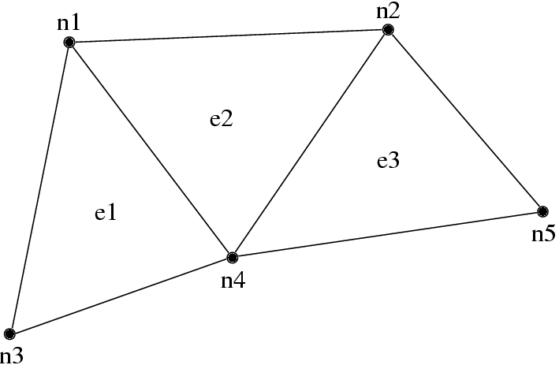

   3-element, 5 node mesh.

.. table:: Connectivity table for mesh in figure :numref:`fig:simplemesh`.

   ======= ==== ==== ====
   Element Adjacent Nodes
   ======= ==============
   e1      n1   n3   n4
   e2      n1   n2   n4
   e3      n2   n4   n5
   ======= ==== ==== ====

A typical FEM program performs some element-by-element calculations
which update adjacent node values; then some node-by-node calculations.
For example, a material dynamics program has the structure:

.. code-block:: none

        time loop
             element loop-- Element deformation applies forces to
             surrounding nodes
             node loop-- Forces and boundary conditions change node
             positions
        end time loop

We can parallelize such FEM programs by partitioning the serial mesh
elements into several smaller meshes, or **chunks**. There is normally
at least one chunk per processor; and often even more. During
partitioning, we give nodes and elements new, **local** numbers within
that chunk. In the figure below, we have partitioned the mesh above into
two chunks, A and B.

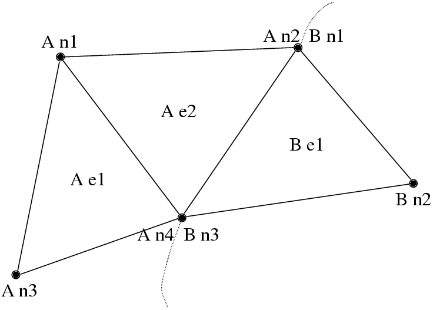

   Partitioned mesh.

.. table:: Connectivity table for chunk A in figure :numref:`fig:partitionedmesh`.

   ======= ==== ==== ====
   Element Adjacent Nodes
   ======= ==============
   e1      n1   n3   n4
   e2      n1   n2   n4
   ======= ==== ==== ====

.. table:: Connectivity table for chunk B in figure :numref:`fig:partitionedmesh`.

   ======= ==== ==== ====
   Element Adjacent Nodes
   ======= ==============
   e1      n1   n2   n3
   ======= ==== ==== ====

Note that chunk A’s node n2 and B’s node n1 were actually the same node
in the original mesh- partitioning split this single node into two
shared copies (one on each chunk). However, since adding forces is
associative, we can handle shared nodes by computing the forces normally
(ignoring the existence of the other chunk), then adding both chunks’
net force for the shared node together. This “node update” will give us
the same resulting force on each shared node as we would get without
partitioning, thus the same positions, thus the same final result.

For example, under hydrostatic pressure, each chunk might compute a
local net force vector for its nodes as shown in
Figure :numref:`fig:forcedecomp` (a). After adding forces across
chunks, we have the consistent global forces shown in
Figure :numref:`fig:forcedecomp` (b).

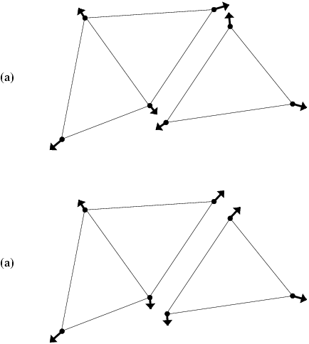

   A force calculation decomposed across chunks: (a) before update (b)
   after updating forces across nodes.

Hence, each chunk’s time loop has the structure:

::

        chunk time loop
             element loop-- Element deformation applies forces to
             surrounding nodes
             <update forces on shared nodes>
             node loop-- Forces and boundary conditions change node
             positions
        end time loop

This is exactly the form of the time loop for a Charm++ FEM framework
program. The framework will accept a serial mesh, partition it,
distribute the chunks to each processor, then you run your time loop to
perform analysis and communication.

Structure of a Classic FEM Framework Program
--------------------------------------------

A classic FEM framework program consists of two subroutines: init() and
driver(). init() is called by the FEM framework only on the first
processor - this routine typically does specialized I/O, startup and
shutdown tasks. driver() is called for every chunk on every processor,
and does the main work of the program. In the language of the TCHARM
manual, init() runs in the serial context, and driver() runs in the
parallel context.

::

        subroutine init
             read the serial mesh and configuration data
        end subroutine
   /* after init, the FEM framework partitions the mesh */
        subroutine driver
             get local mesh chunk
             time loop
                  FEM computations
                  communicate boundary conditions
                  more FEM computations
             end time loop
        end subroutine

In this mode, the FEM framework sets up a default writing mesh during
init(), partitions the mesh after init(), and sets up the partitioned
mesh as the default reading mesh during driver().

Structure of an AMPI FEM Framework Program
------------------------------------------

In addition to the classic init/driver structure above, you can write an
FEM framework program using the MPI style. This is a more general, more
flexible method of running the program, but it is more complicated than
the classic mode. All FEM framework calls are available in either mode.

::

      main program
         MPI_Init
         FEM_Init(MPI_COMM_WORLD)
         if (I am master processor)
            read mesh
         partition mesh
         time loop
             FEM computations
             communicate boundary conditions
             more FEM computations
         end time loop
      end main program

In this mode, the FEM framework does not set a default reading or
writing mesh, and does no partitioning; so you must use the FEM_Mesh
routines to create and partition your mesh. See the AMPI manual for
details on how to declare the main routine.

The driver() portion of a classic FEM program strongly resembles an MPI
mode main routine—in fact, a classic FEM program can even make MPI calls
from its driver() routine, because the FEM framework is implemented
directly on top of MPI.

There is even a special shell script for collecting up the FEM framework
source code to build a non-Charm, MPI-only version of the FEM framework.
To build FEM in this manner, you first build Charm++ normally, then run
a script to collect up the neccessary source files (the FEM framework, a
small number of Charm configuration and utility files, and the METIS
library), and finally build the library using the usual MPI compiler
commands:

.. code-block:: bash

    > cd charm/
    > ./src/libs/ck-libs/fem/make_fem_alone.sh
    > cd fem_alone/
    > mpicc -I. -DFEM_ALONE=1 -c *.c *.C
    > ar cr libfem_alone.a *.o

You will then have to build your application with the MPI compilers, and
manually point to this “fem_alone” directory to find include files and
the new FEM library. A typical compiler invocation would be:

.. code-block:: bash

    > mpif90 -I$HOME/charm/fem_alone -L$HOME/charm/fem_alone foo.f90 -lfem_alone -o foo

This “standalone”, non-Charm++ method of building the FEM framework
prevents the use of load balancing or the other features of Charm++, so
we do not recommend it for normal use.

Compilation and Execution
-------------------------

A FEM framework program is a Charm++ program, so you must begin by
downloading the latest source version of Charm++ from
``http://charm.cs.uiuc.edu/``. Build the source with
``./build FEM version`` or ``cd`` into the build directory,
``version/tmp``, and type ``make FEM``. To compile a FEM program, pass
the ``-language fem`` (for C) or ``-language femf`` (for Fortran) option
to ``charmc``. You can also build using the “fem_alone” mode described
at the end of the section above.

In a charm installation, see charm/version/pgms/charm++/fem/ for several
example and test programs.

At runtime, a Charm++/FEM framework program accepts the following
options, in addition to all the usual Charm++ options described in the
Charm++ “Installation and Usage Manual”.

-  ``+vp`` :math:`v`

   Create :math:`v` mesh chunks, or “virtual processors”. By default,
   the number of mesh chunks is equal to the number of physical
   processors (set with ``+p`` :math:`p`).

-  ``-write``

   Skip driver(). After running init() normally, the framework
   partitions the mesh, writes the mesh partitions to files, and exits.
   As usual, the ``+vp`` :math:`v` option controls the number of mesh
   partitions.

   This option is only used in the classic mode—MPI-style programs are
   not affected.

-  ``-read``

   Skip init(). The framework reads the partitioned input mesh from
   files and calls driver(). Together with ``-write``, this option
   allows you to separate out the mesh preparation and partitioning
   phase from the actual parallel solution run.

   This can be useful, for example, if init() requires more memory to
   hold the unpartitioned mesh than is available on one processor of the
   parallel machine. To avoid this limitation, you can run the program
   with ``-write`` on a machine with a lot of memory to prepare the
   input files, then copy the files and run with ``-read`` on a machine
   with a lot of processors.

   ``-read`` can also be useful during debugging or performance tuning,
   by skipping the (potentially slow) mesh preparation phase. This
   option is only used in the classic mode—MPI-style programs are not
   affected.

-  ``+tcharm_trace fem``

   Give a diagnostic printout on every call into the FEM framework. This
   can be useful for locating a sudden crash, or understanding how the
   program and framework interact. Because printing the diagnostics can
   slow a program down, use this option with care.

FEM Framework API Reference
===========================

Some of the routines in the FEM framework have different requirements or
meanings depending on where they are called from. When a routine is
described as being “called from driver”, this means it is called in the
parallel context—from driver() itself, any subroutine called by
driver(), or from whatever routine is run by the FEM-attached TCHARM
threads. When a routine is described as being “called from init”, this
means it is called in the serial context—from init() itself, from any
subroutine called from init(), from a routine called by FEM_Update_mesh,
or from whatever TCHARM code executes before the FEM_Attach.

Utility
-------

::

  int FEM_Num_partitions();

.. code-block:: fortran

  INTEGER FUNCTION :: FEM_Num_partitions()

Return the number of mesh chunks in the current computation. Can only be
called from the driver routine.

::

  int FEM_My_partition();

.. code-block:: fortran

  INTEGER FUNCTION :: FEM_My_partition()

Return the number of the current chunk, from 0 to num_partitions-1. Can
only be called from the driver routine.

::

  double FEM_Timer();

.. code-block:: fortran

  DOUBLE PRECISION FUNCTION :: FEM_Timer()

Return the current wall clock time, in seconds. Resolution is
machine-dependent, but is at worst 10ms.

::

  void FEM_Print_partition();

.. code-block:: fortran

  SUBROUTINE FEM_Print_partition()

Print a debugging representation of the current chunk’s mesh. Prints the
entire connectivity array, and data associated with each local node and
element.

::

  void FEM_Print(const char *str);

.. code-block:: fortran

  SUBROUTINE FEM_Print(str)

Print the given string, with "[<chunk number>]" printed before the
text.

This routine is no longer required: you can now use the usual printf,
PRINT, or WRITE statements.

.. _sec:entities:

Mesh Nodes and Elements
=======================

These routines describe and retrieve the finite element mesh for this
computation. A **mesh**, from the framework’s perspective, is a list of
elements, nodes, and other data that describes the computational domain.
The FEM framework provides extensive support for creating, manipulating,
and partitioning meshes.

A **serial mesh** consists of a single large piece. It’s usually easiest
to read and write serial meshes to existing, non-parallel file formats,
and it can be easier to manipulate serial meshes. By contrast, a
**parallel mesh** consists of several pieces, called **chunks** or
partitions. Different processors can work on different pieces of a
parallel mesh, so most of the computation is done using parallel meshes.
A simple program might create or read in a single serial mesh in init,
get a local chunk of the partitioned [1]_ mesh in driver, and work on
that chunk for the rest of the program. A more complex program might set
an initial mesh in init; then get, work on, reassemble and repartition
the mesh several times in driver via FEM_Update_mesh.

Mesh Entity Types
-----------------

A mesh consists of **entities**, such as nodes and elements. Entities
always have a **local number**, which is just the entities’ current
index in its array. Entites may also have a **global number**, which is
the entity’s index in the unpartitioned serial mesh. Entities have data
values called **attributes**. For example, the location of each node
might be called the “location” attribute of the “node” entity type.
Attributes are always stored in regular arrays indexed by the entity’s
local number. This table lists the different attributes that can be read
or written for each type of entity.

A **shared entity** is a boundary entity that two or more chunks can
both update—currently, only nodes can be shared. Shared nodes are mixed
in with regular nodes, and the framework currently provides no way to
identify which nodes are shared.

A **ghost entity** is a boundary entity that is asymmetrically
shared—one side provides values for the ghost from one of its real
entities, and the other sides accept read-only copies of these values.
Ghosts are described in more detail in Section :numref:`sec:ghost`, and
can be accessed by adding the constant FEM_GHOST to the corresponding
real entity’s type.

The different kinds of entities are described in the following sections.

=============================== =========================================
Real Entity                     Ghost Entity
=============================== =========================================
FEM_NODE                        FEM_GHOST+FEM_NODE
FEM_ELEM+\ :math:`elType`       FEM_GHOST+FEM_ELEM+\ :math:`elType`
FEM_SPARSE+\ :math:`sparseType` FEM_GHOST+FEM_SPARSE+\ :math:`sparseType`
=============================== =========================================

Nodes
~~~~~

FEM_NODE is the entity code for nodes, the simplest kind of entity. A
node is a single point in the domain, and elements are defined by their
nodes. Nodes can have the following attributes:

-  FEM_DATA+\ :math:`tag` Uninterpreted user data, which might include
   material properties, boundary conditions, flags, etc. User data can
   have any data type and width. :math:`tag` can be any number from 0 to
   one billion—it allows you to register several data fields with a
   single entity.

-  FEM_GLOBALNO Global node numbers. Always a 1-wide index type.

-  FEM_SYMMETRIES Symmetries that apply to this node. Always a 1-wide
   FEM_BYTE.

-  FEM_NODE_PRIMARY Marker indicating that this chunk is responsible for
   this node. Every node is primary in exactly one chunk. This attribute
   is always a 1-wide FEM_BYTE containing 0 or 1.

Elements
~~~~~~~~

FEM_ELEM+\ :math:`elType` is the entity code for one kind of element.
:math:`elType` is a small, user-defined value that uniquely identifies
this element type. Like nodes, elements can have the attributes
FEM_DATA+\ :math:`tag`, FEM_GLOBALNO, or FEM_SYMMETRIES; but every
element type must have this attribute:

-  FEM_CONN Lists the numbers of the nodes around this element. See the
   description in the ghost section for special ghost connectivity.
   Always an index type-FEM_INDEX_0 for C-style 0-based node indexing,
   or FEM_INDEX_1 for Fortran-style 1-based node indexing.

Sparse Elements
~~~~~~~~~~~~~~~

FEM_SPARSE+\ :math:`sparseType` is the entity code for one kind of
sparse element. Again, :math:`sparseType` is a small, user-defined
unique value. The only difference between ordinary elements and sparse
elements regards partitioning. Ignoring ghosts, ordinary elements are
never duplicated—each element is sent to its own chunk. Sparse elements
may be duplicated, and are always dependent on some other entity for
their partitioning. Sparse elements have all the attributes of ordinary
elements: FEM_DATA+\ :math:`tag`, FEM_GLOBALNO, FEM_SYMMETRIES, and
FEM_CONN, as well as the special attribute FEM_SPARSE_ELEM.

Without the FEM_SPARSE_ELEM attribute, a sparse element will be copied
to every chunk that contains all the sparse element’s nodes. This is
useful for things like node-associated boundary conditions, where the
sparse element connectivity might list the nodes with boundary
conditions, and the sparse element data might list the boundary
condition values.

The FEM_SPARSE_ELEM attribute lists the ordinary element each sparse
element should be partitioned with. This attribute consists of pairs
(:math:`elType`,\ :math:`elNum`), indicating that this sparse element
should be sent to wherever the :math:`elNum`\ ’th
FEM_ELEM+\ :math:`elType` is partitioned.

-  FEM_SPARSE_ELEM Lists the element we should be partitioned with. The
   width of this attribute is always 2, and the data type must be an
   index type-FEM_INDEX_0 or FEM_INDEX_1.

Mesh Entity Manipulation
------------------------

::

  int FEM_Mesh_default_read(void);

.. code-block:: fortran

  INTEGER function :: FEM_Mesh_default_read()

Return the default reading mesh. This routine is valid:

-  From driver(), to return the partitioned mesh.

-  During your FEM_Update_mesh routine, to return the assembled mesh.

-  Anytime after a call to FEM_Mesh_set_default_read.

::

  int FEM_Mesh_default_write(void);

.. code-block:: fortran

  INTEGER function :: FEM_Mesh_default_write()

Return the default writing mesh. This routine is valid:

-  From init(), to change the new serial mesh.

-  From driver(), to change the new partitioned mesh.

-  During your FEM_Update_mesh routine, to change the new serial mesh.

-  Anytime after a call to FEM_Mesh_set_default_write.

::

  int FEM_Mesh_get_length(int mesh,int entity);

.. code-block:: fortran

  INTEGER function :: FEM_Mesh_get_length(mesh,entity)

Return the number of entitys that exist in this mesh.

This call can be used with any entity. For example, to get the number of
nodes,

::

         nNodes=FEM_Mesh_get_length(mesh,FEM_NODE)

To get the number of ghost nodes,

::

         nGhostNodes=FEM_Mesh_get_length(mesh,FEM_GHOST+FEM_NODE)

To get the number of real elements of type 2,

::

     	nElem=FEM_Mesh_get_length(mesh,FEM_ELEM+2)

::

  void FEM_Mesh_data(int mesh,int entity,int attr, void *data, int
  first, int length, int datatype,int width);

.. code-block:: fortran

  SUBROUTINE FEM_Mesh_data(mesh,entity,attr,data,first,length,datatype,width)
  INTEGER, INTENT(IN) :: mesh,entity,attr,first,length,datatype,width
  datatype, intent(inout) :: data(width,length)

This is the one routine for getting or setting entity’s attributes on
the mesh.

-  mesh A FEM mesh object. Depending on whether this is a reading or
   writing mesh, this routine reads from or writes to the data array you
   pass in.

-  entity A FEM entity code, for example FEM_NODE or
   FEM_GHOST+FEM_ELEM+1.

-  attr A FEM attribute code, for example FEM_DATA+\ :math:`tag` or
   FEM_CONN.

-  data The user data to get or set. Each row of this array consists of
   width values, and contains the data values of the attribute for the
   corresponding entity. This data must be formatted as one of:

   ::

            datatype :: data(width,length)
            datatype :: data(width*length)

-  first The first entity to affect. In C, this is normally 0; in
   Fortran, this is normally 1.

-  length The number of entities to affect. The entities affected are
   thus those numbered from first to first+length-1. For now, length
   must be either 1, to touch a single entity; or else the total number
   of entities-that is, FEM_Mesh_get_length(mesh,entity).

-  datatype The data type stored in this attribute. This is one of the
   standard FEM data types FEM_BYTE, FEM_INT, FEM_FLOAT, or FEM_DOUBLE;
   or else the C-style 0-based index type FEM_INDEX_0 or the
   Fortran-style 1-based index type FEM_INDEX_1. Alternatively, the
   equivalent types IDXL_BYTE, IDXL_INT, IDXL_FLOAT, IDXL_DOUBLE,
   IDXL_INDEX_0, or IDXL_INDEX_1 may be used.

-  width The number of data items per entity.

For example, to set the element connectivity, which is stored as 3
integer node indices in nodes, you would:

::

  /* C version */
  int *nodes=new int[3*nElems];
  ... fill out nodes ...
  FEM_Mesh_data(mesh,FEM_ELEM+1,FEM_CONN, nodes, 0,nElems, FEM_INDEX_0, 3);
  ... continue to use or delete nodes ...

.. code-block:: fortran

  ! F90 version
  ALLOCATE(nodes(3,nElems))
  ... fill out nodes ...
  CALL FEM_Mesh_data(mesh,FEM_ELEM+1,FEM_CONN, nodes, 1,nElems, FEM_INDEX_1, 3)
  ... continue to use or delete nodes ...

To add a new node property with 2 double-precision numbers from an array
mat (containing, for example, material properties), you would first pick
an unused user data "tag", for example 13, and:

::

  /* C version */
  double *mat=new double[2*nNodes];
  ...
  FEM_Mesh_data(mesh,FEM_NODE, FEM_DATA+13, mat, 0,nNodes, FEM_DOUBLE, 2);

.. code-block:: fortran

  ! F90 version
  ALLOCATE(mat(2,nNodes))
  CALL FEM_Mesh_data(mesh,FEM_NODE,FEM_DATA+13, mat, 1,nNodes, FEM_DOUBLE, 2)

Entity Inquiry
--------------

::

  int FEM_Mesh_get_width(int mesh,int entity,int attr);

.. code-block:: fortran

  INTEGER function :: FEM_Mesh_get_width(mesh,entity,attr)
  INTEGER, INTENT(IN) :: mesh,entity,attr

Return the width of the attribute attr of entity of mesh. This is the
value previously passed as “width” to FEM_Mesh_data.

::

  int FEM_Mesh_get_datatype(int mesh,int entity,int attr);

.. code-block:: fortran

  INTEGER function :: FEM_Mesh_get_datatype(mesh,entity,attr)
  INTEGER, INTENT(IN) :: mesh,entity,attr

Return the FEM data type of the attribute attr of entity of mesh. This
is the value previously passed as “datatype” to FEM_Mesh_data.

::

  int FEM_Mesh_get_entities(int mesh,int *entities);

.. code-block:: fortran

  INTEGER function :: FEM_Mesh_get_entities(mesh,entities)
  INTEGER, INTENT(IN) :: mesh
  INTEGER, INTENT(OUT) :: entities(:)

Extract an array of the different entities present in this mesh.
Returns the number of entity types present. The entities array must be
big enough to hold all the different entities in the mesh.

For example, a simple mesh might have two entity types: FEM_NODE and
FEM_ELEM+1.

::

  int FEM_Mesh_get_attributes(int mesh,int entity,int *attributes);

.. code-block:: fortran

  INTEGER function :: FEM_Mesh_get_attributes(mesh,entity,attributes)
  INTEGER, INTENT(IN) :: mesh, entity
  INTEGER, INTENT(OUT) :: attributes(:)

Extract an array of the different attributes of this entity. Returns
the number of attribute types present. The attributes array must be
big enough to hold all the attributes.

For example, a simple element might have three attributes: FEM_CONN for
node connectivity, FEM_GLOBALNO for global element numbers, and
FEM_DATA+7 for a material type.

::

  const char *FEM_Get_entity_name(int entity,char *storage);
  const char *FEM_Get_attr_name(int attr,char *storage);
  const char *FEM_Get_datatype_name(int datatype,char *storage);

Return a human-readable name for this FEM entity, attribute, or
datatype. The storage array must point to a buffer of at least 100
characters; this array might be used as temporary space to store the
returned string.

These routines are only available in C.

Advanced Entity Manipulation
----------------------------
::

  void FEM_Mesh_data_offset(int mesh,int entity,int attr, void *data,
  int first, int length, int datatype,int width, int offsetBytes,int
  distanceBytes,int skewBytes);

.. code-block:: fortran

  SUBROUTINE FEM_Mesh_data_offset(mesh,entity,attr,data,first,length,datatype,width,
  offsetBytes,distanceBytes,skewBytes)
  INTEGER, INTENT(IN) :: mesh,entity,attr,first,length,datatype,width
  INTEGER, INTENT(IN) :: offsetBytes,distanceBytes,skewBytes
  datatype, intent(inout) :: data(width,length)

This routine is a more complicated version of FEM_Mesh_data. It allows
you to get or set a mesh field directly from a user-defined structure.
See the documentation of IDXL_Layout_offset in
Section :numref:`sec:IDXLLayoutoffset` for details on how to set
offsetBytes, distanceBytes, and skewBytes.

::

  void FEM_Mesh_data_layout(int mesh,int entity,int attr, void *data,
  int firstItem, int length, IDXL_Layout_t layout);

.. code-block:: fortran

  SUBROUTINE FEM_Mesh_data_layout(mesh,entity,attr,data,first,length,layout)
  INTEGER, INTENT(IN) :: mesh,entity,attr,first,length,layout
  INTEGER, INTENT(IN) :: layout

This routine is a more complicated version of FEM_Mesh_data. Like
FEM_Mesh_data_offset, it allows you to get or set a mesh field
directly from a user-defined structure; but this routine expects the
structure to be described by an IDXL_Layout object.

.. _sec:mesh:

Meshes
======

A "mesh" is a collection of nodes and elements knit together in memory,
as described in Section :numref:`sec:terminology`. Meshes are always
referred to by an integer that serves as a handle to the local mesh.

This section describes routines to manipulate entire meshes at once:
this includes calls to create and delete meshes, read and write meshes,
partition and reassemble meshes, and send meshes between processors.

Only a few of the mesh routines are collective; most of them only
describe local data and hence operate independently on each chunk.

Mesh Routines
-------------

::

  int FEM_Mesh_allocate(void);

.. code-block:: fortran

  INTEGER FUNCTION :: FEM_Mesh_allocate()

Create a new local mesh object. The mesh is initially empty, but it is a
setting mesh, so call FEM_Mesh_data to fill the mesh with data.

::

  int FEM_Mesh_deallocate(int mesh);

.. code-block:: fortran

  SUBROUTINE FEM_Mesh_deallocate(mesh)
  INTEGER, INTENT(IN) :: mesh

Destroy this local mesh object, and its associated data.

::

  int FEM_Mesh_copy(int mesh);

.. code-block:: fortran

  INTEGER FUNCTION FEM_Mesh_copy(mesh)
  INTEGER, INTENT(IN) :: mesh

Create a new mesh object with a separate copy of the data stored in
this old mesh object.

::

  void FEM_Mesh_write(int mesh,const char *prefix,int partNo,int
  nParts);

.. code-block:: fortran

  SUBROUTINE FEM_Mesh_write(mesh,prefix,partNo,nParts)
  INTEGER, INTENT(IN) :: mesh
  INTEGER, INTENT(IN) :: partNo,nParts
  character (LEN=*), INTENT(IN) :: prefix

Write this mesh to the file “prefix_vppartNo_nParts.dat”.

By convention, partNo begins at 0; but no index conversion is performed
so you can assign any meaning to partNo and nParts. In particular, this
routine is not collective-you can read any mesh from any processor. For
example, if prefix is “foo/bar”, the data for the first of 7 chunks
would be stored in “foo/bar_vp0_7.dat” and could be read using
FEM_Mesh_read(’foo/bar’,0,7).

Meshes are stored in a machine-portable format internal to FEM. The
format is currently ASCII based, but it is subject to change. We
strongly recommend using the FEM routines to read and write these files
rather than trying to prepare or parse them yourself.

::

  int FEM_Mesh_read(const char *prefix,int partNo,int nParts);

.. code-block:: fortran

  INTEGER FUNCTION :: FEM_Mesh_read(prefix,partNo,nParts)
  INTEGER, INTENT(IN) :: partNo,nParts
  character (LEN=*), INTENT(IN) :: prefix

Read a new mesh from the file “prefix_vppartNo_nParts.dat”. The new
mesh begins in getting mode, so you can read the data out of the mesh
using calls to FEM_Mesh_data.

::

  int FEM_Mesh_broadcast(int mesh,int fromRank,FEM_Comm_t comm_context);

.. code-block:: fortran

  INTEGER FUNCTION :: FEM_Mesh_broadcast(mesh,fromRank,comm_context)
  INTEGER, INTENT(IN) :: mesh,fromRank,comm_context

Take the mesh mesh on processor fromRank (normally 0), partition the
mesh into one piece per processor (in the MPI communicator
comm_context, and return each processor its own piece of the
partitioned mesh. This call is collective, but only processor fromRank
needs to pass in a mesh; the mesh value is ignored on other
processors.

For example, if rank 0 has a mesh named “src”, we can partition src for
all the processors by executing:

::

     m=FEM_Mesh_broadcast(src,0,MPI_COMM_WORLD);

The new, partitioned mesh is in getting mode, so you can read the
partitioned data using calls to FEM_Mesh_data. This call does not affect
mesh in any way.

::

  int FEM_Mesh_reduce(int mesh,int toRank,FEM_Comm_t comm_context);

.. code-block:: fortran

  INTEGER FUNCTION :: FEM_Mesh_reduce(mesh,toRank,comm_context)
  INTEGER, INTENT(IN) :: mesh,toRank,comm_context

This call is the reverse operation of FEM_Mesh_broadcast: each
processor passes in a mesh in mesh, the mesh is assembled, and the
function returns the assembled mesh to processor toRank. This call is
collective, but only processor toRank is returned a mesh; all other
processors are returned the non-mesh value 0.

The new, reassembled mesh is in getting mode. This call does not affect
mesh.

Mesh Utility
------------

::

  int FEM_Mesh_is_get(int mesh)

.. code-block:: fortran

  INTEGER FUNCTION ::  FEM_Mesh_is_get(mesh)
  INTEGER, INTENT(IN) :: mesh

Return true if this mesh is in getting mode. A getting mesh returns
values to FEM_Mesh_data.

::

  int FEM_Mesh_is_set(int mesh)

.. code-block:: fortran

  INTEGER FUNCTION :: FEM_Mesh_is_set(mesh)
  INTEGER, INTENT(IN) :: mesh

Return true if this mesh is in setting mode. A setting mesh extracts
values from FEM_Mesh_data.

::

  void FEM_Mesh_become_get(int mesh)

.. code-block:: fortran

  SUBROUTINE :: FEM_Mesh_become_get(mesh)
  INTEGER, INTENT(IN) :: mesh

Put this mesh in getting mode, so you can read back its values.

::

  void FEM_Mesh_become_set(int mesh)

.. code-block:: fortran

  SUBROUTINE :: FEM_Mesh_become_set(mesh)
  INTEGER, INTENT(IN) :: mesh

Put this mesh in setting mode, so you can set its values.

::

  void FEM_Mesh_print(int mesh);

.. code-block:: fortran

  SUBROUTINE FEM_Mesh_print(mesh)
  INTEGER, INTENT(IN) :: mesh

Print out a text description of the nodes and elements of this mesh.

Advanced Mesh Manipulation
--------------------------

::

  typedef void (*FEM_Userdata_fn)(pup_er p,void *data);
  void FEM_Mesh_pup(int mesh,int pupTag, FEM_Userdata_fn fn, void *data);

.. code-block:: fortran

  SUBROUTINE myPupFn(p,data)
  INTEGER, INTENT(IN) :: p
  TYPE(myType) :: data

  SUBROUTINE FEM_Mesh_pup(mesh,pupTag,myPupFn,data)
  INTEGER, INTENT(IN) :: mesh,pupTag
  SUBROUTINE :: myPupFn
  TYPE(myType) :: data

Store data with this mesh. data is a struct or TYPE with a pup
function myPupFn—see the TCharm manual for details on writing a pup
function. pupTag is an integer used to distinguish different pieces of
data associated with this mesh.

When called on a setting mesh, this routine stores data; when called on
a getting mesh, this routine reads out data.

data will be associated with the mesh itself, not any entity in the
mesh. This makes it useful for storing shared data, often simulation
constants such as the timestep or material properties. data is made a
part of the mesh, and it will be read and written, sent and received,
partitioned and assembled with the mesh.

::

  void FEM_Mesh_send(int mesh,int toRank,int tag,FEM_Comm_t
  comm_context);

.. code-block:: fortran

  SUBROUTINE FEM_Mesh_send(mesh,toRank,tag,comm)
  INTEGER, INTENT(IN) :: mesh,toRank,tag,comm

Send the mesh mesh to the processor toRank, using the MPI tag tag and
communicator comm_context. Tags are normally only needed if you plan
to mix direct MPI calls with your FEM calls.

This call does not affect mesh.

::

  int FEM_Mesh_recv(int fromRank,int tag,FEM_Comm_t comm_context);

.. code-block:: fortran

  INTEGER FUNCTION FEM_Mesh_recv(fromRank,tag,comm)
  INTEGER, INTENT(IN) :: fromRank,tag,comm

Receive a new mesh from the processor fromRank, using the MPI tag tag
and communicator comm_context. You can also use the special values
MPI_ANY_SOURCE as fromRank to receive a mesh from any processor, or
use MPI_ANY_TAG for tag to match any tag.

The new mesh is returned in getting mode.

::

  void FEM_Mesh_partition(int mesh,int nParts,int *destMeshes);

.. code-block:: fortran

  SUBROUTINE FEM_Mesh_partition(mesh,nParts,destMeshes)
  INTEGER, INTENT(IN) :: mesh,nParts
  INTEGER, INTENT(OUT) :: destMeshes(nParts)

Divide mesh into nParts pieces, and store the pieces into the array
destMeshes.

The partitioned mesh is returned in getting mode. This is a local call;
FEM_Mesh_broadcast is the collective version. This call does not affect
the source mesh mesh.

::

  int FEM_Mesh_assemble(int nParts,const int *srcMeshes);

.. code-block:: fortran

  INTEGER FUNCTION FEM_Mesh_assemble(nParts,srcMeshes)
  INTEGER, INTENT(IN) :: nParts, srcMeshes(nParts)

Assemble the nParts meshes listed in srcMeshes into a single mesh.
Corresponding mesh pieces are matched using the attribute
FEM_GLOBALNO. Specifically, if the value of the integer index
attribute FEM_GLOBALNO for an entity is :math:`i`, the entity will be
given the number :math:`i` in the reassembled mesh. If you do not set
FEM_GLOBALNO, the different pieces of the mesh will remain
separate—even “matching” nodes will not be merged.

The assembled mesh is returned in getting mode. This is a local call;
FEM_Mesh_reduce is the collective version. This call does not affect the
source meshes.

::

  void FEM_Mesh_copy_globalno(int src_mesh,int dest_mesh);

.. code-block:: fortran

  SUBROUTINE FEM_Mesh_copy_globalno(src_mesh,dest_mesh)
  INTEGER, INTENT(IN) :: src_mesh,dest_mesh

Copy the FEM_GLOBALNO attribute for all the entity types in src_mesh
into all the matching types in dest_mesh, where the matching types
exist. This call is often used before an FEM_Mesh_assemble or
FEM_Mesh_reduce to synchronize global numbers before reassembly.

.. _sec:ghost:

Mesh Ghosts
===========

A **ghost entity** is a local, read-only copy of a real entity on
another chunk. Ghosts are typically added to the boundary of a chunk to
allow the real (non-ghost) elements at the boundary to access values
across the processor boundary. This makes a chunk “feel” as if it was
part of a complete unpartitioned mesh; and can be useful with
cell-centered methods, and in mesh modification.

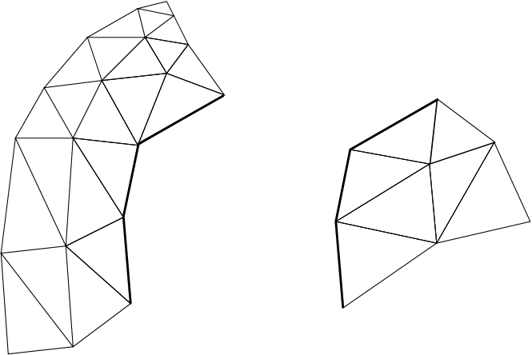

   A small mesh partitioned into two pieces.

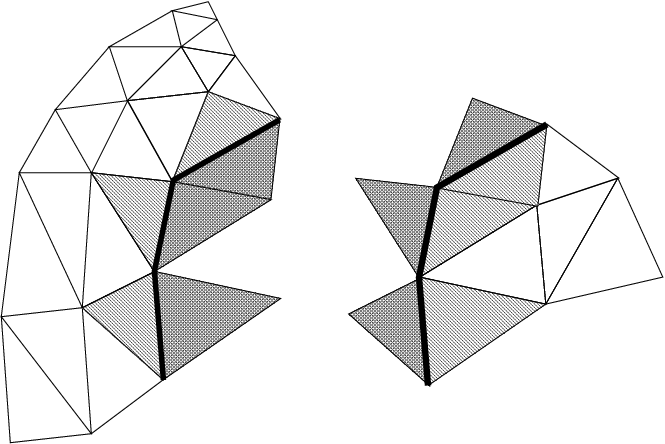

   The same mesh with one layer of edge-adjacent ghosts.

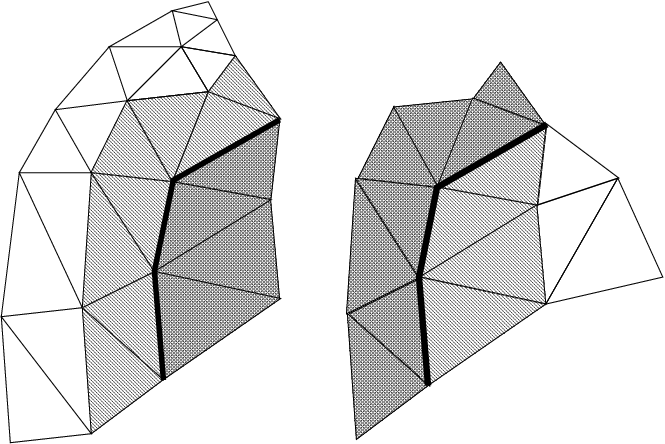

   The same mesh with one layer of node-adjacent ghosts.

In Figure :numref:`fig:ghostpre`, we begin with a small
mesh partitioned into pieces on the left and right. In
Figure :numref:`fig:ghostedge`, we have added ghost
elements (dark hashing) that share an edge with adjacent real elements
(light hatching). In Figure :numref:`fig:ghostnode`, we add ghost
elements that share at least one node with adjacent real elements.

.. _sec:ghostnum:

Ghost Numbering
---------------

Ghosts and real entities are stored by the framework in separate
lists—to access the ghost entity type, add FEM_GHOST to the real
entity’s type. For example, FEM_GHOST+FEM_ELEM+1 lists the ghost
elements for elType 1. To get the number of ghost nodes, you would call
FEM_Mesh_get_length(mesh,FEM_GHOST+FEM_NODE).

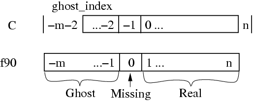

   Node indices used in the element connectivity array. There are
   :math:`n` real nodes and :math:`m` ghosts.

For real elements, the element connectivity always consists of real
nodes. But for ghost elements, the adjacent nodes may be missing, or may
themselves be ghosts. Thus ghost element connectivity lists may include
the invalid value -1 (in C) or 0 (in Fortran) to indicate that the
corresponding node is not present; or may include values less than this,
which indicate the corresponding node is a ghost. In C, ghost node
:math:`i` is indicated by the value :math:`-2-i`, while in Fortran,
ghost node :math:`i` is indicated by the value :math:`-i`. This node
indexing system is illustrated in Figure :numref:`fig:connindexing`,
This indexing system is bizarre, but it allows us to keep the real and
ghost nodes clearly separate, while still allowing real and ghost nodes
to be added in increasing order at both ends.

Since the C tests are complicated, in C we recommend using these macros:

-  FEM_Is_ghost_index(i) returns true if :math:`i` represents a ghost
   node. In Fortran, use the test :math:`i` .lt. :math:`0`

-  FEM_From_ghost_index(i) returns the ghost node’s index given its
   connectivity entry. In Fortran, use the expression :math:`-i`.

-  FEM_To_ghost_index(i) returns the connectivity entry for a given
   ghost node index. In Fortran, again use the expression :math:`-i`.

For example, a quadrilateral ghost element that is adjacent to,
respectively, two real nodes 23 and 17, the tenth local ghost node, and
one not-present node might have a connectivity entry of 23,17,-11,-1 (in
C) or 23,17,-10,0 (in Fortran).

Applications may wish to use some other numbering, such as by storing
all the ghost nodes after all the real nodes. The code to extract and
renumber the connectivity of some 3-node triangles stored in FEM_ELEM+2
would be:

::

   /* C version */
   int nReal=FEM_Mesh_get_length(mesh,FEM_ELEM+2);
   int nGhost=FEM_Mesh_get_length(mesh,FEM_GHOST+FEM_ELEM+2);
   typedef int intTriplet[3];
   intTriplet *conn=new intTriplet[nReal+nGhost];
   /* Extract real triangles into conn[0..nReal-1] */
   FEM_Mesh_data(mesh,FEM_ELEM+2,FEM_CONN, &conn[0][0], 0,nReal, 3,FEM_INDEX_0);
   /* Extract ghost triangles into conn[nReal..nReal+nGhost-1] */
   FEM_Mesh_data(mesh,FEM_GHOST+FEM_ELEM+2,FEM_CONN, &conn[nReal][0], 0,nGhost, 3,FEM_INDEX_0);

   /* Renumber the ghost triangle connectivity */
   for (int t=nReal;t<nReal+nGhost;t++)
     for (int i=0;i<3;i++) {
       int in=conn[t][i]; /* uses FEM ghost node numbering */
       int out; /* uses application's ghost numbering */
       if (in==-1) {
         out=some_value_for_missing_nodes;
       } else if (FEM_Is_ghost_index(in)) {
         out=first_application_ghost+FEM_From_ghost_index(in);
       } else /*regular real node*/ {
         out=in;
       }
       conn[t][i]=out;
     }

.. code-block:: fortran

   ! F90 version
   INTEGER, ALLOCATABLE :: conn(3,:)
   INTEGER :: nReal,nGhost,t,i,in,out
   nReal=FEM_Mesh_get_length(mesh,FEM_ELEM+2)
   nGhost=FEM_Mesh_get_length(mesh,FEM_GHOST+FEM_ELEM+2)
   ALLOCATE(conn(3,nReal+nGhost))
   ! Extract real triangles into conn[1..nReal]
   CALL FEM_Mesh_data(mesh,FEM_ELEM+2,FEM_CONN, conn, 1,nReal, 3,FEM_INDEX_1)
   ! Extract ghost triangles into conn[nReal+1..nReal+nGhost]
   CALL FEM_Mesh_data(mesh,FEM_GHOST+FEM_ELEM+2,FEM_CONN, conn(1,nReal+1), 1,nGhost, 3,FEM_INDEX_1)

   ! Renumber the ghost triangle connectivity
   DO t=nReal+1,nReal+nGhost
     DO i=1,3
       in=conn(i,t)
       IF (in .EQ. 0) out=some_value_for_missing_nodes
       IF (in .LT. 0) out=first_application_ghost-1+(-in)
       IF (in .GT. 0) out=in
       conn(i,t)=out
     END DO
   END DO

Setting up the ghost layer
--------------------------

The framework’s ghost handling is element-centric. You specify which
kinds of elements should be ghosts and how they connect by listing their
faces before partitioning.

::

  void FEM_Add_ghost_layer(int nodesPerFace,int doAddNodes);

.. code-block:: fortran

  SUBROUTINE FEM_Add_ghost_layer(nodesPerFace,doAddNodes)
  INTEGER, INTENT(IN) :: nodesPerFace,doAddNodes

This routine creates a new layer of ghosts around each FEM chunk.
nodesPerFace is the number of shared nodes that together form a
“face”. doAddNodes specifies that you want ghost nodes around your
ghost elements. If doAddNodes is 0, ghost elements will have
invalid -1 (in C) or 0 (in Fortran) connectivity entries where
there is no corresponding local node.

A face is an unordered “tuple” of nodes, and is an abstract way to
describe which ghosts your application needs—an element will be added
to your chunk if it connects to at least one of your elements’ faces.
For example, if you have a 3D, tetrahedral element that require
ghosts on all 4 of its sides, this is equivalent to requiring ghosts
of every element that shares all 3 nodes of one of your triangular
faces, so for you a face is a 3-node triangle. If you have a 2D shape
and want edge-adjacency, for you a face is a 2-node edge. If you want
node-adjacent ghosts, a face is a single node.

 Calling this routine several times creates several layers of ghost
 elements, and the different layers need not have the same parameters.

::

  void FEM_Add_ghost_elem(int elType,int facesPerElem,const int
     *elem2face);

.. code-block:: fortran

  SUBROUTINE FEM_Add_ghost_elem(elType,facesPerElem,elem2face)
  INTEGER, INTENT(IN) :: elType,facesPerElem
  INTEGER, INTENT(IN) :: elem2face(nodesPerFace,facesPerElem)

This call is used to specify which type of element is to be added
to the current ghost layer. facesPerElem and elem2face specify a
mapping between each element and the surrounding faces. The
elem2face table lists, for each face, the nodes of this element
which form the face, specified as element-local numbers—indices
into this element’s connectivity entry. The elem2face table should
have nodesPerFace*facesPerElem entries, and no entry should be
greater than nodePerEl for that element type.

Because all faces must take up the same space in the array, elem2face
can include special indices— -1 for C, 0 for Fortran—that indicate
the corresponding face is actually shorter than usual. For example,
if nodesPerFace for this layer is 4, for 4-node quadrilateral faces,
you could set one entry in elem2face to -1 to specify this is a
3-node triangular face. Faces of different lengths will never match,
so this is just a simple way to add ghosts from two kinds of faces at
once.

The above two routines are always used together. For example, if your
elements are 3-node triangles and you only require one shared node for
inclusion in a single ghost layer, you would use:

::

  FEM_Add_ghost_layer(1,1); /* 1 node per face: node adjacency */
  const static int tri2node[]={0,1,2};
  FEM_Add_ghost_elem(0,3,tri2node); /* triangles are surrounded by 3 nodes */

If you require two shared nodes (a shared edge), the code will look
like:

::

  FEM_Add_ghost_layer(2,1); /* 2 nodes per face: edge adjacency */
  const static int tri2edge[]={0,1,  1,2,  2,0};
  FEM_Add_ghost_elem(0,3,tri2edge); /*triangles are surrounded by 3 edges */

Symmetries and Ghosts-Geometric Layer
-------------------------------------

The FEM framework can create ghosts not only of things that are on other
processors, but also for various problem symmetries, like mirror
reflection, and various types of periodicities. The interface for these
ghosts is simple—you ask for the symmetries to be created, then you will
get extra ghosts along each symmetry boundary. The symmetry ghosts are
updated properly during any communication, even if the symmetry ghosts
are ghosts of real local elements from the same chunk.

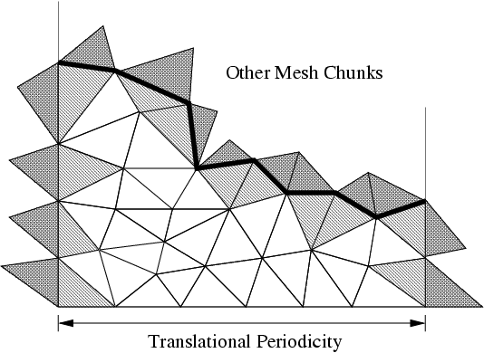

   Illustrating symmetry ghost elements.

Figure :numref:`fig:symghost` shows a chunk of a mesh for a rectangular
domain with horizontal linear translational periodicity—that is, the
domain repeats horizontally. Symmetry ghosts lie along the left and
right sides; ordinary cross-processor parallel ghosts lie along the top
edge where this chunk joins up with the rest of the domain; and the
external boundary along the bottom of the chunk has no ghosts.

::

  void FEM_Add_linear_periodicity( int nFaces,int nPer, const int
  *facesA,const int *facesB, int nNodes,const double *nodeLocs );

.. code-block:: fortran

  SUBROUTINE FEM_Add_linear_periodicity(nFaces,nPer,facesA,facesB,
  nNodes,nodeLocs)
  INTEGER, INTENT(IN) :: nFaces, nPer, nNodes
  INTEGER, INTENT(IN) :: facesA(nPer,nFaces), facesB(nPer,nFaces)
  double precision, INTENT(IN) :: nodeLocs(3,nNodes)

Make facesA and facesB match up under linear translation. Each face of
facesA must match up with exactly one face of facesB, but both the
faces and the nodes within a face can be permuted in any order—the
order is recovered by matching 3d locations in the nodeLocs array.

This call can be repeated, for example if the domain is periodic along
several directions. This call can only be issued from init().

::

  void FEM_Sym_coordinates(int elTypeOrMinusOne,double *locs);

.. code-block:: fortran

  SUBROUTINE FEM_Sym_coordinates(elTypeOrZero,locs)
  INTEGER, INTENT(IN) :: elTypeOrZero
  double precision, intent(inout) :: locs(3,<number of items>)

This call adjusts the 3d locations listed in locs so they respect the
symmetries of their corresponding item. If elTypeOrZero is an element
type, the locations are adjusted to match with the corresponding
element; if elTypeOrZero is zero, the locations are adjusted to match
up with the corresponding node.

This call is needed because symmetry ghost nodes and elements initially
have their original locations, which must be adjusted to respect the
symmetry boundaries. Thus this call is needed both for initial location
data (e.g., from FEM_Get_node_data) as well as any communicated location
data (e.g., from FEM_Update_ghost_field).

This call can only be issued from driver().

Advanced Symmetries and Ghosts-Lower Layer
------------------------------------------

The geometric symmetry layer in the preceding section is actually a thin
wrapper around this lower, more difficult to use layer.

::

  void FEM_Set_sym_nodes(const int *canon,const int *sym);

.. code-block:: fortran

  SUBROUTINE FEM_Set_sym_nodes(canon,sym)
  INTEGER, INTENT(IN) :: canon(nNodes)
  INTEGER, INTENT(IN) :: sym(nNodes)

This call describes all possible symmetries in an extremely terse
format. It can only be called from init(). The “canonicalization
array” canon maps nodes to their canonical representative—if
canon(\ :math:`i`)=canon(\ :math:`j`), nodes :math:`i` and :math:`j`
are images of each other under some symmetry. The sym array has bits
set for each symmetry boundary passing through a node.

For example, a 2d domain with 6 elements A, B, C, D, E, and F and 12
nodes numbered 1-12 that is mirror-symmetric on the horizontal
boundaries but periodic in the vertical boundaries would look like:

.. code-block:: none

      D^'|  D^ |  E^ |  F^ |  F^`
      -  1  -  2  -  3  -  4  -
      A' |  A  |  B  |  C  |  C`
      -  5  -  6  -  7  -  8  -
      D' |  D  |  E  |  F  |  F`
      -  9  - 10  -  11 -  12 -
      Av'|  Av |  Bv |  Cv |  Cv`

     v indicates the value has been shifted down (bottom boundary),
     ^ indicates the value has been shifted up (top boundary),
     ' indicates the value has been copied from the left (right boundary),
     ` indicates the value has been copied from the right (left boundary).

If we mark the left border with 1, the top with 2, the right with 4, and
the bottom with 8, this situation is indicated by topologically pasting
the top row to the bottom row by setting their canon entries equal, and
marking each node with its symmetries.

==== ===== =================
Node canon sym
==== ===== =================
1    1     3 (left + top)
2    2     2 (top)
3    3     2 (top)
4    4     6 (top + right)
5    5     1 (left)
6    6     0 (none)
7    7     0 (none)
8    8     4 (right)
9    1     9 (left+bottom)
10   2     8 (bottom)
11   3     8 (bottom)
12   4     12 (bottom+right)
==== ===== =================

::

  void FEM_Get_sym(int elTypeOrMinusOne,int *destSym);

.. code-block:: fortran

  SUBROUTINE FEM_Get_sym(elTypeOrZero,destSym);
  INTEGER, INTENT(IN) :: elTypeOrMinusOne
  INTEGER, INTENT(OUT) :: destSym(nItems)

This call extracts the list of symmetry conditions that apply to an
item type. If elType is an element type, it returns the symmetry
conditions that apply to that element type; if elType is -1 (zero for
Fortran), it returns the symmetry conditions that apply to the nodes.
Symmetry conditions are normally only nonzero for ghost nodes and
elements.

Mirror symmetry conditions are not yet supported, nor are multiple
layers of symmetry ghosts, but both should be easy to add without
changing this interface.

Older Mesh Routines
===================

These routines have a simpler, but less flexible interface than the
general routines described in Section :numref:`sec:entities`. Because
they are easy to implement in terms of the new routines, they will
remain part of the framework indefinitely. These routines always use the
default mesh, as returned by FEM_Mesh_default_read and
FEM_Mesh_default_write.

::

  void FEM_Set_elem(int elType,int nEl,int doublePerEl,int nodePerEl);
  void FEM_Get_elem(int elType,int *nEl,int *doublePerEl,int
  *nodePerEl);

.. code-block:: fortran

  SUBROUTINE FEM_Set_elem(elType,nEl,doublePerEl,nodePerEl)
  INTEGER, INTENT(IN) :: elType,nEl,doublePerEl,nodePerEl
  SUBROUTINE FEM_Get_elem(elType,nEl,doublePerEl,nodePerEl)
  INTEGER, INTENT(IN) :: elType
  INTEGER, INTENT(OUT) :: nEl,doublePerEl,nodePerEl

Describe/retrieve the number and type of elements. ElType is a
user-defined small, unique element type tag. nEl is the number of
elements being registered. doublesPerEl and nodePerEl are the number
of doubles of user data, and nodes (respectively) associated with each
element.

doublePerEl or nodePerEl may be zero, indicating that no user data or
connectivity data (respectively) is associated with the element.

You can make this and any other mesh setup calls in any order—there is
no need to make them in linearly increasing order. However, for a given
type of element FEM_Set_elem must be called before setting that
element’s connectivity or data.

::

  void FEM_Set_elem_conn(int elType,const int *conn);
  void FEM_Get_elem_conn(int elType,int *conn);

.. code-block:: fortran

  SUBROUTINE FEM_Set_elem_conn_r(elType,conn)
  INTEGER, INTENT(IN) :: elType
  INTEGER, INTENT(IN), dimension(nodePerEl,nEl) :: conn
  SUBROUTINE FEM_Get_elem_conn_r(elType,conn)
  INTEGER, INTENT(IN) :: elType
  INTEGER, INTENT(OUT), dimension(nodePerEl,nEl) :: conn
  SUBROUTINE FEM_Set_elem_conn_c(elType,conn)
  INTEGER, INTENT(IN) :: elType
  INTEGER, INTENT(IN), dimension(nEl,nodePerEl) :: conn
  SUBROUTINE FEM_Get_elem_conn_c(elType,conn)
  INTEGER, INTENT(IN) :: elType
  INTEGER, INTENT(OUT), dimension(nEl,nodePerEl) :: conn

Describe/retrieve the element connectivity array for this element
type. The connectivity array is indexed by the element number, and
gives the indices of the nodes surrounding the element. It is hence
nodePerEl*nEl integers long.

The C version array indices are zero-based, and must be stored in
row-major order (a given element’s surrounding nodes are stored
contiguously in the conn array). The Fortran version indices are
one-based, and are available in row-major (named \_r) and column-major
(named \_c) versions. We recommend row-major storage because it results
in better cache utilization (because the nodes around an element are
stored contiguously).

In this older interface, ghost nodes are indicated by invalid,

::

  void FEM_Set_node(int nNode,int doublePerNode);
  void FEM_Get_node(int
    *nNode,int *doublePerNode);

.. code-block:: fortran

  SUBROUTINE FEM_Set_node(nNode,doublePerNode)
  INTEGER, INTENT(IN) :: nNode,doublePerNode
  SUBROUTINE FEM_Get_node(nNode,doublePerNode)
  INTEGER, INTENT(OUT) :: nNode,doublePerNode

Describe/retrieve the number of nodes and doubles of user data
associated with each node. There is only one type of node, so no
nodeType identifier is needed.

doublePerNode may be zero, indicating that no user data is associated
with each node.

Old Mesh Data
-------------

::

  void FEM_Set_node_data(const double *data);
  void FEM_Get_node_data(double *data);
  void FEM_Set_elem_data(int elType,const double *data);
  void FEM_Get_elem_data(int elType,double *data);

.. code-block:: fortran

  SUBROUTINE FEM_Set_node_data_r(data)
  REAL*8, INTENT(IN), dimension(doublePerNode,nNode) :: data
  SUBROUTINE FEM_Get_node_data_r(data)
  REAL*8, INTENT(OUT), dimension(doublePerNode,nNode) :: data
  SUBROUTINE FEM_Set_node_data_c(data)
  REAL*8, INTENT(IN), dimension(nNode,doublePerNode) :: data
  SUBROUTINE FEM_Get_node_data_c(data)
  REAL*8, INTENT(OUT), dimension(nNode,doublePerNode) :: data
  SUBROUTINE FEM_Set_elem_data_r(elType,data)
  INTEGER, INTENT(IN) :: elType
  REAL*8, INTENT(IN), dimension(doublePerElem,nElem) :: data
  SUBROUTINE FEM_Get_elem_data_r(elType,data)
  INTEGER, INTENT(IN) :: elType
  REAL*8, INTENT(OUT), dimension(doublePerElem,nElem) :: data
  SUBROUTINE FEM_Set_elem_data_c(elType,data)
  INTEGER, INTENT(IN) :: elType
  REAL*8, INTENT(IN), dimension(nElem,doublePerElem) :: data
  SUBROUTINE FEM_Get_elem_data_c(elType,data)
  INTEGER, INTENT(IN) :: elType
  REAL*8, INTENT(OUT), dimension(nElem,doublePerElem) :: data

Describe/retrieve the optional, uninterpreted user data associated
with each node and element. This user data is partitioned and
reassembled along with the connectivity matrix, and may include
initial conditions, node locations, material types, or any other data
needed or produced by the program. The Fortran arrays can be row- or
column- major (see FEM_Set_elem_conn for details). The row-major form
is preferred.

Old Ghost Numbering
-------------------

In this older version of the framework, FEM_Get_node and FEM_Get_elem
return the **total** number of nodes and elements, including ghosts. The
routines below return the index of the first ghost node or element,
where ghosts are numbered after all the real elements. This old ghost
numbering scheme does not work well when adding new ghosts, which is why
the new ghost numbering scheme describes in
Section :numref:`sec:ghostnum` is used in the new API.

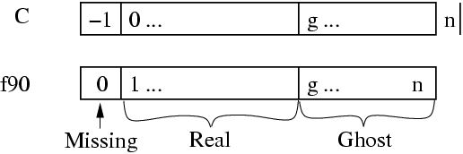

   Old ghost element and node numbering. FEM_Get_ghost_returns
   :math:`g`, FEM_Get_returns :math:`n`.

::

  int FEM_Get_node_ghost(void);
  int FEM_Get_elem_ghost(int elemType);

The examples below iterate over the real and ghost elements using the
old numbering:

::

  // C version:
  int firstGhost,max;
  FEM_Get_node(&max, &ignored);
  firstGhost=FEM_Get_node_ghost();
  for (i=0;i<firstGhost;i++)
         //... i is a real node...
  for (i=firstGhost;i<max;i++)
         //... i is a ghost node ...

.. code-block:: fortran

  ! Fortran version:
  call FEM_Get_node(max,ignored);
  firstGhost=FEM_Get_node_ghost();
  do i=1,firstGhost-1
  !       ... i is a real node...
  end do
  do i=firstGhost,max
  !      ... i is a ghost node...
  end do

Old Backward Compatibility
--------------------------

::

  void FEM_Set_mesh(int nElem, int nNodes, int nodePerEl,const int*
  conn);

This is a convenience routine equivalent to:

::

  FEM_Set_node(nNodes,0);
  FEM_Set_elem(0,nElem,0,nodePerEl);
  FEM_Set_elem_Conn(0,conn);

.. code-block:: fortran

  SUBROUTINE FEM_Set_mesh(nElem,nNodes,nodePerEl,conn)

This is a convenience routine equivalent to:

.. code-block:: fortran

  CALL FEM_Set_node(nNodes,0)
  CALL FEM_Set_elem(1,nElem,0,nodePerEl)
  CALL FEM_Set_elem_Conn_c(1,conn)

Old Sparse Data
---------------

Sparse data is typically used to represent boundary conditions. For
example, in a structural dynamics program typically some nodes have an
imposed force or position. The routines in this section are used to
describe this kind of mesh-associated data—data that only applies to
some “sparse” subset of the nodes or elements.

::

  void FEM_Set_sparse(int S_id,int nRec, const int *nodes,int
  nodesPerRec, const void *data,int dataPerRec,int dataType);

.. code-block:: fortran

  SUBROUTINE FEM_Set_sparse(S_id,nRec,nodes,nodesPerRec,data,dataPerRec,dataType)
  INTEGER, INTENT(IN) :: S_id,nRec,nodesPerRec,dataPerRec,dataType
  INTEGER, INTENT(IN) :: nodes(nodesPerRec,nRec)
  varies, INTENT(IN) :: data(dataPerRec,nRec)

Register nRec sparse data records with the framework under the number
S_id. The first call to FEM_Set_sparse must give a S_id of zero in C
(1 in fortran); and subsequent calls to FEM_Set_sparse must give
increasing consecutive S_ids.

One sparse data record consists of some number of nodes, listed in the
nodes array, and some amount of user data, listed in the data array.
Sparse data records are copied into the chunks that contains all that
record’s listed nodes. Sparse data records are normally used to describe
mesh boundary conditions- for node-associated boundary conditions,
nodesPerRec is 1; for triangle-associated boundary conditions,
nodesPerRec is 3.

In general, nodePerRec gives the number of nodes associated with each
sparse data record, and nodes gives the actual node numbers. dataPerRec
gives the number of data items associated with each sparse data record,
and dataType, one of FEM_BYTE, FEM_INT, FEM_REAL, or FEM_DOUBLE, gives
the type of each data item. As usual, you may change or delete the nodes
and data arrays after this call returns.

For example, if the first set of sparse data is 17 sparse data records,
each containing 2 nodes stored in bNodes and 3 integers stored in bDesc,
we would make the call:

::

  /*C version*/
  FEM_Set_sparse(0,17, bNodes,2, bDesc,3,FEM_INT);

.. code-block:: fortran

  ! Fortran version
  CALL FEM_Set_sparse(1,17, bNodes,2, bDesc,3,FEM_INT)

::

  void FEM_Set_sparse_elem(int S_id,const int *rec2elem);

.. code-block:: fortran

  SUBROUTINE FEM_Set_sparse_elem(S_id,rec2elem)
  INTEGER, INTENT(IN) :: S_id
  INTEGER, INTENT(IN) :: rec2elem(2,nRec)

Attach the previously-set sparse records S_id to the given elements.
rec2elem consists of pairs of integers—one for each sparse data
record. The first integer in the pair is the element type to attach
the sparse record to, and the second integer gives the element number
within that type. For example, to attach the 3 sparse records at S_id
to the elements numbered 10, 11, and 12 of the element type elType,
use:

::

  /*C version*/
  int rec2elem[]={elType,10, elType,11, elType,12};
  FEM_Set_sparse_elem(S_id,rec2elem);

.. code-block:: fortran

  ! Fortran version
  integer :: rec2elem(2,3);
  rec2elem(1,:)=elType
  rec2elem(2,1)=10; rec2elem(2,2)=11; rec2elem(2,3)=12;
  CALL FEM_Set_sparse_elem(S_id,rec2elem)

::

  int FEM_Get_sparse_length(int S_id);
  void FEM_Get_sparse(int S_id,int *nodes,void *data);

.. code-block:: fortran

  function FEM_Get_sparse_length(S_id);
  INTEGER, INTENT(IN) :: S_id
  INTEGER, INTENT(OUT) :: FEM_Get_sparse_Length
  SUBROUTINE FEM_Get_sparse(S_id,nodes,data);
  INTEGER, INTENT(IN) :: S_id
  INTEGER, INTENT(OUT) :: nodes(nodesPerRec,FEM_Get_sparse_Length(S_id))
  varies, INTENT(OUT) :: data(dataPerRec,FEM_Get_sparse_Length(S_id))

Retrieve the previously registered sparse data from the framework.
FEM_Get_sparse_length returns the number of records of sparse data
registered under the given S_id; zero indicates no records are
available. FEM_Get_sparse returns you the actual nodes (translated to
local node numbers) and unchanged user data for these sparse records.

In this old interface, there is no way to access sparse ghosts.

Mesh Modification
=================

::

  void FEM_Update_mesh(FEM_Update_mesh_fn routine, int
  callMeshUpdated,int doWhat);

.. code-block:: fortran

  SUBROUTINE FEM_Update_mesh(routine,callMeshUpdated,doWhat)
  external, INTENT(IN) :: routine
  INTEGER, INTENT(IN) :: callMeshUpdated,doWhat

Reassemble the mesh chunks from each partition into a single serial
mesh, and call the given routine on the assembled mesh. In this
routine, which runs on processor 0, the FEM_Get and FEM_Set routines
can manipulate the serial mesh. The parameter callMeshUpdated, which
must be non-zero, is passed down to routine as
routine(callMeshUpdated).

FEM_Get calls from driver() will only return the new mesh after a
FEM_Update_mesh call where doWhat is FEM_MESH_UPDATE; otherwise FEM_Get
from driver() will still return the old mesh. FEM_Update_mesh can only
be called from driver; and must be called by the driver routine for
every chunk.

================= ======= ============ ======================================
doWhat            Numeric Repartition? FEM_Update_mesh
================= ======= ============ ======================================
FEM_MESH_OUTPUT   0       No           driver() continues alongside routine
FEM_MESH_FINALIZE 2       No           driver() blocks until routine finishes
FEM_MESH_UPDATE   1       Yes          driver() blocks for the new partition
================= ======= ============ ======================================

For example, FEM_Update_mesh(my_output_routine, k, FEM_MESH_OUTPUT)
reassembles the mesh and calls a routine named my_output_routine(k)
while the driver routines continue with the computation. This might be
useful, for example, for writing out intermediate solutions as a single
file; writing outputs from driver() is more efficient but often results
in a separate file for each mesh chunk.

To block the driver routines during a call to a routine named
my_finalize_routine(k), such as at the end of the computation when the
drivers have no other work to do, use
FEM_Update_mesh(my_finalize_routine, k, FEM_MESH_FINALIZE).

To reassemble, modify, and repartition the mesh, use
FEM_Update_mesh(my_update_routine, k, FEM_MESH_UPDATE). It may be easier
to perform major mesh modifications from my_update_routine(k) than the
drivers, since the entire serial mesh is available to
my_update_routine(k).

FEM_Update_mesh reassembles the serial mesh with an attempt to preserve
the element and node global numbering. If the new mesh has the same
number and type of elements and nodes, the global numbers (and hence
serial mesh) will be unchanged. If new elements or nodes are added at
each chunk, they will be assigned new unique global numbers. If elements
or nodes are removed, their global numbers are not re-used- you can
detect the resulting holes in the serial mesh since the user data
associated with the deleted elements will be all zero. Generally,
however, it is less error-prone to perform mesh modifications only in
driver() or only in an update routine, rather than some in both.

IDXL Communication
==================

The FEM framework’s communication layer is called IDXL. This small
library handles sending and receiving data to and from a sparse subset
of 1D indices into a user array. The sparse index subset is called an
"Index List", hence the name of the library.

.. _sec:IDXL:

Index Lists
-----------

An Index List is the fundamental data structure of the IDXL library—for
example, the list of shared nodes is an Index List. IDXL includes
routines for building, combining, and sending and receiving Index Lists.

An Index List, as you might expect, is a list of indices that need to be
sent and received. An Index List includes both the indices that need to
be sent, as well as the indices to be received, from each chunk.

Consider two chunks :math:`a` and :math:`b` where :math:`b` needs some
information :math:`a` has, such as if :math:`b` has ghosts of real
elements on :math:`a`. :math:`a`\ ’s Index List thus has a send portion
with the :math:`a`-local indices for the elements :math:`a` sends; and
:math:`b`\ ’s Index List contains a receive portion with the
:math:`b`-local indices for the elements :math:`b` receives. Thus across
processors, the corresponding send and receive portions of :math:`a` and
:math:`b`\ ’s Index Lists match, as shown in
Figure :numref:`fig:indexlists`.

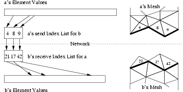

   Illustrating how Index Lists match up :math:`a`\ ’s source elements
   with :math:`b`\ ’s ghost elements.

Index List Calls
~~~~~~~~~~~~~~~~

You refer to an Index List via an opaque handle—in C, the integer
typedef IDXL_t; in Fortran, a bare INTEGER.

::

  IDXL_t FEM_Comm_shared(int mesh,int entity);

.. code-block:: fortran

  INTEGER function FEM_Comm_shared(mesh,entity)
  INTEGER, INTENT(IN) :: mesh,entity

Return a read-only copy of the Index List of shared nodes. The send
and receive portions of this list are identical, because each shared
node is both sent and received. Shared nodes are most often used with
the send/sum communication pattern.

Must be called from driver. mesh must be a reading mesh. entity must be
FEM_NODE. You may not call IDXL_Destroy on the returned list.

::

  IDXL_t FEM_Comm_ghost(int mesh,int entity);

.. code-block:: fortran

  INTEGER function FEM_Comm_ghost(mesh,entity)
  INTEGER, INTENT(IN) :: mesh,entity

Return a read-only copy of the Index List of ghost entities. The send
portion of this list contains real, interior entities, which are sent
away; the receive portion of the list contains the ghost entites,
which are received. Ghosts are most often used with the send/recv
communication pattern.

Elements to be sent out are listed starting at zero (one in Fortran);
but ghost elements to be received are also listed starting at zero (one
in Fortran). If real and ghost elements are kept in separate arrays,
this is usable as-is; but if ghosts and real elements are kept together,
you will need to shift the ghost indices using IDXL_Combine or
IDXL_Shift.

This routine must be called from driver. mesh must be a reading mesh.
entity must not include FEM_GHOST-ghosts are already included. You may
not call IDXL_Destroy on the returned list.

::

  IDXL_t IDXL_Create(void);

.. code-block:: fortran

  INTEGER function IDXL_Create()

Create a new, empty Index List. This list can then be filled up using
IDXL_Copy or IDXL_Combine.

Must be called from driver. You must eventually call IDXL_Destroy on the
returned list.

::

  void IDXL_Combine(IDXL_t dest,IDXL_t src,int startSend,int startRecv);

.. code-block:: fortran

  SUBROUTINE IDXL_Combine(dest,src,startSend,startRecv)
  INTEGER, INTENT(IN) :: dest,src,startSend,startRecv

Add the shifted contents of the src Index List to dest. The send
portion of src is shifted so the first index sent will be startSend;
for a ghost index list this is the index of the first sent real
entity. The receive portion of src is similarly shifted so the first
index received will be startRecv; for a ghost index list this is the
index of the first received ghost entity.

This routine does not check for duplicates—if an index originally
appears in dest and the also in the shifted src, it will be listed
twice.

Advanced Index List Calls
~~~~~~~~~~~~~~~~~~~~~~~~~

::

  void IDXL_Destroy(IDXL_t l);

.. code-block:: fortran

  SUBROUTINE IDXL_Destroy(l)
  INTEGER, INTENT(IN) :: l

Destroy this Index List, and free the list storage allocated by the
framework. Only call this routine with lists you created using
IDXL_Create; not lists obtained directly from the FEM framework.

::

  void IDXL_Print(IDXL_t l);

.. code-block:: fortran

  SUBROUTINE IDXL_Print(l)
  INTEGER, INTENT(IN) :: l

Print out the contents of this Index List. This routine shows both the
send and receive indices on the list, for each chunk we communicate
with.

::

  void IDXL_Copy(IDXL_t dest,IDXL_t src);

.. code-block:: fortran

  SUBROUTINE IDXL_Print(dest,src)
  INTEGER, INTENT(IN) :: dest,src

Copy the contents of the source Index List into the destination Index
List, which should be empty.

::

  void IDXL_Shift(IDXL_t l,int startSend,int startRecv);

.. code-block:: fortran

  SUBROUTINE IDXL_Shift(l,startSend,startRecv)
  INTEGER, INTENT(IN) :: l,startSend,startRecv

Like IDXL_Combine, but only shifts the indices within a single list.

::

  void IDXL_Add_entity(int newIdx,int nBetween,int *between);

.. code-block:: fortran

  SUBROUTINE IDXL_Add_node(newIdx,nBetween,between)
  INTEGER, INTENT(IN) :: newIdx,nBetween
  INTEGER, INTENT(IN) :: between(nBetween)

This call adds a new entity, with local index newIdx, to this Index
List. The new entity is sent or received by each chunk that sends or
receives all the entities listed in the between array. For example,
when adding a new node along an edge, nBetween is 2 and between lists
the endpoints of the edge; this way if the edge is shared with some
chunk, the new node will be shared with that chunk.

This routine only affects the current chunk- no other chunks are
affected. To ensure the communication lists match, IDXL_Add_entity must
be called on all the chunks that send or receive the entity, to create
the local copies of the entity.

IDXL_Add_entity adds the new entity to the end of the communication
list, and so must be called in the same order on all the chunks that
share the new entity. For example, if two new nodes :math:`x` and
:math:`y` are added between chunks :math:`a` and :math:`b`, if chunk
:math:`a` calls IDXL_Add_entity with its local number for :math:`x`
before it calls IDXL_Add_entity with its local number for :math:`y`,
chunk :math:`b` must also add its copy of node :math:`x` before adding
:math:`y`.

.. _sec:IDXLLayout:

Data Layout
-----------

IDXL is designed to send and receive data directly out of your arrays,
with no intermediate copying. This means IDXL needs a completely general
method for specifying how you store your data in your arrays. Since you
probably don’t change your storage layout at runtime, you can create a
“data layout” once at the beginning of your program, then use it
repeatedly for communication.

IDXL Layouts are normally used to describe arrays of data associated
with nodes or elements. The layout abstraction allows you to use IDXL
routines to communicate any sort of data, stored in a variety of
formats.

Like Index Lists, Layouts are referred to via an opaque handle—in a C
program via the integer typedef IDXL_Layout_t, and in Fortran via a bare
integer.

Layout Routines
~~~~~~~~~~~~~~~

In most programs, the data to be communicated is a dense array of data
of one type. In this case, there is only one layout routine you need to
know:

::

  IDXL_Layout_t IDXL_Layout_create(int type,int width);

.. code-block:: fortran

  INTEGER function IDXL_Layout_create(type,width)
  INTEGER, INTENT(IN) :: type,width

The simplest data layout to describe—a dense array of this IDXL
datatype, indexed by entity number, with width pieces of data per
entity. Note that the number of entities is not stored with the
layout-the number of entities to be communicated depends on the
communication routine.

The IDXL datatypes are:

============= ============= =================
IDXL Datatype C Datatypes   Fortran Datatypes
============= ============= =================
IDXL_BYTE     unsigned char INTEGER*1
\             char          LOGICAL*1
IDXL_INT      int           INTEGER
IDXL_REAL     float         SINGLE PRECISION
\                           REAL*4
IDXL_DOUBLE   double        DOUBLE PRECISION
\                           REAL*8
============= ============= =================

For example, if you keep a dense array with 3 doubles of force per node,
you’d call this routine as:

::

  // C++ version:
  double *force=new double[3*n];
  IDXL_Layout_t force_layout=IDXL_Layout_create(IDXL_DOUBLE,3);

.. code-block:: fortran

  ! F90 Version
  double precision, allocatable :: force(:,:)
  integer :: force_layout
  ALLOCATE(force(3,n)) ! (could equivalently use force(3*n) )
  force_layout=IDXL_Layout_create(IDXL_DOUBLE,3)

This routine was once called FEM_Create_simple_field.

.. _sec:IDXLLayoutoffset:

Advanced Layout Routines
~~~~~~~~~~~~~~~~~~~~~~~~

These advanced routines are only needed if you want to exchange data
stored in an array of user-defined types. Most programs only need
IDXL_Layout_create.

::

  IDXL_Layout_t IDXL_Layout_offset(int type, int width, int offsetBytes,
  int distanceBytes,int skewBytes);

.. code-block:: fortran

  INTEGER function IDXL_Layout_offset(type,width,offsetBytes,distanceBytes,skewBytes)
  INTEGER, INTENT(IN) :: type,width,offsetBytes,distanceBytes,skewBytes

The most general data layout-an array indexed by entity, containing
width pieces of data per entity. This routine expands on
IDXL_Layout_create by adding support for user-defined types or other
unusual data layouts. You describe your layout by giving various
in-memory byte offsets that describe the data is stored. Again, the
number of entities is not stored with the layout-the number of
entities to be communicated depends on the communication routine.

-  offsetBytes The number of bytes from the start of the array to the
   start of the data.

-  distanceBytes The number of bytes taken by one entity.

-  skewBytes The number of bytes between each piece of data. Since this
   can almost always be determined from the size of the base data type,
   this parameter can be left as zero.

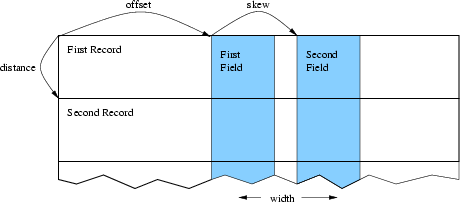

   Describing a complex data layout.

For example, if your node data is all stored in a struct (in fortran, a
named TYPE), offsetBytes gives the distance between the start of the
struct and the force; and distanceBytes gives the size in bytes of the
struct.

In C, the offsetof and sizeof keywords are useful for finding these
values. In Fortran, we provide a special routine called foffsetof that
returns the distance, in bytes, between its two arguments.

::

  // C++ version:
  typedef struct {
     double d[3], v[3], force[3], a[3];
     double m;
  } node;
  node *nodes=new node[n];
  IDXL_Layout_t force_layout=IDXL_Layout_offset(IDXL_DOUBLE,3,
           offsetof(node,force),sizeof(node),0);

.. code-block:: fortran

  ! F90 Version
    TYPE node
       DOUBLE PRECISION :: d(3), v(3), force(3), a(3)
       DOUBLE PRECISION :: m
    END TYPE
    integer :: force_layout
    ALLOCATE(nodes(n))
    force_layout=IDXL_Layout_create(IDXL_DOUBLE,3,
  &          foffsetof(nodes(1),nodes(1)%force),
  &          foffsetof(nodes(1),nodes(2)),0)

::

  void IDXL_Layout_destroy(IDXL_Layout_t layout);

.. code-block:: fortran

  SUBROUTINE IDXL_Layout_destroy(layout)
  INTEGER, INTENT(IN) :: layout

Destroy this Layout. You only need call this routine if you repeatedly
create layouts.

::

  int IDXL_Get_layout_type(IDXL_Layout_t layout);

.. code-block:: fortran

  INTEGER function IDXL_Get_layout_type(layout)

Return the IDXL datatype for this layout.

::

  int IDXL_Get_layout_width(IDXL_Layout_t layout);

.. code-block:: fortran

  INTEGER function IDXL_Get_layout_width(layout)

Return the layout width—the number of data items that are communicated
per entity.

::

  int IDXL_Get_layout_distance(IDXL_Layout_t layout);

.. code-block:: fortran

  INTEGER function IDXL_Get_layout_distance(layout)

Return the layout distance—the number of bytes between successive
entity’s data items.

Layout Compatibility Routines
~~~~~~~~~~~~~~~~~~~~~~~~~~~~~

Before IDXL was made a separate library, FEM included these routines,
which are still preserved for backward compatibility.

::

  IDXL_Layout_t FEM_Create_simple_field(int type,int width);

.. code-block:: fortran

  INTEGER function FEM_Create_simple_field(type,width)
  INTEGER, INTENT(IN) :: type,width

This routine is completely interchangeable to IDXL_Layout_create.

::

  int FEM_Create_field(int type,int width,int offset,int distance);

.. code-block:: fortran

  INTEGER function FEM_Create_field(type, width, offset, distance)
  INTEGER, INTENT(IN) :: type, width, offset, distance

This routine is like a call to IDXL_Layout_offset with the rarely used
skewBytes set to zero.

.. _sec:IDXLComm:

IDXL Communication
------------------

This section brings together all the pieces of IDXL: Index Lists are
used to determine what to send and what to receive and Layouts are used
to determine where to get and put the communicated data.

Communication Routines
~~~~~~~~~~~~~~~~~~~~~~

::

  void IDXL_Comm_sendsum(IDXL_Comm_t comm,IDXL_t indices,IDXL_Layout_t
  layout,void *data);

.. code-block:: fortran

  SUBROUTINE IDXL_Comm_sendsum(comm,indices,layout,data)
  INTEGER, INTENT(IN) :: comm,indices,layout
  varies, INTENT(INOUT) :: data

Sum these indices of shared entities across all chunks that share
them. The user data array is interpreted according to the given
layout.

If comm is zero, this routine is blocking and finishes the communication
immediately. If comm is not zero, this routine is non-blocking and
equivalent to a call to IDXL_Comm_send followed by a call to
IDXL_Comm_sum.

This routine is typically used to sum up partial values on shared nodes.
It is a more general version of the old FEM routine FEM_Update_field.
For example, to sum up the shared-node values in a 3d force vector
indexed by node, you would use:

::

  // C++ version:
  double *force=new double[3*nNodes];
  IDXL_Layout_t force_layout=IDXL_Layout_create(IDXL_DOUBLE,3);
  IDXL_t shared_indices=FEM_Comm_shared(mesh,FEM_NODE);

  //... in the time loop ...
      IDXL_Comm_sendsum(0,shared_indices,force_layout,force);

.. code-block:: fortran

  ! F90 Version
  double precision, allocatable :: force(:,:)
  integer :: force_layout, shared_indices
  ALLOCATE(force(3,nNodes)) ! (could equivalently use force(3*nNodes) )
  force_layout=IDXL_Layout_create(IDXL_DOUBLE,3)
  shared_indices=FEM_Comm_shared(mesh,FEM_NODE)

  !... in the time loop ...
      CALL IDXL_Comm_sendsum(0,shared_indices,force_layout,force)

::

  void IDXL_Comm_sendrecv(IDXL_Comm_t comm,IDXL_t indices,IDXL_Layout_t
  layout,void *data);

.. code-block:: fortran

  SUBROUTINE IDXL_Comm_sendrecv(comm,indices,layout,data)
  INTEGER, INTENT(IN) :: comm,indices,layout
  varies, INTENT(INOUT) :: data

Send these (typically real) send indices and copy in these (typically
ghost) receive indices. The user data array is interpreted according
to the given layout.

If comm is zero, this routine is blocking and finishes the communication
immediately. If comm is not zero, this routine is non-blocking and
equivalent to a call to IDXL_Comm_send followed by a call to
IDXL_Comm_sum.

This routine is typically used to obtain the values of ghost entities.
It is a more general version of the old FEM routine
FEM_Update_ghost_field. For example, to obtain 7 solution values per
ghost element, storing gElem ghosts in the array just after the nElem
regular elements, we could:

::

  // C++ version:
  double *elem=new double[7*(nElem+gElem)];
  IDXL_Layout_t elem_layout=IDXL_Layout_create(IDXL_DOUBLE,7);
  IDXL_t ghost_original=FEM_Comm_ghost(mesh,FEM_ELEM+1);
  IDXL_t ghost_shifted=IDXL_Create(); // ghosts start at nElem
  IDXL_Combine(ghost_shifted,ghost_original,0,nElem);

  //... in the time loop ...
      IDXL_Comm_sendrecv(0,ghost_shifted,elem_layout,elem);

.. code-block:: fortran

  ! F90 Version
  double precision, allocatable :: elem(:,:)
  integer :: elem_layout, ghost_original,ghost_shifted
  ALLOCATE(elem(7,nElem+gElem))
  elem_layout=IDXL_Layout_create(IDXL_DOUBLE,7)
  ghost_original=FEM_Comm_ghost(mesh,FEM_ELEM+1)
  ghost_shifted=IDXL_Create() ! ghosts start at nElem+1
  CALL IDXL_Combine(ghost_shifted,ghost_original,1,nElem+1)

  !... in the time loop ...
      CALL IDXL_Comm_sendrecv(0,ghost_shifted,elem_layout,elem)

Advanced Communication Routines
~~~~~~~~~~~~~~~~~~~~~~~~~~~~~~~

::

  IDXL_Comm_t IDXL_Comm_begin(int tag,int context);

.. code-block:: fortran

  INTEGER function IDXL_Comm_begin(tag,context)
  INTEGER, INTENT(IN) :: tag,context

Start a non-blocking communication operation with this (user-defined)
tag and communication context (0, or an AMPI communicator).

Every call to this routine must eventually be matched by a call to
IDXL_Comm_wait. Warning: for now, tag and context are ignored, and there
can be only one outstanding communication operation.

::

  void IDXL_Comm_send(IDXL_Comm_t comm,IDXL_t indices,IDXL_Layout_t
  layout,const void *data);

.. code-block:: fortran

  SUBROUTINE IDXL_Comm_send(comm,indices,layout,data)
  INTEGER, INTENT(IN) :: comm,indices,layout
  varies, INTENT(IN) :: data

When comm is flushed, send these send indices, with this layout, from
this data array.

This routine is always non-blocking; as the data array passed in will
not be copied out until the call to IDXL_Comm_flush.

::

  void IDXL_Comm_recv(IDXL_Comm_t comm,IDXL_t indices,IDXL_Layout_t
  layout,void *data);

.. code-block:: fortran

  SUBROUTINE IDXL_Comm_recv(comm,indices,layout,data)
  INTEGER, INTENT(IN) :: comm,indices,layout
  varies, INTENT(OUT) :: data

When comm is finished, copy in these receive indices, with this
layout, into this data array.

This routine is always non-blocking; as the data array passed in will
not be copied into until the call to IDXL_Comm_wait.

::

  void IDXL_Comm_sum(IDXL_Comm_t comm,IDXL_t indices,IDXL_Layout_t
  layout,void *data);

.. code-block:: fortran

  SUBROUTINE IDXL_Comm_sum(comm,indices,layout,data)
  INTEGER, INTENT(IN) :: comm,indices,layout
  varies, INTENT(INOUT) :: data

When comm is finished, add in the values for these receive indices,
with this layout, into this data array.

This routine is always non-blocking; as the data array passed in will
not be added to until the call to IDXL_Comm_wait.

::

  void IDXL_Comm_flush(IDXL_Comm_t comm);

.. code-block:: fortran

  SUBROUTINE IDXL_Comm_flush(comm)
  INTEGER, INTENT(IN) :: comm

Send all outgoing data listed on this comm. This routine exists
because there may be many calls to IDXL_Comm_send, and sending one
large message is more efficient than sending many small messages.

This routine is typically non-blocking, and may only be issued at most
once per IDXL_Comm_begin.

::

  void IDXL_Comm_wait(IDXL_Comm_t comm);

.. code-block:: fortran

  SUBROUTINE IDXL_Comm_wait(comm)
  INTEGER, INTENT(IN) :: comm

Finish this communication operation. This call must be issued exactly
once per IDXL_Comm_begin. This call includes IDXL_Comm_flush if it has
not yet been called.

This routine always blocks until all incoming data is received, and is
the last call that can be made on this comm.

Old Communication Routines
==========================

(This section is for backward compatibility only. The IDXL routines are
the new, more flexible way to perform communication.)

The FEM framework handles the updating of the values of shared nodes-
that is, it combines shared nodes’ values across all processors. The
basic mechanism to do this update is the “field”- numeric data items
associated with each node. We make no assumptions about the meaning of
the node data, allow various data types, and allow a mix of communicated
and non-communicated data associated with each node. The framework uses
IDXL layouts to find the data items associated with each node in memory.

Each field represents a (set of) data records stored in a contiguous
array, often indexed by node number. You create a field once, with the
IDXL layout routines or FEM_Create_field, then pass the resulting field
ID to FEM_Update_field (which does the shared node communication),
FEM_Reduce_field (which applies a reduction over node values), or one of
the other routines described below.

::

  void FEM_Update_field(int Fid,void *nodes);

.. code-block:: fortran

  SUBROUTINE FEM_Update_field(Fid,nodes)
  INTEGER, INTENT(IN) :: Fid
  varies, INTENT(INOUT) :: nodes

Combine a field of all shared nodes with the other chunks. Sums the
value of the given field across all chunks that share each node. For
the example above, once each chunk has computed the net force on each
local node, this routine will sum the net force across all shared
nodes.

FEM_Update_field can only be called from driver, and to be useful, must
be called from every chunk’s driver routine.

After this routine returns, the given field of each shared node will be
the same across all processors that share the node.

This routine is equivalent to an IDXL_Comm_Sendsum operation.

::

  void FEM_Read_field(int Fid,void *nodes,char *fName);

.. code-block:: fortran

  SUBROUTINE FEM_Read_field(Fid,nodes,fName)
  INTEGER, INTENT(IN) :: Fid
  varies, INTENT(OUT) :: nodes
  CHARACTER*, INTENT(IN) :: fName

Read a field out of the given serial input file. The serial input file
is line-oriented ASCII- each line begins with the global node number
(which must match the line order in the file), followed by the data to
be read into the node field. The remainder of each line is unread. If
called from Fortran, the first line must be numbered 1; if called from
C, the first line must be numbered zero. All fields are separated by
white space (any number of tabs or spaces).

For example, if we have called Create_field to describe 3 doubles, the
input file could begin with

.. code-block:: none

             1    0.2    0.7    -0.3      First node
             2    0.4    1.12   -17.26    another node
             ...

FEM_Read_field must be called from driver at any time, independent of
other chunks.

This routine has no IDXL equivalent.

::

  void FEM_Reduce_field(int Fid,const void *nodes,void *out,int op);

.. code-block:: fortran

  SUBROUTINE FEM_Reduce_field(Fid,nodes,outVal,op)
  INTEGER, INTENT(IN) :: Fid,op
  varies, INTENT(IN) :: nodes
  varies, INTENT(OUT) :: outVal

Combine one record per node of this field, according to op, across all
chunks. Shared nodes are not double-counted- only one copy will
contribute to the reduction. After Reduce_field returns, all chunks
will have identical values in outVal, which must be vec_len copies of
base_type.

May only be called from driver, and to complete, must be called from
every chunk’s driver routine.

op must be one of:

-  FEM_SUM- each element of outVal will be the sum of the corresponding
   fields of all nodes

-  FEM_MIN- each element of outVal will be the smallest value among the
   corresponding field of all nodes

-  FEM_MAX- each element of outVal will be the largest value among the
   corresponding field of all nodes

This routine has no IDXL equivalent.

::

  void FEM_Reduce(int Fid,const void *inVal,void *outVal,int op);

.. code-block:: fortran

  SUBROUTINE FEM_Reduce(Fid,inVal,outVal,op)
  INTEGER, INTENT(IN) :: Fid,op
  varies, INTENT(IN) :: inVal
  varies, INTENT(OUT) :: outVal

Combine one record of this field from each chunk, according to op,
across all chunks. Fid is only used for the base_type and vec_len-
offset and dist are not used. After this call returns, all chunks will
have identical values in outVal. Op has the same values and meaning as
FEM_Reduce_field.

May only be called from driver, and to complete, must be called from
every chunk’s driver routine.

::

  ! C example
  double inArr[3], outArr[3];
  int fid=IDXL_Layout_create(FEM_DOUBLE,3);
  FEM_Reduce(fid,inArr,outArr,FEM_SUM);

.. code-block:: fortran

  ! f90 example
  DOUBLE PRECISION :: inArr(3), outArr(3)
  INTEGER fid
  fid=IDXL_Layout_create(FEM_DOUBLE,3)
  CALL FEM_Reduce(fid,inArr,outArr,FEM_SUM)

This routine has no IDXL equivalent.

Ghost Communication
-------------------

It is possible to get values for a chunk’s ghost nodes and elements from
the neighbors. To do this, use:

::

  void FEM_Update_ghost_field(int Fid, int elTypeOrMinusOne, void
  *data);

.. code-block:: fortran

  SUBROUTINE FEM_Update_ghost_field(Fid,elTypeOrZero,data)
  INTEGER, INTENT(IN) :: Fid,elTypeOrZero
  varies, INTENT(INOUT) :: data

This has the same requirements and call sequence as FEM_Update_field,
except it applies to ghosts. You specify which type of element to
exchange using the elType parameter. Specify -1 (C version) or 0
(fortran version) to exchange node values.

Ghost List Exchange
-------------------

It is possible to exchange sparse lists of ghost elements between FEM
chunks.

::

  void FEM_Exchange_ghost_lists(int elemType,int nIdx,const int
  *localIdx);

.. code-block:: fortran

  SUBROUTINE FEM_Exchange_ghost_lists(elemType,nIdx,localIdx)
  INTEGER, INTENT(IN) :: elemType,nIdx
  INTEGER, INTENT(IN) :: localIdx[nIdx]

This routine sends the local element indices in localIdx to those
neighboring chunks that connect to its ghost elements on the other
side. That is, if the element localIdx[i] has a ghost on some chunk c,
localIdx[i] will be sent to and show up in the ghost list of chunk c.

::

  int FEM_Get_ghost_list_length(void);

Returns the number of entries in my
ghost list—the number of my ghosts that other chunks passed to their
call to FEM_Exchange_ghost_lists.

::

  void FEM_Get_ghost_list(int *retLocalIdx);

.. code-block:: fortran

  SUBROUTINE FEM_Get_ghost_list(retLocalIdx)
  INTEGER, INTENT(OUT) :: retLocalIdx[FEM_Get_ghost_list_length()]

These routines access the list of local elements sent by other chunks.
  The returned indices will all refer to ghost elements in my chunk.

.. _sec:ParFUM:

ParFUM
======

ParFUM is the name for the latest version of FEM. ParFUM includes
additional features including parallel mesh modification and adaptivity
(geometrical). ParFUM also contains functions which generate additional
topological adjacency information. ParFUM cannot be built separate from
Charm++ since it uses various messaging mechanisms that MPI does not
readily support. It is important to note that ParFUM adaptivity at the
moment has some limitations. It works only for meshes which are
two-dimensional. The other limitation is that the mesh on which it works
on must have one layer of node-deep ghosts. Most applications require no
or one layer ghosts, so it is really not a limitation, but for
applications that need multiple layers of ghost information, the
adaptivity operations cannot be used.

Adaptivity Initialization
-------------------------

If a FEM application wants to use parallel mesh adaptivity, the first
task is to call the initialization routine from the *driver* function.
This creates the node and element adjacency information that is
essential for the adaptivity operations. It also initializes all the
mesh adaptivity related internal objects in the framework.

::

  void FEM_ADAPT_Init(int meshID)

Initializes the mesh defined by meshID for the mesh adaptivity
operations.

Preparing the Mesh for Adaptivity
---------------------------------

For every element entity in the mesh, there is a desired size entry for
each element. This entry is called meshSizing. This meshSizing entry
contains a metric that decides the element quality. The default metric
is the average of the size of the three edges of an element. This
section provides various mechanisms to set this field. Some of the
adaptive operations actually use these metrics to maintain quality.
Though there is another metric which is computer for each element and
maintained on the fly and that is the ratio of the largest length to the
smallest altitude and this value during mesh adaptivity is not allowed
to go beyond a certain limit. Because the larger this value after a
certain limit, the worse the element quality.

::

  void FEM_ADAPT_SetElementSizeField(int meshID, int elem, double size);

For the mesh specified by meshID, for the element elem, we set the
desired size for each element to be size.

::

  void FEM_ADAPT_SetElementSizeField(int meshID, double *sizes);

For the mesh specified by meshID, for the element elem, we set the
desired size for each element from the corresponding entry in the sizes
array.

::

  void FEM_ADAPT_SetReferenceMesh(int meshID);

For each element int this mesh defined by meshID set its size to the
average edge length of the corresponding element.

::

  void FEM_ADAPT_GradateMesh(int meshID, double smoothness);

Resize mesh elements to avoid jumps in element size. i.e. avoid
discontinuities in the desired sizes for elements of a mesh by smoothing
them out. Algorithm based on h-shock correction, described in Mesh
Gradation Control, Borouchaki et al.

Modifying the Mesh
------------------

Once the elements in the mesh has been prepared by specifying their
desired sizes, we are ready to use the actual adaptivity operations.
Currently we provide Delaunay flip operations, edge bisect operations
and edge-coarsen operations all of which are implemented in parallel,
but the user has access to these wrapper functions which intelligently
decide when and in which region of the mesh to use the adaptivity
operations to generate a mesh with higher quality elements while
achieving the desired size (which is usually average edge length per
element), or it could even be the area of each element.

::

  void FEM_ADAPT_Refine(int meshID, int qm, int method, double
  factor,double *sizes);

Perform refinements on the mesh specified by meshId. Tries to
maintain/improve element quality by refining the mesh as specified by a
quality measure qm. If method = 0, refine areas with size larger than
factor down to factor If method = 1, refine elements down to sizes
specified in the sizes array. In this array each entry corresponds to
the corresponding element. Negative entries in sizes array indicate no
refinement.

::

  void FEM_ADAPT_Coarsen(int meshID, int qm, int method, double
  factor,double *sizes);

Perform refinements on the mesh specified by meshId. Tries to
maintain/improve element quality by coarsening the mesh as specified by
a quality measure qm. If method = 0, coarsen areas with size smaller
than factor down to factor If method = 1, coarsen elements up to sizes
specified in the sizes array. In this array each entry corresponds to
the corresponding element. Negative entries in sizes array indicate no
coarsening.

::

  void FEM_ADAPT_AdaptMesh(int meshID, int qm, int method, double
  factor,double *sizes);

It has the same set of arguments as required by the previous two
operations, namely refine and coarsen. This function keeps using the
above two functions till we have all elements in the mesh with as close
to the desired quality. Apart from using the above two operations, it
also performs a mesh repair operation where it gets rid of some bad
quality elements by Delaunay flip or coarsening as the geometry in the
area demands.

::

  int FEM_ADAPT_SimpleRefineMesh(int meshID, double targetA, double xmin,
  double ymin, double xmax, double ymax);

A region is defined by (xmax, xmin, ymax, ymin) and the target area to
be achieved for all elements in this region in the mesh specified by
meshID is given by targetA. This function only performs a series of
refinements on the elements in this region. If the area is larger, then
no coarsening is done.

::

  int FEM_ADAPT_SimpleCoarsenMesh(int meshID, double targetA, double xmin,
  double ymin, double xmax, double ymax);

A region is defined by (xmax, xmin, ymax, ymin) and the target area to
be achieved for all elements in this region in the mesh specified by
meshID is given by targetA. This function only performs a series of
coarsenings on the elements in this region. If the area is smaller, then
no refinement is done.

Verify correctness of the Mesh
------------------------------

After adaptivity operations are performed and even before adaptivity
operations, it is important to first verify that we are working on a
mesh that is consistent geometrically with the types of mesh that the
adaptivity algorithms are designed to work on. There is a function that
can be used to test various properties of a mesh, like area, quality,
geometric consistency, idxl list correctness, etc.

::

  void FEM_ADAPT_TestMesh(int meshID);

This provides a series of tests to determine the consistency of the mesh
specified by meshID.

These four simple steps define what needs to be used by a program that
wishes to use the adaptivity features of ParFUM.

ParFUM developers
-----------------

This manual is meant for ParFUM users, so developers should look at the
source code and the doxygen generated documentation.

.. [1]
   The framework uses the excellent graph partitioning package Metis.
