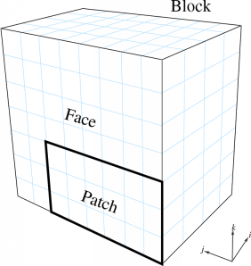
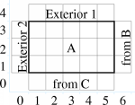
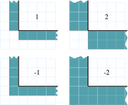

===================================
Charm++ Multiblock Framework Manual
===================================

.. contents::
   :depth: 3

Motivation
==========

A large class of problems can be solved by first decomposing the problem
domain into a set of structured grids. For simplicity, each structured
grid is often made rectangular, when it is called a *block*. These
blocks may face one another or various parts of the outside world, and
taken together comprise a *multiblock computation*.

There are two main types of multiblock computations -- implicit and
explicit. In an implicit computation, a global matrix, which represents
the entire problem domain, is formed and solved. Implicit computations
require a fast sparse matrix solver, and are typically used for
steady-state problems. In an explicit computation, the solution proceeds
locally, computing new values based on the values of nearby points.
Explicit computations often have stability criteria, and are typically
used for time-dependent problems.

The Charm++ multiblock framework allows you to write a parallel explicit
multiblock program, in C or Fortran 90, by concentrating on what happens
to a single block of the domain. Boundary condition housekeeping and
“ghost cell” exchange are all handled transparently by the framework.
Using the multiblock framework also allows you to take advantage of all
the features of Charm++, including adaptive computation and
communication overlap, run-time load balancing, performance monitoring
and visualization, and checkpoint/restart, with no additional effort.

Introduction/Terminology
========================

A *block* is a distorted rectangular grid that represents a portion of
the problem domain. A volumetric cell in the grid is called a *voxel*.
Each exterior side of a block is called a *face*. Each face may consist
of several rectangular *patches*, which all abut the same block and
experience the same boundary conditions.

   Terminology used by the framework.

For example, Figure :numref:`fig:terminology` shows a 3D 4x8x7-voxel
block, with a face and 6x3 patch indicated.

The computational domain is tiled with such blocks, which are required
to be conformal -- the voxels must match exactly. The blocks need not be
the same size or orientation, however, as illustrated in the 2D domain
of Figure :numref:`fig:decompose`.

.. figure:: fig/decompose.png
   :name: fig:decompose
   :width: 4in

   A 2D domain decomposed into three blocks: A (5x3), B (3x6), and C
   (5x4). Also shows the computation as seen from block A.

Figure :numref:`fig:decompose` also shows the computation from the
point of view of block A, which has two external boundary conditions (on
the left and top sides) and two “internal” boundary conditions (on the
right and bottom sides). During the computation, the external boundary
conditions can be imposed independent of any other blocks; while the
internal boundary conditions must be obtained from the other blocks.

To simplify the computation on the interior, these boundary conditions
are typically written into special extra “ghost” (or dummy) cells around
the outside of the real interior cells. The array indexing for these
ghost cells is illustrated in Figure :numref:`fig:indexing`.

   The ghost cells around a 5x3-voxel 2D block

The Multiblock framework manages all the boundary conditions -- both
internal and external. Internal boundary conditions are sent across
processors, and require you to register the data “fields” you wish
exchanged. External boundary conditions are not communicated, but
require you to register a function to apply that boundary condition to
your data. Either type of boundary condition can have arbitrary
thickness.

Finally, the Multiblock framework manages nothing *but* boundary
conditions. The rest of the computation, such as deciding on and
implementing timestepping, stencils, numerics, and interpolation schemes
are all left up to the user.

Input Files
===========

The Multiblock framework reads, in parallel, a partitioned set of blocks
from block input files. Each block consists of a file with extension
“.mblk” for the interior data (grid coordinates and initial conditions)
and “.bblk” for the boundary condition data (patches where boundaries
should be applied).

These block files are generated with a separate, offline tool called
“makemblock”, which is documented elsewhere.

Structure of a Multiblock Framework Program
===========================================

A Multiblock framework program consists of several subroutines: ``init``,
``driver``, ``finalize``, and external boundary condition subroutines.

``init`` and ``finalize`` are called by the Multiblock framework only on the
first processor -- these routines typically do specialized I/O, startup
and shutdown tasks.

A separate driver subroutine runs for each block, doing the main work
of the program. Because there may be several blocks per processor,
several driver routines may execute as threads simultaneously.

The boundary condition subroutines are called by the framework after a
request from the driver.

.. code-block:: none

        subroutine init
             read configuration data
        end subroutine

        subroutine bc1
             apply first type of boundary condition
        end subroutine bc1

        subroutine bc2
             apply second type of boundary condition
        end subroutine bc2

        subroutine driver
             allocate and initialize the grid
             register boundary condition subroutines bc1 and bc2
             time loop
                  apply external boundary conditions
                  apply internal boundary conditions
                  perform serial internal computation
             end time loop
        end subroutine

        subroutine finalize
              write results
        end subroutine

Compilation and Execution
=========================

A Multiblock framework program is a Charm++ program, so you must begin
by downloading the latest source version of Charm++ from
https://charm.cs.illinois.edu. Build the source with
``./build MBLOCK version`` or ``cd`` into the build directory,
``<version>/tmp``, and type ``make MBLOCK``. To compile a MULTIBLOCK
program, pass the ``-language mblock`` (for C) or ``-language mblockf``
(for Fortran) option to ``charmc``.

In a charm installation, see ``charm/<version>/pgms/charm++/mblock/`` for
example and test programs.

Preparing Input Files
=====================

The Multiblock framework reads its description of the problem domain
from input "block" files, which are in a Multiblock-specific format. The
files are named with the pattern prefixnumber.ext, where prefix is a
arbitrary string prefix you choose, number is the number of this block
(virtual processor), and ext is either “mblk”, which contains binary
data with the block coordinates, or “bblk”, which contains ASCII data
with the block’s boundary conditions.

You generate these Multiblock input files using a tool called
*makemblock*, which can be found in ``charm/<version>/pgms/charm++/makemblock``.
makemblock can read a description of the problem domain generated by the
structured meshing program Gridgen (from Pointwise) in .grd and .inp
format; or read a binary .msh format. makemblock divides this input
domain into the number of blocks you specify, then writes out .mblk and
.bblk files.

For example, to divide the single binary mesh “in1.msh” into 20 pieces
“out00001.[mb]blk”..“out00020.[mb]blk”, you’d use

::

       makemblock in1.msh 20 out

You would then run this mesh using 20 virtual processors.

Multiblock Framework API Reference
==================================

The Multiblock framework is accessed from a program via a set of
routines. These routines are available in both C and Fortran90 versions.
The C versions are all functions, and always return an error code of
MBLK_SUCCESS or MBLK_FAILURE. The Fortran90 versions are all
subroutines, and take an extra integer parameter “err” which will be set
to MBLK_SUCCESS or MBLK_FAILURE.

Initialization
--------------

All these methods should be called from the init function by the user.
The values passed to these functions are typically read from a
configuration file or computed from command-line parameters.

::

  int MBLK_Set_prefix(const char *prefix);

.. code-block:: fortran

  subroutine MBLK_Set_prefix(prefix,err)
  character*, intent(in)::prefix
  integer, intent(out)::err

This function is called to set the block filename prefix. For example,
if the input block files are named “gridX00001.mblk” and
“gridX00002.mblk”, the prefix is the string “gridX”.

::

  int MBLK_Set_nblocks(const int n);

.. code-block:: fortran

  subroutine MBLK_Set_nblocks(n,err)
  integer, intent(in)::n
  integer, intent(out)::err

This call is made to set the number of partitioned blocks to be used.
Each block is read from an input file and a separate driver is spawned
for each. The number of blocks determines the available parallelism,
so be sure to have at least as many blocks as processors. We recommend
using several times more blocks than processors, to ease load
balancing and allow adaptive overlap of computation and communication.

Be sure to set the number of blocks equal to the number of virtual
processors (+vp command-line option).

::

  int MBLK_Set_dim(const int n);

.. code-block:: fortran

  subroutine MBLK_Set_dim(n, err)
  integer, intent(in)::n
  integer, intent(out)::err

This call is made to set the number of spatial dimensions. Only three
dimensional computations are currently supported.

Utility
-------

::

  int MBLK_Get_nblocks(int* n);

.. code-block:: fortran

  subroutine MBLK_Get_nblocks(n,err)
  integer,intent(out)::n
  integer,intent(out)::err

Get the total number of blocks in the current computation. Can only be
called from the driver routine.

::

  int MBLK_Get_myblock(int* m);

.. code-block:: fortran

  subroutine MBLK_Get_myblock(m,err)
  integer,intent(out)::m
  integer,intent(out)::err

Get the id of the current block, an integer from 0 to the number of
blocks minus one. Can only be called from the driver routine.

::

  int MBLK_Get_blocksize(int* dims);

.. code-block:: fortran

  subroutine MBLK_Get_blocksize(dimsm,err)
  integer,intent(out)::dims(3)
  integer,intent(out)::err

Get the interior dimensions of the current block, in voxels. The size
of the array dims should be 3, and will be filled with the :math:`i`,
:math:`j`, and :math:`k` dimensions of the block. Can only be called
from the driver routine.

::

  int MBLK_Get_nodelocs(const int* nodedim,double *nodelocs);

.. code-block:: fortran

  subroutine MBLK_Get_blocksize(nodedim,nodelocs,err)
  integer,intent(in)::nodedims(3)
  double precision,intent(out)::nodedims(3,nodedims(0),nodedims(1),nodedims(2))
  integer,intent(out)::err

Get the :math:`(x,y,z)` locations of the nodes of the current block.
The 3-array nodedim should be the number of nodes you expect, which
must be exactly one more than the number of interior voxels.

.. figure:: fig/nodeloc.pdf
   :width: 3in

   The C node and voxel :math:`(i,j,k)` numbering for a 2 x 2 voxel
   block. For the fortran numbering, add 1 to all indices. Ghost voxels
   are omitted.

You cannot obtain the locations of ghost nodes via this routine. To get
the locations of ghost nodes, create a node-centered field containing
the node locations and do an update field. Can only be called from the
driver routine.

::

  double MBLK_Timer(void);

.. code-block:: fortran

  function double precision :: MBLK_Timer()

Return the current wall clock time, in seconds. Resolution is
machine-dependent, but is at worst 10ms.

::

  void MBLK_Print_block(void);

.. code-block:: fortran

  subroutine MBLK_Print_block()

Print a debugging representation of the framework’s information about
the current block.

::

  void MBLK_Print(const char *str);

.. code-block:: fortran

  subroutine MBLK_Print(str)
  character*, intent(in) :: str

Print the given string, prepended by the block id if called from the
driver. Works on all machines, unlike ``printf`` or ``print *``, which may
not work on all parallel machines.

Internal Boundary Conditions and Block Fields
---------------------------------------------

The Multiblock framework handles the exchange of boundary values between
neighboring blocks. The basic mechanism to do this exchange is the
*field* -- numeric data items associated with each cell of a block. These
items must be arranged in a regular 3D grid, but otherwise we make no
assumptions about the meaning of a field.

You create a field once, with MBLK_Create_Field, then pass the resulting
field ID to MBLK_Update_Field (which does the overlapping block
communication) and/or MBLK_Reduce_Field (which applies a reduction over
block values).

::

  int MBLK_Create_Field(int *dimensions,int isVoxel,const int
  base_type,const int vec_len,const int offset,const int dist, int
  *fid);

.. code-block:: fortran

  subroutine MBLK_Create_Field(dimensions, isVoxel,base_type, vec_len, offset, dist, err)
  integer, intent(in) :: dimensions, isVoxel, base_type, vec_len, offset, dist
  integer, intent(out) :: fid, err

Creates and returns a Multiblock field ID, which can be passed to
MBLK_Update_Field and MBLK_Reduce_Field. Can only be called from
driver().

``dimensions`` describes the size of the array the field is in as an
array of size 3, giving the :math:`i`, :math:`j`, and
:math:`k` sizes. The size should include the ghost regions -- i.e., pass
the actual allocated size of the array. ``isVoxel`` describes whether the
data item is to be associated with a voxel (1, a volume-centered value)
or the nodes (0, a node-centered value). ``base_type`` describes the type of
each data item, one of:

-  MBLK_BYTE -- ``unsigned char``, ``INTEGER*1``, or ``CHARACTER*1``

-  MBLK_INT -- ``int`` or ``INTEGER*4``

-  MBLK_REAL -- ``float`` or ``REAL*4``

-  MBLK_DOUBLE -- ``double``, ``DOUBLE PRECISION``, or ``REAL*8``

``vec_len`` describes the number of data items associated with each cell, an
integer at least 1.

``offset`` is the byte offset from the start of the array to the first
interior cell’s data items, a non-negative integer. This can be
calculated using the ``offsetof()`` function, normally with
``offsetof(array(1,1,1), array(interiorX,interiorY,interiorZ))``. Be sure to
skip over any ghost regions.

``dist`` is the byte offset from the first cell’s data items to the second,
a positive integer (normally the size of the data items). This can also
be calculated using ``offsetof()``; normally with
``offsetof(array(1,1,1), array(2,1,1))``.

``fid`` is the identifier for the field that is created by the function.

In the example below, we register a single double-precision value with
each voxel. The ghost region is 2 cells deep along all sides.

.. code-block:: fortran

       !In Fortran
       double precision, allocatable :: voxData(:,:,:)
       integer :: size(3), ni,nj,nk
       integer :: fid, err

       !Find the dimensions of the grid interior
       MBLK_Get_blocksize(size,err);

       !Add ghost region width to the interior dimensions
       size=size+4;  ! 4 because of the 2-deep region on both sides

       !Allocate and initialize the grid
       allocate(voxData(size(1),size(2),size(3)))
       voxData=0.0

       !Create a field for voxData
       call MBLK_Create_field(&
              &size,1, MBLK_DOUBLE,3,&
              &offsetof(grid(1,1,1),grid(3,3,3)),&
              &offsetof(grid(1,1,1),grid(2,1,1)),fid,err)

This example uses the Fortran-only helper routine ``offsetof``, which
returns the offset in bytes of memory between its two given variables. C
users can use the built-in ``sizeof`` keyword or pointer arithmetic to
achieve the same result.

::

  void MBLK_Update_field(const int fid,int ghostwidth, void *grid);

.. code-block:: fortran

  subroutine MBLK_Update_field(fid,ghostwidth, grid,err)
  integer, intent(in) :: fid, ghostwidth
  integer,intent(out) :: err
  varies, intent(inout) :: grid

Update the values in the ghost regions specified when the field was
created. This call sends this block’s interior region out, and
receives this block’s boundary region from adjoining blocks.

``ghostwidth`` controls the thickness of the ghost region. To exchange only
one cell on the boundary, pass 1. To exchange two cells, pass 2. To
include diagonal regions, make the ghost width negative. A ghost width
of zero would communicate no data.

   The 2D ghost cells communicated for various ghost widths. The heavy
   line is the block interior boundary -- this is the lower left portion
   of the block.

MBLK_Update_field can only be called from the driver, and to be useful, must
be called from every block’s driver routine.

MBLK_Update_field blocks until the field has been updated. After this
routine returns, the given field will updated. If the update was
successful MBLK_SUCCESS is returned, otherwise MBLK_FAILURE is returned in case
of error.

::

  void MBLK_Iupdate_field(const int fid,int ghostwidth, void *ingrid, void* outgrid);

.. code-block:: fortran

  subroutine MBLK_Iupdate_field(fid,ghostwidth, ingrid, outgrid,err)
  integer, intent(in) :: fid, ghostwidth
  integer,intent(out) :: err
  varies,intent(in) :: ingrid
  varies,intent(out) :: outgrid

Update the values in the ghost regions which were specified when the
field was created. For the example above the ghost regions will be
updated once for each step in the time loop.

MBLK_Iupdate_field can only be called from the driver, and to be useful,
must be called from every block’s driver routine.

MBLK_Iupdate_field is a non blocking call similar to MPI_Irecv. After
the routine returns the update may not yet be complete and the outgrid
may be in an inconsistent state. Before using the values, the status of
the update must be checked using MBLK_Test_update or MBLK_Wait_update.

There can be only one outstanding Iupdate call in progress at any time.

::

  int MBLK_Test_update(int *status);

.. code-block:: fortran

  subroutine MBLK_Test_update(status,err)
  integer, intent(out) :: status,err

MBLK_Test_update is a call that is used in association with
MBLK_Iupdate_field from the driver subroutine. It tests whether the
preceding Iupdate has completed or not. ``status`` is returned as
MBLK_DONE if the update was completed or MBLK_NOTDONE if the update is
still pending. Rather than looping if the update is still pending,
call MBLK_Wait_update to relinquish the CPU.

::

  void MBLK_Wait_update(void);

.. code-block:: fortran

  subroutine MBLK_Wait_update()

MBLK_Wait_update call is a blocking call and is used in association with
MBLK_Iupdate_field call. It blocks until the update is completed.

::

  void MBLK_Reduce_field(int fid,void *grid, void *out,int op);

.. code-block:: fortran

  subroutine MBLK_Reduce_field(fid,grid,outVal,op)
  integer, intent(in) :: fid,op
  varies, intent(in) :: grid
  varies, intent(out) :: outVal

Combine a field from each block, according to ``op``, across all blocks.
Only the interior values of the field will be combined, not the ghost
cells. After Reduce_Field returns, all blocks will have identical
values in ``outVal``, which must be ``vec_len`` copies of ``base_type``.

May only be called from the driver, and to complete, must be called from
every chunk’s driver routine.

op must be one of:

-  MBLK_SUM -- each element of ``outVal`` will be the sum of the corresponding
   fields of all blocks

-  MBLK_MIN -- each element of ``outVal`` will be the smallest value among the
   corresponding field of all blocks

-  MBLK_MAX -- each element of ``outVal`` will be the largest value among the
   corresponding field of all blocks

::

  void MBLK_Reduce(int fid,void *inVal,void *outVal,int op);

.. code-block:: fortran

  subroutine MBLK_Reduce(fid,inVal,outVal,op)
  integer, intent(in) :: fid,op
  varies, intent(in) :: inVal
  varies, intent(out) :: outVal

Combine a field from each block, acoording to ``op``, across all blocks.
``fid`` is only used for ``base_type`` and ``vec_len`` -- ``offset`` and
``dist`` are not used. After this call returns, all blocks will have
identical values in ``outVal``. ``op`` has the same values and meaning as
MBLK_Reduce_Field. May only be called from the driver, and to complete,
must be called from every block's driver routine.

External Boundary Conditions
----------------------------

Most problems include some sort of boundary conditions. These conditions
are normally applied in the ghost cells surrounding the actual
computational domain. Examples of boundary conditions are imposed
values, reflection walls, symmetry planes, inlets, and exits.

The Multiblock framework keeps track of where boundary conditions are to
be applied. You register a subroutine that the framework will call to
apply each type of external boundary condition.

::

  int MBLK_Register_bc(const int bcnum, int ghostWidth, const MBLK_BcFn bcfn);

.. code-block:: fortran

  subroutine MBLK_Register_bc(bcnum, ghostwidth, bcfn, err)
  integer,intent(in) :: bcnum, ghostWidth
  integer,intent(out) :: err
  subroutine :: bcfn

This call is used to bind an external boundary condition
subroutine, written by you, to a boundary condition number.
MBLK_Register_bc should only be called from the driver.

-  ``bcnum`` -- The boundary condition number to be associated with the
   function.

-  ``ghostWidth`` -- The width of the ghost cells where this boundary condition
   is to be applied.

-  ``bcfn`` -- The user subroutine to be called to apply this boundry
   condition.

When you ask the framework to apply boundary conditions, it will call
this routine. The routine should be declared like:

.. code-block:: fortran

       !In Fortran
       subroutine applyMyBC(param1,param2,start,end)
       varies :: param1, param2
       integer :: start(3), end(3)
       end subroutine

::

       /* In C */
       void applyMyBC(void *param1,void *param2,int *start,int *end);

``param1`` and ``param2`` are not used by the framework -- they are passed in
unmodified from MBLK_Apply_bc and MBLK_Apply_bc_all. ``param1`` and ``param2``
typically contain the block data and dimensions.

``start`` and ``end`` are 3-element arrays that give the :math:`i`,\ :math:`j`,
:math:`k` block locations where the boundary condition is to be applied.
They are both inclusive and both relative to the block interior -- you
must shift them over your ghost cells. The C versions are 0-based (the
first index is zero), while the Fortran versions are 1-based (the first index
is one).

For example, a Fortran subroutine to apply the constant value 1.0 across
the boundary, with a 2-deep ghost region, would be:

.. code-block:: fortran

       !In Fortran
       subroutine applyMyBC(grid,size,start,end)
         integer :: size(3), i,j,k
         double precision :: grid(size(1),size(2),size(3))
         integer :: start(3), end(3)
         start=start+2 ! Back up over ghost region
         end=end+2
         do i=start(1),end(1)
          do j=start(2),end(2)
            do k=start(3),end(3)
              grid(i,j,k)=1.0
            end do
          end do
         end do

       end subroutine

::

  int MBLK_Apply_bc(const int bcnum, void *param1,void *param2);

.. code-block:: fortran

  subroutine MBLK_Apply_bc(bcnum, param1,param2,err)
  integer,intent(in)::bcnum
  varies,intent(inout)::param1
  varies,intent(inout)::param2
  integer,intent(out)::err

MBLK_Apply_bc call is made to apply all boundary condition functions
of type ``bcnum`` to the block. ``param1`` and ``param2`` are passed unmodified to
the boundary condition function.

::

  int MBLK_Apply_bc_all(void* param1, void* param2);

.. code-block:: fortran

  subroutine MBLK_Apply_bc_all(param1,param2, err)
  integer,intent(out)::err
  varies,intent(inout)::param1
  varies,intent(inout)::param2

This call is same as MBLK_Apply_bc except it applies all external
boundary conditions to the block.

Migration
---------

The Charm++ runtime system includes automated, runtime load
balancing, which will automatically monitor the performance of your
parallel program. If needed, the load balancer can “migrate” mesh chunks
from heavily-loaded processors to more lightly-loaded processors,
improving the load balance and speeding up the program. For this to be
useful, pass the +vpN argument with a larger number of blocks N than
processors Because this is somewhat involved, you may refrain from
calling MBLK_Migrate and migration will never take place.

The runtime system can automatically move your thread stack to the new
processor, but you must write a PUP function to move any global or
heap-allocated data to the new processor. (Global data is declared at
file scope or ``static`` in C and ``COMMON`` in Fortran77. Heap allocated data
comes from C ``malloc``, C++ ``new``, or Fortran90 ``ALLOCATE``.) A PUP
(Pack/UnPack) function performs both packing (converting heap data into
a message) and unpacking (converting a message back into heap data). All
your global and heap data must be collected into a single block (``struct``
in C, user-defined ``TYPE`` in Fortran) so the PUP function can access it
all.

Your PUP function will be passed a pointer to your heap data block and a
special handle called a “pupper”, which contains the network message to
be sent. Your PUP function returns a pointer to your heap data block. In
a PUP function, you pass all your heap data to routines named ``pup_type``,
where type is either a basic type (such as ``int``, ``char``, ``float``, or ``double``)
or an array type (as before, but with a “s” suffix). Depending on the
direction of packing, the pupper will either read from or write to the
values you pass -- normally, you shouldn’t even know which. The only time
you need to know the direction is when you are leaving a processor or
just arriving. Correspondingly, the pupper passed to you may be deleting
(indicating that you are leaving the processor, and should delete your
heap storage after packing), unpacking (indicating you’ve just arrived
on a processor, and should allocate your heap storage before unpacking),
or neither (indicating the system is merely sizing a buffer, or
checkpointing your values).

PUP functions are much easier to write than explain -- a simple C heap
block and the corresponding PUP function is:

::

  typedef struct {
    int n1; /*Length of first array below*/
    int n2; /*Length of second array below*/
    double *arr1; /*Some doubles, allocated on the heap*/
    int *arr2; /*Some ints, allocated on the heap*/
  } my_block;

  my_block *pup_my_block(pup_er p,my_block *m)
  {
    if (pup_isUnpacking(p)) m=malloc(sizeof(my_block));
    pup_int(p, &m->n1);
    pup_int(p, &m->n2);
    if (pup_isUnpacking(p)) {
      m->arr1=malloc(m->n1*sizeof(double));
      m->arr2=malloc(m->n2*sizeof(int));
    }
    pup_doubles(p,m->arr1,m->n1);
    pup_ints(p,m->arr2,m->n2);
    if (pup_isDeleting(p)) {
      free(m->arr1);
      free(m->arr2);
      free(m);
    }
    return m;
  }

This single PUP function can be used to copy the my_block data into a
message buffer and free the old heap storage (deleting pupper), allocate
storage on the new processor and copy the message data back (unpacking
pupper), or save the heap data for debugging or checkpointing.

A Fortran ``TYPE`` block and corresponding PUP routine is as follows:

.. code-block:: fortran

        MODULE my_block_mod
          TYPE my_block
            INTEGER :: n1,n2x,n2y
            REAL*8, POINTER, DIMENSION(:) :: arr1
            INTEGER, POINTER, DIMENSION(:,:) :: arr2
          END TYPE
        END MODULE

        SUBROUTINE pup_my_block(p,m)
          IMPLICIT NONE
          USE my_block_mod
          USE pupmod
          INTEGER :: p
          TYPE(my_block) :: m
          call pup_int(p,m%n1)
          call pup_int(p,m%n2x)
          call pup_int(p,m%n2y)
          IF (pup_isUnpacking(p)) THEN
            ALLOCATE(m%arr1(m%n1))
            ALLOCATE(m%arr2(m%n2x,m%n2y))
          END IF
          call pup_doubles(p,m%arr1,m%n1)
          call pup_ints(p,m%arr2,m%n2x*m%n2y)
          IF (pup_isDeleting(p)) THEN
            DEALLOCATE(m%arr1)
            DEALLOCATE(m%arr2)
          END IF
        END SUBROUTINE

::

  int MBLK_Register(void *block, MBLK_PupFn pup_ud, int* rid)

.. code-block:: fortran

  subroutine MBLK_Register(block,pup_ud, rid)
  integer, intent(out)::rid
  TYPE(varies), POINTER :: block
  SUBROUTINE :: pup_ud

Associates the given data block and PUP function. Returns a block ID,
which can be passed to MBLK_Get_registered later. Can only be called
from driver. It returns MBLK_SUCESS if the call was successful and
MBLK_FAILURE in case of error. For the declarations above, you call
MBLK_Register as:

::

             /*C/C++ driver() function*/
             int myId, err;
             my_block *m=malloc(sizeof(my_block));
             err =MBLK_Register(m,(MBLK_PupFn)pup_my_block,&rid);

.. code-block:: fortran

             !- Fortran driver subroutine
             use my_block_mod
             interface
               subroutine pup_my_block(p,m)
                 use my_block_mod
                 INTEGER :: p
                 TYPE(my_block) :: m
               end subroutine
             end interface
             TYPE(my_block) :: m
             INTEGER :: myId,err
             MBLK_Register(m,pup_my_block,myId,err)

Note that Fortran blocks must be allocated on the stack in driver, while
C/C++ blocks may be allocated on the heap.

::

  void MBLK_Migrate()

.. code-block:: fortran

  subroutine MBLK_Migrate()

Informs the load balancing
system that you are ready to be migrated, if needed. If the system
decides to migrate you, the PUP function passed to MBLK_Register will be
called with a sizing pupper, then a packing and deleting pupper. Your stack
(and pupped data) will then be sent to the destination machine, where
your PUP function will be called with an unpacking pupper. MBLK_Migrate
will then return, whereupon you should call MBLK_Get_registered to get
your unpacked data block. Can only be called from the driver.

::

  int MBLK_Get_Userdata(int n, void** block)

Return your unpacked
userdata after migration -- that is, the return value of the unpacking
call -- to your PUP function. Takes the userdata ID returned by
MBLK_Register. Can be called from the driver at any time.

Since Fortran blocks are always allocated on the stack, the system
migrates them to the same location on the new processor, so no
Get_Registered call is needed from Fortran.
