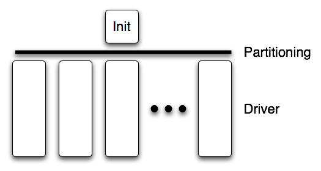

===================================================
Parallel Framework for Unstructured Meshes (ParFUM)
===================================================

.. contents::
   :depth: 3

.. _sec:intro:

Introduction
============

*TERRY*

.. _sec:phil:

Philosophy
----------

*TERRY*

Terminology
-----------

*TERRY*

.. _sec:program:

Program Structure, Compilation and Execution
============================================

.. _sec:getting_parfum:

Getting ParFUM
--------------

ParFUM is built on Charm++ so you must begin by downloading the latest
source version of Charm++ from ``http://charm.cs.illinois.edu/``. Build the
source by running ``./build`` and answering the interactive prompts, or
by manually specifying the configuration you want to the build script.
Make sure to build the Charm++ libraries, not just the core system.

In a charm installation, see charm/examples/ParFUM/ for example and test
programs.

Structure of a Typical ParFUM Program
-------------------------------------

A typical ParFUM program consists of two functions: ``init()`` and
``driver``. The ``init()`` function runs only on the first processor,
and typically does specialized I/O and startup tasks. In most ParFUM
programs ``init()`` is primarily used to read in a serial mesh. Once
``init()`` completes, ParFUM partitions the mesh and distributes it
among all processors. Then ``driver()`` is called for every chunk on
every processor and performs the main work of the program. This program
structure is shown in Figure :numref:`parfum_structure`. In the
language of the TCHARM manual, ``init()`` runs in the serial context and
``driver()`` runs in the parallel context.

   A typical ParFUM program consists of an ``init()`` function running
   in serial context and a ``driver()`` function running in parallel
   context.

In pseudocode, a simple ParFUM program would have the following
structure:

.. code-block:: none

        subroutine init
             read the serial mesh and configuration data
        end subroutine
   /* after init, the FEM framework partitions the mesh */
        subroutine driver
             get local mesh chunk
             time loop
                  FEM computations
                  communicate boundary conditions
                  more FEM computations
             end time loop
        end subroutine

ParFUM Programs without init/driver
-----------------------------------

Although ParFUM provides the init/driver structure as a convenience to
the programmer, you can write a ParFUM program without using init or
driver. This is a more flexible approach, but it is more complicated
than an init/driver program.

In pseudocode, a ParFUM program with a stand-alone main function might
look like this:

.. code-block:: none

      main program
         MPI_Init
         FEM_Init(MPI_COMM_WORLD)
         if (I am master processor)
            read mesh
         partition mesh
         time loop
             FEM computations
             communicate boundary conditions
             more FEM computations
         end time loop
      end main program

In this mode, the FEM framework does not set a default reading or
writing mesh, and does no partitioning; you must use the FEM_Mesh
routines to create and partition your mesh. See the AMPI manual for
details on how to declare the main routine, or the file main.C in ParFUM
for an example of how to write a stand-alone main routine. Compiling a
ParFUM program without init or driver requires slightly different link
flags than a typical ParFUM program, see the compilation section for
details.

Compilation
-----------

To compile and link a ParFUM program, you must first have a working copy
of Charm++ and the ParFUM libraries. The process for downloading and
building this software is described in section
:numref:`sec:getting_parfum`.

To compile a FEM program, compile and link using ``charmc``, and pass
the flag ``-language ParFUM`` to charmc when linking. If your program
uses its own ``main`` function rather than init and driver, pass
``-language AMPI`` instead.

Execution
---------

At runtime, a Charm++/FEM framework program accepts the following
options, in addition to all the usual Charm++ options described in the
Charm++ “Installation and Usage Manual”.

-  ``+vp`` :math:`v`

   Create :math:`v` mesh chunks, or “virtual processors”. By default,
   the number of mesh chunks is equal to the number of physical
   processors (set with ``+p`` :math:`p`).

-  ``-write``

   Skip driver(). After running init() normally, the framework
   partitions the mesh, writes the mesh partitions to files, and exits.
   As usual, the ``+vp`` :math:`v` option controls the number of mesh
   partitions.

   This option is only used in programs with an ``init`` function.

-  ``-read``

   Skip init(). The framework reads the partitioned input mesh from
   files and calls driver(). Together with ``-write``, this option
   allows you to separate out the mesh preparation and partitioning
   phase from the actual parallel solution run.

   This can be useful, for example, if init() requires more memory to
   hold the unpartitioned mesh than is available on one processor of the
   parallel machine. To avoid this limitation, you can run the program
   with ``-write`` on a machine with a lot of memory to prepare the
   input files, then copy the files and run with ``-read`` on a machine
   with a lot of processors.

   ``-read`` can also be useful during debugging or performance tuning,
   by skipping the (potentially slow) mesh preparation phase. This
   option is only used in programs with a ``driver`` function.

-  ``+tcharm_trace fem``

   Give a diagnostic printout on every call into the ParFUM framework.
   This can be useful for locating a sudden crash, or understanding how
   the program and framework interact. Because printing the diagnostics
   can slow a program down, use this option with care.

.. _sec:api:

ParFUM API Reference
====================

*TERRY*

.. _sec:utilities:

Utilities
---------

*ISAAC*

Basic Mesh Operations
---------------------

*TERRY*

Mesh Entities
-------------

*TERRY*

.. _sec:nodes:

Nodes
~~~~~

*TERRY*

.. _sec:elements:

Elements
~~~~~~~~

*TERRY*

.. _sec:sparse:

Sparse Elements
~~~~~~~~~~~~~~~

*TERRY*

Mesh Entity Operations
~~~~~~~~~~~~~~~~~~~~~~

*TERRY*

Mesh Entity Queries
~~~~~~~~~~~~~~~~~~~

*TERRY*

Advanced Mesh Entity Operations
~~~~~~~~~~~~~~~~~~~~~~~~~~~~~~~

*TERRY*

.. _sec:meshes:

Meshes
------

*TERRY*

Basic Mesh Operations
~~~~~~~~~~~~~~~~~~~~~

*TERRY*

Mesh Utilities
~~~~~~~~~~~~~~

*TERRY*

Advanced Mesh Operations
~~~~~~~~~~~~~~~~~~~~~~~~

*TERRY*

Mesh Communication: Ghost Layers
--------------------------------

*SAYANTAN*

Ghost Numbering
~~~~~~~~~~~~~~~

*SAYANTAN*

.. _SectionGhostLayerCreation:

Ghost Layer Creation
~~~~~~~~~~~~~~~~~~~~

*SAYANTAN*

Symmetries and Ghosts: Geometric Layer
~~~~~~~~~~~~~~~~~~~~~~~~~~~~~~~~~~~~~~

*SAYANTAN*

Advanced Symmetries and Ghosts: Lower Layer
~~~~~~~~~~~~~~~~~~~~~~~~~~~~~~~~~~~~~~~~~~~

*SAYANTAN*

Older Mesh Operations
---------------------

*SAYANTAN*

Mesh Data Operations
~~~~~~~~~~~~~~~~~~~~

*SAYANTAN*

.. _ghost-numbering-1:

Ghost Numbering
~~~~~~~~~~~~~~~

*SAYANTAN*

Backward Compatibility
~~~~~~~~~~~~~~~~~~~~~~

*SAYANTAN*

Sparse Data
~~~~~~~~~~~

*SAYANTAN*

Mesh Modification
-----------------

*AARON*

Topological Mesh Data
---------------------

A ParFUM application can request that the ParFUM framework compute
topological adjacencies. All ParFUM applications initially specify the
mesh as a set of elements, each element defined by a fixed number of
nodes. ParFUM can compute and maintain other sets of adjacencies such as
which elements are adjacent to a given node, or which nodes are
adjacent(they are both associated with a single element), or which
elements share an edge/face with another element. Currently only a
single element type is supported, and that element must be
``FEM_ELEM+0``. To generate the structures storing the other types of
adjacencies, each process in the ParFUM application should call the
following subroutines:

``FEM_Add_elem2face_tuples(int mesh, 0, nodesPerFace, numFacesPerElement, faces);``
specifies the topology of an element, specifically the configuration of
its faces(if 3D) or edges(if 2D). Two elements are adjacent if they
share a common face. The parameter faces is an integer array of length
:math:`nodesPerFace \cdot numFacesPerElement`. The description is the
same as used for determining ghost layers in section
:numref:`SectionGhostLayerCreation`.

``FEM_Mesh_allocate_valid_attr(int mesh, int entity_type);``

``FEM_Mesh_create_node_elem_adjacency(int mesh);``

``FEM_Mesh_create_node_node_adjacency(int mesh);``

``FEM_Mesh_create_elem_elem_adjacency(int mesh);``

These subroutines can be called in ``init`` on a sequential mesh, or
after partitioning in ``driver``. The adjacencies will contain
references to ghost elements if the subroutines were called in
``driver`` when ghosts are used. The indexes to ghosts are negative
integers which can easily be converted to positive indices by using the
function ``FEM_To_ghost_index(id)``. The C header ``ParFUM_internals.h``
is required to be included by the ParFUM application to access the
adjacencies. The functions to access the adjacencies are in sections
:numref:`adjacencies-e2e`, :numref:`adjacencies-n2e`,
and :numref:`adjacencies-n2n`.

The internal data structures representing the adjacencies are maintained
correctly when the adaptivity operations described in section
:numref:`Subsection-Mesh-Adaptivity` are used.

.. _adjacencies-e2e:

Accessing Element to Element Adjacencies
~~~~~~~~~~~~~~~~~~~~~~~~~~~~~~~~~~~~~~~~

``void e2e_getAll(int e, int *neighbors);`` places all of element e’s
adjacent element ids in neighbors; assumes ``neighbors`` is already
allocated to correct size

``int e2e_getNbr(int e, short idx);`` returns the id of the idx-th
adjacent element

.. _adjacencies-n2e:

Accessing Node to Element Adjacencies
~~~~~~~~~~~~~~~~~~~~~~~~~~~~~~~~~~~~~

``n2e_getLength(int n)`` returns the number of elements adjacent to the
given node ``n``.

``n2e_getAll(int n, int *&adjelements, int &sz)`` for node ``n`` place
all the ids for adjacent elements into ``adjelements``. You can ignore
sz if you correctly determine the length beforehand.

.. _adjacencies-n2n:

Accessing Node to Node Adjacencies
~~~~~~~~~~~~~~~~~~~~~~~~~~~~~~~~~~~~~~~~~~~~~~~~~~~

``n2n_getLength(int n)`` returns the number of nodes adjacent to the
given node ``n``.

``n2n_getAll(int n, int *&adjnodes, int &sz)`` for node ``n`` place all
the ids for adjacent nodes into ``adjnodes``. You can ignore sz if you
correctly determine the length beforehand.

.. _Subsection-Mesh-Adaptivity:

Mesh Adaptivity
---------------

Initialization
~~~~~~~~~~~~~~

If a ParFUM application wants to use parallel mesh adaptivity, the first
task is to call the initialization routine from the *driver* function.
This creates the node and element adjacency information that is
essential for the adaptivity operations. It also initializes all the
mesh adaptivity related internal objects in the framework.

``void FEM_ADAPT_Init(int meshID)``

Initializes the mesh defined by meshID for the mesh adaptivity
operations.

Preparing the Mesh
~~~~~~~~~~~~~~~~~~

For every element entity in the mesh, there is a desired size entry for
each element. This entry is called meshSizing. This meshSizing entry
contains a metric that determines element quality. The default metric is
the average of the length of the three edges of an element. ParFUM
provides various mechanisms to set this field. Some of the adaptive
operations use these metrics to maintain quality. In addition, there is
another metric which is computed for each element and maintained during
mesh adaptivity. This metric is the ratio of the longest side to the
shortest altitude, and this value is not allowed to go beyond a certain
limit in order to maintain element quality.

``void FEM_ADAPT_SetElementSizeField(int meshID, int elem, double size);``

For the mesh specified by meshID, for the element elem, we set the
desired size for each element to be size.

``void FEM_ADAPT_SetElementSizeField(int meshID, double \*sizes);``

For the mesh specified by meshID, for the element elem, we set the
desired size for each element from the corresponding entry in the sizes
array.

``void FEM_ADAPT_SetReferenceMesh(int meshID);``

For each element int this mesh defined by meshID set its size to the
average edge length of the corresponding element.

``void FEM_ADAPT_GradateMesh(int meshID, double smoothness);``

Resize mesh elements to avoid jumps in element size. That is, avoid
discontinuities in the desired sizes for elements of a mesh by smoothing
them out. Algorithm based on h-shock correction, described in Mesh
Gradation Control, Borouchaki et al.

Modifying the Mesh
~~~~~~~~~~~~~~~~~~

Once the elements in the mesh have been prepared by specifying their
desired sizes, we are ready to use the actual adaptivity operations.
Currently we provide Delaunay flip operations, edge bisect operations
and edge coarsen operations, all of which are implemented in parallel.
We provide several higher level functions which use these basic
operations to generate a mesh with higher quality elements while
achieving the desired sizing.

``void FEM_ADAPT_Refine(int meshID, int qm, int method, double
factor,double \*sizes);``

Perform refinements on the mesh specified by meshId. Tries to
maintain/improve element quality by refining the mesh as specified by a
quality measure qm. If method = 0, refine areas with size larger than
factor down to factor If method = 1, refine elements down to sizes
specified in the sizes array. In this array each entry corresponds to
the corresponding element. Negative entries in sizes array indicate no
refinement.

``void FEM_ADAPT_Coarsen(int meshID, int qm, int method, double
factor,double \*sizes);``

Perform refinements on the mesh specified by meshId. Tries to
maintain/improve element quality by coarsening the mesh as specified by
a quality measure qm. If method = 0, coarsen areas with size smaller
than factor down to factor If method = 1, coarsen elements up to sizes
specified in the sizes array. In this array each entry corresponds to
the corresponding element. Negative entries in sizes array indicate no
coarsening.

``void FEM_ADAPT_AdaptMesh(int meshID, int qm, int method, double
factor,double \*sizes);``

This function has the same set of arguments as required by the previous
two operations, namely refine and coarsen. This function keeps using the
above two functions until we have all elements in the mesh with as close
to the desired quality. Apart from using the above two operations, it
also performs a mesh repair operation which gets rid of some bad quality
elements by Delaunay flip or coarsening as the geometry in the area
demands.

``int FEM_ADAPT_SimpleRefineMesh(int meshID, double targetA, double xmin,
double ymin, double xmax, double ymax);``

A region is defined by (xmax, xmin, ymax, ymin) and the target area to
be achieved for all elements in this region in the mesh specified by
meshID is given by targetA. This function only performs a series of
refinements on the elements in this region. If the area is larger, then
no coarsening is done.

``int FEM_ADAPT_SimpleCoarsenMesh(int meshID, double targetA, double xmin,
double ymin, double xmax, double ymax);``

A region is defined by (xmax, xmin, ymax, ymin) and the target area to
be achieved for all elements in this region in the mesh specified by
meshID is given by targetA. This function only performs a series of
coarsenings on the elements in this region. If the area is smaller, then
no refinement is done.

Verifying correctness
---------------------

We provide a checking function that can be used for debugging purposes
to identify corrupted meshes or low quality elements.

``void FEM_ADAPT_TestMesh(int meshID);``

This provides a series of tests to determine the consistency of the mesh
specified by meshID.

.. _sec:comm:

Communication
-------------

*SAYANTAN*

Index Lists
-----------

*SAYANTAN*

Index List Calls
~~~~~~~~~~~~~~~~

*SAYANTAN*

Advanced Index List Calls
~~~~~~~~~~~~~~~~~~~~~~~~~

*SAYANTAN*

Data Layout
-----------

*SAYANTAN*

Layout Routines
~~~~~~~~~~~~~~~

*SAYANTAN*

Advanced Layout Routines
~~~~~~~~~~~~~~~~~~~~~~~~

*SAYANTAN*

Layout Compatibility Routines
~~~~~~~~~~~~~~~~~~~~~~~~~~~~~

*SAYANTAN*

IDXL Communication
------------------

*SAYANTAN*

Communication Routines
~~~~~~~~~~~~~~~~~~~~~~

*SAYANTAN*

Advanced Communication Routines
~~~~~~~~~~~~~~~~~~~~~~~~~~~~~~~

*SAYANTAN*

Old Communication Routines
--------------------------

*SAYANTAN*

Ghost Communication
~~~~~~~~~~~~~~~~~~~

*SAYANTAN*

Ghost List Exchange
~~~~~~~~~~~~~~~~~~~

*SAYANTAN*
