===========
Projections
===========

.. contents::
   :depth: 3

Generating Performance Traces
=============================

Projections is a performance analysis/visualization framework that helps
you understand and investigate performance-related problems in
(Charm++) applications. It is a framework with an event tracing
component which allows for control over the amount of information generated.
The tracing has low perturbation on the application. It also has a
Java-based visualization and analysis component with various views that
help present the performance information in a visually useful manner.

Performance analysis with Projections typically involves two simple
steps:

#. Prepare your application by linking with the appropriate trace
   generation modules and execute it to generate trace data.

#. Using the Java-based tool to visually study various aspects of the
   performance and locate the performance issues for that application
   execution.

The Charm++ runtime automatically records pertinent performance data for
performance-related events during execution. These events include the
start and end of entry method executions, message sends from entry methods
and scheduler idle time. This means *most* users do not need to manually
insert code into their applications in order to generate trace data. In
scenarios where special performance information not captured by the
runtime is required, an API (see section :numref:`sec::api`) is
available for user-specific events with some support for visualization
by the Java-based tool. If greater control over tracing activities (e.g.
dynamically turning instrumentation on and off) is desired, the API also
allows users to insert code into their applications for such purposes.

The automatic recording of events by the Projections framework
introduces the overhead of an if-statement for each runtime event, even
if no performance analysis traces are desired. Developers of Charm++
applications who consider such an overhead to be unacceptable (e.g. for
a production application which requires the absolute best performance)
may recompile the Charm++ runtime with the ``--with-production`` flag,
which removes the instrumentation stubs. To enable the instrumentation
stubs while retaining the other optimizations enabled by
``--with-production``, one may compile Charm++ with both
``--with-production`` and ``--enable-tracing``, which explicitly enables
Projections tracing.

To enable performance tracing of your application, users simply need to
link the appropriate trace data generation module(s) (also referred to
as *tracemode(s)*). (see section :numref:`sec::trace modules`)

.. _sec::trace modules:

Enabling Performance Tracing at Link/Run Time
---------------------------------------------

Projections tracing modules dictate the type of performance data,
detail, and format each processor will record. They are also
referred to as "tracemodes." There are currently 2 tracemodes available.
Zero or more tracemodes may be specified at link-time. When no
tracemodes are specified, no trace data is generated.

.. _sec::trace module projections:

Tracemode ``projections``
~~~~~~~~~~~~~~~~~~~~~~~~~

Link time option: ``-tracemode projections``

This tracemode generates files that contain information about all
Charm++ events like entry method calls and message packing during the
execution of the program. The data will be used by Projections in
visualization and analysis.

This tracemode creates a single symbol table file and :math:`p` ASCII
log files for :math:`p` processors. The names of the log files will be
``NAME.#.log{.gz}`` where NAME is the name of your executable and # is the
processor #. The name of the symbol table file is ``NAME.sts`` where NAME is
the name of your executable.

This is the main source of data needed by the performance visualizer.
Certain tools like timeline will not work without the detail data from
this tracemode.

The following is a list of runtime options available under this
tracemode:

-  ``+logsize NUM``: keep only NUM log entries in the memory of each
   processor. The logs are emptied and flushed to disk when filled.
   (defaults to 1,000,000)

-  ``+binary-trace``: generate projections log in binary form.

-  ``+gz-trace``: generate gzip (if available) compressed log files.

-  ``+gz-no-trace``: generate regular (not compressed) log files.

-  ``+checknested``: a debug option. Checks if events are improperly
   nested while recorded and issue a warning immediately.

-  ``+trace-subdirs NUM``: divide the generated log files among ``NUM``
   subdirectories of the trace root, each named ``NAME.projdir.K``

.. _sec::trace module summary:

Tracemode ``summary``
~~~~~~~~~~~~~~~~~~~~~

Compile option: ``-tracemode summary``

In this tracemode, execution time across all entry points for each
processor is partitioned into a fixed number of equally sized
time-interval bins. These bins are globally resized whenever they are
all filled in order to accommodate longer execution times while keeping
the amount of space used constant.

Additional data like the total number of calls made to each entry point
is summarized within each processor.

This tracemode will generate a single symbol table file and :math:`p`
ASCII summary files for :math:`p` processors. The names of the summary
files will be ``NAME.#.sum`` where NAME is the name of your executable and #
is the processor #. The name of the symbol table file is ``NAME.sum.sts``
where NAME is the name of your executable.

This tracemode can be used to control the amount of output generated in
a run. It is typically used in scenarios where a quick look at the
overall utilization graph of the application is desired to identify
smaller regions of time for more detailed study. Attempting to generate
the same graph using the detailed logs of the prior tracemode may be
unnecessarily time consuming or resource intensive.

The following is a list of runtime options available under this
tracemode:

-  ``+bincount NUM``: use NUM time-interval bins. The bins are resized
   and compacted when filled.

-  ``+binsize TIME``: sets the initial time quantum each bin represents.

-  ``+version``: set summary version to generate.

-  ``+sumDetail``: Generates a additional set of files, one per
   processor, that stores the time spent by each entry method associated
   with each time-bin. The names of "summary detail" files will be
   ``NAME.#.sumd`` where NAME is the name of your executable and # is the
   processor #.

-  ``+sumonly``: Generates a single file that stores a single
   utilization value per time-bin, averaged across all processors. This
   file bears the name ``NAME.sum`` where NAME is the name of your
   executable. This runtime option currently overrides the
   ``+sumDetail`` option.

.. _sec::general options:

General Runtime Options
~~~~~~~~~~~~~~~~~~~~~~~

The following is a list of runtime options available with the same
semantics for all tracemodes:

-  ``+traceroot DIR``: place all generated files in DIR.

-  ``+traceoff``: trace generation is turned off when the application is
   started. The user is expected to insert code to turn tracing on at
   some point in the run.

-  ``+traceWarn``: By default, warning messages from the framework are
   not displayed. This option enables warning messages to be printed to
   screen. However, on large numbers of processors, they can overwhelm
   the terminal I/O system of the machine and result in unacceptable
   perturbation of the application.

-  ``+traceprocessors RANGE``: Only output logfiles for PEs present in
   the range (i.e. ``0-31,32-999966:1000,999967-999999`` to record every
   PE on the first 32, only every thousanth for the middle range, and
   the last 32 for a million processor run).

.. _sec::data reduction:

End-of-run Analysis for Data Reduction
~~~~~~~~~~~~~~~~~~~~~~~~~~~~~~~~~~~~~~

As applications are scaled to thousands or hundreds of thousands of
processors, the amount of data generated becomes extremely large and
potentially unmanageable by the visualization tool. At the time of
documentation, Projections is capable of handling data from 8000+
processors but with somewhat severe tool responsiveness issues. We have
developed an approach to mitigate this data size problem with options to
trim-off "uninteresting" processors’ data by not writing such data at
the end of an application’s execution.

This is currently done through heuristics to pick out interesting
extremal (i.e. poorly behaved) processors and at the same time using a
:math:`k`-means clustering to pick out exemplar processors from equivalence
classes to form a representative subset of processor data. The analyst
is advised to also link in the summary module via ``+tracemode summary``
and enable the ``+sumDetail`` option in order to retain some profile
data for processors whose data were dropped.

-  ``+extrema``: enables extremal processor identification analysis at
   the end of the application’s execution.

-  ``+numClusters``: determines the number of clusters (equivalence
   classes) to be used by the :math:`k`-means clustering algorithm for
   determining exemplar processors. Analysts should take advantage of
   their knowledge of natural application decomposition to guess at a
   good value for this.

This feature is still being developed and refined as part of our
research. It would be appreciated if users of this feature could contact
the developers if you have input or suggestions.

.. _sec::api:

Controlling Tracing from Within the Program
-------------------------------------------

.. _sec::selective tracing:

Selective Tracing
~~~~~~~~~~~~~~~~~

Charm++ allows users to start/stop tracing the execution at certain
points in time on the local processor. Users are advised to make these
calls on all processors and at well-defined points in the application.

Users may choose to have instrumentation turned off at first (by command
line option ``+traceoff`` - see section
:numref:`sec::general options`) if some period of time in middle of
the applications' execution is of interest to the user.

Alternatively, users may start the application with instrumentation
turned on (default) and turn off tracing for specific sections of the
application.

Again, users are advised to be consistent as the ``+traceoff`` runtime
option applies to all processors in the application.

-  ``void traceBegin()``

   Enables the runtime to trace events (including all user events) on
   the local processor where ``traceBegin`` is called.

-  ``void traceEnd()``

   Disables the runtime from tracing events (including all user events)
   on the local processor where ``traceEnd`` is called.

.. _sec::explicit flushing:

Explicit Flushing
~~~~~~~~~~~~~~~~~

By default, when linking with ``-tracemode projections``, log files are
flushed to disk whenever the number of entries on a processor reaches
the logsize limit (see Section :numref:`sec::trace module
projections`). However, this can occur at any time during the
execution of the program, potentially causing performance perturbations.
To address this, users can explicitly flush to disk using the
``traceFlushLog()`` function. Note that automatic flushing will still
occur if the logsize limit is reached, but sufficiently frequent
explicit flushes should prevent that from happening.

-  ``void traceFlushLog()``

   Explicitly flushes the collected logs to disk.

.. _sec::user events:

User Events
~~~~~~~~~~~

Projections has the ability to visualize traceable user specified
events. User events are usually displayed in the Timeline view as
vertical bars above the entry methods. Alternatively the user event can
be displayed as a vertical bar that vertically spans the timelines for
all processors. Follow these following basic steps for creating user
events in a Charm++ program:

#. Register an event with an identifying string and either specify or
   acquire a globally unique event identifier. All user events that are
   not registered will be displayed in white.

#. Use the event identifier to specify trace points in your code of
   interest to you.

The functions available are as follows:

-  ``int traceRegisterUserEvent(char* EventDesc, int EventNum=-1)``

   This function registers a user event by associating ``EventNum`` to
   ``EventDesc``. If ``EventNum`` is not specified, a globally unique
   event identifier is obtained from the runtime and returned. The
   string ``EventDesc`` must either be a constant string, or it can be a
   dynamically allocated string that is **NOT** freed by the program. If
   the ``EventDesc`` contains the substring "\**\*" then the Projections
   Timeline tool will draw the event vertically spanning all PE
   timelines.

   ``EventNum`` has to be the same on all processors. Therefore use one
   of the following methods to ensure the same value for any PEs
   generating the user events:

   #. Call ``traceRegisterUserEvent`` on PE 0 in ``main::main`` without
      specifying an event number and store the returned event number into a
      readonly variable.

   #. Call ``traceRegisterUserEvent`` and specify the event number on
      processor 0. Doing this on other processors has no effect.
      Afterwards, the event number can be used in the following user
      event calls.

   Eg. ``traceRegisterUserEvent("Time Step Begin", 10);``

   Eg. ``eventID = traceRegisterUserEvent("Time Step Begin");``

There are two main types of user events, bracketed and non bracketed.
Non-bracketed user events mark a specific point in time. Bracketed user
events span an arbitrary contiguous time range. Additionally, the user
can supply a short user supplied text string that is recorded with the
event in the log file. These strings should not contain newline
characters, but they may contain simple html formatting tags such as
`` ``, ``<b>``, ``<i>``, ````, etc.

The calls for recording user events are the following:

-  ``void traceUserEvent(int EventNum)``

   This function creates a user event that marks a specific point in
   time.

   Eg. ``traceUserEvent(10);``

-  ``void traceBeginUserBracketEvent(int EventNum)``

   ``void traceEndUserBracketEvent(int EventNum)``

   These functions record a user event spanning a time interval. The
   tracing framework automatically associates the call with the time it
   was made, so timestamps are not explicitly passed in as they are with
   ``traceUserBracketEvent``.

-  ``void traceUserBracketEvent(int EventNum, double StartTime, double EndTime)``

   This function records a user event spanning a time interval from
   ``StartTime`` to ``EndTime``. Both ``StartTime`` and ``EndTime``
   should be obtained from a call to ``CmiWallTimer()`` at the
   appropriate point in the program.

   Eg.

   .. code-block:: c++

         traceRegisterUserEvent("Critical Code", 20); // on PE 0
         double critStart = CmiWallTimer();  // start time
         // do the critical code
         traceUserBracketEvent(20, critStart, CmiWallTimer());

-  ``void traceUserSuppliedData(int data)``

   This function records a user specified data value at the current
   time. This data value can be used to color entry method invocations
   in Timeline, see :numref:`sec::timeline view`.

-  ``void traceUserSuppliedNote(char * note)``

   This function records a user specified text string at the current
   time.

-  ``void traceUserSuppliedBracketedNote(char *note, int EventNum, double StartTime, double EndTime)``

   This function records a user event spanning a time interval from
   ``StartTime`` to ``EndTime``. Both ``StartTime`` and ``EndTime``
   should be obtained from a call to ``CmiWallTimer()`` at the
   appropriate point in the program.

   Additionally, a user supplied text string is recorded, and the
   ``EventNum`` is recorded. These events are therefore displayed with
   colors determined by the ``EventNum``, just as those generated with
   ``traceUserBracketEvent`` are.

.. _sec::user stats:

User Stats
~~~~~~~~~~

Charm++ allows the user to track the progression of any variable or
value throughout the program execution. These user specified stats can
then be plotted in Projections, either over time or by processor. To
enable this feature for Charm++, build Charm++ with the
``-enable-tracing`` flag.

Follow these steps to track user stats in a Charm++ program:

#. Register a stat with an identifying string and a globally unique
   integer identifier.

#. Update the value of the stat at points of interest in the code by
   calling the update stat functions.

#. Compile program with -tracemode projections flag.

The functions available are as follows:

-  ``int traceRegisterUserStat(const char * StatDesc, int StatNum)``

   This function is called once near the beginning the of the Charm++
   program. ``StatDesc`` is the identifying string and ``StatNum`` is
   the unique integer identifier.

-  ``void updateStat(int StatNum, double StatValue)``

   This function updates the value of a user stat and can be called many
   times throughout program execution. ``StatNum`` is the integer
   identifier corresponding to the desired stat. ``StatValue`` is the
   updated value of the user stat.

-  ``void updateStatPair(int StatNum, double StatValue, double Time)``

   This function works similar to ``updateStat()``, but also allows the
   user to store a user specified time for the update. In Projections,
   the user can then choose which time scale to use: real time, user
   specified time, or ordered.

.. _sec::AMPI functions:

Function-level Tracing for Adaptive MPI Applications
~~~~~~~~~~~~~~~~~~~~~~~~~~~~~~~~~~~~~~~~~~~~~~~~~~~~

Adaptive MPI (AMPI) is an implementation of the MPI interface on top of
Charm++. As with standard MPI programs, the appropriate semantic context
for performance analysis is captured through the observation of MPI
calls within C/C++/Fortran functions. Users can selectively begin and
end tracing in AMPI programs using the routines ``AMPI_Trace_begin`` and
``AMPI_Trace_end``.

.. _sec::visualization:

The Projections Performance Visualization Tool
==============================================

The Projections Java-based visualization tool (henceforth referred to as
simply Projections) can be downloaded from the Charm++ website at
http://charm.cs.illinois.edu/software. The directory which you download
will henceforth be referred to as ``PROJECTIONS_LOCATION``.

Building Projections
--------------------

To rebuild Projections (optional) from the source:

#. Make sure your PATH contains the JDK commands "java", "javac", and
   "jar", as well as the build tools "gradle" and "make".

#. Make sure that you are using Java 8 or later. Do
   this by running "java -version" and "javac -version".

#. From ``PROJECTIONS_LOCATION/``, type "make".

#. The following files are placed in ‘bin’:

   ``projections`` : Starts projections, for UNIX machines

   ``projections.bat`` : Starts projections, for Windows machines

   ``projections.jar`` : archive of all the java and image files

Visualization and Analysis using Projections
--------------------------------------------

.. _sec:startingUp:

Starting Up
~~~~~~~~~~~

| From any location, type:
| ``$ PROJECTIONS_LOCATION/bin/projections [NAME.sts]``
| where ``PROJECTIONS_LOCATION`` is the path to the main projections
  directory.

Available options to the visualization component of Projections include:

-  ``-h or --help``: displays help information about available options.

-  ``-V or --version``: displays current Projections version number.

-  ``-u or --use-version <ver>``: overrides the data interpretation
   behavior of Projections to explicitly use :math:`ver` instead of the
   current version. This is useful in scenarios where the latest version
   of Projections is not backward-compatible with older log formats.

-  ``-no-idle``: tells Projections to ignore idle time information
   contained in the logs.

-  ``-bgsize <x> <y> <z>``: tells Projections to compute additional
   derived information by assuming a logical 3-D Torus topology with the
   specified dimensionality and a processor-to-torus placement policy
   that matches Charm++’s placement policy on the BG/L class of
   machines. The presence of this option enables additional
   communication visualization options (see later). Note that this
   option is really meant to be used for logs generated from
   virtual-node mode BG/L executions. The additional information derived
   from any other logs would probably be misleading.

-  ``-print_usage``: tells Projections to also write to standard output
   the detailed graph numbers when viewing Usage Profiles (see later).
   This is useful for generating visuals that are better expressed by
   tools such as gnuplot than through screen captures of Projections
   plots.

Supplying the optional ``NAME.sts`` file in the command line will cause
Projections to load data from the file at startup. This shortcut saves
time selecting the desired dataset via the GUI’s file dialog.

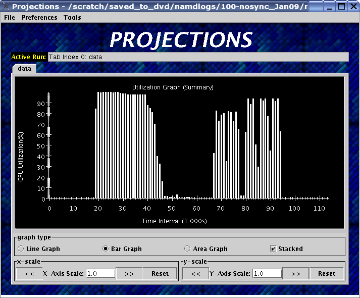

   Projections main window

When Projections is started, it will display a main window as shown in
figure :numref:`mainwindow`. If summary (.sum) files are available in
the set of data, a low-resolution utilization graph (Summary Display)
will be displayed as shown. If summary files are not available, or if
Projections was started without supplying the optional ``NAME.sts``
file, the main window will show a blank screen.

-  **File** contains 3 options. *Open File(s)* allows you to explicitly
   load a data set. This happens if you had not specified a ``NAME.sts``
   file in the command line when starting Projections or if you wish to
   explicitly load a new dataset. It brings up a dialog box that allows
   you to select the location of the dataset you wish to study. Navigate
   to the directory containing your data and select the .sts file. Click
   on "Open". If you have selected a valid file, Projections will load
   in some preliminary data from the files and then activate the rest of
   the options under the menu item **Tools**. *Close current data*
   currently works the same way as *Close all data*. They unload all
   current Projections data so one can load in a new set of data. They
   will also deactivate the individual items provided in the **Tools**
   menu option.

-  **Preferences** generally allows you to set foreground or background
   colors and entry method color schemes. This is useful for configuring
   the color schemes of Projections windows to be print-friendly.

-  **Tools** lists the set of available tools for analysis of generated
   trace data. It will be described in great detail under section
   :numref:`sec::available tools`.

The Summary Display loaded on the Main Window displays basic processor
utilization data (averaged across all processors) over time intervals.
This is provided by the data generated by the summary tracemode. This
view offers no special features over and above the **Standard Graph
Display** described in section :numref:`sec::misc`. Please refer the
appropriate section on information for using its available features.

There should not be any serious performance issues involved in the
loading of summary data on the main window.

.. _sec::available tools:

Available Tools
~~~~~~~~~~~~~~~

The following tools and views become available to you after a dataset
has been loaded (with the exception of Multirun Analysis) and may be
accessed via the menu item Tools:

-  The **Graphs** view is where you can analyze your data by breaking it
   into any number of intervals and look at what goes on in each of
   those intervals.

-  The **Timelines** view lets you look at what a specific processor is
   doing at each moment of the program. It is the most detailed view of
   a parallel application Projections offers (and correspondingly, the
   most resource-hungry).

-  The **Usage Profile** view lets you see percentage-wise what entry
   methods each processor spends its time on during a specified time
   range. It is particularly useful for identifying load imbalance and
   the probable offending entry method.

-  The **Communication** view is a general tool that presents
   communication properties contributed by each entry point across the
   processors.

-  The **Log File Viewer** provides a human-readable, verbose
   interpretation of a log file’s entries.

-  The **Histograms** view presents entry point or communication
   histogram information (ie. the frequency of occurrence of events
   given an activity property like time bin size or message size on the
   x-axis).

-  The **Overview** view gives user an overview of the utilization of
   all processors during the execution. It is an extremely useful
   initial tool to begin your performance analysis efforts with as it
   provides an overall picture of application performance while being
   very light-weight at the same time.

-  The **Animation** view animates the processor usage over a specified
   range of time and a specified interval size.

-  The **Time Profile Graph** view is a more detailed presentation of
   the **Graphs** utilization view in that it presents the time
   contribution by each entry point across the desired time interval.
   While the **Graphs** view can show the same data, it is unable to
   stack the entry points, which proves useful in some cases.

Performance Views
-----------------

.. _sec::graph view:

Graphs
~~~~~~

The Graphs window (see figure :numref:`graph`) is where you can analyze
your data by breaking it into any number of intervals and look at what
goes on in each of those intervals.

When the Graph Window first appears, a dialog box will also appear. It
will ask for the following information (Please refer to
:ref:`sec::misc` for information on special features you can use
involving the various fields):

-  Processor(s): Choose which processor(s) you wish to visualize graph
   information for.

-  Start Time : Choose the starting time of interest. A time-based
   field.

-  End Time : Choose the ending time of interest. A time-based field.

-  Interval Size : Determine the size of an interval. The number of
   intervals will also be determined by this value (End Time - Start
   Time divided by Interval Size). A time-based field.

Standard Projections dialog options and buttons are also available (see
:ref:`sec::misc` for details).

The following menu items are available:

-  **File** contains 2 options: *Print Graph* uses Java’s built-in print
   manager feature to render the tool’s displays (usually to a printer
   or a file depending on the platform on which Java is supported). Note
   that the current implementation of the renderer does not behave in
   exactly the same fashion as the screen renderer, so you should expect
   the output to look somewhat different. *Close* simply closes the
   Graph window.

-  **Tools** contains 2 options: *Set Interval Size* reloads the dialog
   box so you could select a new time range over which to view Graph
   data. *Timeline* is currently not implemented. Its intended as a
   convenient way to load Timeline data (see section
   :numref:`sec::timeline view`) over the same parameters as the
   current Graph view.

The amount of time to analyze your data depends on several factors,
including the number of processors, number of entries, and number of
intervals you have selected. A progress meter will show the amount of
data loaded so far. The meter will not, however, report rendering
progress which is determined mainly by the number of intervals selected.
As a rule of thumb, limit the number of intervals to 1,000 or less.

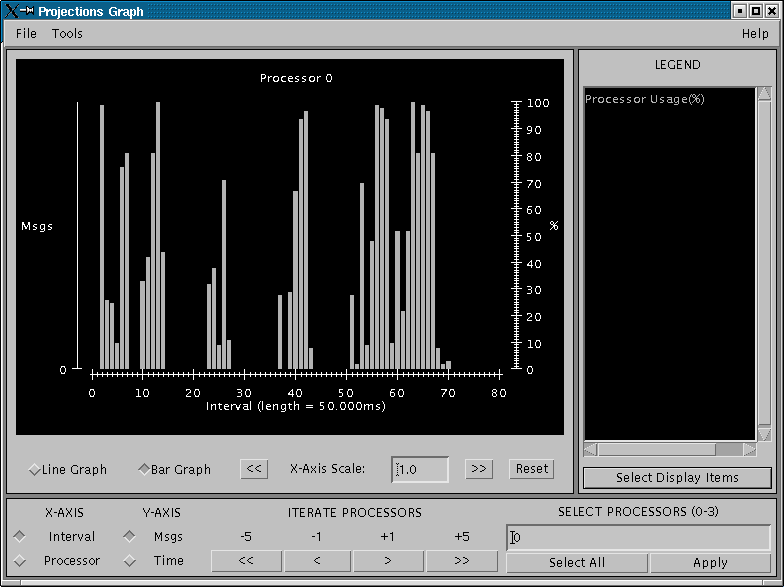

   Graph tool

The Graph Window has 3 components in its display:

#. **Display Panel** (located : top-left area)

   -  Displays title, graph, and axes. To the left is a y-axis bar for
      detailed information involving the number of messages sent or time
      executed depending on the **Control Panel** toggle selected (see
      below). To the right is a y-axis bar for average
      processor-utilization information. The x-axis may be based on
      time-interval or per-processor information depending on the
      appropriate **Control Panel** toggle.

   -  Allows you to toggle display between a line graph and a bar graph.

   -  Allows you to scale the graph along the X-axis. You can either
      enter a scale value :math:`>=` 1.0 in the text box, or you can use
      the :math:`<<` and :math:`>>` buttons to increment/decrement the
      scale by .25. Clicking on Reset sets the scale back to 1.0. When
      the scale is greater than 1.0, a scrollbar will appear along the
      bottom of the graph to let you scroll back and forth.

#. **Legend Panel** (located : top-right area)

   -  Shows what information is currently being displayed on the graph
      and what color represents that information.

   -  Click on the ‘Select Display Items’ button to bring up a window to
      add/remove items from the graph and to change the colors of the
      items:

      -  The **Select Display Items** window shows a list of items that
         you can display on the graph. There are 3 main sections: System
         Usage, System Msgs, and User Entries. The System Usage and
         System Msgs are the same for all programs. The User Entries
         section has program-specific items in it.

      -  Click on the checkbox next to an item to have it displayed on
         the graph.

      -  Click on the colorbox next to an item to modify its color.

      -  Click on ‘Select All’ to choose all of the items

      -  Click on ‘Clear All’ to remove all of the items

      -  Click on ‘Apply’ to apply you choices/changes to the graph

      -  Click on ‘Close’ to exit

#. **Control Panel** (located : bottom area)

   -  Allows you to toggle what is displayed on the X-axis. You can
      either have the x-axis display the data by interval or by
      processor.

   -  Allows you to toggle what is displayed on the Y-axis. You can
      either have the y-axis display the data by the number of msgs sent
      or by the amount of time taken.

   -  Allows you to change what data is being displayed by iterating
      through the selections. If you have selected an x-axis type of
      ‘interval’, that means you are looking at what goes on in each
      interval for a specific processor. Clicking on the
      :math:`<<, <, >, >>` buttons will change the processor you are
      looking at by either -5, -1, +1, or +5. Conversely, if you have an
      x-axis of ‘processor’, then the iterate buttons will change the
      value of the interval that you are looking at for each processor.

   -  Allows you to indicate which intervals/processors you want to
      examine. Instead of just looking at one processor or one interval,
      the box and buttons on the right side of this panel let you choose
      any number or processors/intervals to look at. This field behaves
      like a processor field. Please refer to section
      :numref:`sec::misc` for more information about the special
      features on using processor fields.

      Clicking on ‘Apply’ updates the graph with your choices. Clicking
      on ‘Select All’ chooses the entire processor range. When you
      select more than one processor’s worth of data to display, the
      graph will show the desired information summed across all selected
      processors. The exception to this is processor utilization data
      which is always displayed as data averaged across all selected
      processors.

.. _sec::timeline view:

Timelines
~~~~~~~~~

The Timeline window (see figure :numref:`timeline`) lets you look at
what a specific processor is doing at each moment of the program.

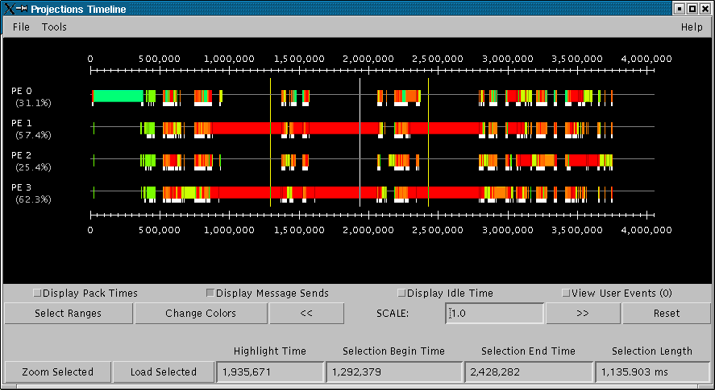

   Timeline Tool

When opening a Timeline view, a dialog box appears. The box asks for the
following information (Please refer to :numref:`sec::misc` for
information on special features you can use involving the various
fields):

-  Processor(s): Choose which processor(s) you want to see in the
   timeline.

-  Start Time : Choose what time you want your timeline to start at. A
   time-based field.

-  End Time : Choose what time you want your timeline to end at. A
   time-based field.

Standard Projections dialog options and buttons are also available (see
:numref:`sec::misc` for details).

The following menu options are available:

-  **File** contains 1 enabled option: *Close* simply closes the
   Timeline Window.

-  **Tools** contains 1 option: *Modify Ranges* opens the initial dialog
   box thereby allowing you to select new set of processors or time
   duration parameters.

-  **Colors** contains options for loading, using, and modifying color
   schemes. *Change Colors* functions in a manner similar to the button
   of the same name described under control panel information below.
   *Save Colors* allows you to save the current color set to a file
   named “color.map” into the same directory where your data logs are
   stored. Note that the directory must have write permissions for you
   before this can work. We are currently working on a more flexible
   scheme for storing saved color sets. *Restore Colors* allows you to
   load any previously saved color sets described above. *Default
   Colors* resets the current color set to the default set that
   Projections assigns without user intervention.

   Other color schemes are provided that can be used for some
   applications. The colors set as described above are the default
   coloring scheme. Other options for coloring the events are by event
   ID (chare array index), user supplied parameter, or memory usage. In
   order to color by a user supplied parameter such as timestep, the C
   function ``traceUserSuppliedData(int value);`` should be called
   within some entry methods. If such a method is called in an entry
   method, the entry method invocation can be colored by the parameter.
   The user supplied data can also be viewed in the tooltip that appears
   when the cursor hovers over an entry method invocation in the window.
   To color by memory usage, the C function ``traceMemoryUsage();``
   should be called in all entry methods. The call records the current
   memory usage. Red indicates high memory usage, and green indicates
   low memory usage. The actual memory usage can also be viewed in the
   tooltips that appear when the cursor is over an event. The memory
   usage is only available in when using a Charm++ version that uses GNU
   memory.

-  **Screenshot** contains 1 option: *Save as JPG or PNG* save the
   visible portion of the visualization to an image file. You must
   choose a filename ending with a ``.png`` or ``.jpg`` extension when
   choosing the location to save the image. The appropriate filetype is
   chosen based on the chosen filename extension. If the view is zoomed
   in, only the portion currently shown on screen is saved.

The Timeline Window consists of two parts:

#. **Display Panel** (located: top area)

   This is where the timelines are displayed and is the largest portion
   of the window. The time axis is displayed at the top of the panel.
   The left side of the panel shows the processor labels, each
   containing a processor number and two strange numbers. These two
   numbers represent the percentage of the loaded timeline during which
   work occurs. The first of the two numbers is the “non-idle” time,
   i.e. the portion of the time in the timeline not spent in idle
   regions. This contains both time for entry methods as well as other
   uninstrumented time spent likely in the Charm++ runtime. The second
   number is the percentage of the time used by the entry methods for
   the selected range.

   The timeline itself consists of colored bars for each event. Placing
   the cursor over any of these bars will display information about the
   event including: the name, the begin time, the end time, the total
   time, the time spent packing, the number of messages it created, and
   which processor created the event.

   Hovering over an event bar will cause a window to popup. This
   window contains detailed information about the messages sent by the
   clicked upon event.

   Clicking on an event bar will cause a line to be drawn to the
   beginning of the event bar from the point where the message causing
   the event originated. This option may not be applicable for threaded
   events. If the message originated on a processor not currently
   included in the visualization, the other processor will be loaded,
   and then the message line will be drawn. A warning message will
   appear if the message origination point is outside the time duration,
   and hence no line will be drawn.

   User events are displayed as bars above the ordinary event bars in
   the display area. If the name of the user event contains a substring
   "\**\*" then the bar will vertically span the whole screen.

   Message pack times and send points can be displayed below the event
   bars. The message sends are small white tick marks, while the message
   pack times are small pink bars usually occurring immediately after
   the message send point. If zoomed in to a point where each
   microsecond takes more than one pixel, the message send point and the
   following packing time may appear disconnected. This is an inherent
   problem with the granularity used for the logfiles.

#. **Control Panel** (located: bottom area)

   The controls in this panel are obvious, but we mention one here
   anyway.

   View User Event - Checking this box will bring up a new window
   showing the string description, begin time, end time and duration of
   all user events on each processor. You can access information on user
   events on different processors by accessing the numbered tabs near
   the top of the display.

   .. figure:: fig/userevent.png
      :name: userevent
      :height: 1.5in

      User Event Window

Various features appear when the user moves the mouse cursor over the
top axis. A vertical line will appear to highlight a specific time. The
exact time will be displayed at the bottom of the window. Additionally a
user can select a range by clicking while a time is highlighted and
dragging to the left or right of that point. As a selection is being
made, a vertical white line will mark the beginning and end of the
range. Between these lines, the background color for the display will
change to gray to better distinguish the selection from the surrounding
areas. After a selection is made, its duration is displayed at the
bottom. A user can zoom into the selection by clicking the “Zoom
Selected” button. To release a selection, single-click anywhere along
the axis. Clicking “Load Selected” when a selection is active will cause
the timeline range to be reloaded. To zoom out, the “<<” or “Reset”
button can be used.

To then zoom into the selected area via this interface, click on either
the “Zoom Selected” or the “Load Selected” buttons. The difference
between these two buttons is that the "Load Selected" zooms into the
selected area and discards any events that are outside the time range.
This is more efficient than “Zoom Selected” as the latter draws all the
events on a virtual canvas and then zooms into the canvas. The
disadvantage of using “Load Selected” is that it becomes impossible to
zoom back out without having to re-specify the time range via the
“Select Ranges” button.

Performance-wise, this is the most memory-intensive part of the
visualization tool. The load and zoom times are proportional to the
number of events displayed. The user should be aware of how
event-intensive the application is over the desired time-period before
proceeding to use this view. If Projections takes too long to load a
timeline, cancel the load and choose a smaller time range or fewer
processors. We expect to add features to alleviate this problem in
future releases.

.. _sec::usage profile:

Usage Profile
~~~~~~~~~~~~~

The Usage Profile window (see figure :numref:`usage profile`) lets you
see percentage-wise what each processor spends its time on during a
specified period.

When the window first comes up, a dialog box appears asking for the
processor(s) you want to look at as well as the time range you want to
look at. This dialog functions in exactly the same way as for the
Timeline tool (see section :numref:`sec::timeline view`).

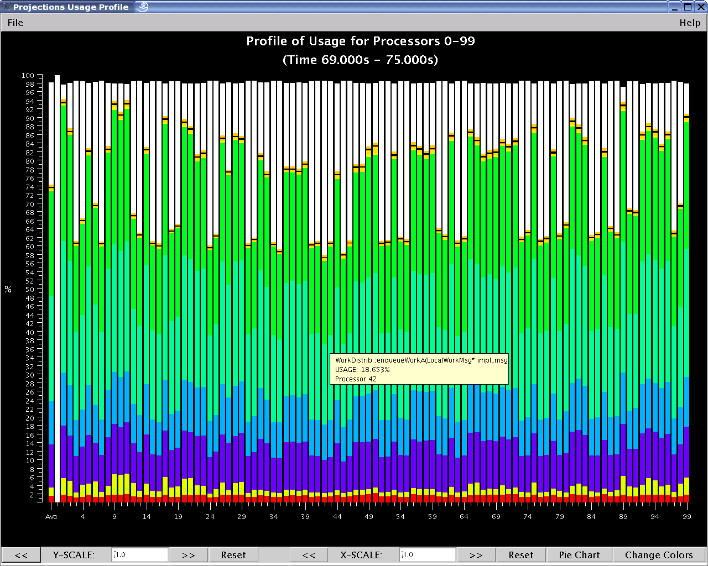

   Usage Profile

The following menu options are available in this view:

-  **File** has 2 options: *Select Processors* reloads the dialog box
   for the view and allows you to select a new processor and time range
   for this view. *Print Profile* currently does nothing. This will be
   addressed in a later release of Projections.

The following components are supported in this view:

-  **Main Display** (located: top area) The left axis of the display
   shows a scale from 0% to 100%. The main part of the display shows the
   statistics. Each processor is represented by a vertical bar with the
   leftmost bar representing the statistics averaged across all
   processors. The bottom of the bar always shows the time spent in each
   entry method (distinguished by the entry method’s assigned color) .
   Above that is always reported the message pack time (in black),
   message unpack time (in orange) and idle time (in white). Above this,
   if the information exists, are colored bars representing
   communication CPU overheads contributed by each entry method (again,
   distinguished by the same set of colors representing entry methods).
   Finally the black area on top represents time overheads that the
   Charm++ runtime cannot account for.

   If you mouse-over a portion of the bar (with the exception of the
   black area on top), a pop-up window will appear telling you the name
   of the item, what percent of the usage it has, and the processor it
   is on.

-  **Control Panel** (located: bottom area) Allows for adjustments of the
   scales in both the X and Y directions. The X direction is useful if
   you are looking at a large number of processors. The Y direction is
   useful if there are small-percentage items for a processor. The
   “Reset” button allows you to reset the X and Y scales.

   The “Pie Chart” button generates a pie chart representation (see
   figure :numref:`piechart`) of the same information using averaged
   statistics but without idle time and communication CPU overheads.

   .. figure:: fig/piechart.png
      :name: piechart
      :width: 1.8in

      Pie Chart representation of average usage

   The “Change Colors” button lists all entry methods displayed on the
   main display and their assigned colors. It allows you to change those
   assigned colors to aid in highlighting entry methods.

   The resource consumption of this view is moderate. Load times and
   visualization times should be relatively fast, but dismissing the
   tool may result in a very slight delay while Projections reclaims
   memory through Java’s garbage collection system.

.. _sec::communication:

Communication
~~~~~~~~~~~~~

The communication tool (see figure :numref:`communication`) visualizes
communication properties on each processor over a user-specified time
range.

The dialog box of the tool allows you to specify the time period within
which to load communication characteristics information. This dialog box
is exactly the same as that of the Timeline tool (see section
:numref:`sec::timeline view`).

The main component employs the standard capabilities provided by
Projections’ standard graph (see :numref:`sec::misc`).

The control panel allows you to switch between the following
communication characteristics:

-  Number of messages sent by entry methods (initial default view)

-  Number of bytes sent by entry methods

-  Number of messages received by entry methods

-  Number of bytes received by entry methods

-  Number of messages sent externally (physically) by entry methods

-  Number of bytes sent externally (physically) by entry methods

-  Number of hops messages traveled before being received by an
   entry methods. This is available when the runtime option ``-bgsize``
   (See section :numref:`sec:startingUp`) is supplied.

.. figure:: fig/apoa1_512_CommProcessorProfile.png
   :name: communication
   :width: 4in

   Communication View

This view uses memory proportional to the number of processors selected.

Communication vs Time
~~~~~~~~~~~~~~~~~~~~~

The communication over time tool (see figure
:numref:`communication-time`) visualizes communication properties over
all processors and displayed over a user-specified time range on the
x-axis.

The dialog box of the tool allows you to specify the time period within
which to load communication characteristics information. This dialog box
is exactly the same as that of the Communication tool (see section
:numref:`sec::communication`).

The main component employs the standard capabilities provided by
Projections’ standard graph (see :numref:`sec::misc`).

The control panel allows you to switch between the following
communication characteristics:

-  Number of messages sent by entry methods (initial default view)

-  Number of bytes sent by entry methods

-  Number of messages received by entry methods

-  Number of bytes received by entry methods

-  Number of messages sent externally (physically) by entry methods

-  Number of bytes sent externally (physically) by entry methods

-  Number of hops messages travelled before being received by an
   entry methods (available only on trace logs generated on the Bluegene
   machine).

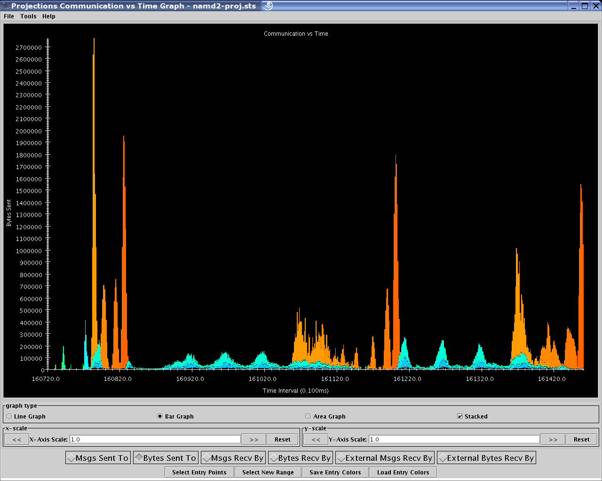

   Communication View over Time

This view has no known problems loading any range or volume of data.

View Log Files
~~~~~~~~~~~~~~

This window (see figure :numref:`viewlog`) lets you see a translation
of a log file from a bunch of numbers to a verbose version. A dialog box
asks which processor you want to look at. After choosing and pressing
OK, the translated version appears. Note that this is *not* a standard
processor field. This tool will only load *exactly* one processor’s
data.

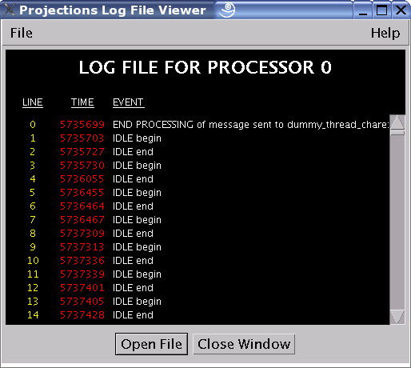

   Log File View

Each line has:

-  a line number (starting at 0)

-  the time the event occurred at

-  a description of what happened.

This tool has the following menu options:

-  **File** has 2 options: *Open File* reloads the dialog box and allows
   the user to select a new processor’s data to be loaded. *Close*
   closes the current window.

-  **Help** has 2 options: *Index* currently does not do anything. This
   will be addressed in a later release of Projections. *About*
   currently does not do anything. This will also be addressed in a
   later release of Projections.

The tool has 2 buttons. "Open File" reloads the dialog box (described
above) and allows the user to select a new processor’s data to be
loaded. "Close Window" closes the current window.

Histograms
~~~~~~~~~~

This module (see figure :numref:`histogram`) allows you to examine the
performance property distribution of all your entry points (EP). It
gives a histogram of different number of EPs that have the following
properties falling in different property bins:

The dialog box for this view asks the following information from the
user. (Please refer to :numref:`sec::misc` for information on special
features you can use involving the various fields):

-  Processor(s): Choose which processor(s) you wish to visualize
   histogram information for.

-  Start Time: Choose the starting time of interest. A time-based field.

-  End Time: Choose the ending time of interest. A time-based field.

-  Number of Bins: Select the number of property bins to fit frequency
   data under. A simple numeric field.

-  Size of Bin: Determine (in units - microseconds or bytes) how large
   each bin should be. A simple numeric field.

-  Starting Bin Size: Determine (in units - microseconds or bytes) how
   far to offset the data. This is useful for ignoring data that is too
   small to be considered significant, but could overwhelm other data
   because of the sheer numbers of occurrences. A simple numeric field.

The dialog box reports the selection of bins as specified by the user by
displaying the minimum bin size (in units - microseconds or bytes) to
the maximum bin size. "units" refer to microseconds for time-based
histograms or bytes for histograms representing message sizes.

Standard graph features can be employed for the main display of this
view (see section :numref:`sec::misc`).

The following menu items are available in this tool:

-  **File** offers 3 options: *Select Entry Points* currently does
   nothing. It is intended to behave similarly to the button “Select
   Entries” described below. This will be fixed in a later release of
   Projections. *Set Range* reloads the dialog box and allows the user
   to load data based on new parameters. *Close* closes the current tool
   window.

-  **View** provides 1 option: *Show Longest EPs* currently does
   nothing. It is intended to behave similarly to the button
   “Out-of-Range EPs” and will be fixed in a later release of
   Projections.

The following options are available in the control panel in the form of
toggle buttons:

-  Entry method execution time (How long did that entry method ran for?)

-  Entry method creation message size (How large was the message that
   caused the entry method’s execution?)

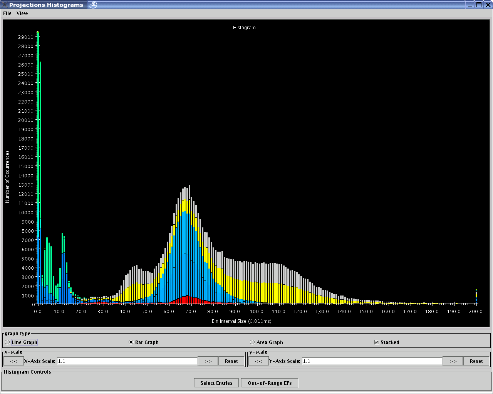

   Histogram view

The use of the tool is somewhat counterintuitive. The dialog box is
created immediately and when the tool window is created, it is defaulted
to a time-based histogram. You may change this histogram to a
message-size-based histogram by selecting the "Message Size" radio
button which would then update the graph using the same parameters
provided in the dialog box. This issue will be fixed in upcoming
editions of Projections.

The following features are, as of this writing, not implemented. They
will be ready in a later release of Projections.

The "Select Entries" button is intended to bring up a color selection
and filtering window that allows you to filter away entry methods from
the count. This offers more control over the analysis (e.g. when you
already know EP 5 takes 20-30ms and you want to know if there are other
entry points also takes 20-30ms).

The "Out-of-Range EPs" button is intended to bring up a table detailing
all the entry methods that fall into the overflow (last) bin. This list
will, by default, be listed in descending order of time taken by the
entry methods.

The performance of this view is affected by the number of bins the user
wishes to analyze. We recommend the user limits the analysis to 1,000
bins or less.

Overview
~~~~~~~~

Overview (see figure :numref:`overview`) gives users an overview
of the utilization of all processors during the execution over a
user-specified time range.

The dialog box of the tool allows you to specify the time period within
which to load overview information. This dialog box is exactly the same
as that of the Timeline tool (see section :numref:`sec::timeline view`).

This tool provides support for the following menu options:

-  **File** provides 1 option: *Close* closes the current tool.

-  **Modify** provides 1 option: *Set Range* reloads the dialog box and
   allows the user to specify new parameters for rendering new overview
   information.

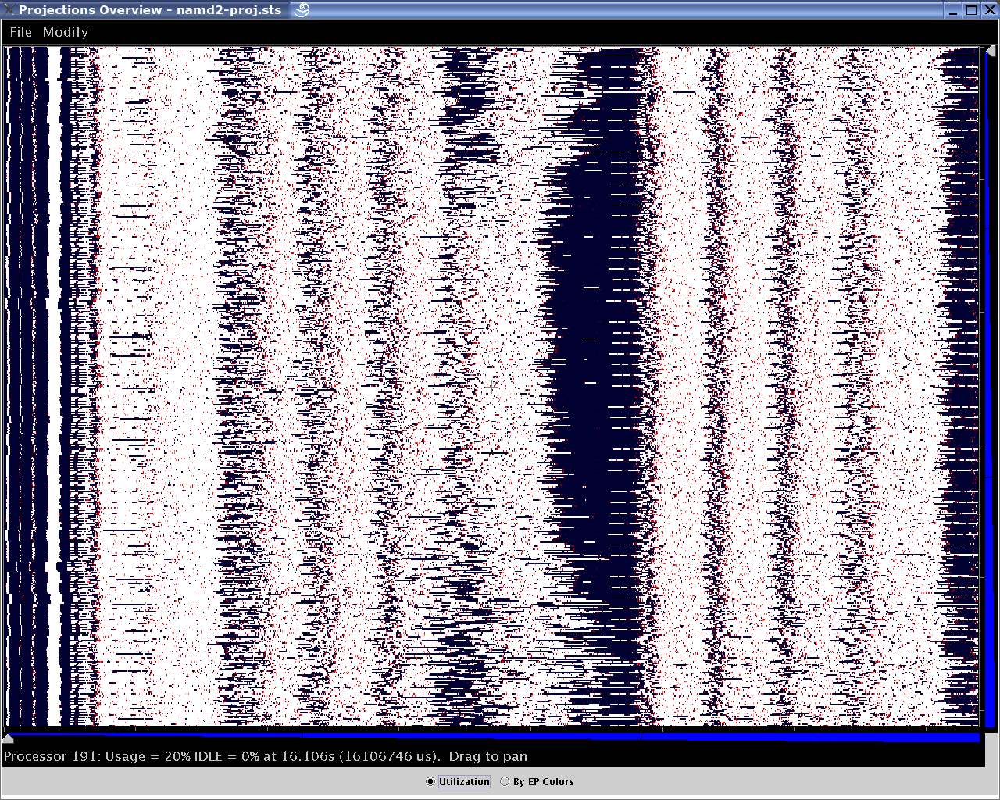

   Different Overview presentation forms (1) - Overview.

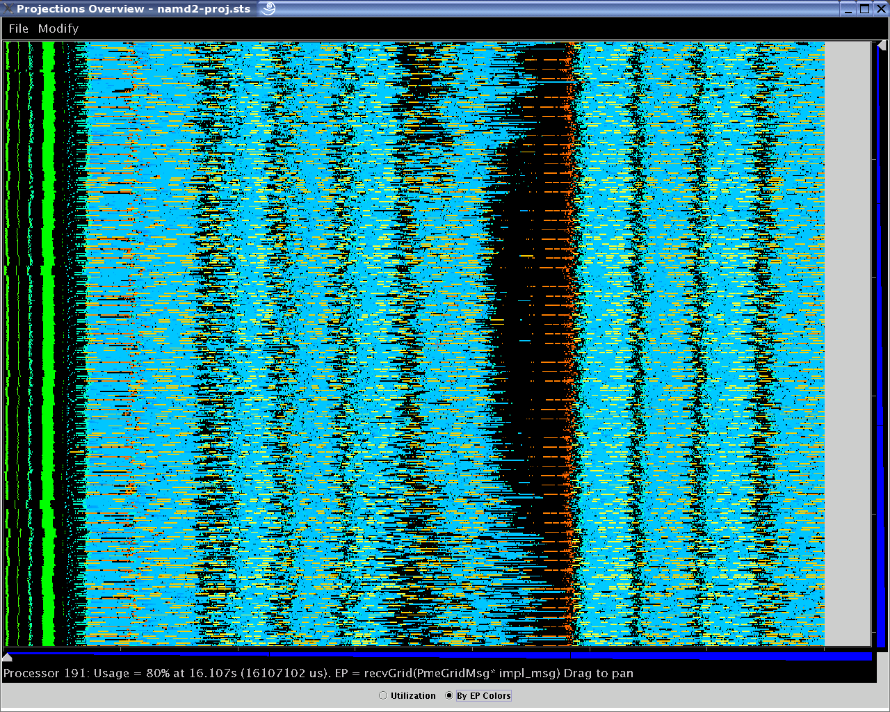

   Different Overview presentation forms (2) - Overview with dominant Entry Method colors.

The view currently hard codes the number of intervals to 7,000
independent of the time-range desired.

Each processor has a row of colored bars in the display, different
colors indicating different utilization at that time (white representing
100 utilization and black representing idle time). The usage of a
processor at the specific time is displayed in the status bar below the
graph. Vertical and horizontal zoom is enabled by two zooming bars to
the right and lower of the graph. Panning is possible by clicking on any
part of the display and dragging the mouse.

The "by EP colors" radio button provides more detail by replacing the
utilization colors with the colors of the most significant entry method
execution time in that time-interval on that processor represented by
the cells (as illustrated in figure :numref:`overview-ep`).

The Overview tool uses memory proportional to the number of processors
selected. If an out-of-memory error is encountered, try again by
skipping processors (e.g. ``0-8191:2`` instead of ``0-8191``). This
should show the general application structure almost as well as using
the full processor range.

Animations
~~~~~~~~~~

This window (see figure :numref:`animation`) animates the processor
usage over a specified range of time and a specified interval size.

The dialog box to load animation information is exactly the same as that
of the Graph tool (see section :numref:`sec::graph view`).

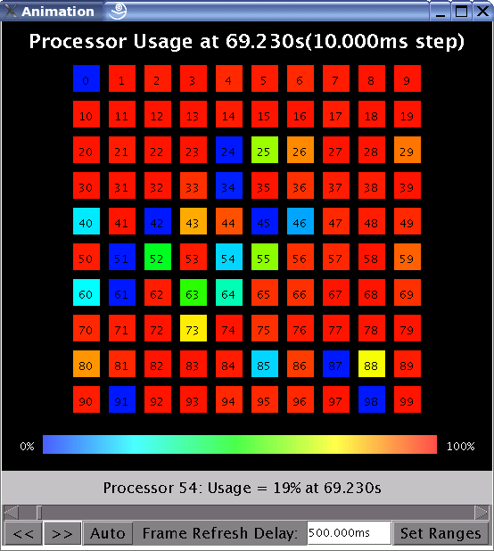

   Animation View

A color temperature bar serves as a legend for displaying different
processor utilization as the animation progresses. Each time interval
will have its data rendered as a frame. A frame displays in text on the
top of the display the currently represented execution time of the
application and what the size of an interval is.

Each selected processor is laid out in a 2-D plot as close to a square
as possible. The view employs a color temperature ranging from blue
(cool - low utilization) to bright red (hot - high utilization) to
represent utilization.

You may manually update the frames by using the "<<" or
">>" buttons to visualize the preceding or next frames
respectively. The "Auto" button toggles automatic animation given the
desired refresh rate.

The "Frame Refresh Delay" field allows you to select the real time delay
between frames. It is a time-based field (see section
:numref:`sec::misc` for special features in using time-based fields).

The “Set Ranges” button allows you to set new parameters for this view
via the dialog box.

This view has no known performance issues.

Time Profile Graph
~~~~~~~~~~~~~~~~~~

The Time Profile view (see figure :numref:`time profile`) is a
visualization of the amount of time contributed by each entry method
summed across all processors and displayed by user-adjustable time
intervals.

Time Profile's dialog box is exactly the same as that of the Graph tool
(see section :numref:`sec::graph view`).

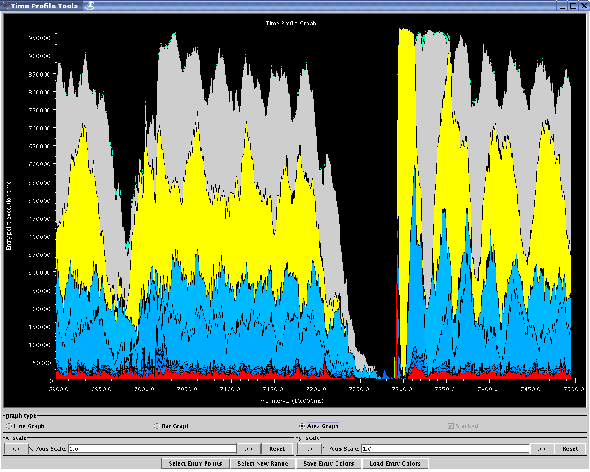

   Time Profile Graph View

Standard graph features can be employed for the main display of this
view (see section :numref:`sec::misc`).

Under the tool options, one may:

-  Filter the set of entry methods to be displayed on the graph via the
   "Select Entry Points" button. One may also modify the color set used
   for the entry methods via this option.

-  Use the "Select New Range" button to reload the dialog box for the
   tool and set new parameters for visualization (eg. different time
   range, different set of processors or different interval sizes).

-  Store the current set of entry method colors to disk (to the same
   directory where the trace logs are stored). This is done via the
   "Save Entry Colors" button.

-  Load the stored set of entry method colors (if it exists) from disk
   (from the same directory where the trace logs are stored). This is
   done via the "Load Entry Colors" button.

This tool's performance is tied to the number of intervals desired by
the user. We recommend that the user stick to visualizing 1,000
intervals or less.

User Events Profile
~~~~~~~~~~~~~~~~~~~

The User Events view is essentially a usage profile (See section
:numref:`sec::usage profile`) of bracketed user events (if any) that
were recorded over a specified time range. The x-axis holds bars of data
associated with each processor while the y-axis represents the time
spent by each user event. Each user event is assigned a color.

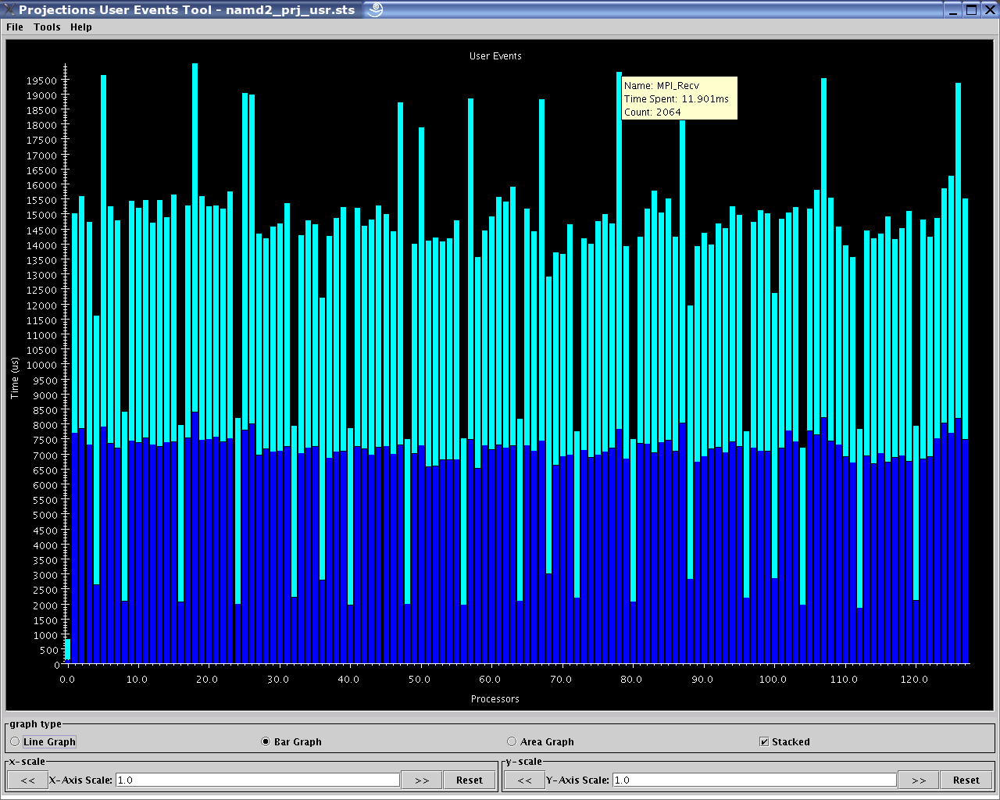

   User Events Profile View

It is important to note that user-events can be arbitrarily nested. The
view currently displays information based on raw data without regard to
the way the events are nested. Memory usage is proportional to the
number of processors to be displayed.

Performance Counters
~~~~~~~~~~~~~~~~~~~~

This view is enabled when Charm++ is compiled with the ``papi`` option,
which enables the collection of performance counter data using PAPI.
Currently, this collects the highest level cache misses and accesses
available on the system (``PAPI_L1_TCM`` and ``PAPI_L1_TCA``,
``PAPI_L2_TCM`` and ``PAPI_L2_TCA``, or ``PAPI_L3_TCM`` and
``PAPI_L3_TCA``) on all platforms except Cray, where
it collects ``PAPI_FP_OPS``, ``PAPI_TOT_INS``,
``perf::PERF_COUNT_HW_CACHE_LL:MISS``, ``DATA_PREFETCHER:ALL``,
``PAPI_L1_DCA`` and ``PAPI_TOT_CYC``. This tool shows the values of the
collected performance counters on different PEs, broken down by entry
point. An example is show in Figure :numref:`performance counters`.

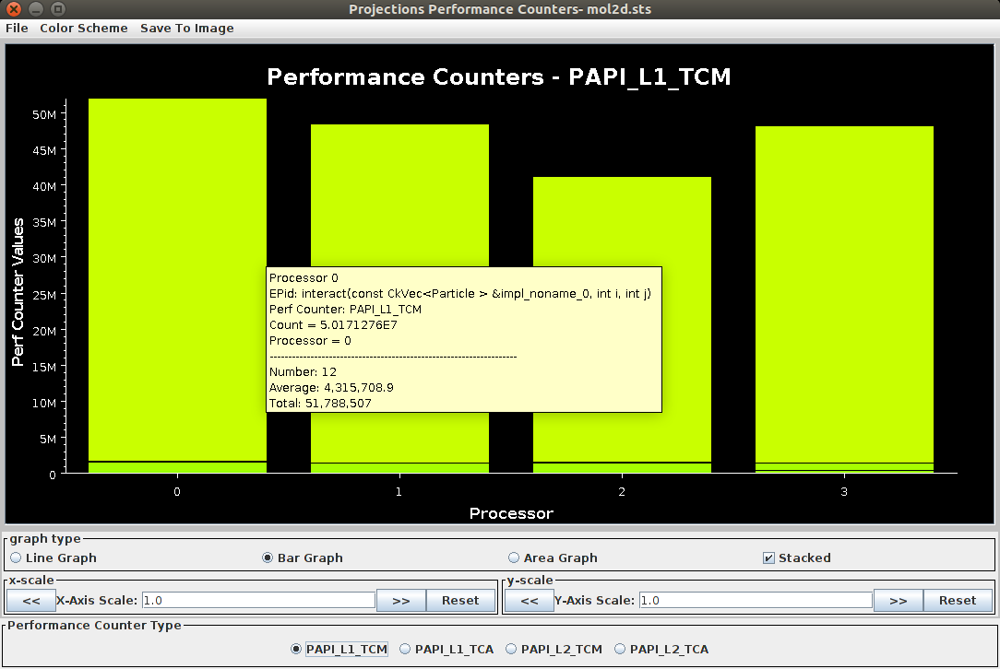

   Performance Counters View

Outlier Analysis
~~~~~~~~~~~~~~~~

For performance logs generated from large numbers of processors, it is
often difficult to view in detail the behavior of poorly behaved
processors. This view attempts to present information similar to usage
profile but only for processors whose behavior is “extreme”.

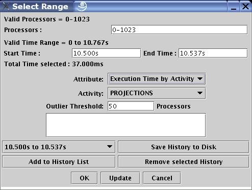

   Outlier Analysis Selection Dialog

"Extreme" processors are identified through the application of
heuristics specific to the attribute that analysts wish to study applied
to a specific activity type. You can specify the number of “extreme”
processors are to be picked out by Projections by filling the
appropriate number in the field “Outlier Threshold”. The default is to
pick 10% of the total number of processors up to a cap of 20. As an
example, an analyst may wish to find "extreme" processors with respect
to the idle time of normal Charm++ trace events.

Figure :numref:`outlier dialog` shows the choices available to this
tool. Specific to this view are two pull-down menus: *Attribute* and
*Activity*.

There are two *Activity* options:

#. The *Projections* activity type refer to the entry methods executed
   by the Charm++ runtime system.

#. The *User Events* activity type refer to records of events as
   captured through ``traceUserEvent``-type calls described in section
   :numref:`sec::user events`.

There are four *Attribute* options:

#. *Execution time by Activity* tells the tool to apply heuristics based
   on the execution time of each instance of an activity occurring
   within the specified time range.

#. *Idle time* tells the tool to apply a simple sort over all processors
   on the least total idle time recorded. This will work only for the
   *Projections* activity type.

#. *Msgs sent by Activity* tells the tool to apply heuristics based on
   the number of messages sent over each instance of an activity
   occurring within the specified time range. This option is currently
   not implemented but is expected to work over all activity types.

#. *Bytes sent by Activity* tells the tool to apply heuristics based on
   the size (in bytes) of messages sent over each instance of an
   activity occurring within the specified time range. This option is
   currently not implemented but is expected to work over all activity
   types.

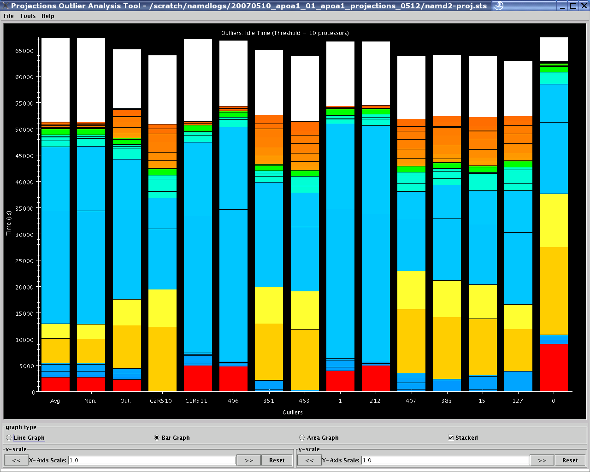

   Outlier Analysis View

At the same time, a :math:`k`-means clustering algorithm is applied to the data
to help identify processors with exemplar behavior that is
representative of each cluster (or equivalence class) identified by the
algorithm. You can control the value of :math:`k` by filling in the appropriate
number in the field “Number of Clusters”. The default value is 5.

The result of applying the required heuristics to the appropriate
*attribute* and *activity* types results in a chart similar to figure
:numref:`outlier view`. This is essentially a usage profile that
shows, over the user’s selected time range, from left to right:

-  A bar representing the global average of execution time of each
   activity over all processors.

-  A bar representing the average activity profile of all non-outlier
   (or non-extreme) processors.

-  A bar representing the average activity profile of all outlier (or
   extreme) processors identified by the heuristics.

-  Bars representing the activity profile of a representative
   processor from each cluster of processors identified by the
   application of the :math:`k`-means clustering algorithm.

-  Bars representing the activity profile of each identified outlier
   processor, sorted in order of significance (rightmost processor bar
   is the most significant).

The tool helps the user reduce the number of processor bars that must be
visually examined in order to identify candidates for more detailed
study. To further the cause of this goal, if the analyst has the
*timeline* view (see section :numref:`sec::timeline view`) open, a
mouse-click on any of the processor activity profile bars (except for
group-averaged bars) will load that processor’s detailed timeline (over
the time range specified in the timeline view) into the timeline view
itself.

Online Live Analysis
~~~~~~~~~~~~~~~~~~~~

Projections provides a continuous performance monitoring tool - CCS
streaming. Different from other tools discussed above, which are used to
visualize post-mortem data, CCS streaming visualizes the running
programs. In order to use it, the Charm++ program needs to be linked
with ``-tracemode utilization``. The command line needs to include
``++server ++server-port <port>``. ``<port>`` is the socket port
number on the server side.

Multirun Analysis
~~~~~~~~~~~~~~~~~

Noise Miner
~~~~~~~~~~~

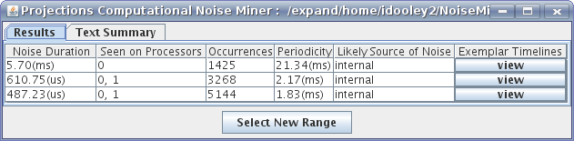

   NoiseMiner View showing a 5.7 ms noise component that occurred 1425
   times during a run. In this case, MPI calls to a faulty MPI
   implementation took an extra 5.7 ms to return.

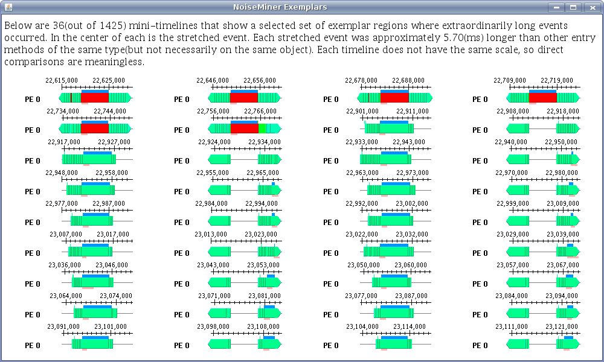

   NoiseMiner noise component view showing miniature timelines for one
   of the noise components.

The NoiseMiner view (see figure :numref:`noiseminer1` and
:numref:`noiseminer2`) displays statistics about abnormally
long entry methods. Its purpose is to detect symptoms consistent with
*Operating System Interference* or *Computational Noise* or *Software
Interference*. The abnormally long events are filtered and clustered
across multiple dimensions to produce a concise summary. The view
displays both the duration of the events as well as the rate at which
they occur. The initial dialog box allows a selection of processors and
a time range. The user should select a time range that ignores any
startup phase where events have chaotic durations. The tool makes only a
single pass through the log files using a small bounded amount of
memory, so the user should select as large time range as possible.

The tool uses stream mining techniques to produce its results by making
only one pass through the input data while using a limited amount of
memory. This allows NoiseMiner to be very fast and scalable.

The initial result window shows a list of zero or more noise components.
Each noise component is a cluster of events whose durations are
abnormally long. The noise duration for each event is computed by
comparing the actual duration of the event with an expected duration of
the event. Each noise component contains events of different types
across one or more processors, but all the events within the noise
component have similar noise durations.

Clicking on the "view" button for a noise component opens a window
similar to figure :numref:`noiseminer2`. This second window
displays up to 36 miniature timelines, each for a different event
associated with the noise component.

NoiseMiner works by storing histograms of each entry method’s duration.
The histogram bins contain a window of recent occurrences as well as an
average duration and count. After data stream has been parsed into the
histogram bins, the histogram bins are clustered to determine the
expected entry method duration. The histograms are then normalized by
the expected duration so that they represent the abnormally stretched
amounts for the entry methods. Then the histogram bins are clustered by
duration and across processors. Any clusters that do not contribute much
to the overall runtime are dropped.

.. _sec::misc:

Miscellaneous features
----------------------

Standard Graph Display Interface
~~~~~~~~~~~~~~~~~~~~~~~~~~~~~~~~

A standard graph display (an example of which can be found with the Main
Summary Graph - figure :numref:`mainwindow`) has the following
features:

-  **Graph types** can be selected between "Line Graph" which connects
   each data point with a colored line representing the appropriate data
   entry. This information may be "stacked" or "unstacked" (controlled
   by the checkbox to the right). A "stacked" graph places one data
   point set (Y values) on top of another. An "unstacked" graph simply
   uses the data point’s Y value to directly determine the point’s
   position; "Bar Graph" (the default) which draws a colored bar for
   each data entry and the value of the data point determines its height
   or starting position (depending on whether the bar graph is "stacked"
   or "unstacked"). A "Bar Graph" displayed in "unstacked" mode draws
   its bars in a tallest to shortest order so that the large Y values do
   not cover over the small Y values; "Area Graph" is similar to a "Line
   Graph" except that the area under the lines for a particular Y data
   point set is also colored by the data’s appropriate color. "Area
   Graph"s are always stacked.

-  **x-scale** allows the user to scale the X-Axis. This can be done by
   directly entering a scaling factor in the text field (simple numeric
   field - see below) or by using the ":math:`<<`" or ":math:`>>`"
   buttons to increase or decrease the scale by 0.25 each time. The
   "Reset" button changes the scale factor back to 1.0. A scrollbar
   automatically appears if the scale factor causes the canvas to be
   larger than the window.

-  **y-scale** allows the user to scale the Y-Axis. This functions
   similarly to the **x-scale** feature where the buttons and fields are
   concerned.

Standard Dialog Features
~~~~~~~~~~~~~~~~~~~~~~~~

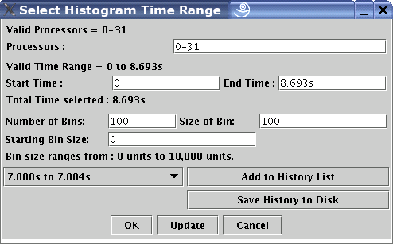

   An example Dialog with standard fields

Figure :numref:`standard dialog` shows a sample dialog box with
standard features. The following are standard features that can be
employed in such a dialog box:

-  **Moving from field to field** via the tab key causes the dialog box
   update the last field input by the user. It also performs a
   consistency check. Whenever it finds an inconsistency, it will move
   mouse focus onto the offending field, disabling the "OK" button so as
   to force the user to fix the inconsistency. Examples of inconsistency
   includes: input that violates a field’s format; input whose value
   violates constraints (eg. start time larger than end time); or
   out-of-range stand-alone values.

-  **Available buttons** include "OK" which confirms the user’s choice
   of parameters. This button is only activated if the dialog box
   considers the parameters’ input to be consistent. "Update" causes the
   dialog box to update the last field input by the user and perform a
   consistency check. This is similar in behavior to the user tabbing
   between fields. "Cancel" closes the dialog box without modifying any
   parameters if the tool has already been loaded or aborts the tool’s
   load attempt otherwise.

-  **Parameter History** allows the user to quickly access information
   for all tools for a set of frequently needed time periods. An example
   of such a use is the desire by the analyst to view a particular phase
   or timestep of a computation without having to memorize or write on a
   piece of paper when exactly the phase or timestep occurred.

   It consists of a pull-down text box and 2 buttons. "Add to History
   List" adds the current time range to the pull-down list to the left
   of the button. The dialog box maintains up to 5 entries, replacing
   older entries with newer ones. "Remove Selected History" removes the
   currently selected entry in the history list. "Save History to Disk"
   stores current history information to the file "ranges.hst" in the
   same directory where your logs are stored. Note that you will need
   write access to that directory to successfully store history
   information. A more flexible scheme is currently being developed and
   will be released in a later version of Projections. Clicking on the
   pull-down list allows the user to select one out of up to 5 possible
   time ranges. You can do so by moving the mouse up or down the list.
   Clicking on any one item changes the start and end times on the
   dialog box.

Data Fields
~~~~~~~~~~~

Throughout Projections tools and dialog boxes (see sample figure
:numref:`standard dialog`), data entry fields are provided. Unless
otherwise specified, these can be of the following standard field with
some format requirements:

-  **Simple numeric fields**: An example can be found in figure
   :numref:`standard dialog` for "# of Time Bins:". This field expects
   a single number.

-  **Time-Based Field**: An example can be found in figure
   :numref:`standard dialog` for "Start Time:". This field expects a
   single simple or floating point number followed by a time-scale
   modifier. The following modifiers are supported: *none* - this is the
   default and means the input number represents time in microseconds. A
   whole number is expected; *The characters "us"* - the input number
   represents time in microseconds. A whole number is expected; *The
   characters "ms"* - the input number represents time in milliseconds.
   This can be a whole number or floating point number; or *The
   character "s"* - the input number represents time in seconds. This
   can be a whole number or floating point number.

-  **Processor-Based Field**: An example can be found in figure
   :numref:`standard dialog` for "Processors:". This field expects a
   single whole number, a list of whole numbers, a range, or a mixed
   list of whole numbers and ranges. Here are some examples which makes
   the format clearer:

   eg: Want to see processors 1, 3, 5, 7: Enter ``1,3,5,7``

   eg: Want to see processors 1, 2, 3, 4: Enter ``1-4``

   eg: Want to see processors 1, 2, 3, 7: Enter ``1-3,7``

   eg: Want to see processors 1, 3, 4, 5, 7, 8: Enter ``1,3-5,7-8``

   Ranges also allow skip-factors. Here are some examples:

   eg: Want to see processors 3, 6, 9, 12, 15: Enter ``3-15:3``

   eg: Want to see processors 1, 3, 6, 9, 11, 14: Enter ``1,3-9:3,11,14``

   This feature is extremely flexible. It will normalize your input to a
   canonical form, tolerating duplication of entries as well as
   out-of-order entries (ie. ``4,6,3`` is the same as ``3-4,6``).

.. _sec::known issues:

Known Issues
------------

This section lists known issues and bugs with the Projections framework
that we have not resolved at this time.

-  Charm++ scheduler idle time is known to be incorrectly recorded on
   the BG/L machine at IBM TJ Watson.

-  End-of-Run analysis techniques (while tracing applications) are
   currently known to hang for applications that make multiple calls to
   traceBegin() and traceEnd() on the same processor through multiple
   Charm++ objects.
